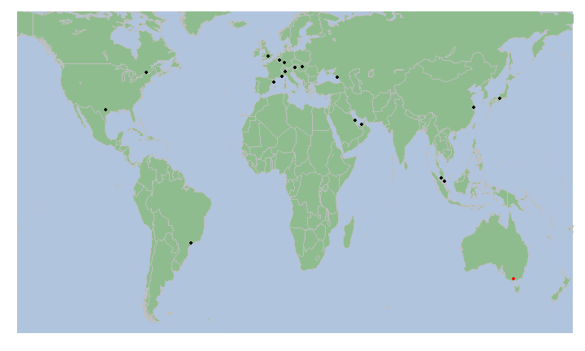

## Fone

- **Fone** is a simple shiny application that presents circuit location on a world map and race results in two separate tabs
- Receives two user inputs: Year and circuit

---

## Source data/API

> - Fone utilises the [Ergast API](http://ergast.com/mrd/)
> - Downloads data as JSON objects 
> - Convert to data frames before display 

---

## Race locations

- Race locations are displayed in the first tab
- The current selected circuit is marked red on the world map

 

```
## $data
## $data[[1]]
##                x          y group PANEL
## 1     -1.334e+02  58.424160     1     1
## 2     -1.323e+02  57.163082     1     1
## 3     -1.320e+02  56.986095     1     1
## 4     -1.319e+02  56.740009     1     1
## 5     -1.302e+02  56.099445     1     1
## 6     -1.300e+02  55.911686     1     1
## 7     -1.300e+02  55.921654     1     1
## 8     -1.300e+02  55.864986     1     1
## 9     -1.300e+02  55.429428     1     1
## 10    -1.301e+02  55.048355     1     1
## 11    -1.298e+02  55.506950     1     1
## 12    -1.296e+02  55.459450     1     1
## 13    -1.300e+02  55.000854     1     1
## 14    -1.298e+02  55.004177     1     1
## 15    -1.302e+02  54.845581     1     1
## 16    -1.301e+02  54.708359     1     1
## 17    -1.303e+02  54.700565     1     1
## 18    -1.301e+02  54.460556     1     1
## 19    -1.303e+02  54.573887     1     1
## 20    -1.304e+02  54.448639     1     1
## 21    -1.303e+02  54.329750     1     1
## 22    -1.303e+02  54.229195     1     1
## 23    -1.298e+02  54.229710     1     1
## 24    -1.298e+02  54.218307     1     1
## 25    -1.298e+02  54.009178     1     1
## 26    -1.301e+02  54.071690     1     1
## 27    -1.294e+02  53.427227     1     1
## 28    -1.290e+02  53.882500     1     1
## 29    -1.287e+02  53.976120     1     1
## 30    -1.286e+02  53.861641     1     1
## 31    -1.288e+02  53.650280     1     1
## 32    -1.280e+02  53.364429     1     1
## 33    -1.284e+02  53.438629     1     1
## 34    -1.289e+02  53.535000     1     1
## 35    -1.289e+02  53.459427     1     1
## 36    -1.286e+02  53.214432     1     1
## 37    -1.285e+02  52.898045     1     1
## 38    -1.281e+02  52.902798     1     1
## 39    -1.281e+02  52.837765     1     1
## 40    -1.283e+02  52.380260     1     1
## 41    -1.280e+02  52.521664     1     1
## 42    -1.279e+02  52.346687     1     1
## 43    -1.279e+02  52.304745     1     1
## 44    -1.277e+02  52.354420     1     1
## 45    -1.270e+02  52.739162     1     1
## 46    -1.270e+02  52.625828     1     1
## 47    -1.272e+02  52.385532     1     1
## 48    -1.268e+02  52.385815     1     1
## 49    -1.269e+02  52.237766     1     1
## 50    -1.270e+02  52.275295     1     1
## 51    -1.278e+02  51.929169     1     1
## 52    -1.277e+02  51.533886     1     1
## 53    -1.275e+02  51.672199     1     1
## 54    -1.274e+02  51.768341     1     1
## 55    -1.266e+02  51.769714     1     1
## 56    -1.273e+02  51.658905     1     1
## 57    -1.277e+02  51.325558     1     1
## 58    -1.275e+02  51.323898     1     1
## 59    -1.277e+02  51.257778     1     1
## 60    -1.276e+02  51.098038     1     1
## 61    -1.275e+02  51.097523     1     1
## 62    -1.272e+02  50.867767     1     1
## 63    -1.269e+02  50.868053     1     1
## 64    -1.265e+02  50.956917     1     1
## 65    -1.265e+02  50.951130     1     1
## 66    -1.262e+02  50.951935     1     1
## 67    -1.264e+02  50.907761     1     1
## 68    -1.262e+02  50.773628     1     1
## 69    -1.262e+02  50.703899     1     1
## 70    -1.260e+02  50.704987     1     1
## 71    -1.258e+02  50.705563     1     1
## 72    -1.256e+02  51.081936     1     1
## 73    -1.256e+02  50.818604     1     1
## 74    -1.262e+02  50.641678     1     1
## 75    -1.261e+02  50.598305     1     1
## 76    -1.262e+02  50.570000     1     1
## 77    -1.261e+02  50.486404     1     1
## 78    -1.259e+02  50.488354     1     1
## 79    -1.258e+02  50.485546     1     1
## 80    -1.255e+02  50.669979     1     1
## 81    -1.255e+02  50.493050     1     1
## 82    -1.254e+02  50.495003     1     1
## 83    -1.252e+02  50.495003     1     1
## 84    -1.251e+02  50.499985     1     1
## 85    -1.249e+02  50.868053     1     1
## 86    -1.249e+02  50.769444     1     1
## 87    -1.251e+02  50.419712     1     1
## 88    -1.250e+02  50.420284     1     1
## 89    -1.247e+02  50.425842     1     1
## 90    -1.246e+02  50.423035     1     1
## 91    -1.246e+02  50.399429     1     1
## 92    -1.247e+02  50.047806     1     1
## 93    -1.245e+02  49.831688     1     1
## 94    -1.240e+02  49.877525     1     1
## 95    -1.239e+02  50.039440     1     1
## 96    -1.239e+02  50.169445     1     1
## 97    -1.239e+02  50.169159     1     1
## 98    -1.239e+02  50.033600     1     1
## 99    -1.238e+02  49.700024     1     1
## 100   -1.235e+02  49.701393     1     1
## 101   -1.237e+02  49.606400     1     1
## 102   -1.240e+02  49.726376     1     1
## 103   -1.237e+02  49.438866     1     1
## 104   -1.233e+02  49.584972     1     1
## 105   -1.233e+02  49.354984     1     1
## 106   -1.229e+02  49.448318     1     1
## 107   -1.231e+02  49.306396     1     1
## 108   -1.231e+02  49.107239     1     1
## 109   -1.231e+02  49.002502     1     1
## 110   -1.230e+02  49.001640     1     1
## 111   -1.230e+02  49.005253     1     1
## 112   -1.228e+02  49.001930     1     1
## 113   -1.227e+02  48.999981     1     1
## 114   -1.224e+02  48.999981     1     1
## 115   -1.221e+02  48.999981     1     1
## 116   -1.219e+02  48.999981     1     1
## 117   -1.216e+02  48.999981     1     1
## 118   -1.213e+02  48.999981     1     1
## 119   -1.210e+02  48.999981     1     1
## 120   -1.208e+02  48.999981     1     1
## 121   -1.205e+02  48.999981     1     1
## 122   -1.202e+02  48.999981     1     1
## 123   -1.199e+02  48.999981     1     1
## 124   -1.196e+02  48.999981     1     1
## 125   -1.194e+02  48.999981     1     1
## 126   -1.191e+02  48.999981     1     1
## 127   -1.188e+02  48.999981     1     1
## 128   -1.185e+02  48.999981     1     1
## 129   -1.183e+02  48.999981     1     1
## 130   -1.180e+02  48.999981     1     1
## 131   -1.177e+02  48.999981     1     1
## 132   -1.174e+02  48.999981     1     1
## 133   -1.171e+02  48.999981     1     1
## 134   -1.169e+02  48.999981     1     1
## 135   -1.166e+02  48.999981     1     1
## 136   -1.163e+02  48.999981     1     1
## 137   -1.160e+02  48.999981     1     1
## 138   -1.157e+02  48.999981     1     1
## 139   -1.155e+02  48.999981     1     1
## 140   -1.152e+02  48.999981     1     1
## 141   -1.149e+02  48.999981     1     1
## 142   -1.146e+02  48.999981     1     1
## 143   -1.144e+02  48.999981     1     1
## 144   -1.141e+02  48.999981     1     1
## 145   -1.138e+02  48.999981     1     1
## 146   -1.135e+02  48.999981     1     1
## 147   -1.132e+02  48.999981     1     1
## 148   -1.130e+02  48.999981     1     1
## 149   -1.127e+02  48.999981     1     1
## 150   -1.124e+02  48.999981     1     1
## 151   -1.121e+02  48.999981     1     1
## 152   -1.119e+02  48.999981     1     1
## 153   -1.116e+02  48.999981     1     1
## 154   -1.113e+02  48.999981     1     1
## 155   -1.110e+02  48.999981     1     1
## 156   -1.107e+02  48.999981     1     1
## 157   -1.105e+02  48.999981     1     1
## 158   -1.102e+02  48.999981     1     1
## 159   -1.099e+02  48.999981     1     1
## 160   -1.096e+02  48.999981     1     1
## 161   -1.094e+02  48.999981     1     1
## 162   -1.091e+02  48.999981     1     1
## 163   -1.088e+02  48.999981     1     1
## 164   -1.085e+02  48.999981     1     1
## 165   -1.082e+02  48.999981     1     1
## 166   -1.080e+02  48.999981     1     1
## 167   -1.077e+02  48.999981     1     1
## 168   -1.074e+02  48.999981     1     1
## 169   -1.071e+02  48.999981     1     1
## 170   -1.068e+02  48.999981     1     1
## 171   -1.066e+02  48.999981     1     1
## 172   -1.063e+02  48.999981     1     1
## 173   -1.060e+02  48.999981     1     1
## 174   -1.057e+02  48.999981     1     1
## 175   -1.055e+02  48.999981     1     1
## 176   -1.052e+02  48.999981     1     1
## 177   -1.049e+02  48.999981     1     1
## 178   -1.046e+02  48.999981     1     1
## 179   -1.043e+02  48.999981     1     1
## 180   -1.041e+02  48.999981     1     1
## 181   -1.038e+02  48.999981     1     1
## 182   -1.035e+02  48.999981     1     1
## 183   -1.032e+02  48.999981     1     1
## 184   -1.030e+02  48.999981     1     1
## 185   -1.027e+02  48.999981     1     1
## 186   -1.024e+02  48.999981     1     1
## 187   -1.021e+02  48.999981     1     1
## 188   -1.018e+02  48.999981     1     1
## 189   -1.016e+02  48.999981     1     1
## 190   -1.013e+02  48.999981     1     1
## 191   -1.010e+02  48.999981     1     1
## 192   -1.007e+02  48.999981     1     1
## 193   -1.005e+02  48.999981     1     1
## 194   -1.002e+02  48.999981     1     1
## 195   -9.990e+01  48.999981     1     1
## 196   -9.962e+01  48.999981     1     1
## 197   -9.934e+01  48.999981     1     1
## 198   -9.906e+01  48.999981     1     1
## 199   -9.878e+01  48.999981     1     1
## 200   -9.851e+01  48.999981     1     1
## 201   -9.823e+01  48.999981     1     1
## 202   -9.795e+01  48.999981     1     1
## 203   -9.767e+01  48.999981     1     1
## 204   -9.739e+01  48.999981     1     1
## 205   -9.712e+01  48.999981     1     1
## 206   -9.684e+01  48.999981     1     1
## 207   -9.656e+01  48.999981     1     1
## 208   -9.628e+01  48.999981     1     1
## 209   -9.600e+01  48.999981     1     1
## 210   -9.573e+01  48.999981     1     1
## 211   -9.545e+01  48.999981     1     1
## 212   -9.517e+01  48.999981     1     1
## 213   -9.515e+01  48.999466     1     1
## 214   -9.515e+01  49.376644     1     1
## 215   -9.480e+01  49.166656     1     1
## 216   -9.470e+01  48.864189     1     1
## 217   -9.383e+01  48.604469     1     1
## 218   -9.336e+01  48.608597     1     1
## 219   -9.246e+01  48.383362     1     1
## 220   -9.229e+01  48.321083     1     1
## 221   -9.144e+01  48.047207     1     1
## 222   -9.104e+01  48.189705     1     1
## 223   -9.084e+01  48.208611     1     1
## 224   -9.071e+01  48.095280     1     1
## 225   -9.056e+01  48.094997     1     1
## 226   -9.039e+01  48.097229     1     1
## 227   -8.958e+01  48.002804     1     1
## 228   -8.958e+01  48.010540     1     1
## 229   -8.922e+01  48.427197     1     1
## 230   -8.883e+01  48.463348     1     1
## 231   -8.883e+01  48.343887     1     1
## 232   -8.835e+01  48.829700     1     1
## 233   -8.845e+01  48.544422     1     1
## 234   -8.814e+01  48.807755     1     1
## 235   -8.816e+01  48.978035     1     1
## 236   -8.632e+01  48.640850     1     1
## 237   -8.633e+01  48.625267     1     1
## 238   -8.573e+01  47.943043     1     1
## 239   -8.493e+01  47.855270     1     1
## 240   -8.491e+01  47.512238     1     1
## 241   -8.465e+01  47.225815     1     1
## 242   -8.468e+01  46.962200     1     1
## 243   -8.449e+01  46.847206     1     1
## 244   -8.446e+01  46.755020     1     1
## 245   -8.449e+01  46.477249     1     1
## 246   -8.410e+01  46.427227     1     1
## 247   -8.360e+01  46.283588     1     1
## 248   -8.165e+01  46.117775     1     1
## 249   -8.165e+01  46.035267     1     1
## 250   -8.163e+01  46.019455     1     1
## 251   -8.067e+01  45.807518     1     1
## 252   -8.018e+01  45.388340     1     1
## 253   -8.012e+01  45.251690     1     1
## 254   -8.010e+01  45.130280     1     1
## 255   -7.966e+01  44.751671     1     1
## 256   -8.012e+01  44.757229     1     1
## 257   -8.007e+01  44.480263     1     1
## 258   -8.086e+01  44.656963     1     1
## 259   -8.110e+01  44.757515     1     1
## 260   -8.107e+01  44.905281     1     1
## 261   -8.144e+01  45.239143     1     1
## 262   -8.170e+01  45.239716     1     1
## 263   -8.128e+01  44.704460     1     1
## 264   -8.171e+01  43.904724     1     1
## 265   -8.186e+01  43.268627     1     1
## 266   -8.242e+01  43.016125     1     1
## 267   -8.265e+01  42.554436     1     1
## 268   -8.243e+01  42.450844     1     1
## 269   -8.310e+01  42.238335     1     1
## 270   -8.294e+01  41.989441     1     1
## 271   -8.248e+01  42.027199     1     1
## 272   -8.165e+01  42.478062     1     1
## 273   -8.079e+01  42.638317     1     1
## 274   -8.043e+01  42.646679     1     1
## 275   -7.901e+01  42.977219     1     1
## 276   -7.906e+01  43.102757     1     1
## 277   -7.906e+01  43.273041     1     1
## 278   -7.976e+01  43.272236     1     1
## 279   -7.918e+01  43.760567     1     1
## 280   -7.750e+01  43.949989     1     1
## 281   -7.703e+01  43.975025     1     1
## 282   -7.699e+01  44.050831     1     1
## 283   -7.712e+01  44.049168     1     1
## 284   -7.718e+01  44.147488     1     1
## 285   -7.731e+01  44.144733     1     1
## 286   -7.744e+01  44.144451     1     1
## 287   -7.705e+01  44.101364     1     1
## 288   -7.581e+01  44.502491     1     1
## 289   -7.580e+01  44.496647     1     1
## 290   -7.468e+01  45.006695     1     1
## 291   -7.149e+01  45.020561     1     1
## 292   -7.125e+01  45.281143     1     1
## 293   -7.082e+01  45.364449     1     1
## 294   -7.072e+01  45.485859     1     1
## 295   -7.028e+01  46.066093     1     1
## 296   -7.025e+01  46.122757     1     1
## 297   -7.005e+01  46.440006     1     1
## 298   -6.954e+01  47.172245     1     1
## 299   -6.923e+01  47.471386     1     1
## 300   -6.889e+01  47.188061     1     1
## 301   -6.810e+01  47.279736     1     1
## 302   -6.780e+01  47.069973     1     1
## 303   -6.768e+01  45.648350     1     1
## 304   -6.742e+01  45.594719     1     1
## 305   -6.732e+01  45.148617     1     1
## 306   -6.721e+01  45.182762     1     1
## 307   -6.690e+01  45.077511     1     1
## 308   -6.608e+01  45.277245     1     1
## 309   -6.608e+01  45.383583     1     1
## 310   -6.604e+01  45.283604     1     1
## 311   -6.517e+01  45.511124     1     1
## 312   -6.457e+01  45.856964     1     1
## 313   -6.458e+01  45.871117     1     1
## 314   -6.451e+01  45.831123     1     1
## 315   -6.432e+01  45.861946     1     1
## 316   -6.492e+01  45.385017     1     1
## 317   -6.467e+01  45.385822     1     1
## 318   -6.444e+01  45.384159     1     1
## 319   -6.431e+01  45.385822     1     1
## 320   -6.385e+01  45.382214     1     1
## 321   -6.355e+01  45.380260     1     1
## 322   -6.419e+01  45.104729     1     1
## 323   -6.426e+01  45.127472     1     1
## 324   -6.432e+01  45.285267     1     1
## 325   -6.606e+01  44.528046     1     1
## 326   -6.599e+01  44.544720     1     1
## 327   -6.609e+01  44.367500     1     1
## 328   -6.610e+01  43.757473     1     1
## 329   -6.597e+01  43.754726     1     1
## 330   -6.576e+01  43.548630     1     1
## 331   -6.573e+01  43.555275     1     1
## 332   -6.555e+01  43.556137     1     1
## 333   -6.544e+01  43.596413     1     1
## 334   -6.532e+01  43.738338     1     1
## 335   -6.520e+01  43.741661     1     1
## 336   -6.496e+01  43.873039     1     1
## 337   -6.438e+01  44.313358     1     1
## 338   -6.433e+01  44.364468     1     1
## 339   -6.430e+01  44.518879     1     1
## 340   -6.401e+01  44.517216     1     1
## 341   -6.389e+01  44.669163     1     1
## 342   -6.378e+01  44.475849     1     1
## 343   -6.364e+01  44.473618     1     1
## 344   -6.360e+01  44.675579     1     1
## 345   -6.310e+01  44.769146     1     1
## 346   -6.188e+01  45.044453     1     1
## 347   -6.133e+01  45.231693     1     1
## 348   -6.118e+01  45.231407     1     1
## 349   -6.105e+01  45.231121     1     1
## 350   -6.135e+01  45.345829     1     1
## 351   -6.125e+01  45.447472     1     1
## 352   -6.191e+01  45.770851     1     1
## 353   -6.208e+01  45.785858     1     1
## 354   -6.275e+01  45.675564     1     1
## 355   -6.312e+01  45.797779     1     1
## 356   -6.397e+01  45.991955     1     1
## 357   -6.377e+01  46.108032     1     1
## 358   -6.458e+01  46.328049     1     1
## 359   -6.475e+01  46.702763     1     1
## 360   -6.482e+01  46.971653     1     1
## 361   -6.526e+01  47.082806     1     1
## 362   -6.524e+01  47.134716     1     1
## 363   -6.479e+01  47.681950     1     1
## 364   -6.486e+01  47.751965     1     1
## 365   -6.549e+01  47.676678     1     1
## 366   -6.601e+01  47.931416     1     1
## 367   -6.685e+01  47.998333     1     1
## 368   -6.603e+01  48.128628     1     1
## 369   -6.550e+01  48.045834     1     1
## 370   -6.462e+01  48.353626     1     1
## 371   -6.428e+01  48.581089     1     1
## 372   -6.454e+01  48.821388     1     1
## 373   -6.428e+01  48.818066     1     1
## 374   -6.421e+01  48.860809     1     1
## 375   -6.536e+01  49.256668     1     1
## 376   -6.771e+01  48.793888     1     1
## 377   -6.861e+01  48.436935     1     1
## 378   -7.022e+01  47.294456     1     1
## 379   -7.130e+01  46.742241     1     1
## 380   -7.046e+01  47.430019     1     1
## 381   -6.977e+01  48.068352     1     1
## 382   -7.088e+01  48.335293     1     1
## 383   -6.985e+01  48.186668     1     1
## 384   -6.934e+01  48.416367     1     1
## 385   -6.838e+01  49.140812     1     1
## 386   -6.818e+01  49.143047     1     1
## 387   -6.756e+01  49.328918     1     1
## 388   -6.724e+01  49.573338     1     1
## 389   -6.660e+01  50.162510     1     1
## 390   -6.644e+01  50.166924     1     1
## 391   -6.641e+01  50.250576     1     1
## 392   -6.602e+01  50.251377     1     1
## 393   -6.181e+01  50.187206     1     1
## 394   -6.159e+01  50.188354     1     1
## 395   -6.027e+01  50.279167     1     1
## 396   -6.014e+01  50.279453     1     1
## 397   -5.907e+01  50.847771     1     1
## 398   -5.896e+01  50.901970     1     1
## 399   -5.861e+01  51.189194     1     1
## 400   -5.676e+01  51.548611     1     1
## 401   -5.571e+01  52.146378     1     1
## 402   -5.596e+01  52.358601     1     1
## 403   -5.577e+01  52.356369     1     1
## 404   -5.567e+01  52.352757     1     1
## 405   -5.628e+01  52.535015     1     1
## 406   -5.597e+01  52.615574     1     1
## 407   -5.587e+01  52.612480     1     1
## 408   -5.613e+01  52.808605     1     1
## 409   -5.590e+01  52.811413     1     1
## 410   -5.600e+01  52.997219     1     1
## 411   -5.579e+01  53.120293     1     1
## 412   -5.603e+01  53.455528     1     1
## 413   -5.661e+01  53.646095     1     1
## 414   -5.658e+01  53.697491     1     1
## 415   -5.668e+01  53.727226     1     1
## 416   -5.727e+01  53.483318     1     1
## 417   -5.736e+01  53.594185     1     1
## 418   -5.715e+01  53.735821     1     1
## 419   -5.737e+01  54.116093     1     1
## 420   -5.839e+01  54.125259     1     1
## 421   -5.821e+01  54.126122     1     1
## 422   -5.802e+01  54.125546     1     1
## 423   -5.846e+01  54.024189     1     1
## 424   -5.902e+01  53.713879     1     1
## 425   -5.911e+01  53.683048     1     1
## 426   -6.031e+01  53.263874     1     1
## 427   -6.028e+01  53.341110     1     1
## 428   -6.019e+01  53.435535     1     1
## 429   -6.093e+01  53.733356     1     1
## 430   -6.025e+01  53.584732     1     1
## 431   -6.010e+01  53.666092     1     1
## 432   -5.853e+01  54.108070     1     1
## 433   -5.909e+01  54.055817     1     1
## 434   -5.747e+01  54.471958     1     1
## 435   -5.738e+01  54.513325     1     1
## 436   -5.889e+01  54.918060     1     1
## 437   -5.899e+01  55.049156     1     1
## 438   -5.928e+01  55.021656     1     1
## 439   -5.927e+01  55.082214     1     1
## 440   -5.963e+01  54.946365     1     1
## 441   -5.949e+01  55.101639     1     1
## 442   -5.991e+01  55.152805     1     1
## 443   -5.977e+01  55.327209     1     1
## 444   -6.013e+01  55.116364     1     1
## 445   -6.009e+01  55.185287     1     1
## 446   -6.051e+01  55.094189     1     1
## 447   -6.044e+01  55.217491     1     1
## 448   -6.030e+01  55.411091     1     1
## 449   -6.037e+01  55.461113     1     1
## 450   -6.036e+01  55.570831     1     1
## 451   -6.041e+01  55.612198     1     1
## 452   -6.037e+01  55.727768     1     1
## 453   -6.059e+01  55.655289     1     1
## 454   -6.059e+01  55.708916     1     1
## 455   -6.086e+01  55.740253     1     1
## 456   -6.084e+01  55.760536     1     1
## 457   -6.120e+01  55.884186     1     1
## 458   -6.138e+01  55.994705     1     1
## 459   -6.134e+01  56.063061     1     1
## 460   -6.134e+01  56.106091     1     1
## 461   -6.201e+01  56.257751     1     1
## 462   -6.179e+01  56.255287     1     1
## 463   -6.182e+01  56.302498     1     1
## 464   -6.206e+01  56.458630     1     1
## 465   -6.208e+01  56.491920     1     1
## 466   -6.182e+01  56.491119     1     1
## 467   -6.218e+01  56.623356     1     1
## 468   -6.248e+01  56.757771     1     1
## 469   -6.245e+01  56.837757     1     1
## 470   -6.226e+01  56.839703     1     1
## 471   -6.229e+01  56.823605     1     1
## 472   -6.176e+01  56.634182     1     1
## 473   -6.178e+01  56.755825     1     1
## 474   -6.155e+01  56.954468     1     1
## 475   -6.135e+01  56.951088     1     1
## 476   -6.136e+01  57.010273     1     1
## 477   -6.192e+01  57.218029     1     1
## 478   -6.186e+01  57.285583     1     1
## 479   -6.241e+01  57.442513     1     1
## 480   -6.198e+01  57.604141     1     1
## 481   -6.212e+01  57.850861     1     1
## 482   -6.256e+01  57.964996     1     1
## 483   -6.256e+01  57.993587     1     1
## 484   -6.240e+01  57.993065     1     1
## 485   -6.251e+01  58.069729     1     1
## 486   -6.290e+01  58.133045     1     1
## 487   -6.284e+01  58.172237     1     1
## 488   -6.267e+01  58.171947     1     1
## 489   -6.274e+01  58.248039     1     1
## 490   -6.263e+01  58.391388     1     1
## 491   -6.343e+01  58.363598     1     1
## 492   -6.339e+01  58.418320     1     1
## 493   -6.292e+01  58.707203     1     1
## 494   -6.299e+01  58.878059     1     1
## 495   -6.332e+01  58.858063     1     1
## 496   -6.326e+01  58.988579     1     1
## 497   -6.390e+01  58.986408     1     1
## 498   -6.346e+01  59.198917     1     1
## 499   -6.357e+01  59.239998     1     1
## 500   -6.377e+01  59.261940     1     1
## 501   -6.387e+01  59.378597     1     1
## 502   -6.379e+01  59.426094     1     1
## 503   -6.396e+01  59.542801     1     1
## 504   -6.403e+01  59.588352     1     1
## 505   -6.405e+01  59.630810     1     1
## 506   -6.422e+01  59.774170     1     1
## 507   -6.425e+01  59.958885     1     1
## 508   -6.433e+01  60.040817     1     1
## 509   -6.440e+01  59.917809     1     1
## 510   -6.443e+01  59.986103     1     1
## 511   -6.439e+01  60.014183     1     1
## 512   -6.456e+01  60.053596     1     1
## 513   -6.446e+01  60.125847     1     1
## 514   -6.464e+01  60.267765     1     1
## 515   -6.463e+01  60.288338     1     1
## 516   -6.472e+01  60.340534     1     1
## 517   -6.522e+01  59.836391     1     1
## 518   -6.549e+01  59.792213     1     1
## 519   -6.552e+01  59.745579     1     1
## 520   -6.520e+01  59.479153     1     1
## 521   -6.545e+01  59.472507     1     1
## 522   -6.544e+01  59.370571     1     1
## 523   -6.557e+01  59.340839     1     1
## 524   -6.564e+01  59.236675     1     1
## 525   -6.566e+01  59.087475     1     1
## 526   -6.552e+01  59.087761     1     1
## 527   -6.578e+01  58.998608     1     1
## 528   -6.597e+01  58.882240     1     1
## 529   -6.602e+01  58.861675     1     1
## 530   -6.593e+01  58.639996     1     1
## 531   -6.599e+01  58.384457     1     1
## 532   -6.600e+01  58.520302     1     1
## 533   -6.627e+01  58.796646     1     1
## 534   -6.658e+01  58.627216     1     1
## 535   -6.714e+01  58.373058     1     1
## 536   -6.764e+01  58.037758     1     1
## 537   -6.771e+01  58.383083     1     1
## 538   -6.800e+01  58.141403     1     1
## 539   -6.798e+01  58.211941     1     1
## 540   -6.796e+01  58.545288     1     1
## 541   -6.830e+01  58.205582     1     1
## 542   -6.937e+01  57.764973     1     1
## 543   -6.872e+01  58.009739     1     1
## 544   -6.826e+01  58.323608     1     1
## 545   -6.834e+01  58.642803     1     1
## 546   -6.874e+01  58.899147     1     1
## 547   -6.971e+01  58.679188     1     1
## 548   -7.008e+01  58.756649     1     1
## 549   -6.990e+01  58.871639     1     1
## 550   -6.988e+01  58.967781     1     1
## 551   -6.966e+01  58.790001     1     1
## 552   -6.944e+01  59.105583     1     1
## 553   -6.941e+01  59.212494     1     1
## 554   -6.928e+01  59.215534     1     1
## 555   -6.964e+01  59.298321     1     1
## 556   -6.965e+01  59.428902     1     1
## 557   -6.964e+01  59.578327     1     1
## 558   -6.960e+01  59.829170     1     1
## 559   -7.103e+01  60.060532     1     1
## 560   -7.095e+01  60.064423     1     1
## 561   -6.981e+01  60.067516     1     1
## 562   -6.969e+01  60.068611     1     1
## 563   -6.976e+01  60.413357     1     1
## 564   -6.955e+01  60.751915     1     1
## 565   -6.943e+01  60.924721     1     1
## 566   -6.968e+01  61.003616     1     1
## 567   -6.982e+01  60.895844     1     1
## 568   -7.009e+01  60.964432     1     1
## 569   -7.133e+01  61.147202     1     1
## 570   -7.173e+01  61.367786     1     1
## 571   -7.182e+01  61.418900     1     1
## 572   -7.155e+01  61.576401     1     1
## 573   -7.227e+01  61.605854     1     1
## 574   -7.207e+01  61.605568     1     1
## 575   -7.222e+01  61.746918     1     1
## 576   -7.263e+01  61.915535     1     1
## 577   -7.279e+01  61.834694     1     1
## 578   -7.261e+01  61.985264     1     1
## 579   -7.357e+01  62.390289     1     1
## 580   -7.476e+01  62.212219     1     1
## 581   -7.487e+01  62.211643     1     1
## 582   -7.578e+01  62.182480     1     1
## 583   -7.577e+01  62.206371     1     1
## 584   -7.714e+01  62.536964     1     1
## 585   -7.804e+01  62.378887     1     1
## 586   -7.808e+01  61.906944     1     1
## 587   -7.759e+01  61.574169     1     1
## 588   -7.764e+01  61.511658     1     1
## 589   -7.767e+01  61.462788     1     1
## 590   -7.774e+01  61.298634     1     1
## 591   -7.818e+01  60.822506     1     1
## 592   -7.789e+01  60.822792     1     1
## 593   -7.794e+01  60.799477     1     1
## 594   -7.768e+01  60.800850     1     1
## 595   -7.771e+01  60.760571     1     1
## 596   -7.772e+01  60.691929     1     1
## 597   -7.772e+01  60.569149     1     1
## 598   -7.755e+01  60.571381     1     1
## 599   -7.766e+01  60.479706     1     1
## 600   -7.750e+01  60.122234     1     1
## 601   -7.732e+01  60.030567     1     1
## 602   -7.737e+01  59.894714     1     1
## 603   -7.747e+01  59.674469     1     1
## 604   -7.767e+01  59.674187     1     1
## 605   -7.784e+01  59.412518     1     1
## 606   -7.846e+01  58.911407     1     1
## 607   -7.848e+01  58.694138     1     1
## 608   -7.808e+01  58.455273     1     1
## 609   -7.746e+01  58.156651     1     1
## 610   -7.672e+01  57.477749     1     1
## 611   -7.652e+01  56.470261     1     1
## 612   -7.692e+01  55.880287     1     1
## 613   -7.850e+01  55.001656     1     1
## 614   -7.973e+01  54.650833     1     1
## 615   -7.928e+01  54.170811     1     1
## 616   -7.916e+01  54.175564     1     1
## 617   -7.914e+01  54.099419     1     1
## 618   -7.903e+01  54.007805     1     1
## 619   -7.900e+01  53.855572     1     1
## 620   -7.904e+01  53.727516     1     1
## 621   -7.899e+01  53.500565     1     1
## 622   -7.892e+01  53.247776     1     1
## 623   -7.893e+01  53.138054     1     1
## 624   -7.880e+01  52.962498     1     1
## 625   -7.874e+01  52.781960     1     1
## 626   -7.869e+01  52.549168     1     1
## 627   -7.852e+01  52.268875     1     1
## 628   -7.893e+01  51.793034     1     1
## 629   -7.880e+01  51.504436     1     1
## 630   -7.890e+01  51.307510     1     1
## 631   -7.929e+01  51.642235     1     1
## 632   -7.970e+01  51.271416     1     1
## 633   -7.933e+01  50.723896     1     1
## 634   -8.011e+01  51.290550     1     1
## 635   -8.072e+01  51.146683     1     1
## 636   -8.052e+01  51.326649     1     1
## 637   -8.059e+01  51.680279     1     1
## 638   -8.168e+01  52.234154     1     1
## 639   -8.158e+01  52.312481     1     1
## 640   -8.199e+01  52.762192     1     1
## 641   -8.218e+01  52.908585     1     1
## 642   -8.223e+01  53.217754     1     1
## 643   -8.221e+01  53.628906     1     1
## 644   -8.231e+01  54.106636     1     1
## 645   -8.236e+01  54.500263     1     1
## 646   -8.228e+01  55.048065     1     1
## 647   -8.295e+01  55.116650     1     1
## 648   -8.367e+01  55.248600     1     1
## 649   -8.410e+01  55.271919     1     1
## 650   -8.524e+01  55.202763     1     1
## 651   -8.522e+01  55.268597     1     1
## 652   -8.542e+01  55.430000     1     1
## 653   -8.760e+01  56.053894     1     1
## 654   -8.846e+01  56.621407     1     1
## 655   -9.056e+01  57.212242     1     1
## 656   -9.245e+01  56.943066     1     1
## 657   -9.271e+01  56.929146     1     1
## 658   -9.246e+01  57.207199     1     1
## 659   -9.316e+01  58.740837     1     1
## 660   -9.406e+01  58.766960     1     1
## 661   -9.424e+01  58.385544     1     1
## 662   -9.420e+01  58.685257     1     1
## 663   -9.473e+01  58.858635     1     1
## 664   -9.493e+01  59.085529     1     1
## 665   -9.472e+01  59.389423     1     1
## 666   -9.469e+01  60.477760     1     1
## 667   -9.468e+01  60.541641     1     1
## 668   -9.414e+01  61.046932     1     1
## 669   -9.403e+01  61.246380     1     1
## 670   -9.391e+01  61.385841     1     1
## 671   -9.342e+01  61.695808     1     1
## 672   -9.343e+01  61.766685     1     1
## 673   -9.357e+01  61.850567     1     1
## 674   -9.328e+01  61.975811     1     1
## 675   -9.300e+01  62.123062     1     1
## 676   -9.292e+01  62.191647     1     1
## 677   -9.279e+01  62.191360     1     1
## 678   -9.247e+01  62.146381     1     1
## 679   -9.269e+01  62.337749     1     1
## 680   -9.254e+01  62.532497     1     1
## 681   -9.237e+01  62.531414     1     1
## 682   -9.195e+01  62.531414     1     1
## 683   -9.242e+01  62.831409     1     1
## 684   -9.227e+01  62.830833     1     1
## 685   -9.211e+01  62.830833     1     1
## 686   -9.186e+01  62.828030     1     1
## 687   -9.075e+01  62.994186     1     1
## 688   -9.072e+01  63.245258     1     1
## 689   -9.162e+01  63.618881     1     1
## 690   -9.242e+01  63.548065     1     1
## 691   -9.235e+01  63.634182     1     1
## 692   -9.222e+01  63.633896     1     1
## 693   -9.343e+01  63.917797     1     1
## 694   -9.367e+01  63.914703     1     1
## 695   -9.362e+01  64.053070     1     1
## 696   -9.125e+01  63.632748     1     1
## 697   -9.055e+01  63.636127     1     1
## 698   -9.049e+01  63.632236     1     1
## 699   -9.007e+01  63.776394     1     1
## 700   -9.011e+01  63.930859     1     1
## 701   -9.000e+01  63.929142     1     1
## 702   -8.988e+01  63.930004     1     1
## 703   -9.012e+01  64.128586     1     1
## 704   -8.988e+01  64.191383     1     1
## 705   -8.975e+01  64.188347     1     1
## 706   -8.951e+01  63.974174     1     1
## 707   -8.925e+01  63.973888     1     1
## 708   -8.915e+01  63.971943     1     1
## 709   -8.919e+01  64.041100     1     1
## 710   -8.908e+01  64.026085     1     1
## 711   -8.799e+01  64.205246     1     1
## 712   -8.696e+01  65.116653     1     1
## 713   -8.866e+01  65.315292     1     1
## 714   -8.944e+01  65.577484     1     1
## 715   -9.111e+01  65.891411     1     1
## 716   -9.120e+01  65.856682     1     1
## 717   -8.984e+01  65.832222     1     1
## 718   -8.973e+01  65.834740     1     1
## 719   -8.841e+01  65.630249     1     1
## 720   -8.863e+01  65.635582     1     1
## 721   -8.853e+01  65.569748     1     1
## 722   -8.740e+01  65.321365     1     1
## 723   -8.601e+01  66.100311     1     1
## 724   -8.672e+01  66.378593     1     1
## 725   -8.668e+01  66.453598     1     1
## 726   -8.649e+01  66.535301     1     1
## 727   -8.631e+01  66.536667     1     1
## 728   -8.570e+01  66.538620     1     1
## 729   -8.534e+01  66.413887     1     1
## 730   -8.449e+01  66.169464     1     1
## 731   -8.455e+01  66.296082     1     1
## 732   -8.378e+01  66.165855     1     1
## 733   -8.388e+01  66.409195     1     1
## 734   -8.445e+01  66.715263     1     1
## 735   -8.468e+01  66.844177     1     1
## 736   -8.453e+01  66.841087     1     1
## 737   -8.513e+01  66.836960     1     1
## 738   -8.505e+01  66.963356     1     1
## 739   -8.443e+01  66.961121     1     1
## 740   -8.431e+01  66.836388     1     1
## 741   -8.429e+01  66.794449     1     1
## 742   -8.399e+01  66.796104     1     1
## 743   -8.395e+01  66.702484     1     1
## 744   -8.363e+01  66.398880     1     1
## 745   -8.238e+01  66.715546     1     1
## 746   -8.215e+01  66.712517     1     1
## 747   -8.218e+01  66.739723     1     1
## 748   -8.164e+01  67.003059     1     1
## 749   -8.130e+01  67.391129     1     1
## 750   -8.207e+01  67.888626     1     1
## 751   -8.206e+01  68.109444     1     1
## 752   -8.232e+01  68.190285     1     1
## 753   -8.247e+01  68.321091     1     1
## 754   -8.254e+01  68.407784     1     1
## 755   -8.253e+01  68.508049     1     1
## 756   -8.224e+01  68.508911     1     1
## 757   -8.209e+01  68.507248     1     1
## 758   -8.127e+01  68.706123     1     1
## 759   -8.178e+01  68.895027     1     1
## 760   -8.138e+01  69.093040     1     1
## 761   -8.225e+01  69.287788     1     1
## 762   -8.305e+01  69.511124     1     1
## 763   -8.274e+01  69.509979     1     1
## 764   -8.260e+01  69.510841     1     1
## 765   -8.265e+01  69.623085     1     1
## 766   -8.559e+01  69.826935     1     1
## 767   -8.541e+01  69.750565     1     1
## 768   -8.547e+01  69.566132     1     1
## 769   -8.538e+01  69.415268     1     1
## 770   -8.541e+01  69.307777     1     1
## 771   -8.475e+01  69.049149     1     1
## 772   -8.495e+01  68.981651     1     1
## 773   -8.502e+01  68.951401     1     1
## 774   -8.505e+01  68.877777     1     1
## 775   -8.498e+01  68.809425     1     1
## 776   -8.534e+01  68.729439     1     1
## 777   -8.574e+01  68.608025     1     1
## 778   -8.584e+01  68.234978     1     1
## 779   -8.636e+01  67.827774     1     1
## 780   -8.647e+01  67.478615     1     1
## 781   -8.706e+01  67.318359     1     1
## 782   -8.723e+01  67.206406     1     1
## 783   -8.745e+01  67.202217     1     1
## 784   -8.777e+01  67.501137     1     1
## 785   -8.836e+01  67.998634     1     1
## 786   -8.827e+01  68.334732     1     1
## 787   -8.781e+01  68.301094     1     1
## 788   -8.819e+01  68.900291     1     1
## 789   -8.935e+01  69.235306     1     1
## 790   -8.973e+01  68.829422     1     1
## 791   -8.984e+01  68.671684     1     1
## 792   -8.984e+01  68.538582     1     1
## 793   -9.029e+01  68.281097     1     1
## 794   -9.036e+01  68.364983     1     1
## 795   -9.050e+01  68.500832     1     1
## 796   -9.055e+01  68.803352     1     1
## 797   -9.052e+01  68.905281     1     1
## 798   -9.115e+01  69.293915     1     1
## 799   -9.110e+01  69.279419     1     1
## 800   -9.064e+01  69.429703     1     1
## 801   -9.047e+01  69.494446     1     1
## 802   -9.075e+01  69.496117     1     1
## 803   -9.089e+01  69.492500     1     1
## 804   -9.129e+01  69.570541     1     1
## 805   -9.122e+01  69.653336     1     1
## 806   -9.135e+01  69.651672     1     1
## 807   -9.150e+01  69.652473     1     1
## 808   -9.209e+01  69.549164     1     1
## 809   -9.214e+01  69.614426     1     1
## 810   -9.255e+01  69.701927     1     1
## 811   -9.281e+01  69.703354     1     1
## 812   -9.207e+01  70.074974     1     1
## 813   -9.239e+01  70.076401     1     1
## 814   -9.258e+01  70.075264     1     1
## 815   -9.214e+01  70.172203     1     1
## 816   -9.151e+01  70.153061     1     1
## 817   -9.191e+01  70.301407     1     1
## 818   -9.205e+01  70.301918     1     1
## 819   -9.221e+01  70.572525     1     1
## 820   -9.291e+01  70.912521     1     1
## 821   -9.303e+01  71.364410     1     1
## 822   -9.370e+01  71.710823     1     1
## 823   -9.432e+01  71.713631     1     1
## 824   -9.439e+01  71.711975     1     1
## 825   -9.456e+01  71.849709     1     1
## 826   -9.448e+01  71.978340     1     1
## 827   -9.492e+01  71.979431     1     1
## 828   -9.517e+01  71.843864     1     1
## 829   -9.511e+01  71.835274     1     1
## 830   -9.583e+01  71.515846     1     1
## 831   -9.552e+01  71.436661     1     1
## 832   -9.571e+01  71.304199     1     1
## 833   -9.629e+01  71.306374     1     1
## 834   -9.644e+01  71.186684     1     1
## 835   -9.645e+01  71.079712     1     1
## 836   -9.641e+01  71.118324     1     1
## 837   -9.652e+01  70.760002     1     1
## 838   -9.589e+01  70.708031     1     1
## 839   -9.598e+01  70.572243     1     1
## 840   -9.596e+01  70.554993     1     1
## 841   -9.614e+01  70.556374     1     1
## 842   -9.654e+01  70.179993     1     1
## 843   -9.618e+01  69.865265     1     1
## 844   -9.475e+01  69.663589     1     1
## 845   -9.388e+01  69.461388     1     1
## 846   -9.354e+01  69.410568     1     1
## 847   -9.346e+01  69.323082     1     1
## 848   -9.384e+01  69.276672     1     1
## 849   -9.371e+01  69.406677     1     1
## 850   -9.431e+01  69.188606     1     1
## 851   -9.416e+01  69.109192     1     1
## 852   -9.459e+01  68.841393     1     1
## 853   -9.403e+01  68.793900     1     1
## 854   -9.398e+01  68.854744     1     1
## 855   -9.384e+01  68.959198     1     1
## 856   -9.361e+01  68.814178     1     1
## 857   -9.365e+01  68.626930     1     1
## 858   -9.355e+01  68.586372     1     1
## 859   -9.506e+01  68.055298     1     1
## 860   -9.520e+01  68.055298     1     1
## 861   -9.548e+01  68.058334     1     1
## 862   -9.544e+01  68.007225     1     1
## 863   -9.563e+01  67.687515     1     1
## 864   -9.526e+01  67.316124     1     1
## 865   -9.530e+01  67.003914     1     1
## 866   -9.599e+01  66.948341     1     1
## 867   -9.575e+01  66.680031     1     1
## 868   -9.582e+01  66.594429     1     1
## 869   -9.640e+01  67.003342     1     1
## 870   -9.628e+01  66.999161     1     1
## 871   -9.595e+01  67.000534     1     1
## 872   -9.533e+01  67.001106     1     1
## 873   -9.568e+01  67.210533     1     1
## 874   -9.564e+01  67.270859     1     1
## 875   -9.615e+01  67.256935     1     1
## 876   -9.614e+01  67.364998     1     1
## 877   -9.637e+01  67.482506     1     1
## 878   -9.629e+01  67.663628     1     1
## 879   -9.607e+01  68.140266     1     1
## 880   -9.671e+01  68.008606     1     1
## 881   -9.651e+01  68.288605     1     1
## 882   -9.707e+01  68.300293     1     1
## 883   -9.790e+01  68.529709     1     1
## 884   -9.790e+01  68.450005     1     1
## 885   -9.852e+01  68.328308     1     1
## 886   -9.838e+01  68.190285     1     1
## 887   -9.847e+01  68.186958     1     1
## 888   -9.822e+01  67.924721     1     1
## 889   -9.794e+01  67.929192     1     1
## 890   -9.747e+01  67.928040     1     1
## 891   -9.725e+01  67.929420     1     1
## 892   -9.722e+01  67.708031     1     1
## 893   -9.736e+01  67.629990     1     1
## 894   -9.869e+01  68.065842     1     1
## 895   -9.837e+01  67.814430     1     1
## 896   -1.006e+02  67.793343     1     1
## 897   -1.020e+02  67.754150     1     1
## 898   -1.034e+02  68.021660     1     1
## 899   -1.035e+02  68.114426     1     1
## 900   -1.047e+02  68.144165     1     1
## 901   -1.050e+02  68.247520     1     1
## 902   -1.055e+02  68.410530     1     1
## 903   -1.054e+02  68.492523     1     1
## 904   -1.058e+02  68.875832     1     1
## 905   -1.081e+02  68.631119     1     1
## 906   -1.087e+02  68.231369     1     1
## 907   -1.083e+02  68.175850     1     1
## 908   -1.077e+02  68.176933     1     1
## 909   -1.078e+02  68.236412     1     1
## 910   -1.069e+02  68.376671     1     1
## 911   -1.067e+02  68.379997     1     1
## 912   -1.065e+02  68.412766     1     1
## 913   -1.060e+02  68.619713     1     1
## 914   -1.058e+02  68.618912     1     1
## 915   -1.058e+02  68.528336     1     1
## 916   -1.065e+02  68.257782     1     1
## 917   -1.067e+02  68.178596     1     1
## 918   -1.068e+02  68.105034     1     1
## 919   -1.078e+02  68.055817     1     1
## 920   -1.078e+02  68.086922     1     1
## 921   -1.078e+02  67.951134     1     1
## 922   -1.080e+02  67.816658     1     1
## 923   -1.076e+02  67.452202     1     1
## 924   -1.073e+02  67.070267     1     1
## 925   -1.072e+02  66.926117     1     1
## 926   -1.074e+02  66.916145     1     1
## 927   -1.077e+02  66.916939     1     1
## 928   -1.076e+02  66.916145     1     1
## 929   -1.077e+02  66.968910     1     1
## 930   -1.077e+02  66.813065     1     1
## 931   -1.076e+02  66.596085     1     1
## 932   -1.082e+02  66.854149     1     1
## 933   -1.085e+02  67.056686     1     1
## 934   -1.083e+02  67.052505     1     1
## 935   -1.082e+02  67.055023     1     1
## 936   -1.079e+02  67.052795     1     1
## 937   -1.084e+02  67.433861     1     1
## 938   -1.086e+02  67.563072     1     1
## 939   -1.089e+02  67.414444     1     1
## 940   -1.089e+02  67.529724     1     1
## 941   -1.094e+02  67.747795     1     1
## 942   -1.100e+02  67.911369     1     1
## 943   -1.115e+02  67.765549     1     1
## 944   -1.151e+02  67.798607     1     1
## 945   -1.154e+02  67.876648     1     1
## 946   -1.152e+02  67.976112     1     1
## 947   -1.152e+02  68.064980     1     1
## 948   -1.148e+02  68.201683     1     1
## 949   -1.140e+02  68.336388     1     1
## 950   -1.144e+02  68.635818     1     1
## 951   -1.162e+02  68.984978     1     1
## 952   -1.161e+02  68.896400     1     1
## 953   -1.164e+02  68.862770     1     1
## 954   -1.207e+02  69.550545     1     1
## 955   -1.227e+02  69.824989     1     1
## 956   -1.230e+02  69.827225     1     1
## 957   -1.232e+02  69.538338     1     1
## 958   -1.244e+02  69.366684     1     1
## 959   -1.242e+02  69.637238     1     1
## 960   -1.244e+02  69.704155     1     1
## 961   -1.244e+02  69.889160     1     1
## 962   -1.244e+02  70.034981     1     1
## 963   -1.247e+02  70.094452     1     1
## 964   -1.252e+02  70.010574     1     1
## 965   -1.248e+02  70.012520     1     1
## 966   -1.252e+02  69.855812     1     1
## 967   -1.250e+02  69.749992     1     1
## 968   -1.254e+02  69.690292     1     1
## 969   -1.253e+02  69.563606     1     1
## 970   -1.255e+02  69.501953     1     1
## 971   -1.251e+02  69.411087     1     1
## 972   -1.260e+02  69.449707     1     1
## 973   -1.274e+02  70.396919     1     1
## 974   -1.282e+02  70.497467     1     1
## 975   -1.279e+02  70.367241     1     1
## 976   -1.277e+02  70.261124     1     1
## 977   -1.284e+02  70.054176     1     1
## 978   -1.292e+02  69.695557     1     1
## 979   -1.289e+02  69.954193     1     1
## 980   -1.300e+02  69.729424     1     1
## 981   -1.309e+02  69.281364     1     1
## 982   -1.309e+02  69.388344     1     1
## 983   -1.309e+02  69.448608     1     1
## 984   -1.310e+02  69.394989     1     1
## 985   -1.311e+02  69.600563     1     1
## 986   -1.311e+02  69.454170     1     1
## 987   -1.312e+02  69.520294     1     1
## 988   -1.312e+02  69.365822     1     1
## 989   -1.312e+02  69.400032     1     1
## 990   -1.315e+02  69.344742     1     1
## 991   -1.319e+02  69.401115     1     1
## 992   -1.325e+02  69.119164     1     1
## 993   -1.328e+02  69.084724     1     1
## 994   -1.328e+02  68.961662     1     1
## 995   -1.328e+02  68.908890     1     1
## 996   -1.325e+02  68.911926     1     1
## 997   -1.333e+02  68.859444     1     1
## 998   -1.332e+02  68.786674     1     1
## 999   -1.334e+02  68.779968     1     1
## 1000  -1.331e+02  69.056366     1     1
## 1001  -1.330e+02  69.056366     1     1
## 1002  -1.326e+02  69.271683     1     1
## 1003  -1.325e+02  69.268311     1     1
## 1004  -1.321e+02  69.394180     1     1
## 1005  -1.311e+02  69.628868     1     1
## 1006  -1.295e+02  70.044151     1     1
## 1007  -1.298e+02  70.203316     1     1
## 1008  -1.303e+02  70.132782     1     1
## 1009  -1.310e+02  69.938606     1     1
## 1010  -1.314e+02  69.934998     1     1
## 1011  -1.326e+02  69.723862     1     1
## 1012  -1.329e+02  69.654198     1     1
## 1013  -1.330e+02  69.577469     1     1
## 1014  -1.346e+02  69.087769     1     1
## 1015  -1.344e+02  68.786674     1     1
## 1016  -1.345e+02  68.773041     1     1
## 1017  -1.355e+02  68.901672     1     1
## 1018  -1.354e+02  68.785820     1     1
## 1019  -1.364e+02  68.895828     1     1
## 1020  -1.388e+02  69.357231     1     1
## 1021  -1.410e+02  69.647484     1     1
## 1022  -1.410e+02  60.307243     1     1
## 1023  -1.408e+02  60.279171     1     1
## 1024  -1.405e+02  60.283871     1     1
## 1025  -1.403e+02  60.274704     1     1
## 1026  -1.392e+02  60.350273     1     1
## 1027  -1.391e+02  60.181137     1     1
## 1028  -1.382e+02  59.539997     1     1
## 1029  -1.375e+02  59.012760     1     1
## 1030  -1.365e+02  59.316662     1     1
## 1031  -1.362e+02  59.525845     1     1
## 1032  -1.356e+02  59.775539     1     1
## 1033  -1.350e+02  59.466946     1     1
## 1034  -1.334e+02  58.424160     1     1
## 1035   3.289e+01 -26.847197     2     1
## 1036   3.233e+01 -26.860262     2     1
## 1037   3.213e+01 -26.838890     2     1
## 1038   3.212e+01 -26.835567     2     1
## 1039   3.196e+01 -27.209421     2     1
## 1040   3.137e+01 -27.266661     2     1
## 1041   3.080e+01 -26.681097     2     1
## 1042   3.128e+01 -25.798056     2     1
## 1043   3.181e+01 -25.958883     2     1
## 1044   3.197e+01 -25.957508     2     1
## 1045   3.189e+01 -24.183058     2     1
## 1046   3.130e+01 -22.415543     2     1
## 1047   3.028e+01 -22.329426     2     1
## 1048   2.938e+01 -22.192202     2     1
## 1049   2.931e+01 -22.190540     2     1
## 1050   2.879e+01 -22.498335     2     1
## 1051   2.804e+01 -22.848066     2     1
## 1052   2.724e+01 -23.476374     2     1
## 1053   2.689e+01 -24.026127     2     1
## 1054   2.640e+01 -24.630539     2     1
## 1055   2.587e+01 -24.744444     2     1
## 1056   2.583e+01 -25.028057     2     1
## 1057   2.559e+01 -25.621641     2     1
## 1058   2.449e+01 -25.756115     2     1
## 1059   2.435e+01 -25.756687     2     1
## 1060   2.316e+01 -25.281935     2     1
## 1061   2.281e+01 -25.677790     2     1
## 1062   2.232e+01 -26.326094     2     1
## 1063   2.149e+01 -26.845823     2     1
## 1064   2.122e+01 -26.845823     2     1
## 1065   2.101e+01 -26.846682     2     1
## 1066   2.080e+01 -26.845249     2     1
## 1067   2.069e+01 -26.896645     2     1
## 1068   2.064e+01 -26.818035     2     1
## 1069   2.077e+01 -26.281403     2     1
## 1070   2.064e+01 -25.492783     2     1
## 1071   2.000e+01 -24.765528     2     1
## 1072   2.000e+01 -28.422201     2     1
## 1073   1.925e+01 -28.831694     2     1
## 1074   1.896e+01 -28.868078     2     1
## 1075   1.854e+01 -28.866930     2     1
## 1076   1.805e+01 -28.870024     2     1
## 1077   1.742e+01 -28.597527     2     1
## 1078   1.723e+01 -28.246933     2     1
## 1079   1.692e+01 -28.063875     2     1
## 1080   1.656e+01 -28.545847     2     1
## 1081   1.649e+01 -28.576958     2     1
## 1082   1.796e+01 -31.417511     2     1
## 1083   1.834e+01 -32.311382     2     1
## 1084   1.808e+01 -32.777771     2     1
## 1085   1.790e+01 -32.774162     2     1
## 1086   1.800e+01 -33.002483     2     1
## 1087   1.801e+01 -33.096104     2     1
## 1088   1.841e+01 -33.902485     2     1
## 1089   1.843e+01 -34.329166     2     1
## 1090   1.849e+01 -34.348076     2     1
## 1091   1.858e+01 -34.076378     2     1
## 1092   1.884e+01 -34.251934     2     1
## 1093   1.897e+01 -34.356667     2     1
## 1094   1.936e+01 -34.505009     2     1
## 1095   1.944e+01 -34.644981     2     1
## 1096   2.010e+01 -34.721127     2     1
## 1097   2.111e+01 -34.379189     2     1
## 1098   2.192e+01 -34.251133     2     1
## 1099   2.283e+01 -34.052486     2     1
## 1100   2.445e+01 -34.143070     2     1
## 1101   2.491e+01 -34.081936     2     1
## 1102   2.571e+01 -34.025845     2     1
## 1103   2.576e+01 -33.751110     2     1
## 1104   2.689e+01 -33.601109     2     1
## 1105   2.906e+01 -32.096924     2     1
## 1106   3.059e+01 -30.542776     2     1
## 1107   3.106e+01 -29.880264     2     1
## 1108   3.183e+01 -28.941130     2     1
## 1109   3.248e+01 -28.286640     2     1
## 1110   3.289e+01 -26.847197     2     1
## 1111   8.664e+00  54.913593     3     1
## 1112   9.445e+00  54.825298     3     1
## 1113   9.494e+00  54.859161     3     1
## 1114   9.693e+00  54.854980     3     1
## 1115   9.549e+00  55.032478     3     1
## 1116   9.582e+00  55.191364     3     1
## 1117   9.621e+00  55.356373     3     1
## 1118   9.655e+00  55.473888     3     1
## 1119   9.751e+00  55.559715     3     1
## 1120   9.712e+00  55.658035     3     1
## 1121   1.004e+01  55.816917     3     1
## 1122   1.025e+01  55.930820     3     1
## 1123   1.040e+01  56.290813     3     1
## 1124   1.037e+01  56.185558     3     1
## 1125   1.065e+01  56.229446     3     1
## 1126   1.092e+01  56.374176     3     1
## 1127   1.033e+01  56.599178     3     1
## 1128   1.034e+01  56.616940     3     1
## 1129   1.013e+01  56.701393     3     1
## 1130   1.022e+01  56.703915     3     1
## 1131   1.028e+01  56.866405     3     1
## 1132   9.981e+00  57.078056     3     1
## 1133   1.015e+01  57.023048     3     1
## 1134   1.054e+01  57.229717     3     1
## 1135   1.045e+01  57.622250     3     1
## 1136   9.940e+00  57.571083     3     1
## 1137   9.667e+00  57.322254     3     1
## 1138   8.586e+00  57.100861     3     1
## 1139   8.256e+00  56.822803     3     1
## 1140   8.519e+00  56.668621     3     1
## 1141   8.580e+00  56.828590     3     1
## 1142   9.714e+00  57.062527     3     1
## 1143   9.571e+00  56.979164     3     1
## 1144   9.205e+00  56.843315     3     1
## 1145   9.319e+00  56.639168     3     1
## 1146   9.147e+00  56.651375     3     1
## 1147   9.126e+00  56.753876     3     1
## 1148   8.713e+00  56.584167     3     1
## 1149   8.264e+00  56.602787     3     1
## 1150   8.137e+00  56.582790     3     1
## 1151   8.142e+00  55.999176     3     1
## 1152   8.322e+00  55.981644     3     1
## 1153   8.194e+00  55.808037     3     1
## 1154   8.151e+00  55.654140     3     1
## 1155   8.248e+00  55.520813     3     1
## 1156   8.649e+00  55.279427     3     1
## 1157   8.553e+00  55.138596     3     1
## 1158   8.664e+00  54.913593     3     1
## 1159  -8.787e+01  42.997501     4     1
## 1160  -8.781e+01  42.383865     4     1
## 1161  -8.735e+01  41.634438     4     1
## 1162  -8.717e+01  41.635010     4     1
## 1163  -8.649e+01  42.135548     4     1
## 1164  -8.623e+01  42.999741     4     1
## 1165  -8.640e+01  43.337784     4     1
## 1166  -8.646e+01  43.912804     4     1
## 1167  -8.623e+01  44.599720     4     1
## 1168  -8.565e+01  45.175259     4     1
## 1169  -8.564e+01  44.898346     4     1
## 1170  -8.549e+01  44.993633     4     1
## 1171  -8.538e+01  45.130280     4     1
## 1172  -8.501e+01  45.430283     4     1
## 1173  -8.499e+01  45.773312     4     1
## 1174  -8.360e+01  45.361412     4     1
## 1175  -8.335e+01  45.054993     4     1
## 1176  -8.332e+01  44.546383     4     1
## 1177  -8.373e+01  44.004189     4     1
## 1178  -8.392e+01  43.690552     4     1
## 1179  -8.346e+01  43.733353     4     1
## 1180  -8.303e+01  44.049454     4     1
## 1181  -8.286e+01  44.046417     4     1
## 1182  -8.242e+01  43.016125     4     1
## 1183  -8.186e+01  43.268627     4     1
## 1184  -8.171e+01  43.904724     4     1
## 1185  -8.128e+01  44.704460     4     1
## 1186  -8.170e+01  45.239716     4     1
## 1187  -8.144e+01  45.239143     4     1
## 1188  -8.107e+01  44.905281     4     1
## 1189  -8.110e+01  44.757515     4     1
## 1190  -8.086e+01  44.656963     4     1
## 1191  -8.007e+01  44.480263     4     1
## 1192  -8.012e+01  44.757229     4     1
## 1193  -7.966e+01  44.751671     4     1
## 1194  -8.010e+01  45.130280     4     1
## 1195  -8.012e+01  45.251690     4     1
## 1196  -8.018e+01  45.388340     4     1
## 1197  -8.067e+01  45.807518     4     1
## 1198  -8.163e+01  46.019455     4     1
## 1199  -8.165e+01  46.035267     4     1
## 1200  -8.165e+01  46.117775     4     1
## 1201  -8.360e+01  46.283588     4     1
## 1202  -8.410e+01  46.427227     4     1
## 1203  -8.449e+01  46.477249     4     1
## 1204  -8.446e+01  46.755020     4     1
## 1205  -8.449e+01  46.847206     4     1
## 1206  -8.468e+01  46.962200     4     1
## 1207  -8.465e+01  47.225815     4     1
## 1208  -8.491e+01  47.512238     4     1
## 1209  -8.493e+01  47.855270     4     1
## 1210  -8.573e+01  47.943043     4     1
## 1211  -8.633e+01  48.625267     4     1
## 1212  -8.632e+01  48.640850     4     1
## 1213  -8.816e+01  48.978035     4     1
## 1214  -8.814e+01  48.807755     4     1
## 1215  -8.845e+01  48.544422     4     1
## 1216  -8.835e+01  48.829700     4     1
## 1217  -8.883e+01  48.343887     4     1
## 1218  -8.883e+01  48.463348     4     1
## 1219  -8.922e+01  48.427197     4     1
## 1220  -8.958e+01  48.010540     4     1
## 1221  -8.958e+01  48.002804     4     1
## 1222  -9.026e+01  47.770584     4     1
## 1223  -9.211e+01  46.768597     4     1
## 1224  -9.087e+01  46.967472     4     1
## 1225  -9.087e+01  46.688900     4     1
## 1226  -9.041e+01  46.584450     4     1
## 1227  -8.873e+01  47.192528     4     1
## 1228  -8.847e+01  46.879753     4     1
## 1229  -8.824e+01  46.933037     4     1
## 1230  -8.824e+01  46.907768     4     1
## 1231  -8.820e+01  46.908344     4     1
## 1232  -8.752e+01  46.688038     4     1
## 1233  -8.690e+01  46.478336     4     1
## 1234  -8.615e+01  46.685001     4     1
## 1235  -8.521e+01  46.767506     4     1
## 1236  -8.506e+01  46.767220     4     1
## 1237  -8.503e+01  46.610004     4     1
## 1238  -8.450e+01  46.439144     4     1
## 1239  -8.422e+01  46.347469     4     1
## 1240  -8.402e+01  46.066380     4     1
## 1241  -8.473e+01  45.962788     4     1
## 1242  -8.502e+01  46.021114     4     1
## 1243  -8.572e+01  45.973618     4     1
## 1244  -8.635e+01  45.809181     4     1
## 1245  -8.662e+01  45.604977     4     1
## 1246  -8.656e+01  45.784428     4     1
## 1247  -8.698e+01  45.758358     4     1
## 1248  -8.802e+01  44.624416     4     1
## 1249  -8.742e+01  44.869984     4     1
## 1250  -8.755e+01  44.142216     4     1
## 1251  -8.787e+01  42.997501     4     1
## 1252   2.289e+01  47.953587     5     1
## 1253   2.336e+01  48.021084     5     1
## 1254   2.355e+01  48.008877     5     1
## 1255   2.417e+01  47.923336     5     1
## 1256   2.486e+01  47.768639     5     1
## 1257   2.631e+01  48.140259     5     1
## 1258   2.632e+01  48.186378     5     1
## 1259   2.704e+01  48.119743     5     1
## 1260   2.801e+01  47.024994     5     1
## 1261   2.821e+01  46.352802     5     1
## 1262   2.817e+01  45.474743     5     1
## 1263   2.821e+01  45.448330     5     1
## 1264   2.875e+01  45.224991     5     1
## 1265   2.960e+01  45.378887     5     1
## 1266   2.966e+01  45.211414     5     1
## 1267   2.964e+01  45.436642     5     1
## 1268   2.970e+01  45.567791     5     1
## 1269   2.971e+01  45.676655     5     1
## 1270   3.014e+01  45.817200     5     1
## 1271   3.102e+01  46.605820     5     1
## 1272   3.119e+01  46.625011     5     1
## 1273   3.145e+01  46.772205     5     1
## 1274   3.155e+01  46.726368     5     1
## 1275   3.160e+01  46.639740     5     1
## 1276   3.188e+01  46.760288     5     1
## 1277   3.185e+01  46.995548     5     1
## 1278   3.184e+01  47.183590     5     1
## 1279   3.216e+01  46.571384     5     1
## 1280   3.244e+01  46.547779     5     1
## 1281   3.178e+01  46.545544     5     1
## 1282   3.157e+01  46.544170     5     1
## 1283   3.196e+01  46.346386     5     1
## 1284   3.189e+01  46.278889     5     1
## 1285   3.300e+01  46.120010     5     1
## 1286   3.331e+01  46.099442     5     1
## 1287   3.363e+01  46.034695     5     1
## 1288   3.368e+01  45.854156     5     1
## 1289   3.356e+01  45.854156     5     1
## 1290   3.253e+01  45.335857     5     1
## 1291   3.358e+01  45.046116     5     1
## 1292   3.345e+01  44.603043     5     1
## 1293   3.403e+01  44.405834     5     1
## 1294   3.500e+01  44.832802     5     1
## 1295   3.575e+01  45.070576     5     1
## 1296   3.641e+01  45.138588     5     1
## 1297   3.654e+01  45.406960     5     1
## 1298   3.606e+01  45.410572     5     1
## 1299   3.586e+01  45.409142     5     1
## 1300   3.530e+01  45.396652     5     1
## 1301   3.484e+01  46.206928     5     1
## 1302   3.528e+01  46.424995     5     1
## 1303   3.512e+01  46.111412     5     1
## 1304   3.528e+01  46.256088     5     1
## 1305   3.619e+01  46.666954     5     1
## 1306   3.678e+01  46.659733     5     1
## 1307   3.789e+01  47.097244     5     1
## 1308   3.854e+01  47.218082     5     1
## 1309   3.856e+01  47.216652     5     1
## 1310   3.861e+01  47.126926     5     1
## 1311   3.925e+01  47.184448     5     1
## 1312   3.929e+01  47.036110     5     1
## 1313   3.838e+01  46.706947     5     1
## 1314   3.847e+01  46.640255     5     1
## 1315   3.807e+01  46.641403     5     1
## 1316   3.780e+01  46.638878     5     1
## 1317   3.774e+01  46.671135     5     1
## 1318   3.817e+01  46.342487     5     1
## 1319   3.848e+01  46.027248     5     1
## 1320   3.813e+01  46.031086     5     1
## 1321   3.804e+01  45.951672     5     1
## 1322   3.793e+01  46.016647     5     1
## 1323   3.760e+01  45.416645     5     1
## 1324   3.770e+01  45.513592     5     1
## 1325   3.762e+01  45.295811     5     1
## 1326   3.722e+01  45.297241     5     1
## 1327   3.711e+01  45.294147     5     1
## 1328   3.666e+01  45.338322     5     1
## 1329   3.686e+01  45.238628     5     1
## 1330   3.666e+01  45.117504     5     1
## 1331   3.735e+01  44.779972     5     1
## 1332   3.814e+01  44.460548     5     1
## 1333   3.943e+01  43.802223     5     1
## 1334   4.022e+01  43.317787     5     1
## 1335   4.071e+01  43.089752     5     1
## 1336   4.153e+01  42.537476     5     1
## 1337   4.171e+01  41.705254     5     1
## 1338   4.153e+01  41.522484     5     1
## 1339   4.258e+01  41.547806     5     1
## 1340   4.300e+01  41.406113     5     1
## 1341   4.374e+01  40.773338     5     1
## 1342   4.375e+01  40.675823     5     1
## 1343   4.362e+01  40.317207     5     1
## 1344   4.390e+01  40.025284     5     1
## 1345   4.459e+01  39.855000     5     1
## 1346   4.481e+01  39.630859     5     1
## 1347   4.565e+01  38.950016     5     1
## 1348   4.663e+01  38.955570     5     1
## 1349   4.798e+01  39.719727     5     1
## 1350   4.836e+01  39.384720     5     1
## 1351   4.822e+01  39.340546     5     1
## 1352   4.828e+01  38.981640     5     1
## 1353   4.807e+01  38.805573     5     1
## 1354   4.878e+01  38.441917     5     1
## 1355   4.888e+01  38.446098     5     1
## 1356   4.893e+01  39.108894     5     1
## 1357   4.913e+01  39.105000     5     1
## 1358   4.934e+01  39.328053     5     1
## 1359   4.959e+01  40.218029     5     1
## 1360   5.032e+01  40.296638     5     1
## 1361   4.990e+01  40.576412     5     1
## 1362   4.974e+01  40.575268     5     1
## 1363   4.770e+01  42.841660     5     1
## 1364   4.748e+01  43.201130     5     1
## 1365   4.759e+01  43.892235     5     1
## 1366   4.736e+01  43.586960     5     1
## 1367   4.741e+01  43.932228     5     1
## 1368   4.686e+01  44.389446     5     1
## 1369   4.671e+01  44.647793     5     1
## 1370   4.688e+01  44.746685     5     1
## 1371   4.704e+01  44.821972     5     1
## 1372   4.751e+01  45.646118     5     1
## 1373   4.750e+01  45.716930     5     1
## 1374   4.762e+01  45.673046     5     1
## 1375   4.765e+01  45.715843     5     1
## 1376   4.795e+01  45.725300     5     1
## 1377   4.841e+01  45.893059     5     1
## 1378   4.874e+01  45.923599     5     1
## 1379   4.874e+01  46.114166     5     1
## 1380   4.907e+01  46.245831     5     1
## 1381   4.922e+01  46.339165     5     1
## 1382   4.934e+01  46.400528     5     1
## 1383   4.938e+01  46.478336     5     1
## 1384   4.940e+01  46.539185     5     1
## 1385   5.018e+01  46.750259     5     1
## 1386   5.143e+01  47.069458     5     1
## 1387   5.233e+01  46.878605     5     1
## 1388   5.299e+01  46.895565     5     1
## 1389   5.313e+01  46.596367     5     1
## 1390   5.310e+01  46.415829     5     1
## 1391   5.308e+01  46.030571     5     1
## 1392   5.280e+01  45.501385     5     1
## 1393   5.313e+01  45.307495     5     1
## 1394   5.160e+01  45.339985     5     1
## 1395   5.147e+01  45.339470     5     1
## 1396   5.113e+01  45.037521     5     1
## 1397   5.100e+01  44.826958     5     1
## 1398   5.140e+01  44.523632     5     1
## 1399   5.127e+01  44.524723     5     1
## 1400   5.101e+01  44.522488     5     1
## 1401   5.022e+01  44.549706     5     1
## 1402   5.045e+01  44.289181     5     1
## 1403   5.086e+01  44.061657     5     1
## 1404   5.130e+01  43.267250     5     1
## 1405   5.146e+01  43.161942     5     1
## 1406   5.179e+01  42.977219     5     1
## 1407   5.273e+01  42.621128     5     1
## 1408   5.265e+01  42.628864     5     1
## 1409   5.248e+01  41.933064     5     1
## 1410   5.266e+01  41.452751     5     1
## 1411   5.284e+01  41.250843     5     1
## 1412   5.280e+01  41.683884     5     1
## 1413   5.322e+01  42.080257     5     1
## 1414   5.392e+01  42.001644     5     1
## 1415   5.425e+01  41.370819     5     1
## 1416   5.475e+01  40.945282     5     1
## 1417   5.438e+01  40.900021     5     1
## 1418   5.431e+01  40.757526     5     1
## 1419   5.433e+01  40.674160     5     1
## 1420   5.408e+01  40.674732     5     1
## 1421   5.372e+01  40.673874     5     1
## 1422   5.356e+01  40.789440     5     1
## 1423   5.337e+01  40.784740     5     1
## 1424   5.324e+01  40.782795     5     1
## 1425   5.310e+01  40.780270     5     1
## 1426   5.293e+01  40.940811     5     1
## 1427   5.276e+01  40.027233     5     1
## 1428   5.292e+01  39.933895     5     1
## 1429   5.349e+01  39.885254     5     1
## 1430   5.350e+01  39.665009     5     1
## 1431   5.362e+01  39.491917     5     1
## 1432   5.347e+01  39.488308     5     1
## 1433   5.326e+01  39.618599     5     1
## 1434   5.315e+01  39.203892     5     1
## 1435   5.335e+01  39.334984     5     1
## 1436   5.357e+01  39.228874     5     1
## 1437   5.366e+01  39.200855     5     1
## 1438   5.388e+01  39.004730     5     1
## 1439   5.394e+01  38.824707     5     1
## 1440   5.391e+01  37.353069     5     1
## 1441   5.469e+01  37.467487     5     1
## 1442   5.529e+01  38.000854     5     1
## 1443   5.530e+01  38.001656     5     1
## 1444   5.635e+01  38.204998     5     1
## 1445   5.729e+01  38.166954     5     1
## 1446   5.765e+01  37.924419     5     1
## 1447   5.879e+01  37.661663     5     1
## 1448   5.937e+01  37.401653     5     1
## 1449   6.000e+01  37.049744     5     1
## 1450   6.053e+01  36.646667     5     1
## 1451   6.116e+01  36.649990     5     1
## 1452   6.122e+01  36.111408     5     1
## 1453   6.128e+01  35.606117     5     1
## 1454   6.228e+01  35.234158     5     1
## 1455   6.311e+01  35.493362     5     1
## 1456   6.313e+01  35.781387     5     1
## 1457   6.415e+01  36.151402     5     1
## 1458   6.463e+01  36.515575     5     1
## 1459   6.494e+01  37.187767     5     1
## 1460   6.563e+01  37.333584     5     1
## 1461   6.566e+01  37.481407     5     1
## 1462   6.633e+01  37.327801     5     1
## 1463   6.720e+01  37.250278     5     1
## 1464   6.746e+01  37.250565     5     1
## 1465   6.792e+01  37.003048     5     1
## 1466   6.866e+01  37.261108     5     1
## 1467   6.883e+01  37.257496     5     1
## 1468   6.925e+01  37.095810     5     1
## 1469   6.949e+01  37.531658     5     1
## 1470   7.009e+01  37.531372     5     1
## 1471   7.022e+01  37.829708     5     1
## 1472   7.067e+01  38.414471     5     1
## 1473   7.125e+01  38.303318     5     1
## 1474   7.125e+01  37.938057     5     1
## 1475   7.148e+01  37.938919     5     1
## 1476   7.150e+01  37.441132     5     1
## 1477   7.159e+01  36.721382     5     1
## 1478   7.234e+01  36.987808     5     1
## 1479   7.314e+01  37.389450     5     1
## 1480   7.376e+01  37.337482     5     1
## 1481   7.424e+01  37.366646     5     1
## 1482   7.491e+01  37.239162     5     1
## 1483   7.510e+01  37.475277     5     1
## 1484   7.498e+01  37.755569     5     1
## 1485   7.472e+01  38.529175     5     1
## 1486   7.406e+01  38.586414     5     1
## 1487   7.385e+01  38.585842     5     1
## 1488   7.380e+01  38.662506     5     1
## 1489   7.382e+01  38.936665     5     1
## 1490   7.367e+01  39.455822     5     1
## 1491   7.392e+01  39.692799     5     1
## 1492   7.405e+01  40.070259     5     1
## 1493   7.481e+01  40.417473     5     1
## 1494   7.563e+01  40.545013     5     1
## 1495   7.584e+01  40.311363     5     1
## 1496   7.654e+01  40.530861     5     1
## 1497   7.704e+01  41.049446     5     1
## 1498   7.825e+01  41.170856     5     1
## 1499   7.916e+01  41.721642     5     1
## 1500   8.025e+01  42.158348     5     1
## 1501   8.028e+01  42.829742     5     1
## 1502   8.046e+01  42.948055     5     1
## 1503   8.058e+01  43.113586     5     1
## 1504   8.078e+01  43.240265     5     1
## 1505   8.036e+01  44.485531     5     1
## 1506   8.042e+01  44.768917     5     1
## 1507   7.995e+01  44.935818     5     1
## 1508   8.181e+01  45.258049     5     1
## 1509   8.263e+01  45.225563     5     1
## 1510   8.250e+01  45.477207     5     1
## 1511   8.237e+01  45.651958     5     1
## 1512   8.317e+01  47.221119     5     1
## 1513   8.443e+01  47.000816     5     1
## 1514   8.474e+01  46.841934     5     1
## 1515   8.570e+01  47.262199     5     1
## 1516   8.563e+01  48.184719     5     1
## 1517   8.606e+01  48.436363     5     1
## 1518   8.678e+01  48.733898     5     1
## 1519   8.688e+01  49.112511     5     1
## 1520   8.784e+01  49.173073     5     1
## 1521   8.817e+01  49.420818     5     1
## 1522   8.920e+01  49.611095     5     1
## 1523   8.967e+01  49.820858     5     1
## 1524   9.141e+01  50.464977     5     1
## 1525   9.247e+01  50.788872     5     1
## 1526   9.297e+01  50.680809     5     1
## 1527   9.434e+01  50.443890     5     1
## 1528   9.470e+01  50.031937     5     1
## 1529   9.578e+01  49.997787     5     1
## 1530   9.755e+01  49.821087     5     1
## 1531   9.829e+01  50.303921     5     1
## 1532   9.818e+01  50.566391     5     1
## 1533   9.790e+01  51.105545     5     1
## 1534   9.820e+01  51.449718     5     1
## 1535   9.856e+01  51.771664     5     1
## 1536   9.893e+01  52.143055     5     1
## 1537   1.004e+02  51.731960     5     1
## 1538   1.022e+02  51.249699     5     1
## 1539   1.025e+02  50.536655     5     1
## 1540   1.038e+02  50.195000     5     1
## 1541   1.050e+02  50.385853     5     1
## 1542   1.062e+02  50.334743     5     1
## 1543   1.070e+02  50.143032     5     1
## 1544   1.080e+02  49.943584     5     1
## 1545   1.081e+02  49.579983     5     1
## 1546   1.089e+02  49.352524     5     1
## 1547   1.110e+02  49.237473     5     1
## 1548   1.131e+02  49.692230     5     1
## 1549   1.144e+02  50.249428     5     1
## 1550   1.152e+02  49.982201     5     1
## 1551   1.161e+02  50.004147     5     1
## 1552   1.167e+02  49.828880     5     1
## 1553   1.180e+02  49.592247     5     1
## 1554   1.191e+02  49.980541     5     1
## 1555   1.191e+02  49.990566     5     1
## 1556   1.194e+02  50.336693     5     1
## 1557   1.192e+02  50.436386     5     1
## 1558   1.203e+02  51.785297     5     1
## 1559   1.208e+02  52.171417     5     1
## 1560   1.207e+02  52.517487     5     1
## 1561   1.200e+02  52.714985     5     1
## 1562   1.211e+02  53.281635     5     1
## 1563   1.238e+02  53.484982     5     1
## 1564   1.249e+02  53.178905     5     1
## 1565   1.257e+02  52.917751     5     1
## 1566   1.260e+02  52.666397     5     1
## 1567   1.263e+02  52.235531     5     1
## 1568   1.265e+02  52.034996     5     1
## 1569   1.268e+02  51.324986     5     1
## 1570   1.269e+02  51.216125     5     1
## 1571   1.273e+02  50.477528     5     1
## 1572   1.276e+02  50.208347     5     1
## 1573   1.276e+02  49.768318     5     1
## 1574   1.283e+02  49.558617     5     1
## 1575   1.287e+02  49.481667     5     1
## 1576   1.295e+02  49.389992     5     1
## 1577   1.304e+02  48.891407     5     1
## 1578   1.306e+02  48.767761     5     1
## 1579   1.307e+02  48.476925     5     1
## 1580   1.308e+02  48.192223     5     1
## 1581   1.308e+02  47.953873     5     1
## 1582   1.311e+02  47.676964     5     1
## 1583   1.326e+02  47.835846     5     1
## 1584   1.334e+02  48.091385     5     1
## 1585   1.344e+02  48.390007     5     1
## 1586   1.346e+02  48.363598     5     1
## 1587   1.347e+02  48.266937     5     1
## 1588   1.347e+02  47.886093     5     1
## 1589   1.347e+02  47.568905     5     1
## 1590   1.342e+02  47.187485     5     1
## 1591   1.339e+02  46.271671     5     1
## 1592   1.332e+02  45.510841     5     1
## 1593   1.329e+02  45.020847     5     1
## 1594   1.328e+02  45.056656     5     1
## 1595   1.318e+02  45.248310     5     1
## 1596   1.311e+02  44.929745     5     1
## 1597   1.310e+02  44.769146     5     1
## 1598   1.312e+02  43.863873     5     1
## 1599   1.312e+02  43.105850     5     1
## 1600   1.309e+02  42.852200     5     1
## 1601   1.305e+02  42.678593     5     1
## 1602   1.306e+02  42.420822     5     1
## 1603   1.307e+02  42.290817     5     1
## 1604   1.308e+02  42.593628     5     1
## 1605   1.308e+02  42.685814     5     1
## 1606   1.308e+02  42.635567     5     1
## 1607   1.313e+02  42.671661     5     1
## 1608   1.319e+02  43.303349     5     1
## 1609   1.320e+02  43.227776     5     1
## 1610   1.320e+02  43.063622     5     1
## 1611   1.323e+02  43.217522     5     1
## 1612   1.324e+02  42.925251     5     1
## 1613   1.328e+02  42.770844     5     1
## 1614   1.330e+02  42.687763     5     1
## 1615   1.345e+02  43.205029     5     1
## 1616   1.352e+02  43.692501     5     1
## 1617   1.356e+02  44.153332     5     1
## 1618   1.382e+02  46.369991     5     1
## 1619   1.389e+02  47.310844     5     1
## 1620   1.399e+02  48.236115     5     1
## 1621   1.402e+02  48.565563     5     1
## 1622   1.403e+02  48.973911     5     1
## 1623   1.405e+02  49.784187     5     1
## 1624   1.406e+02  49.998878     5     1
## 1625   1.406e+02  50.083614     5     1
## 1626   1.405e+02  50.795860     5     1
## 1627   1.408e+02  51.341946     5     1
## 1628   1.411e+02  51.673344     5     1
## 1629   1.413e+02  51.990017     5     1
## 1630   1.415e+02  52.211639     5     1
## 1631   1.412e+02  52.494736     5     1
## 1632   1.412e+02  52.766953     5     1
## 1633   1.409e+02  53.068325     5     1
## 1634   1.414e+02  53.112499     5     1
## 1635   1.414e+02  53.253620     5     1
## 1636   1.410e+02  53.484749     5     1
## 1637   1.403e+02  53.932232     5     1
## 1638   1.396e+02  54.258358     5     1
## 1639   1.389e+02  54.257214     5     1
## 1640   1.387e+02  54.260250     5     1
## 1641   1.385e+02  53.541416     5     1
## 1642   1.382e+02  53.536663     5     1
## 1643   1.386e+02  53.989468     5     1
## 1644   1.376e+02  53.543880     5     1
## 1645   1.375e+02  53.543880     5     1
## 1646   1.373e+02  53.541130     5     1
## 1647   1.377e+02  53.956123     5     1
## 1648   1.374e+02  54.135860     5     1
## 1649   1.376e+02  54.291130     5     1
## 1650   1.374e+02  54.291935     5     1
## 1651   1.371e+02  54.067509     5     1
## 1652   1.372e+02  53.920830     5     1
## 1653   1.367e+02  53.867199     5     1
## 1654   1.368e+02  54.651695     5     1
## 1655   1.367e+02  54.646652     5     1
## 1656   1.357e+02  54.646366     5     1
## 1657   1.352e+02  54.859447     5     1
## 1658   1.379e+02  56.318886     5     1
## 1659   1.381e+02  56.502518     5     1
## 1660   1.390e+02  57.054737     5     1
## 1661   1.405e+02  57.980808     5     1
## 1662   1.412e+02  58.473038     5     1
## 1663   1.429e+02  59.295578     5     1
## 1664   1.459e+02  59.318321     5     1
## 1665   1.461e+02  59.186943     5     1
## 1666   1.463e+02  59.325829     5     1
## 1667   1.467e+02  59.374699     5     1
## 1668   1.478e+02  59.346107     5     1
## 1669   1.484e+02  59.292770     5     1
## 1670   1.490e+02  59.359970     5     1
## 1671   1.487e+02  59.485565     5     1
## 1672   1.491e+02  59.548077     5     1
## 1673   1.497e+02  59.764996     5     1
## 1674   1.505e+02  59.518055     5     1
## 1675   1.516e+02  59.490837     5     1
## 1676   1.520e+02  59.276379     5     1
## 1677   1.522e+02  59.197769     5     1
## 1678   1.512e+02  59.019180     5     1
## 1679   1.515e+02  58.859154     5     1
## 1680   1.525e+02  58.965263     5     1
## 1681   1.529e+02  59.011673     5     1
## 1682   1.537e+02  59.267498     5     1
## 1683   1.542e+02  59.096130     5     1
## 1684   1.551e+02  59.271111     5     1
## 1685   1.546e+02  59.545555     5     1
## 1686   1.545e+02  59.541374     5     1
## 1687   1.544e+02  59.458641     5     1
## 1688   1.541e+02  59.454742     5     1
## 1689   1.543e+02  59.585258     5     1
## 1690   1.543e+02  59.890015     5     1
## 1691   1.554e+02  60.516953     5     1
## 1692   1.559e+02  60.872757     5     1
## 1693   1.567e+02  61.341949     5     1
## 1694   1.569e+02  61.533604     5     1
## 1695   1.579e+02  61.785538     5     1
## 1696   1.594e+02  61.816933     5     1
## 1697   1.595e+02  61.719700     5     1
## 1698   1.604e+02  61.842773     5     1
## 1699   1.598e+02  61.311924     5     1
## 1700   1.599e+02  61.020576     5     1
## 1701   1.599e+02  60.954460     5     1
## 1702   1.603e+02  60.948612     5     1
## 1703   1.602e+02  60.596134     5     1
## 1704   1.609e+02  60.897511     5     1
## 1705   1.626e+02  61.641666     5     1
## 1706   1.626e+02  61.664471     5     1
## 1707   1.629e+02  61.569416     5     1
## 1708   1.632e+02  61.748352     5     1
## 1709   1.630e+02  61.883625     5     1
## 1710   1.631e+02  62.198353     5     1
## 1711   1.632e+02  62.392529     5     1
## 1712   1.634e+02  62.562523     5     1
## 1713   1.647e+02  62.616093     5     1
## 1714   1.656e+02  62.449989     5     1
## 1715   1.655e+02  62.448330     5     1
## 1716   1.651e+02  62.452511     5     1
## 1717   1.651e+02  62.404728     5     1
## 1718   1.644e+02  62.410572     5     1
## 1719   1.641e+02  62.085819     5     1
## 1720   1.639e+02  61.663898     5     1
## 1721   1.639e+02  61.445255     5     1
## 1722   1.639e+02  61.252506     5     1
## 1723   1.636e+02  60.976692     5     1
## 1724   1.637e+02  60.871952     5     1
## 1725   1.632e+02  60.817753     5     1
## 1726   1.619e+02  60.303638     5     1
## 1727   1.598e+02  58.958618     5     1
## 1728   1.589e+02  58.356384     5     1
## 1729   1.583e+02  57.980808     5     1
## 1730   1.579e+02  57.981380     5     1
## 1731   1.576e+02  57.984993     5     1
## 1732   1.571e+02  57.790012     5     1
## 1733   1.568e+02  57.790012     5     1
## 1734   1.569e+02  57.318584     5     1
## 1735   1.566e+02  57.103321     5     1
## 1736   1.559e+02  56.448029     5     1
## 1737   1.556e+02  55.031681     5     1
## 1738   1.563e+02  52.555584     5     1
## 1739   1.563e+02  52.496971     5     1
## 1740   1.566e+02  51.247753     5     1
## 1741   1.567e+02  50.929703     5     1
## 1742   1.583e+02  52.069717     5     1
## 1743   1.585e+02  52.426956     5     1
## 1744   1.584e+02  52.650810     5     1
## 1745   1.585e+02  52.742199     5     1
## 1746   1.585e+02  52.937805     5     1
## 1747   1.584e+02  52.932476     5     1
## 1748   1.587e+02  52.979172     5     1
## 1749   1.598e+02  53.180855     5     1
## 1750   1.600e+02  53.202511     5     1
## 1751   1.599e+02  53.472488     5     1
## 1752   1.600e+02  54.051922     5     1
## 1753   1.611e+02  54.589699     5     1
## 1754   1.619e+02  54.625568     5     1
## 1755   1.621e+02  54.896404     5     1
## 1756   1.617e+02  55.516689     5     1
## 1757   1.623e+02  56.169971     5     1
## 1758   1.625e+02  56.340542     5     1
## 1759   1.625e+02  56.438637     5     1
## 1760   1.630e+02  56.436401     5     1
## 1761   1.627e+02  56.183609     5     1
## 1762   1.631e+02  56.110561     5     1
## 1763   1.633e+02  56.346390     5     1
## 1764   1.631e+02  56.738346     5     1
## 1765   1.628e+02  56.737202     5     1
## 1766   1.628e+02  57.422234     5     1
## 1767   1.632e+02  57.790298     5     1
## 1768   1.625e+02  57.881115     5     1
## 1769   1.623e+02  57.796371     5     1
## 1770   1.620e+02  58.117798     5     1
## 1771   1.626e+02  58.790852     5     1
## 1772   1.630e+02  59.065018     5     1
## 1773   1.632e+02  59.157204     5     1
## 1774   1.632e+02  59.296375     5     1
## 1775   1.633e+02  59.426380     5     1
## 1776   1.632e+02  59.581135     5     1
## 1777   1.634e+02  59.823898     5     1
## 1778   1.637e+02  59.991375     5     1
## 1779   1.641e+02  59.909153     5     1
## 1780   1.646e+02  60.048901     5     1
## 1781   1.649e+02  59.829460     5     1
## 1782   1.651e+02  60.080009     5     1
## 1783   1.650e+02  60.075829     5     1
## 1784   1.663e+02  60.400005     5     1
## 1785   1.662e+02  59.823040     5     1
## 1786   1.671e+02  60.364140     5     1
## 1787   1.689e+02  60.556942     5     1
## 1788   1.695e+02  60.472775     5     1
## 1789   1.698e+02  60.190536     5     1
## 1790   1.704e+02  59.967484     5     1
## 1791   1.706e+02  60.428085     5     1
## 1792   1.714e+02  60.758911     5     1
## 1793   1.720e+02  60.848866     5     1
## 1794   1.721e+02  61.040859     5     1
## 1795   1.721e+02  61.064697     5     1
## 1796   1.723e+02  61.103317     5     1
## 1797   1.723e+02  61.200542     5     1
## 1798   1.727e+02  61.320580     5     1
## 1799   1.729e+02  61.381939     5     1
## 1800   1.728e+02  61.461124     5     1
## 1801   1.733e+02  61.534466     5     1
## 1802   1.737e+02  61.701134     5     1
## 1803   1.746e+02  61.952206     5     1
## 1804   1.770e+02  62.620560     5     1
## 1805   1.770e+02  62.863327     5     1
## 1806   1.773e+02  62.789982     5     1
## 1807   1.773e+02  62.766090     5     1
## 1808   1.774e+02  62.574158     5     1
## 1809   1.791e+02  62.386108     5     1
## 1810   1.796e+02  62.779732     5     1
## 1811   1.793e+02  63.057789     5     1
## 1812   1.793e+02  63.208591     5     1
## 1813   1.788e+02  63.456390     5     1
## 1814   1.788e+02  63.468884     5     1
## 1815   1.787e+02  63.467224     5     1
## 1816   1.784e+02  63.621403     5     1
## 1817   1.787e+02  63.710842     5     1
## 1818   1.785e+02  63.974979     5     1
## 1819   1.784e+02  63.972229     5     1
## 1820   1.785e+02  64.104980     5     1
## 1821   1.782e+02  64.298645     5     1
## 1822   1.782e+02  64.210007     5     1
## 1823   1.780e+02  64.209435     5     1
## 1824   1.774e+02  64.588043     5     1
## 1825   1.774e+02  64.773911     5     1
## 1826   1.766e+02  64.658913     5     1
## 1827   1.764e+02  64.664185     5     1
## 1828   1.763e+02  64.655823     5     1
## 1829   1.763e+02  64.761932     5     1
## 1830   1.759e+02  64.806976     5     1
## 1831   1.757e+02  64.777809     5     1
## 1832   1.763e+02  64.871941     5     1
## 1833   1.772e+02  64.882774     5     1
## 1834   1.767e+02  65.042229     5     1
## 1835   1.774e+02  64.839172     5     1
## 1836   1.785e+02  64.620018     5     1
## 1837   1.804e+02  65.261955     5     1
## 1838   1.806e+02  65.652771     5     1
## 1839   1.802e+02  65.987488     5     1
## 1840   1.804e+02  66.122765     5     1
## 1841   1.807e+02  66.275284     5     1
## 1842   1.807e+02  66.316658     5     1
## 1843   1.809e+02  66.294426     5     1
## 1844   1.813e+02  66.250816     5     1
## 1845   1.815e+02  66.297516     5     1
## 1846   1.811e+02  66.018036     5     1
## 1847   1.815e+02  65.626411     5     1
## 1848   1.816e+02  65.476929     5     1
## 1849   1.836e+02  65.506088     5     1
## 1850   1.841e+02  65.287514     5     1
## 1851   1.841e+02  65.035576     5     1
## 1852   1.849e+02  64.776375     5     1
## 1853   1.855e+02  64.675529     5     1
## 1854   1.865e+02  64.377487     5     1
## 1855   1.866e+02  64.619156     5     1
## 1856   1.867e+02  64.498314     5     1
## 1857   1.867e+02  64.297493     5     1
## 1858   1.871e+02  64.428360     5     1
## 1859   1.871e+02  64.497231     5     1
## 1860   1.876e+02  64.499466     5     1
## 1861   1.871e+02  64.652214     5     1
## 1862   1.870e+02  64.709450     5     1
## 1863   1.871e+02  64.817223     5     1
## 1864   1.870e+02  64.817795     5     1
## 1865   1.869e+02  64.815849     5     1
## 1866   1.878e+02  65.115852     5     1
## 1867   1.875e+02  65.256111     5     1
## 1868   1.877e+02  65.345268     5     1
## 1869   1.877e+02  65.449715     5     1
## 1870   1.876e+02  65.446678     5     1
## 1871   1.875e+02  65.615013     5     1
## 1872   1.873e+02  65.699463     5     1
## 1873   1.880e+02  65.488907     5     1
## 1874   1.889e+02  65.596970     5     1
## 1875   1.887e+02  65.755554     5     1
## 1876   1.895e+02  65.712250     5     1
## 1877   1.895e+02  65.897766     5     1
## 1878   1.903e+02  66.130562     5     1
## 1879   1.898e+02  66.261940     5     1
## 1880   1.895e+02  66.262512     5     1
## 1881   1.894e+02  66.260277     5     1
## 1882   1.895e+02  66.346397     5     1
## 1883   1.880e+02  66.963356     5     1
## 1884   1.877e+02  66.962494     5     1
## 1885   1.875e+02  66.966393     5     1
## 1886   1.869e+02  66.958023     5     1
## 1887   1.868e+02  66.958023     5     1
## 1888   1.867e+02  66.840569     5     1
## 1889   1.868e+02  66.998589     5     1
## 1890   1.853e+02  67.063622     5     1
## 1891   1.860e+02  66.850029     5     1
## 1892   1.859e+02  66.651665     5     1
## 1893   1.858e+02  66.549164     5     1
## 1894   1.862e+02  66.354187     5     1
## 1895   1.859e+02  66.314133     5     1
## 1896   1.859e+02  66.483330     5     1
## 1897   1.855e+02  66.394180     5     1
## 1898   1.853e+02  66.589439     5     1
## 1899   1.851e+02  66.716690     5     1
## 1900   1.852e+02  66.941406     5     1
## 1901   1.851e+02  67.296127     5     1
## 1902   1.849e+02  67.371643     5     1
## 1903   1.846e+02  67.370842     5     1
## 1904   1.848e+02  67.541122     5     1
## 1905   1.824e+02  68.198303     5     1
## 1906   1.824e+02  68.277489     5     1
## 1907   1.824e+02  68.311928     5     1
## 1908   1.823e+02  68.332207     5     1
## 1909   1.821e+02  68.331924     5     1
## 1910   1.812e+02  68.666641     5     1
## 1911   1.813e+02  68.673630     5     1
## 1912   1.798e+02  68.984459     5     1
## 1913   1.798e+02  69.039986     5     1
## 1914   1.798e+02  69.050812     5     1
## 1915   1.788e+02  69.360260     5     1
## 1916   1.789e+02  69.379456     5     1
## 1917   1.755e+02  69.865265     5     1
## 1918   1.752e+02  69.864471     5     1
## 1919   1.752e+02  69.866127     5     1
## 1920   1.744e+02  69.864471     5     1
## 1921   1.740e+02  69.869171     5     1
## 1922   1.738e+02  69.866364     5     1
## 1923   1.738e+02  69.842239     5     1
## 1924   1.735e+02  69.844986     5     1
## 1925   1.732e+02  69.844704     5     1
## 1926   1.705e+02  70.023636     5     1
## 1927   1.704e+02  69.737785     5     1
## 1928   1.703e+02  69.738075     5     1
## 1929   1.702e+02  69.589737     5     1
## 1930   1.707e+02  69.424431     5     1
## 1931   1.710e+02  69.021652     5     1
## 1932   1.707e+02  68.834976     5     1
## 1933   1.704e+02  68.835258     5     1
## 1934   1.705e+02  68.800255     5     1
## 1935   1.701e+02  68.803062     5     1
## 1936   1.695e+02  68.801689     5     1
## 1937   1.692e+02  69.098595     5     1
## 1938   1.682e+02  69.385017     5     1
## 1939   1.681e+02  69.596954     5     1
## 1940   1.680e+02  69.690865     5     1
## 1941   1.675e+02  69.695557     5     1
## 1942   1.663e+02  69.515533     5     1
## 1943   1.661e+02  69.513878     5     1
## 1944   1.636e+02  69.683357     5     1
## 1945   1.635e+02  69.682213     5     1
## 1946   1.630e+02  69.683357     5     1
## 1947   1.624e+02  69.682213     5     1
## 1948   1.614e+02  69.258911     5     1
## 1949   1.615e+02  68.874741     5     1
## 1950   1.608e+02  68.522774     5     1
## 1951   1.614e+02  68.994720     5     1
## 1952   1.610e+02  69.187523     5     1
## 1953   1.609e+02  69.631676     5     1
## 1954   1.597e+02  69.855301     5     1
## 1955   1.598e+02  70.103333     5     1
## 1956   1.601e+02  70.364433     5     1
## 1957   1.590e+02  70.879463     5     1
## 1958   1.556e+02  71.058624     5     1
## 1959   1.522e+02  70.883591     5     1
## 1960   1.517e+02  70.986664     5     1
## 1961   1.520e+02  71.073067     5     1
## 1962   1.509e+02  71.375298     5     1
## 1963   1.507e+02  71.371696     5     1
## 1964   1.505e+02  71.359436     5     1
## 1965   1.506e+02  71.513611     5     1
## 1966   1.504e+02  71.513611     5     1
## 1967   1.502e+02  71.514992     5     1
## 1968   1.499e+02  71.513321     5     1
## 1969   1.500e+02  71.631645     5     1
## 1970   1.490e+02  71.756378     5     1
## 1971   1.490e+02  71.785255     5     1
## 1972   1.496e+02  71.799171     5     1
## 1973   1.500e+02  71.961662     5     1
## 1974   1.479e+02  72.328590     5     1
## 1975   1.478e+02  72.328354     5     1
## 1976   1.476e+02  72.327782     5     1
## 1977   1.474e+02  72.328354     5     1
## 1978   1.472e+02  72.327782     5     1
## 1979   1.456e+02  71.737526     5     1
## 1980   1.449e+02  71.733345     5     1
## 1981   1.451e+02  71.871658     5     1
## 1982   1.451e+02  71.938866     5     1
## 1983   1.458e+02  72.024460     5     1
## 1984   1.457e+02  72.023598     5     1
## 1985   1.456e+02  72.231926     5     1
## 1986   1.461e+02  72.164719     5     1
## 1987   1.462e+02  72.073341     5     1
## 1988   1.459e+02  71.847481     5     1
## 1989   1.467e+02  72.301369     5     1
## 1990   1.462e+02  72.301941     5     1
## 1991   1.442e+02  72.274445     5     1
## 1992   1.447e+02  72.386688     5     1
## 1993   1.463e+02  72.431374     5     1
## 1994   1.408e+02  72.781113     5     1
## 1995   1.410e+02  72.603035     5     1
## 1996   1.410e+02  72.567513     5     1
## 1997   1.392e+02  72.332771     5     1
## 1998   1.392e+02  72.152809     5     1
## 1999   1.398e+02  72.131088     5     1
## 2000   1.395e+02  71.930267     5     1
## 2001   1.397e+02  71.792763     5     1
## 2002   1.399e+02  71.479980     5     1
## 2003   1.396e+02  71.477798     5     1
## 2004   1.394e+02  71.479179     5     1
## 2005   1.391e+02  71.477234     5     1
## 2006   1.386e+02  71.552513     5     1
## 2007   1.384e+02  71.548332     5     1
## 2008   1.380e+02  71.549706     5     1
## 2009   1.379e+02  71.380287     5     1
## 2010   1.381e+02  71.319145     5     1
## 2011   1.381e+02  71.291367     5     1
## 2012   1.381e+02  71.241402     5     1
## 2013   1.379e+02  71.240829     5     1
## 2014   1.378e+02  71.180840     5     1
## 2015   1.379e+02  71.140556     5     1
## 2016   1.378e+02  71.137749     5     1
## 2017   1.377e+02  71.214180     5     1
## 2018   1.365e+02  71.515274     5     1
## 2019   1.354e+02  71.534470     5     1
## 2020   1.353e+02  71.531662     5     1
## 2021   1.352e+02  71.536415     5     1
## 2022   1.347e+02  71.271652     5     1
## 2023   1.346e+02  71.401085     5     1
## 2024   1.339e+02  71.399422     5     1
## 2025   1.327e+02  71.858078     5     1
## 2026   1.325e+02  71.859451     5     1
## 2027   1.320e+02  71.245293     5     1
## 2028   1.321e+02  71.220032     5     1
## 2029   1.310e+02  70.741669     5     1
## 2030   1.307e+02  70.892754     5     1
## 2031   1.305e+02  70.886681     5     1
## 2032   1.297e+02  71.170013     5     1
## 2033   1.290e+02  71.593079     5     1
## 2034   1.289e+02  71.704979     5     1
## 2035   1.293e+02  71.790810     5     1
## 2036   1.292e+02  71.861397     5     1
## 2037   1.287e+02  71.824158     5     1
## 2038   1.273e+02  72.366684     5     1
## 2039   1.267e+02  72.371674     5     1
## 2040   1.272e+02  71.839165     5     1
## 2041   1.272e+02  71.535553     5     1
## 2042   1.269e+02  71.939720     5     1
## 2043   1.263e+02  72.297241     5     1
## 2044   1.260e+02  72.296387     5     1
## 2045   1.235e+02  72.724159     5     1
## 2046   1.199e+02  73.010811     5     1
## 2047   1.198e+02  73.011093     5     1
## 2048   1.201e+02  72.917526     5     1
## 2049   1.184e+02  73.339973     5     1
## 2050   1.188e+02  73.450554     5     1
## 2051   1.189e+02  73.518906     5     1
## 2052   1.148e+02  73.604446     5     1
## 2053   1.136e+02  73.413315     5     1
## 2054   1.138e+02  73.310295     5     1
## 2055   1.137e+02  73.312241     5     1
## 2056   1.133e+02  72.876389     5     1
## 2057   1.132e+02  72.741920     5     1
## 2058   1.141e+02  72.595016     5     1
## 2059   1.131e+02  72.846085     5     1
## 2060   1.135e+02  73.112801     5     1
## 2061   1.133e+02  73.359459     5     1
## 2062   1.132e+02  73.511688     5     1
## 2063   1.134e+02  73.700310     5     1
## 2064   1.129e+02  73.843887     5     1
## 2065   1.116e+02  73.786652     5     1
## 2066   1.113e+02  73.993317     5     1
## 2067   1.114e+02  74.049980     5     1
## 2068   1.106e+02  73.988045     5     1
## 2069   1.100e+02  73.991943     5     1
## 2070   1.096e+02  73.729988     5     1
## 2071   1.108e+02  73.669708     5     1
## 2072   1.093e+02  73.521088     5     1
## 2073   1.092e+02  73.522522     5     1
## 2074   1.093e+02  73.460808     5     1
## 2075   1.072e+02  73.169983     5     1
## 2076   1.070e+02  73.170265     5     1
## 2077   1.065e+02  73.167229     5     1
## 2078   1.063e+02  73.172501     5     1
## 2079   1.062e+02  72.969727     5     1
## 2080   1.056e+02  72.895813     5     1
## 2081   1.064e+02  73.312523     5     1
## 2082   1.071e+02  73.566406     5     1
## 2083   1.086e+02  73.848587     5     1
## 2084   1.098e+02  74.291367     5     1
## 2085   1.096e+02  74.290565     5     1
## 2086   1.121e+02  74.846970     5     1
## 2087   1.137e+02  75.354439     5     1
## 2088   1.136e+02  75.411674     5     1
## 2089   1.130e+02  75.614159     5     1
## 2090   1.129e+02  75.613358     5     1
## 2091   1.129e+02  75.690819     5     1
## 2092   1.126e+02  75.845573     5     1
## 2093   1.135e+02  75.571129     5     1
## 2094   1.139e+02  75.871933     5     1
## 2095   1.136e+02  75.875252     5     1
## 2096   1.136e+02  75.871414     5     1
## 2097   1.136e+02  75.964752     5     1
## 2098   1.131e+02  76.250542     5     1
## 2099   1.129e+02  76.253067     5     1
## 2100   1.131e+02  76.154968     5     1
## 2101   1.128e+02  76.152794     5     1
## 2102   1.127e+02  76.248077     5     1
## 2103   1.120e+02  76.390572     5     1
## 2104   1.120e+02  76.388908     5     1
## 2105   1.121e+02  76.509979     5     1
## 2106   1.103e+02  76.743629     5     1
## 2107   1.094e+02  76.741684     5     1
## 2108   1.093e+02  76.743919     5     1
## 2109   1.080e+02  76.628059     5     1
## 2110   1.064e+02  76.553062     5     1
## 2111   1.073e+02  76.966110     5     1
## 2112   1.058e+02  77.068039     5     1
## 2113   1.058e+02  77.107803     5     1
## 2114   1.056e+02  77.108604     5     1
## 2115   1.048e+02  77.105858     5     1
## 2116   1.042e+02  77.100807     5     1
## 2117   1.060e+02  77.419151     5     1
## 2118   1.054e+02  77.545830     5     1
## 2119   1.037e+02  77.655548     5     1
## 2120   1.033e+02  77.653893     5     1
## 2121   1.012e+02  77.005302     5     1
## 2122   1.009e+02  76.827797     5     1
## 2123   1.011e+02  76.694466     5     1
## 2124   1.010e+02  76.527794     5     1
## 2125   1.013e+02  76.473877     5     1
## 2126   1.010e+02  76.471420     5     1
## 2127   1.004e+02  76.472221     5     1
## 2128   1.003e+02  76.471420     5     1
## 2129   9.976e+01  76.472504     5     1
## 2130   9.940e+01  76.471420     5     1
## 2131   9.882e+01  76.471931     5     1
## 2132   9.985e+01  76.053040     5     1
## 2133   9.973e+01  75.860817     5     1
## 2134   9.917e+01  75.576920     5     1
## 2135   1.001e+02  75.263626     5     1
## 2136   1.002e+02  75.166100     5     1
## 2137   9.930e+01  75.517212     5     1
## 2138   9.915e+01  75.658623     5     1
## 2139   9.975e+01  76.049431     5     1
## 2140   9.930e+01  76.203041     5     1
## 2141   9.891e+01  76.207512     5     1
## 2142   9.872e+01  76.204994     5     1
## 2143   9.851e+01  76.206940     5     1
## 2144   9.818e+01  76.099457     5     1
## 2145   9.783e+01  76.011101     5     1
## 2146   9.728e+01  76.010818     5     1
## 2147   9.729e+01  76.039467     5     1
## 2148   9.652e+01  75.973915     5     1
## 2149   9.631e+01  75.975296     5     1
## 2150   9.584e+01  75.964462     5     1
## 2151   9.607e+01  76.104721     5     1
## 2152   9.506e+01  76.107246     5     1
## 2153   9.465e+01  76.108620     5     1
## 2154   9.439e+01  76.107246     5     1
## 2155   9.427e+01  76.110283     5     1
## 2156   9.365e+01  76.112228     5     1
## 2157   9.378e+01  76.040840     5     1
## 2158   9.365e+01  76.043877     5     1
## 2159   9.342e+01  76.040840     5     1
## 2160   9.322e+01  76.042213     5     1
## 2161   9.308e+01  76.040840     5     1
## 2162   9.291e+01  76.045021     5     1
## 2163   9.299e+01  75.888603     5     1
## 2164   9.301e+01  75.922752     5     1
## 2165   9.367e+01  75.875252     5     1
## 2166   8.855e+01  75.311409     5     1
## 2167   8.755e+01  75.141121     5     1
## 2168   8.696e+01  75.142212     5     1
## 2169   8.759e+01  74.967804     5     1
## 2170   8.746e+01  74.966942     5     1
## 2171   8.721e+01  74.969696     5     1
## 2172   8.728e+01  74.911369     5     1
## 2173   8.694e+01  74.685562     5     1
## 2174   8.663e+01  74.683617     5     1
## 2175   8.588e+01  74.714729     5     1
## 2176   8.586e+01  74.628036     5     1
## 2177   8.670e+01  74.456100     5     1
## 2178   8.701e+01  74.346947     5     1
## 2179   8.687e+01  74.346657     5     1
## 2180   8.627e+01  74.349983     5     1
## 2181   8.615e+01  74.349693     5     1
## 2182   8.591e+01  74.349983     5     1
## 2183   8.697e+01  74.044426     5     1
## 2184   8.752e+01  73.889153     5     1
## 2185   8.759e+01  73.813866     5     1
## 2186   8.630e+01  73.557526     5     1
## 2187   8.586e+01  73.360832     5     1
## 2188   8.678e+01  72.994423     5     1
## 2189   8.579e+01  73.474449     5     1
## 2190   8.697e+01  73.878326     5     1
## 2191   8.668e+01  73.878899     5     1
## 2192   8.644e+01  73.880844     5     1
## 2193   8.265e+01  73.663864     5     1
## 2194   8.242e+01  73.664436     5     1
## 2195   8.061e+01  73.473587     5     1
## 2196   8.036e+01  73.287209     5     1
## 2197   8.046e+01  73.201942     5     1
## 2198   8.039e+01  73.162476     5     1
## 2199   8.047e+01  73.103630     5     1
## 2200   8.081e+01  72.843620     5     1
## 2201   8.071e+01  72.639420     5     1
## 2202   8.075e+01  72.560287     5     1
## 2203   8.213e+01  72.269974     5     1
## 2204   8.225e+01  72.106972     5     1
## 2205   8.306e+01  71.884712     5     1
## 2206   8.362e+01  71.559158     5     1
## 2207   8.322e+01  71.162506     5     1
## 2208   8.324e+01  71.076675     5     1
## 2209   8.371e+01  70.444702     5     1
## 2210   8.305e+01  70.237236     5     1
## 2211   8.318e+01  70.085861     5     1
## 2212   8.289e+01  70.084999     5     1
## 2213   8.269e+01  70.267487     5     1
## 2214   8.300e+01  70.558891     5     1
## 2215   8.304e+01  70.898079     5     1
## 2216   8.257e+01  70.901924     5     1
## 2217   8.233e+01  70.597511     5     1
## 2218   8.223e+01  70.489738     5     1
## 2219   8.224e+01  70.274193     5     1
## 2220   8.218e+01  70.616936     5     1
## 2221   8.233e+01  70.833908     5     1
## 2222   8.230e+01  71.048882     5     1
## 2223   8.239e+01  71.302475     5     1
## 2224   8.301e+01  71.518311     5     1
## 2225   8.322e+01  71.731392     5     1
## 2226   8.299e+01  71.729729     5     1
## 2227   8.236e+01  71.730537     5     1
## 2228   8.156e+01  71.730309     5     1
## 2229   8.085e+01  72.062218     5     1
## 2230   7.850e+01  72.389725     5     1
## 2231   7.739e+01  72.080559     5     1
## 2232   7.823e+01  71.960800     5     1
## 2233   7.735e+01  71.915825     5     1
## 2234   7.625e+01  71.967796     5     1
## 2235   7.609e+01  71.841919     5     1
## 2236   7.649e+01  71.540543     5     1
## 2237   7.794e+01  71.357483     5     1
## 2238   7.826e+01  71.141136     5     1
## 2239   7.848e+01  70.991936     5     1
## 2240   7.898e+01  70.925301     5     1
## 2241   7.832e+01  70.920258     5     1
## 2242   7.698e+01  71.177521     5     1
## 2243   7.692e+01  71.069740     5     1
## 2244   7.530e+01  71.461411     5     1
## 2245   7.544e+01  71.586670     5     1
## 2246   7.526e+01  71.943047     5     1
## 2247   7.567e+01  72.350533     5     1
## 2248   7.566e+01  72.541954     5     1
## 2249   7.547e+01  72.710808     5     1
## 2250   7.474e+01  72.803627     5     1
## 2251   7.511e+01  72.372482     5     1
## 2252   7.470e+01  72.046692     5     1
## 2253   7.353e+01  71.700851     5     1
## 2254   7.313e+01  71.381943     5     1
## 2255   7.391e+01  70.885246     5     1
## 2256   7.432e+01  70.523880     5     1
## 2257   7.370e+01  70.003868     5     1
## 2258   7.360e+01  69.651962     5     1
## 2259   7.385e+01  69.310532     5     1
## 2260   7.386e+01  69.103065     5     1
## 2261   7.550e+01  69.255531     5     1
## 2262   7.769e+01  68.826958     5     1
## 2263   7.790e+01  68.524429     5     1
## 2264   7.806e+01  68.244141     5     1
## 2265   7.749e+01  68.002235     5     1
## 2266   7.758e+01  67.727791     5     1
## 2267   7.905e+01  67.567253     5     1
## 2268   7.888e+01  67.563866     5     1
## 2269   7.855e+01  67.569717     5     1
## 2270   7.831e+01  67.563644     5     1
## 2271   7.817e+01  67.565300     5     1
## 2272   7.797e+01  67.563866     5     1
## 2273   7.783e+01  67.569145     5     1
## 2274   7.769e+01  67.567772     5     1
## 2275   7.722e+01  67.825020     5     1
## 2276   7.726e+01  68.248611     5     1
## 2277   7.720e+01  68.584419     5     1
## 2278   7.707e+01  68.580582     5     1
## 2279   7.670e+01  68.863625     5     1
## 2280   7.542e+01  68.890549     5     1
## 2281   7.442e+01  68.587227     5     1
## 2282   7.445e+01  68.316963     5     1
## 2283   7.480e+01  67.872238     5     1
## 2284   7.423e+01  67.484970     5     1
## 2285   7.390e+01  67.119713     5     1
## 2286   7.304e+01  66.738350     5     1
## 2287   7.238e+01  66.438065     5     1
## 2288   7.195e+01  66.245270     5     1
## 2289   7.180e+01  66.241142     5     1
## 2290   6.910e+01  66.628922     5     1
## 2291   6.907e+01  66.822754     5     1
## 2292   6.990e+01  66.869728     5     1
## 2293   7.059e+01  66.733315     5     1
## 2294   7.062e+01  66.708046     5     1
## 2295   7.038e+01  66.567780     5     1
## 2296   7.159e+01  66.725006     5     1
## 2297   7.143e+01  66.955559     5     1
## 2298   7.200e+01  67.084991     5     1
## 2299   7.216e+01  67.239975     5     1
## 2300   7.214e+01  67.305580     5     1
## 2301   7.240e+01  67.451111     5     1
## 2302   7.307e+01  67.795578     5     1
## 2303   7.314e+01  68.040855     5     1
## 2304   7.326e+01  68.291641     5     1
## 2305   7.359e+01  68.544434     5     1
## 2306   7.253e+01  69.064163     5     1
## 2307   7.255e+01  69.388054     5     1
## 2308   7.264e+01  69.741112     5     1
## 2309   7.259e+01  70.128883     5     1
## 2310   7.251e+01  70.336929     5     1
## 2311   7.276e+01  70.548866     5     1
## 2312   7.272e+01  70.941681     5     1
## 2313   7.225e+01  71.235268     5     1
## 2314   7.187e+01  71.538307     5     1
## 2315   7.232e+01  71.802498     5     1
## 2316   7.282e+01  72.378029     5     1
## 2317   7.273e+01  72.729431     5     1
## 2318   7.156e+01  72.909172     5     1
## 2319   6.955e+01  72.908310     5     1
## 2320   6.966e+01  72.971107     5     1
## 2321   6.949e+01  72.971390     5     1
## 2322   6.890e+01  72.493088     5     1
## 2323   6.817e+01  71.643326     5     1
## 2324   6.663e+01  71.064980     5     1
## 2325   6.682e+01  70.988609     5     1
## 2326   6.668e+01  70.772491     5     1
## 2327   6.732e+01  70.704712     5     1
## 2328   6.719e+01  70.163322     5     1
## 2329   6.724e+01  70.008629     5     1
## 2330   6.697e+01  70.007767     5     1
## 2331   6.682e+01  69.563316     5     1
## 2332   6.687e+01  69.606407     5     1
## 2333   6.809e+01  69.438583     5     1
## 2334   6.827e+01  69.125015     5     1
## 2335   6.901e+01  68.960571     5     1
## 2336   6.907e+01  68.931122     5     1
## 2337   6.905e+01  68.876686     5     1
## 2338   6.865e+01  68.312210     5     1
## 2339   6.820e+01  68.294731     5     1
## 2340   6.668e+01  68.892502     5     1
## 2341   6.490e+01  69.187233     5     1
## 2342   6.476e+01  69.184143     5     1
## 2343   6.490e+01  69.334709     5     1
## 2344   6.205e+01  69.743340     5     1
## 2345   6.069e+01  69.753601     5     1
## 2346   6.022e+01  69.537254     5     1
## 2347   6.072e+01  69.170563     5     1
## 2348   6.091e+01  68.928314     5     1
## 2349   5.996e+01  68.714432     5     1
## 2350   5.986e+01  68.593590     5     1
## 2351   5.986e+01  68.378616     5     1
## 2352   5.940e+01  68.375008     5     1
## 2353   5.911e+01  68.517212     5     1
## 2354   5.938e+01  68.698616     5     1
## 2355   5.902e+01  68.967499     5     1
## 2356   5.907e+01  68.995583     5     1
## 2357   5.885e+01  68.996094     5     1
## 2358   5.830e+01  68.785820     5     1
## 2359   5.832e+01  68.763870     5     1
## 2360   5.797e+01  68.796654     5     1
## 2361   5.682e+01  68.583046     5     1
## 2362   5.650e+01  68.586655     5     1
## 2363   5.649e+01  68.581390     5     1
## 2364   5.573e+01  68.582764     5     1
## 2365   5.491e+01  68.291412     5     1
## 2366   5.460e+01  68.254974     5     1
## 2367   5.438e+01  68.258865     5     1
## 2368   5.417e+01  68.257782     5     1
## 2369   5.352e+01  68.255539     5     1
## 2370   5.323e+01  68.251366     5     1
## 2371   5.391e+01  68.496414     5     1
## 2372   5.382e+01  68.690247     5     1
## 2373   5.392e+01  68.872795     5     1
## 2374   5.371e+01  68.874168     5     1
## 2375   5.370e+01  68.916687     5     1
## 2376   5.404e+01  68.988586     5     1
## 2377   5.253e+01  68.571640     5     1
## 2378   5.265e+01  68.410530     5     1
## 2379   5.228e+01  68.409157     5     1
## 2380   5.216e+01  68.529709     5     1
## 2381   5.201e+01  68.531937     5     1
## 2382   5.006e+01  68.095802     5     1
## 2383   4.870e+01  67.918587     5     1
## 2384   4.901e+01  67.679436     5     1
## 2385   4.858e+01  67.682533     5     1
## 2386   4.840e+01  67.678352     5     1
## 2387   4.827e+01  67.678352     5     1
## 2388   4.790e+01  67.502792     5     1
## 2389   4.755e+01  66.905029     5     1
## 2390   4.726e+01  66.905258     5     1
## 2391   4.658e+01  66.863892     5     1
## 2392   4.646e+01  66.866127     5     1
## 2393   4.604e+01  66.824471     5     1
## 2394   4.514e+01  67.276649     5     1
## 2395   4.495e+01  67.481941     5     1
## 2396   4.589e+01  67.777237     5     1
## 2397   4.671e+01  67.925011     5     1
## 2398   4.573e+01  68.511375     5     1
## 2399   4.342e+01  68.575546     5     1
## 2400   4.421e+01  68.174988     5     1
## 2401   4.430e+01  68.058334     5     1
## 2402   4.422e+01  67.936409     5     1
## 2403   4.415e+01  67.701958     5     1
## 2404   4.378e+01  67.193626     5     1
## 2405   4.448e+01  66.949142     5     1
## 2406   4.446e+01  66.691368     5     1
## 2407   4.414e+01  66.103920     5     1
## 2408   4.409e+01  65.951973     5     1
## 2409   4.365e+01  66.155823     5     1
## 2410   4.351e+01  66.041641     5     1
## 2411   4.335e+01  66.038597     5     1
## 2412   4.360e+01  66.302216     5     1
## 2413   4.205e+01  66.431366     5     1
## 2414   4.164e+01  66.166656     5     1
## 2415   3.973e+01  65.518585     5     1
## 2416   4.044e+01  64.693352     5     1
## 2417   4.042e+01  64.543068     5     1
## 2418   3.975e+01  64.563347     5     1
## 2419   3.955e+01  64.561684     5     1
## 2420   3.827e+01  64.732773     5     1
## 2421   3.805e+01  64.731972     5     1
## 2422   3.831e+01  64.854980     5     1
## 2423   3.808e+01  64.854179     5     1
## 2424   3.685e+01  65.174461     5     1
## 2425   3.661e+01  64.920815     5     1
## 2426   3.643e+01  64.926659     5     1
## 2427   3.744e+01  64.369980     5     1
## 2428   3.801e+01  64.311363     5     1
## 2429   3.802e+01  64.169441     5     1
## 2430   3.792e+01  63.930283     5     1
## 2431   3.765e+01  63.923584     5     1
## 2432   3.697e+01  63.906105     5     1
## 2433   3.627e+01  64.130302     5     1
## 2434   3.544e+01  64.328896     5     1
## 2435   3.533e+01  64.326370     5     1
## 2436   3.488e+01  64.603058     5     1
## 2437   3.496e+01  64.752197     5     1
## 2438   3.482e+01  64.753632     5     1
## 2439   3.484e+01  64.916695     5     1
## 2440   3.481e+01  65.020851     5     1
## 2441   3.442e+01  65.418892     5     1
## 2442   3.476e+01  65.628365     5     1
## 2443   3.479e+01  65.761406     5     1
## 2444   3.489e+01  65.795265     5     1
## 2445   3.399e+01  66.246925     5     1
## 2446   3.361e+01  66.348915     5     1
## 2447   3.362e+01  66.445854     5     1
## 2448   3.318e+01  66.571106     5     1
## 2449   3.335e+01  66.601357     5     1
## 2450   3.321e+01  66.604454     5     1
## 2451   3.309e+01  66.602219     5     1
## 2452   3.321e+01  66.680252     5     1
## 2453   3.251e+01  66.948624     5     1
## 2454   3.185e+01  67.151115     5     1
## 2455   3.281e+01  66.998589     5     1
## 2456   3.358e+01  66.813065     5     1
## 2457   3.410e+01  66.673607     5     1
## 2458   3.441e+01  66.571968     5     1
## 2459   3.890e+01  66.094696     5     1
## 2460   4.072e+01  66.561371     5     1
## 2461   4.138e+01  67.128883     5     1
## 2462   4.114e+01  67.380295     5     1
## 2463   4.086e+01  67.726357     5     1
## 2464   3.993e+01  68.083595     5     1
## 2465   3.982e+01  68.089447     5     1
## 2466   3.961e+01  68.058907     5     1
## 2467   3.785e+01  68.635017     5     1
## 2468   3.527e+01  69.218636     5     1
## 2469   3.513e+01  69.217773     5     1
## 2470   3.497e+01  69.214157     5     1
## 2471   3.357e+01  69.224991     5     1
## 2472   3.347e+01  69.169182     5     1
## 2473   3.341e+01  69.248886     5     1
## 2474   3.335e+01  69.298325     5     1
## 2475   3.342e+01  69.441963     5     1
## 2476   3.297e+01  69.418877     5     1
## 2477   3.298e+01  69.471130     5     1
## 2478   3.288e+01  69.470268     5     1
## 2479   3.243e+01  69.473595     5     1
## 2480   3.238e+01  69.473312     5     1
## 2481   3.239e+01  69.578331     5     1
## 2482   3.226e+01  69.577759     5     1
## 2483   3.206e+01  69.581085     5     1
## 2484   3.216e+01  69.656372     5     1
## 2485   3.311e+01  69.705818     5     1
## 2486   3.203e+01  69.849457     5     1
## 2487   3.184e+01  69.848885     5     1
## 2488   3.179e+01  69.703873     5     1
## 2489   3.141e+01  69.701118     5     1
## 2490   3.086e+01  69.793877     5     1
## 2491   3.095e+01  69.644455     5     1
## 2492   3.009e+01  69.627785     5     1
## 2493   3.003e+01  69.476692     5     1
## 2494   2.931e+01  69.319702     5     1
## 2495   2.933e+01  69.286644     5     1
## 2496   2.930e+01  69.229172     5     1
## 2497   2.901e+01  69.034424     5     1
## 2498   2.896e+01  69.050293     5     1
## 2499   2.861e+01  68.875549     5     1
## 2500   2.876e+01  68.751953     5     1
## 2501   2.852e+01  68.448341     5     1
## 2502   2.895e+01  68.151665     5     1
## 2503   2.999e+01  67.651939     5     1
## 2504   2.911e+01  66.837761     5     1
## 2505   2.939e+01  66.626396     5     1
## 2506   3.012e+01  65.664978     5     1
## 2507   2.990e+01  65.664978     5     1
## 2508   2.983e+01  65.591919     5     1
## 2509   2.970e+01  65.224998     5     1
## 2510   2.982e+01  65.101639     5     1
## 2511   2.965e+01  64.913887     5     1
## 2512   3.018e+01  64.631645     5     1
## 2513   3.005e+01  64.502502     5     1
## 2514   3.061e+01  64.064987     5     1
## 2515   3.009e+01  63.681393     5     1
## 2516   3.158e+01  62.914429     5     1
## 2517   3.071e+01  62.214165     5     1
## 2518   2.781e+01  60.543877     5     1
## 2519   2.786e+01  60.561123     5     1
## 2520   2.868e+01  60.629704     5     1
## 2521   2.866e+01  60.582207     5     1
## 2522   2.858e+01  60.490246     5     1
## 2523   2.851e+01  60.490532     5     1
## 2524   2.942e+01  60.161083     5     1
## 2525   3.021e+01  59.949718     5     1
## 2526   2.970e+01  59.947483     5     1
## 2527   2.905e+01  59.948631     5     1
## 2528   2.857e+01  59.836105     5     1
## 2529   2.820e+01  59.730278     5     1
## 2530   2.801e+01  59.732224     5     1
## 2531   2.791e+01  59.412231     5     1
## 2532   2.549e+01  59.568588     5     1
## 2533   2.540e+01  59.489754     5     1
## 2534   2.481e+01  59.495537     5     1
## 2535   2.410e+01  59.296375     5     1
## 2536   2.352e+01  59.114460     5     1
## 2537   2.351e+01  58.981136     5     1
## 2538   2.353e+01  58.943604     5     1
## 2539   2.352e+01  58.771660     5     1
## 2540   2.364e+01  58.741123     5     1
## 2541   2.357e+01  58.563332     5     1
## 2542   2.413e+01  58.250557     5     1
## 2543   2.456e+01  58.303902     5     1
## 2544   2.430e+01  57.736668     5     1
## 2545   2.430e+01  57.178612     5     1
## 2546   2.349e+01  57.032505     5     1
## 2547   2.245e+01  57.728874     5     1
## 2548   2.151e+01  57.367229     5     1
## 2549   2.114e+01  56.871101     5     1
## 2550   2.101e+01  56.510540     5     1
## 2551   2.129e+01  55.303032     5     1
## 2552   2.110e+01  54.896404     5     1
## 2553   2.096e+01  54.895260     5     1
## 2554   2.064e+01  55.028355     5     1
## 2555   2.113e+01  55.604176     5     1
## 2556   2.110e+01  55.607502     5     1
## 2557   2.048e+01  54.969456     5     1
## 2558   1.994e+01  54.833321     5     1
## 2559   1.963e+01  54.462219     5     1
## 2560   1.965e+01  54.455860     5     1
## 2561   2.022e+01  54.688877     5     1
## 2562   2.029e+01  54.635021     5     1
## 2563   1.980e+01  54.437523     5     1
## 2564   2.113e+01  54.341667     5     1
## 2565   2.233e+01  54.341953     5     1
## 2566   2.323e+01  54.260822     5     1
## 2567   2.351e+01  53.946957     5     1
## 2568   2.393e+01  52.849972     5     1
## 2569   2.317e+01  52.282227     5     1
## 2570   2.356e+01  52.115265     5     1
## 2571   2.355e+01  51.658905     5     1
## 2572   2.406e+01  50.831669     5     1
## 2573   2.411e+01  50.629990     5     1
## 2574   2.396e+01  50.404472     5     1
## 2575   2.279e+01  49.688618     5     1
## 2576   2.273e+01  49.219997     5     1
## 2577   2.288e+01  49.006397     5     1
## 2578   2.256e+01  49.079453     5     1
## 2579   2.215e+01  48.411953     5     1
## 2580   2.262e+01  48.101643     5     1
## 2581   2.284e+01  48.086685     5     1
## 2582   2.289e+01  47.953587     5     1
## 2583   6.228e+01  26.354168     6     1
## 2584   6.196e+01  26.265818     6     1
## 2585   6.161e+01  25.197767     6     1
## 2586   6.173e+01  25.084723     6     1
## 2587   6.228e+01  25.109703     6     1
## 2588   6.326e+01  25.233061     6     1
## 2589   6.350e+01  25.305826     6     1
## 2590   6.402e+01  25.442764     6     1
## 2591   6.409e+01  25.338600     6     1
## 2592   6.468e+01  25.272480     6     1
## 2593   6.640e+01  25.498629     6     1
## 2594   6.623e+01  25.498629     6     1
## 2595   6.612e+01  25.497766     6     1
## 2596   6.644e+01  25.593336     6     1
## 2597   6.669e+01  25.001644     6     1
## 2598   6.677e+01  24.840815     6     1
## 2599   6.718e+01  24.677521     6     1
## 2600   6.749e+01  24.045263     6     1
## 2601   6.753e+01  24.062796     6     1
## 2602   6.762e+01  23.846388     6     1
## 2603   6.765e+01  23.927805     6     1
## 2604   6.782e+01  23.807772     6     1
## 2605   6.786e+01  23.909986     6     1
## 2606   6.803e+01  23.876411     6     1
## 2607   6.801e+01  23.936974     6     1
## 2608   6.815e+01  23.781645     6     1
## 2609   6.817e+01  23.786114     6     1
## 2610   6.820e+01  23.773909     6     1
## 2611   6.837e+01  23.964991     6     1
## 2612   6.862e+01  23.969460     6     1
## 2613   6.875e+01  24.274158     6     1
## 2614   6.888e+01  24.270836     6     1
## 2615   6.903e+01  24.269461     6     1
## 2616   6.923e+01  24.269175     6     1
## 2617   6.970e+01  24.193888     6     1
## 2618   7.012e+01  24.309168     6     1
## 2619   7.058e+01  24.326643     6     1
## 2620   7.105e+01  24.385256     6     1
## 2621   7.109e+01  24.686401     6     1
## 2622   7.067e+01  25.570532     6     1
## 2623   7.020e+01  25.818336     6     1
## 2624   7.018e+01  26.421375     6     1
## 2625   6.949e+01  26.823305     6     1
## 2626   7.008e+01  27.736086     6     1
## 2627   7.035e+01  28.011105     6     1
## 2628   7.069e+01  27.807476     6     1
## 2629   7.169e+01  27.890554     6     1
## 2630   7.223e+01  28.471649     6     1
## 2631   7.273e+01  28.953619     6     1
## 2632   7.329e+01  29.613037     6     1
## 2633   7.361e+01  30.024193     6     1
## 2634   7.393e+01  30.314165     6     1
## 2635   7.465e+01  31.114473     6     1
## 2636   7.459e+01  31.596386     6     1
## 2637   7.452e+01  31.724730     6     1
## 2638   7.533e+01  32.172497     6     1
## 2639   7.536e+01  32.304161     6     1
## 2640   7.479e+01  32.468029     6     1
## 2641   7.471e+01  32.838905     6     1
## 2642   7.433e+01  32.815014     6     1
## 2643   7.412e+01  33.114441     6     1
## 2644   7.412e+01  33.338352     6     1
## 2645   7.403e+01  33.631935     6     1
## 2646   7.424e+01  33.890854     6     1
## 2647   7.394e+01  34.141125     6     1
## 2648   7.382e+01  34.334724     6     1
## 2649   7.413e+01  34.694141     6     1
## 2650   7.536e+01  34.565571     6     1
## 2651   7.628e+01  34.683598     6     1
## 2652   7.679e+01  34.682224     6     1
## 2653   7.704e+01  35.099163     6     1
## 2654   7.782e+01  35.500809     6     1
## 2655   7.777e+01  35.501095     6     1
## 2656   7.657e+01  35.796398     6     1
## 2657   7.641e+01  35.832783     6     1
## 2658   7.604e+01  36.003349     6     1
## 2659   7.601e+01  36.433357     6     1
## 2660   7.542e+01  36.811394     6     1
## 2661   7.457e+01  37.027512     6     1
## 2662   7.385e+01  36.894474     6     1
## 2663   7.357e+01  36.896133     6     1
## 2664   7.207e+01  36.617790     6     1
## 2665   7.165e+01  36.468079     6     1
## 2666   7.127e+01  35.982780     6     1
## 2667   7.160e+01  35.375561     6     1
## 2668   7.148e+01  34.945843     6     1
## 2669   7.104e+01  34.434189     6     1
## 2670   7.107e+01  34.049164     6     1
## 2671   7.002e+01  34.047215     6     1
## 2672   6.994e+01  33.829720     6     1
## 2673   7.028e+01  33.297215     6     1
## 2674   6.950e+01  32.927769     6     1
## 2675   6.928e+01  32.126945     6     1
## 2676   6.915e+01  31.751661     6     1
## 2677   6.873e+01  31.704161     6     1
## 2678   6.822e+01  31.815830     6     1
## 2679   6.762e+01  31.427767     6     1
## 2680   6.779e+01  31.341135     6     1
## 2681   6.726e+01  31.222475     6     1
## 2682   6.680e+01  31.222475     6     1
## 2683   6.631e+01  30.680571     6     1
## 2684   6.636e+01  29.969702     6     1
## 2685   6.472e+01  29.583359     6     1
## 2686   6.459e+01  29.583073     6     1
## 2687   6.385e+01  29.459143     6     1
## 2688   6.306e+01  29.459143     6     1
## 2689   6.230e+01  29.457766     6     1
## 2690   6.087e+01  29.861130     6     1
## 2691   6.155e+01  28.984158     6     1
## 2692   6.221e+01  28.459444     6     1
## 2693   6.278e+01  28.137499     6     1
## 2694   6.288e+01  27.224720     6     1
## 2695   6.331e+01  27.128349     6     1
## 2696   6.325e+01  27.018913     6     1
## 2697   6.314e+01  26.635260     6     1
## 2698   6.276e+01  26.636692     6     1
## 2699   6.229e+01  26.365284     6     1
## 2700   6.228e+01  26.354168     6     1
## 2701   6.145e+01  44.735569     7     1
## 2702   6.186e+01  45.033051     7     1
## 2703   6.174e+01  45.031101     7     1
## 2704   6.173e+01  45.153603     7     1
## 2705   6.154e+01  45.153603     7     1
## 2706   6.108e+01  45.736130     7     1
## 2707   6.092e+01  45.725300     7     1
## 2708   6.104e+01  45.963593     7     1
## 2709   6.101e+01  46.124996     7     1
## 2710   6.139e+01  46.415543     7     1
## 2711   6.164e+01  46.786934     7     1
## 2712   6.145e+01  46.788307     7     1
## 2713   6.119e+01  46.550014     7     1
## 2714   6.086e+01  46.544456     7     1
## 2715   6.078e+01  46.778049     7     1
## 2716   6.053e+01  46.781372     7     1
## 2717   6.064e+01  46.579750     7     1
## 2718   6.018e+01  46.679733     7     1
## 2719   5.987e+01  46.447227     7     1
## 2720   6.002e+01  46.214432     7     1
## 2721   5.982e+01  46.199707     7     1
## 2722   5.945e+01  46.291950     7     1
## 2723   5.951e+01  46.079159     7     1
## 2724   5.936e+01  45.810268     7     1
## 2725   5.933e+01  46.031372     7     1
## 2726   5.863e+01  45.744720     7     1
## 2727   5.823e+01  44.673061     7     1
## 2728   5.847e+01  43.648327     7     1
## 2729   5.896e+01  43.801933     7     1
## 2730   5.893e+01  43.866966     7     1
## 2731   5.888e+01  43.924721     7     1
## 2732   5.916e+01  43.799187     7     1
## 2733   5.968e+01  43.604725     7     1
## 2734   5.986e+01  43.438049     7     1
## 2735   6.100e+01  43.736961     7     1
## 2736   6.080e+01  43.996971     7     1
## 2737   6.103e+01  44.238358     7     1
## 2738   6.106e+01  44.229706     7     1
## 2739   6.110e+01  44.274742     7     1
## 2740   6.113e+01  44.496361     7     1
## 2741   6.126e+01  44.631695     7     1
## 2742   6.145e+01  44.735569     7     1
## 2743   1.047e+01  46.870296     8     1
## 2744   1.040e+01  46.647243     8     1
## 2745   1.019e+01  46.626102     8     1
## 2746   1.011e+01  46.329998     8     1
## 2747   9.785e+00  46.345581     8     1
## 2748   9.402e+00  46.473351     8     1
## 2749   9.225e+00  46.226406     8     1
## 2750   9.058e+00  45.876385     8     1
## 2751   8.710e+00  46.101673     8     1
## 2752   8.467e+00  46.400013     8     1
## 2753   8.159e+00  46.180855     8     1
## 2754   7.678e+00  45.961414     8     1
## 2755   7.579e+00  45.983356     8     1
## 2756   7.039e+00  45.932194     8     1
## 2757   6.863e+00  45.846649     8     1
## 2758   7.177e+00  45.404152     8     1
## 2759   6.620e+00  45.110287     8     1
## 2760   7.022e+00  44.834694     8     1
## 2761   6.853e+00  44.525295     8     1
## 2762   7.261e+00  44.163586     8     1
## 2763   7.610e+00  44.164162     8     1
## 2764   7.529e+00  43.782227     8     1
## 2765   7.669e+00  43.779190     8     1
## 2766   8.622e+00  44.373859     8     1
## 2767   1.006e+01  44.031693     8     1
## 2768   1.054e+01  42.926113     8     1
## 2769   1.119e+01  42.502239     8     1
## 2770   1.120e+01  42.398075     8     1
## 2771   1.178e+01  42.089420     8     1
## 2772   1.311e+01  41.239727     8     1
## 2773   1.357e+01  41.238865     8     1
## 2774   1.405e+01  40.835846     8     1
## 2775   1.428e+01  40.838085     8     1
## 2776   1.439e+01  40.635826     8     1
## 2777   1.461e+01  40.638062     8     1
## 2778   1.482e+01  40.637779     8     1
## 2779   1.491e+01  40.238884     8     1
## 2780   1.526e+01  40.071697     8     1
## 2781   1.553e+01  40.073872     8     1
## 2782   1.622e+01  38.926926     8     1
## 2783   1.585e+01  38.610538     8     1
## 2784   1.566e+01  38.242527     8     1
## 2785   1.579e+01  37.918060     8     1
## 2786   1.600e+01  37.918060     8     1
## 2787   1.656e+01  38.587791     8     1
## 2788   1.683e+01  38.915581     8     1
## 2789   1.708e+01  38.915295     8     1
## 2790   1.711e+01  39.298031     8     1
## 2791   1.652e+01  39.690563     8     1
## 2792   1.695e+01  40.470818     8     1
## 2793   1.731e+01  40.470818     8     1
## 2794   1.750e+01  40.303055     8     1
## 2795   1.766e+01  40.304142     8     1
## 2796   1.825e+01  39.833057     8     1
## 2797   1.848e+01  40.052788     8     1
## 2798   1.795e+01  40.645569     8     1
## 2799   1.594e+01  41.475842     8     1
## 2800   1.619e+01  41.816124     8     1
## 2801   1.540e+01  41.903896     8     1
## 2802   1.431e+01  42.408905     8     1
## 2803   1.370e+01  43.379723     8     1
## 2804   1.257e+01  44.079990     8     1
## 2805   1.225e+01  44.668362     8     1
## 2806   1.248e+01  44.850849     8     1
## 2807   1.222e+01  45.228889     8     1
## 2808   1.250e+01  45.566647     8     1
## 2809   1.307e+01  45.707249     8     1
## 2810   1.343e+01  45.705299     8     1
## 2811   1.350e+01  45.709427     8     1
## 2812   1.372e+01  45.596096     8     1
## 2813   1.381e+01  45.585842     8     1
## 2814   1.380e+01  45.750282     8     1
## 2815   1.360e+01  45.993324     8     1
## 2816   1.359e+01  46.101673     8     1
## 2817   1.348e+01  46.230820     8     1
## 2818   1.372e+01  46.526924     8     1
## 2819   1.275e+01  46.646099     8     1
## 2820   1.214e+01  46.979156     8     1
## 2821   1.110e+01  46.885250     8     1
## 2822   1.047e+01  46.870296     8     1
## 2823  -8.706e+01  13.000298     9     1
## 2824  -8.730e+01  12.986661     9     1
## 2825  -8.762e+01  13.004423     9     1
## 2826  -8.710e+01  12.430835     9     1
## 2827  -8.569e+01  11.075274     9     1
## 2828  -8.545e+01  11.138356     9     1
## 2829  -8.475e+01  11.032761     9     1
## 2830  -8.436e+01  10.993341     9     1
## 2831  -8.384e+01  10.733047     9     1
## 2832  -8.364e+01  10.924988     9     1
## 2833  -8.367e+01  10.935300     9     1
## 2834  -8.380e+01  11.436410     9     1
## 2835  -8.372e+01  11.856101     9     1
## 2836  -8.373e+01  12.065575     9     1
## 2837  -8.375e+01  12.177244     9     1
## 2838  -8.372e+01  12.338074     9     1
## 2839  -8.362e+01  12.604728     9     1
## 2840  -8.359e+01  12.377779     9     1
## 2841  -8.352e+01  13.549707     9     1
## 2842  -8.330e+01  14.117794     9     1
## 2843  -8.331e+01  14.780306     9     1
## 2844  -8.331e+01  14.910826     9     1
## 2845  -8.313e+01  14.994420     9     1
## 2846  -8.427e+01  14.704160     9     1
## 2847  -8.476e+01  14.768331     9     1
## 2848  -8.514e+01  14.527230     9     1
## 2849  -8.574e+01  13.828623     9     1
## 2850  -8.609e+01  14.044456     9     1
## 2851  -8.619e+01  13.940292     9     1
## 2852  -8.676e+01  13.710823     9     1
## 2853  -8.671e+01  13.438896     9     1
## 2854  -8.691e+01  13.241113     9     1
## 2855  -8.706e+01  13.000298     9     1
## 2856   6.039e+00  51.716946    10     1
## 2857   6.016e+00  51.729439    10     1
## 2858   6.164e+00  51.904419    10     1
## 2859   6.797e+00  52.008583    10     1
## 2860   7.049e+00  52.234154    10     1
## 2861   6.866e+00  52.448326    10     1
## 2862   6.742e+00  52.640842    10     1
## 2863   6.926e+00  52.638893    10     1
## 2864   7.208e+00  53.242504    10     1
## 2865   6.431e+00  53.421383    10     1
## 2866   5.915e+00  53.384140    10     1
## 2867   4.836e+00  52.908356    10     1
## 2868   4.618e+00  52.584175    10     1
## 2869   4.021e+00  51.988071    10     1
## 2870   4.046e+00  51.825581    10     1
## 2871   3.874e+00  51.786102    10     1
## 2872   4.167e+00  51.685261    10     1
## 2873   4.105e+00  51.660854    10     1
## 2874   3.825e+00  51.742214    10     1
## 2875   3.791e+00  51.746399    10     1
## 2876   3.894e+00  51.649166    10     1
## 2877   4.106e+00  51.650826    10     1
## 2878   4.113e+00  51.650539    10     1
## 2879   4.054e+00  51.554169    10     1
## 2880   3.516e+00  51.576115    10     1
## 2881   4.252e+00  51.375809    10     1
## 2882   4.404e+00  51.431385    10     1
## 2883   4.612e+00  51.428864    10     1
## 2884   4.781e+00  51.430298    10     1
## 2885   5.103e+00  51.430584    10     1
## 2886   5.857e+00  51.148342    10     1
## 2887   5.684e+00  50.883064    10     1
## 2888   5.896e+00  50.756382    10     1
## 2889   6.012e+00  50.756954    10     1
## 2890   6.000e+00  50.800556    10     1
## 2891   5.915e+00  51.055294    10     1
## 2892   6.149e+00  51.301666    10     1
## 2893   6.039e+00  51.716946    10     1
## 2894   4.934e+01  39.328053    11     1
## 2895   4.913e+01  39.105000    11     1
## 2896   4.893e+01  39.108894    11     1
## 2897   4.888e+01  38.446098    11     1
## 2898   4.916e+01  37.604710    11     1
## 2899   5.026e+01  37.255550    11     1
## 2900   5.147e+01  36.665001    11     1
## 2901   5.280e+01  36.741379    11     1
## 2902   5.372e+01  36.813053    11     1
## 2903   5.403e+01  36.948330    11     1
## 2904   5.391e+01  37.353069    11     1
## 2905   5.394e+01  38.824707    11     1
## 2906   5.388e+01  39.004730    11     1
## 2907   5.366e+01  39.200855    11     1
## 2908   5.357e+01  39.228874    11     1
## 2909   5.335e+01  39.334984    11     1
## 2910   5.315e+01  39.203892    11     1
## 2911   5.326e+01  39.618599    11     1
## 2912   5.347e+01  39.488308    11     1
## 2913   5.362e+01  39.491917    11     1
## 2914   5.350e+01  39.665009    11     1
## 2915   5.349e+01  39.885254    11     1
## 2916   5.292e+01  39.933895    11     1
## 2917   5.276e+01  40.027233    11     1
## 2918   5.293e+01  40.940811    11     1
## 2919   5.310e+01  40.780270    11     1
## 2920   5.324e+01  40.782795    11     1
## 2921   5.337e+01  40.784740    11     1
## 2922   5.356e+01  40.789440    11     1
## 2923   5.372e+01  40.673874    11     1
## 2924   5.408e+01  40.674732    11     1
## 2925   5.433e+01  40.674160    11     1
## 2926   5.431e+01  40.757526    11     1
## 2927   5.438e+01  40.900021    11     1
## 2928   5.475e+01  40.945282    11     1
## 2929   5.425e+01  41.370819    11     1
## 2930   5.392e+01  42.001644    11     1
## 2931   5.322e+01  42.080257    11     1
## 2932   5.280e+01  41.683884    11     1
## 2933   5.284e+01  41.250843    11     1
## 2934   5.266e+01  41.452751    11     1
## 2935   5.248e+01  41.933064    11     1
## 2936   5.265e+01  42.628864    11     1
## 2937   5.273e+01  42.621128    11     1
## 2938   5.179e+01  42.977219    11     1
## 2939   5.146e+01  43.161942    11     1
## 2940   5.130e+01  43.267250    11     1
## 2941   5.086e+01  44.061657    11     1
## 2942   5.045e+01  44.289181    11     1
## 2943   5.022e+01  44.549706    11     1
## 2944   5.101e+01  44.522488    11     1
## 2945   5.127e+01  44.524723    11     1
## 2946   5.140e+01  44.523632    11     1
## 2947   5.100e+01  44.826958    11     1
## 2948   5.113e+01  45.037521    11     1
## 2949   5.147e+01  45.339470    11     1
## 2950   5.160e+01  45.339985    11     1
## 2951   5.313e+01  45.307495    11     1
## 2952   5.280e+01  45.501385    11     1
## 2953   5.308e+01  46.030571    11     1
## 2954   5.310e+01  46.415829    11     1
## 2955   5.313e+01  46.596367    11     1
## 2956   5.299e+01  46.895565    11     1
## 2957   5.233e+01  46.878605    11     1
## 2958   5.143e+01  47.069458    11     1
## 2959   5.018e+01  46.750259    11     1
## 2960   4.940e+01  46.539185    11     1
## 2961   4.938e+01  46.478336    11     1
## 2962   4.934e+01  46.400528    11     1
## 2963   4.922e+01  46.339165    11     1
## 2964   4.907e+01  46.245831    11     1
## 2965   4.874e+01  46.114166    11     1
## 2966   4.874e+01  45.923599    11     1
## 2967   4.841e+01  45.893059    11     1
## 2968   4.795e+01  45.725300    11     1
## 2969   4.765e+01  45.715843    11     1
## 2970   4.762e+01  45.673046    11     1
## 2971   4.750e+01  45.716930    11     1
## 2972   4.751e+01  45.646118    11     1
## 2973   4.704e+01  44.821972    11     1
## 2974   4.688e+01  44.746685    11     1
## 2975   4.671e+01  44.647793    11     1
## 2976   4.686e+01  44.389446    11     1
## 2977   4.741e+01  43.932228    11     1
## 2978   4.736e+01  43.586960    11     1
## 2979   4.759e+01  43.892235    11     1
## 2980   4.748e+01  43.201130    11     1
## 2981   4.770e+01  42.841660    11     1
## 2982   4.974e+01  40.575268    11     1
## 2983   4.990e+01  40.576412    11     1
## 2984   5.032e+01  40.296638    11     1
## 2985   4.959e+01  40.218029    11     1
## 2986   4.934e+01  39.328053    11     1
## 2987  -1.013e+02  29.631084    12     1
## 2988  -1.014e+02  29.744186    12     1
## 2989  -1.025e+02  29.781660    12     1
## 2990  -1.031e+02  29.033030    12     1
## 2991  -1.043e+02  29.529156    12     1
## 2992  -1.049e+02  30.418617    12     1
## 2993  -1.065e+02  31.780535    12     1
## 2994  -1.082e+02  31.783342    12     1
## 2995  -1.082e+02  31.333055    12     1
## 2996  -1.110e+02  31.333055    12     1
## 2997  -1.148e+02  32.503899    12     1
## 2998  -1.147e+02  32.718353    12     1
## 2999  -1.171e+02  32.532772    12     1
## 3000  -1.166e+02  31.730860    12     1
## 3001  -1.163e+02  30.950264    12     1
## 3002  -1.160e+02  30.438898    12     1
## 3003  -1.158e+02  30.021957    12     1
## 3004  -1.152e+02  29.428600    12     1
## 3005  -1.142e+02  28.676365    12     1
## 3006  -1.141e+02  28.016949    12     1
## 3007  -1.142e+02  27.773613    12     1
## 3008  -1.143e+02  27.764446    12     1
## 3009  -1.150e+02  27.831367    12     1
## 3010  -1.145e+02  27.385263    12     1
## 3011  -1.137e+02  26.849720    12     1
## 3012  -1.132e+02  26.853615    12     1
## 3013  -1.132e+02  26.819468    12     1
## 3014  -1.123e+02  26.093586    12     1
## 3015  -1.122e+02  25.958311    12     1
## 3016  -1.121e+02  24.913351    12     1
## 3017  -1.120e+02  24.756935    12     1
## 3018  -1.118e+02  24.522251    12     1
## 3019  -1.105e+02  23.663902    12     1
## 3020  -1.100e+02  22.913900    12     1
## 3021  -1.094e+02  23.281681    12     1
## 3022  -1.097e+02  23.734146    12     1
## 3023  -1.101e+02  24.231417    12     1
## 3024  -1.103e+02  24.245281    12     1
## 3025  -1.105e+02  24.211134    12     1
## 3026  -1.107e+02  24.674141    12     1
## 3027  -1.110e+02  25.532488    12     1
## 3028  -1.113e+02  26.062761    12     1
## 3029  -1.118e+02  26.856365    12     1
## 3030  -1.117e+02  26.565817    12     1
## 3031  -1.120e+02  27.101934    12     1
## 3032  -1.125e+02  27.624989    12     1
## 3033  -1.128e+02  28.163052    12     1
## 3034  -1.131e+02  28.584463    12     1
## 3035  -1.135e+02  29.013609    12     1
## 3036  -1.145e+02  29.942488    12     1
## 3037  -1.148e+02  30.959717    12     1
## 3038  -1.148e+02  31.766096    12     1
## 3039  -1.143e+02  31.547226    12     1
## 3040  -1.140e+02  31.626125    12     1
## 3041  -1.136e+02  31.349445    12     1
## 3042  -1.132e+02  31.240810    12     1
## 3043  -1.131e+02  31.076084    12     1
## 3044  -1.127e+02  30.155285    12     1
## 3045  -1.122e+02  29.219704    12     1
## 3046  -1.119e+02  28.750565    12     1
## 3047  -1.109e+02  27.877491    12     1
## 3048  -1.106e+02  27.868896    12     1
## 3049  -1.106e+02  27.501917    12     1
## 3050  -1.101e+02  27.116947    12     1
## 3051  -1.098e+02  26.736387    12     1
## 3052  -1.097e+02  26.693874    12     1
## 3053  -1.096e+02  26.694735    12     1
## 3054  -1.091e+02  26.247196    12     1
## 3055  -1.094e+02  26.056402    12     1
## 3056  -1.093e+02  25.694981    12     1
## 3057  -1.092e+02  25.588640    12     1
## 3058  -1.091e+02  25.587778    12     1
## 3059  -1.091e+02  25.526129    12     1
## 3060  -1.089e+02  25.528593    12     1
## 3061  -1.088e+02  25.528078    12     1
## 3062  -1.084e+02  25.154165    12     1
## 3063  -1.081e+02  25.099161    12     1
## 3064  -1.081e+02  24.990299    12     1
## 3065  -1.080e+02  24.849981    12     1
## 3066  -1.080e+02  24.780827    12     1
## 3067  -1.076e+02  24.458595    12     1
## 3068  -1.075e+02  24.457218    12     1
## 3069  -1.076e+02  24.422785    12     1
## 3070  -1.076e+02  24.392246    12     1
## 3071  -1.060e+02  22.788078    12     1
## 3072  -1.057e+02  22.073887    12     1
## 3073  -1.052e+02  21.478355    12     1
## 3074  -1.055e+02  20.853888    12     1
## 3075  -1.053e+02  20.694719    12     1
## 3076  -1.056e+02  20.478085    12     1
## 3077  -1.054e+02  19.831959    12     1
## 3078  -1.054e+02  19.811104    12     1
## 3079  -1.046e+02  19.146416    12     1
## 3080  -1.036e+02  18.464712    12     1
## 3081  -1.021e+02  17.939423    12     1
## 3082  -1.007e+02  17.131954    12     1
## 3083  -9.951e+01  16.679718    12     1
## 3084  -9.806e+01  16.188866    12     1
## 3085  -9.662e+01  15.673032    12     1
## 3086  -9.491e+01  16.213331    12     1
## 3087  -9.495e+01  16.250858    12     1
## 3088  -9.496e+01  16.336115    12     1
## 3089  -9.462e+01  16.255272    12     1
## 3090  -9.453e+01  16.187490    12     1
## 3091  -9.418e+01  16.139420    12     1
## 3092  -9.427e+01  16.140566    12     1
## 3093  -9.433e+01  16.253036    12     1
## 3094  -9.313e+01  15.405861    12     1
## 3095  -9.279e+01  15.091651    12     1
## 3096  -9.225e+01  14.548315    12     1
## 3097  -9.207e+01  15.077786    12     1
## 3098  -9.212e+01  15.416118    12     1
## 3099  -9.158e+01  16.075535    12     1
## 3100  -9.045e+01  16.075020    12     1
## 3101  -9.051e+01  16.466694    12     1
## 3102  -9.144e+01  17.257488    12     1
## 3103  -9.098e+01  17.372482    12     1
## 3104  -9.087e+01  17.820534    12     1
## 3105  -8.914e+01  17.818872    12     1
## 3106  -8.914e+01  17.955809    12     1
## 3107  -8.877e+01  17.988354    12     1
## 3108  -8.862e+01  18.216105    12     1
## 3109  -8.830e+01  18.482758    12     1
## 3110  -8.830e+01  18.483046    12     1
## 3111  -8.828e+01  18.486082    12     1
## 3112  -8.811e+01  18.778635    12     1
## 3113  -8.802e+01  18.648916    12     1
## 3114  -8.789e+01  18.374472    12     1
## 3115  -8.755e+01  19.316643    12     1
## 3116  -8.743e+01  19.521645    12     1
## 3117  -8.768e+01  19.562498    12     1
## 3118  -8.745e+01  19.920254    12     1
## 3119  -8.744e+01  19.929420    12     1
## 3120  -8.714e+01  20.565575    12     1
## 3121  -8.681e+01  21.221096    12     1
## 3122  -8.711e+01  21.623314    12     1
## 3123  -8.733e+01  21.540806    12     1
## 3124  -8.713e+01  21.543613    12     1
## 3125  -8.790e+01  21.576387    12     1
## 3126  -9.029e+01  21.053907    12     1
## 3127  -9.048e+01  19.946095    12     1
## 3128  -9.073e+01  19.373594    12     1
## 3129  -9.144e+01  18.883028    12     1
## 3130  -9.130e+01  18.887209    12     1
## 3131  -9.129e+01  18.637802    12     1
## 3132  -9.172e+01  18.462477    12     1
## 3133  -9.199e+01  18.595287    12     1
## 3134  -9.187e+01  18.593340    12     1
## 3135  -9.239e+01  18.681404    12     1
## 3136  -9.268e+01  18.486942    12     1
## 3137  -9.317e+01  18.384439    12     1
## 3138  -9.439e+01  18.155027    12     1
## 3139  -9.468e+01  18.333046    12     1
## 3140  -9.543e+01  18.705009    12     1
## 3141  -9.592e+01  18.859709    12     1
## 3142  -9.631e+01  19.450256    12     1
## 3143  -9.718e+01  20.754192    12     1
## 3144  -9.771e+01  21.857195    12     1
## 3145  -9.751e+01  21.661413    12     1
## 3146  -9.746e+01  21.377800    12     1
## 3147  -9.736e+01  21.395563    12     1
## 3148  -9.779e+01  22.290293    12     1
## 3149  -9.772e+01  23.868620    12     1
## 3150  -9.714e+01  25.968338    12     1
## 3151  -9.727e+01  25.935278    12     1
## 3152  -9.803e+01  26.049984    12     1
## 3153  -9.917e+01  26.563583    12     1
## 3154  -9.946e+01  27.046930    12     1
## 3155  -9.949e+01  27.370251    12     1
## 3156  -1.003e+02  28.412233    12     1
## 3157  -1.010e+02  29.453066    12     1
## 3158  -1.013e+02  29.631084    12     1
## 3159   4.763e+01  30.678051    13     1
## 3160   4.740e+01  30.675531    13     1
## 3161   4.673e+01  30.853891    13     1
## 3162   4.763e+01  30.678051    13     1
## 3163   4.853e+01  29.961683    14     1
## 3164   4.807e+01  30.461414    14     1
## 3165   4.792e+01  30.999422    14     1
## 3166   4.770e+01  31.131948    14     1
## 3167   4.776e+01  31.908878    14     1
## 3168   4.722e+01  32.466652    14     1
## 3169   4.606e+01  33.121662    14     1
## 3170   4.611e+01  33.321106    14     1
## 3171   4.591e+01  33.633080    14     1
## 3172   4.576e+01  33.627525    14     1
## 3173   4.547e+01  34.079185    14     1
## 3174   4.547e+01  34.363605    14     1
## 3175   4.565e+01  34.573360    14     1
## 3176   4.587e+01  34.909744    14     1
## 3177   4.613e+01  35.096645    14     1
## 3178   4.608e+01  35.696644    14     1
## 3179   4.620e+01  35.802528    14     1
## 3180   4.560e+01  35.977795    14     1
## 3181   4.536e+01  36.115250    14     1
## 3182   4.511e+01  36.416679    14     1
## 3183   4.489e+01  36.995831    14     1
## 3184   4.479e+01  37.146973    14     1
## 3185   4.437e+01  37.052780    14     1
## 3186   4.422e+01  37.138039    14     1
## 3187   4.401e+01  37.318630    14     1
## 3188   4.295e+01  37.322472    14     1
## 3189   4.236e+01  37.105549    14     1
## 3190   4.237e+01  37.061947    14     1
## 3191   4.218e+01  36.898312    14     1
## 3192   4.145e+01  36.533337    14     1
## 3193   4.131e+01  35.951954    14     1
## 3194   4.121e+01  35.148323    14     1
## 3195   4.100e+01  34.419464    14     1
## 3196   3.879e+01  33.377197    14     1
## 3197   3.930e+01  32.237526    14     1
## 3198   4.298e+01  30.727785    14     1
## 3199   4.321e+01  30.406124    14     1
## 3200   4.364e+01  30.266668    14     1
## 3201   4.370e+01  29.565023    14     1
## 3202   4.400e+01  29.466932    14     1
## 3203   4.471e+01  29.205837    14     1
## 3204   4.527e+01  29.404194    14     1
## 3205   4.654e+01  29.103907    14     1
## 3206   4.717e+01  30.011930    14     1
## 3207   4.794e+01  30.011642    14     1
## 3208   4.853e+01  29.961683    14     1
## 3209  -8.577e+01  12.113072    15     1
## 3210  -8.486e+01  11.316661    15     1
## 3211  -8.488e+01  11.027490    15     1
## 3212  -8.579e+01  11.451364    15     1
## 3213  -8.583e+01  12.087805    15     1
## 3214  -8.577e+01  12.113072    15     1
## 3215   3.496e+01 -11.572487    16     1
## 3216   3.465e+01 -10.911122    16     1
## 3217   3.435e+01  -9.798896    16     1
## 3218   3.395e+01  -9.557222    16     1
## 3219   3.393e+01  -9.698341    16     1
## 3220   3.419e+01 -10.566373    16     1
## 3221   3.422e+01 -11.787519    16     1
## 3222   3.410e+01 -12.386660    16     1
## 3223   3.431e+01 -13.328603    16     1
## 3224   3.459e+01 -13.862485    16     1
## 3225   3.474e+01 -14.264472    16     1
## 3226   3.493e+01 -14.085537    16     1
## 3227   3.526e+01 -14.285271    16     1
## 3228   3.494e+01 -13.729157    16     1
## 3229   3.487e+01 -13.495275    16     1
## 3230   3.478e+01 -12.106655    16     1
## 3231   3.496e+01 -11.572487    16     1
## 3232   4.078e+01   4.286928    17     1
## 3233   4.138e+01   3.949455    17     1
## 3234   4.191e+01   3.988073    17     1
## 3235   4.208e+01   4.175258    17     1
## 3236   4.295e+01   4.448043    17     1
## 3237   4.403e+01   4.960268    17     1
## 3238   4.495e+01   4.902514    17     1
## 3239   4.799e+01   8.003075    17     1
## 3240   4.768e+01   8.003075    17     1
## 3241   4.756e+01   8.003075    17     1
## 3242   4.701e+01   8.001126    17     1
## 3243   4.401e+01   9.007240    17     1
## 3244   4.324e+01   9.773628    17     1
## 3245   4.272e+01  10.666125    17     1
## 3246   4.294e+01  11.003597    17     1
## 3247   4.279e+01  11.002222    17     1
## 3248   4.229e+01  11.003883    17     1
## 3249   4.178e+01  11.003597    17     1
## 3250   4.193e+01  11.809749    17     1
## 3251   4.255e+01  12.492485    17     1
## 3252   4.282e+01  12.465556    17     1
## 3253   4.312e+01  12.708319    17     1
## 3254   4.294e+01  12.801940    17     1
## 3255   4.234e+01  13.405264    17     1
## 3256   4.129e+01  14.501102    17     1
## 3257   4.125e+01  14.535824    17     1
## 3258   4.068e+01  14.881949    17     1
## 3259   4.031e+01  14.916956    17     1
## 3260   3.983e+01  15.448891    17     1
## 3261   3.971e+01  15.103052    17     1
## 3262   3.916e+01  16.618355    17     1
## 3263   3.860e+01  17.995859    17     1
## 3264   3.839e+01  17.716658    17     1
## 3265   3.751e+01  17.315300    17     1
## 3266   3.742e+01  17.037245    17     1
## 3267   3.710e+01  17.051109    17     1
## 3268   3.693e+01  16.463598    17     1
## 3269   3.644e+01  15.149749    17     1
## 3270   3.651e+01  14.519152    17     1
## 3271   3.614e+01  12.707517    17     1
## 3272   3.586e+01  12.695541    17     1
## 3273   3.524e+01  11.904172    17     1
## 3274   3.498e+01  11.222239    17     1
## 3275   3.487e+01  10.785815    17     1
## 3276   3.449e+01  10.820021    17     1
## 3277   3.423e+01  10.030256    17     1
## 3278   3.413e+01   8.737206    17     1
## 3279   3.378e+01   8.365012    17     1
## 3280   3.320e+01   8.433882    17     1
## 3281   3.302e+01   7.974427    17     1
## 3282   3.327e+01   7.743869    17     1
## 3283   3.347e+01   7.745300    17     1
## 3284   3.476e+01   6.609698    17     1
## 3285   3.530e+01   5.392793    17     1
## 3286   3.541e+01   5.393882    17     1
## 3287   3.568e+01   5.392220    17     1
## 3288   3.581e+01   5.109466    17     1
## 3289   3.594e+01   4.622509    17     1
## 3290   3.595e+01   4.521095    17     1
## 3291   3.667e+01   4.433605    17     1
## 3292   3.689e+01   4.434751    17     1
## 3293   3.800e+01   3.728637    17     1
## 3294   3.947e+01   3.454993    17     1
## 3295   3.987e+01   3.869470    17     1
## 3296   4.078e+01   4.286928    17     1
## 3297   5.376e+00  53.070560    18     1
## 3298   5.047e+00  52.926922    18     1
## 3299   5.217e+00  52.648350    18     1
## 3300   5.082e+00  52.523327    18     1
## 3301   5.083e+00  52.342789    18     1
## 3302   5.694e+00  52.379456    18     1
## 3303   5.797e+00  52.607498    18     1
## 3304   5.679e+00  52.607208    18     1
## 3305   5.595e+00  52.848309    18     1
## 3306   5.410e+00  52.988342    18     1
## 3307   5.376e+00  53.070560    18     1
## 3308  -9.470e+01  48.864189    19     1
## 3309  -9.480e+01  49.166656    19     1
## 3310  -9.515e+01  49.376644    19     1
## 3311  -9.515e+01  48.999466    19     1
## 3312  -9.517e+01  48.999981    19     1
## 3313  -9.545e+01  48.999981    19     1
## 3314  -9.573e+01  48.999981    19     1
## 3315  -9.600e+01  48.999981    19     1
## 3316  -9.628e+01  48.999981    19     1
## 3317  -9.656e+01  48.999981    19     1
## 3318  -9.684e+01  48.999981    19     1
## 3319  -9.712e+01  48.999981    19     1
## 3320  -9.739e+01  48.999981    19     1
## 3321  -9.767e+01  48.999981    19     1
## 3322  -9.795e+01  48.999981    19     1
## 3323  -9.823e+01  48.999981    19     1
## 3324  -9.851e+01  48.999981    19     1
## 3325  -9.878e+01  48.999981    19     1
## 3326  -9.906e+01  48.999981    19     1
## 3327  -9.934e+01  48.999981    19     1
## 3328  -9.962e+01  48.999981    19     1
## 3329  -9.990e+01  48.999981    19     1
## 3330  -1.002e+02  48.999981    19     1
## 3331  -1.005e+02  48.999981    19     1
## 3332  -1.007e+02  48.999981    19     1
## 3333  -1.010e+02  48.999981    19     1
## 3334  -1.013e+02  48.999981    19     1
## 3335  -1.016e+02  48.999981    19     1
## 3336  -1.018e+02  48.999981    19     1
## 3337  -1.021e+02  48.999981    19     1
## 3338  -1.024e+02  48.999981    19     1
## 3339  -1.027e+02  48.999981    19     1
## 3340  -1.030e+02  48.999981    19     1
## 3341  -1.032e+02  48.999981    19     1
## 3342  -1.035e+02  48.999981    19     1
## 3343  -1.038e+02  48.999981    19     1
## 3344  -1.041e+02  48.999981    19     1
## 3345  -1.043e+02  48.999981    19     1
## 3346  -1.046e+02  48.999981    19     1
## 3347  -1.049e+02  48.999981    19     1
## 3348  -1.052e+02  48.999981    19     1
## 3349  -1.055e+02  48.999981    19     1
## 3350  -1.057e+02  48.999981    19     1
## 3351  -1.060e+02  48.999981    19     1
## 3352  -1.063e+02  48.999981    19     1
## 3353  -1.066e+02  48.999981    19     1
## 3354  -1.068e+02  48.999981    19     1
## 3355  -1.071e+02  48.999981    19     1
## 3356  -1.074e+02  48.999981    19     1
## 3357  -1.077e+02  48.999981    19     1
## 3358  -1.080e+02  48.999981    19     1
## 3359  -1.082e+02  48.999981    19     1
## 3360  -1.085e+02  48.999981    19     1
## 3361  -1.088e+02  48.999981    19     1
## 3362  -1.091e+02  48.999981    19     1
## 3363  -1.094e+02  48.999981    19     1
## 3364  -1.096e+02  48.999981    19     1
## 3365  -1.099e+02  48.999981    19     1
## 3366  -1.102e+02  48.999981    19     1
## 3367  -1.105e+02  48.999981    19     1
## 3368  -1.107e+02  48.999981    19     1
## 3369  -1.110e+02  48.999981    19     1
## 3370  -1.113e+02  48.999981    19     1
## 3371  -1.116e+02  48.999981    19     1
## 3372  -1.119e+02  48.999981    19     1
## 3373  -1.121e+02  48.999981    19     1
## 3374  -1.124e+02  48.999981    19     1
## 3375  -1.127e+02  48.999981    19     1
## 3376  -1.130e+02  48.999981    19     1
## 3377  -1.132e+02  48.999981    19     1
## 3378  -1.135e+02  48.999981    19     1
## 3379  -1.138e+02  48.999981    19     1
## 3380  -1.141e+02  48.999981    19     1
## 3381  -1.144e+02  48.999981    19     1
## 3382  -1.146e+02  48.999981    19     1
## 3383  -1.149e+02  48.999981    19     1
## 3384  -1.152e+02  48.999981    19     1
## 3385  -1.155e+02  48.999981    19     1
## 3386  -1.157e+02  48.999981    19     1
## 3387  -1.160e+02  48.999981    19     1
## 3388  -1.163e+02  48.999981    19     1
## 3389  -1.166e+02  48.999981    19     1
## 3390  -1.169e+02  48.999981    19     1
## 3391  -1.171e+02  48.999981    19     1
## 3392  -1.174e+02  48.999981    19     1
## 3393  -1.177e+02  48.999981    19     1
## 3394  -1.180e+02  48.999981    19     1
## 3395  -1.183e+02  48.999981    19     1
## 3396  -1.185e+02  48.999981    19     1
## 3397  -1.188e+02  48.999981    19     1
## 3398  -1.191e+02  48.999981    19     1
## 3399  -1.194e+02  48.999981    19     1
## 3400  -1.196e+02  48.999981    19     1
## 3401  -1.199e+02  48.999981    19     1
## 3402  -1.202e+02  48.999981    19     1
## 3403  -1.205e+02  48.999981    19     1
## 3404  -1.208e+02  48.999981    19     1
## 3405  -1.210e+02  48.999981    19     1
## 3406  -1.213e+02  48.999981    19     1
## 3407  -1.216e+02  48.999981    19     1
## 3408  -1.219e+02  48.999981    19     1
## 3409  -1.221e+02  48.999981    19     1
## 3410  -1.224e+02  48.999981    19     1
## 3411  -1.227e+02  48.999981    19     1
## 3412  -1.228e+02  49.001930    19     1
## 3413  -1.225e+02  48.698318    19     1
## 3414  -1.226e+02  48.472229    19     1
## 3415  -1.224e+02  48.254734    19     1
## 3416  -1.224e+02  48.096657    19     1
## 3417  -1.222e+02  48.010826    19     1
## 3418  -1.222e+02  47.984184    19     1
## 3419  -1.224e+02  47.497803    19     1
## 3420  -1.225e+02  47.305000    19     1
## 3421  -1.229e+02  47.149727    19     1
## 3422  -1.229e+02  47.192528    19     1
## 3423  -1.229e+02  47.320816    19     1
## 3424  -1.228e+02  47.283627    19     1
## 3425  -1.227e+02  47.353870    19     1
## 3426  -1.227e+02  47.302479    19     1
## 3427  -1.226e+02  47.592220    19     1
## 3428  -1.226e+02  47.738041    19     1
## 3429  -1.225e+02  47.892799    19     1
## 3430  -1.230e+02  47.380001    19     1
## 3431  -1.230e+02  47.364990    19     1
## 3432  -1.228e+02  47.815277    19     1
## 3433  -1.227e+02  47.848049    19     1
## 3434  -1.229e+02  48.122780    19     1
## 3435  -1.231e+02  48.179447    19     1
## 3436  -1.247e+02  48.398891    19     1
## 3437  -1.247e+02  48.306644    19     1
## 3438  -1.241e+02  46.991650    19     1
## 3439  -1.240e+02  46.990562    19     1
## 3440  -1.241e+02  46.897224    19     1
## 3441  -1.238e+02  46.692795    19     1
## 3442  -1.239e+02  46.502518    19     1
## 3443  -1.240e+02  46.473637    19     1
## 3444  -1.240e+02  46.390560    19     1
## 3445  -1.234e+02  46.242222    19     1
## 3446  -1.239e+02  46.186646    19     1
## 3447  -1.239e+02  45.742199    19     1
## 3448  -1.240e+02  44.920292    19     1
## 3449  -1.242e+02  43.698345    19     1
## 3450  -1.242e+02  43.389980    19     1
## 3451  -1.244e+02  43.014462    19     1
## 3452  -1.244e+02  42.238335    19     1
## 3453  -1.242e+02  41.791370    19     1
## 3454  -1.242e+02  41.759171    19     1
## 3455  -1.241e+02  41.040852    19     1
## 3456  -1.244e+02  40.485256    19     1
## 3457  -1.240e+02  40.006664    19     1
## 3458  -1.237e+02  39.081966    19     1
## 3459  -1.230e+02  38.306927    19     1
## 3460  -1.229e+02  38.163631    19     1
## 3461  -1.229e+02  38.104156    19     1
## 3462  -1.225e+02  37.857498    19     1
## 3463  -1.225e+02  38.103069    19     1
## 3464  -1.223e+02  38.099457    19     1
## 3465  -1.220e+02  38.100548    19     1
## 3466  -1.217e+02  38.101120    19     1
## 3467  -1.215e+02  38.099972    19     1
## 3468  -1.223e+02  38.014717    19     1
## 3469  -1.221e+02  37.537502    19     1
## 3470  -1.221e+02  37.508911    19     1
## 3471  -1.224e+02  37.815269    19     1
## 3472  -1.224e+02  37.400566    19     1
## 3473  -1.220e+02  36.953888    19     1
## 3474  -1.217e+02  36.730549    19     1
## 3475  -1.219e+02  36.532764    19     1
## 3476  -1.207e+02  35.167519    19     1
## 3477  -1.206e+02  34.821110    19     1
## 3478  -1.204e+02  34.453617    19     1
## 3479  -1.199e+02  34.412476    19     1
## 3480  -1.189e+02  34.046127    19     1
## 3481  -1.187e+02  34.046928    19     1
## 3482  -1.184e+02  33.768871    19     1
## 3483  -1.182e+02  33.770020    19     1
## 3484  -1.173e+02  33.003345    19     1
## 3485  -1.171e+02  32.532772    19     1
## 3486  -1.147e+02  32.718353    19     1
## 3487  -1.148e+02  32.503899    19     1
## 3488  -1.110e+02  31.333055    19     1
## 3489  -1.082e+02  31.333055    19     1
## 3490  -1.082e+02  31.783342    19     1
## 3491  -1.065e+02  31.780535    19     1
## 3492  -1.049e+02  30.418617    19     1
## 3493  -1.043e+02  29.529156    19     1
## 3494  -1.031e+02  29.033030    19     1
## 3495  -1.025e+02  29.781660    19     1
## 3496  -1.014e+02  29.744186    19     1
## 3497  -1.013e+02  29.631084    19     1
## 3498  -1.010e+02  29.453066    19     1
## 3499  -1.003e+02  28.412233    19     1
## 3500  -9.949e+01  27.370251    19     1
## 3501  -9.946e+01  27.046930    19     1
## 3502  -9.917e+01  26.563583    19     1
## 3503  -9.803e+01  26.049984    19     1
## 3504  -9.727e+01  25.935278    19     1
## 3505  -9.714e+01  25.968338    19     1
## 3506  -9.717e+01  26.073877    19     1
## 3507  -9.717e+01  26.073589    19     1
## 3508  -9.747e+01  26.693359    19     1
## 3509  -9.744e+01  27.133907    19     1
## 3510  -9.774e+01  27.390305    19     1
## 3511  -9.768e+01  27.389160    19     1
## 3512  -9.751e+01  27.390018    19     1
## 3513  -9.731e+01  27.586084    19     1
## 3514  -9.752e+01  27.868322    19     1
## 3515  -9.738e+01  27.867750    19     1
## 3516  -9.705e+01  28.000849    19     1
## 3517  -9.714e+01  28.034424    19     1
## 3518  -9.692e+01  28.232210    19     1
## 3519  -9.678e+01  28.235819    19     1
## 3520  -9.680e+01  28.475027    19     1
## 3521  -9.670e+01  28.387480    19     1
## 3522  -9.649e+01  28.391090    19     1
## 3523  -9.662e+01  28.645826    19     1
## 3524  -9.655e+01  28.643879    19     1
## 3525  -9.641e+01  28.645025    19     1
## 3526  -9.633e+01  28.633909    19     1
## 3527  -9.615e+01  28.633623    19     1
## 3528  -9.514e+01  29.065002    19     1
## 3529  -9.492e+01  29.307478    19     1
## 3530  -9.500e+01  29.619167    19     1
## 3531  -9.482e+01  29.762236    19     1
## 3532  -9.480e+01  29.551388    19     1
## 3533  -9.468e+01  29.552763    19     1
## 3534  -9.448e+01  29.552477    19     1
## 3535  -9.398e+01  29.679443    19     1
## 3536  -9.388e+01  29.927246    19     1
## 3537  -9.389e+01  29.745275    19     1
## 3538  -9.377e+01  29.740805    19     1
## 3539  -9.263e+01  29.589432    19     1
## 3540  -9.214e+01  29.590006    19     1
## 3541  -9.213e+01  29.733356    19     1
## 3542  -9.163e+01  29.709465    19     1
## 3543  -9.128e+01  29.505550    19     1
## 3544  -9.115e+01  29.361395    19     1
## 3545  -9.134e+01  29.334463    19     1
## 3546  -9.093e+01  29.162750    19     1
## 3547  -9.081e+01  29.163036    19     1
## 3548  -9.058e+01  29.312750    19     1
## 3549  -9.046e+01  29.309141    19     1
## 3550  -9.024e+01  29.083338    19     1
## 3551  -9.006e+01  29.458340    19     1
## 3552  -8.981e+01  29.456963    19     1
## 3553  -8.939e+01  29.091930    19     1
## 3554  -8.941e+01  28.926920    19     1
## 3555  -8.923e+01  29.086088    19     1
## 3556  -8.904e+01  29.108606    19     1
## 3557  -8.961e+01  29.495810    19     1
## 3558  -8.968e+01  29.532764    19     1
## 3559  -8.960e+01  29.665806    19     1
## 3560  -8.951e+01  29.788361    19     1
## 3561  -8.939e+01  29.786642    19     1
## 3562  -8.949e+01  30.048885    19     1
## 3563  -8.974e+01  29.946957    19     1
## 3564  -8.972e+01  30.058054    19     1
## 3565  -9.033e+01  30.061090    19     1
## 3566  -9.030e+01  30.301960    19     1
## 3567  -8.959e+01  30.152477    19     1
## 3568  -8.930e+01  30.372492    19     1
## 3569  -8.902e+01  30.375011    19     1
## 3570  -8.878e+01  30.374729    19     1
## 3571  -8.858e+01  30.377249    19     1
## 3572  -8.841e+01  30.377766    19     1
## 3573  -8.823e+01  30.375528    19     1
## 3574  -8.798e+01  30.676674    19     1
## 3575  -8.781e+01  30.340008    19     1
## 3576  -8.760e+01  30.352209    19     1
## 3577  -8.747e+01  30.355305    19     1
## 3578  -8.748e+01  30.285862    19     1
## 3579  -8.715e+01  30.501408    19     1
## 3580  -8.706e+01  30.496651    19     1
## 3581  -8.698e+01  30.481127    19     1
## 3582  -8.645e+01  30.511951    19     1
## 3583  -8.639e+01  30.467777    19     1
## 3584  -8.619e+01  30.465256    19     1
## 3585  -8.631e+01  30.429445    19     1
## 3586  -8.584e+01  30.198313    19     1
## 3587  -8.585e+01  30.249996    19     1
## 3588  -8.563e+01  30.249710    19     1
## 3589  -8.551e+01  30.095812    19     1
## 3590  -8.553e+01  30.084467    19     1
## 3591  -8.539e+01  29.743612    19     1
## 3592  -8.539e+01  29.733585    19     1
## 3593  -8.436e+01  29.949707    19     1
## 3594  -8.420e+01  30.099709    19     1
## 3595  -8.405e+01  30.100851    19     1
## 3596  -8.315e+01  29.300833    19     1
## 3597  -8.302e+01  29.171686    19     1
## 3598  -8.273e+01  28.996134    19     1
## 3599  -8.276e+01  27.755852    19     1
## 3600  -8.262e+01  27.755280    19     1
## 3601  -8.271e+01  27.921093    19     1
## 3602  -8.248e+01  27.906940    19     1
## 3603  -8.259e+01  27.495556    19     1
## 3604  -8.226e+01  26.819180    19     1
## 3605  -8.223e+01  26.954168    19     1
## 3606  -8.209e+01  26.951649    19     1
## 3607  -8.206e+01  26.623056    19     1
## 3608  -8.178e+01  26.710548    19     1
## 3609  -8.192e+01  26.555275    19     1
## 3610  -8.163e+01  25.929720    19     1
## 3611  -8.098e+01  25.320551    19     1
## 3612  -8.107e+01  25.259705    19     1
## 3613  -8.115e+01  25.182240    19     1
## 3614  -8.061e+01  25.186136    19     1
## 3615  -8.040e+01  25.185562    19     1
## 3616  -8.020e+01  25.738640    19     1
## 3617  -8.011e+01  27.063890    19     1
## 3618  -8.082e+01  28.651670    19     1
## 3619  -8.072e+01  28.595808    19     1
## 3620  -8.045e+01  27.864428    19     1
## 3621  -8.061e+01  28.626118    19     1
## 3622  -8.134e+01  30.153910    19     1
## 3623  -8.146e+01  31.182198    19     1
## 3624  -8.134e+01  31.182198    19     1
## 3625  -8.149e+01  31.362507    19     1
## 3626  -8.143e+01  31.344975    19     1
## 3627  -8.123e+01  31.528608    19     1
## 3628  -8.123e+01  31.661133    19     1
## 3629  -8.105e+01  31.802195    19     1
## 3630  -8.077e+01  32.133308    19     1
## 3631  -8.081e+01  32.397209    19     1
## 3632  -8.066e+01  32.318314    19     1
## 3633  -8.061e+01  32.266403    19     1
## 3634  -8.052e+01  32.449692    19     1
## 3635  -8.017e+01  32.559475    19     1
## 3636  -7.988e+01  32.847214    19     1
## 3637  -7.934e+01  33.150536    19     1
## 3638  -7.930e+01  33.146122    19     1
## 3639  -7.928e+01  33.358635    19     1
## 3640  -7.925e+01  33.303631    19     1
## 3641  -7.915e+01  33.372211    19     1
## 3642  -7.836e+01  33.912510    19     1
## 3643  -7.818e+01  33.915550    19     1
## 3644  -7.793e+01  34.085258    19     1
## 3645  -7.750e+01  34.478077    19     1
## 3646  -7.744e+01  34.752754    19     1
## 3647  -7.727e+01  34.584419    19     1
## 3648  -7.668e+01  34.799450    19     1
## 3649  -7.633e+01  34.901951    19     1
## 3650  -7.647e+01  34.955296    19     1
## 3651  -7.656e+01  34.988583    19     1
## 3652  -7.700e+01  35.064159    19     1
## 3653  -7.694e+01  35.059975    19     1
## 3654  -7.655e+01  35.154453    19     1
## 3655  -7.653e+01  35.197197    19     1
## 3656  -7.688e+01  35.427757    19     1
## 3657  -7.669e+01  35.427757    19     1
## 3658  -7.663e+01  35.525845    19     1
## 3659  -7.647e+01  35.525845    19     1
## 3660  -7.647e+01  35.381405    19     1
## 3661  -7.632e+01  35.379169    19     1
## 3662  -7.587e+01  35.592480    19     1
## 3663  -7.577e+01  35.894142    19     1
## 3664  -7.614e+01  35.695843    19     1
## 3665  -7.605e+01  35.878330    19     1
## 3666  -7.660e+01  35.939178    19     1
## 3667  -7.676e+01  36.209728    19     1
## 3668  -7.670e+01  36.106655    19     1
## 3669  -7.639e+01  36.130833    19     1
## 3670  -7.632e+01  36.128082    19     1
## 3671  -7.627e+01  36.195805    19     1
## 3672  -7.609e+01  36.196953    19     1
## 3673  -7.602e+01  36.186699    19     1
## 3674  -7.597e+01  36.311947    19     1
## 3675  -7.603e+01  36.489449    19     1
## 3676  -7.594e+01  36.486637    19     1
## 3677  -7.569e+01  35.992233    19     1
## 3678  -7.585e+01  36.546112    19     1
## 3679  -7.595e+01  36.789448    19     1
## 3680  -7.632e+01  36.883358    19     1
## 3681  -7.665e+01  37.056675    19     1
## 3682  -7.719e+01  37.293880    19     1
## 3683  -7.704e+01  37.293079    19     1
## 3684  -7.644e+01  36.997200    19     1
## 3685  -7.631e+01  37.002247    19     1
## 3686  -7.664e+01  37.346363    19     1
## 3687  -7.652e+01  37.297489    19     1
## 3688  -7.644e+01  37.369453    19     1
## 3689  -7.624e+01  37.368881    19     1
## 3690  -7.677e+01  37.868614    19     1
## 3691  -7.642e+01  37.662750    19     1
## 3692  -7.632e+01  37.826675    19     1
## 3693  -7.706e+01  38.385536    19     1
## 3694  -7.725e+01  38.333626    19     1
## 3695  -7.726e+01  38.337238    19     1
## 3696  -7.714e+01  38.704731    19     1
## 3697  -7.725e+01  38.402210    19     1
## 3698  -7.712e+01  38.405304    19     1
## 3699  -7.635e+01  38.064449    19     1
## 3700  -7.667e+01  38.529751    19     1
## 3701  -7.649e+01  38.391094    19     1
## 3702  -7.650e+01  39.028053    19     1
## 3703  -7.652e+01  39.251389    19     1
## 3704  -7.637e+01  39.397209    19     1
## 3705  -7.594e+01  39.571388    19     1
## 3706  -7.595e+01  39.508076    19     1
## 3707  -7.597e+01  39.389988    19     1
## 3708  -7.599e+01  39.365810    19     1
## 3709  -7.622e+01  39.060825    19     1
## 3710  -7.628e+01  38.915295    19     1
## 3711  -7.617e+01  38.767242    19     1
## 3712  -7.632e+01  38.682499    19     1
## 3713  -7.609e+01  38.626923    19     1
## 3714  -7.612e+01  38.597244    19     1
## 3715  -7.622e+01  38.521961    19     1
## 3716  -7.613e+01  38.318901    19     1
## 3717  -7.593e+01  38.321651    19     1
## 3718  -7.586e+01  38.149193    19     1
## 3719  -7.585e+01  37.976673    19     1
## 3720  -7.576e+01  37.979195    19     1
## 3721  -7.570e+01  37.795849    19     1
## 3722  -7.598e+01  37.198883    19     1
## 3723  -7.506e+01  38.448620    19     1
## 3724  -7.504e+01  38.452229    19     1
## 3725  -7.507e+01  38.582520    19     1
## 3726  -7.513e+01  38.655285    19     1
## 3727  -7.558e+01  39.469746    19     1
## 3728  -7.530e+01  39.864742    19     1
## 3729  -7.553e+01  39.637508    19     1
## 3730  -7.514e+01  39.182751    19     1
## 3731  -7.501e+01  39.183609    19     1
## 3732  -7.495e+01  39.004444    19     1
## 3733  -7.438e+01  39.538898    19     1
## 3734  -7.407e+01  40.047230    19     1
## 3735  -7.395e+01  40.300018    19     1
## 3736  -7.426e+01  40.509720    19     1
## 3737  -7.391e+01  41.033344    19     1
## 3738  -7.394e+01  40.848053    19     1
## 3739  -7.376e+01  40.907238    19     1
## 3740  -7.237e+01  41.360561    19     1
## 3741  -7.162e+01  41.360847    19     1
## 3742  -7.137e+01  41.725822    19     1
## 3743  -7.122e+01  41.725250    19     1
## 3744  -7.121e+01  41.573875    19     1
## 3745  -7.080e+01  41.641083    19     1
## 3746  -7.065e+01  41.636101    19     1
## 3747  -7.010e+01  41.666122    19     1
## 3748  -6.994e+01  41.828037    19     1
## 3749  -7.013e+01  42.082489    19     1
## 3750  -7.004e+01  41.938049    19     1
## 3751  -7.022e+01  41.735565    19     1
## 3752  -7.066e+01  42.028862    19     1
## 3753  -7.098e+01  42.273056    19     1
## 3754  -7.067e+01  42.602219    19     1
## 3755  -7.081e+01  42.844982    19     1
## 3756  -7.020e+01  43.593895    19     1
## 3757  -6.994e+01  43.865017    19     1
## 3758  -6.987e+01  43.884727    19     1
## 3759  -6.985e+01  44.005852    19     1
## 3760  -6.978e+01  43.887768    19     1
## 3761  -6.970e+01  43.967518    19     1
## 3762  -6.965e+01  43.927757    19     1
## 3763  -6.956e+01  43.948326    19     1
## 3764  -6.934e+01  44.010838    19     1
## 3765  -6.908e+01  44.146973    19     1
## 3766  -6.880e+01  44.483871    19     1
## 3767  -6.875e+01  44.419697    19     1
## 3768  -6.851e+01  44.289982    19     1
## 3769  -6.842e+01  44.466396    19     1
## 3770  -6.830e+01  44.470005    19     1
## 3771  -6.805e+01  44.346130    19     1
## 3772  -6.796e+01  44.509998    19     1
## 3773  -6.777e+01  44.611126    19     1
## 3774  -6.706e+01  44.781120    19     1
## 3775  -6.713e+01  44.904705    19     1
## 3776  -6.721e+01  45.182762    19     1
## 3777  -6.732e+01  45.148617    19     1
## 3778  -6.742e+01  45.594719    19     1
## 3779  -6.768e+01  45.648350    19     1
## 3780  -6.780e+01  47.069973    19     1
## 3781  -6.810e+01  47.279736    19     1
## 3782  -6.889e+01  47.188061    19     1
## 3783  -6.923e+01  47.471386    19     1
## 3784  -6.954e+01  47.172245    19     1
## 3785  -7.005e+01  46.440006    19     1
## 3786  -7.025e+01  46.122757    19     1
## 3787  -7.028e+01  46.066093    19     1
## 3788  -7.072e+01  45.485859    19     1
## 3789  -7.082e+01  45.364449    19     1
## 3790  -7.125e+01  45.281143    19     1
## 3791  -7.149e+01  45.020561    19     1
## 3792  -7.468e+01  45.006695    19     1
## 3793  -7.580e+01  44.496647    19     1
## 3794  -7.626e+01  44.067215    19     1
## 3795  -7.613e+01  43.923862    19     1
## 3796  -7.623e+01  43.767502    19     1
## 3797  -7.634e+01  43.517231    19     1
## 3798  -7.727e+01  43.292805    19     1
## 3799  -7.766e+01  43.289425    19     1
## 3800  -7.898e+01  43.290859    19     1
## 3801  -7.906e+01  43.273041    19     1
## 3802  -7.906e+01  43.102757    19     1
## 3803  -7.887e+01  42.825848    19     1
## 3804  -7.973e+01  42.277756    19     1
## 3805  -8.205e+01  41.510277    19     1
## 3806  -8.290e+01  41.493317    19     1
## 3807  -8.281e+01  41.571125    19     1
## 3808  -8.304e+01  41.568604    19     1
## 3809  -8.342e+01  41.824715    19     1
## 3810  -8.318e+01  42.121681    19     1
## 3811  -8.280e+01  42.653614    19     1
## 3812  -8.265e+01  42.554436    19     1
## 3813  -8.242e+01  43.016125    19     1
## 3814  -8.286e+01  44.046417    19     1
## 3815  -8.303e+01  44.049454    19     1
## 3816  -8.346e+01  43.733353    19     1
## 3817  -8.392e+01  43.690552    19     1
## 3818  -8.373e+01  44.004189    19     1
## 3819  -8.332e+01  44.546383    19     1
## 3820  -8.335e+01  45.054993    19     1
## 3821  -8.360e+01  45.361412    19     1
## 3822  -8.499e+01  45.773312    19     1
## 3823  -8.501e+01  45.430283    19     1
## 3824  -8.538e+01  45.130280    19     1
## 3825  -8.549e+01  44.993633    19     1
## 3826  -8.564e+01  44.898346    19     1
## 3827  -8.565e+01  45.175259    19     1
## 3828  -8.623e+01  44.599720    19     1
## 3829  -8.646e+01  43.912804    19     1
## 3830  -8.640e+01  43.337784    19     1
## 3831  -8.623e+01  42.999741    19     1
## 3832  -8.649e+01  42.135548    19     1
## 3833  -8.717e+01  41.635010    19     1
## 3834  -8.735e+01  41.634438    19     1
## 3835  -8.781e+01  42.383865    19     1
## 3836  -8.787e+01  42.997501    19     1
## 3837  -8.755e+01  44.142216    19     1
## 3838  -8.742e+01  44.869984    19     1
## 3839  -8.802e+01  44.624416    19     1
## 3840  -8.698e+01  45.758358    19     1
## 3841  -8.656e+01  45.784428    19     1
## 3842  -8.662e+01  45.604977    19     1
## 3843  -8.635e+01  45.809181    19     1
## 3844  -8.572e+01  45.973618    19     1
## 3845  -8.502e+01  46.021114    19     1
## 3846  -8.473e+01  45.962788    19     1
## 3847  -8.402e+01  46.066380    19     1
## 3848  -8.422e+01  46.347469    19     1
## 3849  -8.450e+01  46.439144    19     1
## 3850  -8.503e+01  46.610004    19     1
## 3851  -8.506e+01  46.767220    19     1
## 3852  -8.521e+01  46.767506    19     1
## 3853  -8.615e+01  46.685001    19     1
## 3854  -8.690e+01  46.478336    19     1
## 3855  -8.752e+01  46.688038    19     1
## 3856  -8.820e+01  46.908344    19     1
## 3857  -8.824e+01  46.907768    19     1
## 3858  -8.824e+01  46.933037    19     1
## 3859  -8.847e+01  46.879753    19     1
## 3860  -8.873e+01  47.192528    19     1
## 3861  -9.041e+01  46.584450    19     1
## 3862  -9.087e+01  46.688900    19     1
## 3863  -9.087e+01  46.967472    19     1
## 3864  -9.211e+01  46.768597    19     1
## 3865  -9.026e+01  47.770584    19     1
## 3866  -8.958e+01  48.002804    19     1
## 3867  -9.039e+01  48.097229    19     1
## 3868  -9.056e+01  48.094997    19     1
## 3869  -9.071e+01  48.095280    19     1
## 3870  -9.084e+01  48.208611    19     1
## 3871  -9.104e+01  48.189705    19     1
## 3872  -9.144e+01  48.047207    19     1
## 3873  -9.229e+01  48.321083    19     1
## 3874  -9.246e+01  48.383362    19     1
## 3875  -9.336e+01  48.608597    19     1
## 3876  -9.383e+01  48.604469    19     1
## 3877  -9.470e+01  48.864189    19     1
## 3878   8.784e+01  49.173073    20     1
## 3879   8.788e+01  48.790852    20     1
## 3880   8.801e+01  48.627502    20     1
## 3881   8.929e+01  47.993866    20     1
## 3882   8.975e+01  47.876408    20     1
## 3883   9.012e+01  47.752766    20     1
## 3884   9.051e+01  47.366653    20     1
## 3885   9.076e+01  46.999725    20     1
## 3886   9.104e+01  46.508072    20     1
## 3887   9.102e+01  46.119720    20     1
## 3888   9.072e+01  45.469986    20     1
## 3889   9.104e+01  45.223900    20     1
## 3890   9.393e+01  44.792236    20     1
## 3891   9.437e+01  44.518879    20     1
## 3892   9.538e+01  44.293591    20     1
## 3893   9.546e+01  43.995255    20     1
## 3894   9.625e+01  42.984440    20     1
## 3895   9.654e+01  42.741966    20     1
## 3896   1.000e+02  42.648342    20     1
## 3897   1.019e+02  42.463047    20     1
## 3898   1.025e+02  42.159153    20     1
## 3899   1.043e+02  41.838352    20     1
## 3900   1.045e+02  41.761406    20     1
## 3901   1.050e+02  41.581383    20     1
## 3902   1.075e+02  42.436920    20     1
## 3903   1.097e+02  42.564175    20     1
## 3904   1.107e+02  43.003345    20     1
## 3905   1.115e+02  43.493916    20     1
## 3906   1.120e+02  43.835281    20     1
## 3907   1.115e+02  44.461926    20     1
## 3908   1.120e+02  45.095272    20     1
## 3909   1.137e+02  44.810287    20     1
## 3910   1.148e+02  45.418594    20     1
## 3911   1.157e+02  45.458588    20     1
## 3912   1.162e+02  45.887791    20     1
## 3913   1.169e+02  46.384144    20     1
## 3914   1.174e+02  46.486931    20     1
## 3915   1.187e+02  46.685001    20     1
## 3916   1.199e+02  46.715252    20     1
## 3917   1.194e+02  47.359432    20     1
## 3918   1.193e+02  47.424461    20     1
## 3919   1.183e+02  48.006126    20     1
## 3920   1.180e+02  48.006645    20     1
## 3921   1.180e+02  48.007217    20     1
## 3922   1.178e+02  48.010540    20     1
## 3923   1.173e+02  47.714149    20     1
## 3924   1.162e+02  47.871140    20     1
## 3925   1.158e+02  47.763882    20     1
## 3926   1.156e+02  48.158878    20     1
## 3927   1.158e+02  48.392246    20     1
## 3928   1.167e+02  49.828880    20     1
## 3929   1.161e+02  50.004147    20     1
## 3930   1.152e+02  49.982201    20     1
## 3931   1.144e+02  50.249428    20     1
## 3932   1.131e+02  49.692230    20     1
## 3933   1.110e+02  49.237473    20     1
## 3934   1.089e+02  49.352524    20     1
## 3935   1.081e+02  49.579983    20     1
## 3936   1.080e+02  49.943584    20     1
## 3937   1.070e+02  50.143032    20     1
## 3938   1.062e+02  50.334743    20     1
## 3939   1.050e+02  50.385853    20     1
## 3940   1.038e+02  50.195000    20     1
## 3941   1.025e+02  50.536655    20     1
## 3942   1.022e+02  51.249699    20     1
## 3943   1.004e+02  51.731960    20     1
## 3944   9.893e+01  52.143055    20     1
## 3945   9.856e+01  51.771664    20     1
## 3946   9.820e+01  51.449718    20     1
## 3947   9.790e+01  51.105545    20     1
## 3948   9.818e+01  50.566391    20     1
## 3949   9.829e+01  50.303921    20     1
## 3950   9.755e+01  49.821087    20     1
## 3951   9.578e+01  49.997787    20     1
## 3952   9.470e+01  50.031937    20     1
## 3953   9.434e+01  50.443890    20     1
## 3954   9.297e+01  50.680809    20     1
## 3955   9.247e+01  50.788872    20     1
## 3956   9.141e+01  50.464977    20     1
## 3957   8.967e+01  49.820858    20     1
## 3958   8.920e+01  49.611095    20     1
## 3959   8.817e+01  49.420818    20     1
## 3960   8.784e+01  49.173073    20     1
## 3961   7.678e+00  45.961414    21     1
## 3962   8.159e+00  46.180855    21     1
## 3963   8.467e+00  46.400013    21     1
## 3964   8.710e+00  46.101673    21     1
## 3965   9.058e+00  45.876385    21     1
## 3966   9.225e+00  46.226406    21     1
## 3967   9.402e+00  46.473351    21     1
## 3968   9.785e+00  46.345581    21     1
## 3969   1.011e+01  46.329998    21     1
## 3970   1.019e+01  46.626102    21     1
## 3971   1.040e+01  46.647243    21     1
## 3972   1.047e+01  46.870296    21     1
## 3973   1.047e+01  46.885536    21     1
## 3974   1.023e+01  46.896366    21     1
## 3975   1.003e+01  46.894993    21     1
## 3976   9.598e+00  47.063900    21     1
## 3977   9.476e+00  47.058052    21     1
## 3978   9.534e+00  47.274750    21     1
## 3979   9.575e+00  47.487488    21     1
## 3980   9.558e+00  47.505020    21     1
## 3981   9.567e+00  47.540024    21     1
## 3982   8.523e+00  47.779182    21     1
## 3983   8.518e+00  47.649750    21     1
## 3984   8.493e+00  47.583916    21     1
## 3985   8.314e+00  47.583630    21     1
## 3986   8.119e+00  47.584431    21     1
## 3987   7.900e+00  47.582767    21     1
## 3988   7.618e+00  47.561111    21     1
## 3989   7.589e+00  47.585007    21     1
## 3990   7.396e+00  47.440273    21     1
## 3991   6.976e+00  47.441135    21     1
## 3992   7.011e+00  47.305286    21     1
## 3993   6.694e+00  47.068314    21     1
## 3994   6.324e+00  46.705570    21     1
## 3995   6.295e+00  46.696922    21     1
## 3996   6.108e+00  46.253052    21     1
## 3997   6.304e+00  46.255569    21     1
## 3998   6.531e+00  46.458912    21     1
## 3999   6.844e+00  46.271381    21     1
## 4000   7.039e+00  45.932194    21     1
## 4001   7.579e+00  45.983356    21     1
## 4002   7.678e+00  45.961414    21     1
## 4003   1.052e+02  14.351962    22     1
## 4004   1.052e+02  14.331393    22     1
## 4005   1.050e+02  14.331106    22     1
## 4006   1.033e+02  14.356088    22     1
## 4007   1.028e+02  13.870564    22     1
## 4008   1.024e+02  13.569416    22     1
## 4009   1.026e+02  12.609713    22     1
## 4010   1.029e+02  11.641128    22     1
## 4011   1.030e+02  11.734748    22     1
## 4012   1.030e+02  11.683870    22     1
## 4013   1.031e+02  11.287211    22     1
## 4014   1.032e+02  10.894162    22     1
## 4015   1.034e+02  11.048632    22     1
## 4016   1.037e+02  11.058887    22     1
## 4017   1.036e+02  10.715571    22     1
## 4018   1.037e+02  10.496415    22     1
## 4019   1.039e+02  10.596396    22     1
## 4020   1.044e+02  10.422791    22     1
## 4021   1.046e+02  10.520823    22     1
## 4022   1.048e+02  10.520536    22     1
## 4023   1.051e+02  10.950254    22     1
## 4024   1.054e+02  10.959422    22     1
## 4025   1.056e+02  10.959709    22     1
## 4026   1.062e+02  10.782493    22     1
## 4027   1.059e+02  11.399740    22     1
## 4028   1.058e+02  11.595290    22     1
## 4029   1.059e+02  11.665306    22     1
## 4030   1.060e+02  11.664733    22     1
## 4031   1.065e+02  11.664733    22     1
## 4032   1.065e+02  11.869451    22     1
## 4033   1.065e+02  11.872774    22     1
## 4034   1.072e+02  12.253906    22     1
## 4035   1.074e+02  12.253619    22     1
## 4036   1.076e+02  13.234179    22     1
## 4037   1.075e+02  13.795850    22     1
## 4038   1.075e+02  13.933588    22     1
## 4039   1.074e+02  14.005839    22     1
## 4040   1.075e+02  14.705305    22     1
## 4041   1.070e+02  14.361646    22     1
## 4042   1.065e+02  14.598907    22     1
## 4043   1.063e+02  14.445012    22     1
## 4044   1.061e+02  14.378318    22     1
## 4045   1.061e+02  13.986416    22     1
## 4046   1.057e+02  14.111665    22     1
## 4047   1.055e+02  14.141973    22     1
## 4048   1.052e+02  14.351962    22     1
## 4049   6.362e+00  49.460011    23     1
## 4050   6.098e+00  49.461956    23     1
## 4051   5.974e+00  49.461098    23     1
## 4052   5.809e+00  49.544746    23     1
## 4053   5.706e+00  49.536385    23     1
## 4054   5.695e+00  49.546925    23     1
## 4055   4.984e+00  49.804703    23     1
## 4056   4.837e+00  50.038063    23     1
## 4057   4.756e+00  50.125557    23     1
## 4058   4.168e+00  49.981403    23     1
## 4059   4.157e+00  50.167496    23     1
## 4060   3.925e+00  50.331135    23     1
## 4061   3.489e+00  50.529148    23     1
## 4062   3.113e+00  50.793339    23     1
## 4063   2.902e+00  50.696678    23     1
## 4064   2.884e+00  50.712208    23     1
## 4065   2.542e+00  51.091106    23     1
## 4066   1.700e+00  50.922195    23     1
## 4067   1.583e+00  50.252522    23     1
## 4068   1.569e-01  49.648911    23     1
## 4069   2.050e-01  49.471413    23     1
## 4070  -2.181e-01  49.274712    23     1
## 4071  -1.050e+00  49.392227    23     1
## 4072  -1.288e+00  49.585258    23     1
## 4073  -1.840e+00  49.712509    23     1
## 4074  -1.695e+00  49.307487    23     1
## 4075  -1.520e+00  48.725307    23     1
## 4076  -2.026e+00  48.637527    23     1
## 4077  -2.314e+00  48.692474    23     1
## 4078  -2.569e+00  48.583328    23     1
## 4079  -3.120e+00  48.765583    23     1
## 4080  -3.581e+00  48.783634    23     1
## 4081  -4.320e+00  48.670017    23     1
## 4082  -4.776e+00  48.397514    23     1
## 4083  -4.399e+00  48.398319    23     1
## 4084  -4.398e+00  48.341652    23     1
## 4085  -4.513e+00  48.300285    23     1
## 4086  -4.505e+00  48.209702    23     1
## 4087  -4.325e+00  48.209702    23     1
## 4088  -4.727e+00  48.039989    23     1
## 4089  -4.369e+00  47.818310    23     1
## 4090  -4.165e+00  47.820263    23     1
## 4091  -3.211e+00  47.664703    23     1
## 4092  -3.091e+00  47.474995    23     1
## 4093  -2.945e+00  47.621101    23     1
## 4094  -2.795e+00  47.624195    23     1
## 4095  -2.846e+00  47.516361    23     1
## 4096  -2.611e+00  47.517796    23     1
## 4097  -2.476e+00  47.518887    23     1
## 4098  -2.491e+00  47.488861    23     1
## 4099  -2.531e+00  47.293598    23     1
## 4100  -2.177e+00  47.294743    23     1
## 4101  -1.897e+00  47.290848    23     1
## 4102  -2.174e+00  47.233608    23     1
## 4103  -2.010e+00  47.020813    23     1
## 4104  -2.066e+00  46.948334    23     1
## 4105  -1.906e+00  46.676125    23     1
## 4106  -1.217e+00  46.297512    23     1
## 4107  -1.198e+00  46.153584    23     1
## 4108  -1.102e+00  45.781391    23     1
## 4109  -1.244e+00  45.707249    23     1
## 4110  -1.139e+00  45.672756    23     1
## 4111  -4.939e-01  44.999702    23     1
## 4112  -1.024e+00  45.497776    23     1
## 4113  -1.249e+00  44.669739    23     1
## 4114  -1.102e+00  44.652779    23     1
## 4115  -1.412e+00  43.807209    23     1
## 4116  -1.769e+00  43.395252    23     1
## 4117  -1.369e+00  43.173916    23     1
## 4118  -1.025e-01  42.773361    23     1
## 4119   6.986e-01  42.775253    23     1
## 4120   1.486e+00  42.602505    23     1
## 4121   1.756e+00  42.514442    23     1
## 4122   1.756e+00  42.507225    23     1
## 4123   1.989e+00  42.433311    23     1
## 4124   2.310e+00  42.434971    23     1
## 4125   2.848e+00  42.435257    23     1
## 4126   3.210e+00  42.434742    23     1
## 4127   3.123e+00  42.533352    23     1
## 4128   3.107e+00  42.990570    23     1
## 4129   3.862e+00  43.512478    23     1
## 4130   3.877e+00  43.542213    23     1
## 4131   4.700e+00  43.358353    23     1
## 4132   4.725e+00  43.440571    23     1
## 4133   4.739e+00  43.434155    23     1
## 4134   5.061e+00  43.437763    23     1
## 4135   5.152e+00  43.418915    23     1
## 4136   5.775e+00  43.127220    23     1
## 4137   5.942e+00  43.129742    23     1
## 4138   6.668e+00  43.245022    23     1
## 4139   7.392e+00  43.728882    23     1
## 4140   7.441e+00  43.757473    23     1
## 4141   7.529e+00  43.782227    23     1
## 4142   7.610e+00  44.164162    23     1
## 4143   7.261e+00  44.163586    23     1
## 4144   6.853e+00  44.525295    23     1
## 4145   7.022e+00  44.834694    23     1
## 4146   6.620e+00  45.110287    23     1
## 4147   7.177e+00  45.404152    23     1
## 4148   6.863e+00  45.846649    23     1
## 4149   7.039e+00  45.932194    23     1
## 4150   6.844e+00  46.271381    23     1
## 4151   6.531e+00  46.458912    23     1
## 4152   6.304e+00  46.255569    23     1
## 4153   6.108e+00  46.253052    23     1
## 4154   6.295e+00  46.696922    23     1
## 4155   6.324e+00  46.705570    23     1
## 4156   6.694e+00  47.068314    23     1
## 4157   7.011e+00  47.305286    23     1
## 4158   6.976e+00  47.441135    23     1
## 4159   7.396e+00  47.440273    23     1
## 4160   7.589e+00  47.585007    23     1
## 4161   7.730e+00  48.323032    23     1
## 4162   7.921e+00  48.691669    23     1
## 4163   8.228e+00  48.964458    23     1
## 4164   6.902e+00  49.211918    23     1
## 4165   6.362e+00  49.460011    23     1
## 4166   1.428e+02  -1.693606    24     1
## 4167   1.428e+02  -1.693606    24     1
## 4168  -1.300e+02  55.911686    25     1
## 4169  -1.302e+02  56.099445    25     1
## 4170  -1.319e+02  56.740009    25     1
## 4171  -1.320e+02  56.986095    25     1
## 4172  -1.323e+02  57.163082    25     1
## 4173  -1.334e+02  58.424160    25     1
## 4174  -1.350e+02  59.466946    25     1
## 4175  -1.356e+02  59.775539    25     1
## 4176  -1.362e+02  59.525845    25     1
## 4177  -1.365e+02  59.316662    25     1
## 4178  -1.375e+02  59.012760    25     1
## 4179  -1.382e+02  59.539997    25     1
## 4180  -1.391e+02  60.181137    25     1
## 4181  -1.392e+02  60.350273    25     1
## 4182  -1.403e+02  60.274704    25     1
## 4183  -1.405e+02  60.283871    25     1
## 4184  -1.408e+02  60.279171    25     1
## 4185  -1.410e+02  60.307243    25     1
## 4186  -1.410e+02  69.647484    25     1
## 4187  -1.426e+02  70.013893    25     1
## 4188  -1.453e+02  69.998596    25     1
## 4189  -1.485e+02  70.346954    25     1
## 4190  -1.508e+02  70.488365    25     1
## 4191  -1.519e+02  70.478905    25     1
## 4192  -1.526e+02  70.580269    25     1
## 4193  -1.523e+02  70.576942    25     1
## 4194  -1.524e+02  70.618881    25     1
## 4195  -1.522e+02  70.811111    25     1
## 4196  -1.534e+02  70.901924    25     1
## 4197  -1.547e+02  70.884163    25     1
## 4198  -1.547e+02  70.942780    25     1
## 4199  -1.551e+02  71.034729    25     1
## 4200  -1.553e+02  71.075294    25     1
## 4201  -1.559e+02  70.830307    25     1
## 4202  -1.560e+02  70.898598    25     1
## 4203  -1.556e+02  71.063034    25     1
## 4204  -1.565e+02  71.294746    25     1
## 4205  -1.572e+02  71.060577    25     1
## 4206  -1.593e+02  70.756386    25     1
## 4207  -1.600e+02  70.666092    25     1
## 4208  -1.597e+02  70.493629    25     1
## 4209  -1.598e+02  70.476959    25     1
## 4210  -1.598e+02  70.192200    25     1
## 4211  -1.600e+02  70.352516    25     1
## 4212  -1.600e+02  70.474724    25     1
## 4213  -1.599e+02  70.533630    25     1
## 4214  -1.619e+02  70.161087    25     1
## 4215  -1.617e+02  70.261124    25     1
## 4216  -1.624e+02  70.054977    25     1
## 4217  -1.631e+02  69.568077    25     1
## 4218  -1.636e+02  69.106956    25     1
## 4219  -1.661e+02  68.882248    25     1
## 4220  -1.662e+02  68.583336    25     1
## 4221  -1.666e+02  68.350258    25     1
## 4222  -1.666e+02  68.392769    25     1
## 4223  -1.666e+02  68.393341    25     1
## 4224  -1.648e+02  67.835281    25     1
## 4225  -1.646e+02  67.765839    25     1
## 4226  -1.638e+02  67.263870    25     1
## 4227  -1.634e+02  67.076111    25     1
## 4228  -1.625e+02  67.076912    25     1
## 4229  -1.625e+02  66.998367    25     1
## 4230  -1.623e+02  67.003342    25     1
## 4231  -1.616e+02  67.003059    25     1
## 4232  -1.618e+02  66.826134    25     1
## 4233  -1.616e+02  66.598610    25     1
## 4234  -1.612e+02  66.598892    25     1
## 4235  -1.606e+02  66.596085    25     1
## 4236  -1.605e+02  66.597519    25     1
## 4237  -1.602e+02  66.518341    25     1
## 4238  -1.609e+02  66.395554    25     1
## 4239  -1.615e+02  66.454170    25     1
## 4240  -1.620e+02  66.753593    25     1
## 4241  -1.626e+02  66.912758    25     1
## 4242  -1.620e+02  66.595284    25     1
## 4243  -1.619e+02  66.329437    25     1
## 4244  -1.611e+02  66.325821    25     1
## 4245  -1.611e+02  66.130272    25     1
## 4246  -1.613e+02  66.227501    25     1
## 4247  -1.618e+02  66.056648    25     1
## 4248  -1.641e+02  66.200577    25     1
## 4249  -1.638e+02  66.445572    25     1
## 4250  -1.639e+02  66.572197    25     1
## 4251  -1.636e+02  66.571678    25     1
## 4252  -1.658e+02  66.302788    25     1
## 4253  -1.657e+02  66.206940    25     1
## 4254  -1.660e+02  66.119438    25     1
## 4255  -1.679e+02  65.664742    25     1
## 4256  -1.678e+02  65.761406    25     1
## 4257  -1.681e+02  65.674431    25     1
## 4258  -1.664e+02  65.304184    25     1
## 4259  -1.662e+02  65.300003    25     1
## 4260  -1.666e+02  65.121117    25     1
## 4261  -1.669e+02  65.265282    25     1
## 4262  -1.665e+02  64.950554    25     1
## 4263  -1.665e+02  64.763596    25     1
## 4264  -1.651e+02  64.448357    25     1
## 4265  -1.649e+02  64.449448    25     1
## 4266  -1.649e+02  64.521126    25     1
## 4267  -1.648e+02  64.516937    25     1
## 4268  -1.647e+02  64.514702    25     1
## 4269  -1.646e+02  64.518082    25     1
## 4270  -1.631e+02  64.436951    25     1
## 4271  -1.633e+02  64.599442    25     1
## 4272  -1.628e+02  64.439423    25     1
## 4273  -1.618e+02  64.755577    25     1
## 4274  -1.618e+02  64.816940    25     1
## 4275  -1.612e+02  64.935028    25     1
## 4276  -1.610e+02  64.931931    25     1
## 4277  -1.608e+02  64.730537    25     1
## 4278  -1.615e+02  64.420280    25     1
## 4279  -1.613e+02  64.419998    25     1
## 4280  -1.609e+02  63.955269    25     1
## 4281  -1.609e+02  63.671139    25     1
## 4282  -1.620e+02  63.443619    25     1
## 4283  -1.621e+02  63.514721    25     1
## 4284  -1.628e+02  63.213921    25     1
## 4285  -1.637e+02  63.039448    25     1
## 4286  -1.636e+02  63.069996    25     1
## 4287  -1.637e+02  63.116684    25     1
## 4288  -1.645e+02  63.170830    25     1
## 4289  -1.645e+02  63.081394    25     1
## 4290  -1.647e+02  63.021690    25     1
## 4291  -1.648e+02  62.648067    25     1
## 4292  -1.647e+02  62.651958    25     1
## 4293  -1.648e+02  62.508034    25     1
## 4294  -1.647e+02  62.509468    25     1
## 4295  -1.647e+02  62.377804    25     1
## 4296  -1.648e+02  62.468903    25     1
## 4297  -1.654e+02  62.354996    25     1
## 4298  -1.657e+02  61.926369    25     1
## 4299  -1.660e+02  61.834179    25     1
## 4300  -1.660e+02  61.723888    25     1
## 4301  -1.662e+02  61.651405    25     1
## 4302  -1.658e+02  61.446682    25     1
## 4303  -1.658e+02  61.307232    25     1
## 4304  -1.656e+02  61.092197    25     1
## 4305  -1.654e+02  61.095577    25     1
## 4306  -1.650e+02  61.511658    25     1
## 4307  -1.653e+02  61.257206    25     1
## 4308  -1.652e+02  61.153622    25     1
## 4309  -1.652e+02  61.111965    25     1
## 4310  -1.649e+02  61.113628    25     1
## 4311  -1.651e+02  60.924721    25     1
## 4312  -1.650e+02  60.926952    25     1
## 4313  -1.647e+02  60.925007    25     1
## 4314  -1.646e+02  60.922775    25     1
## 4315  -1.639e+02  60.923347    25     1
## 4316  -1.637e+02  60.922775    25     1
## 4317  -1.637e+02  60.863876    25     1
## 4318  -1.634e+02  60.716106    25     1
## 4319  -1.638e+02  60.684994    25     1
## 4320  -1.643e+02  60.619453    25     1
## 4321  -1.643e+02  60.669987    25     1
## 4322  -1.650e+02  60.899456    25     1
## 4323  -1.653e+02  60.587246    25     1
## 4324  -1.650e+02  60.462513    25     1
## 4325  -1.649e+02  60.327755    25     1
## 4326  -1.646e+02  60.328617    25     1
## 4327  -1.642e+02  60.041679    25     1
## 4328  -1.642e+02  59.864750    25     1
## 4329  -1.627e+02  59.990284    25     1
## 4330  -1.625e+02  59.992809    25     1
## 4331  -1.626e+02  60.234993    25     1
## 4332  -1.621e+02  60.665291    25     1
## 4333  -1.621e+02  60.661388    25     1
## 4334  -1.624e+02  60.349987    25     1
## 4335  -1.623e+02  60.197758    25     1
## 4336  -1.622e+02  60.198898    25     1
## 4337  -1.618e+02  59.569733    25     1
## 4338  -1.619e+02  59.388050    25     1
## 4339  -1.620e+02  59.112228    25     1
## 4340  -1.617e+02  59.116409    25     1
## 4341  -1.617e+02  59.029152    25     1
## 4342  -1.618e+02  58.830563    25     1
## 4343  -1.622e+02  58.657761    25     1
## 4344  -1.613e+02  58.677238    25     1
## 4345  -1.605e+02  59.014999    25     1
## 4346  -1.602e+02  58.867802    25     1
## 4347  -1.600e+02  58.871414    25     1
## 4348  -1.598e+02  58.902241    25     1
## 4349  -1.591e+02  58.425022    25     1
## 4350  -1.588e+02  58.427773    25     1
## 4351  -1.588e+02  58.616104    25     1
## 4352  -1.587e+02  58.986919    25     1
## 4353  -1.585e+02  59.047771    25     1
## 4354  -1.581e+02  58.973057    25     1
## 4355  -1.581e+02  58.963890    25     1
## 4356  -1.585e+02  58.906364    25     1
## 4357  -1.583e+02  58.711384    25     1
## 4358  -1.577e+02  58.741642    25     1
## 4359  -1.568e+02  59.151421    25     1
## 4360  -1.570e+02  58.828896    25     1
## 4361  -1.576e+02  58.387497    25     1
## 4362  -1.572e+02  58.166389    25     1
## 4363  -1.576e+02  58.028877    25     1
## 4364  -1.576e+02  57.486916    25     1
## 4365  -1.576e+02  57.477524    25     1
## 4366  -1.582e+02  57.359436    25     1
## 4367  -1.587e+02  56.864170    25     1
## 4368  -1.588e+02  56.784184    25     1
## 4369  -1.596e+02  56.621407    25     1
## 4370  -1.605e+02  56.045010    25     1
## 4371  -1.603e+02  55.873070    25     1
## 4372  -1.608e+02  55.820583    25     1
## 4373  -1.610e+02  55.906929    25     1
## 4374  -1.613e+02  55.946693    25     1
## 4375  -1.612e+02  55.995281    25     1
## 4376  -1.626e+02  55.437790    25     1
## 4377  -1.633e+02  55.112522    25     1
## 4378  -1.633e+02  54.896118    25     1
## 4379  -1.631e+02  54.899441    25     1
## 4380  -1.632e+02  55.028072    25     1
## 4381  -1.630e+02  55.006641    25     1
## 4382  -1.627e+02  55.007504    25     1
## 4383  -1.627e+02  55.229977    25     1
## 4384  -1.624e+02  55.124443    25     1
## 4385  -1.621e+02  55.134468    25     1
## 4386  -1.620e+02  55.138882    25     1
## 4387  -1.616e+02  55.574730    25     1
## 4388  -1.613e+02  55.570259    25     1
## 4389  -1.615e+02  55.433323    25     1
## 4390  -1.608e+02  55.508324    25     1
## 4391  -1.607e+02  55.509468    25     1
## 4392  -1.605e+02  55.507748    25     1
## 4393  -1.597e+02  55.848602    25     1
## 4394  -1.597e+02  55.656090    25     1
## 4395  -1.595e+02  55.891689    25     1
## 4396  -1.588e+02  55.985542    25     1
## 4397  -1.586e+02  56.187508    25     1
## 4398  -1.586e+02  56.040257    25     1
## 4399  -1.584e+02  56.167511    25     1
## 4400  -1.583e+02  56.172783    25     1
## 4401  -1.584e+02  56.217243    25     1
## 4402  -1.586e+02  56.248585    25     1
## 4403  -1.579e+02  56.570015    25     1
## 4404  -1.577e+02  56.669994    25     1
## 4405  -1.575e+02  56.671944    25     1
## 4406  -1.573e+02  56.841137    25     1
## 4407  -1.566e+02  57.064991    25     1
## 4408  -1.564e+02  57.311134    25     1
## 4409  -1.560e+02  57.551090    25     1
## 4410  -1.559e+02  57.550285    25     1
## 4411  -1.557e+02  57.549137    25     1
## 4412  -1.555e+02  57.776379    25     1
## 4413  -1.553e+02  57.777233    25     1
## 4414  -1.544e+02  58.140553    25     1
## 4415  -1.542e+02  58.307507    25     1
## 4416  -1.540e+02  58.401649    25     1
## 4417  -1.533e+02  58.878860    25     1
## 4418  -1.542e+02  59.043869    25     1
## 4419  -1.540e+02  59.362778    25     1
## 4420  -1.537e+02  59.494164    25     1
## 4421  -1.536e+02  59.591106    25     1
## 4422  -1.534e+02  59.709423    25     1
## 4423  -1.530e+02  59.831406    25     1
## 4424  -1.526e+02  60.002201    25     1
## 4425  -1.531e+02  60.284733    25     1
## 4426  -1.529e+02  60.280544    25     1
## 4427  -1.523e+02  60.403046    25     1
## 4428  -1.518e+02  60.736103    25     1
## 4429  -1.517e+02  60.915840    25     1
## 4430  -1.507e+02  61.274452    25     1
## 4431  -1.505e+02  61.271935    25     1
## 4432  -1.503e+02  61.272507    25     1
## 4433  -1.494e+02  61.505299    25     1
## 4434  -1.499e+02  61.212231    25     1
## 4435  -1.494e+02  60.956924    25     1
## 4436  -1.503e+02  60.952511    25     1
## 4437  -1.513e+02  60.739998    25     1
## 4438  -1.513e+02  60.566395    25     1
## 4439  -1.518e+02  59.870537    25     1
## 4440  -1.517e+02  59.667767    25     1
## 4441  -1.511e+02  59.769184    25     1
## 4442  -1.512e+02  59.635857    25     1
## 4443  -1.519e+02  59.356651    25     1
## 4444  -1.519e+02  59.214729    25     1
## 4445  -1.518e+02  59.216396    25     1
## 4446  -1.515e+02  59.218628    25     1
## 4447  -1.512e+02  59.217247    25     1
## 4448  -1.512e+02  59.289730    25     1
## 4449  -1.510e+02  59.289444    25     1
## 4450  -1.505e+02  59.571968    25     1
## 4451  -1.503e+02  59.647484    25     1
## 4452  -1.503e+02  59.594433    25     1
## 4453  -1.500e+02  59.741390    25     1
## 4454  -1.498e+02  59.736923    25     1
## 4455  -1.497e+02  59.857475    25     1
## 4456  -1.495e+02  59.746090    25     1
## 4457  -1.494e+02  60.006390    25     1
## 4458  -1.493e+02  59.975849    25     1
## 4459  -1.491e+02  60.026955    25     1
## 4460  -1.485e+02  60.030281    25     1
## 4461  -1.483e+02  60.132492    25     1
## 4462  -1.482e+02  60.136959    25     1
## 4463  -1.483e+02  60.237228    25     1
## 4464  -1.482e+02  60.407513    25     1
## 4465  -1.480e+02  60.404190    25     1
## 4466  -1.481e+02  60.597507    25     1
## 4467  -1.484e+02  60.524452    25     1
## 4468  -1.482e+02  60.652798    25     1
## 4469  -1.484e+02  60.673595    25     1
## 4470  -1.486e+02  60.741951    25     1
## 4471  -1.485e+02  60.799187    25     1
## 4472  -1.485e+02  60.837521    25     1
## 4473  -1.482e+02  61.068306    25     1
## 4474  -1.481e+02  61.104977    25     1
## 4475  -1.477e+02  61.277493    25     1
## 4476  -1.480e+02  61.011124    25     1
## 4477  -1.479e+02  60.885529    25     1
## 4478  -1.477e+02  60.887482    25     1
## 4479  -1.476e+02  61.055012    25     1
## 4480  -1.475e+02  60.982475    25     1
## 4481  -1.474e+02  60.984135    25     1
## 4482  -1.466e+02  61.125828    25     1
## 4483  -1.464e+02  61.127495    25     1
## 4484  -1.465e+02  61.079990    25     1
## 4485  -1.466e+02  60.933601    25     1
## 4486  -1.466e+02  60.834427    25     1
## 4487  -1.464e+02  60.841125    25     1
## 4488  -1.467e+02  60.733871    25     1
## 4489  -1.463e+02  60.735306    25     1
## 4490  -1.461e+02  60.741951    25     1
## 4491  -1.462e+02  60.635265    25     1
## 4492  -1.460e+02  60.634975    25     1
## 4493  -1.458e+02  60.638359    25     1
## 4494  -1.457e+02  60.639732    25     1
## 4495  -1.458e+02  60.527203    25     1
## 4496  -1.455e+02  60.389690    25     1
## 4497  -1.447e+02  60.683620    25     1
## 4498  -1.449e+02  60.398060    25     1
## 4499  -1.445e+02  60.193058    25     1
## 4500  -1.440e+02  60.032227    25     1
## 4501  -1.440e+02  60.015266    25     1
## 4502  -1.438e+02  60.017502    25     1
## 4503  -1.419e+02  60.016640    25     1
## 4504  -1.414e+02  60.018360    25     1
## 4505  -1.413e+02  59.936371    25     1
## 4506  -1.407e+02  59.729702    25     1
## 4507  -1.396e+02  59.948917    25     1
## 4508  -1.391e+02  59.856384    25     1
## 4509  -1.391e+02  59.845844    25     1
## 4510  -1.393e+02  59.611393    25     1
## 4511  -1.395e+02  59.983635    25     1
## 4512  -1.395e+02  59.767750    25     1
## 4513  -1.399e+02  59.542801    25     1
## 4514  -1.387e+02  59.165569    25     1
## 4515  -1.385e+02  59.168892    25     1
## 4516  -1.377e+02  58.649448    25     1
## 4517  -1.375e+02  58.652775    25     1
## 4518  -1.368e+02  58.303902    25     1
## 4519  -1.366e+02  58.308594    25     1
## 4520  -1.365e+02  58.306362    25     1
## 4521  -1.365e+02  58.366924    25     1
## 4522  -1.363e+02  58.365265    25     1
## 4523  -1.360e+02  58.368073    25     1
## 4524  -1.364e+02  58.644180    25     1
## 4525  -1.369e+02  58.888313    25     1
## 4526  -1.369e+02  58.938049    25     1
## 4527  -1.366e+02  58.893074    25     1
## 4528  -1.362e+02  58.751949    25     1
## 4529  -1.362e+02  58.928310    25     1
## 4530  -1.360e+02  58.904186    25     1
## 4531  -1.359e+02  58.906651    25     1
## 4532  -1.360e+02  58.863335    25     1
## 4533  -1.360e+02  58.694424    25     1
## 4534  -1.359e+02  58.411674    25     1
## 4535  -1.356e+02  58.417229    25     1
## 4536  -1.351e+02  58.226093    25     1
## 4537  -1.355e+02  59.206367    25     1
## 4538  -1.354e+02  59.203903    25     1
## 4539  -1.354e+02  59.273857    25     1
## 4540  -1.354e+02  59.352753    25     1
## 4541  -1.350e+02  58.736942    25     1
## 4542  -1.349e+02  58.612495    25     1
## 4543  -1.343e+02  58.237492    25     1
## 4544  -1.339e+02  58.519730    25     1
## 4545  -1.338e+02  58.518356    25     1
## 4546  -1.338e+02  58.503632    25     1
## 4547  -1.341e+02  58.071960    25     1
## 4548  -1.338e+02  58.075809    25     1
## 4549  -1.338e+02  57.883865    25     1
## 4550  -1.335e+02  57.918583    25     1
## 4551  -1.335e+02  57.911652    25     1
## 4552  -1.332e+02  57.641388    25     1
## 4553  -1.335e+02  57.681377    25     1
## 4554  -1.336e+02  57.574177    25     1
## 4555  -1.334e+02  57.574467    25     1
## 4556  -1.333e+02  57.327751    25     1
## 4557  -1.335e+02  57.269421    25     1
## 4558  -1.328e+02  56.973892    25     1
## 4559  -1.325e+02  56.750839    25     1
## 4560  -1.325e+02  56.621120    25     1
## 4561  -1.323e+02  56.623875    25     1
## 4562  -1.317e+02  56.215008    25     1
## 4563  -1.318e+02  56.196964    25     1
## 4564  -1.322e+02  55.801678    25     1
## 4565  -1.320e+02  55.537487    25     1
## 4566  -1.320e+02  55.661648    25     1
## 4567  -1.318e+02  55.797207    25     1
## 4568  -1.311e+02  56.031662    25     1
## 4569  -1.311e+02  55.880573    25     1
## 4570  -1.308e+02  55.304180    25     1
## 4571  -1.311e+02  55.137218    25     1
## 4572  -1.307e+02  55.139168    25     1
## 4573  -1.309e+02  55.087486    25     1
## 4574  -1.309e+02  54.841972    25     1
## 4575  -1.307e+02  54.842487    25     1
## 4576  -1.307e+02  54.819973    25     1
## 4577  -1.301e+02  55.227802    25     1
## 4578  -1.301e+02  55.525856    25     1
## 4579  -1.300e+02  55.911686    25     1
## 4580  -9.207e+01  15.077786    26     1
## 4581  -9.225e+01  14.548315    26     1
## 4582  -9.182e+01  14.214166    26     1
## 4583  -9.010e+01  13.745831    26     1
## 4584  -8.985e+01  14.059467    26     1
## 4585  -8.952e+01  14.227229    26     1
## 4586  -8.949e+01  14.428911    26     1
## 4587  -8.935e+01  14.427766    26     1
## 4588  -8.935e+01  14.432750    26     1
## 4589  -8.928e+01  14.532501    26     1
## 4590  -8.915e+01  15.073603    26     1
## 4591  -8.831e+01  15.671371    26     1
## 4592  -8.821e+01  15.723051    26     1
## 4593  -8.851e+01  15.908630    26     1
## 4594  -8.855e+01  15.795014    26     1
## 4595  -8.891e+01  15.893620    26     1
## 4596  -8.922e+01  15.889725    26     1
## 4597  -8.914e+01  17.818872    26     1
## 4598  -9.087e+01  17.820534    26     1
## 4599  -9.098e+01  17.372482    26     1
## 4600  -9.144e+01  17.257488    26     1
## 4601  -9.051e+01  16.466694    26     1
## 4602  -9.045e+01  16.075020    26     1
## 4603  -9.158e+01  16.075535    26     1
## 4604  -9.212e+01  15.416118    26     1
## 4605  -9.207e+01  15.077786    26     1
## 4606  -8.914e+01  17.955809    27     1
## 4607  -8.914e+01  17.818872    27     1
## 4608  -8.922e+01  15.889725    27     1
## 4609  -8.891e+01  15.893620    27     1
## 4610  -8.848e+01  16.356972    27     1
## 4611  -8.819e+01  17.518585    27     1
## 4612  -8.808e+01  18.224985    27     1
## 4613  -8.827e+01  18.354990    27     1
## 4614  -8.830e+01  18.483046    27     1
## 4615  -8.830e+01  18.482758    27     1
## 4616  -8.862e+01  18.216105    27     1
## 4617  -8.877e+01  17.988354    27     1
## 4618  -8.914e+01  17.955809    27     1
## 4619  -8.821e+01  15.723051    28     1
## 4620  -8.831e+01  15.671371    28     1
## 4621  -8.915e+01  15.073603    28     1
## 4622  -8.928e+01  14.532501    28     1
## 4623  -8.935e+01  14.432750    28     1
## 4624  -8.866e+01  14.014433    28     1
## 4625  -8.849e+01  13.970258    28     1
## 4626  -8.849e+01  13.865808    28     1
## 4627  -8.835e+01  13.867756    28     1
## 4628  -8.825e+01  13.932214    28     1
## 4629  -8.804e+01  13.930552    28     1
## 4630  -8.801e+01  13.869990    28     1
## 4631  -8.786e+01  13.903623    28     1
## 4632  -8.770e+01  13.818596    28     1
## 4633  -8.782e+01  13.406124    28     1
## 4634  -8.755e+01  13.351922    28     1
## 4635  -8.742e+01  13.352781    28     1
## 4636  -8.730e+01  12.986661    28     1
## 4637  -8.706e+01  13.000298    28     1
## 4638  -8.691e+01  13.241113    28     1
## 4639  -8.671e+01  13.438896    28     1
## 4640  -8.676e+01  13.710823    28     1
## 4641  -8.619e+01  13.940292    28     1
## 4642  -8.609e+01  14.044456    28     1
## 4643  -8.574e+01  13.828623    28     1
## 4644  -8.514e+01  14.527230    28     1
## 4645  -8.476e+01  14.768331    28     1
## 4646  -8.427e+01  14.704160    28     1
## 4647  -8.313e+01  14.994420    28     1
## 4648  -8.355e+01  15.311667    28     1
## 4649  -8.351e+01  15.264742    28     1
## 4650  -8.363e+01  15.279180    28     1
## 4651  -8.402e+01  15.386952    28     1
## 4652  -8.410e+01  15.525838    28     1
## 4653  -8.399e+01  15.524464    28     1
## 4654  -8.424e+01  15.804984    28     1
## 4655  -8.458e+01  15.858611    28     1
## 4656  -8.462e+01  15.843028    28     1
## 4657  -8.567e+01  15.944155    28     1
## 4658  -8.601e+01  16.014172    28     1
## 4659  -8.614e+01  15.891099    28     1
## 4660  -8.756e+01  15.833345    28     1
## 4661  -8.821e+01  15.723051    28     1
## 4662  -8.935e+01  14.427766    29     1
## 4663  -8.949e+01  14.428911    29     1
## 4664  -8.952e+01  14.227229    29     1
## 4665  -8.985e+01  14.059467    29     1
## 4666  -9.010e+01  13.745831    29     1
## 4667  -8.906e+01  13.368079    29     1
## 4668  -8.845e+01  13.171383    29     1
## 4669  -8.828e+01  13.165826    29     1
## 4670  -8.804e+01  13.166112    29     1
## 4671  -8.782e+01  13.406124    29     1
## 4672  -8.770e+01  13.818596    29     1
## 4673  -8.786e+01  13.903623    29     1
## 4674  -8.801e+01  13.869990    29     1
## 4675  -8.804e+01  13.930552    29     1
## 4676  -8.825e+01  13.932214    29     1
## 4677  -8.835e+01  13.867756    29     1
## 4678  -8.849e+01  13.865808    29     1
## 4679  -8.849e+01  13.970258    29     1
## 4680  -8.866e+01  14.014433    29     1
## 4681  -8.935e+01  14.432750    29     1
## 4682  -8.935e+01  14.427766    29     1
## 4683  -8.364e+01  10.924988    30     1
## 4684  -8.384e+01  10.733047    30     1
## 4685  -8.436e+01  10.993341    30     1
## 4686  -8.475e+01  11.032761    30     1
## 4687  -8.545e+01  11.138356    30     1
## 4688  -8.569e+01  11.075274    30     1
## 4689  -8.587e+01  10.873307    30     1
## 4690  -8.567e+01  10.589463    30     1
## 4691  -8.582e+01  10.169428    30     1
## 4692  -8.517e+01   9.649182    30     1
## 4693  -8.495e+01   9.756382    30     1
## 4694  -8.529e+01  10.278634    30     1
## 4695  -8.500e+01  10.091105    30     1
## 4696  -8.451e+01   9.521413    30     1
## 4697  -8.360e+01   8.965014    30     1
## 4698  -8.368e+01   8.687473    30     1
## 4699  -8.336e+01   8.394978    30     1
## 4700  -8.345e+01   8.663637    30     1
## 4701  -8.331e+01   8.663637    30     1
## 4702  -8.290e+01   8.028056    30     1
## 4703  -8.300e+01   8.359741    30     1
## 4704  -8.281e+01   8.868355    30     1
## 4705  -8.293e+01   9.062473    30     1
## 4706  -8.283e+01   9.497233    30     1
## 4707  -8.288e+01   9.555847    30     1
## 4708  -8.256e+01   9.565817    30     1
## 4709  -8.281e+01   9.740855    30     1
## 4710  -8.364e+01  10.924988    30     1
## 4711  -8.293e+01   9.062473    31     1
## 4712  -8.281e+01   8.868355    31     1
## 4713  -8.300e+01   8.359741    31     1
## 4714  -8.290e+01   8.028056    31     1
## 4715  -8.287e+01   8.137491    31     1
## 4716  -8.243e+01   8.350573    31     1
## 4717  -8.234e+01   8.306684    31     1
## 4718  -8.213e+01   8.178629    31     1
## 4719  -8.191e+01   8.177197    31     1
## 4720  -8.159e+01   7.924465    31     1
## 4721  -8.131e+01   7.656377    31     1
## 4722  -8.121e+01   7.895531    31     1
## 4723  -8.115e+01   7.846943    31     1
## 4724  -8.093e+01   7.251411    31     1
## 4725  -8.007e+01   7.441920    31     1
## 4726  -8.038e+01   7.999465    31     1
## 4727  -8.047e+01   8.106666    31     1
## 4728  -8.018e+01   8.320837    31     1
## 4729  -7.960e+01   8.885029    31     1
## 4730  -7.953e+01   8.933329    31     1
## 4731  -7.898e+01   9.141083    31     1
## 4732  -7.905e+01   9.122519    31     1
## 4733  -7.881e+01   8.811116    31     1
## 4734  -7.845e+01   8.438637    31     1
## 4735  -7.839e+01   8.452216    31     1
## 4736  -7.830e+01   8.449982    31     1
## 4737  -7.817e+01   8.450554    31     1
## 4738  -7.774e+01   8.128323    31     1
## 4739  -7.806e+01   8.323587    31     1
## 4740  -7.837e+01   8.060542    31     1
## 4741  -7.789e+01   7.228894    31     1
## 4742  -7.775e+01   7.612202    31     1
## 4743  -7.762e+01   7.596961    31     1
## 4744  -7.726e+01   7.918048    31     1
## 4745  -7.736e+01   8.289725    31     1
## 4746  -7.737e+01   8.674982    31     1
## 4747  -7.803e+01   9.220840    31     1
## 4748  -7.907e+01   9.458616    31     1
## 4749  -7.941e+01   9.569999    31     1
## 4750  -7.983e+01   9.374735    31     1
## 4751  -8.003e+01   9.277791    31     1
## 4752  -8.076e+01   8.963868    31     1
## 4753  -8.157e+01   8.837244    31     1
## 4754  -8.183e+01   9.121659    31     1
## 4755  -8.184e+01   9.028325    31     1
## 4756  -8.191e+01   8.966388    31     1
## 4757  -8.226e+01   9.126931    31     1
## 4758  -8.239e+01   9.286385    31     1
## 4759  -8.256e+01   9.565817    31     1
## 4760  -8.288e+01   9.555847    31     1
## 4761  -8.283e+01   9.497233    31     1
## 4762  -8.293e+01   9.062473    31     1
## 4763  -7.737e+01   8.674982    32     1
## 4764  -7.736e+01   8.289725    32     1
## 4765  -7.726e+01   7.918048    32     1
## 4766  -7.762e+01   7.596961    32     1
## 4767  -7.775e+01   7.612202    32     1
## 4768  -7.789e+01   7.228894    32     1
## 4769  -7.768e+01   7.043599    32     1
## 4770  -7.736e+01   6.499977    32     1
## 4771  -7.740e+01   6.265810    32     1
## 4772  -7.728e+01   5.860843    32     1
## 4773  -7.746e+01   5.594704    32     1
## 4774  -7.741e+01   5.374745    32     1
## 4775  -7.735e+01   4.281370    32     1
## 4776  -7.743e+01   4.028352    32     1
## 4777  -7.730e+01   4.048061    32     1
## 4778  -7.729e+01   3.860819    32     1
## 4779  -7.716e+01   3.861392    32     1
## 4780  -7.733e+01   3.317770    32     1
## 4781  -7.771e+01   2.967234    32     1
## 4782  -7.786e+01   2.558314    32     1
## 4783  -7.856e+01   2.380009    32     1
## 4784  -7.860e+01   1.946681    32     1
## 4785  -7.870e+01   1.798916    32     1
## 4786  -7.891e+01   1.800806    32     1
## 4787  -7.895e+01   1.584458    32     1
## 4788  -7.881e+01   1.437780    32     1
## 4789  -7.863e+01   1.264461    32     1
## 4790  -7.860e+01   1.269159    32     1
## 4791  -7.856e+01   1.198628    32     1
## 4792  -7.792e+01   0.881667    32     1
## 4793  -7.781e+01   0.805579    32     1
## 4794  -7.766e+01   0.815548    32     1
## 4795  -7.740e+01   0.401128    32     1
## 4796  -7.641e+01   0.248320    32     1
## 4797  -7.641e+01   0.398893    32     1
## 4798  -7.591e+01   0.161689    32     1
## 4799  -7.528e+01  -0.107773    32     1
## 4800  -7.479e+01  -0.302522    32     1
## 4801  -7.430e+01  -0.851129    32     1
## 4802  -7.349e+01  -1.529454    32     1
## 4803  -7.333e+01  -1.787514    32     1
## 4804  -7.312e+01  -2.099145    32     1
## 4805  -7.304e+01  -2.305009    32     1
## 4806  -7.266e+01  -2.346663    32     1
## 4807  -7.264e+01  -2.335261    32     1
## 4808  -7.211e+01  -2.347523    32     1
## 4809  -7.161e+01  -2.212247    32     1
## 4810  -7.119e+01  -2.331652    32     1
## 4811  -7.083e+01  -2.286674    32     1
## 4812  -7.005e+01  -2.720805    32     1
## 4813  -7.062e+01  -3.825811    32     1
## 4814  -7.017e+01  -3.956961    32     1
## 4815  -6.995e+01  -4.224188    32     1
## 4816  -6.944e+01  -0.991389    32     1
## 4817  -6.987e+01  -0.328305    32     1
## 4818  -7.005e+01   0.130004    32     1
## 4819  -6.993e+01   0.593871    32     1
## 4820  -6.928e+01   0.639192    32     1
## 4821  -6.921e+01   0.618909    32     1
## 4822  -6.920e+01   0.930827    32     1
## 4823  -6.984e+01   1.062207    32     1
## 4824  -6.984e+01   1.714462    32     1
## 4825  -6.938e+01   1.728041    32     1
## 4826  -6.827e+01   1.824699    32     1
## 4827  -6.810e+01   1.944447    32     1
## 4828  -6.781e+01   1.783045    32     1
## 4829  -6.732e+01   2.085567    32     1
## 4830  -6.709e+01   1.273341    32     1
## 4831  -6.687e+01   1.222749    32     1
## 4832  -6.713e+01   1.993893    32     1
## 4833  -6.739e+01   2.553902    32     1
## 4834  -6.785e+01   2.792768    32     1
## 4835  -6.738e+01   3.259156    32     1
## 4836  -6.744e+01   3.654439    32     1
## 4837  -6.773e+01   4.087481    32     1
## 4838  -6.780e+01   5.043346    32     1
## 4839  -6.770e+01   5.444188    32     1
## 4840  -6.749e+01   6.118616    32     1
## 4841  -6.745e+01   6.193044    32     1
## 4842  -6.750e+01   6.211092    32     1
## 4843  -6.943e+01   6.118616    32     1
## 4844  -7.012e+01   6.975819    32     1
## 4845  -7.086e+01   7.075284    32     1
## 4846  -7.207e+01   7.061647    32     1
## 4847  -7.235e+01   7.403073    32     1
## 4848  -7.241e+01   8.005023    32     1
## 4849  -7.253e+01   8.499142    32     1
## 4850  -7.290e+01   9.109742    32     1
## 4851  -7.312e+01   9.240262    32     1
## 4852  -7.332e+01   9.173627    32     1
## 4853  -7.292e+01  10.294448    32     1
## 4854  -7.233e+01  11.166088    32     1
## 4855  -7.178e+01  11.698308    32     1
## 4856  -7.133e+01  11.851689    32     1
## 4857  -7.113e+01  12.021113    32     1
## 4858  -7.146e+01  12.404192    32     1
## 4859  -7.196e+01  12.274188    32     1
## 4860  -7.197e+01  12.259978    32     1
## 4861  -7.214e+01  12.109177    32     1
## 4862  -7.316e+01  11.397219    32     1
## 4863  -7.403e+01  11.352758    32     1
## 4864  -7.403e+01  11.354420    32     1
## 4865  -7.433e+01  10.863624    32     1
## 4866  -7.450e+01  10.840533    32     1
## 4867  -7.449e+01  10.974147    32     1
## 4868  -7.473e+01  11.079456    32     1
## 4869  -7.530e+01  10.713050    32     1
## 4870  -7.564e+01  10.177793    32     1
## 4871  -7.563e+01   9.856363    32     1
## 4872  -7.559e+01   9.617498    32     1
## 4873  -7.583e+01   9.437760    32     1
## 4874  -7.626e+01   9.001683    32     1
## 4875  -7.694e+01   8.529164    32     1
## 4876  -7.673e+01   7.980271    32     1
## 4877  -7.691e+01   8.043067    32     1
## 4878  -7.737e+01   8.674982    32     1
## 4879  -7.863e+01   1.264461    33     1
## 4880  -7.881e+01   1.437780    33     1
## 4881  -7.904e+01   1.213066    33     1
## 4882  -7.962e+01   0.862473    33     1
## 4883  -7.979e+01   0.928077    33     1
## 4884  -8.009e+01   0.648588    33     1
## 4885  -8.013e+01  -0.024179    33     1
## 4886  -8.045e+01  -0.486384    33     1
## 4887  -8.038e+01  -0.633348    33     1
## 4888  -8.082e+01  -0.930254    33     1
## 4889  -8.080e+01  -1.714977    33     1
## 4890  -8.089e+01  -2.188069    33     1
## 4891  -8.101e+01  -2.186407    33     1
## 4892  -8.028e+01  -2.607760    33     1
## 4893  -8.004e+01  -2.471969    33     1
## 4894  -7.989e+01  -2.538031    33     1
## 4895  -7.985e+01  -2.368894    33     1
## 4896  -7.982e+01  -2.781939    33     1
## 4897  -8.016e+01  -3.333583    33     1
## 4898  -8.029e+01  -3.331692    33     1
## 4899  -8.034e+01  -3.373862    33     1
## 4900  -8.021e+01  -3.775563    33     1
## 4901  -8.036e+01  -3.990536    33     1
## 4902  -8.044e+01  -4.222756    33     1
## 4903  -8.039e+01  -4.476921    33     1
## 4904  -8.014e+01  -4.282802    33     1
## 4905  -7.950e+01  -4.568594    33     1
## 4906  -7.917e+01  -4.970007    33     1
## 4907  -7.885e+01  -4.652761    33     1
## 4908  -7.866e+01  -4.302226    33     1
## 4909  -7.837e+01  -3.512518    33     1
## 4910  -7.826e+01  -3.516929    33     1
## 4911  -7.811e+01  -3.261390    33     1
## 4912  -7.730e+01  -2.793055    33     1
## 4913  -7.606e+01  -2.110261    33     1
## 4914  -7.534e+01  -0.977523    33     1
## 4915  -7.522e+01  -0.977237    33     1
## 4916  -7.536e+01  -0.466674    33     1
## 4917  -7.562e+01  -0.177502    33     1
## 4918  -7.563e+01  -0.108346    33     1
## 4919  -7.528e+01  -0.107773    33     1
## 4920  -7.591e+01   0.161689    33     1
## 4921  -7.641e+01   0.398893    33     1
## 4922  -7.641e+01   0.248320    33     1
## 4923  -7.740e+01   0.401128    33     1
## 4924  -7.766e+01   0.815548    33     1
## 4925  -7.781e+01   0.805579    33     1
## 4926  -7.792e+01   0.881667    33     1
## 4927  -7.856e+01   1.198628    33     1
## 4928  -7.860e+01   1.269159    33     1
## 4929  -7.863e+01   1.264461    33     1
## 4930  -6.995e+01  -4.224188    34     1
## 4931  -7.017e+01  -3.956961    34     1
## 4932  -7.062e+01  -3.825811    34     1
## 4933  -7.005e+01  -2.720805    34     1
## 4934  -7.083e+01  -2.286674    34     1
## 4935  -7.119e+01  -2.331652    34     1
## 4936  -7.161e+01  -2.212247    34     1
## 4937  -7.211e+01  -2.347523    34     1
## 4938  -7.264e+01  -2.335261    34     1
## 4939  -7.266e+01  -2.346663    34     1
## 4940  -7.304e+01  -2.305009    34     1
## 4941  -7.312e+01  -2.099145    34     1
## 4942  -7.333e+01  -1.787514    34     1
## 4943  -7.349e+01  -1.529454    34     1
## 4944  -7.430e+01  -0.851129    34     1
## 4945  -7.479e+01  -0.302522    34     1
## 4946  -7.528e+01  -0.107773    34     1
## 4947  -7.563e+01  -0.108346    34     1
## 4948  -7.562e+01  -0.177502    34     1
## 4949  -7.536e+01  -0.466674    34     1
## 4950  -7.522e+01  -0.977237    34     1
## 4951  -7.534e+01  -0.977523    34     1
## 4952  -7.606e+01  -2.110261    34     1
## 4953  -7.730e+01  -2.793055    34     1
## 4954  -7.811e+01  -3.261390    34     1
## 4955  -7.826e+01  -3.516929    34     1
## 4956  -7.837e+01  -3.512518    34     1
## 4957  -7.866e+01  -4.302226    34     1
## 4958  -7.885e+01  -4.652761    34     1
## 4959  -7.917e+01  -4.970007    34     1
## 4960  -7.950e+01  -4.568594    34     1
## 4961  -8.014e+01  -4.282802    34     1
## 4962  -8.039e+01  -4.476921    34     1
## 4963  -8.044e+01  -4.222756    34     1
## 4964  -8.036e+01  -3.990536    34     1
## 4965  -8.021e+01  -3.775563    34     1
## 4966  -8.034e+01  -3.373862    34     1
## 4967  -8.132e+01  -4.491130    34     1
## 4968  -8.118e+01  -5.113362    34     1
## 4969  -8.092e+01  -5.844456    34     1
## 4970  -8.105e+01  -5.844972    34     1
## 4971  -8.111e+01  -6.107788    34     1
## 4972  -7.988e+01  -6.939149    34     1
## 4973  -7.914e+01  -8.090852    34     1
## 4974  -7.862e+01  -9.158616    34     1
## 4975  -7.766e+01 -11.236390    34     1
## 4976  -7.715e+01 -11.891109    34     1
## 4977  -7.691e+01 -12.274418    34     1
## 4978  -7.621e+01 -13.648313    34     1
## 4979  -7.627e+01 -13.857213    34     1
## 4980  -7.639e+01 -13.853317    34     1
## 4981  -7.566e+01 -14.838862    34     1
## 4982  -7.475e+01 -15.596370    34     1
## 4983  -7.250e+01 -16.688084    34     1
## 4984  -7.137e+01 -17.532509    34     1
## 4985  -7.113e+01 -17.829185    34     1
## 4986  -7.040e+01 -18.348343    34     1
## 4987  -7.003e+01 -18.270823    34     1
## 4988  -6.981e+01 -17.806669    34     1
## 4989  -6.950e+01 -17.505293    34     1
## 4990  -6.957e+01 -17.314728    34     1
## 4991  -6.904e+01 -16.559740    34     1
## 4992  -6.896e+01 -16.213617    34     1
## 4993  -6.910e+01 -16.223873    34     1
## 4994  -6.938e+01 -16.226109    34     1
## 4995  -6.942e+01 -16.094442    34     1
## 4996  -6.979e+01 -15.914704    34     1
## 4997  -7.002e+01 -15.696695    34     1
## 4998  -6.986e+01 -15.669707    34     1
## 4999  -6.982e+01 -15.631378    34     1
## 5000  -6.984e+01 -15.356415    34     1
## 5001  -6.961e+01 -15.356415    34     1
## 5002  -6.952e+01 -15.394173    34     1
## 5003  -6.936e+01 -15.527499    34     1
## 5004  -6.923e+01 -15.307199    34     1
## 5005  -6.933e+01 -15.024729    34     1
## 5006  -6.915e+01 -14.572781    34     1
## 5007  -6.896e+01 -14.224709    34     1
## 5008  -6.898e+01 -13.966648    34     1
## 5009  -6.897e+01 -13.194989    34     1
## 5010  -6.875e+01 -12.588055    34     1
## 5011  -6.957e+01 -10.950541    34     1
## 5012  -7.007e+01 -10.983601    34     1
## 5013  -7.053e+01 -10.932207    34     1
## 5014  -7.057e+01  -9.558598    34     1
## 5015  -7.109e+01  -9.847484    34     1
## 5016  -7.206e+01 -10.004416    34     1
## 5017  -7.227e+01  -9.638067    34     1
## 5018  -7.309e+01  -9.408883    34     1
## 5019  -7.299e+01  -9.163600    34     1
## 5020  -7.378e+01  -7.871122    34     1
## 5021  -7.395e+01  -7.495549    34     1
## 5022  -7.382e+01  -7.335292    34     1
## 5023  -7.380e+01  -7.116938    34     1
## 5024  -7.332e+01  -6.555840    34     1
## 5025  -7.317e+01  -6.198028    34     1
## 5026  -7.278e+01  -5.085001    34     1
## 5027  -7.161e+01  -4.492791    34     1
## 5028  -7.083e+01  -4.218345    34     1
## 5029  -7.031e+01  -4.235819    34     1
## 5030  -7.003e+01  -4.334712    34     1
## 5031  -6.995e+01  -4.224188    34     1
## 5032  -6.921e+01   0.618909    35     1
## 5033  -6.928e+01   0.639192    35     1
## 5034  -6.993e+01   0.593871    35     1
## 5035  -7.005e+01   0.130004    35     1
## 5036  -6.987e+01  -0.328305    35     1
## 5037  -6.944e+01  -0.991389    35     1
## 5038  -6.995e+01  -4.224188    35     1
## 5039  -7.003e+01  -4.334712    35     1
## 5040  -7.031e+01  -4.235819    35     1
## 5041  -7.083e+01  -4.218345    35     1
## 5042  -7.161e+01  -4.492791    35     1
## 5043  -7.278e+01  -5.085001    35     1
## 5044  -7.317e+01  -6.198028    35     1
## 5045  -7.332e+01  -6.555840    35     1
## 5046  -7.380e+01  -7.116938    35     1
## 5047  -7.382e+01  -7.335292    35     1
## 5048  -7.395e+01  -7.495549    35     1
## 5049  -7.378e+01  -7.871122    35     1
## 5050  -7.299e+01  -9.163600    35     1
## 5051  -7.309e+01  -9.408883    35     1
## 5052  -7.227e+01  -9.638067    35     1
## 5053  -7.206e+01 -10.004416    35     1
## 5054  -7.109e+01  -9.847484    35     1
## 5055  -7.057e+01  -9.558598    35     1
## 5056  -7.053e+01 -10.932207    35     1
## 5057  -7.007e+01 -10.983601    35     1
## 5058  -6.957e+01 -10.950541    35     1
## 5059  -6.875e+01 -11.009727    35     1
## 5060  -6.862e+01 -11.116413    35     1
## 5061  -6.858e+01 -11.105583    35     1
## 5062  -6.782e+01 -10.665265    35     1
## 5063  -6.770e+01 -10.691965    35     1
## 5064  -6.767e+01 -10.608887    35     1
## 5065  -6.716e+01 -10.312782    35     1
## 5066  -6.625e+01  -9.832243    35     1
## 5067  -6.546e+01  -9.706363    35     1
## 5068  -6.544e+01  -9.682758    35     1
## 5069  -6.535e+01 -10.323897    35     1
## 5070  -6.540e+01 -10.395288    35     1
## 5071  -6.525e+01 -11.503904    35     1
## 5072  -6.484e+01 -12.023634    35     1
## 5073  -6.413e+01 -12.507210    35     1
## 5074  -6.392e+01 -12.544739    35     1
## 5075  -6.344e+01 -12.625010    35     1
## 5076  -6.301e+01 -12.793058    35     1
## 5077  -6.217e+01 -13.136662    35     1
## 5078  -6.168e+01 -13.518882    35     1
## 5079  -6.092e+01 -13.604195    35     1
## 5080  -6.039e+01 -14.008074    35     1
## 5081  -6.043e+01 -14.818350    35     1
## 5082  -6.050e+01 -15.094975    35     1
## 5083  -6.057e+01 -15.097494    35     1
## 5084  -6.038e+01 -15.311093    35     1
## 5085  -6.016e+01 -16.263063    35     1
## 5086  -5.832e+01 -16.389458    35     1
## 5087  -5.836e+01 -16.440279    35     1
## 5088  -5.838e+01 -17.268604    35     1
## 5089  -5.794e+01 -17.441408    35     1
## 5090  -5.755e+01 -18.238909    35     1
## 5091  -5.793e+01 -19.351364    35     1
## 5092  -5.812e+01 -19.740574    35     1
## 5093  -5.785e+01 -19.978867    35     1
## 5094  -5.816e+01 -20.168058    35     1
## 5095  -5.784e+01 -21.181963    35     1
## 5096  -5.798e+01 -22.089186    35     1
## 5097  -5.700e+01 -22.233055    35     1
## 5098  -5.688e+01 -22.239185    35     1
## 5099  -5.649e+01 -22.082481    35     1
## 5100  -5.592e+01 -22.300549    35     1
## 5101  -5.565e+01 -22.800568    35     1
## 5102  -5.529e+01 -23.994728    35     1
## 5103  -5.444e+01 -23.896122    35     1
## 5104  -5.424e+01 -24.052195    35     1
## 5105  -5.440e+01 -24.823626    35     1
## 5106  -5.460e+01 -25.572195    35     1
## 5107  -5.453e+01 -25.584743    35     1
## 5108  -5.438e+01 -25.580847    35     1
## 5109  -5.423e+01 -25.583311    35     1
## 5110  -5.407e+01 -25.584455    35     1
## 5111  -5.397e+01 -25.587778    35     1
## 5112  -5.371e+01 -26.426933    35     1
## 5113  -5.384e+01 -27.171663    35     1
## 5114  -5.396e+01 -27.170862    35     1
## 5115  -5.490e+01 -27.717234    35     1
## 5116  -5.568e+01 -28.302511    35     1
## 5117  -5.761e+01 -30.185020    35     1
## 5118  -5.745e+01 -30.267239    35     1
## 5119  -5.707e+01 -30.109447    35     1
## 5120  -5.644e+01 -30.403603    35     1
## 5121  -5.601e+01 -30.981377    35     1
## 5122  -5.564e+01 -30.941956    35     1
## 5123  -5.505e+01 -31.311113    35     1
## 5124  -5.373e+01 -32.120529    35     1
## 5125  -5.318e+01 -32.646961    35     1
## 5126  -5.335e+01 -32.991367    35     1
## 5127  -5.350e+01 -33.428078    35     1
## 5128  -5.338e+01 -33.745842    35     1
## 5129  -5.337e+01 -33.741371    35     1
## 5130  -5.248e+01 -32.829453    35     1
## 5131  -5.217e+01 -32.075264    35     1
## 5132  -5.211e+01 -31.693619    35     1
## 5133  -5.176e+01 -31.269461    35     1
## 5134  -5.148e+01 -30.958054    35     1
## 5135  -5.129e+01 -30.726925    35     1
## 5136  -5.119e+01 -30.334448    35     1
## 5137  -5.124e+01 -30.042755    35     1
## 5138  -5.092e+01 -30.335825    35     1
## 5139  -5.054e+01 -30.286663    35     1
## 5140  -5.065e+01 -30.390827    35     1
## 5141  -5.090e+01 -30.890848    35     1
## 5142  -5.109e+01 -31.084164    35     1
## 5143  -5.142e+01 -31.511133    35     1
## 5144  -5.198e+01 -31.829180    35     1
## 5145  -5.197e+01 -32.057217    35     1
## 5146  -5.055e+01 -30.799747    35     1
## 5147  -4.937e+01 -28.955856    35     1
## 5148  -4.884e+01 -28.490269    35     1
## 5149  -4.881e+01 -28.445293    35     1
## 5150  -4.863e+01 -27.771093    35     1
## 5151  -4.850e+01 -27.221684    35     1
## 5152  -4.876e+01 -26.307241    35     1
## 5153  -4.873e+01 -26.223362    35     1
## 5154  -4.856e+01 -25.891964    35     1
## 5155  -4.863e+01 -25.843319    35     1
## 5156  -4.849e+01 -25.579472    35     1
## 5157  -4.860e+01 -25.457489    35     1
## 5158  -4.849e+01 -25.342783    35     1
## 5159  -4.832e+01 -25.344158    35     1
## 5160  -4.822e+01 -25.367477    35     1
## 5161  -4.800e+01 -25.218622    35     1
## 5162  -4.800e+01 -25.074696    35     1
## 5163  -4.645e+01 -23.943335    35     1
## 5164  -4.612e+01 -23.880537    35     1
## 5165  -4.617e+01 -23.881109    35     1
## 5166  -4.542e+01 -23.717245    35     1
## 5167  -4.473e+01 -23.353874    35     1
## 5168  -4.460e+01 -23.236933    35     1
## 5169  -4.459e+01 -23.052214    35     1
## 5170  -4.424e+01 -23.024424    35     1
## 5171  -4.364e+01 -23.001963    35     1
## 5172  -4.377e+01 -23.063902    35     1
## 5173  -4.320e+01 -22.871960    35     1
## 5174  -4.312e+01 -22.699442    35     1
## 5175  -4.298e+01 -22.967241    35     1
## 5176  -4.199e+01 -22.872761    35     1
## 5177  -4.198e+01 -22.731642    35     1
## 5178  -4.159e+01 -22.247494    35     1
## 5179  -4.099e+01 -21.881086    35     1
## 5180  -4.096e+01 -21.276100    35     1
## 5181  -4.036e+01 -20.319431    35     1
## 5182  -3.970e+01 -19.256939    35     1
## 5183  -3.956e+01 -18.106098    35     1
## 5184  -3.919e+01 -17.575539    35     1
## 5185  -3.892e+01 -16.004717    35     1
## 5186  -3.897e+01 -14.140026    35     1
## 5187  -3.898e+01 -14.082214    35     1
## 5188  -3.902e+01 -13.822779    35     1
## 5189  -3.909e+01 -13.609467    35     1
## 5190  -3.883e+01 -12.866684    35     1
## 5191  -3.883e+01 -12.841130    35     1
## 5192  -3.864e+01 -12.680301    35     1
## 5193  -3.854e+01 -13.000010    35     1
## 5194  -3.769e+01 -12.120292    35     1
## 5195  -3.751e+01 -11.745807    35     1
## 5196  -3.748e+01 -11.522239    35     1
## 5197  -3.738e+01 -11.401917    35     1
## 5198  -3.722e+01 -11.082208    35     1
## 5199  -3.597e+01  -9.958064    35     1
## 5200  -3.590e+01  -9.687799    35     1
## 5201  -3.547e+01  -9.361385    35     1
## 5202  -3.515e+01  -8.915854    35     1
## 5203  -3.488e+01  -7.725018    35     1
## 5204  -3.490e+01  -7.128340    35     1
## 5205  -3.514e+01  -6.228624    35     1
## 5206  -3.547e+01  -5.173064    35     1
## 5207  -3.600e+01  -5.052227    35     1
## 5208  -3.678e+01  -5.053316    35     1
## 5209  -3.817e+01  -4.081923    35     1
## 5210  -3.891e+01  -3.505299    35     1
## 5211  -4.033e+01  -2.806118    35     1
## 5212  -4.051e+01  -2.805259    35     1
## 5213  -4.108e+01  -2.882207    35     1
## 5214  -4.128e+01  -2.881920    35     1
## 5215  -4.133e+01  -2.960301    35     1
## 5216  -4.194e+01  -2.823307    35     1
## 5217  -4.207e+01  -2.821416    35     1
## 5218  -4.222e+01  -2.817806    35     1
## 5219  -4.347e+01  -2.423038    35     1
## 5220  -4.352e+01  -2.472198    35     1
## 5221  -4.406e+01  -2.743035    35     1
## 5222  -4.432e+01  -2.764980    35     1
## 5223  -4.409e+01  -2.417481    35     1
## 5224  -4.438e+01  -2.712497    35     1
## 5225  -4.463e+01  -3.023040    35     1
## 5226  -4.465e+01  -2.600025    35     1
## 5227  -4.439e+01  -2.220555    35     1
## 5228  -4.455e+01  -2.219982    35     1
## 5229  -4.466e+01  -2.295556    35     1
## 5230  -4.478e+01  -2.295269    35     1
## 5231  -4.454e+01  -1.893912    35     1
## 5232  -4.476e+01  -1.799145    35     1
## 5233  -4.490e+01  -1.651665    35     1
## 5234  -4.495e+01  -1.501092    35     1
## 5235  -4.500e+01  -1.502238    35     1
## 5236  -4.513e+01  -1.498055    35     1
## 5237  -4.535e+01  -1.644446    35     1
## 5238  -4.540e+01  -1.437494    35     1
## 5239  -4.549e+01  -1.442249    35     1
## 5240  -4.550e+01  -1.380828    35     1
## 5241  -4.572e+01  -1.212780    35     1
## 5242  -4.583e+01  -1.215301    35     1
## 5243  -4.595e+01  -1.218624    35     1
## 5244  -4.600e+01  -1.112799    35     1
## 5245  -4.608e+01  -1.114174    35     1
## 5246  -4.623e+01  -1.118872    35     1
## 5247  -4.626e+01  -0.993337    35     1
## 5248  -4.636e+01  -0.994998    35     1
## 5249  -4.659e+01  -0.999697    35     1
## 5250  -4.673e+01  -0.998322    35     1
## 5251  -4.672e+01  -0.924467    35     1
## 5252  -4.687e+01  -0.814746    35     1
## 5253  -4.693e+01  -0.815262    35     1
## 5254  -4.705e+01  -0.813314    35     1
## 5255  -4.714e+01  -0.763352    35     1
## 5256  -4.741e+01  -0.675575    35     1
## 5257  -4.748e+01  -0.741923    35     1
## 5258  -4.769e+01  -0.741407    35     1
## 5259  -4.794e+01  -0.740548    35     1
## 5260  -4.812e+01  -0.739459    35     1
## 5261  -4.844e+01  -1.287493    35     1
## 5262  -4.838e+01  -1.471642    35     1
## 5263  -4.851e+01  -1.592250    35     1
## 5264  -4.876e+01  -1.553346    35     1
## 5265  -4.942e+01  -2.368894    35     1
## 5266  -4.969e+01  -2.672218    35     1
## 5267  -4.946e+01  -1.857243    35     1
## 5268  -4.962e+01  -1.855295    35     1
## 5269  -4.966e+01  -1.923076    35     1
## 5270  -4.982e+01  -1.917518    35     1
## 5271  -4.985e+01  -1.961406    35     1
## 5272  -5.016e+01  -1.906116    35     1
## 5273  -5.045e+01  -1.966964    35     1
## 5274  -5.071e+01  -1.782758    35     1
## 5275  -5.085e+01  -1.075843    35     1
## 5276  -5.094e+01  -0.960564    35     1
## 5277  -5.167e+01  -1.404721    35     1
## 5278  -5.224e+01  -1.582796    35     1
## 5279  -5.260e+01  -1.581936    35     1
## 5280  -5.206e+01  -1.408044    35     1
## 5281  -5.171e+01  -1.016656    35     1
## 5282  -5.122e+01  -0.071104    35     1
## 5283  -5.047e+01   0.617477    35     1
## 5284  -4.990e+01   1.308865    35     1
## 5285  -5.014e+01   1.767804    35     1
## 5286  -5.058e+01   2.001972    35     1
## 5287  -5.070e+01   2.141086    35     1
## 5288  -5.116e+01   3.751957    35     1
## 5289  -5.146e+01   4.322795    35     1
## 5290  -5.151e+01   4.084158    35     1
## 5291  -5.160e+01   4.132802    35     1
## 5292  -5.168e+01   4.033623    35     1
## 5293  -5.169e+01   4.029440    35     1
## 5294  -5.266e+01   2.393589    35     1
## 5295  -5.326e+01   2.192480    35     1
## 5296  -5.325e+01   2.229436    35     1
## 5297  -5.364e+01   2.283638    35     1
## 5298  -5.399e+01   2.201934    35     1
## 5299  -5.460e+01   2.329417    35     1
## 5300  -5.496e+01   2.609422    35     1
## 5301  -5.586e+01   2.468359    35     1
## 5302  -5.605e+01   2.344429    35     1
## 5303  -5.591e+01   1.950578    35     1
## 5304  -5.647e+01   1.944447    35     1
## 5305  -5.699e+01   1.917804    35     1
## 5306  -5.743e+01   1.886922    35     1
## 5307  -5.815e+01   1.547215    35     1
## 5308  -5.849e+01   1.413601    35     1
## 5309  -5.870e+01   1.282795    35     1
## 5310  -5.900e+01   1.331382    35     1
## 5311  -5.963e+01   1.846414    35     1
## 5312  -5.973e+01   1.993607    35     1
## 5313  -5.989e+01   2.356404    35     1
## 5314  -5.986e+01   3.563912    35     1
## 5315  -5.959e+01   3.793611    35     1
## 5316  -5.972e+01   4.282516    35     1
## 5317  -6.005e+01   4.494166    35     1
## 5318  -6.002e+01   4.729709    35     1
## 5319  -6.011e+01   5.231678    35     1
## 5320  -6.027e+01   5.233053    35     1
## 5321  -6.073e+01   5.203316    35     1
## 5322  -6.067e+01   4.824992    35     1
## 5323  -6.122e+01   4.518631    35     1
## 5324  -6.218e+01   4.098883    35     1
## 5325  -6.254e+01   4.102779    35     1
## 5326  -6.276e+01   3.853084    35     1
## 5327  -6.292e+01   3.567235    35     1
## 5328  -6.344e+01   3.901098    35     1
## 5329  -6.356e+01   3.899150    35     1
## 5330  -6.394e+01   3.899723    35     1
## 5331  -6.445e+01   4.136641    35     1
## 5332  -6.460e+01   4.133317    35     1
## 5333  -6.464e+01   4.221954    35     1
## 5334  -6.480e+01   4.225851    35     1
## 5335  -6.423e+01   3.460264    35     1
## 5336  -6.392e+01   2.457244    35     1
## 5337  -6.336e+01   2.306957    35     1
## 5338  -6.389e+01   1.976361    35     1
## 5339  -6.435e+01   1.494446    35     1
## 5340  -6.517e+01   0.969445    35     1
## 5341  -6.558e+01   0.737225    35     1
## 5342  -6.565e+01   0.988639    35     1
## 5343  -6.636e+01   0.780827    35     1
## 5344  -6.687e+01   1.222749    35     1
## 5345  -6.709e+01   1.273341    35     1
## 5346  -6.732e+01   2.085567    35     1
## 5347  -6.781e+01   1.783045    35     1
## 5348  -6.810e+01   1.944447    35     1
## 5349  -6.827e+01   1.824699    35     1
## 5350  -6.938e+01   1.728041    35     1
## 5351  -6.984e+01   1.714462    35     1
## 5352  -6.984e+01   1.062207    35     1
## 5353  -6.920e+01   0.930827    35     1
## 5354  -6.921e+01   0.618909    35     1
## 5355  -6.957e+01 -10.950541    36     1
## 5356  -6.875e+01 -12.588055    36     1
## 5357  -6.897e+01 -13.194989    36     1
## 5358  -6.898e+01 -13.966648    36     1
## 5359  -6.896e+01 -14.224709    36     1
## 5360  -6.915e+01 -14.572781    36     1
## 5361  -6.933e+01 -15.024729    36     1
## 5362  -6.923e+01 -15.307199    36     1
## 5363  -6.936e+01 -15.527499    36     1
## 5364  -6.881e+01 -15.947477    36     1
## 5365  -6.879e+01 -16.189726    36     1
## 5366  -6.866e+01 -16.316404    36     1
## 5367  -6.885e+01 -16.498320    36     1
## 5368  -6.904e+01 -16.559740    36     1
## 5369  -6.957e+01 -17.314728    36     1
## 5370  -6.950e+01 -17.505293    36     1
## 5371  -6.912e+01 -18.030809    36     1
## 5372  -6.882e+01 -19.099434    36     1
## 5373  -6.852e+01 -19.498899    36     1
## 5374  -6.869e+01 -19.701668    36     1
## 5375  -6.861e+01 -19.811104    36     1
## 5376  -6.872e+01 -20.180262    36     1
## 5377  -6.854e+01 -20.698902    36     1
## 5378  -6.832e+01 -21.098310    36     1
## 5379  -6.788e+01 -22.828072    36     1
## 5380  -6.718e+01 -22.821653    36     1
## 5381  -6.651e+01 -22.166132    36     1
## 5382  -6.635e+01 -22.114452    36     1
## 5383  -6.623e+01 -21.787523    36     1
## 5384  -6.549e+01 -22.097492    36     1
## 5385  -6.467e+01 -22.171116    36     1
## 5386  -6.432e+01 -22.873621    36     1
## 5387  -6.412e+01 -22.342777    36     1
## 5388  -6.379e+01 -22.002497    36     1
## 5389  -6.281e+01 -21.996365    36     1
## 5390  -6.264e+01 -22.239471    36     1
## 5391  -6.227e+01 -20.587521    36     1
## 5392  -6.227e+01 -20.562195    36     1
## 5393  -6.174e+01 -19.645004    36     1
## 5394  -5.999e+01 -19.296646    36     1
## 5395  -5.874e+01 -19.529726    36     1
## 5396  -5.813e+01 -19.986086    36     1
## 5397  -5.816e+01 -20.168058    36     1
## 5398  -5.785e+01 -19.978867    36     1
## 5399  -5.812e+01 -19.740574    36     1
## 5400  -5.793e+01 -19.351364    36     1
## 5401  -5.755e+01 -18.238909    36     1
## 5402  -5.794e+01 -17.441408    36     1
## 5403  -5.838e+01 -17.268604    36     1
## 5404  -5.836e+01 -16.440279    36     1
## 5405  -5.832e+01 -16.389458    36     1
## 5406  -6.016e+01 -16.263063    36     1
## 5407  -6.038e+01 -15.311093    36     1
## 5408  -6.057e+01 -15.097494    36     1
## 5409  -6.050e+01 -15.094975    36     1
## 5410  -6.043e+01 -14.818350    36     1
## 5411  -6.039e+01 -14.008074    36     1
## 5412  -6.092e+01 -13.604195    36     1
## 5413  -6.168e+01 -13.518882    36     1
## 5414  -6.217e+01 -13.136662    36     1
## 5415  -6.301e+01 -12.793058    36     1
## 5416  -6.344e+01 -12.625010    36     1
## 5417  -6.392e+01 -12.544739    36     1
## 5418  -6.413e+01 -12.507210    36     1
## 5419  -6.484e+01 -12.023634    36     1
## 5420  -6.525e+01 -11.503904    36     1
## 5421  -6.540e+01 -10.395288    36     1
## 5422  -6.535e+01 -10.323897    36     1
## 5423  -6.544e+01  -9.682758    36     1
## 5424  -6.546e+01  -9.706363    36     1
## 5425  -6.625e+01  -9.832243    36     1
## 5426  -6.716e+01 -10.312782    36     1
## 5427  -6.767e+01 -10.608887    36     1
## 5428  -6.770e+01 -10.691965    36     1
## 5429  -6.782e+01 -10.665265    36     1
## 5430  -6.858e+01 -11.105583    36     1
## 5431  -6.862e+01 -11.116413    36     1
## 5432  -6.875e+01 -11.009727    36     1
## 5433  -6.957e+01 -10.950541    36     1
## 5434  -6.950e+01 -17.505293    37     1
## 5435  -6.981e+01 -17.806669    37     1
## 5436  -7.003e+01 -18.270823    37     1
## 5437  -7.040e+01 -18.348343    37     1
## 5438  -7.019e+01 -20.505301    37     1
## 5439  -7.016e+01 -21.875299    37     1
## 5440  -7.045e+01 -23.077766    37     1
## 5441  -7.057e+01 -23.075302    37     1
## 5442  -7.051e+01 -23.468351    37     1
## 5443  -7.049e+01 -23.773623    37     1
## 5444  -7.049e+01 -23.843639    37     1
## 5445  -7.046e+01 -25.142763    37     1
## 5446  -7.065e+01 -25.940262    37     1
## 5447  -7.093e+01 -27.107779    37     1
## 5448  -7.103e+01 -27.658049    37     1
## 5449  -7.146e+01 -28.830549    37     1
## 5450  -7.135e+01 -29.315557    37     1
## 5451  -7.140e+01 -29.982481    37     1
## 5452  -7.161e+01 -30.277210    37     1
## 5453  -7.157e+01 -31.539436    37     1
## 5454  -7.157e+01 -31.611973    37     1
## 5455  -7.150e+01 -32.708328    37     1
## 5456  -7.170e+01 -33.269424    37     1
## 5457  -7.177e+01 -33.765835    37     1
## 5458  -7.206e+01 -34.610832    37     1
## 5459  -7.262e+01 -35.548077    37     1
## 5460  -7.277e+01 -35.954994    37     1
## 5461  -7.309e+01 -36.656406    37     1
## 5462  -7.336e+01 -37.232517    37     1
## 5463  -7.365e+01 -37.226959    37     1
## 5464  -7.352e+01 -37.914452    37     1
## 5465  -7.332e+01 -39.000835    37     1
## 5466  -7.332e+01 -39.611664    37     1
## 5467  -7.349e+01 -39.873337    37     1
## 5468  -7.366e+01 -40.095299    37     1
## 5469  -7.391e+01 -40.812241    37     1
## 5470  -7.379e+01 -41.566368    37     1
## 5471  -7.357e+01 -41.616104    37     1
## 5472  -7.365e+01 -41.762203    37     1
## 5473  -7.307e+01 -41.651108    37     1
## 5474  -7.281e+01 -41.516922    37     1
## 5475  -7.242e+01 -41.663029    37     1
## 5476  -7.231e+01 -41.509705    37     1
## 5477  -7.262e+01 -41.727482    37     1
## 5478  -7.280e+01 -41.988583    37     1
## 5479  -7.249e+01 -42.076416    37     1
## 5480  -7.252e+01 -42.321930    37     1
## 5481  -7.281e+01 -42.249165    37     1
## 5482  -7.268e+01 -42.501953    37     1
## 5483  -7.282e+01 -42.498917    37     1
## 5484  -7.284e+01 -43.007759    37     1
## 5485  -7.305e+01 -43.541412    37     1
## 5486  -7.300e+01 -43.678635    37     1
## 5487  -7.291e+01 -43.783604    37     1
## 5488  -7.320e+01 -44.199455    37     1
## 5489  -7.265e+01 -44.411392    37     1
## 5490  -7.259e+01 -44.348309    37     1
## 5491  -7.292e+01 -44.853600    37     1
## 5492  -7.336e+01 -45.086105    37     1
## 5493  -7.335e+01 -45.295006    37     1
## 5494  -7.299e+01 -45.455265    37     1
## 5495  -7.340e+01 -45.379459    37     1
## 5496  -7.346e+01 -45.693901    37     1
## 5497  -7.341e+01 -45.706676    37     1
## 5498  -7.365e+01 -46.204178    37     1
## 5499  -7.360e+01 -46.253334    37     1
## 5500  -7.334e+01 -46.032230    37     1
## 5501  -7.396e+01 -46.578606    37     1
## 5502  -7.386e+01 -46.188877    37     1
## 5503  -7.401e+01 -46.185555    37     1
## 5504  -7.397e+01 -46.297798    37     1
## 5505  -7.418e+01 -46.217754    37     1
## 5506  -7.404e+01 -45.988918    37     1
## 5507  -7.414e+01 -46.019741    37     1
## 5508  -7.425e+01 -45.806656    37     1
## 5509  -7.440e+01 -45.805283    37     1
## 5510  -7.451e+01 -45.916382    37     1
## 5511  -7.472e+01 -45.912483    37     1
## 5512  -7.487e+01 -46.152779    37     1
## 5513  -7.493e+01 -46.278316    37     1
## 5514  -7.512e+01 -46.276367    37     1
## 5515  -7.514e+01 -46.330856    37     1
## 5516  -7.571e+01 -46.765274    37     1
## 5517  -7.535e+01 -46.905819    37     1
## 5518  -7.557e+01 -46.735252    37     1
## 5519  -7.501e+01 -46.576656    37     1
## 5520  -7.483e+01 -46.784981    37     1
## 5521  -7.465e+01 -46.789165    37     1
## 5522  -7.459e+01 -46.734737    37     1
## 5523  -7.418e+01 -46.931946    37     1
## 5524  -7.401e+01 -47.112198    37     1
## 5525  -7.405e+01 -47.196140    37     1
## 5526  -7.416e+01 -47.248337    37     1
## 5527  -7.428e+01 -47.245014    37     1
## 5528  -7.441e+01 -47.448643    37     1
## 5529  -7.409e+01 -47.556416    37     1
## 5530  -7.415e+01 -47.656967    37     1
## 5531  -7.421e+01 -47.749729    37     1
## 5532  -7.435e+01 -47.650551    37     1
## 5533  -7.457e+01 -47.650265    37     1
## 5534  -7.465e+01 -47.765030    37     1
## 5535  -7.379e+01 -47.731396    37     1
## 5536  -7.366e+01 -47.621674    37     1
## 5537  -7.360e+01 -47.803360    37     1
## 5538  -7.340e+01 -47.987793    37     1
## 5539  -7.364e+01 -47.987793    37     1
## 5540  -7.329e+01 -48.073624    37     1
## 5541  -7.360e+01 -48.202194    37     1
## 5542  -7.428e+01 -47.993866    37     1
## 5543  -7.427e+01 -48.197495    37     1
## 5544  -7.462e+01 -47.996964    37     1
## 5545  -7.423e+01 -48.340279    37     1
## 5546  -7.403e+01 -48.450573    37     1
## 5547  -7.407e+01 -48.543045    37     1
## 5548  -7.430e+01 -48.542477    37     1
## 5549  -7.426e+01 -48.725018    37     1
## 5550  -7.406e+01 -48.739746    37     1
## 5551  -7.427e+01 -48.739460    37     1
## 5552  -7.439e+01 -48.739460    37     1
## 5553  -7.430e+01 -49.485565    37     1
## 5554  -7.391e+01 -49.008060    37     1
## 5555  -7.396e+01 -49.295280    37     1
## 5556  -7.395e+01 -49.333614    37     1
## 5557  -7.409e+01 -49.328629    37     1
## 5558  -7.394e+01 -49.513870    37     1
## 5559  -7.384e+01 -49.680256    37     1
## 5560  -7.432e+01 -49.622787    37     1
## 5561  -7.418e+01 -49.749699    37     1
## 5562  -7.428e+01 -49.898891    37     1
## 5563  -7.398e+01 -49.959972    37     1
## 5564  -7.399e+01 -50.037777    37     1
## 5565  -7.432e+01 -50.034454    37     1
## 5566  -7.410e+01 -50.227486    37     1
## 5567  -7.420e+01 -50.228916    37     1
## 5568  -7.466e+01 -50.148357    37     1
## 5569  -7.431e+01 -50.289421    37     1
## 5570  -7.412e+01 -50.396679    37     1
## 5571  -7.402e+01 -50.533615    37     1
## 5572  -7.414e+01 -50.530807    37     1
## 5573  -7.426e+01 -50.528061    37     1
## 5574  -7.390e+01 -50.795574    37     1
## 5575  -7.368e+01 -50.596127    37     1
## 5576  -7.364e+01 -50.643627    37     1
## 5577  -7.379e+01 -50.915550    37     1
## 5578  -7.424e+01 -50.914463    37     1
## 5579  -7.411e+01 -50.968033    37     1
## 5580  -7.402e+01 -51.168625    37     1
## 5581  -7.368e+01 -51.255829    37     1
## 5582  -7.370e+01 -51.485817    37     1
## 5583  -7.391e+01 -51.481403    37     1
## 5584  -7.366e+01 -51.686695    37     1
## 5585  -7.357e+01 -51.745022    37     1
## 5586  -7.354e+01 -51.884708    37     1
## 5587  -7.362e+01 -51.883045    37     1
## 5588  -7.330e+01 -52.068054    37     1
## 5589  -7.338e+01 -51.655010    37     1
## 5590  -7.316e+01 -52.004169    37     1
## 5591  -7.307e+01 -51.871933    37     1
## 5592  -7.320e+01 -51.873306    37     1
## 5593  -7.308e+01 -51.717518    37     1
## 5594  -7.321e+01 -51.718323    37     1
## 5595  -7.318e+01 -51.636105    37     1
## 5596  -7.255e+01 -51.754421    37     1
## 5597  -7.316e+01 -51.447773    37     1
## 5598  -7.251e+01 -51.833317    37     1
## 5599  -7.259e+01 -52.090286    37     1
## 5600  -7.256e+01 -52.357513    37     1
## 5601  -7.272e+01 -52.358032    37     1
## 5602  -7.260e+01 -52.116127    37     1
## 5603  -7.289e+01 -52.030010    37     1
## 5604  -7.285e+01 -52.123344    37     1
## 5605  -7.281e+01 -52.158066    37     1
## 5606  -7.305e+01 -52.162766    37     1
## 5607  -7.322e+01 -52.160530    37     1
## 5608  -7.342e+01 -52.162251    37     1
## 5609  -7.356e+01 -52.164139    37     1
## 5610  -7.368e+01 -52.139732    37     1
## 5611  -7.354e+01 -52.426670    37     1
## 5612  -7.357e+01 -52.632244    37     1
## 5613  -7.359e+01 -52.718079    37     1
## 5614  -7.334e+01 -52.644451    37     1
## 5615  -7.306e+01 -52.479439    37     1
## 5616  -7.305e+01 -52.492504    37     1
## 5617  -7.339e+01 -52.781673    37     1
## 5618  -7.352e+01 -52.779728    37     1
## 5619  -7.331e+01 -52.939182    37     1
## 5620  -7.336e+01 -53.051365    37     1
## 5621  -7.297e+01 -52.948635    37     1
## 5622  -7.279e+01 -52.622219    37     1
## 5623  -7.290e+01 -52.625542    37     1
## 5624  -7.254e+01 -52.597523    37     1
## 5625  -7.148e+01 -52.633335    37     1
## 5626  -7.195e+01 -52.634197    37     1
## 5627  -7.262e+01 -52.783623    37     1
## 5628  -7.283e+01 -52.782764    37     1
## 5629  -7.292e+01 -53.001118    37     1
## 5630  -7.278e+01 -53.175583    37     1
## 5631  -7.280e+01 -53.224171    37     1
## 5632  -7.323e+01 -53.222507    37     1
## 5633  -7.245e+01 -53.453869    37     1
## 5634  -7.251e+01 -53.360302    37     1
## 5635  -7.254e+01 -53.218899    37     1
## 5636  -7.233e+01 -53.131695    37     1
## 5637  -7.242e+01 -53.055546    37     1
## 5638  -7.190e+01 -53.000832    37     1
## 5639  -7.123e+01 -52.801674    37     1
## 5640  -7.123e+01 -52.955280    37     1
## 5641  -7.176e+01 -53.379154    37     1
## 5642  -7.183e+01 -53.472775    37     1
## 5643  -7.198e+01 -53.221134    37     1
## 5644  -7.208e+01 -53.307251    37     1
## 5645  -7.239e+01 -53.306103    37     1
## 5646  -7.210e+01 -53.691360    37     1
## 5647  -7.102e+01 -53.799992    37     1
## 5648  -7.084e+01 -52.743057    37     1
## 5649  -6.949e+01 -52.362209    37     1
## 5650  -6.900e+01 -52.274151    37     1
## 5651  -6.843e+01 -52.381409    37     1
## 5652  -7.000e+01 -51.996380    37     1
## 5653  -7.191e+01 -51.997753    37     1
## 5654  -7.233e+01 -51.587231    37     1
## 5655  -7.228e+01 -51.210854    37     1
## 5656  -7.232e+01 -50.695824    37     1
## 5657  -7.304e+01 -50.756668    37     1
## 5658  -7.326e+01 -50.360008    37     1
## 5659  -7.328e+01 -50.324142    37     1
## 5660  -7.341e+01 -50.213333    37     1
## 5661  -7.353e+01 -49.478916    37     1
## 5662  -7.315e+01 -49.259991    37     1
## 5663  -7.270e+01 -48.896389    37     1
## 5664  -7.269e+01 -48.889973    37     1
## 5665  -7.260e+01 -48.481682    37     1
## 5666  -7.238e+01 -48.379181    37     1
## 5667  -7.245e+01 -48.001659    37     1
## 5668  -7.233e+01 -47.583916    37     1
## 5669  -7.204e+01 -47.299728    37     1
## 5670  -7.202e+01 -47.275837    37     1
## 5671  -7.198e+01 -47.207481    37     1
## 5672  -7.190e+01 -47.000816    37     1
## 5673  -7.167e+01 -46.530819    37     1
## 5674  -7.175e+01 -46.343346    37     1
## 5675  -7.181e+01 -46.207787    37     1
## 5676  -7.166e+01 -45.879707    37     1
## 5677  -7.171e+01 -45.536968    37     1
## 5678  -7.133e+01 -45.233356    37     1
## 5679  -7.193e+01 -44.922241    37     1
## 5680  -7.201e+01 -44.763874    37     1
## 5681  -7.172e+01 -44.762497    37     1
## 5682  -7.157e+01 -44.761414    37     1
## 5683  -7.144e+01 -44.763073    37     1
## 5684  -7.114e+01 -44.586372    37     1
## 5685  -7.149e+01 -44.403599    37     1
## 5686  -7.181e+01 -44.285572    37     1
## 5687  -7.166e+01 -43.961102    37     1
## 5688  -7.165e+01 -43.923634    37     1
## 5689  -7.178e+01 -43.724472    37     1
## 5690  -7.185e+01 -43.471397    37     1
## 5691  -7.175e+01 -43.305580    37     1
## 5692  -7.203e+01 -43.113873    37     1
## 5693  -7.202e+01 -42.136692    37     1
## 5694  -7.185e+01 -42.138641    37     1
## 5695  -7.178e+01 -41.871124    37     1
## 5696  -7.185e+01 -41.115280    37     1
## 5697  -7.183e+01 -40.508347    37     1
## 5698  -7.176e+01 -40.266388    37     1
## 5699  -7.169e+01 -40.098625    37     1
## 5700  -7.160e+01 -39.621120    37     1
## 5701  -7.122e+01 -38.803337    37     1
## 5702  -7.083e+01 -38.541382    37     1
## 5703  -7.112e+01 -37.501408    37     1
## 5704  -7.108e+01 -36.693878    37     1
## 5705  -7.082e+01 -36.416965    37     1
## 5706  -7.043e+01 -36.135017    37     1
## 5707  -7.049e+01 -35.313053    37     1
## 5708  -6.993e+01 -34.277771    37     1
## 5709  -6.988e+01 -33.243870    37     1
## 5710  -7.003e+01 -33.246105    37     1
## 5711  -7.012e+01 -32.783325    37     1
## 5712  -7.027e+01 -32.046104    37     1
## 5713  -7.054e+01 -31.373337    37     1
## 5714  -7.028e+01 -31.034143    37     1
## 5715  -7.006e+01 -30.393349    37     1
## 5716  -6.990e+01 -30.088076    37     1
## 5717  -6.992e+01 -29.713305    37     1
## 5718  -6.993e+01 -29.175009    37     1
## 5719  -6.943e+01 -28.203331    37     1
## 5720  -6.868e+01 -27.119181    37     1
## 5721  -6.829e+01 -26.901114    37     1
## 5722  -6.856e+01 -26.291945    37     1
## 5723  -6.845e+01 -25.930294    37     1
## 5724  -6.851e+01 -25.190834    37     1
## 5725  -6.843e+01 -25.018316    37     1
## 5726  -6.849e+01 -24.602520    37     1
## 5727  -6.729e+01 -23.857218    37     1
## 5728  -6.715e+01 -23.398048    37     1
## 5729  -6.710e+01 -22.900551    37     1
## 5730  -6.718e+01 -22.821653    37     1
## 5731  -6.788e+01 -22.828072    37     1
## 5732  -6.832e+01 -21.098310    37     1
## 5733  -6.854e+01 -20.698902    37     1
## 5734  -6.872e+01 -20.180262    37     1
## 5735  -6.861e+01 -19.811104    37     1
## 5736  -6.869e+01 -19.701668    37     1
## 5737  -6.852e+01 -19.498899    37     1
## 5738  -6.882e+01 -19.099434    37     1
## 5739  -6.912e+01 -18.030809    37     1
## 5740  -6.950e+01 -17.505293    37     1
## 5741  -7.043e+01 -36.135017    38     1
## 5742  -7.082e+01 -36.416965    38     1
## 5743  -7.108e+01 -36.693878    38     1
## 5744  -7.112e+01 -37.501408    38     1
## 5745  -7.083e+01 -38.541382    38     1
## 5746  -7.122e+01 -38.803337    38     1
## 5747  -7.160e+01 -39.621120    38     1
## 5748  -7.169e+01 -40.098625    38     1
## 5749  -7.176e+01 -40.266388    38     1
## 5750  -7.183e+01 -40.508347    38     1
## 5751  -7.185e+01 -41.115280    38     1
## 5752  -7.178e+01 -41.871124    38     1
## 5753  -7.185e+01 -42.138641    38     1
## 5754  -7.202e+01 -42.136692    38     1
## 5755  -7.203e+01 -43.113873    38     1
## 5756  -7.175e+01 -43.305580    38     1
## 5757  -7.185e+01 -43.471397    38     1
## 5758  -7.178e+01 -43.724472    38     1
## 5759  -7.165e+01 -43.923634    38     1
## 5760  -7.166e+01 -43.961102    38     1
## 5761  -7.181e+01 -44.285572    38     1
## 5762  -7.149e+01 -44.403599    38     1
## 5763  -7.114e+01 -44.586372    38     1
## 5764  -7.144e+01 -44.763073    38     1
## 5765  -7.157e+01 -44.761414    38     1
## 5766  -7.172e+01 -44.762497    38     1
## 5767  -7.201e+01 -44.763874    38     1
## 5768  -7.193e+01 -44.922241    38     1
## 5769  -7.133e+01 -45.233356    38     1
## 5770  -7.171e+01 -45.536968    38     1
## 5771  -7.166e+01 -45.879707    38     1
## 5772  -7.181e+01 -46.207787    38     1
## 5773  -7.175e+01 -46.343346    38     1
## 5774  -7.167e+01 -46.530819    38     1
## 5775  -7.190e+01 -47.000816    38     1
## 5776  -7.198e+01 -47.207481    38     1
## 5777  -7.202e+01 -47.275837    38     1
## 5778  -7.204e+01 -47.299728    38     1
## 5779  -7.233e+01 -47.583916    38     1
## 5780  -7.245e+01 -48.001659    38     1
## 5781  -7.238e+01 -48.379181    38     1
## 5782  -7.260e+01 -48.481682    38     1
## 5783  -7.269e+01 -48.889973    38     1
## 5784  -7.270e+01 -48.896389    38     1
## 5785  -7.315e+01 -49.259991    38     1
## 5786  -7.353e+01 -49.478916    38     1
## 5787  -7.341e+01 -50.213333    38     1
## 5788  -7.328e+01 -50.324142    38     1
## 5789  -7.326e+01 -50.360008    38     1
## 5790  -7.304e+01 -50.756668    38     1
## 5791  -7.232e+01 -50.695824    38     1
## 5792  -7.228e+01 -51.210854    38     1
## 5793  -7.233e+01 -51.587231    38     1
## 5794  -7.191e+01 -51.997753    38     1
## 5795  -7.000e+01 -51.996380    38     1
## 5796  -6.843e+01 -52.381409    38     1
## 5797  -6.912e+01 -51.651402    38     1
## 5798  -6.941e+01 -51.566948    38     1
## 5799  -6.898e+01 -51.463585    38     1
## 5800  -6.929e+01 -51.005276    38     1
## 5801  -6.932e+01 -51.007797    38     1
## 5802  -6.871e+01 -50.271946    38     1
## 5803  -6.847e+01 -50.093067    38     1
## 5804  -6.881e+01 -49.971947    38     1
## 5805  -6.864e+01 -49.831112    38     1
## 5806  -6.863e+01 -49.786137    38     1
## 5807  -6.817e+01 -50.106365    38     1
## 5808  -6.773e+01 -49.694462    38     1
## 5809  -6.772e+01 -49.376644    38     1
## 5810  -6.783e+01 -49.376930    38     1
## 5811  -6.665e+01 -48.433899    38     1
## 5812  -6.595e+01 -48.001373    38     1
## 5813  -6.588e+01 -47.892509    38     1
## 5814  -6.639e+01 -47.862488    38     1
## 5815  -6.578e+01 -47.594746    38     1
## 5816  -6.591e+01 -47.097473    38     1
## 5817  -6.694e+01 -46.877232    38     1
## 5818  -6.762e+01 -46.188591    38     1
## 5819  -6.687e+01 -45.217484    38     1
## 5820  -6.594e+01 -45.022793    38     1
## 5821  -6.556e+01 -44.881962    38     1
## 5822  -6.566e+01 -44.684177    38     1
## 5823  -6.525e+01 -44.308315    38     1
## 5824  -6.522e+01 -43.550808    38     1
## 5825  -6.503e+01 -43.304436    38     1
## 5826  -6.447e+01 -42.965534    38     1
## 5827  -6.497e+01 -42.679741    38     1
## 5828  -6.430e+01 -42.587208    38     1
## 5829  -6.397e+01 -42.865265    38     1
## 5830  -6.358e+01 -42.617805    38     1
## 5831  -6.381e+01 -42.095840    38     1
## 5832  -6.413e+01 -42.257244    38     1
## 5833  -6.418e+01 -42.433884    38     1
## 5834  -6.434e+01 -42.430851    38     1
## 5835  -6.460e+01 -42.434174    38     1
## 5836  -6.457e+01 -42.254433    38     1
## 5837  -6.507e+01 -41.931686    38     1
## 5838  -6.511e+01 -41.303612    38     1
## 5839  -6.504e+01 -40.780842    38     1
## 5840  -6.491e+01 -40.808632    38     1
## 5841  -6.331e+01 -41.147766    38     1
## 5842  -6.226e+01 -40.747211    38     1
## 5843  -6.229e+01 -40.663044    38     1
## 5844  -6.240e+01 -40.225819    38     1
## 5845  -6.220e+01 -39.856953    38     1
## 5846  -6.216e+01 -39.429466    38     1
## 5847  -6.217e+01 -39.346386    38     1
## 5848  -6.210e+01 -39.312756    38     1
## 5849  -6.235e+01 -39.088326    38     1
## 5850  -6.228e+01 -38.809700    38     1
## 5851  -6.104e+01 -38.975857    38     1
## 5852  -5.806e+01 -38.380550    38     1
## 5853  -5.754e+01 -37.956680    38     1
## 5854  -5.667e+01 -36.710838    38     1
## 5855  -5.685e+01 -36.343861    38     1
## 5856  -5.739e+01 -35.924168    38     1
## 5857  -5.720e+01 -35.308868    38     1
## 5858  -5.850e+01 -34.401417    38     1
## 5859  -5.839e+01 -34.198074    38     1
## 5860  -5.847e+01 -33.350842    38     1
## 5861  -5.828e+01 -33.087509    38     1
## 5862  -5.818e+01 -32.813061    38     1
## 5863  -5.820e+01 -32.448318    38     1
## 5864  -5.817e+01 -32.179142    38     1
## 5865  -5.798e+01 -31.561665    38     1
## 5866  -5.784e+01 -30.679426    38     1
## 5867  -5.761e+01 -30.185020    38     1
## 5868  -5.568e+01 -28.302511    38     1
## 5869  -5.490e+01 -27.717234    38     1
## 5870  -5.396e+01 -27.170862    38     1
## 5871  -5.384e+01 -27.171663    38     1
## 5872  -5.371e+01 -26.426933    38     1
## 5873  -5.397e+01 -25.587778    38     1
## 5874  -5.407e+01 -25.584455    38     1
## 5875  -5.423e+01 -25.583311    38     1
## 5876  -5.438e+01 -25.580847    38     1
## 5877  -5.453e+01 -25.584743    38     1
## 5878  -5.460e+01 -25.572195    38     1
## 5879  -5.486e+01 -26.655029    38     1
## 5880  -5.539e+01 -26.968035    38     1
## 5881  -5.579e+01 -27.432474    38     1
## 5882  -5.588e+01 -27.336964    38     1
## 5883  -5.629e+01 -27.482206    38     1
## 5884  -5.860e+01 -27.295023    38     1
## 5885  -5.846e+01 -26.932224    38     1
## 5886  -5.820e+01 -26.446127    38     1
## 5887  -5.760e+01 -25.578325    38     1
## 5888  -5.794e+01 -25.077503    38     1
## 5889  -5.963e+01 -24.255823    38     1
## 5890  -6.031e+01 -24.020281    38     1
## 5891  -6.067e+01 -23.893887    38     1
## 5892  -6.133e+01 -23.476374    38     1
## 5893  -6.264e+01 -22.239471    38     1
## 5894  -6.281e+01 -21.996365    38     1
## 5895  -6.379e+01 -22.002497    38     1
## 5896  -6.412e+01 -22.342777    38     1
## 5897  -6.432e+01 -22.873621    38     1
## 5898  -6.467e+01 -22.171116    38     1
## 5899  -6.549e+01 -22.097492    38     1
## 5900  -6.623e+01 -21.787523    38     1
## 5901  -6.635e+01 -22.114452    38     1
## 5902  -6.651e+01 -22.166132    38     1
## 5903  -6.718e+01 -22.821653    38     1
## 5904  -6.710e+01 -22.900551    38     1
## 5905  -6.715e+01 -23.398048    38     1
## 5906  -6.729e+01 -23.857218    38     1
## 5907  -6.849e+01 -24.602520    38     1
## 5908  -6.843e+01 -25.018316    38     1
## 5909  -6.851e+01 -25.190834    38     1
## 5910  -6.845e+01 -25.930294    38     1
## 5911  -6.856e+01 -26.291945    38     1
## 5912  -6.829e+01 -26.901114    38     1
## 5913  -6.868e+01 -27.119181    38     1
## 5914  -6.943e+01 -28.203331    38     1
## 5915  -6.993e+01 -29.175009    38     1
## 5916  -6.992e+01 -29.713305    38     1
## 5917  -6.990e+01 -30.088076    38     1
## 5918  -7.006e+01 -30.393349    38     1
## 5919  -7.028e+01 -31.034143    38     1
## 5920  -7.054e+01 -31.373337    38     1
## 5921  -7.027e+01 -32.046104    38     1
## 5922  -7.012e+01 -32.783325    38     1
## 5923  -7.003e+01 -33.246105    38     1
## 5924  -6.988e+01 -33.243870    38     1
## 5925  -6.993e+01 -34.277771    38     1
## 5926  -7.049e+01 -35.313053    38     1
## 5927  -7.043e+01 -36.135017    38     1
## 5928  -5.963e+01 -24.255823    39     1
## 5929  -5.794e+01 -25.077503    39     1
## 5930  -5.760e+01 -25.578325    39     1
## 5931  -5.820e+01 -26.446127    39     1
## 5932  -5.846e+01 -26.932224    39     1
## 5933  -5.860e+01 -27.295023    39     1
## 5934  -5.629e+01 -27.482206    39     1
## 5935  -5.588e+01 -27.336964    39     1
## 5936  -5.579e+01 -27.432474    39     1
## 5937  -5.539e+01 -26.968035    39     1
## 5938  -5.486e+01 -26.655029    39     1
## 5939  -5.460e+01 -25.572195    39     1
## 5940  -5.440e+01 -24.823626    39     1
## 5941  -5.424e+01 -24.052195    39     1
## 5942  -5.444e+01 -23.896122    39     1
## 5943  -5.529e+01 -23.994728    39     1
## 5944  -5.565e+01 -22.800568    39     1
## 5945  -5.592e+01 -22.300549    39     1
## 5946  -5.649e+01 -22.082481    39     1
## 5947  -5.688e+01 -22.239185    39     1
## 5948  -5.700e+01 -22.233055    39     1
## 5949  -5.798e+01 -22.089186    39     1
## 5950  -5.784e+01 -21.181963    39     1
## 5951  -5.816e+01 -20.168058    39     1
## 5952  -5.813e+01 -19.986086    39     1
## 5953  -5.874e+01 -19.529726    39     1
## 5954  -5.999e+01 -19.296646    39     1
## 5955  -6.174e+01 -19.645004    39     1
## 5956  -6.227e+01 -20.562195    39     1
## 5957  -6.227e+01 -20.587521    39     1
## 5958  -6.264e+01 -22.239471    39     1
## 5959  -6.133e+01 -23.476374    39     1
## 5960  -6.067e+01 -23.893887    39     1
## 5961  -6.031e+01 -24.020281    39     1
## 5962  -5.963e+01 -24.255823    39     1
## 5963  -5.338e+01 -33.745842    40     1
## 5964  -5.350e+01 -33.428078    40     1
## 5965  -5.335e+01 -32.991367    40     1
## 5966  -5.318e+01 -32.646961    40     1
## 5967  -5.373e+01 -32.120529    40     1
## 5968  -5.505e+01 -31.311113    40     1
## 5969  -5.564e+01 -30.941956    40     1
## 5970  -5.601e+01 -30.981377    40     1
## 5971  -5.644e+01 -30.403603    40     1
## 5972  -5.707e+01 -30.109447    40     1
## 5973  -5.745e+01 -30.267239    40     1
## 5974  -5.761e+01 -30.185020    40     1
## 5975  -5.784e+01 -30.679426    40     1
## 5976  -5.798e+01 -31.561665    40     1
## 5977  -5.817e+01 -32.179142    40     1
## 5978  -5.820e+01 -32.448318    40     1
## 5979  -5.814e+01 -33.098911    40     1
## 5980  -5.835e+01 -33.265011    40     1
## 5981  -5.831e+01 -33.994160    40     1
## 5982  -5.769e+01 -34.465816    40     1
## 5983  -5.694e+01 -34.610546    40     1
## 5984  -5.601e+01 -34.884418    40     1
## 5985  -5.528e+01 -34.893360    40     1
## 5986  -5.461e+01 -34.836121    40     1
## 5987  -5.431e+01 -34.572216    40     1
## 5988  -5.409e+01 -34.588604    40     1
## 5989  -5.350e+01 -33.892227    40     1
## 5990  -5.338e+01 -33.745842    40     1
## 5991  -5.900e+01   1.331382    41     1
## 5992  -5.870e+01   1.282795    41     1
## 5993  -5.849e+01   1.413601    41     1
## 5994  -5.815e+01   1.547215    41     1
## 5995  -5.743e+01   1.886922    41     1
## 5996  -5.699e+01   1.917804    41     1
## 5997  -5.647e+01   1.944447    41     1
## 5998  -5.669e+01   2.026666    41     1
## 5999  -5.729e+01   3.270558    41     1
## 6000  -5.764e+01   3.355814    41     1
## 6001  -5.802e+01   4.226939    41     1
## 6002  -5.777e+01   4.925260    41     1
## 6003  -5.730e+01   5.133873    41     1
## 6004  -5.732e+01   5.305016    41     1
## 6005  -5.725e+01   5.486128    41     1
## 6006  -5.716e+01   5.998639    41     1
## 6007  -5.822e+01   6.847476    41     1
## 6008  -5.855e+01   6.673068    41     1
## 6009  -5.853e+01   6.963901    41     1
## 6010  -5.860e+01   7.508898    41     1
## 6011  -5.999e+01   8.535295    41     1
## 6012  -5.987e+01   8.382774    41     1
## 6013  -5.994e+01   8.210257    41     1
## 6014  -6.034e+01   7.845282    41     1
## 6015  -6.061e+01   7.631683    41     1
## 6016  -6.059e+01   7.170280    41     1
## 6017  -6.039e+01   7.173604    41     1
## 6018  -6.037e+01   6.930268    41     1
## 6019  -6.114e+01   6.701945    41     1
## 6020  -6.113e+01   6.452765    41     1
## 6021  -6.128e+01   6.067795    41     1
## 6022  -6.132e+01   6.028891    41     1
## 6023  -6.073e+01   5.203316    41     1
## 6024  -6.027e+01   5.233053    41     1
## 6025  -6.011e+01   5.231678    41     1
## 6026  -6.002e+01   4.729709    41     1
## 6027  -6.005e+01   4.494166    41     1
## 6028  -5.972e+01   4.282516    41     1
## 6029  -5.959e+01   3.793611    41     1
## 6030  -5.986e+01   3.563912    41     1
## 6031  -5.989e+01   2.356404    41     1
## 6032  -5.973e+01   1.993607    41     1
## 6033  -5.963e+01   1.846414    41     1
## 6034  -5.900e+01   1.331382    41     1
## 6035  -5.647e+01   1.944447    42     1
## 6036  -5.591e+01   1.950578    42     1
## 6037  -5.605e+01   2.344429    42     1
## 6038  -5.586e+01   2.468359    42     1
## 6039  -5.496e+01   2.609422    42     1
## 6040  -5.460e+01   2.329417    42     1
## 6041  -5.448e+01   2.428081    42     1
## 6042  -5.418e+01   3.117234    42     1
## 6043  -5.409e+01   3.295023    42     1
## 6044  -5.410e+01   3.747201    42     1
## 6045  -5.445e+01   4.503047    42     1
## 6046  -5.430e+01   5.236376    42     1
## 6047  -5.417e+01   5.346957    42     1
## 6048  -5.409e+01   5.829158    42     1
## 6049  -5.504e+01   5.889147    42     1
## 6050  -5.501e+01   5.850300    42     1
## 6051  -5.511e+01   5.849727    42     1
## 6052  -5.593e+01   5.882214    42     1
## 6053  -5.596e+01   5.793062    42     1
## 6054  -5.707e+01   5.899975    42     1
## 6055  -5.725e+01   5.486128    42     1
## 6056  -5.732e+01   5.305016    42     1
## 6057  -5.730e+01   5.133873    42     1
## 6058  -5.777e+01   4.925260    42     1
## 6059  -5.802e+01   4.226939    42     1
## 6060  -5.764e+01   3.355814    42     1
## 6061  -5.729e+01   3.270558    42     1
## 6062  -5.669e+01   2.026666    42     1
## 6063  -5.647e+01   1.944447    42     1
## 6064  -5.326e+01   2.192480    43     1
## 6065  -5.266e+01   2.393589    43     1
## 6066  -5.169e+01   4.029440    43     1
## 6067  -5.168e+01   4.033623    43     1
## 6068  -5.191e+01   4.656657    43     1
## 6069  -5.197e+01   4.543326    43     1
## 6070  -5.230e+01   4.794167    43     1
## 6071  -5.298e+01   5.459428    43     1
## 6072  -5.399e+01   5.695544    43     1
## 6073  -5.417e+01   5.346957    43     1
## 6074  -5.430e+01   5.236376    43     1
## 6075  -5.445e+01   4.503047    43     1
## 6076  -5.410e+01   3.747201    43     1
## 6077  -5.409e+01   3.295023    43     1
## 6078  -5.418e+01   3.117234    43     1
## 6079  -5.448e+01   2.428081    43     1
## 6080  -5.460e+01   2.329417    43     1
## 6081  -5.399e+01   2.201934    43     1
## 6082  -5.364e+01   2.283638    43     1
## 6083  -5.325e+01   2.229436    43     1
## 6084  -5.326e+01   2.192480    43     1
## 6085  -6.464e+01   4.221954    44     1
## 6086  -6.460e+01   4.133317    44     1
## 6087  -6.445e+01   4.136641    44     1
## 6088  -6.394e+01   3.899723    44     1
## 6089  -6.356e+01   3.899150    44     1
## 6090  -6.344e+01   3.901098    44     1
## 6091  -6.292e+01   3.567235    44     1
## 6092  -6.276e+01   3.853084    44     1
## 6093  -6.254e+01   4.102779    44     1
## 6094  -6.218e+01   4.098883    44     1
## 6095  -6.122e+01   4.518631    44     1
## 6096  -6.067e+01   4.824992    44     1
## 6097  -6.073e+01   5.203316    44     1
## 6098  -6.132e+01   6.028891    44     1
## 6099  -6.128e+01   6.067795    44     1
## 6100  -6.113e+01   6.452765    44     1
## 6101  -6.114e+01   6.701945    44     1
## 6102  -6.037e+01   6.930268    44     1
## 6103  -6.039e+01   7.173604    44     1
## 6104  -6.059e+01   7.170280    44     1
## 6105  -6.061e+01   7.631683    44     1
## 6106  -6.034e+01   7.845282    44     1
## 6107  -5.994e+01   8.210257    44     1
## 6108  -5.987e+01   8.382774    44     1
## 6109  -5.999e+01   8.535295    44     1
## 6110  -6.042e+01   8.577751    44     1
## 6111  -6.099e+01   8.544748    44     1
## 6112  -6.119e+01   8.484417    44     1
## 6113  -6.160e+01   8.626968    44     1
## 6114  -6.119e+01   8.707526    44     1
## 6115  -6.111e+01   8.943584    44     1
## 6116  -6.082e+01   9.294177    44     1
## 6117  -6.165e+01   9.886673    44     1
## 6118  -6.176e+01   9.731917    44     1
## 6119  -6.180e+01   9.756096    44     1
## 6120  -6.212e+01   9.995821    44     1
## 6121  -6.207e+01   9.873036    44     1
## 6122  -6.216e+01   9.813334    44     1
## 6123  -6.219e+01   9.878308    44     1
## 6124  -6.226e+01   9.802793    44     1
## 6125  -6.244e+01   9.996108    44     1
## 6126  -6.261e+01  10.131670    44     1
## 6127  -6.300e+01  10.076379    44     1
## 6128  -6.286e+01  10.073056    44     1
## 6129  -6.274e+01  10.070535    44     1
## 6130  -6.273e+01  10.365837    44     1
## 6131  -6.295e+01  10.276686    44     1
## 6132  -6.283e+01  10.433045    44     1
## 6133  -6.194e+01  10.658905    44     1
## 6134  -6.429e+01  10.638050    44     1
## 6135  -6.421e+01  10.536407    44     1
## 6136  -6.381e+01  10.533887    44     1
## 6137  -6.395e+01  10.453329    44     1
## 6138  -6.473e+01  10.129436    44     1
## 6139  -6.558e+01  10.185299    44     1
## 6140  -6.609e+01  10.537210    44     1
## 6141  -6.798e+01  10.487763    44     1
## 6142  -6.833e+01  10.790285    44     1
## 6143  -6.853e+01  11.258334    44     1
## 6144  -6.955e+01  11.493590    44     1
## 6145  -6.986e+01  12.067236    44     1
## 6146  -7.021e+01  12.110265    44     1
## 6147  -7.023e+01  11.646685    44     1
## 6148  -7.000e+01  11.650810    44     1
## 6149  -6.976e+01  11.540859    44     1
## 6150  -7.012e+01  11.520003    44     1
## 6151  -7.120e+01  11.022505    44     1
## 6152  -7.152e+01  10.807760    44     1
## 6153  -7.122e+01  10.011922    44     1
## 6154  -7.108e+01   9.416676    44     1
## 6155  -7.158e+01   9.041101    44     1
## 6156  -7.182e+01   9.423323    44     1
## 6157  -7.207e+01   9.723896    44     1
## 6158  -7.164e+01  10.442499    44     1
## 6159  -7.175e+01  11.024739    44     1
## 6160  -7.196e+01  11.464427    44     1
## 6161  -7.133e+01  11.851689    44     1
## 6162  -7.178e+01  11.698308    44     1
## 6163  -7.233e+01  11.166088    44     1
## 6164  -7.292e+01  10.294448    44     1
## 6165  -7.332e+01   9.173627    44     1
## 6166  -7.312e+01   9.240262    44     1
## 6167  -7.290e+01   9.109742    44     1
## 6168  -7.253e+01   8.499142    44     1
## 6169  -7.241e+01   8.005023    44     1
## 6170  -7.235e+01   7.403073    44     1
## 6171  -7.207e+01   7.061647    44     1
## 6172  -7.086e+01   7.075284    44     1
## 6173  -7.012e+01   6.975819    44     1
## 6174  -6.943e+01   6.118616    44     1
## 6175  -6.750e+01   6.211092    44     1
## 6176  -6.745e+01   6.193044    44     1
## 6177  -6.749e+01   6.118616    44     1
## 6178  -6.770e+01   5.444188    44     1
## 6179  -6.780e+01   5.043346    44     1
## 6180  -6.773e+01   4.087481    44     1
## 6181  -6.744e+01   3.654439    44     1
## 6182  -6.738e+01   3.259156    44     1
## 6183  -6.785e+01   2.792768    44     1
## 6184  -6.739e+01   2.553902    44     1
## 6185  -6.713e+01   1.993893    44     1
## 6186  -6.687e+01   1.222749    44     1
## 6187  -6.636e+01   0.780827    44     1
## 6188  -6.565e+01   0.988639    44     1
## 6189  -6.558e+01   0.737225    44     1
## 6190  -6.517e+01   0.969445    44     1
## 6191  -6.435e+01   1.494446    44     1
## 6192  -6.389e+01   1.976361    44     1
## 6193  -6.336e+01   2.306957    44     1
## 6194  -6.392e+01   2.457244    44     1
## 6195  -6.423e+01   3.460264    44     1
## 6196  -6.480e+01   4.225851    44     1
## 6197  -6.464e+01   4.221954    44     1
## 6198  -7.580e+01  44.496647    45     1
## 6199  -7.581e+01  44.502491    45     1
## 6200  -7.705e+01  44.101364    45     1
## 6201  -7.744e+01  44.144451    45     1
## 6202  -7.731e+01  44.144733    45     1
## 6203  -7.718e+01  44.147488    45     1
## 6204  -7.712e+01  44.049168    45     1
## 6205  -7.699e+01  44.050831    45     1
## 6206  -7.703e+01  43.975025    45     1
## 6207  -7.750e+01  43.949989    45     1
## 6208  -7.918e+01  43.760567    45     1
## 6209  -7.976e+01  43.272236    45     1
## 6210  -7.906e+01  43.273041    45     1
## 6211  -7.898e+01  43.290859    45     1
## 6212  -7.766e+01  43.289425    45     1
## 6213  -7.727e+01  43.292805    45     1
## 6214  -7.634e+01  43.517231    45     1
## 6215  -7.623e+01  43.767502    45     1
## 6216  -7.613e+01  43.923862    45     1
## 6217  -7.626e+01  44.067215    45     1
## 6218  -7.580e+01  44.496647    45     1
## 6219  -7.906e+01  43.102757    46     1
## 6220  -7.901e+01  42.977219    46     1
## 6221  -8.043e+01  42.646679    46     1
## 6222  -8.079e+01  42.638317    46     1
## 6223  -8.165e+01  42.478062    46     1
## 6224  -8.248e+01  42.027199    46     1
## 6225  -8.294e+01  41.989441    46     1
## 6226  -8.310e+01  42.238335    46     1
## 6227  -8.243e+01  42.450844    46     1
## 6228  -8.265e+01  42.554436    46     1
## 6229  -8.280e+01  42.653614    46     1
## 6230  -8.318e+01  42.121681    46     1
## 6231  -8.342e+01  41.824715    46     1
## 6232  -8.304e+01  41.568604    46     1
## 6233  -8.281e+01  41.571125    46     1
## 6234  -8.290e+01  41.493317    46     1
## 6235  -8.205e+01  41.510277    46     1
## 6236  -7.973e+01  42.277756    46     1
## 6237  -7.887e+01  42.825848    46     1
## 6238  -7.906e+01  43.102757    46     1
## 6239  -6.936e+01 -15.527499    47     1
## 6240  -6.952e+01 -15.394173    47     1
## 6241  -6.961e+01 -15.356415    47     1
## 6242  -6.984e+01 -15.356415    47     1
## 6243  -6.982e+01 -15.631378    47     1
## 6244  -6.986e+01 -15.669707    47     1
## 6245  -7.002e+01 -15.696695    47     1
## 6246  -6.979e+01 -15.914704    47     1
## 6247  -6.942e+01 -16.094442    47     1
## 6248  -6.938e+01 -16.226109    47     1
## 6249  -6.910e+01 -16.223873    47     1
## 6250  -6.909e+01 -16.168869    47     1
## 6251  -6.892e+01 -16.186916    47     1
## 6252  -6.896e+01 -16.213617    47     1
## 6253  -6.904e+01 -16.559740    47     1
## 6254  -6.885e+01 -16.498320    47     1
## 6255  -6.866e+01 -16.316404    47     1
## 6256  -6.879e+01 -16.189726    47     1
## 6257  -6.881e+01 -15.947477    47     1
## 6258  -6.936e+01 -15.527499    47     1
## 6259  -1.231e+02  49.002502    48     1
## 6260  -1.230e+02  49.001640    48     1
## 6261  -1.231e+02  49.002502    48     1
## 6262  -6.910e+01 -16.223873    49     1
## 6263  -6.896e+01 -16.213617    49     1
## 6264  -6.892e+01 -16.186916    49     1
## 6265  -6.909e+01 -16.168869    49     1
## 6266  -6.910e+01 -16.223873    49     1
## 6267  -1.547e+01  11.625543    50     1
## 6268  -1.550e+01  11.621360    50     1
## 6269  -1.547e+01  11.625543    50     1
## 6270   5.556e+01  81.218597    51     1
## 6271   5.554e+01  81.320015    51     1
## 6272   5.637e+01  81.354736    51     1
## 6273   5.725e+01  81.260834    51     1
## 6274   5.556e+01  81.218597    51     1
## 6275   1.172e+02   3.577778    52     1
## 6276   1.173e+02   3.497793    52     1
## 6277   1.172e+02   3.577778    52     1
## 6278   2.355e+01  48.008877    53     1
## 6279   2.336e+01  48.021084    53     1
## 6280   2.289e+01  47.953587    53     1
## 6281   2.236e+01  47.743885    53     1
## 6282   2.121e+01  46.404198    53     1
## 6283   2.026e+01  46.115253    53     1
## 6284   2.056e+01  45.910019    53     1
## 6285   2.077e+01  45.614433    53     1
## 6286   2.142e+01  45.214737    53     1
## 6287   2.138e+01  44.994717    53     1
## 6288   2.147e+01  44.963036    53     1
## 6289   2.136e+01  44.822777    53     1
## 6290   2.224e+01  44.567520    53     1
## 6291   2.260e+01  44.624187    53     1
## 6292   2.265e+01  44.543056    53     1
## 6293   2.252e+01  44.366646    53     1
## 6294   2.268e+01  44.228043    53     1
## 6295   2.295e+01  44.010262    53     1
## 6296   2.296e+01  43.819698    53     1
## 6297   2.557e+01  43.648899    53     1
## 6298   2.605e+01  43.904724    53     1
## 6299   2.607e+01  43.928905    53     1
## 6300   2.728e+01  44.133049    53     1
## 6301   2.802e+01  43.843361    53     1
## 6302   2.858e+01  43.744984    53     1
## 6303   2.866e+01  44.036961    53     1
## 6304   2.884e+01  44.549187    53     1
## 6305   2.883e+01  44.622528    53     1
## 6306   2.885e+01  44.647221    53     1
## 6307   2.902e+01  44.995579    53     1
## 6308   2.904e+01  44.753334    53     1
## 6309   2.964e+01  44.964981    53     1
## 6310   2.966e+01  45.211414    53     1
## 6311   2.960e+01  45.378887    53     1
## 6312   2.875e+01  45.224991    53     1
## 6313   2.821e+01  45.448330    53     1
## 6314   2.817e+01  45.474743    53     1
## 6315   2.821e+01  46.352802    53     1
## 6316   2.801e+01  47.024994    53     1
## 6317   2.704e+01  48.119743    53     1
## 6318   2.632e+01  48.186378    53     1
## 6319   2.631e+01  48.140259    53     1
## 6320   2.486e+01  47.768639    53     1
## 6321   2.417e+01  47.923336    53     1
## 6322   2.355e+01  48.008877    53     1
## 6323   4.807e+01  30.461414    54     1
## 6324   4.853e+01  29.961683    54     1
## 6325   4.854e+01  29.962769    54     1
## 6326   4.894e+01  30.180838    54     1
## 6327   4.899e+01  30.407213    54     1
## 6328   4.924e+01  30.395012    54     1
## 6329   4.911e+01  30.394438    54     1
## 6330   4.898e+01  30.393864    54     1
## 6331   4.968e+01  30.070829    54     1
## 6332   5.013e+01  30.116093    54     1
## 6333   5.065e+01  29.232765    54     1
## 6334   5.084e+01  28.987484    54     1
## 6335   5.126e+01  28.154459    54     1
## 6336   5.179e+01  27.851135    54     1
## 6337   5.264e+01  27.412764    54     1
## 6338   5.393e+01  26.709974    54     1
## 6339   5.492e+01  26.568052    54     1
## 6340   5.556e+01  26.902775    54     1
## 6341   5.658e+01  27.153330    54     1
## 6342   5.681e+01  27.139177    54     1
## 6343   5.743e+01  25.755543    54     1
## 6344   5.936e+01  25.460011    54     1
## 6345   6.040e+01  25.380026    54     1
## 6346   6.063e+01  25.290815    54     1
## 6347   6.152e+01  25.176109    54     1
## 6348   6.161e+01  25.197767    54     1
## 6349   6.196e+01  26.265818    54     1
## 6350   6.228e+01  26.354168    54     1
## 6351   6.229e+01  26.365284    54     1
## 6352   6.276e+01  26.636692    54     1
## 6353   6.314e+01  26.635260    54     1
## 6354   6.325e+01  27.018913    54     1
## 6355   6.331e+01  27.128349    54     1
## 6356   6.288e+01  27.224720    54     1
## 6357   6.278e+01  28.137499    54     1
## 6358   6.221e+01  28.459444    54     1
## 6359   6.155e+01  28.984158    54     1
## 6360   6.087e+01  29.861130    54     1
## 6361   6.180e+01  30.945852    54     1
## 6362   6.177e+01  31.245281    54     1
## 6363   6.177e+01  31.249460    54     1
## 6364   6.099e+01  31.477783    54     1
## 6365   6.083e+01  31.724159    54     1
## 6366   6.062e+01  32.959740    54     1
## 6367   6.085e+01  33.452484    54     1
## 6368   6.067e+01  33.565819    54     1
## 6369   6.052e+01  33.993584    54     1
## 6370   6.080e+01  34.321091    54     1
## 6371   6.081e+01  34.453617    54     1
## 6372   6.107e+01  34.812801    54     1
## 6373   6.128e+01  35.606117    54     1
## 6374   6.122e+01  36.111408    54     1
## 6375   6.116e+01  36.649990    54     1
## 6376   6.053e+01  36.646667    54     1
## 6377   6.000e+01  37.049744    54     1
## 6378   5.937e+01  37.401653    54     1
## 6379   5.879e+01  37.661663    54     1
## 6380   5.765e+01  37.924419    54     1
## 6381   5.729e+01  38.166954    54     1
## 6382   5.635e+01  38.204998    54     1
## 6383   5.530e+01  38.001656    54     1
## 6384   5.529e+01  38.000854    54     1
## 6385   5.469e+01  37.467487    54     1
## 6386   5.391e+01  37.353069    54     1
## 6387   5.403e+01  36.948330    54     1
## 6388   5.372e+01  36.813053    54     1
## 6389   5.280e+01  36.741379    54     1
## 6390   5.147e+01  36.665001    54     1
## 6391   5.026e+01  37.255550    54     1
## 6392   4.916e+01  37.604710    54     1
## 6393   4.888e+01  38.446098    54     1
## 6394   4.878e+01  38.441917    54     1
## 6395   4.807e+01  38.805573    54     1
## 6396   4.828e+01  38.981640    54     1
## 6397   4.822e+01  39.340546    54     1
## 6398   4.836e+01  39.384720    54     1
## 6399   4.798e+01  39.719727    54     1
## 6400   4.663e+01  38.955570    54     1
## 6401   4.565e+01  38.950016    54     1
## 6402   4.481e+01  39.630859    54     1
## 6403   4.480e+01  39.648624    54     1
## 6404   4.472e+01  39.711361    54     1
## 6405   4.443e+01  39.563881    54     1
## 6406   4.414e+01  39.400532    54     1
## 6407   4.437e+01  38.369720    54     1
## 6408   4.427e+01  38.020847    54     1
## 6409   4.447e+01  37.772758    54     1
## 6410   4.479e+01  37.163876    54     1
## 6411   4.479e+01  37.146973    54     1
## 6412   4.489e+01  36.995831    54     1
## 6413   4.511e+01  36.416679    54     1
## 6414   4.536e+01  36.115250    54     1
## 6415   4.560e+01  35.977795    54     1
## 6416   4.620e+01  35.802528    54     1
## 6417   4.608e+01  35.696644    54     1
## 6418   4.613e+01  35.096645    54     1
## 6419   4.587e+01  34.909744    54     1
## 6420   4.565e+01  34.573360    54     1
## 6421   4.547e+01  34.363605    54     1
## 6422   4.547e+01  34.079185    54     1
## 6423   4.576e+01  33.627525    54     1
## 6424   4.591e+01  33.633080    54     1
## 6425   4.611e+01  33.321106    54     1
## 6426   4.606e+01  33.121662    54     1
## 6427   4.722e+01  32.466652    54     1
## 6428   4.776e+01  31.908878    54     1
## 6429   4.770e+01  31.131948    54     1
## 6430   4.792e+01  30.999422    54     1
## 6431   4.807e+01  30.461414    54     1
## 6432   4.479e+01  37.163876    55     1
## 6433   4.447e+01  37.772758    55     1
## 6434   4.427e+01  38.020847    55     1
## 6435   4.437e+01  38.369720    55     1
## 6436   4.414e+01  39.400532    55     1
## 6437   4.443e+01  39.563881    55     1
## 6438   4.472e+01  39.711361    55     1
## 6439   4.480e+01  39.648624    55     1
## 6440   4.481e+01  39.630859    55     1
## 6441   4.459e+01  39.855000    55     1
## 6442   4.390e+01  40.025284    55     1
## 6443   4.362e+01  40.317207    55     1
## 6444   4.375e+01  40.675823    55     1
## 6445   4.374e+01  40.773338    55     1
## 6446   4.300e+01  41.406113    55     1
## 6447   4.258e+01  41.547806    55     1
## 6448   4.153e+01  41.522484    55     1
## 6449   4.003e+01  40.956688    55     1
## 6450   4.000e+01  40.975822    55     1
## 6451   3.964e+01  41.003609    55     1
## 6452   3.875e+01  40.972786    55     1
## 6453   3.766e+01  41.116142    55     1
## 6454   3.703e+01  41.259148    55     1
## 6455   3.652e+01  41.260811    55     1
## 6456   3.612e+01  41.617764    55     1
## 6457   3.560e+01  41.630253    55     1
## 6458   3.511e+01  41.975002    55     1
## 6459   3.502e+01  42.089996    55     1
## 6460   3.494e+01  42.089191    55     1
## 6461   3.412e+01  41.972481    55     1
## 6462   3.281e+01  41.860527    55     1
## 6463   3.138e+01  41.173321    55     1
## 6464   3.028e+01  41.211937    55     1
## 6465   2.970e+01  41.168049    55     1
## 6466   2.907e+01  41.108059    55     1
## 6467   2.935e+01  40.772766    55     1
## 6468   2.950e+01  40.776665    55     1
## 6469   2.970e+01  40.777233    55     1
## 6470   2.889e+01  40.582489    55     1
## 6471   2.889e+01  40.476948    55     1
## 6472   2.908e+01  40.478039    55     1
## 6473   2.790e+01  40.399712    55     1
## 6474   2.776e+01  40.423889    55     1
## 6475   2.738e+01  40.347229    55     1
## 6476   2.693e+01  40.392204    55     1
## 6477   2.631e+01  40.016117    55     1
## 6478   2.607e+01  39.470261    55     1
## 6479   2.686e+01  39.563080    55     1
## 6480   2.662e+01  39.267490    55     1
## 6481   2.684e+01  38.931965    55     1
## 6482   2.697e+01  38.933342    55     1
## 6483   2.681e+01  38.744724    55     1
## 6484   2.692e+01  38.472225    55     1
## 6485   2.672e+01  38.424442    55     1
## 6486   2.647e+01  38.667492    55     1
## 6487   2.643e+01  38.470276    55     1
## 6488   2.629e+01  38.366398    55     1
## 6489   2.661e+01  38.138306    55     1
## 6490   2.719e+01  37.985268    55     1
## 6491   2.712e+01  37.684467    55     1
## 6492   2.722e+01  37.469147    55     1
## 6493   2.748e+01  37.282249    55     1
## 6494   2.760e+01  37.282764    55     1
## 6495   2.723e+01  37.029747    55     1
## 6496   2.817e+01  37.031406    55     1
## 6497   2.803e+01  36.898312    55     1
## 6498   2.746e+01  36.754440    55     1
## 6499   2.782e+01  36.754726    55     1
## 6500   2.802e+01  36.755817    55     1
## 6501   2.804e+01  36.687805    55     1
## 6502   2.825e+01  36.781654    55     1
## 6503   2.840e+01  36.781654    55     1
## 6504   2.862e+01  36.696976    55     1
## 6505   2.886e+01  36.677204    55     1
## 6506   2.912e+01  36.518612    55     1
## 6507   2.946e+01  36.218613    55     1
## 6508   3.014e+01  36.262787    55     1
## 6509   3.037e+01  36.261124    55     1
## 6510   3.064e+01  36.859982    55     1
## 6511   3.207e+01  36.508869    55     1
## 6512   3.280e+01  36.021114    55     1
## 6513   3.318e+01  36.121666    55     1
## 6514   3.390e+01  36.304726    55     1
## 6515   3.454e+01  36.745560    55     1
## 6516   3.527e+01  36.578602    55     1
## 6517   3.589e+01  36.831963    55     1
## 6518   3.620e+01  36.782227    55     1
## 6519   3.589e+01  36.408604    55     1
## 6520   3.592e+01  35.925827    55     1
## 6521   3.601e+01  35.880566    55     1
## 6522   3.637e+01  36.013893    55     1
## 6523   3.638e+01  36.223080    55     1
## 6524   3.666e+01  36.303062    55     1
## 6525   3.666e+01  36.833622    55     1
## 6526   3.704e+01  36.696686    55     1
## 6527   3.803e+01  36.835857    55     1
## 6528   3.897e+01  36.696976    55     1
## 6529   3.909e+01  36.696976    55     1
## 6530   3.944e+01  36.698635    55     1
## 6531   4.070e+01  37.100563    55     1
## 6532   4.110e+01  37.099991    55     1
## 6533   4.221e+01  37.319721    55     1
## 6534   4.236e+01  37.105549    55     1
## 6535   4.295e+01  37.322472    55     1
## 6536   4.401e+01  37.318630    55     1
## 6537   4.422e+01  37.138039    55     1
## 6538   4.437e+01  37.052780    55     1
## 6539   4.479e+01  37.146973    55     1
## 6540   4.479e+01  37.163876    55     1
## 6541   6.128e+01  35.606117    56     1
## 6542   6.107e+01  34.812801    56     1
## 6543   6.081e+01  34.453617    56     1
## 6544   6.080e+01  34.321091    56     1
## 6545   6.052e+01  33.993584    56     1
## 6546   6.067e+01  33.565819    56     1
## 6547   6.085e+01  33.452484    56     1
## 6548   6.062e+01  32.959740    56     1
## 6549   6.083e+01  31.724159    56     1
## 6550   6.099e+01  31.477783    56     1
## 6551   6.177e+01  31.249460    56     1
## 6552   6.177e+01  31.245281    56     1
## 6553   6.180e+01  30.945852    56     1
## 6554   6.087e+01  29.861130    56     1
## 6555   6.230e+01  29.457766    56     1
## 6556   6.306e+01  29.459143    56     1
## 6557   6.385e+01  29.459143    56     1
## 6558   6.459e+01  29.583073    56     1
## 6559   6.472e+01  29.583359    56     1
## 6560   6.636e+01  29.969702    56     1
## 6561   6.631e+01  30.680571    56     1
## 6562   6.680e+01  31.222475    56     1
## 6563   6.726e+01  31.222475    56     1
## 6564   6.779e+01  31.341135    56     1
## 6565   6.762e+01  31.427767    56     1
## 6566   6.822e+01  31.815830    56     1
## 6567   6.873e+01  31.704161    56     1
## 6568   6.915e+01  31.751661    56     1
## 6569   6.928e+01  32.126945    56     1
## 6570   6.950e+01  32.927769    56     1
## 6571   7.028e+01  33.297215    56     1
## 6572   6.994e+01  33.829720    56     1
## 6573   7.002e+01  34.047215    56     1
## 6574   7.107e+01  34.049164    56     1
## 6575   7.104e+01  34.434189    56     1
## 6576   7.148e+01  34.945843    56     1
## 6577   7.160e+01  35.375561    56     1
## 6578   7.127e+01  35.982780    56     1
## 6579   7.165e+01  36.468079    56     1
## 6580   7.207e+01  36.617790    56     1
## 6581   7.357e+01  36.896133    56     1
## 6582   7.385e+01  36.894474    56     1
## 6583   7.457e+01  37.027512    56     1
## 6584   7.449e+01  37.093861    56     1
## 6585   7.452e+01  37.236412    56     1
## 6586   7.480e+01  37.233604    56     1
## 6587   7.491e+01  37.239162    56     1
## 6588   7.424e+01  37.366646    56     1
## 6589   7.376e+01  37.337482    56     1
## 6590   7.314e+01  37.389450    56     1
## 6591   7.234e+01  36.987808    56     1
## 6592   7.159e+01  36.721382    56     1
## 6593   7.150e+01  37.441132    56     1
## 6594   7.148e+01  37.938919    56     1
## 6595   7.125e+01  37.938057    56     1
## 6596   7.125e+01  38.303318    56     1
## 6597   7.067e+01  38.414471    56     1
## 6598   7.022e+01  37.829708    56     1
## 6599   7.009e+01  37.531372    56     1
## 6600   6.949e+01  37.531658    56     1
## 6601   6.925e+01  37.095810    56     1
## 6602   6.883e+01  37.257496    56     1
## 6603   6.866e+01  37.261108    56     1
## 6604   6.792e+01  37.003048    56     1
## 6605   6.746e+01  37.250565    56     1
## 6606   6.720e+01  37.250278    56     1
## 6607   6.633e+01  37.327801    56     1
## 6608   6.566e+01  37.481407    56     1
## 6609   6.563e+01  37.333584    56     1
## 6610   6.494e+01  37.187767    56     1
## 6611   6.463e+01  36.515575    56     1
## 6612   6.415e+01  36.151402    56     1
## 6613   6.313e+01  35.781387    56     1
## 6614   6.311e+01  35.493362    56     1
## 6615   6.228e+01  35.234158    56     1
## 6616   6.128e+01  35.606117    56     1
## 6617   7.491e+01  37.239162    57     1
## 6618   7.480e+01  37.233604    57     1
## 6619   7.452e+01  37.236412    57     1
## 6620   7.449e+01  37.093861    57     1
## 6621   7.457e+01  37.027512    57     1
## 6622   7.542e+01  36.811394    57     1
## 6623   7.601e+01  36.433357    57     1
## 6624   7.604e+01  36.003349    57     1
## 6625   7.641e+01  35.832783    57     1
## 6626   7.657e+01  35.796398    57     1
## 6627   7.777e+01  35.501095    57     1
## 6628   7.894e+01  33.408081    57     1
## 6629   7.883e+01  34.126110    57     1
## 6630   7.895e+01  34.380848    57     1
## 6631   7.826e+01  34.789711    57     1
## 6632   7.797e+01  35.476402    57     1
## 6633   7.784e+01  35.475830    57     1
## 6634   7.894e+01  33.408081    57     1
## 6635   7.937e+01  33.046658    57     1
## 6636   7.953e+01  32.752789    57     1
## 6637   7.890e+01  32.385811    57     1
## 6638   7.865e+01  32.579697    57     1
## 6639   7.851e+01  32.579468    57     1
## 6640   7.849e+01  32.281647    57     1
## 6641   7.872e+01  31.827234    57     1
## 6642   7.873e+01  31.533876    57     1
## 6643   7.891e+01  31.309164    57     1
## 6644   7.922e+01  31.335575    57     1
## 6645   7.967e+01  30.975014    57     1
## 6646   8.022e+01  30.645279    57     1
## 6647   8.102e+01  30.196365    57     1
## 6648   8.126e+01  30.063036    57     1
## 6649   8.150e+01  30.338345    57     1
## 6650   8.211e+01  30.224728    57     1
## 6651   8.314e+01  29.623064    57     1
## 6652   8.370e+01  29.214144    57     1
## 6653   8.416e+01  29.163897    57     1
## 6654   8.457e+01  28.712521    57     1
## 6655   8.504e+01  28.611965    57     1
## 6656   8.514e+01  28.499722    57     1
## 6657   8.524e+01  28.278620    57     1
## 6658   8.575e+01  28.236965    57     1
## 6659   8.613e+01  27.926136    57     1
## 6660   8.620e+01  28.055565    57     1
## 6661   8.654e+01  27.996952    57     1
## 6662   8.688e+01  28.011105    57     1
## 6663   8.775e+01  27.813032    57     1
## 6664   8.814e+01  27.866377    57     1
## 6665   8.878e+01  28.044451    57     1
## 6666   8.892e+01  27.320290    57     1
## 6667   8.976e+01  28.182247    57     1
## 6668   9.038e+01  28.253351    57     1
## 6669   9.050e+01  28.078312    57     1
## 6670   9.130e+01  28.085016    57     1
## 6671   9.166e+01  27.809710    57     1
## 6672   9.166e+01  27.764732    57     1
## 6673   9.272e+01  27.990536    57     1
## 6674   9.297e+01  28.271971    57     1
## 6675   9.346e+01  28.677225    57     1
## 6676   9.421e+01  29.069185    57     1
## 6677   9.463e+01  29.327761    57     1
## 6678   9.549e+01  29.112499    57     1
## 6679   9.615e+01  29.390844    57     1
## 6680   9.632e+01  29.172203    57     1
## 6681   9.615e+01  28.930302    57     1
## 6682   9.651e+01  28.959749    57     1
## 6683   9.650e+01  28.695274    57     1
## 6684   9.637e+01  28.383354    57     1
## 6685   9.725e+01  28.286640    57     1
## 6686   9.735e+01  28.223330    57     1
## 6687   9.769e+01  28.520578    57     1
## 6688   9.814e+01  27.983603    57     1
## 6689   9.842e+01  27.585283    57     1
## 6690   9.869e+01  27.510283    57     1
## 6691   9.865e+01  26.151684    57     1
## 6692   9.859e+01  25.818336    57     1
## 6693   9.820e+01  25.611958    57     1
## 6694   9.786e+01  25.263084    57     1
## 6695   9.766e+01  24.808901    57     1
## 6696   9.764e+01  24.445301    57     1
## 6697   9.765e+01  24.064743    57     1
## 6698   9.765e+01  23.863062    57     1
## 6699   9.857e+01  24.101412    57     1
## 6700   9.860e+01  24.078035    57     1
## 6701   9.889e+01  24.160828    57     1
## 6702   9.872e+01  23.794191    57     1
## 6703   9.902e+01  23.164740    57     1
## 6704   9.956e+01  22.943350    57     1
## 6705   9.944e+01  22.946100    57     1
## 6706   9.927e+01  22.108034    57     1
## 6707   9.947e+01  22.135824    57     1
## 6708   9.997e+01  22.048618    57     1
## 6709   1.001e+02  21.689432    57     1
## 6710   1.002e+02  21.434694    57     1
## 6711   1.003e+02  21.486662    57     1
## 6712   1.005e+02  21.486090    57     1
## 6713   1.009e+02  21.682785    57     1
## 6714   1.011e+02  21.769991    57     1
## 6715   1.012e+02  21.564699    57     1
## 6716   1.014e+02  21.221096    57     1
## 6717   1.018e+02  21.261662    57     1
## 6718   1.016e+02  22.094973    57     1
## 6719   1.018e+02  22.477249    57     1
## 6720   1.021e+02  22.397493    57     1
## 6721   1.026e+02  22.697495    57     1
## 6722   1.031e+02  22.522226    57     1
## 6723   1.034e+02  22.724709    57     1
## 6724   1.036e+02  22.691364    57     1
## 6725   1.037e+02  22.783609    57     1
## 6726   1.040e+02  22.498905    57     1
## 6727   1.043e+02  22.780859    57     1
## 6728   1.046e+02  22.840847    57     1
## 6729   1.048e+02  23.049175    57     1
## 6730   1.054e+02  23.285004    57     1
## 6731   1.060e+02  22.957214    57     1
## 6732   1.068e+02  22.749174    57     1
## 6733   1.066e+02  22.330570    57     1
## 6734   1.068e+02  21.975281    57     1
## 6735   1.076e+02  21.610020    57     1
## 6736   1.078e+02  21.667200    57     1
## 6737   1.080e+02  21.543613    57     1
## 6738   1.082e+02  21.527227    57     1
## 6739   1.085e+02  21.669436    57     1
## 6740   1.085e+02  21.616667    57     1
## 6741   1.086e+02  21.891399    57     1
## 6742   1.088e+02  21.660841    57     1
## 6743   1.089e+02  21.759447    57     1
## 6744   1.091e+02  21.483051    57     1
## 6745   1.096e+02  21.599421    57     1
## 6746   1.096e+02  21.629730    57     1
## 6747   1.098e+02  21.580856    57     1
## 6748   1.100e+02  21.452227    57     1
## 6749   1.097e+02  20.959141    57     1
## 6750   1.098e+02  20.672489    57     1
## 6751   1.099e+02  20.416662    57     1
## 6752   1.100e+02  20.293592    57     1
## 6753   1.105e+02  20.429441    57     1
## 6754   1.104e+02  20.718613    57     1
## 6755   1.102e+02  21.009159    57     1
## 6756   1.104e+02  21.318613    57     1
## 6757   1.104e+02  21.343307    57     1
## 6758   1.106e+02  21.223043    57     1
## 6759   1.106e+02  21.264984    57     1
## 6760   1.112e+02  21.481390    57     1
## 6761   1.118e+02  21.691093    57     1
## 6762   1.118e+02  21.754177    57     1
## 6763   1.119e+02  21.821096    57     1
## 6764   1.124e+02  21.812790    57     1
## 6765   1.125e+02  21.945257    57     1
## 6766   1.126e+02  21.837198    57     1
## 6767   1.130e+02  22.028049    57     1
## 6768   1.131e+02  22.093081    57     1
## 6769   1.133e+02  22.256947    57     1
## 6770   1.133e+02  22.337790    57     1
## 6771   1.135e+02  22.194149    57     1
## 6772   1.136e+02  22.211109    57     1
## 6773   1.134e+02  22.750835    57     1
## 6774   1.133e+02  22.897799    57     1
## 6775   1.134e+02  23.064186    57     1
## 6776   1.135e+02  23.057770    57     1
## 6777   1.136e+02  23.023909    57     1
## 6778   1.139e+02  22.508589    57     1
## 6779   1.140e+02  22.521137    57     1
## 6780   1.140e+02  22.510538    57     1
## 6781   1.142e+02  22.548582    57     1
## 6782   1.145e+02  22.457483    57     1
## 6783   1.145e+02  22.449173    57     1
## 6784   1.145e+02  22.548067    57     1
## 6785   1.148e+02  22.788879    57     1
## 6786   1.148e+02  22.586685    57     1
## 6787   1.148e+02  22.733074    57     1
## 6788   1.152e+02  22.780573    57     1
## 6789   1.155e+02  22.762754    57     1
## 6790   1.155e+02  22.842508    57     1
## 6791   1.158e+02  22.818331    57     1
## 6792   1.165e+02  23.072783    57     1
## 6793   1.166e+02  23.174997    57     1
## 6794   1.167e+02  23.314167    57     1
## 6795   1.166e+02  23.313595    57     1
## 6796   1.166e+02  23.366135    57     1
## 6797   1.171e+02  23.611361    57     1
## 6798   1.174e+02  23.903913    57     1
## 6799   1.176e+02  23.820547    57     1
## 6800   1.178e+02  24.022802    57     1
## 6801   1.178e+02  23.989456    57     1
## 6802   1.180e+02  24.325554    57     1
## 6803   1.178e+02  24.461403    57     1
## 6804   1.180e+02  24.539726    57     1
## 6805   1.182e+02  24.580807    57     1
## 6806   1.185e+02  24.589170    57     1
## 6807   1.187e+02  24.780252    57     1
## 6808   1.187e+02  24.915298    57     1
## 6809   1.190e+02  24.991100    57     1
## 6810   1.189e+02  25.145571    57     1
## 6811   1.190e+02  25.275002    57     1
## 6812   1.191e+02  25.208309    57     1
## 6813   1.193e+02  25.314421    57     1
## 6814   1.192e+02  25.312244    57     1
## 6815   1.192e+02  25.470839    57     1
## 6816   1.194e+02  25.509972    57     1
## 6817   1.196e+02  25.460812    57     1
## 6818   1.196e+02  25.445570    57     1
## 6819   1.196e+02  25.691370    57     1
## 6820   1.196e+02  26.034170    57     1
## 6821   1.192e+02  26.033598    57     1
## 6822   1.192e+02  26.102240    57     1
## 6823   1.195e+02  26.084705    57     1
## 6824   1.198e+02  26.401667    57     1
## 6825   1.197e+02  26.399717    57     1
## 6826   1.198e+02  26.576132    57     1
## 6827   1.196e+02  26.576363    57     1
## 6828   1.197e+02  26.736961    57     1
## 6829   1.198e+02  26.737762    57     1
## 6830   1.200e+02  26.698631    57     1
## 6831   1.200e+02  26.610567    57     1
## 6832   1.201e+02  26.793913    57     1
## 6833   1.202e+02  26.920021    57     1
## 6834   1.204e+02  27.094429    57     1
## 6835   1.203e+02  27.294735    57     1
## 6836   1.205e+02  27.274452    57     1
## 6837   1.206e+02  27.552795    57     1
## 6838   1.208e+02  27.967215    57     1
## 6839   1.206e+02  28.109711    57     1
## 6840   1.210e+02  28.090000    57     1
## 6841   1.212e+02  28.359177    57     1
## 6842   1.214e+02  28.237249    57     1
## 6843   1.216e+02  28.397221    57     1
## 6844   1.213e+02  28.685305    57     1
## 6845   1.213e+02  28.754976    57     1
## 6846   1.216e+02  28.838057    57     1
## 6847   1.216e+02  28.938610    57     1
## 6848   1.216e+02  29.045008    57     1
## 6849   1.215e+02  29.173637    57     1
## 6850   1.216e+02  29.194435    57     1
## 6851   1.218e+02  29.262787    57     1
## 6852   1.219e+02  29.294703    57     1
## 6853   1.219e+02  29.620831    57     1
## 6854   1.218e+02  29.534428    57     1
## 6855   1.217e+02  29.533339    57     1
## 6856   1.214e+02  29.511681    57     1
## 6857   1.219e+02  29.881124    57     1
## 6858   1.211e+02  30.271364    57     1
## 6859   1.208e+02  30.093864    57     1
## 6860   1.207e+02  30.093349    57     1
## 6861   1.204e+02  30.250853    57     1
## 6862   1.202e+02  30.255552    57     1
## 6863   1.201e+02  30.194706    57     1
## 6864   1.207e+02  30.349174    57     1
## 6865   1.218e+02  30.851658    57     1
## 6866   1.216e+02  31.345835    57     1
## 6867   1.207e+02  31.938904    57     1
## 6868   1.203e+02  31.940851    57     1
## 6869   1.200e+02  31.940277    57     1
## 6870   1.197e+02  32.280556    57     1
## 6871   1.200e+02  32.054466    57     1
## 6872   1.204e+02  32.039459    57     1
## 6873   1.209e+02  31.883610    57     1
## 6874   1.219e+02  31.787527    57     1
## 6875   1.214e+02  32.317223    57     1
## 6876   1.208e+02  32.779144    57     1
## 6877   1.207e+02  33.188637    57     1
## 6878   1.201e+02  34.368073    57     1
## 6879   1.196e+02  34.565571    57     1
## 6880   1.192e+02  34.709438    57     1
## 6881   1.193e+02  35.089710    57     1
## 6882   1.198e+02  35.619469    57     1
## 6883   1.202e+02  35.996361    57     1
## 6884   1.202e+02  36.220558    57     1
## 6885   1.203e+02  36.078064    57     1
## 6886   1.207e+02  36.249435    57     1
## 6887   1.208e+02  36.390556    57     1
## 6888   1.209e+02  36.602493    57     1
## 6889   1.207e+02  36.600544    57     1
## 6890   1.216e+02  36.737194    57     1
## 6891   1.220e+02  36.919453    57     1
## 6892   1.222e+02  36.891953    57     1
## 6893   1.225e+02  37.016685    57     1
## 6894   1.224e+02  37.011929    57     1
## 6895   1.226e+02  37.297779    57     1
## 6896   1.226e+02  37.401138    57     1
## 6897   1.221e+02  37.552799    57     1
## 6898   1.215e+02  37.476139    57     1
## 6899   1.207e+02  37.794472    57     1
## 6900   1.203e+02  37.603909    57     1
## 6901   1.198e+02  37.151386    57     1
## 6902   1.191e+02  37.224724    57     1
## 6903   1.190e+02  37.663609    57     1
## 6904   1.188e+02  38.149994    57     1
## 6905   1.178e+02  38.288879    57     1
## 6906   1.176e+02  38.813080    57     1
## 6907   1.180e+02  39.210827    57     1
## 6908   1.185e+02  39.123619    57     1
## 6909   1.191e+02  39.306107    57     1
## 6910   1.197e+02  39.936134    57     1
## 6911   1.205e+02  40.369175    57     1
## 6912   1.210e+02  40.800270    57     1
## 6913   1.212e+02  40.900822    57     1
## 6914   1.214e+02  40.896698    57     1
## 6915   1.218e+02  40.899734    57     1
## 6916   1.221e+02  40.729450    57     1
## 6917   1.222e+02  40.423603    57     1
## 6918   1.215e+02  39.819706    57     1
## 6919   1.214e+02  39.608627    57     1
## 6920   1.213e+02  39.521942    57     1
## 6921   1.219e+02  39.391365    57     1
## 6922   1.217e+02  39.150261    57     1
## 6923   1.211e+02  38.813080    57     1
## 6924   1.217e+02  38.965542    57     1
## 6925   1.221e+02  39.200283    57     1
## 6926   1.232e+02  39.801086    57     1
## 6927   1.236e+02  39.886913    57     1
## 6928   1.243e+02  39.953033    57     1
## 6929   1.244e+02  40.096390    57     1
## 6930   1.259e+02  40.891941    57     1
## 6931   1.267e+02  41.691101    57     1
## 6932   1.271e+02  41.677525    57     1
## 6933   1.275e+02  41.449142    57     1
## 6934   1.282e+02  41.453041    57     1
## 6935   1.281e+02  41.889744    57     1
## 6936   1.288e+02  42.039974    57     1
## 6937   1.292e+02  42.366676    57     1
## 6938   1.295e+02  42.364445    57     1
## 6939   1.299e+02  42.963356    57     1
## 6940   1.300e+02  42.960548    57     1
## 6941   1.306e+02  42.420822    57     1
## 6942   1.305e+02  42.678593    57     1
## 6943   1.309e+02  42.852200    57     1
## 6944   1.312e+02  43.105850    57     1
## 6945   1.312e+02  43.863873    57     1
## 6946   1.310e+02  44.769146    57     1
## 6947   1.311e+02  44.929745    57     1
## 6948   1.318e+02  45.248310    57     1
## 6949   1.328e+02  45.056656    57     1
## 6950   1.329e+02  45.020847    57     1
## 6951   1.332e+02  45.510841    57     1
## 6952   1.339e+02  46.271671    57     1
## 6953   1.342e+02  47.187485    57     1
## 6954   1.347e+02  47.568905    57     1
## 6955   1.347e+02  47.886093    57     1
## 6956   1.347e+02  48.266937    57     1
## 6957   1.346e+02  48.363598    57     1
## 6958   1.344e+02  48.390007    57     1
## 6959   1.334e+02  48.091385    57     1
## 6960   1.326e+02  47.835846    57     1
## 6961   1.311e+02  47.676964    57     1
## 6962   1.308e+02  47.953873    57     1
## 6963   1.308e+02  48.192223    57     1
## 6964   1.307e+02  48.476925    57     1
## 6965   1.306e+02  48.767761    57     1
## 6966   1.304e+02  48.891407    57     1
## 6967   1.295e+02  49.389992    57     1
## 6968   1.287e+02  49.481667    57     1
## 6969   1.283e+02  49.558617    57     1
## 6970   1.276e+02  49.768318    57     1
## 6971   1.276e+02  50.208347    57     1
## 6972   1.273e+02  50.477528    57     1
## 6973   1.269e+02  51.216125    57     1
## 6974   1.268e+02  51.324986    57     1
## 6975   1.265e+02  52.034996    57     1
## 6976   1.263e+02  52.235531    57     1
## 6977   1.260e+02  52.666397    57     1
## 6978   1.257e+02  52.917751    57     1
## 6979   1.249e+02  53.178905    57     1
## 6980   1.238e+02  53.484982    57     1
## 6981   1.211e+02  53.281635    57     1
## 6982   1.200e+02  52.714985    57     1
## 6983   1.207e+02  52.517487    57     1
## 6984   1.208e+02  52.171417    57     1
## 6985   1.203e+02  51.785297    57     1
## 6986   1.192e+02  50.436386    57     1
## 6987   1.194e+02  50.336693    57     1
## 6988   1.191e+02  49.990566    57     1
## 6989   1.191e+02  49.980541    57     1
## 6990   1.180e+02  49.592247    57     1
## 6991   1.167e+02  49.828880    57     1
## 6992   1.158e+02  48.392246    57     1
## 6993   1.156e+02  48.158878    57     1
## 6994   1.158e+02  47.763882    57     1
## 6995   1.162e+02  47.871140    57     1
## 6996   1.173e+02  47.714149    57     1
## 6997   1.178e+02  48.010540    57     1
## 6998   1.180e+02  48.007217    57     1
## 6999   1.180e+02  48.006645    57     1
## 7000   1.183e+02  48.006126    57     1
## 7001   1.193e+02  47.424461    57     1
## 7002   1.194e+02  47.359432    57     1
## 7003   1.199e+02  46.715252    57     1
## 7004   1.187e+02  46.685001    57     1
## 7005   1.174e+02  46.486931    57     1
## 7006   1.169e+02  46.384144    57     1
## 7007   1.162e+02  45.887791    57     1
## 7008   1.157e+02  45.458588    57     1
## 7009   1.148e+02  45.418594    57     1
## 7010   1.137e+02  44.810287    57     1
## 7011   1.120e+02  45.095272    57     1
## 7012   1.115e+02  44.461926    57     1
## 7013   1.120e+02  43.835281    57     1
## 7014   1.115e+02  43.493916    57     1
## 7015   1.107e+02  43.003345    57     1
## 7016   1.097e+02  42.564175    57     1
## 7017   1.075e+02  42.436920    57     1
## 7018   1.050e+02  41.581383    57     1
## 7019   1.045e+02  41.761406    57     1
## 7020   1.043e+02  41.838352    57     1
## 7021   1.025e+02  42.159153    57     1
## 7022   1.019e+02  42.463047    57     1
## 7023   1.000e+02  42.648342    57     1
## 7024   9.654e+01  42.741966    57     1
## 7025   9.625e+01  42.984440    57     1
## 7026   9.546e+01  43.995255    57     1
## 7027   9.538e+01  44.293591    57     1
## 7028   9.437e+01  44.518879    57     1
## 7029   9.393e+01  44.792236    57     1
## 7030   9.104e+01  45.223900    57     1
## 7031   9.072e+01  45.469986    57     1
## 7032   9.102e+01  46.119720    57     1
## 7033   9.104e+01  46.508072    57     1
## 7034   9.076e+01  46.999725    57     1
## 7035   9.051e+01  47.366653    57     1
## 7036   9.012e+01  47.752766    57     1
## 7037   8.975e+01  47.876408    57     1
## 7038   8.929e+01  47.993866    57     1
## 7039   8.801e+01  48.627502    57     1
## 7040   8.788e+01  48.790852    57     1
## 7041   8.784e+01  49.173073    57     1
## 7042   8.688e+01  49.112511    57     1
## 7043   8.678e+01  48.733898    57     1
## 7044   8.606e+01  48.436363    57     1
## 7045   8.563e+01  48.184719    57     1
## 7046   8.570e+01  47.262199    57     1
## 7047   8.474e+01  46.841934    57     1
## 7048   8.443e+01  47.000816    57     1
## 7049   8.317e+01  47.221119    57     1
## 7050   8.237e+01  45.651958    57     1
## 7051   8.250e+01  45.477207    57     1
## 7052   8.263e+01  45.225563    57     1
## 7053   8.181e+01  45.258049    57     1
## 7054   7.995e+01  44.935818    57     1
## 7055   8.042e+01  44.768917    57     1
## 7056   8.036e+01  44.485531    57     1
## 7057   8.078e+01  43.240265    57     1
## 7058   8.058e+01  43.113586    57     1
## 7059   8.046e+01  42.948055    57     1
## 7060   8.028e+01  42.829742    57     1
## 7061   8.025e+01  42.158348    57     1
## 7062   7.916e+01  41.721642    57     1
## 7063   7.825e+01  41.170856    57     1
## 7064   7.704e+01  41.049446    57     1
## 7065   7.654e+01  40.530861    57     1
## 7066   7.584e+01  40.311363    57     1
## 7067   7.563e+01  40.545013    57     1
## 7068   7.481e+01  40.417473    57     1
## 7069   7.405e+01  40.070259    57     1
## 7070   7.392e+01  39.692799    57     1
## 7071   7.367e+01  39.455822    57     1
## 7072   7.382e+01  38.936665    57     1
## 7073   7.380e+01  38.662506    57     1
## 7074   7.385e+01  38.585842    57     1
## 7075   7.406e+01  38.586414    57     1
## 7076   7.472e+01  38.529175    57     1
## 7077   7.498e+01  37.755569    57     1
## 7078   7.510e+01  37.475277    57     1
## 7079   7.491e+01  37.239162    57     1
## 7080   7.533e+01  32.172497    58     1
## 7081   7.452e+01  31.724730    58     1
## 7082   7.459e+01  31.596386    58     1
## 7083   7.465e+01  31.114473    58     1
## 7084   7.393e+01  30.314165    58     1
## 7085   7.361e+01  30.024193    58     1
## 7086   7.329e+01  29.613037    58     1
## 7087   7.273e+01  28.953619    58     1
## 7088   7.223e+01  28.471649    58     1
## 7089   7.169e+01  27.890554    58     1
## 7090   7.069e+01  27.807476    58     1
## 7091   7.035e+01  28.011105    58     1
## 7092   7.008e+01  27.736086    58     1
## 7093   6.949e+01  26.823305    58     1
## 7094   7.018e+01  26.421375    58     1
## 7095   7.020e+01  25.818336    58     1
## 7096   7.067e+01  25.570532    58     1
## 7097   7.109e+01  24.686401    58     1
## 7098   7.105e+01  24.385256    58     1
## 7099   7.058e+01  24.326643    58     1
## 7100   7.012e+01  24.309168    58     1
## 7101   6.970e+01  24.193888    58     1
## 7102   6.923e+01  24.269175    58     1
## 7103   6.903e+01  24.269461    58     1
## 7104   6.888e+01  24.270836    58     1
## 7105   6.875e+01  24.274158    58     1
## 7106   6.862e+01  23.969460    58     1
## 7107   6.837e+01  23.964991    58     1
## 7108   6.820e+01  23.773909    58     1
## 7109   6.814e+01  23.620300    58     1
## 7110   6.856e+01  23.710255    58     1
## 7111   6.846e+01  23.408304    58     1
## 7112   6.940e+01  22.809736    58     1
## 7113   7.013e+01  22.925531    58     1
## 7114   7.040e+01  23.070259    58     1
## 7115   7.043e+01  22.961399    58     1
## 7116   6.999e+01  22.537237    58     1
## 7117   6.921e+01  22.274193    58     1
## 7118   6.899e+01  22.426943    58     1
## 7119   6.929e+01  21.897758    58     1
## 7120   7.076e+01  20.719471    58     1
## 7121   7.193e+01  21.126099    58     1
## 7122   7.228e+01  21.679176    58     1
## 7123   7.209e+01  21.853872    58     1
## 7124   7.225e+01  22.228355    58     1
## 7125   7.226e+01  22.266973    58     1
## 7126   7.239e+01  22.249441    58     1
## 7127   7.277e+01  22.186646    58     1
## 7128   7.257e+01  22.188593    58     1
## 7129   7.262e+01  21.957233    58     1
## 7130   7.264e+01  21.934715    58     1
## 7131   7.264e+01  21.685020    58     1
## 7132   7.295e+01  21.662790    58     1
## 7133   7.275e+01  21.459734    58     1
## 7134   7.261e+01  21.249973    58     1
## 7135   7.262e+01  21.129709    58     1
## 7136   7.278e+01  21.007784    58     1
## 7137   7.288e+01  20.508337    58     1
## 7138   7.273e+01  19.714159    58     1
## 7139   7.286e+01  19.538607    58     1
## 7140   7.284e+01  19.341681    58     1
## 7141   7.305e+01  19.216948    58     1
## 7142   7.277e+01  19.216948    58     1
## 7143   7.287e+01  19.006384    58     1
## 7144   7.298e+01  19.049986    58     1
## 7145   7.289e+01  18.793589    58     1
## 7146   7.290e+01  18.514156    58     1
## 7147   7.295e+01  18.275291    58     1
## 7148   7.358e+01  15.902787    58     1
## 7149   7.374e+01  15.602500    58     1
## 7150   7.383e+01  15.405861    58     1
## 7151   7.419e+01  14.883324    58     1
## 7152   7.422e+01  14.730860    58     1
## 7153   7.451e+01  14.243616    58     1
## 7154   7.493e+01  12.874189    58     1
## 7155   7.530e+01  12.037786    58     1
## 7156   7.615e+01  10.231937    58     1
## 7157   7.642e+01   9.665569    58     1
## 7158   7.649e+01   9.511673    58     1
## 7159   7.639e+01   9.675252    58     1
## 7160   7.635e+01   9.712208    58     1
## 7161   7.628e+01   9.786921    58     1
## 7162   7.630e+01   9.657777    58     1
## 7163   7.662e+01   8.992229    58     1
## 7164   7.710e+01   8.288637    58     1
## 7165   7.765e+01   8.154450    58     1
## 7166   7.814e+01   8.586117    58     1
## 7167   7.811e+01   8.655559    58     1
## 7168   7.853e+01   9.126931    58     1
## 7169   7.939e+01   9.190014    58     1
## 7170   7.893e+01   9.535278    58     1
## 7171   7.924e+01  10.151953    58     1
## 7172   7.965e+01  10.278863    58     1
## 7173   7.967e+01  10.302755    58     1
## 7174   7.986e+01  10.413909    58     1
## 7175   7.972e+01  11.325255    58     1
## 7176   8.015e+01  12.462807    58     1
## 7177   8.025e+01  13.467773    58     1
## 7178   8.015e+01  13.655304    58     1
## 7179   8.026e+01  13.596689    58     1
## 7180   8.014e+01  14.269170    58     1
## 7181   8.015e+01  14.561665    58     1
## 7182   8.018e+01  15.440812    58     1
## 7183   8.063e+01  15.879183    58     1
## 7184   8.085e+01  15.819193    58     1
## 7185   8.090e+01  15.873338    58     1
## 7186   8.105e+01  15.893907    58     1
## 7187   8.142e+01  16.343334    58     1
## 7188   8.230e+01  16.578876    58     1
## 7189   8.226e+01  16.876930    58     1
## 7190   8.295e+01  17.442783    58     1
## 7191   8.412e+01  18.333330    58     1
## 7192   8.523e+01  19.511963    58     1
## 7193   8.531e+01  19.577797    58     1
## 7194   8.530e+01  19.643343    58     1
## 7195   8.514e+01  19.594469    58     1
## 7196   8.558e+01  19.843363    58     1
## 7197   8.553e+01  19.681961    58     1
## 7198   8.625e+01  20.023615    58     1
## 7199   8.625e+01  20.061945    58     1
## 7200   8.647e+01  20.108068    58     1
## 7201   8.694e+01  20.747776    58     1
## 7202   8.694e+01  21.353909    58     1
## 7203   8.804e+01  21.965025    58     1
## 7204   8.807e+01  22.187792    58     1
## 7205   8.806e+01  22.224461    58     1
## 7206   8.808e+01  22.235863    58     1
## 7207   8.827e+01  21.737789    58     1
## 7208   8.838e+01  21.696651    58     1
## 7209   8.846e+01  21.699974    58     1
## 7210   8.854e+01  21.813879    58     1
## 7211   8.858e+01  21.616095    58     1
## 7212   8.868e+01  21.931107    58     1
## 7213   8.876e+01  22.005304    58     1
## 7214   8.880e+01  21.657518    58     1
## 7215   8.890e+01  21.643080    58     1
## 7216   8.905e+01  21.727476    58     1
## 7217   8.902e+01  21.926693    58     1
## 7218   8.904e+01  21.918327    58     1
## 7219   8.906e+01  22.115026    58     1
## 7220   8.894e+01  22.634182    58     1
## 7221   8.887e+01  23.230860    58     1
## 7222   8.876e+01  23.403606    58     1
## 7223   8.861e+01  23.872515    58     1
## 7224   8.871e+01  24.108059    58     1
## 7225   8.856e+01  24.310026    58     1
## 7226   8.807e+01  24.638903    58     1
## 7227   8.827e+01  24.903036    58     1
## 7228   8.865e+01  25.197481    58     1
## 7229   8.901e+01  25.300842    58     1
## 7230   8.812e+01  25.939747    58     1
## 7231   8.846e+01  26.467785    58     1
## 7232   8.834e+01  26.464176    58     1
## 7233   8.848e+01  26.539461    58     1
## 7234   8.887e+01  26.263584    58     1
## 7235   8.901e+01  26.229149    58     1
## 7236   8.903e+01  26.398914    58     1
## 7237   8.947e+01  26.001684    58     1
## 7238   8.974e+01  26.156384    58     1
## 7239   8.995e+01  25.299467    58     1
## 7240   9.124e+01  25.197767    58     1
## 7241   9.241e+01  25.013618    58     1
## 7242   9.250e+01  24.889458    58     1
## 7243   9.233e+01  24.888599    58     1
## 7244   9.197e+01  24.375572    58     1
## 7245   9.195e+01  24.349445    58     1
## 7246   9.180e+01  24.222250    58     1
## 7247   9.167e+01  24.218067    58     1
## 7248   9.125e+01  23.835274    58     1
## 7249   9.131e+01  23.368313    58     1
## 7250   9.138e+01  23.238308    58     1
## 7251   9.173e+01  22.998068    58     1
## 7252   9.203e+01  23.645281    58     1
## 7253   9.217e+01  23.736668    58     1
## 7254   9.260e+01  21.982212    58     1
## 7255   9.268e+01  22.048046    58     1
## 7256   9.288e+01  22.031660    58     1
## 7257   9.305e+01  22.195812    58     1
## 7258   9.316e+01  22.191687    58     1
## 7259   9.310e+01  22.789454    58     1
## 7260   9.313e+01  23.008324    58     1
## 7261   9.324e+01  23.007235    58     1
## 7262   9.340e+01  23.783077    58     1
## 7263   9.333e+01  23.981665    58     1
## 7264   9.409e+01  23.889990    58     1
## 7265   9.468e+01  25.158348    58     1
## 7266   9.472e+01  25.483902    58     1
## 7267   9.502e+01  25.928633    58     1
## 7268   9.506e+01  25.943586    58     1
## 7269   9.509e+01  26.427505    58     1
## 7270   9.576e+01  26.959154    58     1
## 7271   9.658e+01  27.318914    58     1
## 7272   9.706e+01  27.095001    58     1
## 7273   9.690e+01  27.456940    58     1
## 7274   9.726e+01  27.907799    58     1
## 7275   9.735e+01  28.223330    58     1
## 7276   9.725e+01  28.286640    58     1
## 7277   9.637e+01  28.383354    58     1
## 7278   9.650e+01  28.695274    58     1
## 7279   9.651e+01  28.959749    58     1
## 7280   9.615e+01  28.930302    58     1
## 7281   9.632e+01  29.172203    58     1
## 7282   9.615e+01  29.390844    58     1
## 7283   9.549e+01  29.112499    58     1
## 7284   9.463e+01  29.327761    58     1
## 7285   9.421e+01  29.069185    58     1
## 7286   9.346e+01  28.677225    58     1
## 7287   9.297e+01  28.271971    58     1
## 7288   9.272e+01  27.990536    58     1
## 7289   9.166e+01  27.764732    58     1
## 7290   9.177e+01  27.448860    58     1
## 7291   9.194e+01  27.449434    58     1
## 7292   9.211e+01  26.938070    58     1
## 7293   9.060e+01  26.796091    58     1
## 7294   9.018e+01  26.782511    58     1
## 7295   8.931e+01  26.849432    58     1
## 7296   8.875e+01  27.145824    58     1
## 7297   8.892e+01  27.320290    58     1
## 7298   8.878e+01  28.044451    58     1
## 7299   8.814e+01  27.866377    58     1
## 7300   8.801e+01  27.212231    58     1
## 7301   8.805e+01  27.039999    58     1
## 7302   8.811e+01  26.498037    58     1
## 7303   8.766e+01  26.403328    58     1
## 7304   8.695e+01  26.531670    58     1
## 7305   8.690e+01  26.504168    58     1
## 7306   8.602e+01  26.660528    58     1
## 7307   8.572e+01  26.704990    58     1
## 7308   8.548e+01  26.804169    58     1
## 7309   8.479e+01  27.002525    58     1
## 7310   8.464e+01  27.307226    58     1
## 7311   8.392e+01  27.451382    58     1
## 7312   8.338e+01  27.447773    58     1
## 7313   8.301e+01  27.453903    58     1
## 7314   8.270e+01  27.708353    58     1
## 7315   8.130e+01  28.158354    58     1
## 7316   8.053e+01  28.679459    58     1
## 7317   8.017e+01  28.767237    58     1
## 7318   8.015e+01  29.112499    58     1
## 7319   8.041e+01  29.606390    58     1
## 7320   8.086e+01  30.174707    58     1
## 7321   8.089e+01  30.198029    58     1
## 7322   8.102e+01  30.196365    58     1
## 7323   8.022e+01  30.645279    58     1
## 7324   7.967e+01  30.975014    58     1
## 7325   7.922e+01  31.335575    58     1
## 7326   7.891e+01  31.309164    58     1
## 7327   7.873e+01  31.533876    58     1
## 7328   7.872e+01  31.827234    58     1
## 7329   7.849e+01  32.281647    58     1
## 7330   7.851e+01  32.579468    58     1
## 7331   7.865e+01  32.579697    58     1
## 7332   7.890e+01  32.385811    58     1
## 7333   7.953e+01  32.752789    58     1
## 7334   7.937e+01  33.046658    58     1
## 7335   7.894e+01  33.408081    58     1
## 7336   7.883e+01  34.126110    58     1
## 7337   7.895e+01  34.380848    58     1
## 7338   7.826e+01  34.789711    58     1
## 7339   7.797e+01  35.476402    58     1
## 7340   7.784e+01  35.475830    58     1
## 7341   7.782e+01  35.500809    58     1
## 7342   7.704e+01  35.099163    58     1
## 7343   7.679e+01  34.682224    58     1
## 7344   7.628e+01  34.683598    58     1
## 7345   7.536e+01  34.565571    58     1
## 7346   7.413e+01  34.694141    58     1
## 7347   7.382e+01  34.334724    58     1
## 7348   7.394e+01  34.141125    58     1
## 7349   7.424e+01  33.890854    58     1
## 7350   7.403e+01  33.631935    58     1
## 7351   7.412e+01  33.338352    58     1
## 7352   7.412e+01  33.114441    58     1
## 7353   7.433e+01  32.815014    58     1
## 7354   7.471e+01  32.838905    58     1
## 7355   7.479e+01  32.468029    58     1
## 7356   7.536e+01  32.304161    58     1
## 7357   7.533e+01  32.172497    58     1
## 7358   9.735e+01  28.223330    59     1
## 7359   9.726e+01  27.907799    59     1
## 7360   9.690e+01  27.456940    59     1
## 7361   9.706e+01  27.095001    59     1
## 7362   9.658e+01  27.318914    59     1
## 7363   9.576e+01  26.959154    59     1
## 7364   9.509e+01  26.427505    59     1
## 7365   9.506e+01  25.943586    59     1
## 7366   9.502e+01  25.928633    59     1
## 7367   9.472e+01  25.483902    59     1
## 7368   9.468e+01  25.158348    59     1
## 7369   9.409e+01  23.889990    59     1
## 7370   9.333e+01  23.981665    59     1
## 7371   9.340e+01  23.783077    59     1
## 7372   9.324e+01  23.007235    59     1
## 7373   9.313e+01  23.008324    59     1
## 7374   9.310e+01  22.789454    59     1
## 7375   9.316e+01  22.191687    59     1
## 7376   9.305e+01  22.195812    59     1
## 7377   9.288e+01  22.031660    59     1
## 7378   9.268e+01  22.048046    59     1
## 7379   9.260e+01  21.982212    59     1
## 7380   9.256e+01  21.356945    59     1
## 7381   9.223e+01  21.362789    59     1
## 7382   9.226e+01  21.054708    59     1
## 7383   9.273e+01  20.393631    59     1
## 7384   9.274e+01  20.524149    59     1
## 7385   9.284e+01  20.277206    59     1
## 7386   9.293e+01  20.205528    59     1
## 7387   9.309e+01  20.392197    59     1
## 7388   9.310e+01  20.210283    59     1
## 7389   9.306e+01  19.947756    59     1
## 7390   9.311e+01  19.933889    59     1
## 7391   9.319e+01  19.930281    59     1
## 7392   9.323e+01  20.046648    59     1
## 7393   9.365e+01  19.848864    59     1
## 7394   9.371e+01  19.761946    59     1
## 7395   9.397e+01  19.420807    59     1
## 7396   9.369e+01  19.559748    59     1
## 7397   9.373e+01  19.364714    59     1
## 7398   9.397e+01  19.369698    59     1
## 7399   9.387e+01  19.254992    59     1
## 7400   9.373e+01  19.253616    59     1
## 7401   9.348e+01  19.331654    59     1
## 7402   9.396e+01  18.916088    59     1
## 7403   9.391e+01  19.196951    59     1
## 7404   9.407e+01  19.384996    59     1
## 7405   9.415e+01  18.867214    59     1
## 7406   9.416e+01  18.723631    59     1
## 7407   9.457e+01  17.443586    59     1
## 7408   9.427e+01  15.972230    59     1
## 7409   9.467e+01  16.505825    59     1
## 7410   9.467e+01  15.987241    59     1
## 7411   9.479e+01  16.160275    59     1
## 7412   9.470e+01  15.842513    59     1
## 7413   9.488e+01  16.033594    59     1
## 7414   9.497e+01  15.759434    59     1
## 7415   9.513e+01  15.966100    59     1
## 7416   9.522e+01  15.871676    59     1
## 7417   9.524e+01  15.880557    59     1
## 7418   9.537e+01  16.000822    59     1
## 7419   9.540e+01  15.714742    59     1
## 7420   9.589e+01  16.222498    59     1
## 7421   9.627e+01  16.512241    59     1
## 7422   9.627e+01  16.589420    59     1
## 7423   9.672e+01  16.649179    59     1
## 7424   9.686e+01  17.345266    59     1
## 7425   9.688e+01  17.451378    59     1
## 7426   9.720e+01  16.993069    59     1
## 7427   9.748e+01  16.516941    59     1
## 7428   9.763e+01  16.482220    59     1
## 7429   9.770e+01  15.892474    59     1
## 7430   9.794e+01  14.748049    59     1
## 7431   9.793e+01  14.717795    59     1
## 7432   9.818e+01  13.798084    59     1
## 7433   9.823e+01  13.905858    59     1
## 7434   9.847e+01  13.318862    59     1
## 7435   9.862e+01  12.486928    59     1
## 7436   9.858e+01  12.294700    59     1
## 7437   9.865e+01  11.911105    59     1
## 7438   9.872e+01  11.739734    59     1
## 7439   9.886e+01  11.727472    59     1
## 7440   9.854e+01  10.745537    59     1
## 7441   9.861e+01  10.098611    59     1
## 7442   9.874e+01  10.348592    59     1
## 7443   9.899e+01  10.831653    59     1
## 7444   9.959e+01  11.876670    59     1
## 7445   9.926e+01  12.719721    59     1
## 7446   9.921e+01  13.211375    59     1
## 7447   9.921e+01  13.335535    59     1
## 7448   9.891e+01  14.109716    59     1
## 7449   9.823e+01  15.033610    59     1
## 7450   9.837e+01  15.287775    59     1
## 7451   9.858e+01  15.511400    59     1
## 7452   9.870e+01  16.129162    59     1
## 7453   9.893e+01  16.391119    59     1
## 7454   9.867e+01  16.386364    59     1
## 7455   9.832e+01  17.079470    59     1
## 7456   9.770e+01  17.828899    59     1
## 7457   9.770e+01  17.924698    59     1
## 7458   9.736e+01  18.583885    59     1
## 7459   9.778e+01  18.634995    59     1
## 7460   9.779e+01  19.073307    59     1
## 7461   9.800e+01  19.636124    59     1
## 7462   9.818e+01  19.758049    59     1
## 7463   9.883e+01  19.811678    59     1
## 7464   9.904e+01  19.939445    59     1
## 7465   9.928e+01  20.092484    59     1
## 7466   9.951e+01  20.265001    59     1
## 7467   9.946e+01  20.388590    59     1
## 7468   1.001e+02  20.349169    59     1
## 7469   1.004e+02  20.806963    59     1
## 7470   1.005e+02  20.803867    59     1
## 7471   1.006e+02  20.982517    59     1
## 7472   1.012e+02  21.564699    59     1
## 7473   1.011e+02  21.769991    59     1
## 7474   1.009e+02  21.682785    59     1
## 7475   1.005e+02  21.486090    59     1
## 7476   1.003e+02  21.486662    59     1
## 7477   1.002e+02  21.434694    59     1
## 7478   1.001e+02  21.689432    59     1
## 7479   9.997e+01  22.048618    59     1
## 7480   9.947e+01  22.135824    59     1
## 7481   9.927e+01  22.108034    59     1
## 7482   9.944e+01  22.946100    59     1
## 7483   9.956e+01  22.943350    59     1
## 7484   9.902e+01  23.164740    59     1
## 7485   9.872e+01  23.794191    59     1
## 7486   9.889e+01  24.160828    59     1
## 7487   9.860e+01  24.078035    59     1
## 7488   9.857e+01  24.101412    59     1
## 7489   9.765e+01  23.863062    59     1
## 7490   9.765e+01  24.064743    59     1
## 7491   9.764e+01  24.445301    59     1
## 7492   9.766e+01  24.808901    59     1
## 7493   9.786e+01  25.263084    59     1
## 7494   9.820e+01  25.611958    59     1
## 7495   9.859e+01  25.818336    59     1
## 7496   9.865e+01  26.151684    59     1
## 7497   9.869e+01  27.510283    59     1
## 7498   9.842e+01  27.585283    59     1
## 7499   9.814e+01  27.983603    59     1
## 7500   9.769e+01  28.520578    59     1
## 7501   9.735e+01  28.223330    59     1
## 7502   8.814e+01  27.866377    60     1
## 7503   8.775e+01  27.813032    60     1
## 7504   8.688e+01  28.011105    60     1
## 7505   8.654e+01  27.996952    60     1
## 7506   8.620e+01  28.055565    60     1
## 7507   8.613e+01  27.926136    60     1
## 7508   8.575e+01  28.236965    60     1
## 7509   8.524e+01  28.278620    60     1
## 7510   8.514e+01  28.499722    60     1
## 7511   8.504e+01  28.611965    60     1
## 7512   8.457e+01  28.712521    60     1
## 7513   8.416e+01  29.163897    60     1
## 7514   8.370e+01  29.214144    60     1
## 7515   8.314e+01  29.623064    60     1
## 7516   8.211e+01  30.224728    60     1
## 7517   8.150e+01  30.338345    60     1
## 7518   8.126e+01  30.063036    60     1
## 7519   8.102e+01  30.196365    60     1
## 7520   8.089e+01  30.198029    60     1
## 7521   8.086e+01  30.174707    60     1
## 7522   8.041e+01  29.606390    60     1
## 7523   8.015e+01  29.112499    60     1
## 7524   8.017e+01  28.767237    60     1
## 7525   8.053e+01  28.679459    60     1
## 7526   8.130e+01  28.158354    60     1
## 7527   8.270e+01  27.708353    60     1
## 7528   8.301e+01  27.453903    60     1
## 7529   8.338e+01  27.447773    60     1
## 7530   8.392e+01  27.451382    60     1
## 7531   8.464e+01  27.307226    60     1
## 7532   8.479e+01  27.002525    60     1
## 7533   8.548e+01  26.804169    60     1
## 7534   8.572e+01  26.704990    60     1
## 7535   8.602e+01  26.660528    60     1
## 7536   8.690e+01  26.504168    60     1
## 7537   8.695e+01  26.531670    60     1
## 7538   8.766e+01  26.403328    60     1
## 7539   8.811e+01  26.498037    60     1
## 7540   8.805e+01  27.039999    60     1
## 7541   8.801e+01  27.212231    60     1
## 7542   8.814e+01  27.866377    60     1
## 7543   9.166e+01  27.764732    61     1
## 7544   9.166e+01  27.809710    61     1
## 7545   9.130e+01  28.085016    61     1
## 7546   9.050e+01  28.078312    61     1
## 7547   9.038e+01  28.253351    61     1
## 7548   8.976e+01  28.182247    61     1
## 7549   8.892e+01  27.320290    61     1
## 7550   8.875e+01  27.145824    61     1
## 7551   8.931e+01  26.849432    61     1
## 7552   9.018e+01  26.782511    61     1
## 7553   9.060e+01  26.796091    61     1
## 7554   9.211e+01  26.938070    61     1
## 7555   9.194e+01  27.449434    61     1
## 7556   9.177e+01  27.448860    61     1
## 7557   9.166e+01  27.764732    61     1
## 7558   8.894e+01  22.634182    62     1
## 7559   8.906e+01  22.115026    62     1
## 7560   8.928e+01  21.717506    62     1
## 7561   8.936e+01  21.811644    62     1
## 7562   8.947e+01  22.117775    62     1
## 7563   8.950e+01  22.157480    62     1
## 7564   8.957e+01  22.093596    62     1
## 7565   8.960e+01  22.127516    62     1
## 7566   8.964e+01  21.756926    62     1
## 7567   8.971e+01  21.828032    62     1
## 7568   8.985e+01  22.035557    62     1
## 7569   8.998e+01  22.470833    62     1
## 7570   8.999e+01  22.049192    62     1
## 7571   9.003e+01  22.052515    62     1
## 7572   9.012e+01  22.065807    62     1
## 7573   9.014e+01  21.806660    62     1
## 7574   9.039e+01  22.103622    62     1
## 7575   9.059e+01  22.498905    62     1
## 7576   9.044e+01  22.500568    62     1
## 7577   9.050e+01  22.872246    62     1
## 7578   9.057e+01  23.085558    62     1
## 7579   9.039e+01  23.373583    62     1
## 7580   9.025e+01  23.459986    62     1
## 7581   9.058e+01  23.503073    62     1
## 7582   9.059e+01  23.596922    62     1
## 7583   9.062e+01  23.479179    62     1
## 7584   9.085e+01  22.688326    62     1
## 7585   9.101e+01  22.681393    62     1
## 7586   9.120e+01  22.696920    62     1
## 7587   9.146e+01  22.773869    62     1
## 7588   9.185e+01  22.333035    62     1
## 7589   9.195e+01  21.454748    62     1
## 7590   9.226e+01  21.018900    62     1
## 7591   9.226e+01  21.054708    62     1
## 7592   9.223e+01  21.362789    62     1
## 7593   9.256e+01  21.356945    62     1
## 7594   9.260e+01  21.982212    62     1
## 7595   9.217e+01  23.736668    62     1
## 7596   9.203e+01  23.645281    62     1
## 7597   9.173e+01  22.998068    62     1
## 7598   9.138e+01  23.238308    62     1
## 7599   9.131e+01  23.368313    62     1
## 7600   9.125e+01  23.835274    62     1
## 7601   9.167e+01  24.218067    62     1
## 7602   9.180e+01  24.222250    62     1
## 7603   9.195e+01  24.349445    62     1
## 7604   9.197e+01  24.375572    62     1
## 7605   9.233e+01  24.888599    62     1
## 7606   9.250e+01  24.889458    62     1
## 7607   9.241e+01  25.013618    62     1
## 7608   9.124e+01  25.197767    62     1
## 7609   8.995e+01  25.299467    62     1
## 7610   8.974e+01  26.156384    62     1
## 7611   8.947e+01  26.001684    62     1
## 7612   8.903e+01  26.398914    62     1
## 7613   8.901e+01  26.229149    62     1
## 7614   8.887e+01  26.263584    62     1
## 7615   8.848e+01  26.539461    62     1
## 7616   8.834e+01  26.464176    62     1
## 7617   8.846e+01  26.467785    62     1
## 7618   8.812e+01  25.939747    62     1
## 7619   8.901e+01  25.300842    62     1
## 7620   8.865e+01  25.197481    62     1
## 7621   8.827e+01  24.903036    62     1
## 7622   8.807e+01  24.638903    62     1
## 7623   8.856e+01  24.310026    62     1
## 7624   8.871e+01  24.108059    62     1
## 7625   8.861e+01  23.872515    62     1
## 7626   8.876e+01  23.403606    62     1
## 7627   8.887e+01  23.230860    62     1
## 7628   8.894e+01  22.634182    62     1
## 7629   9.921e+01  13.335535    63     1
## 7630   9.921e+01  13.211375    63     1
## 7631   9.926e+01  12.719721    63     1
## 7632   9.959e+01  11.876670    63     1
## 7633   9.899e+01  10.831653    63     1
## 7634   9.874e+01  10.348592    63     1
## 7635   9.838e+01   9.030560    63     1
## 7636   9.827e+01   8.301414    63     1
## 7637   9.847e+01   8.223892    63     1
## 7638   9.862e+01   8.281131    63     1
## 7639   9.891e+01   8.050572    63     1
## 7640   9.917e+01   7.719747    63     1
## 7641   9.949e+01   7.358325    63     1
## 7642   9.969e+01   7.006930    63     1
## 7643   1.001e+02   6.419705    63     1
## 7644   1.003e+02   6.673583    63     1
## 7645   1.008e+02   6.298067    63     1
## 7646   1.011e+02   6.138612    63     1
## 7647   1.011e+02   5.674746    63     1
## 7648   1.017e+02   5.825262    63     1
## 7649   1.019e+02   5.872760    63     1
## 7650   1.021e+02   6.236932    63     1
## 7651   1.013e+02   6.941957    63     1
## 7652   1.012e+02   6.870852    63     1
## 7653   1.010e+02   6.869993    63     1
## 7654   1.005e+02   7.134184    63     1
## 7655   1.002e+02   7.751660    63     1
## 7656   1.005e+02   7.395854    63     1
## 7657   1.001e+02   8.405005    63     1
## 7658   9.972e+01   9.306955    63     1
## 7659   9.938e+01   9.189155    63     1
## 7660   9.931e+01   9.385278    63     1
## 7661   9.920e+01  10.207243    63     1
## 7662   9.927e+01  10.356383    63     1
## 7663   9.998e+01  12.431695    63     1
## 7664   9.999e+01  13.222777    63     1
## 7665   1.000e+02  13.364698    63     1
## 7666   1.007e+02  13.507194    63     1
## 7667   1.010e+02  13.371918    63     1
## 7668   1.009e+02  12.605530    63     1
## 7669   1.012e+02  12.656924    63     1
## 7670   1.019e+02  12.574189    63     1
## 7671   1.022e+02  12.438913    63     1
## 7672   1.023e+02  12.288341    63     1
## 7673   1.026e+02  12.171972    63     1
## 7674   1.029e+02  11.641128    63     1
## 7675   1.026e+02  12.609713    63     1
## 7676   1.024e+02  13.569416    63     1
## 7677   1.028e+02  13.870564    63     1
## 7678   1.033e+02  14.356088    63     1
## 7679   1.050e+02  14.331106    63     1
## 7680   1.052e+02  14.331393    63     1
## 7681   1.052e+02  14.351962    63     1
## 7682   1.053e+02  14.386683    63     1
## 7683   1.056e+02  15.006682    63     1
## 7684   1.056e+02  15.335272    63     1
## 7685   1.056e+02  15.334987    63     1
## 7686   1.056e+02  15.479141    63     1
## 7687   1.053e+02  16.034452    63     1
## 7688   1.049e+02  16.429449    63     1
## 7689   1.048e+02  17.201397    63     1
## 7690   1.041e+02  18.149700    63     1
## 7691   1.035e+02  18.422197    63     1
## 7692   1.031e+02  18.137209    63     1
## 7693   1.027e+02  17.888027    63     1
## 7694   1.022e+02  18.153595    63     1
## 7695   1.016e+02  17.814978    63     1
## 7696   1.012e+02  17.530275    63     1
## 7697   1.010e+02  17.546373    63     1
## 7698   1.010e+02  17.900806    63     1
## 7699   1.012e+02  18.346395    63     1
## 7700   1.012e+02  18.617517    63     1
## 7701   1.013e+02  19.490534    63     1
## 7702   1.005e+02  19.541929    63     1
## 7703   1.006e+02  20.157801    63     1
## 7704   1.002e+02  20.348597    63     1
## 7705   1.001e+02  20.349169    63     1
## 7706   9.946e+01  20.388590    63     1
## 7707   9.951e+01  20.265001    63     1
## 7708   9.928e+01  20.092484    63     1
## 7709   9.904e+01  19.939445    63     1
## 7710   9.883e+01  19.811678    63     1
## 7711   9.818e+01  19.758049    63     1
## 7712   9.800e+01  19.636124    63     1
## 7713   9.779e+01  19.073307    63     1
## 7714   9.778e+01  18.634995    63     1
## 7715   9.736e+01  18.583885    63     1
## 7716   9.770e+01  17.924698    63     1
## 7717   9.770e+01  17.828899    63     1
## 7718   9.832e+01  17.079470    63     1
## 7719   9.867e+01  16.386364    63     1
## 7720   9.893e+01  16.391119    63     1
## 7721   9.870e+01  16.129162    63     1
## 7722   9.858e+01  15.511400    63     1
## 7723   9.837e+01  15.287775    63     1
## 7724   9.823e+01  15.033610    63     1
## 7725   9.891e+01  14.109716    63     1
## 7726   9.921e+01  13.335535    63     1
## 7727   1.021e+02   6.236932    64     1
## 7728   1.019e+02   5.872760    64     1
## 7729   1.017e+02   5.825262    64     1
## 7730   1.011e+02   5.674746    64     1
## 7731   1.011e+02   6.138612    64     1
## 7732   1.008e+02   6.298067    64     1
## 7733   1.003e+02   6.673583    64     1
## 7734   1.001e+02   6.419705    64     1
## 7735   1.004e+02   5.413305    64     1
## 7736   1.006e+02   4.856963    64     1
## 7737   1.007e+02   4.130854    64     1
## 7738   1.008e+02   3.982801    64     1
## 7739   1.013e+02   2.970557    64     1
## 7740   1.016e+02   2.653597    64     1
## 7741   1.026e+02   2.038870    64     1
## 7742   1.035e+02   1.322788    64     1
## 7743   1.040e+02   1.551971    64     1
## 7744   1.041e+02   1.470840    64     1
## 7745   1.043e+02   1.437780    64     1
## 7746   1.036e+02   2.660300    64     1
## 7747   1.034e+02   3.291127    64     1
## 7748   1.034e+02   3.503866    64     1
## 7749   1.034e+02   4.165288    64     1
## 7750   1.033e+02   5.091131    64     1
## 7751   1.021e+02   6.214472    64     1
## 7752   1.021e+02   6.236932    64     1
## 7753   1.052e+02  14.351962    65     1
## 7754   1.055e+02  14.141973    65     1
## 7755   1.057e+02  14.111665    65     1
## 7756   1.061e+02  13.986416    65     1
## 7757   1.061e+02  14.378318    65     1
## 7758   1.063e+02  14.445012    65     1
## 7759   1.065e+02  14.598907    65     1
## 7760   1.070e+02  14.361646    65     1
## 7761   1.075e+02  14.705305    65     1
## 7762   1.075e+02  14.916956    65     1
## 7763   1.076e+02  15.147800    65     1
## 7764   1.072e+02  15.731646    65     1
## 7765   1.074e+02  15.960829    65     1
## 7766   1.069e+02  16.402521    65     1
## 7767   1.068e+02  16.453056    65     1
## 7768   1.066e+02  16.628609    65     1
## 7769   1.066e+02  16.899446    65     1
## 7770   1.063e+02  17.281954    65     1
## 7771   1.054e+02  18.196680    65     1
## 7772   1.051e+02  18.573917    65     1
## 7773   1.039e+02  19.293610    65     1
## 7774   1.041e+02  19.409748    65     1
## 7775   1.040e+02  19.692503    65     1
## 7776   1.041e+02  19.661390    65     1
## 7777   1.043e+02  19.661390    65     1
## 7778   1.045e+02  19.641108    65     1
## 7779   1.050e+02  20.004993    65     1
## 7780   1.045e+02  20.413054    65     1
## 7781   1.046e+02  20.552513    65     1
## 7782   1.042e+02  20.901386    65     1
## 7783   1.038e+02  20.763073    65     1
## 7784   1.034e+02  20.794987    65     1
## 7785   1.029e+02  21.164717    65     1
## 7786   1.029e+02  21.512503    65     1
## 7787   1.029e+02  21.740025    65     1
## 7788   1.028e+02  21.702496    65     1
## 7789   1.021e+02  22.397493    65     1
## 7790   1.018e+02  22.477249    65     1
## 7791   1.016e+02  22.094973    65     1
## 7792   1.018e+02  21.261662    65     1
## 7793   1.014e+02  21.221096    65     1
## 7794   1.012e+02  21.564699    65     1
## 7795   1.006e+02  20.982517    65     1
## 7796   1.005e+02  20.803867    65     1
## 7797   1.004e+02  20.806963    65     1
## 7798   1.001e+02  20.349169    65     1
## 7799   1.002e+02  20.348597    65     1
## 7800   1.006e+02  20.157801    65     1
## 7801   1.005e+02  19.541929    65     1
## 7802   1.013e+02  19.490534    65     1
## 7803   1.012e+02  18.617517    65     1
## 7804   1.012e+02  18.346395    65     1
## 7805   1.010e+02  17.900806    65     1
## 7806   1.010e+02  17.546373    65     1
## 7807   1.012e+02  17.530275    65     1
## 7808   1.016e+02  17.814978    65     1
## 7809   1.022e+02  18.153595    65     1
## 7810   1.027e+02  17.888027    65     1
## 7811   1.031e+02  18.137209    65     1
## 7812   1.035e+02  18.422197    65     1
## 7813   1.041e+02  18.149700    65     1
## 7814   1.048e+02  17.201397    65     1
## 7815   1.049e+02  16.429449    65     1
## 7816   1.053e+02  16.034452    65     1
## 7817   1.056e+02  15.479141    65     1
## 7818   1.056e+02  15.334987    65     1
## 7819   1.056e+02  15.335272    65     1
## 7820   1.056e+02  15.006682    65     1
## 7821   1.053e+02  14.386683    65     1
## 7822   1.052e+02  14.351962    65     1
## 7823   1.066e+02  16.899446    66     1
## 7824   1.066e+02  16.628609    66     1
## 7825   1.068e+02  16.453056    66     1
## 7826   1.069e+02  16.402521    66     1
## 7827   1.074e+02  15.960829    66     1
## 7828   1.072e+02  15.731646    66     1
## 7829   1.076e+02  15.147800    66     1
## 7830   1.075e+02  14.916956    66     1
## 7831   1.075e+02  14.705305    66     1
## 7832   1.074e+02  14.005839    66     1
## 7833   1.075e+02  13.933588    66     1
## 7834   1.075e+02  13.795850    66     1
## 7835   1.076e+02  13.234179    66     1
## 7836   1.074e+02  12.253619    66     1
## 7837   1.072e+02  12.253906    66     1
## 7838   1.065e+02  11.872774    66     1
## 7839   1.065e+02  11.869451    66     1
## 7840   1.065e+02  11.664733    66     1
## 7841   1.060e+02  11.664733    66     1
## 7842   1.059e+02  11.665306    66     1
## 7843   1.058e+02  11.595290    66     1
## 7844   1.059e+02  11.399740    66     1
## 7845   1.062e+02  10.782493    66     1
## 7846   1.056e+02  10.959709    66     1
## 7847   1.054e+02  10.959422    66     1
## 7848   1.051e+02  10.950254    66     1
## 7849   1.048e+02  10.520536    66     1
## 7850   1.046e+02  10.520823    66     1
## 7851   1.044e+02  10.422791    66     1
## 7852   1.047e+02  10.214978    66     1
## 7853   1.050e+02   9.914977    66     1
## 7854   1.048e+02   9.186919    66     1
## 7855   1.049e+02   8.806648    66     1
## 7856   1.048e+02   8.575001    66     1
## 7857   1.054e+02   8.917229    66     1
## 7858   1.062e+02   9.412208    66     1
## 7859   1.060e+02   9.915550    66     1
## 7860   1.065e+02   9.580026    66     1
## 7861   1.062e+02  10.121643    66     1
## 7862   1.062e+02  10.165532    66     1
## 7863   1.067e+02   9.889194    66     1
## 7864   1.066e+02   9.973075    66     1
## 7865   1.067e+02  10.201686    66     1
## 7866   1.066e+02  10.286942    66     1
## 7867   1.068e+02  10.415284    66     1
## 7868   1.066e+02  10.481403    66     1
## 7869   1.069e+02  10.621664    66     1
## 7870   1.070e+02  10.579436    66     1
## 7871   1.070e+02  10.593360    66     1
## 7872   1.072e+02  10.474700    66     1
## 7873   1.076e+02  10.542194    66     1
## 7874   1.081e+02  10.893073    66     1
## 7875   1.090e+02  11.480527    66     1
## 7876   1.091e+02  11.572201    66     1
## 7877   1.091e+02  11.825275    66     1
## 7878   1.092e+02  11.986392    66     1
## 7879   1.093e+02  11.978312    66     1
## 7880   1.093e+02  12.386374    66     1
## 7881   1.093e+02  12.794147    66     1
## 7882   1.094e+02  12.766417    66     1
## 7883   1.093e+02  13.078621    66     1
## 7884   1.091e+02  14.535539    66     1
## 7885   1.088e+02  15.338881    66     1
## 7886   1.083e+02  16.118620    66     1
## 7887   1.081e+02  16.109453    66     1
## 7888   1.079e+02  16.290852    66     1
## 7889   1.071e+02  17.011919    66     1
## 7890   1.065e+02  17.705256    66     1
## 7891   1.064e+02  18.085527    66     1
## 7892   1.056e+02  19.011370    66     1
## 7893   1.061e+02  20.011412    66     1
## 7894   1.065e+02  20.302473    66     1
## 7895   1.067e+02  20.699188    66     1
## 7896   1.068e+02  21.008873    66     1
## 7897   1.069e+02  20.986412    66     1
## 7898   1.074e+02  21.074190    66     1
## 7899   1.075e+02  21.291399    66     1
## 7900   1.079e+02  21.461109    66     1
## 7901   1.080e+02  21.543613    66     1
## 7902   1.078e+02  21.667200    66     1
## 7903   1.076e+02  21.610020    66     1
## 7904   1.068e+02  21.975281    66     1
## 7905   1.066e+02  22.330570    66     1
## 7906   1.068e+02  22.749174    66     1
## 7907   1.060e+02  22.957214    66     1
## 7908   1.054e+02  23.285004    66     1
## 7909   1.048e+02  23.049175    66     1
## 7910   1.046e+02  22.840847    66     1
## 7911   1.043e+02  22.780859    66     1
## 7912   1.040e+02  22.498905    66     1
## 7913   1.037e+02  22.783609    66     1
## 7914   1.036e+02  22.691364    66     1
## 7915   1.034e+02  22.724709    66     1
## 7916   1.031e+02  22.522226    66     1
## 7917   1.026e+02  22.697495    66     1
## 7918   1.021e+02  22.397493    66     1
## 7919   1.028e+02  21.702496    66     1
## 7920   1.029e+02  21.740025    66     1
## 7921   1.029e+02  21.512503    66     1
## 7922   1.029e+02  21.164717    66     1
## 7923   1.034e+02  20.794987    66     1
## 7924   1.038e+02  20.763073    66     1
## 7925   1.042e+02  20.901386    66     1
## 7926   1.046e+02  20.552513    66     1
## 7927   1.045e+02  20.413054    66     1
## 7928   1.050e+02  20.004993    66     1
## 7929   1.045e+02  19.641108    66     1
## 7930   1.043e+02  19.661390    66     1
## 7931   1.041e+02  19.661390    66     1
## 7932   1.040e+02  19.692503    66     1
## 7933   1.041e+02  19.409748    66     1
## 7934   1.039e+02  19.293610    66     1
## 7935   1.051e+02  18.573917    66     1
## 7936   1.054e+02  18.196680    66     1
## 7937   1.063e+02  17.281954    66     1
## 7938   1.066e+02  16.899446    66     1
## 7939   1.135e+02  22.194149    67     1
## 7940   1.136e+02  22.203318    67     1
## 7941   1.136e+02  22.211109    67     1
## 7942   1.135e+02  22.194149    67     1
## 7943   1.142e+02  22.548582    68     1
## 7944   1.140e+02  22.510538    68     1
## 7945   1.140e+02  22.359449    68     1
## 7946   1.143e+02  22.370564    68     1
## 7947   1.143e+02  22.458628    68     1
## 7948   1.142e+02  22.458342    68     1
## 7949   1.142e+02  22.548582    68     1
## 7950   1.307e+02  42.290817    69     1
## 7951   1.306e+02  42.420822    69     1
## 7952   1.300e+02  42.960548    69     1
## 7953   1.299e+02  42.963356    69     1
## 7954   1.295e+02  42.364445    69     1
## 7955   1.292e+02  42.366676    69     1
## 7956   1.288e+02  42.039974    69     1
## 7957   1.281e+02  41.889744    69     1
## 7958   1.282e+02  41.453041    69     1
## 7959   1.275e+02  41.449142    69     1
## 7960   1.271e+02  41.677525    69     1
## 7961   1.267e+02  41.691101    69     1
## 7962   1.259e+02  40.891941    69     1
## 7963   1.244e+02  40.096390    69     1
## 7964   1.244e+02  40.014168    69     1
## 7965   1.247e+02  39.626102    69     1
## 7966   1.248e+02  39.717205    69     1
## 7967   1.254e+02  39.483894    69     1
## 7968   1.252e+02  39.011375    69     1
## 7969   1.253e+02  38.771656    69     1
## 7970   1.254e+02  38.693043    69     1
## 7971   1.250e+02  38.451370    69     1
## 7972   1.250e+02  38.231125    69     1
## 7973   1.248e+02  38.096134    69     1
## 7974   1.251e+02  38.004978    69     1
## 7975   1.251e+02  37.876923    69     1
## 7976   1.254e+02  37.810287    69     1
## 7977   1.254e+02  37.716667    69     1
## 7978   1.256e+02  37.969742    69     1
## 7979   1.262e+02  37.837502    69     1
## 7980   1.267e+02  37.834694    69     1
## 7981   1.273e+02  38.315292    69     1
## 7982   1.283e+02  38.450565    69     1
## 7983   1.284e+02  38.618904    69     1
## 7984   1.275e+02  39.164185    69     1
## 7985   1.275e+02  39.430267    69     1
## 7986   1.275e+02  39.411648    69     1
## 7987   1.276e+02  39.816383    69     1
## 7988   1.292e+02  40.557220    69     1
## 7989   1.297e+02  40.980293    69     1
## 7990   1.297e+02  41.441406    69     1
## 7991   1.301e+02  42.065529    69     1
## 7992   1.306e+02  42.287495    69     1
## 7993   1.307e+02  42.290817    69     1
## 7994   2.289e+01  47.953587    70     1
## 7995   2.284e+01  48.086685    70     1
## 7996   2.262e+01  48.101643    70     1
## 7997   2.215e+01  48.411953    70     1
## 7998   2.167e+01  48.411095    70     1
## 7999   2.117e+01  48.517494    70     1
## 8000   2.105e+01  48.516922    70     1
## 8001   2.050e+01  48.516922    70     1
## 8002   1.990e+01  48.141117    70     1
## 8003   1.950e+01  48.142494    70     1
## 8004   1.900e+01  48.068638    70     1
## 8005   1.883e+01  48.035809    70     1
## 8006   1.885e+01  47.817226    70     1
## 8007   1.818e+01  47.746922    70     1
## 8008   1.725e+01  48.024979    70     1
## 8009   1.717e+01  48.012486    70     1
## 8010   1.707e+01  47.822208    70     1
## 8011   1.654e+01  47.716953    70     1
## 8012   1.662e+01  47.634735    70     1
## 8013   1.657e+01  47.413059    70     1
## 8014   1.652e+01  47.153049    70     1
## 8015   1.611e+01  46.869724    70     1
## 8016   1.616e+01  46.860271    70     1
## 8017   1.661e+01  46.477249    70     1
## 8018   1.694e+01  46.246117    70     1
## 8019   1.743e+01  45.954712    70     1
## 8020   1.828e+01  45.760021    70     1
## 8021   1.904e+01  45.968636    70     1
## 8022   1.952e+01  46.116688    70     1
## 8023   2.026e+01  46.115253    70     1
## 8024   2.121e+01  46.404198    70     1
## 8025   2.236e+01  47.743885    70     1
## 8026   2.289e+01  47.953587    70     1
## 8027   2.215e+01  48.411953    71     1
## 8028   2.256e+01  49.079453    71     1
## 8029   2.199e+01  49.305542    71     1
## 8030   2.075e+01  49.370571    71     1
## 8031   2.000e+01  49.213867    71     1
## 8032   1.977e+01  49.213062    71     1
## 8033   1.966e+01  49.405807    71     1
## 8034   1.935e+01  49.533634    71     1
## 8035   1.898e+01  49.496677    71     1
## 8036   1.835e+01  49.932758    71     1
## 8037   1.780e+01  50.013599    71     1
## 8038   1.771e+01  50.186691    71     1
## 8039   1.760e+01  50.273323    71     1
## 8040   1.742e+01  50.273037    71     1
## 8041   1.694e+01  50.323914    71     1
## 8042   1.691e+01  50.222214    71     1
## 8043   1.656e+01  50.204453    71     1
## 8044   1.630e+01  50.486919    71     1
## 8045   1.636e+01  50.652504    71     1
## 8046   1.623e+01  50.653595    71     1
## 8047   1.610e+01  50.655025    71     1
## 8048   1.601e+01  50.653080    71     1
## 8049   1.528e+01  50.940304    71     1
## 8050   1.502e+01  50.940304    71     1
## 8051   1.483e+01  50.866390    71     1
## 8052   1.462e+01  50.865017    71     1
## 8053   1.429e+01  51.026932    71     1
## 8054   1.429e+01  50.885529    71     1
## 8055   1.232e+01  50.206688    71     1
## 8056   1.209e+01  50.322769    71     1
## 8057   1.247e+01  49.824982    71     1
## 8058   1.289e+01  49.346962    71     1
## 8059   1.340e+01  49.005825    71     1
## 8060   1.383e+01  48.774982    71     1
## 8061   1.445e+01  48.627502    71     1
## 8062   1.479e+01  48.725307    71     1
## 8063   1.498e+01  48.966118    71     1
## 8064   1.689e+01  48.730289    71     1
## 8065   1.694e+01  48.616673    71     1
## 8066   1.696e+01  48.233307    71     1
## 8067   1.698e+01  48.174179    71     1
## 8068   1.707e+01  48.144154    71     1
## 8069   1.717e+01  48.012486    71     1
## 8070   1.725e+01  48.024979    71     1
## 8071   1.818e+01  47.746922    71     1
## 8072   1.885e+01  47.817226    71     1
## 8073   1.883e+01  48.035809    71     1
## 8074   1.900e+01  48.068638    71     1
## 8075   1.950e+01  48.142494    71     1
## 8076   1.990e+01  48.141117    71     1
## 8077   2.050e+01  48.516922    71     1
## 8078   2.105e+01  48.516922    71     1
## 8079   2.117e+01  48.517494    71     1
## 8080   2.167e+01  48.411095    71     1
## 8081   2.215e+01  48.411953    71     1
## 8082   2.256e+01  49.079453    72     1
## 8083   2.288e+01  49.006397    72     1
## 8084   2.273e+01  49.219997    72     1
## 8085   2.279e+01  49.688618    72     1
## 8086   2.396e+01  50.404472    72     1
## 8087   2.411e+01  50.629990    72     1
## 8088   2.406e+01  50.831669    72     1
## 8089   2.355e+01  51.658905    72     1
## 8090   2.356e+01  52.115265    72     1
## 8091   2.317e+01  52.282227    72     1
## 8092   2.393e+01  52.849972    72     1
## 8093   2.351e+01  53.946957    72     1
## 8094   2.323e+01  54.260822    72     1
## 8095   2.233e+01  54.341953    72     1
## 8096   2.113e+01  54.341667    72     1
## 8097   1.980e+01  54.437523    72     1
## 8098   1.925e+01  54.286377    72     1
## 8099   1.965e+01  54.455860    72     1
## 8100   1.963e+01  54.462219    72     1
## 8101   1.900e+01  54.343040    72     1
## 8102   1.855e+01  54.577209    72     1
## 8103   1.852e+01  54.757805    72     1
## 8104   1.855e+01  54.752247    72     1
## 8105   1.739e+01  54.752476    72     1
## 8106   1.622e+01  54.295258    72     1
## 8107   1.423e+01  53.928623    72     1
## 8108   1.422e+01  53.869434    72     1
## 8109   1.456e+01  53.751923    72     1
## 8110   1.451e+01  53.661964    72     1
## 8111   1.427e+01  53.698864    72     1
## 8112   1.445e+01  53.273045    72     1
## 8113   1.416e+01  52.965820    72     1
## 8114   1.463e+01  52.479439    72     1
## 8115   1.476e+01  52.070004    72     1
## 8116   1.462e+01  51.854973    72     1
## 8117   1.497e+01  51.422504    72     1
## 8118   1.483e+01  50.866390    72     1
## 8119   1.502e+01  50.940304    72     1
## 8120   1.528e+01  50.940304    72     1
## 8121   1.601e+01  50.653080    72     1
## 8122   1.610e+01  50.655025    72     1
## 8123   1.623e+01  50.653595    72     1
## 8124   1.636e+01  50.652504    72     1
## 8125   1.630e+01  50.486919    72     1
## 8126   1.656e+01  50.204453    72     1
## 8127   1.691e+01  50.222214    72     1
## 8128   1.694e+01  50.323914    72     1
## 8129   1.742e+01  50.273037    72     1
## 8130   1.760e+01  50.273323    72     1
## 8131   1.771e+01  50.186691    72     1
## 8132   1.780e+01  50.013599    72     1
## 8133   1.835e+01  49.932758    72     1
## 8134   1.898e+01  49.496677    72     1
## 8135   1.935e+01  49.533634    72     1
## 8136   1.966e+01  49.405807    72     1
## 8137   1.977e+01  49.213062    72     1
## 8138   2.000e+01  49.213867    72     1
## 8139   2.075e+01  49.370571    72     1
## 8140   2.199e+01  49.305542    72     1
## 8141   2.256e+01  49.079453    72     1
## 8142   1.267e+02  37.834694    73     1
## 8143   1.267e+02  37.739986    73     1
## 8144   1.265e+02  37.739986    73     1
## 8145   1.268e+02  37.245007    73     1
## 8146   1.268e+02  37.174191    73     1
## 8147   1.269e+02  37.098904    73     1
## 8148   1.270e+02  36.981678    73     1
## 8149   1.268e+02  36.878315    73     1
## 8150   1.266e+02  36.928333    73     1
## 8151   1.265e+02  36.922203    73     1
## 8152   1.264e+02  36.925011    73     1
## 8153   1.263e+02  36.893898    73     1
## 8154   1.262e+02  36.674969    73     1
## 8155   1.263e+02  36.712498    73     1
## 8156   1.265e+02  36.588055    73     1
## 8157   1.265e+02  36.395252    73     1
## 8158   1.266e+02  36.093365    73     1
## 8159   1.269e+02  36.057781    73     1
## 8160   1.267e+02  35.885838    73     1
## 8161   1.267e+02  35.860283    73     1
## 8162   1.266e+02  35.588356    73     1
## 8163   1.266e+02  35.533066    73     1
## 8164   1.264e+02  35.144146    73     1
## 8165   1.263e+02  35.095554    73     1
## 8166   1.264e+02  34.981136    73     1
## 8167   1.265e+02  34.808044    73     1
## 8168   1.265e+02  34.792519    73     1
## 8169   1.265e+02  34.721642    73     1
## 8170   1.265e+02  34.624985    73     1
## 8171   1.264e+02  34.628883    73     1
## 8172   1.263e+02  34.639423    73     1
## 8173   1.265e+02  34.479168    73     1
## 8174   1.266e+02  34.345554    73     1
## 8175   1.268e+02  34.468910    73     1
## 8176   1.273e+02  34.674721    73     1
## 8177   1.272e+02  34.520821    73     1
## 8178   1.274e+02  34.562473    73     1
## 8179   1.274e+02  34.669731    73     1
## 8180   1.275e+02  34.833084    73     1
## 8181   1.276e+02  34.724735    73     1
## 8182   1.277e+02  34.812801    73     1
## 8183   1.277e+02  34.921665    73     1
## 8184   1.281e+02  34.967499    73     1
## 8185   1.284e+02  34.944466    73     1
## 8186   1.286e+02  35.052528    73     1
## 8187   1.287e+02  35.120537    73     1
## 8188   1.289e+02  35.116638    73     1
## 8189   1.293e+02  35.324451    73     1
## 8190   1.295e+02  36.000546    73     1
## 8191   1.293e+02  37.323616    73     1
## 8192   1.284e+02  38.618904    73     1
## 8193   1.283e+02  38.450565    73     1
## 8194   1.273e+02  38.315292    73     1
## 8195   1.267e+02  37.834694    73     1
## 8196   2.970e+01  45.567791    74     1
## 8197   3.014e+01  45.817200    74     1
## 8198   2.971e+01  45.676655    74     1
## 8199   2.970e+01  45.567791    74     1
## 8200   2.930e+01  69.229172    75     1
## 8201   2.933e+01  69.286644    75     1
## 8202   2.931e+01  69.319702    75     1
## 8203   2.917e+01  69.231407    75     1
## 8204   2.930e+01  69.229172    75     1
## 8205   2.801e+01  41.980560    76     1
## 8206   2.783e+01  41.981934    76     1
## 8207   2.744e+01  41.980270    76     1
## 8208   2.697e+01  42.014423    76     1
## 8209   2.634e+01  41.730007    76     1
## 8210   2.636e+01  41.711670    76     1
## 8211   2.650e+01  41.664459    76     1
## 8212   2.659e+01  41.611118    76     1
## 8213   2.651e+01  41.327789    76     1
## 8214   2.634e+01  41.048588    76     1
## 8215   2.604e+01  40.735809    76     1
## 8216   2.603e+01  40.733345    76     1
## 8217   2.606e+01  40.648605    76     1
## 8218   2.672e+01  40.648891    76     1
## 8219   2.645e+01  40.443027    76     1
## 8220   2.626e+01  40.203075    76     1
## 8221   2.775e+01  41.012775    76     1
## 8222   2.798e+01  41.013351    76     1
## 8223   2.859e+01  41.012775    76     1
## 8224   2.906e+01  41.133617    76     1
## 8225   2.828e+01  41.494179    76     1
## 8226   2.801e+01  41.980560    76     1
## 8227   2.636e+01  41.711670    77     1
## 8228   2.634e+01  41.730007    77     1
## 8229   2.697e+01  42.014423    77     1
## 8230   2.744e+01  41.980270    77     1
## 8231   2.783e+01  41.981934    77     1
## 8232   2.801e+01  41.980560    77     1
## 8233   2.757e+01  42.448608    77     1
## 8234   2.777e+01  42.713604    77     1
## 8235   2.790e+01  42.911102    77     1
## 8236   2.813e+01  43.395821    77     1
## 8237   2.842e+01  43.395023    77     1
## 8238   2.858e+01  43.744984    77     1
## 8239   2.802e+01  43.843361    77     1
## 8240   2.728e+01  44.133049    77     1
## 8241   2.607e+01  43.928905    77     1
## 8242   2.605e+01  43.904724    77     1
## 8243   2.557e+01  43.648899    77     1
## 8244   2.296e+01  43.819698    77     1
## 8245   2.295e+01  44.010262    77     1
## 8246   2.268e+01  44.228043    77     1
## 8247   2.237e+01  43.826973    77     1
## 8248   2.293e+01  43.221645    77     1
## 8249   2.257e+01  42.881138    77     1
## 8250   2.246e+01  42.373608    77     1
## 8251   2.291e+01  41.873589    77     1
## 8252   2.294e+01  41.341942    77     1
## 8253   2.457e+01  41.484436    77     1
## 8254   2.555e+01  41.310257    77     1
## 8255   2.616e+01  41.479164    77     1
## 8256   2.618e+01  41.746105    77     1
## 8257   2.622e+01  41.744442    77     1
## 8258   2.636e+01  41.711670    77     1
## 8259   2.098e+01  40.856930    78     1
## 8260   2.191e+01  41.056953    78     1
## 8261   2.276e+01  41.267803    78     1
## 8262   2.294e+01  41.341942    78     1
## 8263   2.291e+01  41.873589    78     1
## 8264   2.246e+01  42.373608    78     1
## 8265   2.257e+01  42.881138    78     1
## 8266   2.293e+01  43.221645    78     1
## 8267   2.237e+01  43.826973    78     1
## 8268   2.268e+01  44.228043    78     1
## 8269   2.252e+01  44.366646    78     1
## 8270   2.265e+01  44.543056    78     1
## 8271   2.260e+01  44.624187    78     1
## 8272   2.224e+01  44.567520    78     1
## 8273   2.136e+01  44.822777    78     1
## 8274   2.147e+01  44.963036    78     1
## 8275   2.138e+01  44.994717    78     1
## 8276   2.142e+01  45.214737    78     1
## 8277   2.077e+01  45.614433    78     1
## 8278   2.056e+01  45.910019    78     1
## 8279   2.026e+01  46.115253    78     1
## 8280   1.952e+01  46.116688    78     1
## 8281   1.904e+01  45.968636    78     1
## 8282   1.828e+01  45.760021    78     1
## 8283   1.743e+01  45.954712    78     1
## 8284   1.694e+01  46.246117    78     1
## 8285   1.661e+01  46.477249    78     1
## 8286   1.616e+01  46.860271    78     1
## 8287   1.611e+01  46.869724    78     1
## 8288   1.603e+01  46.661396    78     1
## 8289   1.565e+01  46.709698    78     1
## 8290   1.458e+01  46.418636    78     1
## 8291   1.372e+01  46.526924    78     1
## 8292   1.348e+01  46.230820    78     1
## 8293   1.359e+01  46.101673    78     1
## 8294   1.360e+01  45.993324    78     1
## 8295   1.380e+01  45.750282    78     1
## 8296   1.381e+01  45.585842    78     1
## 8297   1.372e+01  45.596096    78     1
## 8298   1.359e+01  45.531639    78     1
## 8299   1.372e+01  45.132801    78     1
## 8300   1.385e+01  44.826099    78     1
## 8301   1.406e+01  45.025547    78     1
## 8302   1.427e+01  45.265842    78     1
## 8303   1.457e+01  45.264698    78     1
## 8304   1.489e+01  44.873306    78     1
## 8305   1.535e+01  44.329975    78     1
## 8306   1.520e+01  44.295540    78     1
## 8307   1.574e+01  43.752205    78     1
## 8308   1.596e+01  43.505032    78     1
## 8309   1.615e+01  43.505833    78     1
## 8310   1.642e+01  43.505260    78     1
## 8311   1.749e+01  42.978310    78     1
## 8312   1.729e+01  43.005009    78     1
## 8313   1.851e+01  42.443913    78     1
## 8314   1.868e+01  42.443340    78     1
## 8315   1.937e+01  41.849182    78     1
## 8316   1.938e+01  41.999470    78     1
## 8317   1.938e+01  42.124432    78     1
## 8318   1.962e+01  42.588352    78     1
## 8319   1.976e+01  42.508083    78     1
## 8320   1.992e+01  42.510548    78     1
## 8321   2.051e+01  42.230255    78     1
## 8322   2.052e+01  41.233883    78     1
## 8323   2.098e+01  40.856930    78     1
## 8324   2.294e+01  41.341942    79     1
## 8325   2.276e+01  41.267803    79     1
## 8326   2.191e+01  41.056953    79     1
## 8327   2.098e+01  40.856930    79     1
## 8328   2.101e+01  40.721943    79     1
## 8329   2.071e+01  40.265011    79     1
## 8330   2.032e+01  39.984432    79     1
## 8331   2.030e+01  39.795010    79     1
## 8332   2.001e+01  39.691936    79     1
## 8333   2.018e+01  39.599464    79     1
## 8334   2.077e+01  39.003071    79     1
## 8335   2.117e+01  38.978893    79     1
## 8336   2.077e+01  38.956947    79     1
## 8337   2.118e+01  38.298904    79     1
## 8338   2.132e+01  38.381927    79     1
## 8339   2.149e+01  38.337238    79     1
## 8340   2.159e+01  38.339184    79     1
## 8341   2.177e+01  38.337753    79     1
## 8342   2.219e+01  38.337238    79     1
## 8343   2.238e+01  38.335861    79     1
## 8344   2.314e+01  38.186951    79     1
## 8345   2.289e+01  38.051102    79     1
## 8346   2.211e+01  38.261665    79     1
## 8347   2.151e+01  38.176121    79     1
## 8348   2.118e+01  37.928604    79     1
## 8349   2.143e+01  37.618862    79     1
## 8350   2.163e+01  37.233318    79     1
## 8351   2.183e+01  36.802799    79     1
## 8352   2.201e+01  37.018917    79     1
## 8353   2.249e+01  36.386086    79     1
## 8354   2.260e+01  36.793056    79     1
## 8355   2.309e+01  36.440002    79     1
## 8356   2.303e+01  36.668613    79     1
## 8357   2.273e+01  37.483871    79     1
## 8358   2.311e+01  37.401138    79     1
## 8359   2.342e+01  37.410305    79     1
## 8360   2.336e+01  37.559158    79     1
## 8361   2.312e+01  37.845581    79     1
## 8362   2.342e+01  37.997246    79     1
## 8363   2.395e+01  37.712482    79     1
## 8364   2.406e+01  37.834694    79     1
## 8365   2.401e+01  38.125530    79     1
## 8366   2.333e+01  38.511417    79     1
## 8367   2.271e+01  38.835251    79     1
## 8368   2.299e+01  38.947495    79     1
## 8369   2.284e+01  39.277519    79     1
## 8370   2.315e+01  39.276943    79     1
## 8371   2.307e+01  39.133591    79     1
## 8372   2.326e+01  39.134163    79     1
## 8373   2.273e+01  39.881130    79     1
## 8374   2.266e+01  39.974178    79     1
## 8375   2.266e+01  40.376678    79     1
## 8376   2.282e+01  40.572517    79     1
## 8377   2.292e+01  40.511955    79     1
## 8378   2.332e+01  40.123032    79     1
## 8379   2.361e+01  39.919460    79     1
## 8380   2.335e+01  40.239456    79     1
## 8381   2.397e+01  39.967762    79     1
## 8382   2.369e+01  40.294460    79     1
## 8383   2.423e+01  40.190296    79     1
## 8384   2.400e+01  40.453911    79     1
## 8385   2.377e+01  40.629471    79     1
## 8386   2.389e+01  40.773052    79     1
## 8387   2.439e+01  40.930557    79     1
## 8388   2.457e+01  40.929466    79     1
## 8389   2.494e+01  40.930271    79     1
## 8390   2.604e+01  40.735809    79     1
## 8391   2.634e+01  41.048588    79     1
## 8392   2.651e+01  41.327789    79     1
## 8393   2.659e+01  41.611118    79     1
## 8394   2.650e+01  41.664459    79     1
## 8395   2.636e+01  41.711670    79     1
## 8396   2.622e+01  41.744442    79     1
## 8397   2.618e+01  41.746105    79     1
## 8398   2.616e+01  41.479164    79     1
## 8399   2.555e+01  41.310257    79     1
## 8400   2.457e+01  41.484436    79     1
## 8401   2.294e+01  41.341942    79     1
## 8402   2.001e+01  39.691936    80     1
## 8403   2.030e+01  39.795010    80     1
## 8404   2.032e+01  39.984432    80     1
## 8405   2.071e+01  40.265011    80     1
## 8406   2.101e+01  40.721943    80     1
## 8407   2.098e+01  40.856930    80     1
## 8408   2.052e+01  41.233883    80     1
## 8409   2.051e+01  42.230255    80     1
## 8410   1.992e+01  42.510548    80     1
## 8411   1.976e+01  42.508083    80     1
## 8412   1.962e+01  42.588352    80     1
## 8413   1.938e+01  42.124432    80     1
## 8414   1.938e+01  41.999470    80     1
## 8415   1.937e+01  41.849182    80     1
## 8416   1.947e+01  41.855026    80     1
## 8417   1.954e+01  41.573875    80     1
## 8418   1.945e+01  41.129433    80     1
## 8419   1.939e+01  40.810295    80     1
## 8420   1.948e+01  40.350266    80     1
## 8421   1.963e+01  40.139187    80     1
## 8422   2.001e+01  39.691936    80     1
## 8423   1.565e+01  46.709698    81     1
## 8424   1.603e+01  46.661396    81     1
## 8425   1.611e+01  46.869724    81     1
## 8426   1.652e+01  47.153049    81     1
## 8427   1.657e+01  47.413059    81     1
## 8428   1.662e+01  47.634735    81     1
## 8429   1.654e+01  47.716953    81     1
## 8430   1.707e+01  47.822208    81     1
## 8431   1.717e+01  48.012486    81     1
## 8432   1.707e+01  48.144154    81     1
## 8433   1.698e+01  48.174179    81     1
## 8434   1.696e+01  48.233307    81     1
## 8435   1.694e+01  48.616673    81     1
## 8436   1.689e+01  48.730289    81     1
## 8437   1.498e+01  48.966118    81     1
## 8438   1.479e+01  48.725307    81     1
## 8439   1.445e+01  48.627502    81     1
## 8440   1.383e+01  48.774982    81     1
## 8441   1.373e+01  48.517780    81     1
## 8442   1.351e+01  48.583038    81     1
## 8443   1.345e+01  48.568600    81     1
## 8444   1.345e+01  48.532215    81     1
## 8445   1.293e+01  48.209469    81     1
## 8446   1.285e+01  48.172516    81     1
## 8447   1.301e+01  47.854179    81     1
## 8448   1.298e+01  47.822781    81     1
## 8449   1.309e+01  47.659718    81     1
## 8450   1.289e+01  47.516651    81     1
## 8451   1.246e+01  47.663326    81     1
## 8452   1.139e+01  47.473621    81     1
## 8453   1.044e+01  47.566669    81     1
## 8454   1.020e+01  47.301388    81     1
## 8455   9.731e+00  47.536648    81     1
## 8456   9.567e+00  47.540024    81     1
## 8457   9.558e+00  47.505020    81     1
## 8458   9.575e+00  47.487488    81     1
## 8459   9.534e+00  47.274750    81     1
## 8460   9.598e+00  47.063900    81     1
## 8461   1.003e+01  46.894993    81     1
## 8462   1.023e+01  46.896366    81     1
## 8463   1.047e+01  46.885536    81     1
## 8464   1.047e+01  46.870296    81     1
## 8465   1.110e+01  46.885250    81     1
## 8466   1.214e+01  46.979156    81     1
## 8467   1.275e+01  46.646099    81     1
## 8468   1.372e+01  46.526924    81     1
## 8469   1.458e+01  46.418636    81     1
## 8470   1.565e+01  46.709698    81     1
## 8471   2.607e+01  43.928905    82     1
## 8472   2.605e+01  43.904724    82     1
## 8473   2.607e+01  43.928905    82     1
## 8474   9.731e+00  47.536648    83     1
## 8475   1.020e+01  47.301388    83     1
## 8476   1.044e+01  47.566669    83     1
## 8477   1.139e+01  47.473621    83     1
## 8478   1.246e+01  47.663326    83     1
## 8479   1.289e+01  47.516651    83     1
## 8480   1.309e+01  47.659718    83     1
## 8481   1.298e+01  47.822781    83     1
## 8482   1.301e+01  47.854179    83     1
## 8483   1.285e+01  48.172516    83     1
## 8484   1.293e+01  48.209469    83     1
## 8485   1.345e+01  48.532215    83     1
## 8486   1.345e+01  48.568600    83     1
## 8487   1.351e+01  48.583038    83     1
## 8488   1.373e+01  48.517780    83     1
## 8489   1.383e+01  48.774982    83     1
## 8490   1.340e+01  49.005825    83     1
## 8491   1.289e+01  49.346962    83     1
## 8492   1.247e+01  49.824982    83     1
## 8493   1.209e+01  50.322769    83     1
## 8494   1.232e+01  50.206688    83     1
## 8495   1.429e+01  50.885529    83     1
## 8496   1.429e+01  51.026932    83     1
## 8497   1.462e+01  50.865017    83     1
## 8498   1.483e+01  50.866390    83     1
## 8499   1.497e+01  51.422504    83     1
## 8500   1.462e+01  51.854973    83     1
## 8501   1.476e+01  52.070004    83     1
## 8502   1.463e+01  52.479439    83     1
## 8503   1.416e+01  52.965820    83     1
## 8504   1.445e+01  53.273045    83     1
## 8505   1.427e+01  53.698864    83     1
## 8506   1.391e+01  53.917507    83     1
## 8507   1.371e+01  54.171383    83     1
## 8508   1.340e+01  54.170010    83     1
## 8509   1.289e+01  54.369171    83     1
## 8510   1.261e+01  54.371689    83     1
## 8511   1.242e+01  54.359428    83     1
## 8512   1.265e+01  54.443081    83     1
## 8513   1.248e+01  54.444168    83     1
## 8514   1.204e+01  54.178886    83     1
## 8515   1.148e+01  53.944149    83     1
## 8516   1.135e+01  53.943859    83     1
## 8517   1.090e+01  53.957497    83     1
## 8518   1.086e+01  54.091400    83     1
## 8519   1.107e+01  54.344704    83     1
## 8520   1.086e+01  54.345276    83     1
## 8521   1.064e+01  54.344418    83     1
## 8522   1.018e+01  54.346363    83     1
## 8523   9.906e+00  54.456657    83     1
## 8524   9.932e+00  54.665272    83     1
## 8525   9.928e+00  54.668880    83     1
## 8526   9.445e+00  54.825298    83     1
## 8527   8.664e+00  54.913593    83     1
## 8528   8.660e+00  54.891132    83     1
## 8529   8.395e+00  54.888039    83     1
## 8530   8.281e+00  54.749439    83     1
## 8531   8.511e+00  54.880531    83     1
## 8532   8.653e+00  54.880531    83     1
## 8533   8.805e+00  54.685555    83     1
## 8534   8.923e+00  54.431393    83     1
## 8535   8.647e+00  54.271938    83     1
## 8536   8.846e+00  54.228336    83     1
## 8537   8.918e+00  54.038918    83     1
## 8538   9.172e+00  53.863876    83     1
## 8539   8.718e+00  53.862217    83     1
## 8540   8.585e+00  53.862503    83     1
## 8541   8.468e+00  53.557232    83     1
## 8542   8.237e+00  53.557800    83     1
## 8543   8.175e+00  53.433872    83     1
## 8544   7.839e+00  53.713364    83     1
## 8545   7.114e+00  53.518612    83     1
## 8546   7.132e+00  53.339733    83     1
## 8547   7.233e+00  53.266399    83     1
## 8548   7.208e+00  53.242504    83     1
## 8549   6.926e+00  52.638893    83     1
## 8550   6.742e+00  52.640842    83     1
## 8551   6.866e+00  52.448326    83     1
## 8552   7.049e+00  52.234154    83     1
## 8553   6.797e+00  52.008583    83     1
## 8554   6.164e+00  51.904419    83     1
## 8555   6.016e+00  51.729439    83     1
## 8556   6.039e+00  51.716946    83     1
## 8557   6.149e+00  51.301666    83     1
## 8558   5.915e+00  51.055294    83     1
## 8559   6.000e+00  50.800556    83     1
## 8560   6.012e+00  50.756954    83     1
## 8561   6.177e+00  50.558884    83     1
## 8562   6.324e+00  50.318356    83     1
## 8563   6.133e+00  50.126644    83     1
## 8564   6.511e+00  49.706379    83     1
## 8565   6.362e+00  49.460011    83     1
## 8566   6.902e+00  49.211918    83     1
## 8567   8.228e+00  48.964458    83     1
## 8568   7.921e+00  48.691669    83     1
## 8569   7.730e+00  48.323032    83     1
## 8570   7.589e+00  47.585007    83     1
## 8571   7.618e+00  47.561111    83     1
## 8572   7.900e+00  47.582767    83     1
## 8573   8.119e+00  47.584431    83     1
## 8574   8.314e+00  47.583630    83     1
## 8575   8.493e+00  47.583916    83     1
## 8576   8.518e+00  47.649750    83     1
## 8577   8.523e+00  47.779182    83     1
## 8578   9.567e+00  47.540024    83     1
## 8579   9.731e+00  47.536648    83     1
## 8580   6.511e+00  49.706379    84     1
## 8581   6.133e+00  50.126644    84     1
## 8582   5.949e+00  50.127220    84     1
## 8583   5.802e+00  49.767799    84     1
## 8584   5.809e+00  49.544746    84     1
## 8585   5.974e+00  49.461098    84     1
## 8586   6.098e+00  49.461956    84     1
## 8587   6.362e+00  49.460011    84     1
## 8588   6.511e+00  49.706379    84     1
## 8589   5.809e+00  49.544746    85     1
## 8590   5.802e+00  49.767799    85     1
## 8591   5.949e+00  50.127220    85     1
## 8592   6.133e+00  50.126644    85     1
## 8593   6.324e+00  50.318356    85     1
## 8594   6.177e+00  50.558884    85     1
## 8595   6.012e+00  50.756954    85     1
## 8596   5.896e+00  50.756382    85     1
## 8597   5.684e+00  50.883064    85     1
## 8598   5.857e+00  51.148342    85     1
## 8599   5.103e+00  51.430584    85     1
## 8600   4.781e+00  51.430298    85     1
## 8601   4.612e+00  51.428864    85     1
## 8602   4.404e+00  51.431385    85     1
## 8603   4.252e+00  51.375809    85     1
## 8604   4.239e+00  51.350254    85     1
## 8605   3.634e+00  51.296112    85     1
## 8606   3.372e+00  51.293873    85     1
## 8607   3.369e+00  51.373344    85     1
## 8608   2.542e+00  51.091106    85     1
## 8609   2.884e+00  50.712208    85     1
## 8610   2.902e+00  50.696678    85     1
## 8611   3.113e+00  50.793339    85     1
## 8612   3.489e+00  50.529148    85     1
## 8613   3.925e+00  50.331135    85     1
## 8614   4.157e+00  50.167496    85     1
## 8615   4.168e+00  49.981403    85     1
## 8616   4.756e+00  50.125557    85     1
## 8617   4.837e+00  50.038063    85     1
## 8618   4.984e+00  49.804703    85     1
## 8619   5.695e+00  49.546925    85     1
## 8620   5.706e+00  49.536385    85     1
## 8621   5.809e+00  49.544746    85     1
## 8622   9.534e+00  47.274750    86     1
## 8623   9.476e+00  47.058052    86     1
## 8624   9.598e+00  47.063900    86     1
## 8625   9.534e+00  47.274750    86     1
## 8626  -8.206e+00  42.154167    87     1
## 8627  -8.750e+00  41.963600    87     1
## 8628  -8.812e+00  41.692245    87     1
## 8629  -8.817e+00  41.598911    87     1
## 8630  -8.713e+00  40.766918    87     1
## 8631  -8.686e+00  40.770817    87     1
## 8632  -8.890e+00  40.159184    87     1
## 8633  -9.275e+00  39.423336    87     1
## 8634  -9.493e+00  38.722492    87     1
## 8635  -9.354e+00  38.683075    87     1
## 8636  -8.915e+00  39.043636    87     1
## 8637  -9.001e+00  38.881947    87     1
## 8638  -9.169e+00  38.691669    87     1
## 8639  -9.204e+00  38.476925    87     1
## 8640  -8.995e+00  38.479733    87     1
## 8641  -8.750e+00  38.477211    87     1
## 8642  -8.833e+00  38.446098    87     1
## 8643  -8.825e+00  37.906658    87     1
## 8644  -8.986e+00  37.053638    87     1
## 8645  -8.857e+00  37.055527    87     1
## 8646  -8.082e+00  37.055527    87     1
## 8647  -7.413e+00  37.188343    87     1
## 8648  -7.525e+00  37.552227    87     1
## 8649  -7.266e+00  37.931412    87     1
## 8650  -6.952e+00  38.214737    87     1
## 8651  -7.125e+00  38.188614    87     1
## 8652  -7.361e+00  38.438881    87     1
## 8653  -7.038e+00  38.862522    87     1
## 8654  -7.047e+00  38.955288    87     1
## 8655  -7.353e+00  39.397495    87     1
## 8656  -7.546e+00  39.678589    87     1
## 8657  -7.007e+00  39.688614    87     1
## 8658  -6.925e+00  40.106934    87     1
## 8659  -6.907e+00  40.278587    87     1
## 8660  -6.798e+00  40.867245    87     1
## 8661  -6.931e+00  41.036671    87     1
## 8662  -6.199e+00  41.569752    87     1
## 8663  -6.395e+00  41.686691    87     1
## 8664  -6.516e+00  41.845284    87     1
## 8665  -7.180e+00  41.944180    87     1
## 8666  -7.923e+00  41.939709    87     1
## 8667  -8.228e+00  41.939709    87     1
## 8668  -8.206e+00  42.154167    87     1
## 8669  -8.750e+00  41.963600    88     1
## 8670  -8.206e+00  42.154167    88     1
## 8671  -8.228e+00  41.939709    88     1
## 8672  -7.923e+00  41.939709    88     1
## 8673  -7.180e+00  41.944180    88     1
## 8674  -6.516e+00  41.845284    88     1
## 8675  -6.395e+00  41.686691    88     1
## 8676  -6.199e+00  41.569752    88     1
## 8677  -6.931e+00  41.036671    88     1
## 8678  -6.798e+00  40.867245    88     1
## 8679  -6.907e+00  40.278587    88     1
## 8680  -6.925e+00  40.106934    88     1
## 8681  -7.007e+00  39.688614    88     1
## 8682  -7.546e+00  39.678589    88     1
## 8683  -7.353e+00  39.397495    88     1
## 8684  -7.047e+00  38.955288    88     1
## 8685  -7.038e+00  38.862522    88     1
## 8686  -7.361e+00  38.438881    88     1
## 8687  -7.125e+00  38.188614    88     1
## 8688  -6.952e+00  38.214737    88     1
## 8689  -7.266e+00  37.931412    88     1
## 8690  -7.525e+00  37.552227    88     1
## 8691  -7.413e+00  37.188343    88     1
## 8692  -6.857e+00  37.281387    88     1
## 8693  -6.449e+00  36.909996    88     1
## 8694  -6.316e+00  36.911949    88     1
## 8695  -6.354e+00  36.790020    88     1
## 8696  -6.191e+00  36.509445    88     1
## 8697  -5.826e+00  36.085857    88     1
## 8698  -5.383e+00  36.151402    88     1
## 8699  -5.363e+00  36.150543    88     1
## 8700  -5.349e+00  36.205544    88     1
## 8701  -4.457e+00  36.671131    88     1
## 8702  -3.845e+00  36.755817    88     1
## 8703  -3.236e+00  36.756390    88     1
## 8704  -3.075e+00  36.756962    88     1
## 8705  -2.626e+00  36.757763    88     1
## 8706  -2.231e+00  36.756390    88     1
## 8707  -1.691e+00  37.344990    88     1
## 8708  -7.211e-01  37.606373    88     1
## 8709  -7.636e-01  37.643616    88     1
## 8710  -6.739e-01  38.073906    88     1
## 8711   1.153e-01  38.682499    88     1
## 8712   1.122e-01  38.838345    88     1
## 8713  -3.183e-01  39.361683    88     1
## 8714   4.491e-01  40.416100    88     1
## 8715   7.969e-01  40.672501    88     1
## 8716   7.261e-01  40.794708    88     1
## 8717   1.587e+00  41.192516    88     1
## 8718   3.092e+00  41.813087    88     1
## 8719   3.252e+00  42.244694    88     1
## 8720   3.210e+00  42.434742    88     1
## 8721   2.848e+00  42.435257    88     1
## 8722   2.310e+00  42.434971    88     1
## 8723   1.989e+00  42.433311    88     1
## 8724   1.756e+00  42.507225    88     1
## 8725   1.487e+00  42.504414    88     1
## 8726   1.486e+00  42.602505    88     1
## 8727   6.986e-01  42.775253    88     1
## 8728  -1.025e-01  42.773361    88     1
## 8729  -1.369e+00  43.173916    88     1
## 8730  -1.769e+00  43.395252    88     1
## 8731  -1.855e+00  43.393074    88     1
## 8732  -2.785e+00  43.464466    88     1
## 8733  -3.473e+00  43.427505    88     1
## 8734  -4.483e+00  43.400806    88     1
## 8735  -5.384e+00  43.557800    88     1
## 8736  -6.915e+00  43.586674    88     1
## 8737  -7.908e+00  43.776382    88     1
## 8738  -8.172e+00  43.625580    88     1
## 8739  -8.249e+00  43.430260    88     1
## 8740  -8.557e+00  43.325581    88     1
## 8741  -9.235e+00  43.103329    88     1
## 8742  -9.124e+00  42.795021    88     1
## 8743  -9.004e+00  42.795250    88     1
## 8744  -9.052e+00  42.637802    88     1
## 8745  -8.842e+00  42.674469    88     1
## 8746  -8.826e+00  42.493587    88     1
## 8747  -8.765e+00  42.399166    88     1
## 8748  -8.757e+00  42.270020    88     1
## 8749  -8.890e+00  41.960564    88     1
## 8750  -8.750e+00  41.963600    88     1
## 8751  -5.363e+00  36.150543    89     1
## 8752  -5.383e+00  36.151402    89     1
## 8753  -5.363e+00  36.150543    89     1
## 8754   1.486e+00  42.602505    90     1
## 8755   1.487e+00  42.504414    90     1
## 8756   1.756e+00  42.507225    90     1
## 8757   1.756e+00  42.514442    90     1
## 8758   1.486e+00  42.602505    90     1
## 8759   7.441e+00  43.757473    91     1
## 8760   7.392e+00  43.728882    91     1
## 8761   7.441e+00  43.757473    91     1
## 8762   2.494e+01  68.593872    92     1
## 8763   2.575e+01  69.091095    92     1
## 8764   2.606e+01  69.720543    92     1
## 8765   2.690e+01  69.924171    92     1
## 8766   2.794e+01  70.086372    92     1
## 8767   2.928e+01  69.504189    92     1
## 8768   2.883e+01  69.093613    92     1
## 8769   2.896e+01  69.050293    92     1
## 8770   2.901e+01  69.034424    92     1
## 8771   2.930e+01  69.229172    92     1
## 8772   2.917e+01  69.231407    92     1
## 8773   2.931e+01  69.319702    92     1
## 8774   3.003e+01  69.476692    92     1
## 8775   3.009e+01  69.627785    92     1
## 8776   3.095e+01  69.644455    92     1
## 8777   3.086e+01  69.793877    92     1
## 8778   3.079e+01  69.790276    92     1
## 8779   3.045e+01  69.793877    92     1
## 8780   3.041e+01  69.781670    92     1
## 8781   3.021e+01  69.785858    92     1
## 8782   2.967e+01  69.774170    92     1
## 8783   2.964e+01  69.901077    92     1
## 8784   2.947e+01  69.900566    92     1
## 8785   2.956e+01  69.981926    92     1
## 8786   2.892e+01  70.145844    92     1
## 8787   3.038e+01  70.186638    92     1
## 8788   3.103e+01  70.387810    92     1
## 8789   3.029e+01  70.572243    92     1
## 8790   2.981e+01  70.631088    92     1
## 8791   2.970e+01  70.629707    92     1
## 8792   2.966e+01  70.734161    92     1
## 8793   2.931e+01  70.733299    92     1
## 8794   2.867e+01  70.810020    92     1
## 8795   2.849e+01  70.508354    92     1
## 8796   2.820e+01  70.208351    92     1
## 8797   2.801e+01  70.067520    92     1
## 8798   2.816e+01  70.354744    92     1
## 8799   2.822e+01  70.494148    92     1
## 8800   2.817e+01  70.493347    92     1
## 8801   2.788e+01  70.492767    92     1
## 8802   2.811e+01  70.665291    92     1
## 8803   2.788e+01  70.663628    92     1
## 8804   2.799e+01  70.749977    92     1
## 8805   2.782e+01  70.751122    92     1
## 8806   2.850e+01  70.988045    92     1
## 8807   2.828e+01  70.991364    92     1
## 8808   2.758e+01  71.011414    92     1
## 8809   2.739e+01  71.010841    92     1
## 8810   2.722e+01  71.013077    92     1
## 8811   2.723e+01  70.952805    92     1
## 8812   2.742e+01  70.815292    92     1
## 8813   2.731e+01  70.819992    92     1
## 8814   2.715e+01  70.619171    92     1
## 8815   2.715e+01  70.592758    92     1
## 8816   2.703e+01  70.595566    92     1
## 8817   2.697e+01  70.456680    92     1
## 8818   2.680e+01  70.459137    92     1
## 8819   2.654e+01  70.456390    92     1
## 8820   2.654e+01  70.658585    92     1
## 8821   2.638e+01  70.656929    92     1
## 8822   2.673e+01  70.901123    92     1
## 8823   2.647e+01  70.902779    92     1
## 8824   2.507e+01  70.123619    92     1
## 8825   2.495e+01  70.121384    92     1
## 8826   2.511e+01  70.350853    92     1
## 8827   2.520e+01  70.471405    92     1
## 8828   2.519e+01  70.483604    92     1
## 8829   2.574e+01  70.867775    92     1
## 8830   2.557e+01  70.870010    92     1
## 8831   2.547e+01  70.869438    92     1
## 8832   2.539e+01  70.871384    92     1
## 8833   2.523e+01  70.867775    92     1
## 8834   2.507e+01  70.868347    92     1
## 8835   2.492e+01  70.867485    92     1
## 8836   2.495e+01  70.911377    92     1
## 8837   2.483e+01  70.908630    92     1
## 8838   2.461e+01  70.908630    92     1
## 8839   2.462e+01  70.861130    92     1
## 8840   2.441e+01  70.856377    92     1
## 8841   2.434e+01  70.762238    92     1
## 8842   2.449e+01  70.674744    92     1
## 8843   2.432e+01  70.675835    92     1
## 8844   2.421e+01  70.522224    92     1
## 8845   2.423e+01  70.483315    92     1
## 8846   2.382e+01  70.486412    92     1
## 8847   2.360e+01  70.301125    92     1
## 8848   2.350e+01  70.245255    92     1
## 8849   2.340e+01  70.189735    92     1
## 8850   2.327e+01  70.046387    92     1
## 8851   2.341e+01  69.970009    92     1
## 8852   2.324e+01  69.970810    92     1
## 8853   2.315e+01  69.969147    92     1
## 8854   2.283e+01  70.096397    92     1
## 8855   2.268e+01  70.095825    92     1
## 8856   2.283e+01  70.211678    92     1
## 8857   2.236e+01  70.215576    92     1
## 8858   2.241e+01  70.142235    92     1
## 8859   2.224e+01  70.138626    92     1
## 8860   2.220e+01  70.284729    92     1
## 8861   2.204e+01  70.288628    92     1
## 8862   2.191e+01  70.289139    92     1
## 8863   2.176e+01  70.216095    92     1
## 8864   2.150e+01  70.220276    92     1
## 8865   2.126e+01  70.222794    92     1
## 8866   2.121e+01  70.207504    92     1
## 8867   2.188e+01  70.052513    92     1
## 8868   2.205e+01  69.939697    92     1
## 8869   2.190e+01  69.940269    92     1
## 8870   2.200e+01  69.736931    92     1
## 8871   2.123e+01  69.967201    92     1
## 8872   2.119e+01  69.824478    92     1
## 8873   2.105e+01  69.826370    92     1
## 8874   2.099e+01  69.904175    92     1
## 8875   2.048e+01  69.633331    92     1
## 8876   2.063e+01  69.526657    92     1
## 8877   2.045e+01  69.527512    92     1
## 8878   2.021e+01  69.455544    92     1
## 8879   2.038e+01  69.916374    92     1
## 8880   2.020e+01  69.921364    92     1
## 8881   1.989e+01  69.616089    92     1
## 8882   1.992e+01  69.593628    92     1
## 8883   1.975e+01  69.598045    92     1
## 8884   1.965e+01  69.542755    92     1
## 8885   1.968e+01  69.809753    92     1
## 8886   1.895e+01  69.569450    92     1
## 8887   1.907e+01  69.521095    92     1
## 8888   1.938e+01  69.236679    92     1
## 8889   1.926e+01  69.232788    92     1
## 8890   1.927e+01  69.347206    92     1
## 8891   1.847e+01  69.514450    92     1
## 8892   1.877e+01  69.324738    92     1
## 8893   1.859e+01  69.320274    92     1
## 8894   1.851e+01  69.319473    92     1
## 8895   1.817e+01  69.398308    92     1
## 8896   1.810e+01  69.230255    92     1
## 8897   1.753e+01  68.916687    92     1
## 8898   1.762e+01  68.871422    92     1
## 8899   1.757e+01  68.808334    92     1
## 8900   1.762e+01  68.778885    92     1
## 8901   1.733e+01  68.780548    92     1
## 8902   1.750e+01  68.662231    92     1
## 8903   1.710e+01  68.664467    92     1
## 8904   1.676e+01  68.665268    92     1
## 8905   1.654e+01  68.434715    92     1
## 8906   1.772e+01  68.413910    92     1
## 8907   1.773e+01  68.403023    92     1
## 8908   1.738e+01  68.403023    92     1
## 8909   1.740e+01  68.389732    92     1
## 8910   1.725e+01  68.391968    92     1
## 8911   1.733e+01  68.162781    92     1
## 8912   1.695e+01  68.335014    92     1
## 8913   1.683e+01  68.330833    92     1
## 8914   1.626e+01  68.333061    92     1
## 8915   1.636e+01  68.279724    92     1
## 8916   1.611e+01  68.280296    92     1
## 8917   1.620e+01  68.220024    92     1
## 8918   1.638e+01  68.135857    92     1
## 8919   1.634e+01  68.071678    92     1
## 8920   1.639e+01  68.055298    92     1
## 8921   1.641e+01  67.987518    92     1
## 8922   1.624e+01  67.988602    92     1
## 8923   1.635e+01  67.844162    92     1
## 8924   1.610e+01  68.135567    92     1
## 8925   1.592e+01  68.136658    92     1
## 8926   1.573e+01  68.136086    92     1
## 8927   1.557e+01  68.061089    92     1
## 8928   1.591e+01  67.947235    92     1
## 8929   1.572e+01  67.947754    92     1
## 8930   1.479e+01  67.782509    92     1
## 8931   1.490e+01  67.728310    92     1
## 8932   1.484e+01  67.638588    92     1
## 8933   1.553e+01  67.773628    92     1
## 8934   1.557e+01  67.749451    92     1
## 8935   1.552e+01  67.700577    92     1
## 8936   1.553e+01  67.691643    92     1
## 8937   1.541e+01  67.690834    92     1
## 8938   1.527e+01  67.693077    92     1
## 8939   1.529e+01  67.621964    92     1
## 8940   1.532e+01  67.591377    92     1
## 8941   1.563e+01  67.513618    92     1
## 8942   1.563e+01  67.321114    92     1
## 8943   1.502e+01  67.528915    92     1
## 8944   1.505e+01  67.570801    92     1
## 8945   1.483e+01  67.440285    92     1
## 8946   1.489e+01  67.408882    92     1
## 8947   1.461e+01  67.409172    92     1
## 8948   1.448e+01  67.242783    92     1
## 8949   1.543e+01  67.175003    92     1
## 8950   1.538e+01  67.092781    92     1
## 8951   1.501e+01  67.101952    92     1
## 8952   1.431e+01  67.102234    92     1
## 8953   1.438e+01  67.059441    92     1
## 8954   1.369e+01  66.856384    92     1
## 8955   1.380e+01  66.786652    92     1
## 8956   1.351e+01  66.789688    92     1
## 8957   1.357e+01  66.755547    92     1
## 8958   1.372e+01  66.692513    92     1
## 8959   1.352e+01  66.690567    92     1
## 8960   1.329e+01  66.691086    92     1
## 8961   1.336e+01  66.641701    92     1
## 8962   1.319e+01  66.643356    92     1
## 8963   1.324e+01  66.605827    92     1
## 8964   1.350e+01  66.541656    92     1
## 8965   1.337e+01  66.464706    92     1
## 8966   1.323e+01  66.459435    92     1
## 8967   1.317e+01  66.462242    92     1
## 8968   1.311e+01  66.320259    92     1
## 8969   1.325e+01  66.278900    92     1
## 8970   1.317e+01  66.194733    92     1
## 8971   1.384e+01  66.214729    92     1
## 8972   1.365e+01  66.216393    92     1
## 8973   1.370e+01  66.153595    92     1
## 8974   1.355e+01  66.148605    92     1
## 8975   1.309e+01  66.148605    92     1
## 8976   1.289e+01  66.051666    92     1
## 8977   1.296e+01  66.003075    92     1
## 8978   1.302e+01  65.926933    92     1
## 8979   1.269e+01  65.929451    92     1
## 8980   1.266e+01  65.696083    92     1
## 8981   1.267e+01  65.638901    92     1
## 8982   1.236e+01  65.642517    92     1
## 8983   1.263e+01  65.429138    92     1
## 8984   1.249e+01  65.429718    92     1
## 8985   1.255e+01  65.350533    92     1
## 8986   1.245e+01  65.264702    92     1
## 8987   1.250e+01  65.240013    92     1
## 8988   1.246e+01  65.200821    92     1
## 8989   1.280e+01  65.215836    92     1
## 8990   1.143e+01  64.805016    92     1
## 8991   1.139e+01  64.748878    92     1
## 8992   1.174e+01  64.806686    92     1
## 8993   1.146e+01  64.609993    92     1
## 8994   1.160e+01  64.545303    92     1
## 8995   1.156e+01  64.472244    92     1
## 8996   1.131e+01  64.439186    92     1
## 8997   1.119e+01  64.438324    92     1
## 8998   1.094e+01  64.491959    92     1
## 8999   1.083e+01  64.491959    92     1
## 9000   1.078e+01  64.440849    92     1
## 9001   1.063e+01  64.437531    92     1
## 9002   1.051e+01  64.428360    92     1
## 9003   1.053e+01  64.366142    92     1
## 9004   1.037e+01  64.205246    92     1
## 9005   9.982e+00  63.963062    92     1
## 9006   1.001e+01  63.941402    92     1
## 9007   1.005e+01  63.916649    92     1
## 9008   9.612e+00  63.677498    92     1
## 9009   9.805e+00  63.676926    92     1
## 9010   1.016e+01  63.525833    92     1
## 9011   1.099e+01  63.881413    92     1
## 9012   1.087e+01  63.883072    92     1
## 9013   1.082e+01  63.881126    92     1
## 9014   1.142e+01  64.026947    92     1
## 9015   1.124e+01  63.866402    92     1
## 9016   1.134e+01  63.775532    92     1
## 9017   1.088e+01  63.559700    92     1
## 9018   1.086e+01  63.473064    92     1
## 9019   1.022e+01  63.343353    92     1
## 9020   1.006e+01  63.341110    92     1
## 9021   9.930e+00  63.343063    92     1
## 9022   9.574e+00  63.610004    92     1
## 9023   9.324e+00  63.464703    92     1
## 9024   9.344e+00  63.453358    92     1
## 9025   9.281e+00  63.376122    92     1
## 9026   9.309e+00  63.365005    92     1
## 9027   9.137e+00  63.363632    92     1
## 9028   8.687e+00  63.364723    92     1
## 9029   8.582e+00  63.242512    92     1
## 9030   8.723e+00  63.186413    92     1
## 9031   8.226e+00  63.027763    92     1
## 9032   8.434e+00  62.957809    92     1
## 9033   8.503e+00  62.883892    92     1
## 9034   8.376e+00  62.886124    92     1
## 9035   7.940e+00  63.038078    92     1
## 9036   8.287e+00  62.781677    92     1
## 9037   7.740e+00  62.919991    92     1
## 9038   7.530e+00  62.919991    92     1
## 9039   6.901e+00  62.920849    92     1
## 9040   7.031e+00  62.821957    92     1
## 9041   7.073e+00  62.729713    92     1
## 9042   7.406e+00  62.702782    92     1
## 9043   7.602e+00  62.691952    92     1
## 9044   7.498e+00  62.562523    92     1
## 9045   7.567e+00  62.536106    92     1
## 9046   7.135e+00  62.539433    92     1
## 9047   6.266e+00  62.540291    92     1
## 9048   6.405e+00  62.488033    92     1
## 9049   6.346e+00  62.430859    92     1
## 9050   6.939e+00  62.339470    92     1
## 9051   7.092e+00  62.272774    92     1
## 9052   7.077e+00  62.107475    92     1
## 9053   6.944e+00  62.107250    92     1
## 9054   6.803e+00  62.423866    92     1
## 9055   6.624e+00  62.424438    92     1
## 9056   6.457e+00  62.281086    92     1
## 9057   6.463e+00  62.247223    92     1
## 9058   5.990e+00  62.280567    92     1
## 9059   6.188e+00  62.082211    92     1
## 9060   6.055e+00  62.078312    92     1
## 9061   5.933e+00  62.079460    92     1
## 9062   5.750e+00  62.091091    92     1
## 9063   5.499e+00  62.091663    92     1
## 9064   5.383e+00  62.089432    92     1
## 9065   5.086e+00  62.186661    92     1
## 9066   5.288e+00  61.983032    92     1
## 9067   5.225e+00  61.910271    92     1
## 9068   6.416e+00  61.803642    92     1
## 9069   6.105e+00  61.804153    92     1
## 9070   5.962e+00  61.807194    92     1
## 9071   5.214e+00  61.808334    92     1
## 9072   5.190e+00  61.766109    92     1
## 9073   5.019e+00  61.630833    92     1
## 9074   5.109e+00  61.607513    92     1
## 9075   5.241e+00  61.548904    92     1
## 9076   5.542e+00  61.443077    92     1
## 9077   5.421e+00  61.441132    92     1
## 9078   5.063e+00  61.443588    92     1
## 9079   5.063e+00  61.414719    92     1
## 9080   5.299e+00  61.344704    92     1
## 9081   5.101e+00  61.223351    92     1
## 9082   5.123e+00  61.187763    92     1
## 9083   5.765e+00  61.173038    92     1
## 9084   6.523e+00  61.233891    92     1
## 9085   6.613e+00  61.258873    92     1
## 9086   7.354e+00  61.182213    92     1
## 9087   7.349e+00  61.392200    92     1
## 9088   7.405e+00  61.386925    92     1
## 9089   7.426e+00  61.194473    92     1
## 9090   7.458e+00  61.187191    92     1
## 9091   7.057e+00  61.000584    92     1
## 9092   7.057e+00  60.955257    92     1
## 9093   6.922e+00  60.954971    92     1
## 9094   6.734e+00  61.146687    92     1
## 9095   6.591e+00  61.151386    92     1
## 9096   6.174e+00  61.098618    92     1
## 9097   5.832e+00  61.102222    92     1
## 9098   5.138e+00  60.963627    92     1
## 9099   5.039e+00  60.846687    92     1
## 9100   5.349e+00  60.813339    92     1
## 9101   5.341e+00  60.739712    92     1
## 9102   5.326e+00  60.653885    92     1
## 9103   5.157e+00  60.675255    92     1
## 9104   5.534e+00  60.645290    92     1
## 9105   5.714e+00  60.640823    92     1
## 9106   5.517e+00  60.416111    92     1
## 9107   5.261e+00  60.418056    92     1
## 9108   5.245e+00  60.266392    92     1
## 9109   5.535e+00  60.227200    92     1
## 9110   5.568e+00  60.241127    92     1
## 9111   5.597e+00  60.202511    92     1
## 9112   5.728e+00  60.117767    92     1
## 9113   5.881e+00  60.054745    92     1
## 9114   6.259e+00  60.389977    92     1
## 9115   7.087e+00  60.483887    92     1
## 9116   6.967e+00  60.483315    92     1
## 9117   6.523e+00  60.120575    92     1
## 9118   6.537e+00  60.429745    92     1
## 9119   6.154e+00  60.108887    92     1
## 9120   6.173e+00  60.099434    92     1
## 9121   5.771e+00  59.801666    92     1
## 9122   6.104e+00  59.766376    92     1
## 9123   5.488e+00  59.631382    92     1
## 9124   5.328e+00  59.632244    92     1
## 9125   5.262e+00  59.386391    92     1
## 9126   5.582e+00  59.389198    92     1
## 9127   5.658e+00  59.409710    92     1
## 9128   5.880e+00  59.427528    92     1
## 9129   6.239e+00  59.523323    92     1
## 9130   6.284e+00  59.514156    92     1
## 9131   6.132e+00  59.322502    92     1
## 9132   6.270e+00  59.277523    92     1
## 9133   5.959e+00  59.012760    92     1
## 9134   6.308e+00  59.014999    92     1
## 9135   6.342e+00  59.009441    92     1
## 9136   6.154e+00  58.844429    92     1
## 9137   5.621e+00  58.913067    92     1
## 9138   5.457e+00  58.750004    92     1
## 9139   6.561e+00  58.241680    92     1
## 9140   6.684e+00  58.207241    92     1
## 9141   6.628e+00  58.071396    92     1
## 9142   6.709e+00  58.141125    92     1
## 9143   6.807e+00  58.095573    92     1
## 9144   7.005e+00  58.030025    92     1
## 9145   8.021e+00  58.197216    92     1
## 9146   8.408e+00  58.250271    92     1
## 9147   9.077e+00  58.716656    92     1
## 9148   9.284e+00  58.846951    92     1
## 9149   9.629e+00  59.052757    92     1
## 9150   1.022e+01  59.076130    92     1
## 9151   1.047e+01  59.427528    92     1
## 9152   1.039e+01  59.536674    92     1
## 9153   1.035e+01  59.702484    92     1
## 9154   1.058e+01  59.558048    92     1
## 9155   1.058e+01  59.877468    92     1
## 9156   1.072e+01  59.761677    92     1
## 9157   1.057e+01  59.765858    92     1
## 9158   1.075e+01  59.313335    92     1
## 9159   1.110e+01  59.139446    92     1
## 9160   1.143e+01  58.986694    92     1
## 9161   1.143e+01  58.903038    92     1
## 9162   1.162e+01  58.904705    92     1
## 9163   1.173e+01  59.473591    92     1
## 9164   1.190e+01  59.760815    92     1
## 9165   1.222e+01  59.925026    92     1
## 9166   1.255e+01  60.354454    92     1
## 9167   1.229e+01  60.904442    92     1
## 9168   1.235e+01  61.041374    92     1
## 9169   1.280e+01  61.261967    92     1
## 9170   1.224e+01  61.666931    92     1
## 9171   1.222e+01  62.023308    92     1
## 9172   1.215e+01  62.460251    92     1
## 9173   1.208e+01  62.934715    92     1
## 9174   1.196e+01  63.253624    92     1
## 9175   1.267e+01  63.965584    92     1
## 9176   1.285e+01  64.025284    92     1
## 9177   1.387e+01  64.025002    92     1
## 9178   1.415e+01  64.321671    92     1
## 9179   1.377e+01  64.544441    92     1
## 9180   1.424e+01  65.048874    92     1
## 9181   1.450e+01  65.593353    92     1
## 9182   1.453e+01  66.025253    92     1
## 9183   1.524e+01  66.214157    92     1
## 9184   1.541e+01  66.388618    92     1
## 9185   1.636e+01  67.026665    92     1
## 9186   1.618e+01  67.348610    92     1
## 9187   1.660e+01  67.698914    92     1
## 9188   1.719e+01  68.030258    92     1
## 9189   1.763e+01  68.020287    92     1
## 9190   1.805e+01  68.087502    92     1
## 9191   1.806e+01  68.439980    92     1
## 9192   1.937e+01  68.425537    92     1
## 9193   2.012e+01  68.427780    92     1
## 9194   2.007e+01  68.506386    92     1
## 9195   2.024e+01  68.691399    92     1
## 9196   2.024e+01  68.968590    92     1
## 9197   2.058e+01  69.059464    92     1
## 9198   2.108e+01  69.117790    92     1
## 9199   2.141e+01  69.315857    92     1
## 9200   2.239e+01  68.729729    92     1
## 9201   2.259e+01  68.730530    92     1
## 9202   2.376e+01  68.752762    92     1
## 9203   2.494e+01  68.593872    92     1
## 9204   2.794e+01  70.086372    93     1
## 9205   2.690e+01  69.924171    93     1
## 9206   2.606e+01  69.720543    93     1
## 9207   2.575e+01  69.091095    93     1
## 9208   2.494e+01  68.593872    93     1
## 9209   2.376e+01  68.752762    93     1
## 9210   2.259e+01  68.730530    93     1
## 9211   2.239e+01  68.729729    93     1
## 9212   2.141e+01  69.315857    93     1
## 9213   2.108e+01  69.117790    93     1
## 9214   2.058e+01  69.059464    93     1
## 9215   2.089e+01  68.925560    93     1
## 9216   2.278e+01  68.386124    93     1
## 9217   2.355e+01  67.889999    93     1
## 9218   2.354e+01  67.451912    93     1
## 9219   2.375e+01  67.289429    93     1
## 9220   2.357e+01  67.167786    93     1
## 9221   2.390e+01  66.754738    93     1
## 9222   2.369e+01  66.258614    93     1
## 9223   2.416e+01  65.815544    93     1
## 9224   2.458e+01  65.803856    93     1
## 9225   2.497e+01  65.621658    93     1
## 9226   2.531e+01  65.375000    93     1
## 9227   2.532e+01  65.101418    93     1
## 9228   2.534e+01  64.974442    93     1
## 9229   2.521e+01  64.976685    93     1
## 9230   2.529e+01  64.814194    93     1
## 9231   2.466e+01  64.814415    93     1
## 9232   2.343e+01  64.048889    93     1
## 9233   2.292e+01  63.801083    93     1
## 9234   2.262e+01  63.685802    93     1
## 9235   2.230e+01  63.524460    93     1
## 9236   2.240e+01  63.416401    93     1
## 9237   2.220e+01  63.417198    93     1
## 9238   2.226e+01  63.282501    93     1
## 9239   2.188e+01  63.241650    93     1
## 9240   2.175e+01  63.242798    93     1
## 9241   2.157e+01  63.121960    93     1
## 9242   2.157e+01  63.034695    93     1
## 9243   2.143e+01  63.035843    93     1
## 9244   2.113e+01  62.602516    93     1
## 9245   2.126e+01  62.403069    93     1
## 9246   2.129e+01  62.069431    93     1
## 9247   2.158e+01  61.549992    93     1
## 9248   2.147e+01  61.550564    93     1
## 9249   2.149e+01  61.480835    93     1
## 9250   2.144e+01  61.142216    93     1
## 9251   2.130e+01  61.057480    93     1
## 9252   2.132e+01  60.857510    93     1
## 9253   2.137e+01  60.686661    93     1
## 9254   2.166e+01  60.563068    93     1
## 9255   2.181e+01  60.519985    93     1
## 9256   2.252e+01  60.305584    93     1
## 9257   2.255e+01  60.210529    93     1
## 9258   2.293e+01  60.234707    93     1
## 9259   2.320e+01  60.047237    93     1
## 9260   2.320e+01  59.926685    93     1
## 9261   2.323e+01  59.926685    93     1
## 9262   2.330e+01  59.958603    93     1
## 9263   2.354e+01  60.025295    93     1
## 9264   2.401e+01  60.026093    93     1
## 9265   2.417e+01  60.027760    93     1
## 9266   2.434e+01  60.025806    93     1
## 9267   2.451e+01  60.027527    93     1
## 9268   2.570e+01  60.343914    93     1
## 9269   2.591e+01  60.345573    93     1
## 9270   2.600e+01  60.340820    93     1
## 9271   2.601e+01  60.434731    93     1
## 9272   2.605e+01  60.431923    93     1
## 9273   2.626e+01  60.435528    93     1
## 9274   2.669e+01  60.644142    93     1
## 9275   2.655e+01  60.520271    93     1
## 9276   2.726e+01  60.543591    93     1
## 9277   2.781e+01  60.543877    93     1
## 9278   3.071e+01  62.214165    93     1
## 9279   3.158e+01  62.914429    93     1
## 9280   3.009e+01  63.681393    93     1
## 9281   3.061e+01  64.064987    93     1
## 9282   3.005e+01  64.502502    93     1
## 9283   3.018e+01  64.631645    93     1
## 9284   2.965e+01  64.913887    93     1
## 9285   2.982e+01  65.101639    93     1
## 9286   2.970e+01  65.224998    93     1
## 9287   2.983e+01  65.591919    93     1
## 9288   2.990e+01  65.664978    93     1
## 9289   3.012e+01  65.664978    93     1
## 9290   2.939e+01  66.626396    93     1
## 9291   2.911e+01  66.837761    93     1
## 9292   2.999e+01  67.651939    93     1
## 9293   2.895e+01  68.151665    93     1
## 9294   2.852e+01  68.448341    93     1
## 9295   2.876e+01  68.751953    93     1
## 9296   2.861e+01  68.875549    93     1
## 9297   2.896e+01  69.050293    93     1
## 9298   2.883e+01  69.093613    93     1
## 9299   2.928e+01  69.504189    93     1
## 9300   2.794e+01  70.086372    93     1
## 9301   2.058e+01  69.059464    94     1
## 9302   2.024e+01  68.968590    94     1
## 9303   2.024e+01  68.691399    94     1
## 9304   2.007e+01  68.506386    94     1
## 9305   2.012e+01  68.427780    94     1
## 9306   1.937e+01  68.425537    94     1
## 9307   1.806e+01  68.439980    94     1
## 9308   1.805e+01  68.087502    94     1
## 9309   1.763e+01  68.020287    94     1
## 9310   1.719e+01  68.030258    94     1
## 9311   1.660e+01  67.698914    94     1
## 9312   1.618e+01  67.348610    94     1
## 9313   1.636e+01  67.026665    94     1
## 9314   1.541e+01  66.388618    94     1
## 9315   1.524e+01  66.214157    94     1
## 9316   1.453e+01  66.025253    94     1
## 9317   1.450e+01  65.593353    94     1
## 9318   1.424e+01  65.048874    94     1
## 9319   1.377e+01  64.544441    94     1
## 9320   1.415e+01  64.321671    94     1
## 9321   1.387e+01  64.025002    94     1
## 9322   1.285e+01  64.025284    94     1
## 9323   1.267e+01  63.965584    94     1
## 9324   1.196e+01  63.253624    94     1
## 9325   1.208e+01  62.934715    94     1
## 9326   1.215e+01  62.460251    94     1
## 9327   1.222e+01  62.023308    94     1
## 9328   1.224e+01  61.666931    94     1
## 9329   1.280e+01  61.261967    94     1
## 9330   1.235e+01  61.041374    94     1
## 9331   1.229e+01  60.904442    94     1
## 9332   1.255e+01  60.354454    94     1
## 9333   1.222e+01  59.925026    94     1
## 9334   1.190e+01  59.760815    94     1
## 9335   1.173e+01  59.473591    94     1
## 9336   1.162e+01  58.904705    94     1
## 9337   1.143e+01  58.903038    94     1
## 9338   1.143e+01  58.986694    94     1
## 9339   1.118e+01  58.988354    94     1
## 9340   1.132e+01  58.355812    94     1
## 9341   1.135e+01  58.348072    94     1
## 9342   1.154e+01  58.454987    94     1
## 9343   1.158e+01  58.360851    94     1
## 9344   1.160e+01  58.259151    94     1
## 9345   1.185e+01  58.231934    94     1
## 9346   1.176e+01  57.786407    94     1
## 9347   1.190e+01  57.432774    94     1
## 9348   1.211e+01  57.266098    94     1
## 9349   1.283e+01  56.655556    94     1
## 9350   1.282e+01  56.441383    94     1
## 9351   1.264e+01  56.442245    94     1
## 9352   1.273e+01  56.226925    94     1
## 9353   1.254e+01  56.230824    94     1
## 9354   1.256e+01  56.179428    94     1
## 9355   1.299e+01  55.603607    94     1
## 9356   1.294e+01  55.391670    94     1
## 9357   1.378e+01  55.421406    94     1
## 9358   1.437e+01  55.537773    94     1
## 9359   1.426e+01  55.881092    94     1
## 9360   1.469e+01  56.111359    94     1
## 9361   1.583e+01  56.084145    94     1
## 9362   1.646e+01  56.952751    94     1
## 9363   1.648e+01  57.151680    94     1
## 9364   1.660e+01  57.557793    94     1
## 9365   1.670e+01  57.683899    94     1
## 9366   1.665e+01  57.763027    94     1
## 9367   1.670e+01  57.739994    94     1
## 9368   1.658e+01  57.925289    94     1
## 9369   1.670e+01  57.971928    94     1
## 9370   1.672e+01  58.149429    94     1
## 9371   1.669e+01  58.326645    94     1
## 9372   1.658e+01  58.450806    94     1
## 9373   1.682e+01  58.556114    94     1
## 9374   1.649e+01  58.652199    94     1
## 9375   1.708e+01  58.759457    94     1
## 9376   1.759e+01  58.943604    94     1
## 9377   1.770e+01  59.053612    94     1
## 9378   1.794e+01  58.913067    94     1
## 9379   1.833e+01  59.210262    94     1
## 9380   1.846e+01  59.309731    94     1
## 9381   1.857e+01  59.389198    94     1
## 9382   1.845e+01  59.394176    94     1
## 9383   1.748e+01  59.293335    94     1
## 9384   1.736e+01  59.297237    94     1
## 9385   1.726e+01  59.295002    94     1
## 9386   1.640e+01  59.456402    94     1
## 9387   1.607e+01  59.454453    94     1
## 9388   1.702e+01  59.537251    94     1
## 9389   1.737e+01  59.577526    94     1
## 9390   1.777e+01  59.554436    94     1
## 9391   1.751e+01  59.654701    94     1
## 9392   1.748e+01  59.746948    94     1
## 9393   1.762e+01  59.662209    94     1
## 9394   1.778e+01  59.456921    94     1
## 9395   1.810e+01  59.440533    94     1
## 9396   1.868e+01  59.614426    94     1
## 9397   1.893e+01  59.783623    94     1
## 9398   1.875e+01  59.782475    94     1
## 9399   1.902e+01  59.840572    94     1
## 9400   1.859e+01  60.141659    94     1
## 9401   1.851e+01  60.231674    94     1
## 9402   1.776e+01  60.557514    94     1
## 9403   1.761e+01  60.556137    94     1
## 9404   1.731e+01  60.740570    94     1
## 9405   1.720e+01  61.220257    94     1
## 9406   1.720e+01  61.278866    94     1
## 9407   1.727e+01  61.311413    94     1
## 9408   1.721e+01  61.425259    94     1
## 9409   1.718e+01  61.551136    94     1
## 9410   1.716e+01  61.614159    94     1
## 9411   1.716e+01  61.707783    94     1
## 9412   1.739e+01  61.726406    94     1
## 9413   1.756e+01  62.195545    94     1
## 9414   1.740e+01  62.534447    94     1
## 9415   1.791e+01  62.555305    94     1
## 9416   1.796e+01  62.638039    94     1
## 9417   1.781e+01  62.995567    94     1
## 9418   1.801e+01  62.797775    94     1
## 9419   1.840e+01  62.955566    94     1
## 9420   1.844e+01  62.990005    94     1
## 9421   1.827e+01  62.988346    94     1
## 9422   1.875e+01  63.239471    94     1
## 9423   1.914e+01  63.301121    94     1
## 9424   1.949e+01  63.412506    94     1
## 9425   1.953e+01  63.527786    94     1
## 9426   1.984e+01  63.556660    94     1
## 9427   2.003e+01  63.601635    94     1
## 9428   2.091e+01  64.028603    94     1
## 9429   2.149e+01  64.488861    94     1
## 9430   2.145e+01  64.546959    94     1
## 9431   2.128e+01  64.684189    94     1
## 9432   2.117e+01  64.828346    94     1
## 9433   2.156e+01  65.201111    94     1
## 9434   2.144e+01  65.315811    94     1
## 9435   2.152e+01  65.330254    94     1
## 9436   2.190e+01  65.496635    94     1
## 9437   2.206e+01  65.589172    94     1
## 9438   2.200e+01  65.634148    94     1
## 9439   2.233e+01  65.643890    94     1
## 9440   2.228e+01  65.640564    94     1
## 9441   2.227e+01  65.721413    94     1
## 9442   2.251e+01  65.773895    94     1
## 9443   2.266e+01  65.885277    94     1
## 9444   2.318e+01  65.796692    94     1
## 9445   2.416e+01  65.815544    94     1
## 9446   2.369e+01  66.258614    94     1
## 9447   2.390e+01  66.754738    94     1
## 9448   2.357e+01  67.167786    94     1
## 9449   2.375e+01  67.289429    94     1
## 9450   2.354e+01  67.451912    94     1
## 9451   2.355e+01  67.889999    94     1
## 9452   2.278e+01  68.386124    94     1
## 9453   2.089e+01  68.925560    94     1
## 9454   2.058e+01  69.059464    94     1
## 9455   2.794e+01  70.086372    95     1
## 9456   2.801e+01  70.067520    95     1
## 9457   2.794e+01  70.086372    95     1
## 9458   2.515e+01  31.644175    96     1
## 9459   2.487e+01  31.152229    96     1
## 9460   2.493e+01  30.517220    96     1
## 9461   2.478e+01  30.014736    96     1
## 9462   2.500e+01  28.388912    96     1
## 9463   2.500e+01  21.998314    96     1
## 9464   2.900e+01  21.998314    96     1
## 9465   3.134e+01  22.106087    96     1
## 9466   3.150e+01  22.124994    96     1
## 9467   3.159e+01  21.998886    96     1
## 9468   3.318e+01  21.998886    96     1
## 9469   3.381e+01  21.747244    96     1
## 9470   3.409e+01  21.969151    96     1
## 9471   3.438e+01  22.232195    96     1
## 9472   3.479e+01  22.462753    96     1
## 9473   3.509e+01  22.814148    96     1
## 9474   3.563e+01  23.131395    96     1
## 9475   3.549e+01  23.947515    96     1
## 9476   3.565e+01  23.938635    96     1
## 9477   3.550e+01  24.112757    96     1
## 9478   3.395e+01  26.797523    96     1
## 9479   3.355e+01  27.533316    96     1
## 9480   3.358e+01  27.797792    96     1
## 9481   3.275e+01  28.801958    96     1
## 9482   3.241e+01  29.747223    96     1
## 9483   3.258e+01  29.950853    96     1
## 9484   3.257e+01  30.176371    96     1
## 9485   3.236e+01  30.419992    96     1
## 9486   3.230e+01  30.563345    96     1
## 9487   3.230e+01  30.592510    96     1
## 9488   3.232e+01  30.811951    96     1
## 9489   3.231e+01  31.193314    96     1
## 9490   3.230e+01  31.238062    96     1
## 9491   3.204e+01  31.141687    96     1
## 9492   3.185e+01  31.353050    96     1
## 9493   3.188e+01  31.411095    96     1
## 9494   3.199e+01  31.436363    96     1
## 9495   3.200e+01  31.434700    96     1
## 9496   3.102e+01  31.493084    96     1
## 9497   3.079e+01  31.441402    96     1
## 9498   3.066e+01  31.440828    96     1
## 9499   3.073e+01  31.512505    96     1
## 9500   3.033e+01  31.378607    96     1
## 9501   3.030e+01  31.274729    96     1
## 9502   3.029e+01  31.236973    96     1
## 9503   3.015e+01  31.236111    96     1
## 9504   2.995e+01  31.236111    96     1
## 9505   2.903e+01  30.825819    96     1
## 9506   2.766e+01  31.173601    96     1
## 9507   2.589e+01  31.619709    96     1
## 9508   2.516e+01  31.610538    96     1
## 9509   2.515e+01  31.644175    96     1
## 9510   2.500e+01  21.998314    97     1
## 9511   2.500e+01  28.388912    97     1
## 9512   2.478e+01  30.014736    97     1
## 9513   2.493e+01  30.517220    97     1
## 9514   2.487e+01  31.152229    97     1
## 9515   2.515e+01  31.644175    97     1
## 9516   2.480e+01  32.001644    97     1
## 9517   2.462e+01  32.003876    97     1
## 9518   2.432e+01  32.003361    97     1
## 9519   2.409e+01  32.002785    97     1
## 9520   2.309e+01  32.357792    97     1
## 9521   2.299e+01  32.674465    97     1
## 9522   2.161e+01  32.927486    97     1
## 9523   2.015e+01  32.235580    97     1
## 9524   1.995e+01  31.590544    97     1
## 9525   2.014e+01  31.210274    97     1
## 9526   1.970e+01  30.478605    97     1
## 9527   1.888e+01  30.313879    97     1
## 9528   1.729e+01  31.089149    97     1
## 9529   1.562e+01  31.488327    97     1
## 9530   1.510e+01  32.413311    97     1
## 9531   1.303e+01  32.852768    97     1
## 9532   1.227e+01  32.850822    97     1
## 9533   1.153e+01  33.170532    97     1
## 9534   1.154e+01  32.560558    97     1
## 9535   1.024e+01  31.620565    97     1
## 9536   1.021e+01  30.730822    97     1
## 9537   9.533e+00  30.232517    97     1
## 9538   9.399e+00  30.168348    97     1
## 9539   9.674e+00  29.625013    97     1
## 9540   9.859e+00  28.089142    97     1
## 9541   9.827e+00  27.489998    97     1
## 9542   9.917e+00  26.672503    97     1
## 9543   9.457e+00  26.284153    97     1
## 9544   9.749e+00  25.698875    97     1
## 9545   1.005e+01  25.017515    97     1
## 9546   1.050e+01  24.485809    97     1
## 9547   1.139e+01  24.348587    97     1
## 9548   1.199e+01  23.521120    97     1
## 9549   1.314e+01  23.274750    97     1
## 9550   1.414e+01  22.695545    97     1
## 9551   1.500e+01  23.003624    97     1
## 9552   1.587e+01  23.436666    97     1
## 9553   1.900e+01  22.084143    97     1
## 9554   2.400e+01  19.500275    97     1
## 9555   2.400e+01  20.001957    97     1
## 9556   2.421e+01  19.999149    97     1
## 9557   2.460e+01  19.999435    97     1
## 9558   2.489e+01  19.999149    97     1
## 9559   2.500e+01  21.998314    97     1
## 9560   2.900e+01  21.998314    98     1
## 9561   2.500e+01  21.998314    98     1
## 9562   2.489e+01  19.999149    98     1
## 9563   2.460e+01  19.999435    98     1
## 9564   2.421e+01  19.999149    98     1
## 9565   2.400e+01  20.001957    98     1
## 9566   2.400e+01  19.500275    98     1
## 9567   2.400e+01  18.765858    98     1
## 9568   2.400e+01  15.699444    98     1
## 9569   2.343e+01  15.700821    98     1
## 9570   2.325e+01  15.700305    98     1
## 9571   2.310e+01  15.703341    98     1
## 9572   2.299e+01  15.395834    98     1
## 9573   2.256e+01  14.652765    98     1
## 9574   2.245e+01  14.428337    98     1
## 9575   2.246e+01  14.079463    98     1
## 9576   2.214e+01  13.664700    98     1
## 9577   2.220e+01  13.249992    98     1
## 9578   2.183e+01  12.802512    98     1
## 9579   2.218e+01  12.691932    98     1
## 9580   2.242e+01  12.513914    98     1
## 9581   2.258e+01  12.077778    98     1
## 9582   2.270e+01  11.485569    98     1
## 9583   2.297e+01  11.209174    98     1
## 9584   2.288e+01  10.920575    98     1
## 9585   2.369e+01   9.655542    98     1
## 9586   2.356e+01   9.000251    98     1
## 9587   2.362e+01   8.736918    98     1
## 9588   2.426e+01   8.575860    98     1
## 9589   2.424e+01   8.281646    98     1
## 9590   2.486e+01   8.168602    98     1
## 9591   2.528e+01   7.632198    98     1
## 9592   2.537e+01   7.348355    98     1
## 9593   2.640e+01   6.618865    98     1
## 9594   2.641e+01   6.303911    98     1
## 9595   2.662e+01   6.013880    98     1
## 9596   2.728e+01   5.540273    98     1
## 9597   2.746e+01   5.016418    98     1
## 9598   2.802e+01   4.558338    98     1
## 9599   2.848e+01   4.341129    98     1
## 9600   2.888e+01   4.479728    98     1
## 9601   2.935e+01   4.441111    98     1
## 9602   2.963e+01   4.648865    98     1
## 9603   3.048e+01   3.864142    98     1
## 9604   3.069e+01   3.643324    98     1
## 9605   3.087e+01   3.491949    98     1
## 9606   3.132e+01   3.775563    98     1
## 9607   3.174e+01   3.758603    98     1
## 9608   3.220e+01   3.616108    98     1
## 9609   3.314e+01   3.797793    98     1
## 9610   3.366e+01   3.895253    98     1
## 9611   3.400e+01   4.222756    98     1
## 9612   3.439e+01   4.611393    98     1
## 9613   3.570e+01   4.618040    98     1
## 9614   3.594e+01   4.622509    98     1
## 9615   3.581e+01   5.109466    98     1
## 9616   3.568e+01   5.392220    98     1
## 9617   3.541e+01   5.393882    98     1
## 9618   3.530e+01   5.392793    98     1
## 9619   3.476e+01   6.609698    98     1
## 9620   3.347e+01   7.745300    98     1
## 9621   3.327e+01   7.743869    98     1
## 9622   3.302e+01   7.974427    98     1
## 9623   3.320e+01   8.433882    98     1
## 9624   3.378e+01   8.365012    98     1
## 9625   3.413e+01   8.737206    98     1
## 9626   3.423e+01  10.030256    98     1
## 9627   3.449e+01  10.820021    98     1
## 9628   3.487e+01  10.785815    98     1
## 9629   3.498e+01  11.222239    98     1
## 9630   3.524e+01  11.904172    98     1
## 9631   3.586e+01  12.695541    98     1
## 9632   3.614e+01  12.707517    98     1
## 9633   3.651e+01  14.519152    98     1
## 9634   3.644e+01  15.149749    98     1
## 9635   3.693e+01  16.463598    98     1
## 9636   3.710e+01  17.051109    98     1
## 9637   3.742e+01  17.037245    98     1
## 9638   3.751e+01  17.315300    98     1
## 9639   3.839e+01  17.716658    98     1
## 9640   3.860e+01  17.995859    98     1
## 9641   3.861e+01  18.033045    98     1
## 9642   3.831e+01  18.284975    98     1
## 9643   3.812e+01  18.282225    98     1
## 9644   3.757e+01  18.715839    98     1
## 9645   3.718e+01  20.237785    98     1
## 9646   3.719e+01  21.140251    98     1
## 9647   3.727e+01  21.107250    98     1
## 9648   3.686e+01  21.966915    98     1
## 9649   3.689e+01  22.003069    98     1
## 9650   3.657e+01  22.285252    98     1
## 9651   3.609e+01  22.676409    98     1
## 9652   3.563e+01  23.131395    98     1
## 9653   3.509e+01  22.814148    98     1
## 9654   3.479e+01  22.462753    98     1
## 9655   3.438e+01  22.232195    98     1
## 9656   3.409e+01  21.969151    98     1
## 9657   3.381e+01  21.747244    98     1
## 9658   3.318e+01  21.998886    98     1
## 9659   3.159e+01  21.998886    98     1
## 9660   3.150e+01  22.124994    98     1
## 9661   3.134e+01  22.106087    98     1
## 9662   2.900e+01  21.998314    98     1
## 9663   2.400e+01  19.500275    99     1
## 9664   1.900e+01  22.084143    99     1
## 9665   1.587e+01  23.436666    99     1
## 9666   1.500e+01  23.003624    99     1
## 9667   1.514e+01  22.294704    99     1
## 9668   1.535e+01  21.345829    99     1
## 9669   1.556e+01  20.822203    99     1
## 9670   1.594e+01  20.246380    99     1
## 9671   1.559e+01  18.577240    99     1
## 9672   1.552e+01  17.332775    99     1
## 9673   1.549e+01  16.900249    99     1
## 9674   1.512e+01  16.521410    99     1
## 9675   1.357e+01  14.513881    99     1
## 9676   1.363e+01  13.718042    99     1
## 9677   1.407e+01  13.082231    99     1
## 9678   1.429e+01  13.083606    99     1
## 9679   1.455e+01  12.827780    99     1
## 9680   1.484e+01  12.574991    99     1
## 9681   1.505e+01  12.083909    99     1
## 9682   1.506e+01  10.805583    99     1
## 9683   1.568e+01   9.989977    99     1
## 9684   1.443e+01   9.996395    99     1
## 9685   1.402e+01   9.738049    99     1
## 9686   1.483e+01   8.813065    99     1
## 9687   1.558e+01   7.758307    99     1
## 9688   1.550e+01   7.526660    99     1
## 9689   1.550e+01   7.524426    99     1
## 9690   1.641e+01   7.677520    99     1
## 9691   1.656e+01   7.873357    99     1
## 9692   1.682e+01   7.543620    99     1
## 9693   1.771e+01   7.985255    99     1
## 9694   1.841e+01   8.033040    99     1
## 9695   1.906e+01   8.576949    99     1
## 9696   1.888e+01   8.835582    99     1
## 9697   1.887e+01   8.849447    99     1
## 9698   2.014e+01   9.113638    99     1
## 9699   2.055e+01   9.320534    99     1
## 9700   2.153e+01  10.209191    99     1
## 9701   2.171e+01  10.492805    99     1
## 9702   2.236e+01  10.955010    99     1
## 9703   2.277e+01  10.955010    99     1
## 9704   2.288e+01  10.920575    99     1
## 9705   2.297e+01  11.209174    99     1
## 9706   2.270e+01  11.485569    99     1
## 9707   2.258e+01  12.077778    99     1
## 9708   2.242e+01  12.513914    99     1
## 9709   2.218e+01  12.691932    99     1
## 9710   2.183e+01  12.802512    99     1
## 9711   2.220e+01  13.249992    99     1
## 9712   2.214e+01  13.664700    99     1
## 9713   2.246e+01  14.079463    99     1
## 9714   2.245e+01  14.428337    99     1
## 9715   2.256e+01  14.652765    99     1
## 9716   2.299e+01  15.395834    99     1
## 9717   2.310e+01  15.703341    99     1
## 9718   2.325e+01  15.700305    99     1
## 9719   2.343e+01  15.700821    99     1
## 9720   2.400e+01  15.699444    99     1
## 9721   2.400e+01  18.765858    99     1
## 9722   2.400e+01  19.500275    99     1
## 9723   9.533e+00  30.232517   100     1
## 9724   1.021e+01  30.730822   100     1
## 9725   1.024e+01  31.620565   100     1
## 9726   1.154e+01  32.560558   100     1
## 9727   1.153e+01  33.170532   100     1
## 9728   1.129e+01  33.280025   100     1
## 9729   1.093e+01  33.569427   100     1
## 9730   1.070e+01  33.568336   100     1
## 9731   1.059e+01  33.667801   100     1
## 9732   1.042e+01  33.666370   100     1
## 9733   1.003e+01  34.199165   100     1
## 9734   1.102e+01  35.071663   100     1
## 9735   1.110e+01  35.265266   100     1
## 9736   1.088e+01  35.678883   100     1
## 9737   1.047e+01  36.236942   100     1
## 9738   1.107e+01  36.975544   100     1
## 9739   1.085e+01  36.978638   100     1
## 9740   1.028e+01  36.795292   100     1
## 9741   1.024e+01  37.168346   100     1
## 9742   9.909e+00  37.169147   100     1
## 9743   9.869e+00  37.278584   100     1
## 9744   9.498e+00  37.278870   100     1
## 9745   8.622e+00  36.941681   100     1
## 9746   8.631e+00  36.830013   100     1
## 9747   8.262e+00  36.480854   100     1
## 9748   8.345e+00  35.287209   100     1
## 9749   8.278e+00  34.827755   100     1
## 9750   7.523e+00  34.092480   100     1
## 9751   7.856e+00  33.199982   100     1
## 9752   8.326e+00  32.697498   100     1
## 9753   8.912e+00  32.188084   100     1
## 9754   9.533e+00  30.232517   100     1
## 9755   9.533e+00  30.232517   101     1
## 9756   8.912e+00  32.188084   101     1
## 9757   8.326e+00  32.697498   101     1
## 9758   7.856e+00  33.199982   101     1
## 9759   7.523e+00  34.092480   101     1
## 9760   8.278e+00  34.827755   101     1
## 9761   8.345e+00  35.287209   101     1
## 9762   8.262e+00  36.480854   101     1
## 9763   8.631e+00  36.830013   101     1
## 9764   8.622e+00  36.941681   101     1
## 9765   8.259e+00  36.938877   101     1
## 9766   7.773e+00  36.938587   101     1
## 9767   7.488e+00  37.051918   101     1
## 9768   7.203e+00  37.054729   101     1
## 9769   6.871e+00  36.926956   101     1
## 9770   6.265e+00  37.006657   101     1
## 9771   5.137e+00  36.688034   101     1
## 9772   4.272e+00  36.906101   101     1
## 9773   3.918e+00  36.903351   101     1
## 9774   2.674e+00  36.629993   101     1
## 9775   2.377e+00  36.628048   101     1
## 9776   2.308e+00  36.627243   101     1
## 9777   5.119e-01  36.256943   101     1
## 9778  -2.608e-01  35.819431   101     1
## 9779  -4.939e-01  35.820004   101     1
## 9780  -1.245e+00  35.448612   101     1
## 9781  -2.146e+00  35.095554   101     1
## 9782  -2.199e+00  35.094696   101     1
## 9783  -2.209e+00  35.085815   101     1
## 9784  -1.886e+00  34.819447   101     1
## 9785  -1.820e+00  34.584705   101     1
## 9786  -1.619e+00  33.489727   101     1
## 9787  -1.478e+00  33.016121   101     1
## 9788  -1.103e+00  32.565834   101     1
## 9789  -1.254e+00  32.214725   101     1
## 9790  -1.268e+00  32.193638   101     1
## 9791  -1.784e+00  32.116402   101     1
## 9792  -2.948e+00  31.966118   101     1
## 9793  -3.707e+00  31.716366   101     1
## 9794  -3.803e+00  31.303034   101     1
## 9795  -3.613e+00  31.101124   101     1
## 9796  -4.551e+00  30.628891   101     1
## 9797  -5.594e+00  29.896936   101     1
## 9798  -6.496e+00  29.712502   101     1
## 9799  -6.834e+00  29.610861   101     1
## 9800  -6.972e+00  29.610287   101     1
## 9801  -7.164e+00  29.610861   101     1
## 9802  -8.667e+00  28.710283   101     1
## 9803  -8.667e+00  27.666643   101     1
## 9804  -8.667e+00  27.300007   101     1
## 9805  -4.806e+00  25.000269   101     1
## 9806  -8.594e-04  21.825281   101     1
## 9807   1.169e+00  21.101921   101     1
## 9808   1.180e+00  20.872221   101     1
## 9809   2.003e+00  20.244719   101     1
## 9810   2.141e+00  20.246380   101     1
## 9811   2.271e+00  20.246094   101     1
## 9812   3.138e+00  19.854706   101     1
## 9813   3.184e+00  19.078636   101     1
## 9814   4.245e+00  19.146646   101     1
## 9815   6.001e+00  19.609711   101     1
## 9816   7.445e+00  20.846380   101     1
## 9817   1.199e+01  23.521120   101     1
## 9818   1.139e+01  24.348587   101     1
## 9819   1.050e+01  24.485809   101     1
## 9820   1.005e+01  25.017515   101     1
## 9821   9.749e+00  25.698875   101     1
## 9822   9.457e+00  26.284153   101     1
## 9823   9.917e+00  26.672503   101     1
## 9824   9.827e+00  27.489998   101     1
## 9825   9.859e+00  28.089142   101     1
## 9826   9.674e+00  29.625013   101     1
## 9827   9.399e+00  30.168348   101     1
## 9828   9.533e+00  30.232517   101     1
## 9829  -6.577e+00  24.999180   102     1
## 9830  -6.356e+00  23.145548   102     1
## 9831  -5.656e+00  17.006361   102     1
## 9832  -5.443e+00  16.400286   102     1
## 9833  -5.495e+00  15.497478   102     1
## 9834  -9.332e+00  15.564972   102     1
## 9835  -9.419e+00  15.496102   102     1
## 9836  -1.072e+01  15.437775   102     1
## 9837  -1.090e+01  15.107236   102     1
## 9838  -1.134e+01  15.524464   102     1
## 9839  -1.171e+01  15.547783   102     1
## 9840  -1.197e+01  14.777498   102     1
## 9841  -1.206e+01  14.724729   102     1
## 9842  -1.224e+01  14.764434   102     1
## 9843  -1.220e+01  14.400836   102     1
## 9844  -1.195e+01  13.813611   102     1
## 9845  -1.208e+01  13.708875   102     1
## 9846  -1.176e+01  13.344187   102     1
## 9847  -1.155e+01  13.191666   102     1
## 9848  -1.136e+01  12.467505   102     1
## 9849  -1.137e+01  12.404995   102     1
## 9850  -1.139e+01  12.111125   102     1
## 9851  -1.111e+01  12.103619   102     1
## 9852  -1.084e+01  12.125850   102     1
## 9853  -1.065e+01  11.893916   102     1
## 9854  -1.033e+01  12.224169   102     1
## 9855  -9.667e+00  12.127797   102     1
## 9856  -9.342e+00  12.251958   102     1
## 9857  -9.311e+00  12.504173   102     1
## 9858  -8.982e+00  12.252473   102     1
## 9859  -8.980e+00  12.223596   102     1
## 9860  -8.799e+00  12.008050   102     1
## 9861  -8.714e+00  11.656654   102     1
## 9862  -8.359e+00  11.371666   102     1
## 9863  -8.603e+00  10.964177   102     1
## 9864  -8.289e+00  10.938910   102     1
## 9865  -8.131e+00  10.434422   102     1
## 9866  -7.973e+00  10.166677   102     1
## 9867  -7.664e+00  10.408351   102     1
## 9868  -7.074e+00  10.201112   102     1
## 9869  -6.954e+00  10.342518   102     1
## 9870  -6.689e+00  10.339711   102     1
## 9871  -6.645e+00  10.666927   102     1
## 9872  -6.589e+00  10.609975   102     1
## 9873  -6.243e+00  10.733906   102     1
## 9874  -6.223e+00  10.258350   102     1
## 9875  -6.197e+00  10.236693   102     1
## 9876  -5.686e+00  10.438031   102     1
## 9877  -5.520e+00  10.436369   102     1
## 9878  -5.462e+00  10.645555   102     1
## 9879  -5.370e+00  11.098594   102     1
## 9880  -5.278e+00  11.606922   102     1
## 9881  -5.402e+00  11.829974   102     1
## 9882  -4.665e+00  12.061392   102     1
## 9883  -4.379e+00  12.546687   102     1
## 9884  -4.353e+00  12.746364   102     1
## 9885  -4.208e+00  12.951138   102     1
## 9886  -4.229e+00  13.177227   102     1
## 9887  -3.944e+00  13.379424   102     1
## 9888  -3.443e+00  13.272223   102     1
## 9889  -3.441e+00  13.275547   102     1
## 9890  -3.255e+00  13.410020   102     1
## 9891  -3.190e+00  13.678336   102     1
## 9892  -2.959e+00  13.626369   102     1
## 9893  -2.599e+00  14.212218   102     1
## 9894  -1.999e+00  14.274155   102     1
## 9895  -1.907e+00  14.488612   102     1
## 9896  -1.074e+00  14.777498   102     1
## 9897  -7.250e-01  15.083057   102     1
## 9898   2.292e-01  15.001926   102     1
## 9899   1.104e+00  15.096120   102     1
## 9900   1.724e+00  15.307199   102     1
## 9901   3.526e+00  15.359164   102     1
## 9902   3.981e+00  16.070263   102     1
## 9903   4.199e+00  16.772480   102     1
## 9904   4.245e+00  19.146646   102     1
## 9905   3.184e+00  19.078636   102     1
## 9906   3.138e+00  19.854706   102     1
## 9907   2.271e+00  20.246094   102     1
## 9908   2.141e+00  20.246380   102     1
## 9909   2.003e+00  20.244719   102     1
## 9910   1.180e+00  20.872221   102     1
## 9911   1.169e+00  21.101921   102     1
## 9912  -8.594e-04  21.825281   102     1
## 9913  -4.806e+00  25.000269   102     1
## 9914  -6.577e+00  24.999180   102     1
## 9915  -6.356e+00  23.145548   103     1
## 9916  -6.577e+00  24.999180   103     1
## 9917  -4.806e+00  25.000269   103     1
## 9918  -8.667e+00  27.300007   103     1
## 9919  -8.667e+00  26.000252   103     1
## 9920  -1.200e+01  26.000021   103     1
## 9921  -1.200e+01  23.454430   103     1
## 9922  -1.260e+01  23.274979   103     1
## 9923  -1.305e+01  22.962772   103     1
## 9924  -1.300e+01  21.338037   103     1
## 9925  -1.684e+01  21.339182   103     1
## 9926  -1.706e+01  20.765537   103     1
## 9927  -1.687e+01  21.061928   103     1
## 9928  -1.653e+01  20.685553   103     1
## 9929  -1.622e+01  20.000811   103     1
## 9930  -1.634e+01  19.514999   103     1
## 9931  -1.647e+01  19.264730   103     1
## 9932  -1.606e+01  18.446375   103     1
## 9933  -1.623e+01  17.133327   103     1
## 9934  -1.653e+01  16.060293   103     1
## 9935  -1.611e+01  16.549713   103     1
## 9936  -1.512e+01  16.648319   103     1
## 9937  -1.418e+01  16.504450   103     1
## 9938  -1.373e+01  16.171103   103     1
## 9939  -1.333e+01  15.911382   103     1
## 9940  -1.298e+01  15.502233   103     1
## 9941  -1.278e+01  15.146942   103     1
## 9942  -1.224e+01  14.764434   103     1
## 9943  -1.206e+01  14.724729   103     1
## 9944  -1.197e+01  14.777498   103     1
## 9945  -1.171e+01  15.547783   103     1
## 9946  -1.134e+01  15.524464   103     1
## 9947  -1.090e+01  15.107236   103     1
## 9948  -1.072e+01  15.437775   103     1
## 9949  -9.419e+00  15.496102   103     1
## 9950  -9.332e+00  15.564972   103     1
## 9951  -5.495e+00  15.497478   103     1
## 9952  -5.443e+00  16.400286   103     1
## 9953  -5.656e+00  17.006361   103     1
## 9954  -6.356e+00  23.145548   103     1
## 9955  -8.667e+00  28.710283   104     1
## 9956  -7.164e+00  29.610861   104     1
## 9957  -6.972e+00  29.610287   104     1
## 9958  -6.834e+00  29.610861   104     1
## 9959  -6.496e+00  29.712502   104     1
## 9960  -5.594e+00  29.896936   104     1
## 9961  -4.551e+00  30.628891   104     1
## 9962  -3.613e+00  31.101124   104     1
## 9963  -3.803e+00  31.303034   104     1
## 9964  -3.707e+00  31.716366   104     1
## 9965  -2.948e+00  31.966118   104     1
## 9966  -1.784e+00  32.116402   104     1
## 9967  -1.268e+00  32.193638   104     1
## 9968  -1.254e+00  32.214725   104     1
## 9969  -1.103e+00  32.565834   104     1
## 9970  -1.478e+00  33.016121   104     1
## 9971  -1.619e+00  33.489727   104     1
## 9972  -1.820e+00  34.584705   104     1
## 9973  -1.886e+00  34.819447   104     1
## 9974  -2.209e+00  35.085815   104     1
## 9975  -2.758e+00  35.120823   104     1
## 9976  -2.916e+00  35.274433   104     1
## 9977  -2.946e+00  35.328346   104     1
## 9978  -3.033e+00  35.331959   104     1
## 9979  -3.662e+00  35.277241   104     1
## 9980  -4.787e+00  35.247505   104     1
## 9981  -5.346e+00  35.841660   104     1
## 9982  -5.394e+00  35.915859   104     1
## 9983  -5.929e+00  35.780586   104     1
## 9984  -6.933e+00  33.941677   104     1
## 9985  -8.703e+00  33.049179   104     1
## 9986  -9.294e+00  32.365013   104     1
## 9987  -9.352e+00  32.043865   104     1
## 9988  -9.823e+00  31.234451   104     1
## 9989  -9.773e+00  30.595833   104     1
## 9990  -9.656e+00  30.123600   104     1
## 9991  -1.077e+01  28.889162   104     1
## 9992  -1.209e+01  28.080259   104     1
## 9993  -1.301e+01  27.801689   104     1
## 9994  -1.318e+01  27.664694   104     1
## 9995  -8.667e+00  27.666643   104     1
## 9996  -8.667e+00  28.710283   104     1
## 9997  -2.946e+00  35.328346   105     1
## 9998  -2.916e+00  35.274433   105     1
## 9999  -2.946e+00  35.328346   105     1
## 10000 -5.394e+00  35.915859   106     1
## 10001 -5.346e+00  35.841660   106     1
## 10002 -5.394e+00  35.915859   106     1
## 10003 -1.260e+01  23.274979   107     1
## 10004 -1.200e+01  23.454430   107     1
## 10005 -1.200e+01  26.000021   107     1
## 10006 -8.667e+00  26.000252   107     1
## 10007 -8.667e+00  27.300007   107     1
## 10008 -8.667e+00  27.666643   107     1
## 10009 -1.318e+01  27.664694   107     1
## 10010 -1.377e+01  26.592518   107     1
## 10011 -1.448e+01  26.062475   107     1
## 10012 -1.509e+01  24.523624   107     1
## 10013 -1.568e+01  24.001947   107     1
## 10014 -1.576e+01  23.863350   107     1
## 10015 -1.664e+01  22.285252   107     1
## 10016 -1.701e+01  21.441111   107     1
## 10017 -1.706e+01  20.765537   107     1
## 10018 -1.684e+01  21.339182   107     1
## 10019 -1.300e+01  21.338037   107     1
## 10020 -1.305e+01  22.962772   107     1
## 10021 -1.260e+01  23.274979   107     1
## 10022 -1.278e+01  15.146942   108     1
## 10023 -1.298e+01  15.502233   108     1
## 10024 -1.333e+01  15.911382   108     1
## 10025 -1.373e+01  16.171103   108     1
## 10026 -1.418e+01  16.504450   108     1
## 10027 -1.512e+01  16.648319   108     1
## 10028 -1.611e+01  16.549713   108     1
## 10029 -1.653e+01  16.060293   108     1
## 10030 -1.700e+01  15.083630   108     1
## 10031 -1.746e+01  14.671673   108     1
## 10032 -1.710e+01  14.501677   108     1
## 10033 -1.675e+01  13.989165   108     1
## 10034 -1.658e+01  14.042794   108     1
## 10035 -1.670e+01  13.768348   108     1
## 10036 -1.650e+01  13.867527   108     1
## 10037 -1.653e+01  13.712771   108     1
## 10038 -1.657e+01  13.589700   108     1
## 10039 -1.546e+01  13.708073   108     1
## 10040 -1.480e+01  13.717526   108     1
## 10041 -1.418e+01  13.523867   108     1
## 10042 -1.387e+01  13.508912   108     1
## 10043 -1.396e+01  13.316685   108     1
## 10044 -1.452e+01  13.315252   108     1
## 10045 -1.520e+01  13.507194   108     1
## 10046 -1.581e+01  13.228334   108     1
## 10047 -1.675e+01  13.059713   108     1
## 10048 -1.667e+01  12.617218   108     1
## 10049 -1.657e+01  12.677494   108     1
## 10050 -1.605e+01  12.675832   108     1
## 10051 -1.554e+01  12.664430   108     1
## 10052 -1.551e+01  12.783605   108     1
## 10053 -1.572e+01  12.580262   108     1
## 10054 -1.594e+01  12.577799   108     1
## 10055 -1.618e+01  12.579460   108     1
## 10056 -1.633e+01  12.580835   108     1
## 10057 -1.646e+01  12.578601   108     1
## 10058 -1.663e+01  12.580262   108     1
## 10059 -1.674e+01  12.356121   108     1
## 10060 -1.672e+01  12.323061   108     1
## 10061 -1.615e+01  12.455300   108     1
## 10062 -1.601e+01  12.452780   108     1
## 10063 -1.522e+01  12.684712   108     1
## 10064 -1.413e+01  12.676921   108     1
## 10065 -1.372e+01  12.677207   108     1
## 10066 -1.304e+01  12.601118   108     1
## 10067 -1.261e+01  12.403047   108     1
## 10068 -1.204e+01  12.405854   108     1
## 10069 -1.188e+01  12.406083   108     1
## 10070 -1.167e+01  12.406370   108     1
## 10071 -1.137e+01  12.404995   108     1
## 10072 -1.136e+01  12.467505   108     1
## 10073 -1.155e+01  13.191666   108     1
## 10074 -1.176e+01  13.344187   108     1
## 10075 -1.208e+01  13.708875   108     1
## 10076 -1.195e+01  13.813611   108     1
## 10077 -1.220e+01  14.400836   108     1
## 10078 -1.224e+01  14.764434   108     1
## 10079 -1.278e+01  15.146942   108     1
## 10080 -1.387e+01  13.508912   109     1
## 10081 -1.418e+01  13.523867   109     1
## 10082 -1.480e+01  13.717526   109     1
## 10083 -1.546e+01  13.708073   109     1
## 10084 -1.657e+01  13.589700   109     1
## 10085 -1.636e+01  13.341093   109     1
## 10086 -1.600e+01  13.413630   109     1
## 10087 -1.617e+01  13.416666   109     1
## 10088 -1.629e+01  13.306373   109     1
## 10089 -1.656e+01  13.303048   109     1
## 10090 -1.674e+01  13.431391   109     1
## 10091 -1.675e+01  13.059713   109     1
## 10092 -1.581e+01  13.228334   109     1
## 10093 -1.520e+01  13.507194   109     1
## 10094 -1.452e+01  13.315252   109     1
## 10095 -1.396e+01  13.316685   109     1
## 10096 -1.387e+01  13.508912   109     1
## 10097 -1.502e+01  10.956386   110     1
## 10098 -1.454e+01  11.509748   110     1
## 10099 -1.371e+01  11.831407   110     1
## 10100 -1.396e+01  12.152206   110     1
## 10101 -1.397e+01  12.155299   110     1
## 10102 -1.370e+01  12.293325   110     1
## 10103 -1.372e+01  12.677207   110     1
## 10104 -1.413e+01  12.676921   110     1
## 10105 -1.522e+01  12.684712   110     1
## 10106 -1.601e+01  12.452780   110     1
## 10107 -1.615e+01  12.455300   110     1
## 10108 -1.672e+01  12.323061   110     1
## 10109 -1.632e+01  12.268344   110     1
## 10110 -1.621e+01  12.254994   110     1
## 10111 -1.627e+01  11.968630   110     1
## 10112 -1.589e+01  11.923882   110     1
## 10113 -1.586e+01  11.765574   110     1
## 10114 -1.582e+01  11.773309   110     1
## 10115 -1.503e+01  11.918611   110     1
## 10116 -1.504e+01  11.790841   110     1
## 10117 -1.518e+01  11.873347   110     1
## 10118 -1.534e+01  11.871686   110     1
## 10119 -1.548e+01  11.653045   110     1
## 10120 -1.512e+01  11.639981   110     1
## 10121 -1.513e+01  11.566643   110     1
## 10122 -1.530e+01  11.568361   110     1
## 10123 -1.539e+01  11.399453   110     1
## 10124 -1.536e+01  11.360264   110     1
## 10125 -1.526e+01  11.129189   110     1
## 10126 -1.521e+01  11.116929   110     1
## 10127 -1.516e+01  11.075847   110     1
## 10128 -1.508e+01  11.098078   110     1
## 10129 -1.502e+01  10.956386   110     1
## 10130 -1.397e+01  12.155299   111     1
## 10131 -1.396e+01  12.152206   111     1
## 10132 -1.371e+01  11.831407   111     1
## 10133 -1.454e+01  11.509748   111     1
## 10134 -1.502e+01  10.956386   111     1
## 10135 -1.496e+01  10.868608   111     1
## 10136 -1.478e+01  10.978903   111     1
## 10137 -1.473e+01  10.958620   111     1
## 10138 -1.469e+01  10.784154   111     1
## 10139 -1.463e+01  10.719697   111     1
## 10140 -1.456e+01  10.748918   111     1
## 10141 -1.455e+01  10.503633   111     1
## 10142 -1.427e+01  10.154417   111     1
## 10143 -1.403e+01  10.166965   111     1
## 10144 -1.375e+01   9.857510   111     1
## 10145 -1.362e+01   9.675824   111     1
## 10146 -1.362e+01   9.558311   111     1
## 10147 -1.331e+01   9.349467   111     1
## 10148 -1.324e+01   9.259171   111     1
## 10149 -1.330e+01   9.035544   111     1
## 10150 -1.290e+01   9.270572   111     1
## 10151 -1.250e+01   9.862208   111     1
## 10152 -1.155e+01   9.996968   111     1
## 10153 -1.134e+01   9.996968   111     1
## 10154 -1.069e+01   9.206114   111     1
## 10155 -1.057e+01   9.056399   111     1
## 10156 -1.058e+01   8.577235   111     1
## 10157 -1.070e+01   8.275287   111     1
## 10158 -1.039e+01   8.488084   111     1
## 10159 -1.027e+01   8.488084   111     1
## 10160 -1.011e+01   8.527216   111     1
## 10161 -9.774e+00   8.569443   111     1
## 10162 -9.629e+00   8.397785   111     1
## 10163 -9.355e+00   7.743639   111     1
## 10164 -9.484e+00   7.363596   111     1
## 10165 -9.425e+00   7.420835   111     1
## 10166 -9.305e+00   7.416652   111     1
## 10167 -9.111e+00   7.195261   111     1
## 10168 -9.007e+00   7.242244   111     1
## 10169 -8.670e+00   7.695568   111     1
## 10170 -8.469e+00   7.560006   111     1
## 10171 -8.420e+00   7.604697   111     1
## 10172 -8.302e+00   7.600858   111     1
## 10173 -8.060e+00   7.967207   111     1
## 10174 -8.062e+00   8.163331   111     1
## 10175 -8.243e+00   8.443048   111     1
## 10176 -7.648e+00   8.380253   111     1
## 10177 -7.847e+00   8.763906   111     1
## 10178 -7.841e+00   9.044139   111     1
## 10179 -7.879e+00   9.307528   111     1
## 10180 -8.138e+00   9.496088   111     1
## 10181 -8.133e+00  10.010547   111     1
## 10182 -7.973e+00  10.166677   111     1
## 10183 -8.131e+00  10.434422   111     1
## 10184 -8.289e+00  10.938910   111     1
## 10185 -8.603e+00  10.964177   111     1
## 10186 -8.359e+00  11.371666   111     1
## 10187 -8.714e+00  11.656654   111     1
## 10188 -8.799e+00  12.008050   111     1
## 10189 -8.980e+00  12.223596   111     1
## 10190 -8.982e+00  12.252473   111     1
## 10191 -9.311e+00  12.504173   111     1
## 10192 -9.342e+00  12.251958   111     1
## 10193 -9.667e+00  12.127797   111     1
## 10194 -1.033e+01  12.224169   111     1
## 10195 -1.065e+01  11.893916   111     1
## 10196 -1.084e+01  12.125850   111     1
## 10197 -1.111e+01  12.103619   111     1
## 10198 -1.139e+01  12.111125   111     1
## 10199 -1.137e+01  12.404995   111     1
## 10200 -1.167e+01  12.406370   111     1
## 10201 -1.188e+01  12.406083   111     1
## 10202 -1.204e+01  12.405854   111     1
## 10203 -1.261e+01  12.403047   111     1
## 10204 -1.304e+01  12.601118   111     1
## 10205 -1.372e+01  12.677207   111     1
## 10206 -1.370e+01  12.293325   111     1
## 10207 -1.397e+01  12.155299   111     1
## 10208 -8.133e+00  10.010547   112     1
## 10209 -8.138e+00   9.496088   112     1
## 10210 -7.879e+00   9.307528   112     1
## 10211 -7.841e+00   9.044139   112     1
## 10212 -7.847e+00   8.763906   112     1
## 10213 -7.648e+00   8.380253   112     1
## 10214 -8.243e+00   8.443048   112     1
## 10215 -8.062e+00   8.163331   112     1
## 10216 -8.060e+00   7.967207   112     1
## 10217 -8.302e+00   7.600858   112     1
## 10218 -8.420e+00   7.604697   112     1
## 10219 -8.469e+00   7.560006   112     1
## 10220 -8.332e+00   6.796941   112     1
## 10221 -8.606e+00   6.507769   112     1
## 10222 -8.500e+00   6.440848   112     1
## 10223 -8.382e+00   6.442509   112     1
## 10224 -7.849e+00   6.115580   112     1
## 10225 -7.416e+00   5.682481   112     1
## 10226 -7.518e+00   5.108320   112     1
## 10227 -7.526e+00   4.353047   112     1
## 10228 -5.274e+00   5.108893   112     1
## 10229 -5.142e+00   5.179194   112     1
## 10230 -5.344e+00   5.176101   112     1
## 10231 -4.743e+00   5.170257   112     1
## 10232 -4.462e+00   5.257804   112     1
## 10233 -3.816e+00   5.369989   112     1
## 10234 -3.831e+00   5.268633   112     1
## 10235 -3.886e+00   5.221135   112     1
## 10236 -3.243e+00   5.229443   112     1
## 10237 -3.171e+00   5.256945   112     1
## 10238 -2.928e+00   5.098866   112     1
## 10239 -2.865e+00   5.120295   112     1
## 10240 -2.717e+00   5.346670   112     1
## 10241 -2.762e+00   5.588630   112     1
## 10242 -2.960e+00   5.627248   112     1
## 10243 -3.185e+00   6.886666   112     1
## 10244 -2.602e+00   8.034186   112     1
## 10245 -2.581e+00   8.780005   112     1
## 10246 -2.656e+00   9.013027   112     1
## 10247 -2.686e+00   9.481133   112     1
## 10248 -2.848e+00   9.478613   112     1
## 10249 -3.278e+00   9.851665   112     1
## 10250 -3.968e+00   9.852755   112     1
## 10251 -4.311e+00   9.598361   112     1
## 10252 -4.554e+00   9.694446   112     1
## 10253 -5.059e+00  10.120268   112     1
## 10254 -5.520e+00  10.436369   112     1
## 10255 -5.686e+00  10.438031   112     1
## 10256 -6.197e+00  10.236693   112     1
## 10257 -6.223e+00  10.258350   112     1
## 10258 -6.243e+00  10.733906   112     1
## 10259 -6.589e+00  10.609975   112     1
## 10260 -6.645e+00  10.666927   112     1
## 10261 -6.689e+00  10.339711   112     1
## 10262 -6.954e+00  10.342518   112     1
## 10263 -7.074e+00  10.201112   112     1
## 10264 -7.664e+00  10.408351   112     1
## 10265 -7.973e+00  10.166677   112     1
## 10266 -8.133e+00  10.010547   112     1
## 10267 -8.670e+00   7.695568   113     1
## 10268 -9.007e+00   7.242244   113     1
## 10269 -9.111e+00   7.195261   113     1
## 10270 -9.305e+00   7.416652   113     1
## 10271 -9.425e+00   7.420835   113     1
## 10272 -9.484e+00   7.363596   113     1
## 10273 -9.355e+00   7.743639   113     1
## 10274 -9.629e+00   8.397785   113     1
## 10275 -9.774e+00   8.569443   113     1
## 10276 -1.011e+01   8.527216   113     1
## 10277 -1.027e+01   8.488084   113     1
## 10278 -1.043e+01   8.139153   113     1
## 10279 -1.060e+01   7.773319   113     1
## 10280 -1.149e+01   6.926945   113     1
## 10281 -1.038e+01   6.139701   113     1
## 10282 -8.647e+00   4.795828   113     1
## 10283 -7.526e+00   4.353047   113     1
## 10284 -7.518e+00   5.108320   113     1
## 10285 -7.416e+00   5.682481   113     1
## 10286 -7.849e+00   6.115580   113     1
## 10287 -8.382e+00   6.442509   113     1
## 10288 -8.500e+00   6.440848   113     1
## 10289 -8.606e+00   6.507769   113     1
## 10290 -8.332e+00   6.796941   113     1
## 10291 -8.469e+00   7.560006   113     1
## 10292 -8.670e+00   7.695568   113     1
## 10293 -1.070e+01   8.275287   114     1
## 10294 -1.058e+01   8.577235   114     1
## 10295 -1.057e+01   9.056399   114     1
## 10296 -1.069e+01   9.206114   114     1
## 10297 -1.134e+01   9.996968   114     1
## 10298 -1.155e+01   9.996968   114     1
## 10299 -1.250e+01   9.862208   114     1
## 10300 -1.290e+01   9.270572   114     1
## 10301 -1.330e+01   9.035544   114     1
## 10302 -1.313e+01   8.843317   114     1
## 10303 -1.312e+01   8.560562   114     1
## 10304 -1.292e+01   8.566406   114     1
## 10305 -1.304e+01   8.381971   114     1
## 10306 -1.325e+01   8.385810   114     1
## 10307 -1.307e+01   8.230022   114     1
## 10308 -1.292e+01   7.923319   114     1
## 10309 -1.251e+01   7.734185   114     1
## 10310 -1.229e+01   7.572783   114     1
## 10311 -1.239e+01   7.405250   114     1
## 10312 -1.239e+01   7.347783   114     1
## 10313 -1.149e+01   6.926945   114     1
## 10314 -1.060e+01   7.773319   114     1
## 10315 -1.043e+01   8.139153   114     1
## 10316 -1.027e+01   8.488084   114     1
## 10317 -1.039e+01   8.488084   114     1
## 10318 -1.070e+01   8.275287   114     1
## 10319 -3.104e+00   5.085287   115     1
## 10320 -3.101e+00   5.109695   115     1
## 10321 -3.270e+00   5.109695   115     1
## 10322 -3.104e+00   5.085287   115     1
## 10323 -3.101e+00   5.109695   116     1
## 10324 -3.104e+00   5.085287   116     1
## 10325 -1.923e+00   4.804193   116     1
## 10326  5.772e-01   5.760289   116     1
## 10327  4.330e-01   6.070832   116     1
## 10328  2.750e-01   6.067509   116     1
## 10329  6.502e-01   5.836378   116     1
## 10330  1.007e+00   5.902497   116     1
## 10331  1.199e+00   6.100568   116     1
## 10332  6.858e-01   6.592510   116     1
## 10333  5.292e-01   6.825818   116     1
## 10334  5.575e-01   7.393906   116     1
## 10335  7.178e-01   8.280272   116     1
## 10336  4.875e-01   8.793584   116     1
## 10337  4.344e-01   9.495000   116     1
## 10338  2.280e-01   9.431401   116     1
## 10339  3.628e-01   9.604720   116     1
## 10340  3.833e-01  10.273306   116     1
## 10341 -5.248e-02  10.788910   116     1
## 10342 -7.723e-02  11.091661   116     1
## 10343 -1.422e-01  11.137784   116     1
## 10344 -2.772e-01  11.139732   116     1
## 10345 -7.144e-01  10.998040   116     1
## 10346 -8.955e-01  10.985262   116     1
## 10347 -2.832e+00  11.004169   116     1
## 10348 -2.817e+00  10.421643   116     1
## 10349 -2.686e+00   9.481133   116     1
## 10350 -2.656e+00   9.013027   116     1
## 10351 -2.581e+00   8.780005   116     1
## 10352 -2.602e+00   8.034186   116     1
## 10353 -3.185e+00   6.886666   116     1
## 10354 -2.960e+00   5.627248   116     1
## 10355 -2.762e+00   5.588630   116     1
## 10356 -2.717e+00   5.346670   116     1
## 10357 -2.865e+00   5.120295   116     1
## 10358 -2.928e+00   5.098866   116     1
## 10359 -3.101e+00   5.109695   116     1
## 10360 -4.311e+00   9.598361   117     1
## 10361 -3.968e+00   9.852755   117     1
## 10362 -3.278e+00   9.851665   117     1
## 10363 -2.848e+00   9.478613   117     1
## 10364 -2.686e+00   9.481133   117     1
## 10365 -2.817e+00  10.421643   117     1
## 10366 -2.832e+00  11.004169   117     1
## 10367 -8.955e-01  10.985262   117     1
## 10368 -7.144e-01  10.998040   117     1
## 10369 -2.772e-01  11.139732   117     1
## 10370 -1.422e-01  11.137784   117     1
## 10371  5.075e-01  10.996092   117     1
## 10372  7.067e-01  10.996378   117     1
## 10373  9.172e-01  10.996378   117     1
## 10374  9.678e-01  10.995805   117     1
## 10375  9.547e-01  11.038891   117     1
## 10376  1.121e+00  11.038319   117     1
## 10377  1.385e+00  11.424435   117     1
## 10378  1.583e+00  11.424148   117     1
## 10379  1.903e+00  11.428330   117     1
## 10380  2.316e+00  11.678599   117     1
## 10381  2.398e+00  11.895806   117     1
## 10382  2.144e+00  12.398864   117     1
## 10383  2.201e+00  12.630855   117     1
## 10384  1.843e+00  12.611088   117     1
## 10385  1.134e+00  12.996918   117     1
## 10386  9.908e-01  13.336681   117     1
## 10387  1.145e+00  13.329462   117     1
## 10388  7.494e-01  13.687504   117     1
## 10389  2.964e-01  14.367204   117     1
## 10390  2.292e-01  15.001926   117     1
## 10391 -7.250e-01  15.083057   117     1
## 10392 -1.074e+00  14.777498   117     1
## 10393 -1.907e+00  14.488612   117     1
## 10394 -1.999e+00  14.274155   117     1
## 10395 -2.599e+00  14.212218   117     1
## 10396 -2.959e+00  13.626369   117     1
## 10397 -3.190e+00  13.678336   117     1
## 10398 -3.255e+00  13.410020   117     1
## 10399 -3.441e+00  13.275547   117     1
## 10400 -3.443e+00  13.272223   117     1
## 10401 -3.944e+00  13.379424   117     1
## 10402 -4.229e+00  13.177227   117     1
## 10403 -4.208e+00  12.951138   117     1
## 10404 -4.353e+00  12.746364   117     1
## 10405 -4.379e+00  12.546687   117     1
## 10406 -4.665e+00  12.061392   117     1
## 10407 -5.402e+00  11.829974   117     1
## 10408 -5.278e+00  11.606922   117     1
## 10409 -5.370e+00  11.098594   117     1
## 10410 -5.462e+00  10.645555   117     1
## 10411 -5.520e+00  10.436369   117     1
## 10412 -5.059e+00  10.120268   117     1
## 10413 -4.554e+00   9.694446   117     1
## 10414 -4.311e+00   9.598361   117     1
## 10415  3.526e+00  15.359164   118     1
## 10416  1.724e+00  15.307199   118     1
## 10417  1.104e+00  15.096120   118     1
## 10418  2.292e-01  15.001926   118     1
## 10419  2.964e-01  14.367204   118     1
## 10420  7.494e-01  13.687504   118     1
## 10421  1.145e+00  13.329462   118     1
## 10422  9.908e-01  13.336681   118     1
## 10423  1.134e+00  12.996918   118     1
## 10424  1.843e+00  12.611088   118     1
## 10425  2.201e+00  12.630855   118     1
## 10426  2.144e+00  12.398864   118     1
## 10427  2.398e+00  11.895806   118     1
## 10428  2.511e+00  12.290289   118     1
## 10429  2.844e+00  12.393593   118     1
## 10430  3.559e+00  11.756923   118     1
## 10431  3.606e+00  11.691949   118     1
## 10432  3.785e+00  12.623062   118     1
## 10433  4.141e+00  13.315023   118     1
## 10434  4.524e+00  13.698619   118     1
## 10435  5.545e+00  13.891934   118     1
## 10436  6.609e+00  13.416093   118     1
## 10437  7.091e+00  12.995255   118     1
## 10438  8.052e+00  13.319149   118     1
## 10439  8.435e+00  13.064984   118     1
## 10440  9.659e+00  12.830014   118     1
## 10441  1.042e+01  13.312502   118     1
## 10442  1.188e+01  13.244721   118     1
## 10443  1.215e+01  13.101654   118     1
## 10444  1.254e+01  13.186968   118     1
## 10445  1.315e+01  13.528336   118     1
## 10446  1.332e+01  13.679424   118     1
## 10447  1.363e+01  13.718042   118     1
## 10448  1.357e+01  14.513881   118     1
## 10449  1.512e+01  16.521410   118     1
## 10450  1.549e+01  16.900249   118     1
## 10451  1.552e+01  17.332775   118     1
## 10452  1.559e+01  18.577240   118     1
## 10453  1.594e+01  20.246380   118     1
## 10454  1.556e+01  20.822203   118     1
## 10455  1.535e+01  21.345829   118     1
## 10456  1.514e+01  22.294704   118     1
## 10457  1.500e+01  23.003624   118     1
## 10458  1.414e+01  22.695545   118     1
## 10459  1.314e+01  23.274750   118     1
## 10460  1.199e+01  23.521120   118     1
## 10461  7.445e+00  20.846380   118     1
## 10462  6.001e+00  19.609711   118     1
## 10463  4.245e+00  19.146646   118     1
## 10464  4.199e+00  16.772480   118     1
## 10465  3.981e+00  16.070263   118     1
## 10466  3.526e+00  15.359164   118     1
## 10467  2.398e+00  11.895806   119     1
## 10468  2.316e+00  11.678599   119     1
## 10469  1.903e+00  11.428330   119     1
## 10470  1.583e+00  11.424148   119     1
## 10471  1.385e+00  11.424435   119     1
## 10472  1.121e+00  11.038319   119     1
## 10473  9.547e-01  11.038891   119     1
## 10474  9.678e-01  10.995805   119     1
## 10475  9.172e-01  10.996378   119     1
## 10476  8.800e-01  10.304188   119     1
## 10477  1.363e+00   9.825825   119     1
## 10478  1.620e+00   8.388331   119     1
## 10479  1.549e+00   6.995299   119     1
## 10480  1.800e+00   6.280821   119     1
## 10481  1.635e+00   6.219170   119     1
## 10482  2.720e+00   6.364702   119     1
## 10483  2.689e+00   7.889972   119     1
## 10484  2.682e+00   7.893640   119     1
## 10485  2.788e+00   9.054165   119     1
## 10486  3.145e+00   9.244158   119     1
## 10487  3.502e+00   9.853328   119     1
## 10488  3.601e+00  10.252506   119     1
## 10489  3.808e+00  10.717520   119     1
## 10490  3.543e+00  11.594717   119     1
## 10491  3.606e+00  11.691949   119     1
## 10492  3.559e+00  11.756923   119     1
## 10493  2.844e+00  12.393593   119     1
## 10494  2.511e+00  12.290289   119     1
## 10495  2.398e+00  11.895806   119     1
## 10496  6.858e-01   6.592510   120     1
## 10497  1.199e+00   6.100568   120     1
## 10498  1.635e+00   6.219170   120     1
## 10499  1.800e+00   6.280821   120     1
## 10500  1.549e+00   6.995299   120     1
## 10501  1.620e+00   8.388331   120     1
## 10502  1.363e+00   9.825825   120     1
## 10503  8.800e-01  10.304188   120     1
## 10504  9.172e-01  10.996378   120     1
## 10505  7.067e-01  10.996378   120     1
## 10506  5.075e-01  10.996092   120     1
## 10507 -1.422e-01  11.137784   120     1
## 10508 -7.723e-02  11.091661   120     1
## 10509 -5.248e-02  10.788910   120     1
## 10510  3.833e-01  10.273306   120     1
## 10511  3.628e-01   9.604720   120     1
## 10512  2.280e-01   9.431401   120     1
## 10513  4.344e-01   9.495000   120     1
## 10514  4.875e-01   8.793584   120     1
## 10515  7.178e-01   8.280272   120     1
## 10516  5.575e-01   7.393906   120     1
## 10517  5.292e-01   6.825818   120     1
## 10518  6.858e-01   6.592510   120     1
## 10519  2.682e+00   7.893640   121     1
## 10520  2.689e+00   7.889972   121     1
## 10521  2.720e+00   6.364702   121     1
## 10522  3.402e+00   6.508628   121     1
## 10523  3.569e+00   6.505019   121     1
## 10524  3.502e+00   6.412200   121     1
## 10525  4.644e+00   6.203872   121     1
## 10526  5.139e+00   5.829731   121     1
## 10527  5.170e+00   5.823600   121     1
## 10528  5.228e+00   5.601408   121     1
## 10529  5.324e+00   5.606965   121     1
## 10530  5.395e+00   5.561415   121     1
## 10531  5.204e+00   5.563879   121     1
## 10532  5.505e+00   5.466648   121     1
## 10533  5.533e+00   5.461377   121     1
## 10534  5.365e+00   5.167506   121     1
## 10535  5.384e+00   5.120810   121     1
## 10536  5.959e+00   4.333910   121     1
## 10537  6.085e+00   4.299705   121     1
## 10538  6.203e+00   4.430568   121     1
## 10539  6.252e+00   4.331389   121     1
## 10540  6.589e+00   4.451940   121     1
## 10541  6.664e+00   4.428620   121     1
## 10542  6.709e+00   4.464143   121     1
## 10543  6.827e+00   4.427761   121     1
## 10544  6.829e+00   4.632249   121     1
## 10545  7.023e+00   4.379460   121     1
## 10546  7.014e+00   4.691951   121     1
## 10547  7.155e+00   4.465003   121     1
## 10548  7.166e+00   4.663361   121     1
## 10549  7.460e+00   4.558051   121     1
## 10550  7.551e+00   4.587501   121     1
## 10551  7.764e+00   4.518059   121     1
## 10552  8.318e+00   4.669434   121     1
## 10553  8.298e+00   4.874152   121     1
## 10554  8.550e+00   4.802762   121     1
## 10555  8.589e+00   4.809694   121     1
## 10556  8.824e+00   5.187789   121     1
## 10557  8.861e+00   5.820564   121     1
## 10558  9.006e+00   5.910002   121     1
## 10559  9.714e+00   6.533896   121     1
## 10560  1.005e+01   6.927232   121     1
## 10561  1.036e+01   6.876639   121     1
## 10562  1.060e+01   7.134184   121     1
## 10563  1.102e+01   6.778606   121     1
## 10564  1.112e+01   6.444171   121     1
## 10565  1.125e+01   6.445833   121     1
## 10566  1.184e+01   7.188901   121     1
## 10567  1.220e+01   8.031665   121     1
## 10568  1.242e+01   8.500001   121     1
## 10569  1.265e+01   8.647251   121     1
## 10570  1.285e+01   9.359151   121     1
## 10571  1.310e+01   9.512474   121     1
## 10572  1.329e+01  10.093625   121     1
## 10573  1.377e+01  11.015572   121     1
## 10574  1.449e+01  11.437498   121     1
## 10575  1.467e+01  12.150830   121     1
## 10576  1.419e+01  12.443898   121     1
## 10577  1.407e+01  13.082231   121     1
## 10578  1.363e+01  13.718042   121     1
## 10579  1.332e+01  13.679424   121     1
## 10580  1.315e+01  13.528336   121     1
## 10581  1.254e+01  13.186968   121     1
## 10582  1.215e+01  13.101654   121     1
## 10583  1.188e+01  13.244721   121     1
## 10584  1.042e+01  13.312502   121     1
## 10585  9.659e+00  12.830014   121     1
## 10586  8.435e+00  13.064984   121     1
## 10587  8.052e+00  13.319149   121     1
## 10588  7.091e+00  12.995255   121     1
## 10589  6.609e+00  13.416093   121     1
## 10590  5.545e+00  13.891934   121     1
## 10591  4.524e+00  13.698619   121     1
## 10592  4.141e+00  13.315023   121     1
## 10593  3.785e+00  12.623062   121     1
## 10594  3.606e+00  11.691949   121     1
## 10595  3.543e+00  11.594717   121     1
## 10596  3.808e+00  10.717520   121     1
## 10597  3.601e+00  10.252506   121     1
## 10598  3.502e+00   9.853328   121     1
## 10599  3.145e+00   9.244158   121     1
## 10600  2.788e+00   9.054165   121     1
## 10601  2.682e+00   7.893640   121     1
## 10602  1.419e+01  12.443898   122     1
## 10603  1.467e+01  12.150830   122     1
## 10604  1.449e+01  11.437498   122     1
## 10605  1.377e+01  11.015572   122     1
## 10606  1.329e+01  10.093625   122     1
## 10607  1.310e+01   9.512474   122     1
## 10608  1.285e+01   9.359151   122     1
## 10609  1.265e+01   8.647251   122     1
## 10610  1.242e+01   8.500001   122     1
## 10611  1.220e+01   8.031665   122     1
## 10612  1.184e+01   7.188901   122     1
## 10613  1.125e+01   6.445833   122     1
## 10614  1.112e+01   6.444171   122     1
## 10615  1.102e+01   6.778606   122     1
## 10616  1.060e+01   7.134184   122     1
## 10617  1.036e+01   6.876639   122     1
## 10618  1.005e+01   6.927232   122     1
## 10619  9.714e+00   6.533896   122     1
## 10620  9.006e+00   5.910002   122     1
## 10621  8.861e+00   5.820564   122     1
## 10622  8.824e+00   5.187789   122     1
## 10623  8.589e+00   4.809694   122     1
## 10624  8.616e+00   4.498063   122     1
## 10625  8.710e+00   4.623082   122     1
## 10626  8.902e+00   4.417791   122     1
## 10627  8.987e+00   4.213875   122     1
## 10628  9.311e+00   4.030815   122     1
## 10629  9.421e+00   4.008584   122     1
## 10630  9.666e+00   4.023310   122     1
## 10631  9.644e+00   3.853886   122     1
## 10632  9.737e+00   3.612785   122     1
## 10633  9.805e+00   3.403599   122     1
## 10634  9.883e+00   2.873040   122     1
## 10635  9.815e+00   2.348325   122     1
## 10636  1.002e+01   2.166926   122     1
## 10637  1.097e+01   2.168588   122     1
## 10638  1.109e+01   2.168588   122     1
## 10639  1.123e+01   2.168359   122     1
## 10640  1.134e+01   2.168588   122     1
## 10641  1.137e+01   2.303634   122     1
## 10642  1.155e+01   2.315838   122     1
## 10643  1.169e+01   2.314979   122     1
## 10644  1.234e+01   2.317500   122     1
## 10645  1.258e+01   2.273611   122     1
## 10646  1.329e+01   2.163603   122     1
## 10647  1.457e+01   2.204169   122     1
## 10648  1.520e+01   2.034974   122     1
## 10649  1.607e+01   1.654186   122     1
## 10650  1.614e+01   1.799145   122     1
## 10651  1.621e+01   2.220842   122     1
## 10652  1.612e+01   2.704991   122     1
## 10653  1.594e+01   3.106119   122     1
## 10654  1.509e+01   3.900009   122     1
## 10655  1.519e+01   4.046973   122     1
## 10656  1.512e+01   4.113608   122     1
## 10657  1.490e+01   4.474743   122     1
## 10658  1.469e+01   5.113877   122     1
## 10659  1.453e+01   5.293614   122     1
## 10660  1.456e+01   5.910862   122     1
## 10661  1.441e+01   6.044189   122     1
## 10662  1.458e+01   6.188861   122     1
## 10663  1.550e+01   7.526660   122     1
## 10664  1.558e+01   7.758307   122     1
## 10665  1.483e+01   8.813065   122     1
## 10666  1.402e+01   9.738049   122     1
## 10667  1.443e+01   9.996395   122     1
## 10668  1.568e+01   9.989977   122     1
## 10669  1.506e+01  10.805583   122     1
## 10670  1.505e+01  12.083909   122     1
## 10671  1.484e+01  12.574991   122     1
## 10672  1.455e+01  12.827780   122     1
## 10673  1.429e+01  13.083606   122     1
## 10674  1.407e+01  13.082231   122     1
## 10675  1.419e+01  12.443898   122     1
## 10676  2.277e+01  10.955010   123     1
## 10677  2.236e+01  10.955010   123     1
## 10678  2.171e+01  10.492805   123     1
## 10679  2.153e+01  10.209191   123     1
## 10680  2.055e+01   9.320534   123     1
## 10681  2.014e+01   9.113638   123     1
## 10682  1.887e+01   8.849447   123     1
## 10683  1.888e+01   8.835582   123     1
## 10684  1.906e+01   8.576949   123     1
## 10685  1.841e+01   8.033040   123     1
## 10686  1.771e+01   7.985255   123     1
## 10687  1.682e+01   7.543620   123     1
## 10688  1.656e+01   7.873357   123     1
## 10689  1.641e+01   7.677520   123     1
## 10690  1.550e+01   7.524426   123     1
## 10691  1.550e+01   7.526660   123     1
## 10692  1.458e+01   6.188861   123     1
## 10693  1.441e+01   6.044189   123     1
## 10694  1.456e+01   5.910862   123     1
## 10695  1.453e+01   5.293614   123     1
## 10696  1.469e+01   5.113877   123     1
## 10697  1.490e+01   4.474743   123     1
## 10698  1.512e+01   4.113608   123     1
## 10699  1.519e+01   4.046973   123     1
## 10700  1.509e+01   3.900009   123     1
## 10701  1.594e+01   3.106119   123     1
## 10702  1.612e+01   2.704991   123     1
## 10703  1.621e+01   2.220842   123     1
## 10704  1.657e+01   3.382514   123     1
## 10705  1.725e+01   3.612213   123     1
## 10706  1.794e+01   3.575543   123     1
## 10707  1.830e+01   3.576689   123     1
## 10708  1.863e+01   3.479458   123     1
## 10709  1.859e+01   4.226366   123     1
## 10710  1.928e+01   5.027475   123     1
## 10711  1.959e+01   5.143328   123     1
## 10712  2.044e+01   4.557765   123     1
## 10713  2.231e+01   4.128047   123     1
## 10714  2.273e+01   4.622796   123     1
## 10715  2.287e+01   4.738074   123     1
## 10716  2.326e+01   4.657803   123     1
## 10717  2.434e+01   5.003870   123     1
## 10718  2.461e+01   5.002781   123     1
## 10719  2.515e+01   5.008625   123     1
## 10720  2.538e+01   5.294703   123     1
## 10721  2.641e+01   5.126139   123     1
## 10722  2.693e+01   5.126368   123     1
## 10723  2.746e+01   5.016418   123     1
## 10724  2.728e+01   5.540273   123     1
## 10725  2.662e+01   6.013880   123     1
## 10726  2.641e+01   6.303911   123     1
## 10727  2.640e+01   6.618865   123     1
## 10728  2.537e+01   7.348355   123     1
## 10729  2.528e+01   7.632198   123     1
## 10730  2.486e+01   8.168602   123     1
## 10731  2.424e+01   8.281646   123     1
## 10732  2.426e+01   8.575860   123     1
## 10733  2.362e+01   8.736918   123     1
## 10734  2.356e+01   9.000251   123     1
## 10735  2.369e+01   9.655542   123     1
## 10736  2.288e+01  10.920575   123     1
## 10737  2.277e+01  10.955010   123     1
## 10738  2.746e+01   5.016418   124     1
## 10739  2.693e+01   5.126368   124     1
## 10740  2.641e+01   5.126139   124     1
## 10741  2.538e+01   5.294703   124     1
## 10742  2.515e+01   5.008625   124     1
## 10743  2.461e+01   5.002781   124     1
## 10744  2.434e+01   5.003870   124     1
## 10745  2.326e+01   4.657803   124     1
## 10746  2.287e+01   4.738074   124     1
## 10747  2.273e+01   4.622796   124     1
## 10748  2.231e+01   4.128047   124     1
## 10749  2.044e+01   4.557765   124     1
## 10750  1.959e+01   5.143328   124     1
## 10751  1.928e+01   5.027475   124     1
## 10752  1.859e+01   4.226366   124     1
## 10753  1.863e+01   3.479458   124     1
## 10754  1.854e+01   3.075580   124     1
## 10755  1.840e+01   2.731404   124     1
## 10756  1.834e+01   2.612802   124     1
## 10757  1.822e+01   2.423898   124     1
## 10758  1.804e+01   1.445572   124     1
## 10759  1.794e+01   0.530559   124     1
## 10760  1.795e+01   0.351395   124     1
## 10761  1.774e+01  -0.316960   124     1
## 10762  1.725e+01  -1.038028   124     1
## 10763  1.667e+01  -1.588067   124     1
## 10764  1.619e+01  -2.409459   124     1
## 10765  1.619e+01  -3.061657   124     1
## 10766  1.596e+01  -3.814982   124     1
## 10767  1.552e+01  -4.096362   124     1
## 10768  1.527e+01  -4.306122   124     1
## 10769  1.458e+01  -4.884179   124     1
## 10770  1.443e+01  -4.883892   124     1
## 10771  1.442e+01  -4.887216   124     1
## 10772  1.436e+01  -4.291970   124     1
## 10773  1.374e+01  -4.562234   124     1
## 10774  1.341e+01  -4.883033   124     1
## 10775  1.309e+01  -4.633051   124     1
## 10776  1.246e+01  -5.091131   124     1
## 10777  1.242e+01  -5.728890   124     1
## 10778  1.222e+01  -5.770258   124     1
## 10779  1.235e+01  -5.945010   124     1
## 10780  1.277e+01  -5.853909   124     1
## 10781  1.318e+01  -5.858322   124     1
## 10782  1.462e+01  -5.898887   124     1
## 10783  1.658e+01  -5.900835   124     1
## 10784  1.696e+01  -6.996961   124     1
## 10785  1.754e+01  -8.077215   124     1
## 10786  1.826e+01  -7.997231   124     1
## 10787  1.841e+01  -7.996943   124     1
## 10788  1.880e+01  -7.998892   124     1
## 10789  1.925e+01  -7.996657   124     1
## 10790  1.939e+01  -7.571694   124     1
## 10791  1.952e+01  -7.119746   124     1
## 10792  2.049e+01  -6.914168   124     1
## 10793  2.063e+01  -6.914454   124     1
## 10794  2.054e+01  -7.284184   124     1
## 10795  2.161e+01  -7.281377   124     1
## 10796  2.178e+01  -7.281663   124     1
## 10797  2.183e+01  -8.124713   124     1
## 10798  2.183e+01  -9.302199   124     1
## 10799  2.210e+01  -9.894178   124     1
## 10800  2.228e+01 -10.783066   124     1
## 10801  2.224e+01 -11.250256   124     1
## 10802  2.234e+01 -11.191127   124     1
## 10803  2.336e+01 -10.988357   124     1
## 10804  2.361e+01 -10.990305   124     1
## 10805  2.398e+01 -10.869468   124     1
## 10806  2.431e+01 -11.047199   124     1
## 10807  2.430e+01 -11.386677   124     1
## 10808  2.524e+01 -11.233067   124     1
## 10809  2.534e+01 -11.592197   124     1
## 10810  2.623e+01 -11.921132   124     1
## 10811  2.646e+01 -11.917235   124     1
## 10812  2.663e+01 -11.981407   124     1
## 10813  2.675e+01 -11.981121   124     1
## 10814  2.708e+01 -11.596093   124     1
## 10815  2.752e+01 -12.117198   124     1
## 10816  2.820e+01 -12.400812   124     1
## 10817  2.860e+01 -12.890576   124     1
## 10818  2.898e+01 -13.366131   124     1
## 10819  2.953e+01 -13.253602   124     1
## 10820  2.969e+01 -13.444168   124     1
## 10821  2.981e+01 -12.156961   124     1
## 10822  2.948e+01 -12.374456   124     1
## 10823  2.927e+01 -12.374743   124     1
## 10824  2.916e+01 -12.373883   124     1
## 10825  2.903e+01 -12.375545   124     1
## 10826  2.836e+01 -11.495825   124     1
## 10827  2.864e+01 -10.427774   124     1
## 10828  2.855e+01  -9.474716   124     1
## 10829  2.852e+01  -9.377486   124     1
## 10830  2.845e+01  -9.329472   124     1
## 10831  2.875e+01  -8.960544   124     1
## 10832  2.890e+01  -8.481380   124     1
## 10833  3.057e+01  -8.222517   124     1
## 10834  3.030e+01  -7.889744   124     1
## 10835  2.994e+01  -7.098890   124     1
## 10836  2.937e+01  -6.360577   124     1
## 10837  2.926e+01  -5.877802   124     1
## 10838  2.927e+01  -5.429978   124     1
## 10839  2.914e+01  -4.567505   124     1
## 10840  2.914e+01  -4.346401   124     1
## 10841  2.905e+01  -4.306924   124     1
## 10842  2.922e+01  -3.336963   124     1
## 10843  2.902e+01  -2.744697   124     1
## 10844  2.888e+01  -2.478616   124     1
## 10845  2.895e+01  -2.366373   124     1
## 10846  2.923e+01  -1.692804   124     1
## 10847  2.960e+01  -1.385813   124     1
## 10848  2.965e+01  -0.476644   124     1
## 10849  2.971e+01  -0.069442   124     1
## 10850  2.996e+01   0.829700   124     1
## 10851  3.047e+01   1.233063   124     1
## 10852  3.075e+01   1.743339   124     1
## 10853  3.128e+01   2.179417   124     1
## 10854  3.084e+01   2.385281   124     1
## 10855  3.087e+01   3.491949   124     1
## 10856  3.069e+01   3.643324   124     1
## 10857  3.048e+01   3.864142   124     1
## 10858  2.963e+01   4.648865   124     1
## 10859  2.935e+01   4.441111   124     1
## 10860  2.888e+01   4.479728   124     1
## 10861  2.848e+01   4.341129   124     1
## 10862  2.802e+01   4.558338   124     1
## 10863  2.746e+01   5.016418   124     1
## 10864  1.863e+01   3.479458   125     1
## 10865  1.830e+01   3.576689   125     1
## 10866  1.794e+01   3.575543   125     1
## 10867  1.725e+01   3.612213   125     1
## 10868  1.657e+01   3.382514   125     1
## 10869  1.621e+01   2.220842   125     1
## 10870  1.614e+01   1.799145   125     1
## 10871  1.607e+01   1.654186   125     1
## 10872  1.520e+01   2.034974   125     1
## 10873  1.457e+01   2.204169   125     1
## 10874  1.329e+01   2.163603   125     1
## 10875  1.323e+01   1.427753   125     1
## 10876  1.319e+01   1.222520   125     1
## 10877  1.371e+01   1.363067   125     1
## 10878  1.424e+01   1.363067   125     1
## 10879  1.441e+01   0.768623   125     1
## 10880  1.391e+01   0.128343   125     1
## 10881  1.397e+01  -0.238064   125     1
## 10882  1.450e+01  -0.693336   125     1
## 10883  1.442e+01  -1.034189   125     1
## 10884  1.435e+01  -1.930581   125     1
## 10885  1.425e+01  -2.329704   125     1
## 10886  1.387e+01  -2.455009   125     1
## 10887  1.371e+01  -2.199700   125     1
## 10888  1.331e+01  -2.396969   125     1
## 10889  1.301e+01  -2.259975   125     1
## 10890  1.258e+01  -1.830543   125     1
## 10891  1.249e+01  -2.085567   125     1
## 10892  1.248e+01  -2.327240   125     1
## 10893  1.160e+01  -2.439425   125     1
## 10894  1.165e+01  -2.826916   125     1
## 10895  1.170e+01  -3.084174   125     1
## 10896  1.190e+01  -3.413912   125     1
## 10897  1.178e+01  -3.690822   125     1
## 10898  1.142e+01  -3.594451   125     1
## 10899  1.114e+01  -3.928084   125     1
## 10900  1.116e+01  -3.945846   125     1
## 10901  1.180e+01  -4.760305   125     1
## 10902  1.201e+01  -5.018881   125     1
## 10903  1.273e+01  -4.456924   125     1
## 10904  1.309e+01  -4.633051   125     1
## 10905  1.341e+01  -4.883033   125     1
## 10906  1.374e+01  -4.562234   125     1
## 10907  1.436e+01  -4.291970   125     1
## 10908  1.442e+01  -4.887216   125     1
## 10909  1.443e+01  -4.883892   125     1
## 10910  1.458e+01  -4.884179   125     1
## 10911  1.527e+01  -4.306122   125     1
## 10912  1.552e+01  -4.096362   125     1
## 10913  1.596e+01  -3.814982   125     1
## 10914  1.619e+01  -3.061657   125     1
## 10915  1.619e+01  -2.409459   125     1
## 10916  1.667e+01  -1.588067   125     1
## 10917  1.725e+01  -1.038028   125     1
## 10918  1.774e+01  -0.316960   125     1
## 10919  1.795e+01   0.351395   125     1
## 10920  1.794e+01   0.530559   125     1
## 10921  1.804e+01   1.445572   125     1
## 10922  1.822e+01   2.423898   125     1
## 10923  1.834e+01   2.612802   125     1
## 10924  1.840e+01   2.731404   125     1
## 10925  1.854e+01   3.075580   125     1
## 10926  1.863e+01   3.479458   125     1
## 10927  1.329e+01   2.163603   126     1
## 10928  1.258e+01   2.273611   126     1
## 10929  1.234e+01   2.317500   126     1
## 10930  1.169e+01   2.314979   126     1
## 10931  1.155e+01   2.315838   126     1
## 10932  1.137e+01   2.303634   126     1
## 10933  1.134e+01   2.168588   126     1
## 10934  1.124e+01   1.002218   126     1
## 10935  1.039e+01   1.002504   126     1
## 10936  1.026e+01   1.002218   126     1
## 10937  1.014e+01   1.002218   126     1
## 10938  1.003e+01   1.002504   126     1
## 10939  9.904e+00   1.002791   126     1
## 10940  9.804e+00   1.000270   126     1
## 10941  9.574e+00   1.001416   126     1
## 10942  9.526e+00   0.600001   126     1
## 10943  9.309e+00   0.601376   126     1
## 10944  9.801e+00   0.181971   126     1
## 10945  9.857e+00   0.153896   126     1
## 10946  9.737e+00   0.114420   126     1
## 10947  9.591e+00   0.116139   126     1
## 10948  9.472e+00   0.112242   126     1
## 10949  9.309e+00   0.251127   126     1
## 10950  9.155e+00  -0.551415   126     1
## 10951  9.113e+00  -0.686117   126     1
## 10952  8.972e+00  -0.770284   126     1
## 10953  8.856e+00  -0.767763   126     1
## 10954  8.756e+00  -0.717802   126     1
## 10955  9.237e+00  -1.402773   126     1
## 10956  9.340e+00  -1.388907   126     1
## 10957  9.377e+00  -1.564175   126     1
## 10958  9.560e+00  -1.611387   126     1
## 10959  9.558e+00  -1.613335   126     1
## 10960  9.419e+00  -1.610527   126     1
## 10961  9.267e+00  -1.614996   126     1
## 10962  9.202e+00  -1.561138   126     1
## 10963  9.380e+00  -1.822521   126     1
## 10964  9.410e+00  -1.914424   126     1
## 10965  9.312e+00  -1.913335   126     1
## 10966  9.587e+00  -2.327240   126     1
## 10967  1.005e+01  -2.603348   126     1
## 10968  9.826e+00  -2.573612   126     1
## 10969  1.114e+01  -3.928084   126     1
## 10970  1.142e+01  -3.594451   126     1
## 10971  1.178e+01  -3.690822   126     1
## 10972  1.190e+01  -3.413912   126     1
## 10973  1.170e+01  -3.084174   126     1
## 10974  1.165e+01  -2.826916   126     1
## 10975  1.160e+01  -2.439425   126     1
## 10976  1.248e+01  -2.327240   126     1
## 10977  1.249e+01  -2.085567   126     1
## 10978  1.258e+01  -1.830543   126     1
## 10979  1.301e+01  -2.259975   126     1
## 10980  1.331e+01  -2.396969   126     1
## 10981  1.371e+01  -2.199700   126     1
## 10982  1.387e+01  -2.455009   126     1
## 10983  1.425e+01  -2.329704   126     1
## 10984  1.435e+01  -1.930581   126     1
## 10985  1.442e+01  -1.034189   126     1
## 10986  1.450e+01  -0.693336   126     1
## 10987  1.397e+01  -0.238064   126     1
## 10988  1.391e+01   0.128343   126     1
## 10989  1.441e+01   0.768623   126     1
## 10990  1.424e+01   1.363067   126     1
## 10991  1.371e+01   1.363067   126     1
## 10992  1.319e+01   1.222520   126     1
## 10993  1.323e+01   1.427753   126     1
## 10994  1.329e+01   2.163603   126     1
## 10995  1.134e+01   2.168588   127     1
## 10996  1.123e+01   2.168359   127     1
## 10997  1.109e+01   2.168588   127     1
## 10998  1.097e+01   2.168588   127     1
## 10999  1.002e+01   2.166926   127     1
## 11000  9.815e+00   2.348325   127     1
## 11001  9.626e+00   1.680543   127     1
## 11002  9.632e+00   1.582223   127     1
## 11003  9.449e+00   1.120533   127     1
## 11004  9.804e+00   1.000270   127     1
## 11005  9.904e+00   1.002791   127     1
## 11006  1.003e+01   1.002504   127     1
## 11007  1.014e+01   1.002218   127     1
## 11008  1.026e+01   1.002218   127     1
## 11009  1.039e+01   1.002504   127     1
## 11010  1.124e+01   1.002218   127     1
## 11011  1.134e+01   2.168588   127     1
## 11012  1.309e+01  -4.633051   128     1
## 11013  1.273e+01  -4.456924   128     1
## 11014  1.201e+01  -5.018881   128     1
## 11015  1.222e+01  -5.770258   128     1
## 11016  1.242e+01  -5.728890   128     1
## 11017  1.246e+01  -5.091131   128     1
## 11018  1.309e+01  -4.633051   128     1
## 11019  3.087e+01   3.491949   129     1
## 11020  3.084e+01   2.385281   129     1
## 11021  3.128e+01   2.179417   129     1
## 11022  3.136e+01   2.222503   129     1
## 11023  3.124e+01   1.665015   129     1
## 11024  3.053e+01   1.008635   129     1
## 11025  3.047e+01   1.233063   129     1
## 11026  2.996e+01   0.829700   129     1
## 11027  2.971e+01  -0.069442   129     1
## 11028  2.965e+01  -0.476644   129     1
## 11029  2.960e+01  -1.385813   129     1
## 11030  2.990e+01  -1.446375   129     1
## 11031  3.048e+01  -1.061404   129     1
## 11032  3.075e+01  -0.998322   129     1
## 11033  3.179e+01  -1.000843   129     1
## 11034  3.186e+01  -0.465299   129     1
## 11035  3.197e+01  -0.181112   129     1
## 11036  3.225e+01   0.045264   129     1
## 11037  3.258e+01   0.171085   129     1
## 11038  3.265e+01   0.178877   129     1
## 11039  3.310e+01   0.185295   129     1
## 11040  3.335e+01   0.423874   129     1
## 11041  3.362e+01   0.224141   129     1
## 11042  3.372e+01   0.214745   129     1
## 11043  3.400e+01   0.232506   129     1
## 11044  3.416e+01   0.603038   129     1
## 11045  3.453e+01   1.112512   129     1
## 11046  3.468e+01   1.203040   129     1
## 11047  3.500e+01   1.869733   129     1
## 11048  3.471e+01   2.881920   129     1
## 11049  3.434e+01   3.735284   129     1
## 11050  3.400e+01   4.222756   129     1
## 11051  3.366e+01   3.895253   129     1
## 11052  3.314e+01   3.797793   129     1
## 11053  3.220e+01   3.616108   129     1
## 11054  3.174e+01   3.758603   129     1
## 11055  3.132e+01   3.775563   129     1
## 11056  3.087e+01   3.491949   129     1
## 11057  2.960e+01  -1.385813   130     1
## 11058  2.923e+01  -1.692804   130     1
## 11059  2.895e+01  -2.366373   130     1
## 11060  2.888e+01  -2.478616   130     1
## 11061  2.902e+01  -2.744697   130     1
## 11062  2.926e+01  -2.630564   130     1
## 11063  2.956e+01  -2.808353   130     1
## 11064  2.957e+01  -2.799987   130     1
## 11065  2.992e+01  -2.584727   130     1
## 11066  2.999e+01  -2.342481   130     1
## 11067  3.036e+01  -2.335835   130     1
## 11068  3.057e+01  -2.399146   130     1
## 11069  3.078e+01  -2.381098   130     1
## 11070  3.088e+01  -2.046949   130     1
## 11071  3.063e+01  -1.373036   130     1
## 11072  3.048e+01  -1.061404   130     1
## 11073  2.990e+01  -1.446375   130     1
## 11074  2.960e+01  -1.385813   130     1
## 11075  2.890e+01  -8.481380   131     1
## 11076  2.875e+01  -8.960544   131     1
## 11077  2.845e+01  -9.329472   131     1
## 11078  2.852e+01  -9.377486   131     1
## 11079  2.855e+01  -9.474716   131     1
## 11080  2.864e+01 -10.427774   131     1
## 11081  2.836e+01 -11.495825   131     1
## 11082  2.903e+01 -12.375545   131     1
## 11083  2.916e+01 -12.373883   131     1
## 11084  2.927e+01 -12.374743   131     1
## 11085  2.948e+01 -12.374456   131     1
## 11086  2.981e+01 -12.156961   131     1
## 11087  2.969e+01 -13.444168   131     1
## 11088  2.953e+01 -13.253602   131     1
## 11089  2.898e+01 -13.366131   131     1
## 11090  2.860e+01 -12.890576   131     1
## 11091  2.820e+01 -12.400812   131     1
## 11092  2.752e+01 -12.117198   131     1
## 11093  2.708e+01 -11.596093   131     1
## 11094  2.675e+01 -11.981121   131     1
## 11095  2.663e+01 -11.981407   131     1
## 11096  2.646e+01 -11.917235   131     1
## 11097  2.623e+01 -11.921132   131     1
## 11098  2.534e+01 -11.592197   131     1
## 11099  2.524e+01 -11.233067   131     1
## 11100  2.430e+01 -11.386677   131     1
## 11101  2.431e+01 -11.047199   131     1
## 11102  2.398e+01 -10.869468   131     1
## 11103  2.394e+01 -12.553047   131     1
## 11104  2.391e+01 -13.006658   131     1
## 11105  2.200e+01 -13.004193   131     1
## 11106  2.200e+01 -13.253316   131     1
## 11107  2.200e+01 -16.174425   131     1
## 11108  2.208e+01 -16.278877   131     1
## 11109  2.348e+01 -17.625843   131     1
## 11110  2.424e+01 -17.479452   131     1
## 11111  2.516e+01 -17.714424   131     1
## 11112  2.527e+01 -17.797787   131     1
## 11113  2.591e+01 -17.992765   131     1
## 11114  2.658e+01 -18.004168   131     1
## 11115  2.702e+01 -17.963316   131     1
## 11116  2.786e+01 -16.905807   131     1
## 11117  2.792e+01 -16.798321   131     1
## 11118  2.869e+01 -16.504164   131     1
## 11119  2.876e+01 -16.534702   131     1
## 11120  2.903e+01 -15.954182   131     1
## 11121  2.998e+01 -15.646676   131     1
## 11122  3.041e+01 -15.633612   131     1
## 11123  3.021e+01 -14.981127   131     1
## 11124  3.322e+01 -14.011110   131     1
## 11125  3.306e+01 -14.004750   131     1
## 11126  3.276e+01 -13.544149   131     1
## 11127  3.303e+01 -12.880549   131     1
## 11128  3.317e+01 -12.593899   131     1
## 11129  3.343e+01 -12.338875   131     1
## 11130  3.332e+01 -11.822240   131     1
## 11131  3.337e+01 -11.246646   131     1
## 11132  3.335e+01 -10.812802   131     1
## 11133  3.364e+01 -10.483352   131     1
## 11134  3.338e+01  -9.918358   131     1
## 11135  3.310e+01  -9.662762   131     1
## 11136  3.298e+01  -9.481133   131     1
## 11137  3.294e+01  -9.403612   131     1
## 11138  3.158e+01  -8.826644   131     1
## 11139  3.117e+01  -8.597805   131     1
## 11140  3.100e+01  -8.781094   131     1
## 11141  3.059e+01  -8.568069   131     1
## 11142  3.052e+01  -8.326108   131     1
## 11143  3.057e+01  -8.222517   131     1
## 11144  2.890e+01  -8.481380   131     1
## 11145  2.398e+01 -10.869468   132     1
## 11146  2.361e+01 -10.990305   132     1
## 11147  2.336e+01 -10.988357   132     1
## 11148  2.234e+01 -11.191127   132     1
## 11149  2.224e+01 -11.250256   132     1
## 11150  2.228e+01 -10.783066   132     1
## 11151  2.210e+01  -9.894178   132     1
## 11152  2.183e+01  -9.302199   132     1
## 11153  2.183e+01  -8.124713   132     1
## 11154  2.178e+01  -7.281663   132     1
## 11155  2.161e+01  -7.281377   132     1
## 11156  2.054e+01  -7.284184   132     1
## 11157  2.063e+01  -6.914454   132     1
## 11158  2.049e+01  -6.914168   132     1
## 11159  1.952e+01  -7.119746   132     1
## 11160  1.939e+01  -7.571694   132     1
## 11161  1.925e+01  -7.996657   132     1
## 11162  1.880e+01  -7.998892   132     1
## 11163  1.841e+01  -7.996943   132     1
## 11164  1.826e+01  -7.997231   132     1
## 11165  1.754e+01  -8.077215   132     1
## 11166  1.696e+01  -6.996961   132     1
## 11167  1.658e+01  -5.900835   132     1
## 11168  1.462e+01  -5.898887   132     1
## 11169  1.318e+01  -5.858322   132     1
## 11170  1.230e+01  -6.170584   132     1
## 11171  1.284e+01  -7.164436   132     1
## 11172  1.339e+01  -8.718870   132     1
## 11173  1.313e+01  -8.891961   132     1
## 11174  1.308e+01  -9.231955   132     1
## 11175  1.315e+01  -9.336404   132     1
## 11176  1.375e+01 -10.647218   132     1
## 11177  1.371e+01 -12.050563   132     1
## 11178  1.322e+01 -12.609999   132     1
## 11179  1.299e+01 -12.773063   132     1
## 11180  1.252e+01 -13.643615   132     1
## 11181  1.182e+01 -15.799713   132     1
## 11182  1.175e+01 -17.207241   132     1
## 11183  1.177e+01 -17.251644   132     1
## 11184  1.189e+01 -17.215548   132     1
## 11185  1.224e+01 -17.219732   132     1
## 11186  1.315e+01 -16.955828   132     1
## 11187  1.393e+01 -17.390816   132     1
## 11188  1.421e+01 -17.386919   132     1
## 11189  1.433e+01 -17.387207   132     1
## 11190  1.591e+01 -17.386919   132     1
## 11191  1.606e+01 -17.387207   132     1
## 11192  1.791e+01 -17.386919   132     1
## 11193  1.826e+01 -17.387207   132     1
## 11194  1.841e+01 -17.386690   132     1
## 11195  1.908e+01 -17.823341   132     1
## 11196  2.078e+01 -18.011961   132     1
## 11197  2.085e+01 -18.015856   132     1
## 11198  2.137e+01 -18.016085   132     1
## 11199  2.348e+01 -17.625843   132     1
## 11200  2.208e+01 -16.278877   132     1
## 11201  2.200e+01 -16.174425   132     1
## 11202  2.200e+01 -13.253316   132     1
## 11203  2.200e+01 -13.004193   132     1
## 11204  2.391e+01 -13.006658   132     1
## 11205  2.394e+01 -12.553047   132     1
## 11206  2.398e+01 -10.869468   132     1
## 11207  2.902e+01  -2.744697   133     1
## 11208  2.922e+01  -3.336963   133     1
## 11209  2.966e+01  -4.442486   133     1
## 11210  2.979e+01  -4.404727   133     1
## 11211  3.040e+01  -3.786105   133     1
## 11212  3.045e+01  -3.546380   133     1
## 11213  3.084e+01  -3.096665   133     1
## 11214  3.049e+01  -2.947237   133     1
## 11215  3.052e+01  -2.648898   133     1
## 11216  3.057e+01  -2.399146   133     1
## 11217  3.036e+01  -2.335835   133     1
## 11218  2.999e+01  -2.342481   133     1
## 11219  2.992e+01  -2.584727   133     1
## 11220  2.957e+01  -2.799987   133     1
## 11221  2.956e+01  -2.808353   133     1
## 11222  2.926e+01  -2.630564   133     1
## 11223  2.902e+01  -2.744697   133     1
## 11224  1.467e+01 -22.638594   134     1
## 11225  1.462e+01 -23.190008   134     1
## 11226  1.446e+01 -23.151390   134     1
## 11227  1.464e+01 -24.615814   134     1
## 11228  1.486e+01 -25.604166   134     1
## 11229  1.513e+01 -26.468874   134     1
## 11230  1.551e+01 -27.616394   134     1
## 11231  1.647e+01 -28.598616   134     1
## 11232  1.649e+01 -28.576958   134     1
## 11233  1.656e+01 -28.545847   134     1
## 11234  1.692e+01 -28.063875   134     1
## 11235  1.723e+01 -28.246933   134     1
## 11236  1.742e+01 -28.597527   134     1
## 11237  1.805e+01 -28.870024   134     1
## 11238  1.854e+01 -28.866930   134     1
## 11239  1.896e+01 -28.868078   134     1
## 11240  1.925e+01 -28.831694   134     1
## 11241  2.000e+01 -28.422201   134     1
## 11242  2.000e+01 -24.765528   134     1
## 11243  2.010e+01 -22.001408   134     1
## 11244  2.099e+01 -21.886644   134     1
## 11245  2.099e+01 -18.317232   134     1
## 11246  2.329e+01 -17.999470   134     1
## 11247  2.369e+01 -18.429991   134     1
## 11248  2.446e+01 -18.005257   134     1
## 11249  2.527e+01 -17.797787   134     1
## 11250  2.516e+01 -17.714424   134     1
## 11251  2.424e+01 -17.479452   134     1
## 11252  2.348e+01 -17.625843   134     1
## 11253  2.137e+01 -18.016085   134     1
## 11254  2.085e+01 -18.015856   134     1
## 11255  2.078e+01 -18.011961   134     1
## 11256  1.908e+01 -17.823341   134     1
## 11257  1.841e+01 -17.386690   134     1
## 11258  1.826e+01 -17.387207   134     1
## 11259  1.791e+01 -17.386919   134     1
## 11260  1.606e+01 -17.387207   134     1
## 11261  1.591e+01 -17.386919   134     1
## 11262  1.433e+01 -17.387207   134     1
## 11263  1.421e+01 -17.386919   134     1
## 11264  1.393e+01 -17.390816   134     1
## 11265  1.315e+01 -16.955828   134     1
## 11266  1.224e+01 -17.219732   134     1
## 11267  1.189e+01 -17.215548   134     1
## 11268  1.177e+01 -17.251644   134     1
## 11269  1.191e+01 -18.204187   134     1
## 11270  1.337e+01 -20.715002   134     1
## 11271  1.453e+01 -22.681967   134     1
## 11272  1.467e+01 -22.638594   134     1
## 11273  1.446e+01 -23.151390   135     1
## 11274  1.462e+01 -23.190008   135     1
## 11275  1.467e+01 -22.638594   135     1
## 11276  1.453e+01 -22.681967   135     1
## 11277  1.445e+01 -23.137754   135     1
## 11278  1.446e+01 -23.151390   135     1
## 11279  2.099e+01 -18.317232   136     1
## 11280  2.099e+01 -21.886644   136     1
## 11281  2.010e+01 -22.001408   136     1
## 11282  2.000e+01 -24.765528   136     1
## 11283  2.064e+01 -25.492783   136     1
## 11284  2.077e+01 -26.281403   136     1
## 11285  2.064e+01 -26.818035   136     1
## 11286  2.069e+01 -26.896645   136     1
## 11287  2.080e+01 -26.845249   136     1
## 11288  2.101e+01 -26.846682   136     1
## 11289  2.122e+01 -26.845823   136     1
## 11290  2.149e+01 -26.845823   136     1
## 11291  2.232e+01 -26.326094   136     1
## 11292  2.281e+01 -25.677790   136     1
## 11293  2.316e+01 -25.281935   136     1
## 11294  2.435e+01 -25.756687   136     1
## 11295  2.449e+01 -25.756115   136     1
## 11296  2.559e+01 -25.621641   136     1
## 11297  2.583e+01 -25.028057   136     1
## 11298  2.587e+01 -24.744444   136     1
## 11299  2.640e+01 -24.630539   136     1
## 11300  2.689e+01 -24.026127   136     1
## 11301  2.724e+01 -23.476374   136     1
## 11302  2.804e+01 -22.848066   136     1
## 11303  2.879e+01 -22.498335   136     1
## 11304  2.931e+01 -22.190540   136     1
## 11305  2.938e+01 -22.192202   136     1
## 11306  2.926e+01 -22.065578   136     1
## 11307  2.922e+01 -22.078585   136     1
## 11308  2.908e+01 -21.825567   136     1
## 11309  2.820e+01 -21.596670   136     1
## 11310  2.782e+01 -21.207518   136     1
## 11311  2.771e+01 -20.507248   136     1
## 11312  2.741e+01 -20.473330   136     1
## 11313  2.729e+01 -20.280815   136     1
## 11314  2.633e+01 -19.581120   136     1
## 11315  2.527e+01 -17.797787   136     1
## 11316  2.446e+01 -18.005257   136     1
## 11317  2.369e+01 -18.429991   136     1
## 11318  2.329e+01 -17.999470   136     1
## 11319  2.099e+01 -18.317232   136     1
## 11320  3.233e+01 -26.860262   137     1
## 11321  3.289e+01 -26.847197   137     1
## 11322  3.286e+01 -26.281689   137     1
## 11323  3.260e+01 -25.967480   137     1
## 11324  3.331e+01 -25.290300   137     1
## 11325  3.448e+01 -24.855024   137     1
## 11326  3.535e+01 -24.308594   137     1
## 11327  3.543e+01 -23.869995   137     1
## 11328  3.534e+01 -23.872231   137     1
## 11329  3.551e+01 -22.844973   137     1
## 11330  3.543e+01 -22.151409   137     1
## 11331  3.531e+01 -22.418062   137     1
## 11332  3.509e+01 -21.317526   137     1
## 11333  3.512e+01 -20.968594   137     1
## 11334  3.469e+01 -20.384748   137     1
## 11335  3.466e+01 -19.697487   137     1
## 11336  3.465e+01 -19.647240   137     1
## 11337  3.500e+01 -19.797239   137     1
## 11338  3.613e+01 -18.872770   137     1
## 11339  3.625e+01 -18.862228   137     1
## 11340  3.630e+01 -18.785280   137     1
## 11341  3.690e+01 -18.002218   137     1
## 11342  3.691e+01 -17.950253   137     1
## 11343  3.808e+01 -17.203058   137     1
## 11344  3.918e+01 -16.845016   137     1
## 11345  3.980e+01 -16.336403   137     1
## 11346  4.067e+01 -15.196387   137     1
## 11347  4.060e+01 -15.122763   137     1
## 11348  4.068e+01 -14.931395   137     1
## 11349  4.074e+01 -14.879140   137     1
## 11350  4.073e+01 -14.423582   137     1
## 11351  4.063e+01 -14.457215   137     1
## 11352  4.063e+01 -14.212504   137     1
## 11353  4.049e+01 -13.027514   137     1
## 11354  4.056e+01 -12.596363   137     1
## 11355  4.045e+01 -11.233640   137     1
## 11356  4.051e+01 -10.774700   137     1
## 11357  4.056e+01 -10.586656   137     1
## 11358  4.044e+01 -10.478081   137     1
## 11359  3.849e+01 -11.416127   137     1
## 11360  3.812e+01 -11.255527   137     1
## 11361  3.782e+01 -11.519431   137     1
## 11362  3.717e+01 -11.680547   137     1
## 11363  3.643e+01 -11.684729   137     1
## 11364  3.602e+01 -11.509977   137     1
## 11365  3.542e+01 -11.572487   137     1
## 11366  3.496e+01 -11.572487   137     1
## 11367  3.478e+01 -12.106655   137     1
## 11368  3.487e+01 -13.495275   137     1
## 11369  3.588e+01 -14.846654   137     1
## 11370  3.579e+01 -16.062529   137     1
## 11371  3.527e+01 -16.322765   137     1
## 11372  3.514e+01 -16.550573   137     1
## 11373  3.529e+01 -17.135563   137     1
## 11374  3.508e+01 -16.993069   137     1
## 11375  3.502e+01 -16.810295   137     1
## 11376  3.443e+01 -16.074446   137     1
## 11377  3.432e+01 -15.743620   137     1
## 11378  3.458e+01 -14.942511   137     1
## 11379  3.431e+01 -14.404446   137     1
## 11380  3.361e+01 -14.506661   137     1
## 11381  3.322e+01 -14.011110   137     1
## 11382  3.021e+01 -14.981127   137     1
## 11383  3.041e+01 -15.633612   137     1
## 11384  3.053e+01 -16.007753   137     1
## 11385  3.142e+01 -16.150820   137     1
## 11386  3.277e+01 -16.718050   137     1
## 11387  3.298e+01 -16.708595   137     1
## 11388  3.294e+01 -17.094711   137     1
## 11389  3.304e+01 -17.346127   137     1
## 11390  3.298e+01 -18.101398   137     1
## 11391  3.300e+01 -18.404722   137     1
## 11392  3.283e+01 -18.777489   137     1
## 11393  3.277e+01 -19.025579   137     1
## 11394  3.279e+01 -19.383621   137     1
## 11395  3.303e+01 -19.766415   137     1
## 11396  3.264e+01 -20.556694   137     1
## 11397  3.246e+01 -21.017239   137     1
## 11398  3.249e+01 -21.345028   137     1
## 11399  3.130e+01 -22.415543   137     1
## 11400  3.189e+01 -24.183058   137     1
## 11401  3.197e+01 -25.957508   137     1
## 11402  3.213e+01 -26.838890   137     1
## 11403  3.233e+01 -26.860262   137     1
## 11404  3.213e+01 -26.838890   138     1
## 11405  3.197e+01 -25.957508   138     1
## 11406  3.181e+01 -25.958883   138     1
## 11407  3.128e+01 -25.798056   138     1
## 11408  3.080e+01 -26.681097   138     1
## 11409  3.137e+01 -27.266661   138     1
## 11410  3.196e+01 -27.209421   138     1
## 11411  3.212e+01 -26.835567   138     1
## 11412  3.213e+01 -26.838890   138     1
## 11413  2.938e+01 -22.192202   139     1
## 11414  3.028e+01 -22.329426   139     1
## 11415  3.130e+01 -22.415543   139     1
## 11416  3.249e+01 -21.345028   139     1
## 11417  3.246e+01 -21.017239   139     1
## 11418  3.264e+01 -20.556694   139     1
## 11419  3.303e+01 -19.766415   139     1
## 11420  3.279e+01 -19.383621   139     1
## 11421  3.277e+01 -19.025579   139     1
## 11422  3.283e+01 -18.777489   139     1
## 11423  3.300e+01 -18.404722   139     1
## 11424  3.298e+01 -18.101398   139     1
## 11425  3.304e+01 -17.346127   139     1
## 11426  3.294e+01 -17.094711   139     1
## 11427  3.298e+01 -16.708595   139     1
## 11428  3.277e+01 -16.718050   139     1
## 11429  3.142e+01 -16.150820   139     1
## 11430  3.053e+01 -16.007753   139     1
## 11431  3.041e+01 -15.633612   139     1
## 11432  2.998e+01 -15.646676   139     1
## 11433  2.903e+01 -15.954182   139     1
## 11434  2.876e+01 -16.534702   139     1
## 11435  2.893e+01 -16.686363   139     1
## 11436  2.869e+01 -16.711689   139     1
## 11437  2.838e+01 -16.817228   139     1
## 11438  2.826e+01 -16.818029   139     1
## 11439  2.758e+01 -17.452751   139     1
## 11440  2.702e+01 -17.974144   139     1
## 11441  2.702e+01 -17.963316   139     1
## 11442  2.658e+01 -18.004168   139     1
## 11443  2.591e+01 -17.992765   139     1
## 11444  2.527e+01 -17.797787   139     1
## 11445  2.633e+01 -19.581120   139     1
## 11446  2.729e+01 -20.280815   139     1
## 11447  2.741e+01 -20.473330   139     1
## 11448  2.771e+01 -20.507248   139     1
## 11449  2.782e+01 -21.207518   139     1
## 11450  2.820e+01 -21.596670   139     1
## 11451  2.908e+01 -21.825567   139     1
## 11452  2.922e+01 -22.078585   139     1
## 11453  2.926e+01 -22.065578   139     1
## 11454  2.938e+01 -22.192202   139     1
## 11455  3.579e+01 -16.062529   140     1
## 11456  3.588e+01 -14.846654   140     1
## 11457  3.487e+01 -13.495275   140     1
## 11458  3.494e+01 -13.729157   140     1
## 11459  3.526e+01 -14.285271   140     1
## 11460  3.493e+01 -14.085537   140     1
## 11461  3.474e+01 -14.264472   140     1
## 11462  3.459e+01 -13.862485   140     1
## 11463  3.431e+01 -13.328603   140     1
## 11464  3.410e+01 -12.386660   140     1
## 11465  3.422e+01 -11.787519   140     1
## 11466  3.419e+01 -10.566373   140     1
## 11467  3.393e+01  -9.698341   140     1
## 11468  3.303e+01  -9.411692   140     1
## 11469  3.294e+01  -9.403612   140     1
## 11470  3.298e+01  -9.481133   140     1
## 11471  3.310e+01  -9.662762   140     1
## 11472  3.338e+01  -9.918358   140     1
## 11473  3.364e+01 -10.483352   140     1
## 11474  3.335e+01 -10.812802   140     1
## 11475  3.337e+01 -11.246646   140     1
## 11476  3.332e+01 -11.822240   140     1
## 11477  3.343e+01 -12.338875   140     1
## 11478  3.317e+01 -12.593899   140     1
## 11479  3.303e+01 -12.880549   140     1
## 11480  3.276e+01 -13.544149   140     1
## 11481  3.306e+01 -14.004750   140     1
## 11482  3.322e+01 -14.011110   140     1
## 11483  3.361e+01 -14.506661   140     1
## 11484  3.431e+01 -14.404446   140     1
## 11485  3.458e+01 -14.942511   140     1
## 11486  3.432e+01 -15.743620   140     1
## 11487  3.443e+01 -16.074446   140     1
## 11488  3.502e+01 -16.810295   140     1
## 11489  3.508e+01 -16.993069   140     1
## 11490  3.529e+01 -17.135563   140     1
## 11491  3.514e+01 -16.550573   140     1
## 11492  3.527e+01 -16.322765   140     1
## 11493  3.579e+01 -16.062529   140     1
## 11494  3.075e+01  -0.998322   141     1
## 11495  3.048e+01  -1.061404   141     1
## 11496  3.063e+01  -1.373036   141     1
## 11497  3.088e+01  -2.046949   141     1
## 11498  3.078e+01  -2.381098   141     1
## 11499  3.057e+01  -2.399146   141     1
## 11500  3.052e+01  -2.648898   141     1
## 11501  3.049e+01  -2.947237   141     1
## 11502  3.084e+01  -3.096665   141     1
## 11503  3.045e+01  -3.546380   141     1
## 11504  3.040e+01  -3.786105   141     1
## 11505  2.979e+01  -4.404727   141     1
## 11506  2.966e+01  -4.442486   141     1
## 11507  2.971e+01  -4.958892   141     1
## 11508  2.995e+01  -5.921691   141     1
## 11509  2.973e+01  -6.268330   141     1
## 11510  3.010e+01  -6.453338   141     1
## 11511  3.053e+01  -7.118084   141     1
## 11512  3.110e+01  -8.374982   141     1
## 11513  3.117e+01  -8.597805   141     1
## 11514  3.158e+01  -8.826644   141     1
## 11515  3.294e+01  -9.403612   141     1
## 11516  3.303e+01  -9.411692   141     1
## 11517  3.393e+01  -9.698341   141     1
## 11518  3.395e+01  -9.557222   141     1
## 11519  3.435e+01  -9.798896   141     1
## 11520  3.465e+01 -10.911122   141     1
## 11521  3.496e+01 -11.572487   141     1
## 11522  3.542e+01 -11.572487   141     1
## 11523  3.602e+01 -11.509977   141     1
## 11524  3.643e+01 -11.684729   141     1
## 11525  3.717e+01 -11.680547   141     1
## 11526  3.782e+01 -11.519431   141     1
## 11527  3.812e+01 -11.255527   141     1
## 11528  3.849e+01 -11.416127   141     1
## 11529  4.044e+01 -10.478081   141     1
## 11530  4.020e+01 -10.236407   141     1
## 11531  3.974e+01  -9.947750   141     1
## 11532  3.951e+01  -9.130541   141     1
## 11533  3.950e+01  -8.897805   141     1
## 11534  3.936e+01  -8.209167   141     1
## 11535  3.933e+01  -7.735274   141     1
## 11536  3.930e+01  -7.737222   141     1
## 11537  3.949e+01  -7.184719   141     1
## 11538  3.938e+01  -6.851372   141     1
## 11539  3.886e+01  -6.198315   141     1
## 11540  3.901e+01  -5.402247   141     1
## 11541  3.920e+01  -4.670809   141     1
## 11542  3.778e+01  -3.651116   141     1
## 11543  3.772e+01  -3.523862   141     1
## 11544  3.768e+01  -3.051401   141     1
## 11545  3.630e+01  -2.279169   141     1
## 11546  3.406e+01  -1.034704   141     1
## 11547  3.396e+01  -1.323361   141     1
## 11548  3.385e+01  -1.434457   141     1
## 11549  3.384e+01  -1.521088   141     1
## 11550  3.369e+01  -1.519140   141     1
## 11551  3.356e+01  -1.671948   141     1
## 11552  3.351e+01  -1.835299   141     1
## 11553  3.333e+01  -1.833064   141     1
## 11554  3.343e+01  -1.886406   141     1
## 11555  3.346e+01  -2.000539   141     1
## 11556  3.330e+01  -2.121090   141     1
## 11557  3.384e+01  -2.209440   141     1
## 11558  3.343e+01  -2.557225   141     1
## 11559  3.288e+01  -2.470537   141     1
## 11560  3.291e+01  -2.845251   141     1
## 11561  3.277e+01  -2.891947   141     1
## 11562  3.274e+01  -2.531958   141     1
## 11563  3.261e+01  -2.486121   141     1
## 11564  3.254e+01  -2.487496   141     1
## 11565  3.219e+01  -2.346377   141     1
## 11566  3.215e+01  -2.483314   141     1
## 11567  3.203e+01  -2.483600   141     1
## 11568  3.194e+01  -2.676687   141     1
## 11569  3.179e+01  -2.720289   141     1
## 11570  3.166e+01  -2.364711   141     1
## 11571  3.161e+01  -2.045574   141     1
## 11572  3.184e+01  -1.002504   141     1
## 11573  3.182e+01  -0.998895   141     1
## 11574  3.179e+01  -1.000843   141     1
## 11575  3.075e+01  -0.998322   141     1
## 11576  3.630e+01  -2.279169   142     1
## 11577  3.768e+01  -3.051401   142     1
## 11578  3.772e+01  -3.523862   142     1
## 11579  3.778e+01  -3.651116   142     1
## 11580  3.920e+01  -4.670809   142     1
## 11581  3.958e+01  -4.297527   142     1
## 11582  3.968e+01  -4.033050   142     1
## 11583  3.977e+01  -3.602243   142     1
## 11584  4.018e+01  -2.983047   142     1
## 11585  4.042e+01  -2.554188   142     1
## 11586  4.079e+01  -2.321396   142     1
## 11587  4.091e+01  -2.193053   142     1
## 11588  4.094e+01  -2.078347   142     1
## 11589  4.099e+01  -2.034172   142     1
## 11590  4.156e+01  -1.672235   142     1
## 11591  4.111e+01  -1.013906   142     1
## 11592  4.099e+01   2.832761   142     1
## 11593  4.191e+01   3.988073   142     1
## 11594  4.138e+01   3.949455   142     1
## 11595  4.078e+01   4.286928   142     1
## 11596  3.987e+01   3.869470   142     1
## 11597  3.947e+01   3.454993   142     1
## 11598  3.800e+01   3.728637   142     1
## 11599  3.689e+01   4.434751   142     1
## 11600  3.667e+01   4.433605   142     1
## 11601  3.595e+01   4.521095   142     1
## 11602  3.594e+01   4.622509   142     1
## 11603  3.570e+01   4.618040   142     1
## 11604  3.439e+01   4.611393   142     1
## 11605  3.400e+01   4.222756   142     1
## 11606  3.434e+01   3.735284   142     1
## 11607  3.471e+01   2.881920   142     1
## 11608  3.500e+01   1.869733   142     1
## 11609  3.468e+01   1.203040   142     1
## 11610  3.453e+01   1.112512   142     1
## 11611  3.416e+01   0.603038   142     1
## 11612  3.400e+01   0.232506   142     1
## 11613  3.413e+01  -0.060562   142     1
## 11614  3.419e+01  -0.189993   142     1
## 11615  3.436e+01  -0.313064   142     1
## 11616  3.472e+01  -0.128629   142     1
## 11617  3.474e+01  -0.343889   142     1
## 11618  3.446e+01  -0.342801   142     1
## 11619  3.438e+01  -0.447480   142     1
## 11620  3.426e+01  -0.448626   142     1
## 11621  3.407e+01  -0.771946   142     1
## 11622  3.406e+01  -1.006114   142     1
## 11623  3.406e+01  -1.034704   142     1
## 11624  3.630e+01  -2.279169   142     1
## 11625  4.099e+01   2.832761   143     1
## 11626  4.111e+01  -1.013906   143     1
## 11627  4.156e+01  -1.672235   143     1
## 11628  4.214e+01  -0.821392   143     1
## 11629  4.289e+01   0.001662   143     1
## 11630  4.511e+01   1.908866   143     1
## 11631  4.662e+01   3.013071   143     1
## 11632  4.749e+01   3.936679   143     1
## 11633  4.908e+01   6.338059   143     1
## 11634  4.959e+01   7.312775   143     1
## 11635  5.009e+01   8.160581   143     1
## 11636  5.083e+01   9.664709   143     1
## 11637  5.103e+01  10.393913   143     1
## 11638  5.141e+01  10.452526   143     1
## 11639  5.123e+01  10.453329   143     1
## 11640  5.102e+01  10.450578   143     1
## 11641  5.111e+01  10.980851   143     1
## 11642  5.117e+01  11.861945   143     1
## 11643  5.055e+01  11.890249   143     1
## 11644  4.996e+01  11.509175   143     1
## 11645  4.892e+01  11.243609   143     1
## 11646  4.832e+01  11.248594   143     1
## 11647  4.710e+01  11.007207   143     1
## 11648  4.628e+01  10.750579   143     1
## 11649  4.559e+01  10.770575   143     1
## 11650  4.473e+01  10.459173   143     1
## 11651  4.427e+01  10.455849   143     1
## 11652  4.349e+01  11.342502   143     1
## 11653  4.325e+01  11.468896   143     1
## 11654  4.294e+01  11.003597   143     1
## 11655  4.272e+01  10.666125   143     1
## 11656  4.324e+01   9.773628   143     1
## 11657  4.401e+01   9.007240   143     1
## 11658  4.701e+01   8.001126   143     1
## 11659  4.756e+01   8.003075   143     1
## 11660  4.768e+01   8.003075   143     1
## 11661  4.799e+01   8.003075   143     1
## 11662  4.495e+01   4.902514   143     1
## 11663  4.403e+01   4.960268   143     1
## 11664  4.295e+01   4.448043   143     1
## 11665  4.208e+01   4.175258   143     1
## 11666  4.191e+01   3.988073   143     1
## 11667  4.099e+01   2.832761   143     1
## 11668  4.294e+01  11.003597   144     1
## 11669  4.325e+01  11.468896   144     1
## 11670  4.310e+01  11.573862   144     1
## 11671  4.257e+01  11.483335   144     1
## 11672  4.338e+01  12.004726   144     1
## 11673  4.312e+01  12.708319   144     1
## 11674  4.282e+01  12.465556   144     1
## 11675  4.255e+01  12.492485   144     1
## 11676  4.193e+01  11.809749   144     1
## 11677  4.178e+01  11.003597   144     1
## 11678  4.229e+01  11.003883   144     1
## 11679  4.279e+01  11.002222   144     1
## 11680  4.294e+01  11.003597   144     1
## 11681  4.236e+01  37.105549   145     1
## 11682  4.221e+01  37.319721   145     1
## 11683  4.110e+01  37.099991   145     1
## 11684  4.070e+01  37.100563   145     1
## 11685  3.944e+01  36.698635   145     1
## 11686  3.909e+01  36.696976   145     1
## 11687  3.897e+01  36.696976   145     1
## 11688  3.803e+01  36.835857   145     1
## 11689  3.704e+01  36.696686   145     1
## 11690  3.666e+01  36.833622   145     1
## 11691  3.666e+01  36.303062   145     1
## 11692  3.638e+01  36.223080   145     1
## 11693  3.637e+01  36.013893   145     1
## 11694  3.601e+01  35.880566   145     1
## 11695  3.592e+01  35.925827   145     1
## 11696  3.579e+01  35.503330   145     1
## 11697  3.590e+01  35.005028   145     1
## 11698  3.597e+01  34.647503   145     1
## 11699  3.631e+01  34.682796   145     1
## 11700  3.638e+01  34.544712   145     1
## 11701  3.656e+01  34.133331   145     1
## 11702  3.638e+01  33.862782   145     1
## 11703  3.638e+01  33.833614   145     1
## 11704  3.620e+01  33.834419   145     1
## 11705  3.603e+01  33.612225   145     1
## 11706  3.562e+01  33.248913   145     1
## 11707  3.561e+01  32.894997   145     1
## 11708  3.564e+01  32.815300   145     1
## 11709  3.563e+01  32.749981   145     1
## 11710  3.560e+01  32.715260   145     1
## 11711  3.563e+01  32.687244   145     1
## 11712  3.594e+01  32.699158   145     1
## 11713  3.684e+01  32.318027   145     1
## 11714  3.879e+01  33.377197   145     1
## 11715  4.100e+01  34.419464   145     1
## 11716  4.121e+01  35.148323   145     1
## 11717  4.131e+01  35.951954   145     1
## 11718  4.145e+01  36.533337   145     1
## 11719  4.218e+01  36.898312   145     1
## 11720  4.237e+01  37.061947   145     1
## 11721  4.236e+01  37.105549   145     1
## 11722  3.631e+01  34.682796   146     1
## 11723  3.597e+01  34.647503   146     1
## 11724  3.563e+01  34.012783   146     1
## 11725  3.510e+01  33.095016   146     1
## 11726  3.554e+01  33.208866   146     1
## 11727  3.562e+01  33.248913   146     1
## 11728  3.603e+01  33.612225   146     1
## 11729  3.620e+01  33.834419   146     1
## 11730  3.638e+01  33.833614   146     1
## 11731  3.638e+01  33.862782   146     1
## 11732  3.656e+01  34.133331   146     1
## 11733  3.638e+01  34.544712   146     1
## 11734  3.631e+01  34.682796   146     1
## 11735  3.594e+01  32.699158   147     1
## 11736  3.563e+01  32.687244   147     1
## 11737  3.556e+01  32.651947   147     1
## 11738  3.555e+01  32.393887   147     1
## 11739  3.548e+01  31.497496   147     1
## 11740  3.539e+01  30.943333   147     1
## 11741  3.516e+01  30.415293   147     1
## 11742  3.497e+01  29.574993   147     1
## 11743  3.496e+01  29.551674   147     1
## 11744  3.498e+01  29.546114   147     1
## 11745  3.496e+01  29.360020   147     1
## 11746  3.621e+01  29.294474   147     1
## 11747  3.698e+01  29.907478   147     1
## 11748  3.758e+01  30.156374   147     1
## 11749  3.792e+01  30.585806   147     1
## 11750  3.713e+01  31.536684   147     1
## 11751  3.926e+01  32.205845   147     1
## 11752  3.930e+01  32.237526   147     1
## 11753  3.879e+01  33.377197   147     1
## 11754  3.684e+01  32.318027   147     1
## 11755  3.594e+01  32.699158   147     1
## 11756  3.427e+01  31.216919   148     1
## 11757  3.490e+01  29.486645   148     1
## 11758  3.496e+01  29.551674   148     1
## 11759  3.497e+01  29.574993   148     1
## 11760  3.516e+01  30.415293   148     1
## 11761  3.539e+01  30.943333   148     1
## 11762  3.548e+01  31.497496   148     1
## 11763  3.499e+01  31.358038   148     1
## 11764  3.512e+01  31.719748   148     1
## 11765  3.511e+01  31.832790   148     1
## 11766  3.510e+01  31.832216   148     1
## 11767  3.500e+01  31.985254   148     1
## 11768  3.507e+01  32.460293   148     1
## 11769  3.555e+01  32.393887   148     1
## 11770  3.556e+01  32.651947   148     1
## 11771  3.563e+01  32.687244   148     1
## 11772  3.560e+01  32.715260   148     1
## 11773  3.563e+01  32.749981   148     1
## 11774  3.564e+01  32.815300   148     1
## 11775  3.561e+01  32.894997   148     1
## 11776  3.562e+01  33.248913   148     1
## 11777  3.554e+01  33.208866   148     1
## 11778  3.510e+01  33.095016   148     1
## 11779  3.449e+01  31.596100   148     1
## 11780  3.427e+01  31.216919   148     1
## 11781  3.490e+01  29.486645   149     1
## 11782  3.427e+01  31.216919   149     1
## 11783  3.422e+01  31.325836   149     1
## 11784  3.313e+01  31.145527   149     1
## 11785  3.277e+01  31.043598   149     1
## 11786  3.279e+01  31.088060   149     1
## 11787  3.254e+01  31.087200   149     1
## 11788  3.230e+01  31.238062   149     1
## 11789  3.231e+01  31.193314   149     1
## 11790  3.232e+01  30.811951   149     1
## 11791  3.230e+01  30.592510   149     1
## 11792  3.230e+01  30.563345   149     1
## 11793  3.236e+01  30.419992   149     1
## 11794  3.239e+01  30.419189   149     1
## 11795  3.257e+01  30.176371   149     1
## 11796  3.258e+01  29.950853   149     1
## 11797  3.301e+01  29.138342   149     1
## 11798  3.352e+01  28.312479   149     1
## 11799  3.356e+01  28.294146   149     1
## 11800  3.426e+01  27.803350   149     1
## 11801  3.441e+01  28.286640   149     1
## 11802  3.452e+01  28.541664   149     1
## 11803  3.490e+01  29.486645   149     1
## 11804  3.422e+01  31.325836   150     1
## 11805  3.427e+01  31.216919   150     1
## 11806  3.449e+01  31.596100   150     1
## 11807  3.422e+01  31.325836   150     1
## 11808  3.930e+01  32.237526   151     1
## 11809  3.926e+01  32.205845   151     1
## 11810  3.713e+01  31.536684   151     1
## 11811  3.792e+01  30.585806   151     1
## 11812  3.758e+01  30.156374   151     1
## 11813  3.698e+01  29.907478   151     1
## 11814  3.621e+01  29.294474   151     1
## 11815  3.496e+01  29.360020   151     1
## 11816  3.469e+01  28.125811   151     1
## 11817  3.471e+01  28.138588   151     1
## 11818  3.523e+01  27.964180   151     1
## 11819  3.666e+01  25.878899   151     1
## 11820  3.727e+01  24.933863   151     1
## 11821  3.726e+01  24.707487   151     1
## 11822  3.766e+01  24.291119   151     1
## 11823  3.784e+01  24.174177   151     1
## 11824  3.855e+01  23.549711   151     1
## 11825  3.909e+01  22.317795   151     1
## 11826  3.905e+01  21.749708   151     1
## 11827  3.934e+01  20.921669   151     1
## 11828  3.957e+01  20.568897   151     1
## 11829  4.080e+01  19.610569   151     1
## 11830  4.121e+01  18.719734   151     1
## 11831  4.206e+01  17.648588   151     1
## 11832  4.235e+01  17.138084   151     1
## 11833  4.237e+01  17.131382   151     1
## 11834  4.279e+01  16.376394   151     1
## 11835  4.323e+01  16.809723   151     1
## 11836  4.327e+01  17.425537   151     1
## 11837  4.370e+01  17.394999   151     1
## 11838  4.426e+01  17.397232   151     1
## 11839  4.450e+01  17.395859   151     1
## 11840  4.633e+01  16.666655   151     1
## 11841  4.633e+01  15.616939   151     1
## 11842  4.877e+01  18.266411   151     1
## 11843  5.200e+01  18.999453   151     1
## 11844  5.500e+01  20.000008   151     1
## 11845  5.567e+01  21.999746   151     1
## 11846  5.520e+01  22.699730   151     1
## 11847  5.500e+01  22.499422   151     1
## 11848  5.200e+01  22.999729   151     1
## 11849  5.175e+01  23.866385   151     1
## 11850  5.112e+01  24.266138   151     1
## 11851  5.111e+01  24.556110   151     1
## 11852  5.083e+01  24.747252   151     1
## 11853  5.001e+01  26.169447   151     1
## 11854  5.016e+01  26.141945   151     1
## 11855  5.008e+01  26.449165   151     1
## 11856  5.009e+01  26.682472   151     1
## 11857  4.945e+01  27.134995   151     1
## 11858  4.925e+01  27.447199   151     1
## 11859  4.879e+01  27.773901   151     1
## 11860  4.842e+01  28.545847   151     1
## 11861  4.769e+01  28.545273   151     1
## 11862  4.730e+01  29.017218   151     1
## 11863  4.654e+01  29.103907   151     1
## 11864  4.535e+01  28.859711   151     1
## 11865  4.471e+01  29.205837   151     1
## 11866  4.400e+01  29.466932   151     1
## 11867  4.370e+01  29.565023   151     1
## 11868  4.364e+01  30.266668   151     1
## 11869  4.321e+01  30.406124   151     1
## 11870  4.298e+01  30.727785   151     1
## 11871  3.930e+01  32.237526   151     1
## 11872  4.450e+01  17.395859   152     1
## 11873  4.426e+01  17.397232   152     1
## 11874  4.370e+01  17.394999   152     1
## 11875  4.327e+01  17.425537   152     1
## 11876  4.323e+01  16.809723   152     1
## 11877  4.279e+01  16.376394   152     1
## 11878  4.270e+01  15.705861   152     1
## 11879  4.270e+01  15.332752   152     1
## 11880  4.273e+01  15.208076   152     1
## 11881  4.296e+01  14.528319   152     1
## 11882  4.325e+01  13.358912   152     1
## 11883  4.323e+01  13.279157   152     1
## 11884  4.353e+01  12.690557   152     1
## 11885  4.447e+01  12.724419   152     1
## 11886  4.507e+01  12.873044   152     1
## 11887  4.599e+01  13.399191   152     1
## 11888  4.747e+01  13.702802   152     1
## 11889  4.817e+01  14.008359   152     1
## 11890  4.888e+01  14.210557   152     1
## 11891  4.918e+01  14.512219   152     1
## 11892  5.224e+01  15.666100   152     1
## 11893  5.230e+01  16.275267   152     1
## 11894  5.309e+01  16.631132   152     1
## 11895  5.272e+01  17.162207   152     1
## 11896  5.199e+01  18.421968   152     1
## 11897  5.200e+01  18.999453   152     1
## 11898  4.877e+01  18.266411   152     1
## 11899  4.633e+01  15.616939   152     1
## 11900  4.633e+01  16.666655   152     1
## 11901  4.450e+01  17.395859   152     1
## 11902  5.083e+01  24.747252   153     1
## 11903  5.111e+01  24.556110   153     1
## 11904  5.122e+01  24.617476   153     1
## 11905  5.150e+01  24.840527   153     1
## 11906  5.151e+01  25.462475   153     1
## 11907  5.147e+01  25.950289   153     1
## 11908  5.113e+01  26.076971   153     1
## 11909  5.097e+01  25.643068   153     1
## 11910  5.086e+01  25.638887   153     1
## 11911  5.083e+01  24.747252   153     1
## 11912  4.654e+01  29.103907   154     1
## 11913  4.730e+01  29.017218   154     1
## 11914  4.769e+01  28.545273   154     1
## 11915  4.842e+01  28.545847   154     1
## 11916  4.794e+01  29.373081   154     1
## 11917  4.781e+01  29.372225   154     1
## 11918  4.778e+01  29.458054   154     1
## 11919  4.812e+01  29.553907   154     1
## 11920  4.794e+01  30.011642   154     1
## 11921  4.717e+01  30.011930   154     1
## 11922  4.654e+01  29.103907   154     1
## 11923  4.654e+01  29.103907   155     1
## 11924  4.527e+01  29.404194   155     1
## 11925  4.471e+01  29.205837   155     1
## 11926  4.535e+01  28.859711   155     1
## 11927  4.654e+01  29.103907   155     1
## 11928  1.423e+01  53.928623   156     1
## 11929  1.380e+01  54.054153   156     1
## 11930  1.390e+01  53.979156   156     1
## 11931  1.395e+01  53.843594   156     1
## 11932  1.422e+01  53.869434   156     1
## 11933  1.423e+01  53.928623   156     1
## 11934  1.965e+01  54.455860   157     1
## 11935  1.925e+01  54.286377   157     1
## 11936  1.980e+01  54.437523   157     1
## 11937  2.029e+01  54.635021   157     1
## 11938  2.022e+01  54.688877   157     1
## 11939  1.965e+01  54.455860   157     1
## 11940  3.047e+01   1.233063   158     1
## 11941  3.053e+01   1.008635   158     1
## 11942  3.124e+01   1.665015   158     1
## 11943  3.136e+01   2.222503   158     1
## 11944  3.128e+01   2.179417   158     1
## 11945  3.075e+01   1.743339   158     1
## 11946  3.047e+01   1.233063   158     1
## 11947  2.922e+01  -3.336963   159     1
## 11948  2.905e+01  -4.306924   159     1
## 11949  2.914e+01  -4.346401   159     1
## 11950  2.914e+01  -4.567505   159     1
## 11951  2.927e+01  -5.429978   159     1
## 11952  2.926e+01  -5.877802   159     1
## 11953  2.937e+01  -6.360577   159     1
## 11954  2.994e+01  -7.098890   159     1
## 11955  3.030e+01  -7.889744   159     1
## 11956  3.057e+01  -8.222517   159     1
## 11957  3.052e+01  -8.326108   159     1
## 11958  3.059e+01  -8.568069   159     1
## 11959  3.100e+01  -8.781094   159     1
## 11960  3.117e+01  -8.597805   159     1
## 11961  3.110e+01  -8.374982   159     1
## 11962  3.053e+01  -7.118084   159     1
## 11963  3.010e+01  -6.453338   159     1
## 11964  2.973e+01  -6.268330   159     1
## 11965  2.995e+01  -5.921691   159     1
## 11966  2.971e+01  -4.958892   159     1
## 11967  2.966e+01  -4.442486   159     1
## 11968  2.922e+01  -3.336963   159     1
## 11969  2.702e+01 -17.963316   160     1
## 11970  2.702e+01 -17.974144   160     1
## 11971  2.758e+01 -17.452751   160     1
## 11972  2.826e+01 -16.818029   160     1
## 11973  2.838e+01 -16.817228   160     1
## 11974  2.869e+01 -16.711689   160     1
## 11975  2.893e+01 -16.686363   160     1
## 11976  2.876e+01 -16.534702   160     1
## 11977  2.869e+01 -16.504164   160     1
## 11978  2.792e+01 -16.798321   160     1
## 11979  2.786e+01 -16.905807   160     1
## 11980  2.702e+01 -17.963316   160     1
## 11981  3.184e+01  -1.002504   161     1
## 11982  3.161e+01  -2.045574   161     1
## 11983  3.166e+01  -2.364711   161     1
## 11984  3.179e+01  -2.720289   161     1
## 11985  3.194e+01  -2.676687   161     1
## 11986  3.203e+01  -2.483600   161     1
## 11987  3.215e+01  -2.483314   161     1
## 11988  3.219e+01  -2.346377   161     1
## 11989  3.254e+01  -2.487496   161     1
## 11990  3.261e+01  -2.486121   161     1
## 11991  3.274e+01  -2.531958   161     1
## 11992  3.277e+01  -2.891947   161     1
## 11993  3.291e+01  -2.845251   161     1
## 11994  3.288e+01  -2.470537   161     1
## 11995  3.343e+01  -2.557225   161     1
## 11996  3.384e+01  -2.209440   161     1
## 11997  3.330e+01  -2.121090   161     1
## 11998  3.346e+01  -2.000539   161     1
## 11999  3.343e+01  -1.886406   161     1
## 12000  3.333e+01  -1.833064   161     1
## 12001  3.351e+01  -1.835299   161     1
## 12002  3.356e+01  -1.671948   161     1
## 12003  3.369e+01  -1.519140   161     1
## 12004  3.384e+01  -1.521088   161     1
## 12005  3.385e+01  -1.434457   161     1
## 12006  3.396e+01  -1.323361   161     1
## 12007  3.406e+01  -1.034704   161     1
## 12008  3.406e+01  -1.006114   161     1
## 12009  3.407e+01  -0.771946   161     1
## 12010  3.426e+01  -0.448626   161     1
## 12011  3.438e+01  -0.447480   161     1
## 12012  3.446e+01  -0.342801   161     1
## 12013  3.474e+01  -0.343889   161     1
## 12014  3.472e+01  -0.128629   161     1
## 12015  3.436e+01  -0.313064   161     1
## 12016  3.419e+01  -0.189993   161     1
## 12017  3.413e+01  -0.060562   161     1
## 12018  3.400e+01   0.232506   161     1
## 12019  3.372e+01   0.214745   161     1
## 12020  3.362e+01   0.224141   161     1
## 12021  3.335e+01   0.423874   161     1
## 12022  3.310e+01   0.185295   161     1
## 12023  3.265e+01   0.178877   161     1
## 12024  3.258e+01   0.171085   161     1
## 12025  3.225e+01   0.045264   161     1
## 12026  3.197e+01  -0.181112   161     1
## 12027  3.186e+01  -0.465299   161     1
## 12028  3.179e+01  -1.000843   161     1
## 12029  3.182e+01  -0.998895   161     1
## 12030  3.184e+01  -1.002504   161     1
## 12031  5.520e+01  17.173607   162     1
## 12032  5.547e+01  17.845573   162     1
## 12033  5.646e+01  18.072521   162     1
## 12034  5.692e+01  18.810263   162     1
## 12035  5.780e+01  19.082474   162     1
## 12036  5.780e+01  19.951651   162     1
## 12037  5.781e+01  20.004192   162     1
## 12038  5.824e+01  20.609465   162     1
## 12039  5.833e+01  20.381371   162     1
## 12040  5.848e+01  20.391109   162     1
## 12041  5.927e+01  21.408339   162     1
## 12042  5.982e+01  22.500282   162     1
## 12043  5.928e+01  22.832481   162     1
## 12044  5.850e+01  23.653360   162     1
## 12045  5.825e+01  23.651125   162     1
## 12046  5.689e+01  24.160255   162     1
## 12047  5.637e+01  24.981361   162     1
## 12048  5.618e+01  24.794748   162     1
## 12049  5.594e+01  24.981361   162     1
## 12050  5.583e+01  24.343315   162     1
## 12051  5.598e+01  24.178877   162     1
## 12052  5.548e+01  23.933077   162     1
## 12053  5.520e+01  22.699730   162     1
## 12054  5.567e+01  21.999746   162     1
## 12055  5.500e+01  20.000008   162     1
## 12056  5.200e+01  18.999453   162     1
## 12057  5.199e+01  18.421968   162     1
## 12058  5.272e+01  17.162207   162     1
## 12059  5.309e+01  16.631132   162     1
## 12060  5.460e+01  17.031973   162     1
## 12061  5.513e+01  17.101416   162     1
## 12062  5.520e+01  17.173607   162     1
## 12063  5.627e+01  25.636137   163     1
## 12064  5.637e+01  26.139996   163     1
## 12065  5.641e+01  26.368893   163     1
## 12066  5.623e+01  26.218033   163     1
## 12067  5.608e+01  26.065569   163     1
## 12068  5.627e+01  25.636137   163     1
## 12069  5.608e+01  26.065569   164     1
## 12070  5.555e+01  25.519712   164     1
## 12071  5.460e+01  24.539438   164     1
## 12072  5.446e+01  24.540585   164     1
## 12073  5.447e+01  24.362223   164     1
## 12074  5.355e+01  24.076660   164     1
## 12075  5.247e+01  24.088865   164     1
## 12076  5.179e+01  24.050304   164     1
## 12077  5.167e+01  24.234739   164     1
## 12078  5.159e+01  24.263905   164     1
## 12079  5.131e+01  24.410294   164     1
## 12080  5.138e+01  24.585274   164     1
## 12081  5.122e+01  24.617476   164     1
## 12082  5.111e+01  24.556110   164     1
## 12083  5.112e+01  24.266138   164     1
## 12084  5.175e+01  23.866385   164     1
## 12085  5.200e+01  22.999729   164     1
## 12086  5.500e+01  22.499422   164     1
## 12087  5.520e+01  22.699730   164     1
## 12088  5.548e+01  23.933077   164     1
## 12089  5.598e+01  24.178877   164     1
## 12090  5.583e+01  24.343315   164     1
## 12091  5.594e+01  24.981361   164     1
## 12092  5.618e+01  24.794748   164     1
## 12093  5.637e+01  24.981361   164     1
## 12094  5.627e+01  25.636137   164     1
## 12095  5.608e+01  26.065569   164     1
## 12096  3.230e+01  30.563345   165     1
## 12097  3.230e+01  30.592510   165     1
## 12098  3.230e+01  30.563345   165     1
## 12099  3.257e+01  30.176371   166     1
## 12100  3.239e+01  30.419189   166     1
## 12101  3.236e+01  30.419992   166     1
## 12102  3.257e+01  30.176371   166     1
## 12103  7.782e+01  35.500809   167     1
## 12104  7.784e+01  35.475830   167     1
## 12105  7.797e+01  35.476402   167     1
## 12106  7.826e+01  34.789711   167     1
## 12107  7.895e+01  34.380848   167     1
## 12108  7.883e+01  34.126110   167     1
## 12109  7.894e+01  33.408081   167     1
## 12110  7.883e+01  34.126110   167     1
## 12111  7.895e+01  34.380848   167     1
## 12112  7.826e+01  34.789711   167     1
## 12113  7.797e+01  35.476402   167     1
## 12114  7.784e+01  35.475830   167     1
## 12115  7.782e+01  35.500809   167     1
## 12116  3.555e+01  32.393887   168     1
## 12117  3.507e+01  32.460293   168     1
## 12118  3.500e+01  31.985254   168     1
## 12119  3.510e+01  31.832216   168     1
## 12120  3.511e+01  31.832790   168     1
## 12121  3.512e+01  31.719748   168     1
## 12122  3.499e+01  31.358038   168     1
## 12123  3.548e+01  31.497496   168     1
## 12124  3.555e+01  32.393887   168     1
## 12125  4.239e+00  51.350254   169     1
## 12126  3.369e+00  51.373344   169     1
## 12127  3.372e+00  51.293873   169     1
## 12128  3.634e+00  51.296112   169     1
## 12129  4.239e+00  51.350254   169     1
## 12130  3.184e+01  -1.002504   170     1
## 12131  3.182e+01  -0.998895   170     1
## 12132  3.184e+01  -1.002504   170     1
## 12133 -1.785e+02 -30.205015   171     1
## 12134 -1.785e+02 -30.205015   171     1
## 12135  1.022e+02  12.296935   172     1
## 12136  1.022e+02  12.296935   172     1
## 12137  7.298e+01   4.895581   173     1
## 12138  7.298e+01   4.895581   173     1
## 12139 -6.724e+01  68.280579   174     1
## 12140 -6.745e+01  68.130013   174     1
## 12141 -6.678e+01  68.213318   174     1
## 12142 -6.684e+01  68.095573   174     1
## 12143 -6.669e+01  68.022240   174     1
## 12144 -6.624e+01  68.061089   174     1
## 12145 -6.666e+01  67.879173   174     1
## 12146 -6.633e+01  67.887764   174     1
## 12147 -6.586e+01  68.067215   174     1
## 12148 -6.602e+01  67.693359   174     1
## 12149 -6.559e+01  67.989464   174     1
## 12150 -6.550e+01  67.883064   174     1
## 12151 -6.551e+01  67.729164   174     1
## 12152 -6.538e+01  67.711693   174     1
## 12153 -6.547e+01  67.849434   174     1
## 12154 -6.475e+01  67.996681   174     1
## 12155 -6.503e+01  67.823883   174     1
## 12156 -6.508e+01  67.722755   174     1
## 12157 -6.440e+01  67.711922   174     1
## 12158 -6.442e+01  67.695251   174     1
## 12159 -6.411e+01  67.505547   174     1
## 12160 -6.423e+01  67.452492   174     1
## 12161 -6.394e+01  67.292809   174     1
## 12162 -6.423e+01  67.293320   174     1
## 12163 -6.443e+01  67.228065   174     1
## 12164 -6.422e+01  67.200272   174     1
## 12165 -6.434e+01  67.143608   174     1
## 12166 -6.351e+01  67.126129   174     1
## 12167 -6.358e+01  67.061096   174     1
## 12168 -6.301e+01  67.293602   174     1
## 12169 -6.322e+01  66.997787   174     1
## 12170 -6.382e+01  66.815018   174     1
## 12171 -6.341e+01  66.794449   174     1
## 12172 -6.283e+01  66.866920   174     1
## 12173 -6.281e+01  66.725807   174     1
## 12174 -6.258e+01  66.947769   174     1
## 12175 -6.244e+01  66.894432   174     1
## 12176 -6.206e+01  66.970573   174     1
## 12177 -6.191e+01  66.899467   174     1
## 12178 -6.132e+01  66.585831   174     1
## 12179 -6.163e+01  66.581360   174     1
## 12180 -6.175e+01  66.584976   174     1
## 12181 -6.169e+01  66.457199   174     1
## 12182 -6.177e+01  66.409706   174     1
## 12183 -6.164e+01  66.338081   174     1
## 12184 -6.222e+01  66.336655   174     1
## 12185 -6.242e+01  66.339752   174     1
## 12186 -6.282e+01  66.320839   174     1
## 12187 -6.207e+01  66.004166   174     1
## 12188 -6.222e+01  66.004166   174     1
## 12189 -6.238e+01  66.003883   174     1
## 12190 -6.285e+01  66.031670   174     1
## 12191 -6.233e+01  65.809471   174     1
## 12192 -6.253e+01  65.805580   174     1
## 12193 -6.269e+01  65.806664   174     1
## 12194 -6.267e+01  65.735847   174     1
## 12195 -6.282e+01  65.737801   174     1
## 12196 -6.271e+01  65.627502   174     1
## 12197 -6.283e+01  65.624466   174     1
## 12198 -6.289e+01  65.638329   174     1
## 12199 -6.310e+01  65.636673   174     1
## 12200 -6.350e+01  65.936096   174     1
## 12201 -6.345e+01  65.680847   174     1
## 12202 -6.369e+01  65.678604   174     1
## 12203 -6.342e+01  65.532509   174     1
## 12204 -6.361e+01  65.533310   174     1
## 12205 -6.351e+01  65.457504   174     1
## 12206 -6.364e+01  65.458305   174     1
## 12207 -6.344e+01  65.294159   174     1
## 12208 -6.342e+01  65.195549   174     1
## 12209 -6.359e+01  64.898872   174     1
## 12210 -6.372e+01  65.030823   174     1
## 12211 -6.385e+01  65.030304   174     1
## 12212 -6.390e+01  65.136131   174     1
## 12213 -6.423e+01  65.133614   174     1
## 12214 -6.420e+01  65.198067   174     1
## 12215 -6.439e+01  65.197784   174     1
## 12216 -6.436e+01  65.341942   174     1
## 12217 -6.461e+01  65.180252   174     1
## 12218 -6.471e+01  65.176414   174     1
## 12219 -6.479e+01  65.310829   174     1
## 12220 -6.480e+01  65.367203   174     1
## 12221 -6.463e+01  65.452522   174     1
## 12222 -6.514e+01  65.451950   174     1
## 12223 -6.502e+01  65.548325   174     1
## 12224 -6.519e+01  65.548035   174     1
## 12225 -6.524e+01  65.630249   174     1
## 12226 -6.518e+01  65.657242   174     1
## 12227 -6.538e+01  65.765816   174     1
## 12228 -6.550e+01  65.763062   174     1
## 12229 -6.482e+01  66.057503   174     1
## 12230 -6.454e+01  66.308861   174     1
## 12231 -6.576e+01  65.967499   174     1
## 12232 -6.594e+01  65.962509   174     1
## 12233 -6.549e+01  66.386673   174     1
## 12234 -6.613e+01  66.132217   174     1
## 12235 -6.616e+01  66.276955   174     1
## 12236 -6.655e+01  66.276093   174     1
## 12237 -6.654e+01  66.397789   174     1
## 12238 -6.671e+01  66.393890   174     1
## 12239 -6.675e+01  66.572479   174     1
## 12240 -6.690e+01  66.575005   174     1
## 12241 -6.733e+01  66.574715   174     1
## 12242 -6.745e+01  66.572769   174     1
## 12243 -6.757e+01  66.571106   174     1
## 12244 -6.774e+01  66.571106   174     1
## 12245 -6.719e+01  66.363579   174     1
## 12246 -6.727e+01  66.364441   174     1
## 12247 -6.724e+01  66.304161   174     1
## 12248 -6.739e+01  66.305260   174     1
## 12249 -6.782e+01  66.395836   174     1
## 12250 -6.729e+01  65.997803   174     1
## 12251 -6.728e+01  65.925262   174     1
## 12252 -6.742e+01  65.928360   174     1
## 12253 -6.769e+01  65.928070   174     1
## 12254 -6.794e+01  65.923607   174     1
## 12255 -6.834e+01  66.217247   174     1
## 12256 -6.848e+01  66.217758   174     1
## 12257 -6.860e+01  66.170555   174     1
## 12258 -6.820e+01  66.020554   174     1
## 12259 -6.834e+01  66.022217   174     1
## 12260 -6.832e+01  65.959702   174     1
## 12261 -6.818e+01  65.806091   174     1
## 12262 -6.795e+01  65.740265   174     1
## 12263 -6.799e+01  65.630539   174     1
## 12264 -6.793e+01  65.533073   174     1
## 12265 -6.733e+01  65.570267   174     1
## 12266 -6.735e+01  65.462784   174     1
## 12267 -6.712e+01  65.360558   174     1
## 12268 -6.725e+01  65.360275   174     1
## 12269 -6.726e+01  65.349159   174     1
## 12270 -6.696e+01  65.110008   174     1
## 12271 -6.697e+01  65.086914   174     1
## 12272 -6.680e+01  65.076378   174     1
## 12273 -6.680e+01  65.044456   174     1
## 12274 -6.670e+01  64.763878   174     1
## 12275 -6.659e+01  65.018044   174     1
## 12276 -6.621e+01  64.773331   174     1
## 12277 -6.622e+01  64.758041   174     1
## 12278 -6.604e+01  64.738045   174     1
## 12279 -6.590e+01  64.741653   174     1
## 12280 -6.584e+01  64.882484   174     1
## 12281 -6.562e+01  64.629181   174     1
## 12282 -6.566e+01  64.492241   174     1
## 12283 -6.513e+01  64.408882   174     1
## 12284 -6.542e+01  64.289192   174     1
## 12285 -6.544e+01  64.246674   174     1
## 12286 -6.536e+01  64.163597   174     1
## 12287 -6.520e+01  64.040298   174     1
## 12288 -6.476e+01  63.941116   174     1
## 12289 -6.490e+01  63.773067   174     1
## 12290 -6.455e+01  63.561932   174     1
## 12291 -6.452e+01  63.376411   174     1
## 12292 -6.451e+01  63.290295   174     1
## 12293 -6.471e+01  63.288860   174     1
## 12294 -6.504e+01  63.574192   174     1
## 12295 -6.504e+01  63.402481   174     1
## 12296 -6.502e+01  63.300835   174     1
## 12297 -6.505e+01  63.229156   174     1
## 12298 -6.479e+01  62.978321   174     1
## 12299 -6.473e+01  62.878914   174     1
## 12300 -6.491e+01  62.875530   174     1
## 12301 -6.527e+01  63.002213   174     1
## 12302 -6.504e+01  62.603889   174     1
## 12303 -6.524e+01  62.601654   174     1
## 12304 -6.525e+01  62.773884   174     1
## 12305 -6.526e+01  62.823902   174     1
## 12306 -6.540e+01  62.825855   174     1
## 12307 -6.562e+01  62.824707   174     1
## 12308 -6.578e+01  62.954140   174     1
## 12309 -6.594e+01  62.953049   174     1
## 12310 -6.594e+01  63.001118   174     1
## 12311 -6.606e+01  62.999977   174     1
## 12312 -6.614e+01  63.007484   174     1
## 12313 -6.641e+01  63.005531   174     1
## 12314 -6.673e+01  63.302216   174     1
## 12315 -6.668e+01  63.099728   174     1
## 12316 -6.665e+01  63.022491   174     1
## 12317 -6.683e+01  63.152210   174     1
## 12318 -6.698e+01  63.377785   174     1
## 12319 -6.735e+01  63.374176   174     1
## 12320 -6.782e+01  63.601921   174     1
## 12321 -6.777e+01  63.390274   174     1
## 12322 -6.872e+01  63.732216   174     1
## 12323 -6.899e+01  63.755535   174     1
## 12324 -6.786e+01  63.119152   174     1
## 12325 -6.774e+01  63.043636   174     1
## 12326 -6.763e+01  62.976372   174     1
## 12327 -6.651e+01  62.440250   174     1
## 12328 -6.642e+01  62.352474   174     1
## 12329 -6.605e+01  62.147755   174     1
## 12330 -6.611e+01  62.049152   174     1
## 12331 -6.605e+01  61.870560   174     1
## 12332 -6.635e+01  61.869705   174     1
## 12333 -6.931e+01  62.533871   174     1
## 12334 -6.947e+01  62.696938   174     1
## 12335 -7.094e+01  63.024158   174     1
## 12336 -7.114e+01  63.023636   174     1
## 12337 -7.083e+01  63.138344   174     1
## 12338 -7.100e+01  63.141670   174     1
## 12339 -7.139e+01  63.099152   174     1
## 12340 -7.176e+01  63.346672   174     1
## 12341 -7.193e+01  63.443333   174     1
## 12342 -7.137e+01  63.616360   174     1
## 12343 -7.157e+01  63.612755   174     1
## 12344 -7.189e+01  63.690563   174     1
## 12345 -7.205e+01  63.688896   174     1
## 12346 -7.222e+01  63.692223   174     1
## 12347 -7.226e+01  63.809162   174     1
## 12348 -7.222e+01  63.894993   174     1
## 12349 -7.263e+01  63.886398   174     1
## 12350 -7.269e+01  63.966667   174     1
## 12351 -7.330e+01  64.260254   174     1
## 12352 -7.338e+01  64.438324   174     1
## 12353 -7.327e+01  64.616692   174     1
## 12354 -7.358e+01  64.614456   174     1
## 12355 -7.385e+01  64.511383   174     1
## 12356 -7.408e+01  64.418335   174     1
## 12357 -7.399e+01  64.516136   174     1
## 12358 -7.404e+01  64.583061   174     1
## 12359 -7.417e+01  64.673874   174     1
## 12360 -7.429e+01  64.671928   174     1
## 12361 -7.459e+01  64.671410   174     1
## 12362 -7.459e+01  64.818321   174     1
## 12363 -7.458e+01  64.899445   174     1
## 12364 -7.465e+01  64.901390   174     1
## 12365 -7.486e+01  64.750824   174     1
## 12366 -7.462e+01  64.547478   174     1
## 12367 -7.461e+01  64.424690   174     1
## 12368 -7.491e+01  64.421654   174     1
## 12369 -7.573e+01  64.494713   174     1
## 12370 -7.580e+01  64.436096   174     1
## 12371 -7.619e+01  64.301392   174     1
## 12372 -7.638e+01  64.298645   174     1
## 12373 -7.651e+01  64.297493   174     1
## 12374 -7.668e+01  64.294174   174     1
## 12375 -7.711e+01  64.293312   174     1
## 12376 -7.745e+01  64.290276   174     1
## 12377 -7.817e+01  64.623627   174     1
## 12378 -7.819e+01  64.722519   174     1
## 12379 -7.792e+01  65.052483   174     1
## 12380 -7.741e+01  65.261383   174     1
## 12381 -7.739e+01  65.368637   174     1
## 12382 -7.576e+01  65.212791   174     1
## 12383 -7.549e+01  64.948029   174     1
## 12384 -7.559e+01  64.860252   174     1
## 12385 -7.536e+01  64.821121   174     1
## 12386 -7.547e+01  64.940300   174     1
## 12387 -7.537e+01  65.009453   174     1
## 12388 -7.579e+01  65.309166   174     1
## 12389 -7.510e+01  65.371109   174     1
## 12390 -7.471e+01  65.431381   174     1
## 12391 -7.431e+01  65.467758   174     1
## 12392 -7.356e+01  65.552216   174     1
## 12393 -7.440e+01  66.199432   174     1
## 12394 -7.285e+01  66.696930   174     1
## 12395 -7.124e+01  66.421967   174     1
## 12396 -7.117e+01  66.172211   174     1
## 12397 -7.118e+01  66.077217   174     1
## 12398 -7.123e+01  65.953346   174     1
## 12399 -7.049e+01  66.273911   174     1
## 12400 -6.944e+01  66.306686   174     1
## 12401 -6.925e+01  66.460297   174     1
## 12402 -6.942e+01  66.461960   174     1
## 12403 -6.969e+01  66.460815   174     1
## 12404 -6.923e+01  66.563889   174     1
## 12405 -6.942e+01  66.563316   174     1
## 12406 -7.083e+01  66.953041   174     1
## 12407 -7.081e+01  66.985298   174     1
## 12408 -7.123e+01  66.986954   174     1
## 12409 -7.145e+01  66.608063   174     1
## 12410 -7.297e+01  66.856956   174     1
## 12411 -7.229e+01  67.290855   174     1
## 12412 -7.282e+01  67.851089   174     1
## 12413 -7.294e+01  67.940300   174     1
## 12414 -7.296e+01  68.106407   174     1
## 12415 -7.338e+01  68.248329   174     1
## 12416 -7.330e+01  68.385551   174     1
## 12417 -7.385e+01  68.342232   174     1
## 12418 -7.379e+01  68.576118   174     1
## 12419 -7.405e+01  68.718895   174     1
## 12420 -7.391e+01  68.521973   174     1
## 12421 -7.473e+01  68.761124   174     1
## 12422 -7.485e+01  68.792526   174     1
## 12423 -7.479e+01  68.854462   174     1
## 12424 -7.497e+01  68.921097   174     1
## 12425 -7.499e+01  68.938622   174     1
## 12426 -7.502e+01  68.958336   174     1
## 12427 -7.532e+01  68.942238   174     1
## 12428 -7.598e+01  68.791092   174     1
## 12429 -7.663e+01  68.786674   174     1
## 12430 -7.664e+01  68.907509   174     1
## 12431 -7.559e+01  69.099739   174     1
## 12432 -7.601e+01  69.375275   174     1
## 12433 -7.660e+01  69.595291   174     1
## 12434 -7.704e+01  69.610535   174     1
## 12435 -7.679e+01  69.721687   174     1
## 12436 -7.730e+01  69.851112   174     1
## 12437 -7.749e+01  69.861664   174     1
## 12438 -7.753e+01  69.757782   174     1
## 12439 -7.768e+01  70.132210   174     1
## 12440 -7.840e+01  70.217529   174     1
## 12441 -7.899e+01  70.457764   174     1
## 12442 -7.898e+01  70.562210   174     1
## 12443 -7.915e+01  70.613037   174     1
## 12444 -7.929e+01  70.444702   174     1
## 12445 -7.950e+01  70.452209   174     1
## 12446 -7.942e+01  70.363632   174     1
## 12447 -7.875e+01  70.126656   174     1
## 12448 -7.880e+01  69.876099   174     1
## 12449 -8.149e+01  70.100304   174     1
## 12450 -8.079e+01  69.790558   174     1
## 12451 -8.229e+01  70.141953   174     1
## 12452 -8.171e+01  69.934143   174     1
## 12453 -8.251e+01  69.857483   174     1
## 12454 -8.579e+01  70.096977   174     1
## 12455 -8.623e+01  70.098633   174     1
## 12456 -8.655e+01  70.390556   174     1
## 12457 -8.690e+01  70.347527   174     1
## 12458 -8.714e+01  70.381676   174     1
## 12459 -8.826e+01  70.333893   174     1
## 12460 -8.808e+01  70.332520   174     1
## 12461 -8.815e+01  70.391365   174     1
## 12462 -8.933e+01  70.791977   174     1
## 12463 -8.937e+01  70.819183   174     1
## 12464 -8.920e+01  70.971085   174     1
## 12465 -8.816e+01  70.944435   174     1
## 12466 -8.784e+01  70.944725   174     1
## 12467 -8.735e+01  70.944435   174     1
## 12468 -8.731e+01  70.989990   174     1
## 12469 -8.774e+01  71.134712   174     1
## 12470 -8.998e+01  71.444740   174     1
## 12471 -8.988e+01  71.690536   174     1
## 12472 -9.004e+01  71.894165   174     1
## 12473 -8.973e+01  72.124725   174     1
## 12474 -8.993e+01  72.238922   174     1
## 12475 -8.953e+01  72.693909   174     1
## 12476 -8.931e+01  72.798874   174     1
## 12477 -8.930e+01  72.930824   174     1
## 12478 -8.893e+01  73.221947   174     1
## 12479 -8.886e+01  73.302788   174     1
## 12480 -8.873e+01  73.303589   174     1
## 12481 -8.731e+01  73.775253   174     1
## 12482 -8.496e+01  73.775253   174     1
## 12483 -8.517e+01  73.611092   174     1
## 12484 -8.640e+01  72.998314   174     1
## 12485 -8.670e+01  72.797783   174     1
## 12486 -8.634e+01  72.499733   174     1
## 12487 -8.643e+01  72.056091   174     1
## 12488 -8.494e+01  71.367218   174     1
## 12489 -8.614e+01  71.114433   174     1
## 12490 -8.512e+01  71.176369   174     1
## 12491 -8.500e+01  71.171959   174     1
## 12492 -8.493e+01  71.171959   174     1
## 12493 -8.502e+01  71.096954   174     1
## 12494 -8.489e+01  70.927246   174     1
## 12495 -8.475e+01  71.247475   174     1
## 12496 -8.453e+01  71.492523   174     1
## 12497 -8.486e+01  71.658630   174     1
## 12498 -8.587e+01  71.965561   174     1
## 12499 -8.544e+01  72.154182   174     1
## 12500 -8.457e+01  72.118599   174     1
## 12501 -8.482e+01  72.259720   174     1
## 12502 -8.474e+01  72.356087   174     1
## 12503 -8.488e+01  72.394989   174     1
## 12504 -8.492e+01  72.425301   174     1
## 12505 -8.558e+01  72.556686   174     1
## 12506 -8.560e+01  72.584984   174     1
## 12507 -8.561e+01  72.941650   174     1
## 12508 -8.513e+01  72.940277   174     1
## 12509 -8.552e+01  73.039169   174     1
## 12510 -8.363e+01  72.982506   174     1
## 12511 -8.514e+01  73.284737   174     1
## 12512 -8.454e+01  73.282509   174     1
## 12513 -8.458e+01  73.317795   174     1
## 12514 -8.450e+01  73.424141   174     1
## 12515 -8.375e+01  73.423912   174     1
## 12516 -8.377e+01  73.465851   174     1
## 12517 -8.287e+01  73.721107   174     1
## 12518 -8.247e+01  73.720016   174     1
## 12519 -8.234e+01  73.720299   174     1
## 12520 -8.171e+01  73.720299   174     1
## 12521 -8.119e+01  73.389709   174     1
## 12522 -8.060e+01  73.038315   174     1
## 12523 -8.033e+01  72.803055   174     1
## 12524 -8.101e+01  72.413048   174     1
## 12525 -8.053e+01  72.508041   174     1
## 12526 -8.085e+01  72.235542   174     1
## 12527 -8.074e+01  72.138084   174     1
## 12528 -8.096e+01  72.086685   174     1
## 12529 -8.083e+01  72.001656   174     1
## 12530 -8.045e+01  72.029160   174     1
## 12531 -8.045e+01  72.190277   174     1
## 12532 -8.031e+01  72.191940   174     1
## 12533 -7.990e+01  72.155556   174     1
## 12534 -8.007e+01  72.277191   174     1
## 12535 -8.002e+01  72.393906   174     1
## 12536 -7.969e+01  72.384163   174     1
## 12537 -7.973e+01  72.264709   174     1
## 12538 -7.954e+01  72.268600   174     1
## 12539 -7.953e+01  72.290024   174     1
## 12540 -7.904e+01  72.281380   174     1
## 12541 -7.909e+01  72.040276   174     1
## 12542 -7.868e+01  71.909698   174     1
## 12543 -7.872e+01  71.955254   174     1
## 12544 -7.888e+01  72.134468   174     1
## 12545 -7.809e+01  71.800835   174     1
## 12546 -7.826e+01  71.956680   174     1
## 12547 -7.876e+01  72.188614   174     1
## 12548 -7.876e+01  72.268600   174     1
## 12549 -7.841e+01  72.216690   174     1
## 12550 -7.759e+01  72.131660   174     1
## 12551 -7.700e+01  72.128052   174     1
## 12552 -7.854e+01  72.425301   174     1
## 12553 -7.787e+01  72.697517   174     1
## 12554 -7.615e+01  72.574158   174     1
## 12555 -7.602e+01  72.574440   174     1
## 12556 -7.572e+01  72.573868   174     1
## 12557 -7.499e+01  72.293861   174     1
## 12558 -7.611e+01  72.018051   174     1
## 12559 -7.603e+01  72.041130   174     1
## 12560 -7.528e+01  72.038612   174     1
## 12561 -7.580e+01  71.750526   174     1
## 12562 -7.576e+01  71.753334   174     1
## 12563 -7.519e+01  72.027786   174     1
## 12564 -7.412e+01  71.963043   174     1
## 12565 -7.514e+01  71.716949   174     1
## 12566 -7.493e+01  71.663902   174     1
## 12567 -7.476e+01  71.684181   174     1
## 12568 -7.509e+01  71.492760   174     1
## 12569 -7.483e+01  71.488632   174     1
## 12570 -7.476e+01  71.364700   174     1
## 12571 -7.467e+01  71.443596   174     1
## 12572 -7.419e+01  71.735802   174     1
## 12573 -7.425e+01  71.621674   174     1
## 12574 -7.372e+01  71.776939   174     1
## 12575 -7.415e+01  71.447784   174     1
## 12576 -7.406e+01  71.401085   174     1
## 12577 -7.371e+01  71.587524   174     1
## 12578 -7.363e+01  71.430244   174     1
## 12579 -7.349e+01  71.432770   174     1
## 12580 -7.368e+01  71.208344   174     1
## 12581 -7.351e+01  71.290840   174     1
## 12582 -7.317e+01  71.288895   174     1
## 12583 -7.324e+01  71.157234   174     1
## 12584 -7.299e+01  71.256638   174     1
## 12585 -7.261e+01  71.577499   174     1
## 12586 -7.121e+01  71.328598   174     1
## 12587 -7.164e+01  71.073868   174     1
## 12588 -7.241e+01  70.866402   174     1
## 12589 -7.229e+01  70.867203   174     1
## 12590 -7.262e+01  70.627472   174     1
## 12591 -7.159e+01  70.868858   174     1
## 12592 -7.118e+01  70.867485   174     1
## 12593 -7.100e+01  71.061378   174     1
## 12594 -7.051e+01  70.932808   174     1
## 12595 -7.195e+01  70.425278   174     1
## 12596 -7.175e+01  70.425858   174     1
## 12597 -7.140e+01  70.552246   174     1
## 12598 -7.127e+01  70.552246   174     1
## 12599 -7.131e+01  70.291382   174     1
## 12600 -7.108e+01  70.477249   174     1
## 12601 -6.993e+01  70.869148   174     1
## 12602 -7.034e+01  70.637505   174     1
## 12603 -7.040e+01  70.519188   174     1
## 12604 -7.032e+01  70.521133   174     1
## 12605 -6.977e+01  70.712791   174     1
## 12606 -6.965e+01  70.711929   174     1
## 12607 -6.838e+01  70.578606   174     1
## 12608 -6.849e+01  70.367760   174     1
## 12609 -7.013e+01  70.050278   174     1
## 12610 -7.007e+01  70.053604   174     1
## 12611 -6.993e+01  70.050560   174     1
## 12612 -7.010e+01  69.973618   174     1
## 12613 -6.974e+01  70.001404   174     1
## 12614 -6.911e+01  70.200851   174     1
## 12615 -6.902e+01  70.200851   174     1
## 12616 -6.882e+01  70.203026   174     1
## 12617 -6.868e+01  70.203598   174     1
## 12618 -6.988e+01  69.757492   174     1
## 12619 -6.825e+01  70.136681   174     1
## 12620 -6.815e+01  70.313896   174     1
## 12621 -6.717e+01  69.834152   174     1
## 12622 -7.002e+01  69.536392   174     1
## 12623 -6.804e+01  69.469185   174     1
## 12624 -6.784e+01  69.469475   174     1
## 12625 -6.665e+01  69.236389   174     1
## 12626 -6.920e+01  69.270020   174     1
## 12627 -6.841e+01  69.268311   174     1
## 12628 -6.880e+01  69.210838   174     1
## 12629 -6.877e+01  69.199722   174     1
## 12630 -6.897e+01  69.117508   174     1
## 12631 -6.893e+01  69.079971   174     1
## 12632 -6.887e+01  69.085014   174     1
## 12633 -6.792e+01  69.082779   174     1
## 12634 -6.828e+01  69.005547   174     1
## 12635 -6.806e+01  68.946129   174     1
## 12636 -6.827e+01  68.893593   174     1
## 12637 -6.819e+01  68.854462   174     1
## 12638 -6.874e+01  68.806389   174     1
## 12639 -6.826e+01  68.715576   174     1
## 12640 -6.889e+01  68.607231   174     1
## 12641 -6.872e+01  68.609177   174     1
## 12642 -6.847e+01  68.609177   174     1
## 12643 -6.788e+01  68.455849   174     1
## 12644 -6.756e+01  68.455276   174     1
## 12645 -6.722e+01  68.453621   174     1
## 12646 -6.704e+01  68.460548   174     1
## 12647 -6.760e+01  68.347794   174     1
## 12648 -6.741e+01  68.349449   174     1
## 12649 -6.728e+01  68.347794   174     1
## 12650 -6.716e+01  68.344986   174     1
## 12651 -6.724e+01  68.280579   174     1
## 12652 -2.505e+01  16.803305   175     1
## 12653 -2.495e+01  16.905807   175     1
## 12654 -2.505e+01  16.803305   175     1
## 12655  1.274e+02  -7.512508   176     1
## 12656  1.274e+02  -7.542474   176     1
## 12657  1.274e+02  -7.512508   176     1
## 12658  1.682e+02   7.766958   177     1
## 12659  1.682e+02   7.766958   177     1
## 12660  2.350e+01  37.999191   178     1
## 12661  2.348e+01  37.995811   178     1
## 12662  2.350e+01  37.999191   178     1
## 12663  1.519e+02   7.423872   179     1
## 12664  1.519e+02   7.423872   179     1
## 12665 -2.719e+00 -70.448082   180     1
## 12666 -3.313e+00 -70.449974   180     1
## 12667 -2.692e+00 -70.359161   180     1
## 12668 -2.719e+00 -70.448082   180     1
## 12669  1.128e+02  74.092781   181     1
## 12670  1.134e+02  74.463081   181     1
## 12671  1.120e+02  74.465553   181     1
## 12672  1.116e+02  74.263351   181     1
## 12673  1.128e+02  74.092781   181     1
## 12674  1.421e+02 -10.749433   182     1
## 12675  1.423e+02 -10.683600   182     1
## 12676  1.421e+02 -10.749433   182     1
## 12677  1.482e+02 -40.587242   183     1
## 12678  1.482e+02 -40.594978   183     1
## 12679  1.482e+02 -40.587242   183     1
## 12680  1.600e+02 -11.471932   184     1
## 12681  1.604e+02 -11.814160   184     1
## 12682  1.600e+02 -11.471932   184     1
## 12683  9.061e+01  22.158340   185     1
## 12684  9.055e+01  22.130266   185     1
## 12685  9.061e+01  22.158340   185     1
## 12686  1.155e+02  -8.669424   186     1
## 12687  1.155e+02  -8.756113   186     1
## 12688  1.155e+02  -8.669424   186     1
## 12689  2.298e+01  70.245834   187     1
## 12690  2.256e+01  70.374748   187     1
## 12691  2.298e+01  70.245834   187     1
## 12692 -6.433e+01  11.062784   188     1
## 12693 -6.398e+01  11.109995   188     1
## 12694 -6.382e+01  10.975292   188     1
## 12695 -6.440e+01  10.965838   188     1
## 12696 -6.433e+01  11.062784   188     1
## 12697 -8.219e+01  62.979980   189     1
## 12698 -8.194e+01  62.842243   189     1
## 12699 -8.305e+01  62.191132   189     1
## 12700 -8.354e+01  62.191933   189     1
## 12701 -8.372e+01  62.189178   189     1
## 12702 -8.386e+01  62.504715   189     1
## 12703 -8.319e+01  62.891685   189     1
## 12704 -8.219e+01  62.979980   189     1
## 12705 -1.739e+02  26.077774   190     1
## 12706 -1.739e+02  26.077774   190     1
## 12707 -5.562e+01  51.605274   191     1
## 12708 -5.549e+01  51.501686   191     1
## 12709 -5.575e+01  51.343033   191     1
## 12710 -5.590e+01  51.342232   191     1
## 12711 -5.609e+01  51.344696   191     1
## 12712 -5.586e+01  51.223915   191     1
## 12713 -5.578e+01  51.051971   191     1
## 12714 -5.613e+01  50.821411   191     1
## 12715 -5.644e+01  50.378059   191     1
## 12716 -5.679e+01  49.731361   191     1
## 12717 -5.676e+01  49.631382   191     1
## 12718 -5.607e+01  50.081097   191     1
## 12719 -5.607e+01  50.007526   191     1
## 12720 -5.549e+01  50.006668   191     1
## 12721 -5.590e+01  49.691940   191     1
## 12722 -5.598e+01  49.492783   191     1
## 12723 -5.557e+01  49.381683   191     1
## 12724 -5.539e+01  49.389992   191     1
## 12725 -5.528e+01  49.486362   191     1
## 12726 -5.517e+01  49.430843   191     1
## 12727 -5.528e+01  49.074467   191     1
## 12728 -5.499e+01  49.281647   191     1
## 12729 -5.484e+01  49.297234   191     1
## 12730 -5.446e+01  49.440529   191     1
## 12731 -5.441e+01  49.353039   191     1
## 12732 -5.373e+01  49.381401   191     1
## 12733 -5.346e+01  49.251968   191     1
## 12734 -5.382e+01  49.029430   191     1
## 12735 -5.402e+01  48.807755   191     1
## 12736 -5.389e+01  48.738884   191     1
## 12737 -5.402e+01  48.740829   191     1
## 12738 -5.385e+01  48.736652   191     1
## 12739 -5.372e+01  48.637241   191     1
## 12740 -5.379e+01  48.566368   191     1
## 12741 -5.395e+01  48.425018   191     1
## 12742 -5.372e+01  48.431377   191     1
## 12743 -5.360e+01  48.414421   191     1
## 12744 -5.332e+01  48.554737   191     1
## 12745 -5.298e+01  48.599140   191     1
## 12746 -5.372e+01  48.183346   191     1
## 12747 -5.394e+01  48.184147   191     1
## 12748 -5.378e+01  48.024178   191     1
## 12749 -5.392e+01  48.026638   191     1
## 12750 -5.366e+01  47.948605   191     1
## 12751 -5.389e+01  47.852516   191     1
## 12752 -5.356e+01  47.576927   191     1
## 12753 -5.308e+01  48.045834   191     1
## 12754 -5.292e+01  48.171139   191     1
## 12755 -5.318e+01  47.514702   191     1
## 12756 -5.286e+01  47.606091   191     1
## 12757 -5.270e+01  47.724976   191     1
## 12758 -5.276e+01  47.309696   191     1
## 12759 -5.317e+01  46.619743   191     1
## 12760 -5.351e+01  46.628624   191     1
## 12761 -5.356e+01  46.853050   191     1
## 12762 -5.361e+01  47.120281   191     1
## 12763 -5.419e+01  46.852764   191     1
## 12764 -5.392e+01  47.446918   191     1
## 12765 -5.414e+01  47.833324   191     1
## 12766 -5.420e+01  47.837795   191     1
## 12767 -5.441e+01  47.599728   191     1
## 12768 -5.507e+01  47.098621   191     1
## 12769 -5.539e+01  46.865540   191     1
## 12770 -5.565e+01  46.866402   191     1
## 12771 -5.583e+01  46.865540   191     1
## 12772 -5.590e+01  47.034737   191     1
## 12773 -5.527e+01  47.385845   191     1
## 12774 -5.498e+01  47.596405   191     1
## 12775 -5.503e+01  47.705269   191     1
## 12776 -5.531e+01  47.664188   191     1
## 12777 -5.543e+01  47.667511   191     1
## 12778 -5.560e+01  47.399998   191     1
## 12779 -5.573e+01  47.469727   191     1
## 12780 -5.586e+01  47.471672   191     1
## 12781 -5.586e+01  47.543869   191     1
## 12782 -5.602e+01  47.542492   191     1
## 12783 -5.588e+01  47.635025   191     1
## 12784 -5.587e+01  47.786114   191     1
## 12785 -5.612e+01  47.781929   191     1
## 12786 -5.629e+01  47.697475   191     1
## 12787 -5.714e+01  47.598583   191     1
## 12788 -5.734e+01  47.598068   191     1
## 12789 -5.764e+01  47.598354   191     1
## 12790 -5.828e+01  47.742798   191     1
## 12791 -5.843e+01  47.633881   191     1
## 12792 -5.853e+01  47.638348   191     1
## 12793 -5.931e+01  47.635826   191     1
## 12794 -5.929e+01  47.972210   191     1
## 12795 -5.847e+01  48.512222   191     1
## 12796 -5.892e+01  48.512794   191     1
## 12797 -5.906e+01  48.513081   191     1
## 12798 -5.923e+01  48.508900   191     1
## 12799 -5.895e+01  48.605270   191     1
## 12800 -5.867e+01  48.703075   191     1
## 12801 -5.830e+01  49.072231   191     1
## 12802 -5.812e+01  49.070568   191     1
## 12803 -5.804e+01  49.146656   191     1
## 12804 -5.804e+01  49.212490   191     1
## 12805 -5.821e+01  49.413315   191     1
## 12806 -5.800e+01  49.558899   191     1
## 12807 -5.782e+01  49.534439   191     1
## 12808 -5.786e+01  49.810833   191     1
## 12809 -5.723e+01  50.594467   191     1
## 12810 -5.729e+01  50.719715   191     1
## 12811 -5.703e+01  50.973305   191     1
## 12812 -5.629e+01  51.468052   191     1
## 12813 -5.586e+01  51.518589   191     1
## 12814 -5.574e+01  51.552509   191     1
## 12815 -5.562e+01  51.605274   191     1
## 12816  1.370e+02 -15.828876   192     1
## 12817  1.370e+02 -15.635273   192     1
## 12818  1.370e+02 -15.828876   192     1
## 12819 -1.407e+02  -7.973052   193     1
## 12820 -1.407e+02  -7.973052   193     1
## 12821  1.492e+02 -21.008358   194     1
## 12822  1.494e+02 -21.582518   194     1
## 12823  1.498e+02 -22.443903   194     1
## 12824  1.500e+02 -22.523315   194     1
## 12825  1.501e+02 -22.148314   194     1
## 12826  1.506e+02 -22.517757   194     1
## 12827  1.506e+02 -22.402765   194     1
## 12828  1.508e+02 -22.930286   194     1
## 12829  1.509e+02 -23.546387   194     1
## 12830  1.517e+02 -24.044975   194     1
## 12831  1.519e+02 -24.150572   194     1
## 12832  1.524e+02 -24.744444   194     1
## 12833  1.528e+02 -25.268871   194     1
## 12834  1.529e+02 -25.456400   194     1
## 12835  1.531e+02 -25.829453   194     1
## 12836  1.531e+02 -26.153862   194     1
## 12837  1.531e+02 -27.096663   194     1
## 12838  1.532e+02 -27.472239   194     1
## 12839  1.534e+02 -27.951918   194     1
## 12840  1.536e+02 -28.918898   194     1
## 12841  1.531e+02 -30.891651   194     1
## 12842  1.527e+02 -31.907505   194     1
## 12843  1.525e+02 -32.443619   194     1
## 12844  1.522e+02 -32.742474   194     1
## 12845  1.516e+02 -33.170532   194     1
## 12846  1.512e+02 -33.546391   194     1
## 12847  1.512e+02 -34.000805   194     1
## 12848  1.509e+02 -34.606365   194     1
## 12849  1.508e+02 -35.014423   194     1
## 12850  1.502e+02 -35.985302   194     1
## 12851  1.501e+02 -36.087234   194     1
## 12852  1.500e+02 -37.144169   194     1
## 12853  1.499e+02 -37.553028   194     1
## 12854  1.497e+02 -37.552227   194     1
## 12855  1.492e+02 -37.793900   194     1
## 12856  1.490e+02 -37.793900   194     1
## 12857  1.476e+02 -38.071671   194     1
## 12858  1.467e+02 -38.672760   194     1
## 12859  1.463e+02 -38.821671   194     1
## 12860  1.465e+02 -38.926640   194     1
## 12861  1.464e+02 -39.143047   194     1
## 12862  1.460e+02 -38.893864   194     1
## 12863  1.456e+02 -38.678890   194     1
## 12864  1.454e+02 -38.423065   194     1
## 12865  1.455e+02 -38.246136   194     1
## 12866  1.453e+02 -38.241665   194     1
## 12867  1.448e+02 -38.456123   194     1
## 12868  1.448e+02 -38.383076   194     1
## 12869  1.451e+02 -38.027206   194     1
## 12870  1.448e+02 -37.949459   194     1
## 12871  1.445e+02 -38.178356   194     1
## 12872  1.447e+02 -38.250835   194     1
## 12873  1.435e+02 -38.859428   194     1
## 12874  1.422e+02 -38.402496   194     1
## 12875  1.416e+02 -38.371098   194     1
## 12876  1.414e+02 -38.374996   194     1
## 12877  1.407e+02 -38.063591   194     1
## 12878  1.401e+02 -37.557785   194     1
## 12879  1.397e+02 -36.956924   194     1
## 12880  1.398e+02 -36.598881   194     1
## 12881  1.391e+02 -35.691662   194     1
## 12882  1.391e+02 -35.661121   194     1
## 12883  1.396e+02 -36.046379   194     1
## 12884  1.391e+02 -35.515820   194     1
## 12885  1.393e+02 -35.627777   194     1
## 12886  1.393e+02 -35.494446   194     1
## 12887  1.392e+02 -35.359974   194     1
## 12888  1.390e+02 -35.503044   194     1
## 12889  1.388e+02 -35.499432   194     1
## 12890  1.389e+02 -35.555813   194     1
## 12891  1.387e+02 -35.555584   194     1
## 12892  1.383e+02 -35.652756   194     1
## 12893  1.381e+02 -35.653046   194     1
## 12894  1.385e+02 -34.994999   194     1
## 12895  1.384e+02 -34.587227   194     1
## 12896  1.380e+02 -34.216412   194     1
## 12897  1.376e+02 -35.161961   194     1
## 12898  1.374e+02 -35.156921   194     1
## 12899  1.369e+02 -35.191643   194     1
## 12900  1.372e+02 -34.921089   194     1
## 12901  1.375e+02 -34.819160   194     1
## 12902  1.376e+02 -33.951931   194     1
## 12903  1.379e+02 -33.433064   194     1
## 12904  1.379e+02 -33.147213   194     1
## 12905  1.378e+02 -32.576088   194     1
## 12906  1.377e+02 -32.955559   194     1
## 12907  1.370e+02 -33.732773   194     1
## 12908  1.361e+02 -34.402218   194     1
## 12909  1.359e+02 -34.788334   194     1
## 12910  1.360e+02 -35.012474   194     1
## 12911  1.357e+02 -34.952774   194     1
## 12912  1.352e+02 -34.495270   194     1
## 12913  1.354e+02 -34.529186   194     1
## 12914  1.350e+02 -33.765835   194     1
## 12915  1.346e+02 -33.199467   194     1
## 12916  1.343e+02 -33.198895   194     1
## 12917  1.341e+02 -32.716690   194     1
## 12918  1.343e+02 -32.691368   194     1
## 12919  1.340e+02 -32.500286   194     1
## 12920  1.339e+02 -32.503899   194     1
## 12921  1.338e+02 -32.249447   194     1
## 12922  1.335e+02 -32.187798   194     1
## 12923  1.332e+02 -32.190258   194     1
## 12924  1.324e+02 -31.977804   194     1
## 12925  1.325e+02 -32.028915   194     1
## 12926  1.324e+02 -32.026966   194     1
## 12927  1.322e+02 -32.028915   194     1
## 12928  1.311e+02 -31.523048   194     1
## 12929  1.286e+02 -31.850840   194     1
## 12930  1.266e+02 -32.312759   194     1
## 12931  1.260e+02 -32.273624   194     1
## 12932  1.241e+02 -33.208633   194     1
## 12933  1.236e+02 -33.895267   194     1
## 12934  1.234e+02 -33.895550   194     1
## 12935  1.231e+02 -33.909420   194     1
## 12936  1.226e+02 -33.906666   194     1
## 12937  1.221e+02 -33.918072   194     1
## 12938  1.205e+02 -33.917210   194     1
## 12939  1.196e+02 -34.149715   194     1
## 12940  1.196e+02 -34.388580   194     1
## 12941  1.194e+02 -34.385258   194     1
## 12942  1.190e+02 -34.463585   194     1
## 12943  1.188e+02 -34.462780   194     1
## 12944  1.181e+02 -34.993916   194     1
## 12945  1.179e+02 -35.091946   194     1
## 12946  1.176e+02 -35.087765   194     1
## 12947  1.165e+02 -34.914158   194     1
## 12948  1.163e+02 -34.915302   194     1
## 12949  1.158e+02 -34.571644   194     1
## 12950  1.151e+02 -34.363029   194     1
## 12951  1.150e+02 -33.524448   194     1
## 12952  1.150e+02 -33.524448   194     1
## 12953  1.155e+02 -33.556133   194     1
## 12954  1.157e+02 -33.048035   194     1
## 12955  1.157e+02 -32.782524   194     1
## 12956  1.156e+02 -31.540810   194     1
## 12957  1.149e+02 -30.006086   194     1
## 12958  1.148e+02 -29.056927   194     1
## 12959  1.146e+02 -28.788609   194     1
## 12960  1.141e+02 -27.736086   194     1
## 12961  1.134e+02 -26.512247   194     1
## 12962  1.133e+02 -26.175577   194     1
## 12963  1.133e+02 -26.145267   194     1
## 12964  1.134e+02 -26.211674   194     1
## 12965  1.134e+02 -26.139996   194     1
## 12966  1.136e+02 -26.468073   194     1
## 12967  1.137e+02 -26.594179   194     1
## 12968  1.138e+02 -26.240837   194     1
## 12969  1.134e+02 -25.606115   194     1
## 12970  1.135e+02 -25.620838   194     1
## 12971  1.137e+02 -26.086367   194     1
## 12972  1.138e+02 -26.100807   194     1
## 12973  1.139e+02 -26.060299   194     1
## 12974  1.141e+02 -26.377773   194     1
## 12975  1.142e+02 -25.800003   194     1
## 12976  1.136e+02 -24.894156   194     1
## 12977  1.134e+02 -24.039417   194     1
## 12978  1.138e+02 -23.188862   194     1
## 12979  1.138e+02 -22.384144   194     1
## 12980  1.141e+02 -21.886129   194     1
## 12981  1.142e+02 -22.466362   194     1
## 12982  1.144e+02 -22.265827   194     1
## 12983  1.148e+02 -21.750280   194     1
## 12984  1.159e+02 -21.141684   194     1
## 12985  1.161e+02 -20.999418   194     1
## 12986  1.168e+02 -20.666128   194     1
## 12987  1.179e+02 -20.578352   194     1
## 12988  1.186e+02 -20.307802   194     1
## 12989  1.193e+02 -19.991413   194     1
## 12990  1.197e+02 -19.973080   194     1
## 12991  1.212e+02 -19.455812   194     1
## 12992  1.219e+02 -18.444714   194     1
## 12993  1.223e+02 -17.977755   194     1
## 12994  1.222e+02 -17.978901   194     1
## 12995  1.223e+02 -17.068069   194     1
## 12996  1.225e+02 -16.875269   194     1
## 12997  1.227e+02 -16.703897   194     1
## 12998  1.231e+02 -16.446409   194     1
## 12999  1.230e+02 -16.596411   194     1
## 13000  1.236e+02 -17.408348   194     1
## 13001  1.237e+02 -17.065834   194     1
## 13002  1.238e+02 -17.093336   194     1
## 13003  1.238e+02 -16.883060   194     1
## 13004  1.236e+02 -16.583862   194     1
## 13005  1.236e+02 -16.513903   194     1
## 13006  1.236e+02 -16.307755   194     1
## 13007  1.237e+02 -16.152769   194     1
## 13008  1.240e+02 -16.387224   194     1
## 13009  1.240e+02 -16.248339   194     1
## 13010  1.249e+02 -16.415012   194     1
## 13011  1.244e+02 -16.213043   194     1
## 13012  1.245e+02 -16.147785   194     1
## 13013  1.246e+02 -15.811687   194     1
## 13014  1.245e+02 -15.889438   194     1
## 13015  1.245e+02 -15.465277   194     1
## 13016  1.247e+02 -15.353608   194     1
## 13017  1.252e+02 -15.518906   194     1
## 13018  1.250e+02 -15.311380   194     1
## 13019  1.249e+02 -15.197763   194     1
## 13020  1.249e+02 -15.118637   194     1
## 13021  1.251e+02 -15.047762   194     1
## 13022  1.251e+02 -15.051372   194     1
## 13023  1.254e+02 -15.042204   194     1
## 13024  1.253e+02 -14.907216   194     1
## 13025  1.252e+02 -14.664454   194     1
## 13026  1.254e+02 -14.596386   194     1
## 13027  1.256e+02 -14.361646   194     1
## 13028  1.257e+02 -14.290828   194     1
## 13029  1.257e+02 -14.398888   194     1
## 13030  1.259e+02 -14.524423   194     1
## 13031  1.261e+02 -14.075281   194     1
## 13032  1.261e+02 -14.034142   194     1
## 13033  1.261e+02 -13.928031   194     1
## 13034  1.263e+02 -14.183341   194     1
## 13035  1.265e+02 -14.087485   194     1
## 13036  1.266e+02 -14.126102   194     1
## 13037  1.268e+02 -13.861396   194     1
## 13038  1.270e+02 -13.726407   194     1
## 13039  1.272e+02 -13.906374   194     1
## 13040  1.282e+02 -14.833076   194     1
## 13041  1.282e+02 -15.205268   194     1
## 13042  1.283e+02 -15.273336   194     1
## 13043  1.283e+02 -14.911113   194     1
## 13044  1.284e+02 -14.955287   194     1
## 13045  1.285e+02 -14.758591   194     1
## 13046  1.292e+02 -15.064150   194     1
## 13047  1.292e+02 -15.141097   194     1
## 13048  1.293e+02 -14.866937   194     1
## 13049  1.296e+02 -15.081396   194     1
## 13050  1.298e+02 -14.857197   194     1
## 13051  1.298e+02 -14.815027   194     1
## 13052  1.297e+02 -14.605554   194     1
## 13053  1.297e+02 -14.573869   194     1
## 13054  1.294e+02 -14.307787   194     1
## 13055  1.296e+02 -14.097225   194     1
## 13056  1.300e+02 -13.529997   194     1
## 13057  1.302e+02 -13.278354   194     1
## 13058  1.301e+02 -12.922490   194     1
## 13059  1.303e+02 -12.714163   194     1
## 13060  1.306e+02 -12.716970   194     1
## 13061  1.307e+02 -12.412214   194     1
## 13062  1.309e+02 -12.514430   194     1
## 13063  1.310e+02 -12.355262   194     1
## 13064  1.311e+02 -12.183603   194     1
## 13065  1.313e+02 -12.077206   194     1
## 13066  1.317e+02 -12.287481   194     1
## 13067  1.324e+02 -12.266397   194     1
## 13068  1.324e+02 -12.280548   194     1
## 13069  1.327e+02 -12.141950   194     1
## 13070  1.326e+02 -11.599703   194     1
## 13071  1.322e+02 -11.490841   194     1
## 13072  1.320e+02 -11.493590   194     1
## 13073  1.318e+02 -11.207513   194     1
## 13074  1.321e+02 -11.267215   194     1
## 13075  1.322e+02 -11.302509   194     1
## 13076  1.322e+02 -11.201096   194     1
## 13077  1.324e+02 -11.277529   194     1
## 13078  1.328e+02 -11.437212   194     1
## 13079  1.330e+02 -11.455259   194     1
## 13080  1.330e+02 -11.499148   194     1
## 13081  1.335e+02 -11.780527   194     1
## 13082  1.338e+02 -11.826938   194     1
## 13083  1.342e+02 -12.041682   194     1
## 13084  1.348e+02 -12.066377   194     1
## 13085  1.353e+02 -12.243879   194     1
## 13086  1.354e+02 -12.091414   194     1
## 13087  1.356e+02 -11.958317   194     1
## 13088  1.359e+02 -11.878331   194     1
## 13089  1.359e+02 -11.982209   194     1
## 13090  1.358e+02 -12.270005   194     1
## 13091  1.359e+02 -12.217523   194     1
## 13092  1.360e+02 -12.364716   194     1
## 13093  1.363e+02 -12.345292   194     1
## 13094  1.363e+02 -12.076920   194     1
## 13095  1.366e+02 -11.882228   194     1
## 13096  1.366e+02 -12.210303   194     1
## 13097  1.369e+02 -12.383910   194     1
## 13098  1.366e+02 -12.746134   194     1
## 13099  1.365e+02 -12.958071   194     1
## 13100  1.364e+02 -13.187484   194     1
## 13101  1.363e+02 -13.160840   194     1
## 13102  1.362e+02 -13.161929   194     1
## 13103  1.360e+02 -13.418614   194     1
## 13104  1.359e+02 -13.749726   194     1
## 13105  1.360e+02 -13.758608   194     1
## 13106  1.357e+02 -14.423066   194     1
## 13107  1.354e+02 -14.726390   194     1
## 13108  1.361e+02 -15.359451   194     1
## 13109  1.369e+02 -15.914188   194     1
## 13110  1.379e+02 -16.460562   194     1
## 13111  1.389e+02 -16.885294   194     1
## 13112  1.395e+02 -17.433903   194     1
## 13113  1.398e+02 -17.571928   194     1
## 13114  1.404e+02 -17.650023   194     1
## 13115  1.409e+02 -17.243624   194     1
## 13116  1.414e+02 -15.799713   194     1
## 13117  1.416e+02 -14.822475   194     1
## 13118  1.416e+02 -13.474994   194     1
## 13119  1.416e+02 -13.352209   194     1
## 13120  1.417e+02 -12.851386   194     1
## 13121  1.419e+02 -12.755014   194     1
## 13122  1.419e+02 -12.768078   194     1
## 13123  1.420e+02 -12.588628   194     1
## 13124  1.418e+02 -12.589716   194     1
## 13125  1.416e+02 -12.553047   194     1
## 13126  1.419e+02 -12.082764   194     1
## 13127  1.423e+02 -10.913070   194     1
## 13128  1.426e+02 -10.752241   194     1
## 13129  1.426e+02 -10.874166   194     1
## 13130  1.429e+02 -11.771934   194     1
## 13131  1.432e+02 -11.973902   194     1
## 13132  1.431e+02 -12.344433   194     1
## 13133  1.434e+02 -12.745274   194     1
## 13134  1.435e+02 -12.861127   194     1
## 13135  1.437e+02 -14.322227   194     1
## 13136  1.441e+02 -14.443864   194     1
## 13137  1.443e+02 -14.307501   194     1
## 13138  1.446e+02 -14.254158   194     1
## 13139  1.449e+02 -14.615581   194     1
## 13140  1.453e+02 -14.945547   194     1
## 13141  1.454e+02 -15.716690   194     1
## 13142  1.456e+02 -16.652216   194     1
## 13143  1.458e+02 -16.895838   194     1
## 13144  1.459e+02 -17.008080   194     1
## 13145  1.461e+02 -17.928595   194     1
## 13146  1.461e+02 -18.368340   194     1
## 13147  1.463e+02 -18.531919   194     1
## 13148  1.464e+02 -19.009422   194     1
## 13149  1.470e+02 -19.232244   194     1
## 13150  1.474e+02 -19.413588   194     1
## 13151  1.478e+02 -19.749168   194     1
## 13152  1.484e+02 -20.189142   194     1
## 13153  1.486e+02 -20.146112   194     1
## 13154  1.488e+02 -20.435572   194     1
## 13155  1.487e+02 -20.724974   194     1
## 13156  1.492e+02 -21.008358   194     1
## 13157  7.622e+00  53.744473   195     1
## 13158  7.469e+00  53.743038   195     1
## 13159  7.622e+00  53.744473   195     1
## 13160 -1.598e+02 -21.229977   196     1
## 13161 -1.598e+02 -21.229977   196     1
## 13162 -1.090e+02  67.973366   197     1
## 13163 -1.090e+02  67.892227   197     1
## 13164 -1.091e+02  67.974449   197     1
## 13165 -1.090e+02  67.973366   197     1
## 13166 -8.305e+01  12.184978   198     1
## 13167 -8.305e+01  12.184978   198     1
## 13168  1.032e+02   0.854738   199     1
## 13169  1.027e+02   1.105579   199     1
## 13170  1.032e+02   0.858864   199     1
## 13171  1.032e+02   0.854738   199     1
## 13172 -1.268e+02  49.878613   200     1
## 13173 -1.267e+02  49.598606   200     1
## 13174 -1.269e+02  49.771412   200     1
## 13175 -1.269e+02  49.849735   200     1
## 13176 -1.268e+02  49.878613   200     1
## 13177  1.410e+02  -2.607760   201     1
## 13178  1.410e+02  -6.334449   201     1
## 13179  1.409e+02  -6.863347   201     1
## 13180  1.410e+02  -6.893886   201     1
## 13181  1.410e+02  -9.128593   201     1
## 13182  1.425e+02  -9.262493   201     1
## 13183  1.432e+02  -9.025575   201     1
## 13184  1.434e+02  -8.758863   201     1
## 13185  1.426e+02  -8.316940   201     1
## 13186  1.423e+02  -8.192207   201     1
## 13187  1.424e+02  -8.247785   201     1
## 13188  1.435e+02  -8.245836   201     1
## 13189  1.435e+02  -7.943888   201     1
## 13190  1.438e+02  -7.940565   201     1
## 13191  1.438e+02  -7.622230   201     1
## 13192  1.440e+02  -7.724731   201     1
## 13193  1.442e+02  -7.723357   201     1
## 13194  1.444e+02  -7.741118   201     1
## 13195  1.444e+02  -7.610541   201     1
## 13196  1.445e+02  -7.614724   201     1
## 13197  1.446e+02  -7.658040   201     1
## 13198  1.447e+02  -7.658040   201     1
## 13199  1.449e+02  -7.654143   201     1
## 13200  1.458e+02  -8.031379   201     1
## 13201  1.463e+02  -8.364439   201     1
## 13202  1.466e+02  -8.856380   201     1
## 13203  1.469e+02  -9.102237   201     1
## 13204  1.471e+02  -9.493052   201     1
## 13205  1.476e+02  -9.936119   201     1
## 13206  1.484e+02 -10.191945   201     1
## 13207  1.485e+02 -10.191086   201     1
## 13208  1.499e+02 -10.462783   201     1
## 13209  1.501e+02 -10.462783   201     1
## 13210  1.500e+02 -10.503348   201     1
## 13211  1.500e+02 -10.600292   201     1
## 13212  1.506e+02 -10.596109   201     1
## 13213  1.504e+02 -10.410815   201     1
## 13214  1.508e+02 -10.231650   201     1
## 13215  1.498e+02  -9.911654   201     1
## 13216  1.500e+02  -9.744981   201     1
## 13217  1.493e+02  -9.511959   201     1
## 13218  1.493e+02  -9.086366   201     1
## 13219  1.488e+02  -9.104184   201     1
## 13220  1.484e+02  -8.665528   201     1
## 13221  1.481e+02  -8.056646   201     1
## 13222  1.473e+02  -7.505289   201     1
## 13223  1.470e+02  -6.747781   201     1
## 13224  1.478e+02  -6.704981   201     1
## 13225  1.477e+02  -6.161645   201     1
## 13226  1.458e+02  -5.473065   201     1
## 13227  1.458e+02  -4.873866   201     1
## 13228  1.445e+02  -3.953638   201     1
## 13229  1.439e+02  -3.690249   201     1
## 13230  1.410e+02  -2.607760   201     1
## 13231  1.410e+02  -6.334449   202     1
## 13232  1.410e+02  -2.607760   202     1
## 13233  1.407e+02  -2.598077   202     1
## 13234  1.401e+02  -2.353081   202     1
## 13235  1.380e+02  -1.551111   202     1
## 13236  1.372e+02  -1.760527   202     1
## 13237  1.372e+02  -1.954416   202     1
## 13238  1.372e+02  -1.975559   202     1
## 13239  1.363e+02  -2.297503   202     1
## 13240  1.356e+02  -3.221684   202     1
## 13241  1.351e+02  -3.341948   202     1
## 13242  1.348e+02  -2.941680   202     1
## 13243  1.346e+02  -2.502221   202     1
## 13244  1.345e+02  -2.862497   202     1
## 13245  1.342e+02  -2.244161   202     1
## 13246  1.342e+02  -1.566123   202     1
## 13247  1.341e+02  -0.907794   202     1
## 13248  1.338e+02  -0.724734   202     1
## 13249  1.326e+02  -0.363083   202     1
## 13250  1.315e+02  -0.789192   202     1
## 13251  1.312e+02  -0.846660   202     1
## 13252  1.310e+02  -1.351665   202     1
## 13253  1.313e+02  -1.495535   202     1
## 13254  1.317e+02  -1.565550   202     1
## 13255  1.319e+02  -1.563315   202     1
## 13256  1.320e+02  -1.757777   202     1
## 13257  1.322e+02  -2.203882   202     1
## 13258  1.326e+02  -2.201132   202     1
## 13259  1.338e+02  -2.142805   202     1
## 13260  1.339e+02  -2.285815   202     1
## 13261  1.339e+02  -2.376973   202     1
## 13262  1.339e+02  -2.444181   202     1
## 13263  1.338e+02  -2.596645   202     1
## 13264  1.337e+02  -2.718055   202     1
## 13265  1.337e+02  -2.676114   202     1
## 13266  1.334e+02  -2.561121   202     1
## 13267  1.333e+02  -2.468073   202     1
## 13268  1.329e+02  -2.693360   202     1
## 13269  1.320e+02  -2.752203   202     1
## 13270  1.321e+02  -2.958066   202     1
## 13271  1.327e+02  -3.281100   202     1
## 13272  1.328e+02  -3.644985   202     1
## 13273  1.329e+02  -4.076365   202     1
## 13274  1.330e+02  -4.073042   202     1
## 13275  1.332e+02  -4.075850   202     1
## 13276  1.336e+02  -3.495845   202     1
## 13277  1.337e+02  -3.348881   202     1
## 13278  1.339e+02  -3.029457   202     1
## 13279  1.337e+02  -3.233888   202     1
## 13280  1.338e+02  -3.711392   202     1
## 13281  1.340e+02  -3.812519   202     1
## 13282  1.342e+02  -3.918630   202     1
## 13283  1.344e+02  -3.917198   202     1
## 13284  1.344e+02  -3.920578   202     1
## 13285  1.348e+02  -3.918630   202     1
## 13286  1.347e+02  -3.939715   202     1
## 13287  1.348e+02  -4.259426   202     1
## 13288  1.352e+02  -4.446955   202     1
## 13289  1.354e+02  -4.444720   202     1
## 13290  1.371e+02  -4.977514   202     1
## 13291  1.380e+02  -5.438057   202     1
## 13292  1.381e+02  -5.727229   202     1
## 13293  1.383e+02  -5.721958   202     1
## 13294  1.384e+02  -5.862218   202     1
## 13295  1.385e+02  -6.414148   202     1
## 13296  1.392e+02  -6.973584   202     1
## 13297  1.387e+02  -6.883916   202     1
## 13298  1.390e+02  -7.167472   202     1
## 13299  1.388e+02  -7.201392   202     1
## 13300  1.390e+02  -7.513884   202     1
## 13301  1.389e+02  -8.204985   202     1
## 13302  1.392e+02  -8.085581   202     1
## 13303  1.392e+02  -8.117495   202     1
## 13304  1.400e+02  -7.988636   202     1
## 13305  1.400e+02  -8.092513   202     1
## 13306  1.410e+02  -9.128593   202     1
## 13307  1.410e+02  -6.893886   202     1
## 13308  1.409e+02  -6.863347   202     1
## 13309  1.410e+02  -6.334449   202     1
## 13310  1.362e+02 -35.073612   203     1
## 13311  1.362e+02 -35.023075   203     1
## 13312  1.362e+02 -35.073612   203     1
## 13313  1.299e+02  -1.145572   204     1
## 13314  1.299e+02  -1.147520   204     1
## 13315  1.299e+02  -1.145572   204     1
## 13316  1.159e+02  74.295555   205     1
## 13317  1.160e+02  74.373077   205     1
## 13318  1.159e+02  74.295555   205     1
## 13319 -9.614e+01  69.546135   206     1
## 13320 -9.627e+01  69.370811   206     1
## 13321 -9.653e+01  69.564178   206     1
## 13322 -9.614e+01  69.546135   206     1
## 13323 -1.790e+02 -17.987207   207     1
## 13324 -1.790e+02 -17.987207   207     1
## 13325 -1.458e+02  60.573902   208     1
## 13326 -1.459e+02  60.570290   208     1
## 13327 -1.458e+02  60.573902   208     1
## 13328 -7.846e+01  69.389999   209     1
## 13329 -7.830e+01  69.248886   209     1
## 13330 -7.931e+01  68.838066   209     1
## 13331 -7.930e+01  68.984459   209     1
## 13332 -7.872e+01  69.328354   209     1
## 13333 -7.846e+01  69.389999   209     1
## 13334  1.024e+02  -5.487217   210     1
## 13335  1.022e+02  -5.305818   210     1
## 13336  1.024e+02  -5.487217   210     1
## 13337 -6.287e+01  17.929741   211     1
## 13338 -6.287e+01  17.929741   211     1
## 13339 -1.783e+02  28.391376   212     1
## 13340 -1.783e+02  28.391376   212     1
## 13341 -1.253e+02  50.431114   213     1
## 13342 -1.251e+02  50.126129   213     1
## 13343 -1.254e+02  50.289711   213     1
## 13344 -1.253e+02  50.431114   213     1
## 13345 -7.413e+01  20.199741   214     1
## 13346 -7.468e+01  20.523062   214     1
## 13347 -7.569e+01  20.703602   214     1
## 13348 -7.563e+01  20.876692   214     1
## 13349 -7.560e+01  20.981657   214     1
## 13350 -7.613e+01  21.102207   214     1
## 13351 -7.661e+01  21.213076   214     1
## 13352 -7.690e+01  21.325832   214     1
## 13353 -7.713e+01  21.551922   214     1
## 13354 -7.735e+01  21.598045   214     1
## 13355 -7.723e+01  21.596956   214     1
## 13356 -7.747e+01  21.826082   214     1
## 13357 -7.745e+01  21.780819   214     1
## 13358 -7.785e+01  21.971956   214     1
## 13359 -7.804e+01  22.052803   214     1
## 13360 -7.907e+01  22.383055   214     1
## 13361 -7.971e+01  22.749977   214     1
## 13362 -8.056e+01  23.023909   214     1
## 13363 -8.077e+01  23.087219   214     1
## 13364 -8.124e+01  23.153051   214     1
## 13365 -8.125e+01  23.159985   214     1
## 13366 -8.169e+01  23.155575   214     1
## 13367 -8.341e+01  22.889149   214     1
## 13368 -8.427e+01  22.483894   214     1
## 13369 -8.435e+01  22.107519   214     1
## 13370 -8.492e+01  21.919418   214     1
## 13371 -8.495e+01  21.879997   214     1
## 13372 -8.472e+01  21.883322   214     1
## 13373 -8.447e+01  21.882807   214     1
## 13374 -8.396e+01  22.018082   214     1
## 13375 -8.356e+01  22.227209   214     1
## 13376 -8.287e+01  22.588346   214     1
## 13377 -8.167e+01  22.583590   214     1
## 13378 -8.216e+01  22.412218   214     1
## 13379 -8.139e+01  22.161377   214     1
## 13380 -8.120e+01  22.161951   214     1
## 13381 -8.099e+01  22.055838   214     1
## 13382 -8.073e+01  22.056126   214     1
## 13383 -8.058e+01  22.056410   214     1
## 13384 -8.046e+01  22.053890   214     1
## 13385 -8.041e+01  22.017221   214     1
## 13386 -7.950e+01  21.619703   214     1
## 13387 -7.885e+01  21.622225   214     1
## 13388 -7.833e+01  20.938055   214     1
## 13389 -7.773e+01  20.690022   214     1
## 13390 -7.758e+01  20.689449   214     1
## 13391 -7.712e+01  20.515268   214     1
## 13392 -7.772e+01  19.899454   214     1
## 13393 -7.731e+01  19.901402   214     1
## 13394 -7.716e+01  19.899740   214     1
## 13395 -7.692e+01  19.900829   214     1
## 13396 -7.562e+01  19.900543   214     1
## 13397 -7.523e+01  19.900829   214     1
## 13398 -7.516e+01  19.964142   214     1
## 13399 -7.514e+01  19.961964   214     1
## 13400 -7.508e+01  19.893038   214     1
## 13401 -7.413e+01  20.199741   214     1
## 13402 -7.516e+01  19.964142   215     1
## 13403 -7.523e+01  19.900829   215     1
## 13404 -7.516e+01  19.964142   215     1
## 13405 -7.508e+01  19.893038   216     1
## 13406 -7.514e+01  19.961964   216     1
## 13407 -7.508e+01  19.893038   216     1
## 13408  1.003e+02   5.446136   217     1
## 13409  1.002e+02   5.316132   217     1
## 13410  1.003e+02   5.446136   217     1
## 13411  1.177e+02   4.167752   218     1
## 13412  1.179e+02   4.176691   218     1
## 13413  1.177e+02   4.260571   218     1
## 13414  1.177e+02   4.167752   218     1
## 13415  1.179e+02   4.176691   219     1
## 13416  1.177e+02   4.167752   219     1
## 13417  1.178e+02   4.085819   219     1
## 13418  1.179e+02   4.176691   219     1
## 13419  1.228e+02  13.794703   220     1
## 13420  1.227e+02  13.776655   220     1
## 13421  1.228e+02  13.639719   220     1
## 13422  1.233e+02  13.158893   220     1
## 13423  1.237e+02  12.883586   220     1
## 13424  1.238e+02  12.878602   220     1
## 13425  1.240e+02  12.871382   220     1
## 13426  1.239e+02  12.869434   220     1
## 13427  1.240e+02  12.554422   220     1
## 13428  1.242e+02  12.958587   220     1
## 13429  1.239e+02  13.114144   220     1
## 13430  1.238e+02  13.267755   220     1
## 13431  1.236e+02  13.718328   220     1
## 13432  1.237e+02  13.712198   220     1
## 13433  1.239e+02  13.714433   220     1
## 13434  1.234e+02  14.004177   220     1
## 13435  1.233e+02  13.959429   220     1
## 13436  1.232e+02  13.730532   220     1
## 13437  1.230e+02  14.013058   220     1
## 13438  1.226e+02  14.299193   220     1
## 13439  1.223e+02  14.106679   220     1
## 13440  1.222e+02  14.159163   220     1
## 13441  1.222e+02  13.981660   220     1
## 13442  1.220e+02  13.980572   220     1
## 13443  1.216e+02  14.643885   220     1
## 13444  1.216e+02  14.779447   220     1
## 13445  1.215e+02  15.411648   220     1
## 13446  1.216e+02  15.596942   220     1
## 13447  1.217e+02  16.068029   220     1
## 13448  1.221e+02  16.140278   220     1
## 13449  1.221e+02  16.110256   220     1
## 13450  1.225e+02  17.122213   220     1
## 13451  1.222e+02  17.904186   220     1
## 13452  1.222e+02  18.499432   220     1
## 13453  1.218e+02  18.303308   220     1
## 13454  1.217e+02  18.303883   220     1
## 13455  1.217e+02  18.277525   220     1
## 13456  1.211e+02  18.619467   220     1
## 13457  1.207e+02  18.528080   220     1
## 13458  1.205e+02  17.964748   220     1
## 13459  1.204e+02  16.913084   220     1
## 13460  1.204e+02  16.093582   220     1
## 13461  1.200e+02  16.190584   220     1
## 13462  1.199e+02  16.262775   220     1
## 13463  1.198e+02  16.332506   220     1
## 13464  1.199e+02  15.819193   220     1
## 13465  1.202e+02  14.753607   220     1
## 13466  1.205e+02  14.410004   220     1
## 13467  1.206e+02  14.771138   220     1
## 13468  1.207e+02  14.768618   220     1
## 13469  1.210e+02  14.636952   220     1
## 13470  1.207e+02  14.307787   220     1
## 13471  1.206e+02  13.870564   220     1
## 13472  1.207e+02  13.925282   220     1
## 13473  1.209e+02  13.698905   220     1
## 13474  1.210e+02  13.637197   220     1
## 13475  1.212e+02  13.642756   220     1
## 13476  1.216e+02  13.891934   220     1
## 13477  1.219e+02  13.887237   220     1
## 13478  1.226e+02  13.163362   220     1
## 13479  1.225e+02  13.850568   220     1
## 13480  1.228e+02  13.794703   220     1
## 13481  1.993e+01  70.005821   221     1
## 13482  1.993e+01  70.005821   221     1
## 13483 -6.398e+01  47.036686   222     1
## 13484 -6.398e+01  46.746365   222     1
## 13485 -6.392e+01  46.508587   222     1
## 13486 -6.372e+01  46.548351   222     1
## 13487 -6.260e+01  46.469742   222     1
## 13488 -6.212e+01  46.372799   222     1
## 13489 -6.227e+01  46.371651   222     1
## 13490 -6.254e+01  46.122528   222     1
## 13491 -6.259e+01  45.965027   222     1
## 13492 -6.272e+01  45.964737   222     1
## 13493 -6.291e+01  46.106659   222     1
## 13494 -6.303e+01  46.279751   222     1
## 13495 -6.354e+01  46.210537   222     1
## 13496 -6.411e+01  46.528870   222     1
## 13497 -6.431e+01  46.632519   222     1
## 13498 -6.428e+01  46.818901   222     1
## 13499 -6.398e+01  47.036686   222     1
## 13500 -6.244e+00  58.508617   223     1
## 13501 -6.298e+00  58.266369   223     1
## 13502 -6.229e+00  58.182487   223     1
## 13503 -6.384e+00  58.183861   223     1
## 13504 -6.465e+00  58.092766   223     1
## 13505 -6.469e+00  58.005558   223     1
## 13506 -6.707e+00  58.003040   223     1
## 13507 -6.701e+00  58.030258   223     1
## 13508 -6.789e+00  57.895554   223     1
## 13509 -7.094e+00  57.805824   223     1
## 13510 -6.940e+00  57.951130   223     1
## 13511 -7.008e+00  58.031918   223     1
## 13512 -7.025e+00  58.232792   223     1
## 13513 -6.741e+00  58.205296   223     1
## 13514 -6.244e+00  58.508617   223     1
## 13515  8.947e+00  37.531944   224     1
## 13516  8.947e+00  37.531944   224     1
## 13517  9.986e+01  -2.376400   225     1
## 13518  9.955e+01  -2.042766   225     1
## 13519  9.986e+01  -2.376400   225     1
## 13520  1.540e+02  48.734699   226     1
## 13521  1.540e+02  48.789703   226     1
## 13522  1.540e+02  48.734699   226     1
## 13523  1.007e+02  12.947758   227     1
## 13524  1.007e+02  12.947758   227     1
## 13525  8.928e+00  56.973606   228     1
## 13526  8.618e+00  56.713596   228     1
## 13527  8.928e+00  56.973606   228     1
## 13528  1.228e+01  55.058609   229     1
## 13529  1.240e+01  54.963039   229     1
## 13530  1.215e+01  54.962753   229     1
## 13531  1.228e+01  55.058609   229     1
## 13532  5.571e+01 -20.998043   230     1
## 13533  5.529e+01 -20.951691   230     1
## 13534  5.548e+01 -21.325832   230     1
## 13535  5.583e+01 -21.217485   230     1
## 13536  5.571e+01 -20.998043   230     1
## 13537  7.363e+01   5.418633   231     1
## 13538  7.363e+01   5.418633   231     1
## 13539  1.230e+02   7.539437   232     1
## 13540  1.229e+02   7.540010   232     1
## 13541  1.228e+02   7.538864   232     1
## 13542  1.227e+02   7.779736   232     1
## 13543  1.220e+02   6.920299   232     1
## 13544  1.220e+02   7.256395   232     1
## 13545  1.223e+02   7.997803   232     1
## 13546  1.227e+02   8.156685   232     1
## 13547  1.229e+02   8.287205   232     1
## 13548  1.234e+02   8.642782   232     1
## 13549  1.235e+02   8.640547   232     1
## 13550  1.237e+02   8.642209   232     1
## 13551  1.238e+02   8.107754   232     1
## 13552  1.241e+02   8.188599   232     1
## 13553  1.243e+02   8.521086   232     1
## 13554  1.246e+02   8.516961   232     1
## 13555  1.248e+02   8.978593   232     1
## 13556  1.250e+02   8.906973   232     1
## 13557  1.252e+02   8.977790   232     1
## 13558  1.254e+02   8.977218   232     1
## 13559  1.254e+02   9.743320   232     1
## 13560  1.261e+02   9.250289   232     1
## 13561  1.263e+02   8.987760   232     1
## 13562  1.261e+02   8.535008   232     1
## 13563  1.263e+02   8.537243   232     1
## 13564  1.264e+02   8.186650   232     1
## 13565  1.264e+02   7.825572   232     1
## 13566  1.265e+02   7.407771   232     1
## 13567  1.263e+02   6.900016   232     1
## 13568  1.263e+02   6.901392   232     1
## 13569  1.262e+02   6.400282   232     1
## 13570  1.261e+02   6.372208   232     1
## 13571  1.258e+02   7.328359   232     1
## 13572  1.254e+02   6.591135   232     1
## 13573  1.257e+02   6.084181   232     1
## 13574  1.253e+02   5.603871   232     1
## 13575  1.253e+02   5.963345   232     1
## 13576  1.252e+02   6.095010   232     1
## 13577  1.249e+02   5.874708   232     1
## 13578  1.240e+02   6.436379   232     1
## 13579  1.241e+02   7.147247   232     1
## 13580  1.242e+02   7.398317   232     1
## 13581  1.241e+02   7.533880   232     1
## 13582  1.234e+02   7.795549   232     1
## 13583  1.234e+02   7.402500   232     1
## 13584  1.232e+02   7.599998   232     1
## 13585  1.231e+02   7.627787   232     1
## 13586  1.230e+02   7.539437   232     1
## 13587  1.200e+02   5.150547   233     1
## 13588  1.198e+02   5.149458   233     1
## 13589  1.203e+02   5.251674   233     1
## 13590  1.201e+02   5.214718   233     1
## 13591  1.200e+02   5.150547   233     1
## 13592 -1.146e+02  72.601662   234     1
## 13593 -1.135e+02  72.746391   234     1
## 13594 -1.135e+02  72.816917   234     1
## 13595 -1.126e+02  72.966919   234     1
## 13596 -1.113e+02  72.615013   234     1
## 13597 -1.117e+02  72.353340   234     1
## 13598 -1.117e+02  72.263901   234     1
## 13599 -1.116e+02  72.339188   234     1
## 13600 -1.114e+02  72.347206   234     1
## 13601 -1.111e+02  72.385254   234     1
## 13602 -1.106e+02  72.485809   234     1
## 13603 -1.105e+02  72.492798   234     1
## 13604 -1.101e+02  72.520302   234     1
## 13605 -1.101e+02  72.561378   234     1
## 13606 -1.099e+02  72.588081   234     1
## 13607 -1.102e+02  72.726967   234     1
## 13608 -1.100e+02  72.747765   234     1
## 13609 -1.102e+02  72.749710   234     1
## 13610 -1.103e+02  72.749428   234     1
## 13611 -1.106e+02  73.009720   234     1
## 13612 -1.094e+02  72.756355   234     1
## 13613 -1.090e+02  72.591110   234     1
## 13614 -1.086e+02  72.438881   234     1
## 13615 -1.083e+02  71.962234   234     1
## 13616 -1.081e+02  71.716675   234     1
## 13617 -1.078e+02  71.608322   234     1
## 13618 -1.074e+02  71.837791   234     1
## 13619 -1.074e+02  71.920303   234     1
## 13620 -1.078e+02  72.286934   234     1
## 13621 -1.079e+02  72.561096   234     1
## 13622 -1.082e+02  73.193642   234     1
## 13623 -1.081e+02  73.239990   234     1
## 13624 -1.072e+02  73.205841   234     1
## 13625 -1.071e+02  73.278030   234     1
## 13626 -1.054e+02  72.824142   234     1
## 13627 -1.054e+02  72.759735   234     1
## 13628 -1.047e+02  71.826965   234     1
## 13629 -1.043e+02  71.346077   234     1
## 13630 -1.045e+02  71.351120   234     1
## 13631 -1.046e+02  71.052208   234     1
## 13632 -1.044e+02  70.999153   234     1
## 13633 -1.031e+02  70.579170   234     1
## 13634 -1.016e+02  70.172203   234     1
## 13635 -1.010e+02  70.061974   234     1
## 13636 -1.010e+02  69.662788   234     1
## 13637 -1.011e+02  69.659180   234     1
## 13638 -1.014e+02  69.869743   234     1
## 13639 -1.018e+02  69.725296   234     1
## 13640 -1.023e+02  69.821098   234     1
## 13641 -1.026e+02  69.691093   234     1
## 13642 -1.026e+02  69.539711   234     1
## 13643 -1.028e+02  69.536682   234     1
## 13644 -1.034e+02  69.592194   234     1
## 13645 -1.030e+02  69.377510   234     1
## 13646 -1.031e+02  69.176117   234     1
## 13647 -1.022e+02  69.482765   234     1
## 13648 -1.020e+02  69.352760   234     1
## 13649 -1.022e+02  69.354713   234     1
## 13650 -1.021e+02  69.266129   234     1
## 13651 -1.018e+02  69.084724   234     1
## 13652 -1.035e+02  68.813034   234     1
## 13653 -1.043e+02  68.942238   234     1
## 13654 -1.052e+02  68.941666   234     1
## 13655 -1.050e+02  69.095276   234     1
## 13656 -1.055e+02  69.094986   234     1
## 13657 -1.063e+02  69.270020   234     1
## 13658 -1.067e+02  69.449989   234     1
## 13659 -1.069e+02  69.244186   234     1
## 13660 -1.081e+02  68.931633   234     1
## 13661 -1.086e+02  68.933578   234     1
## 13662 -1.100e+02  68.622528   234     1
## 13663 -1.102e+02  68.625275   234     1
## 13664 -1.132e+02  68.564713   234     1
## 13665 -1.136e+02  68.923904   234     1
## 13666 -1.137e+02  69.116646   234     1
## 13667 -1.136e+02  69.199722   234     1
## 13668 -1.166e+02  69.464714   234     1
## 13669 -1.174e+02  69.994987   234     1
## 13670 -1.139e+02  70.272758   234     1
## 13671 -1.115e+02  70.344147   234     1
## 13672 -1.144e+02  70.667244   234     1
## 13673 -1.177e+02  70.666954   234     1
## 13674 -1.183e+02  71.035538   234     1
## 13675 -1.168e+02  71.261971   234     1
## 13676 -1.161e+02  71.416100   234     1
## 13677 -1.161e+02  71.436096   234     1
## 13678 -1.155e+02  71.537788   234     1
## 13679 -1.158e+02  71.538879   234     1
## 13680 -1.175e+02  71.493332   234     1
## 13681 -1.175e+02  71.441139   234     1
## 13682 -1.183e+02  71.439705   234     1
## 13683 -1.178e+02  71.604996   234     1
## 13684 -1.180e+02  71.603050   234     1
## 13685 -1.179e+02  71.666138   234     1
## 13686 -1.180e+02  71.668030   234     1
## 13687 -1.191e+02  71.665276   234     1
## 13688 -1.189e+02  72.008591   234     1
## 13689 -1.182e+02  72.330536   234     1
## 13690 -1.185e+02  72.493889   234     1
## 13691 -1.161e+02  73.131126   234     1
## 13692 -1.142e+02  73.301643   234     1
## 13693 -1.140e+02  73.018600   234     1
## 13694 -1.141e+02  72.796410   234     1
## 13695 -1.142e+02  72.796921   234     1
## 13696 -1.143e+02  72.690529   234     1
## 13697 -1.146e+02  72.601662   234     1
## 13698 -6.466e+01  61.588036   235     1
## 13699 -6.495e+01  61.407211   235     1
## 13700 -6.539e+01  61.664185   235     1
## 13701 -6.466e+01  61.588036   235     1
## 13702 -2.049e+01  74.380806   236     1
## 13703 -2.023e+01  74.156952   236     1
## 13704 -2.034e+01  74.158325   236     1
## 13705 -2.158e+01  74.156097   236     1
## 13706 -2.191e+01  74.303635   236     1
## 13707 -2.049e+01  74.380806   236     1
## 13708 -2.659e+01 -59.070004   237     1
## 13709 -2.659e+01 -59.070004   237     1
## 13710  8.887e+01  21.595009   238     1
## 13711  8.887e+01  21.595009   238     1
## 13712 -1.289e+02  53.279976   239     1
## 13713 -1.285e+02  52.888073   239     1
## 13714 -1.287e+02  52.597237   239     1
## 13715 -1.288e+02  52.825565   239     1
## 13716 -1.289e+02  52.666111   239     1
## 13717 -1.290e+02  52.902508   239     1
## 13718 -1.289e+02  53.094166   239     1
## 13719 -1.292e+02  52.972240   239     1
## 13720 -1.290e+02  53.284729   239     1
## 13721 -1.289e+02  53.279976   239     1
## 13722  8.283e+01  74.079147   240     1
## 13723  8.334e+01  74.136383   240     1
## 13724  8.306e+01  74.136383   240     1
## 13725  8.283e+01  74.079147   240     1
## 13726  7.582e+01 -69.595291   241     1
## 13727  7.642e+01 -69.385017   241     1
## 13728  7.792e+01 -68.949745   241     1
## 13729  7.803e+01 -68.743591   241     1
## 13730  7.790e+01 -68.574966   241     1
## 13731  7.984e+01 -67.988029   241     1
## 13732  8.140e+01 -67.673592   241     1
## 13733  8.146e+01 -67.624718   241     1
## 13734  8.183e+01 -67.585526   241     1
## 13735  8.161e+01 -67.464462   241     1
## 13736  8.232e+01 -67.219177   241     1
## 13737  8.280e+01 -67.314178   241     1
## 13738  8.509e+01 -67.152771   241     1
## 13739  8.777e+01 -66.810837   241     1
## 13740  8.812e+01 -66.483612   241     1
## 13741  8.832e+01 -66.041405   241     1
## 13742  8.877e+01 -66.606110   241     1
## 13743  8.892e+01 -66.733887   241     1
## 13744  9.230e+01 -66.615562   241     1
## 13745  9.462e+01 -66.546410   241     1
## 13746  9.687e+01 -66.592484   241     1
## 13747  9.753e+01 -66.716118   241     1
## 13748  9.883e+01 -66.555809   241     1
## 13749  9.941e+01 -66.830536   241     1
## 13750  1.013e+02 -66.054184   241     1
## 13751  1.034e+02 -65.991966   241     1
## 13752  1.041e+02 -66.004448   241     1
## 13753  1.077e+02 -66.406952   241     1
## 13754  1.090e+02 -66.776680   241     1
## 13755  1.108e+02 -66.394981   241     1
## 13756  1.107e+02 -66.161957   241     1
## 13757  1.135e+02 -65.762779   241     1
## 13758  1.144e+02 -66.261131   241     1
## 13759  1.145e+02 -66.439445   241     1
## 13760  1.165e+02 -66.471413   241     1
## 13761  1.174e+02 -66.918037   241     1
## 13762  1.212e+02 -66.752220   241     1
## 13763  1.220e+02 -66.576378   241     1
## 13764  1.229e+02 -66.744423   241     1
## 13765  1.247e+02 -66.591385   241     1
## 13766  1.249e+02 -66.747520   241     1
## 13767  1.254e+02 -66.532204   241     1
## 13768  1.265e+02 -66.333328   241     1
## 13769  1.269e+02 -66.543892   241     1
## 13770  1.270e+02 -66.853058   241     1
## 13771  1.291e+02 -67.065567   241     1
## 13772  1.293e+02 -66.821663   241     1
## 13773  1.303e+02 -66.228310   241     1
## 13774  1.340e+02 -66.159439   241     1
## 13775  1.344e+02 -66.021416   241     1
## 13776  1.341e+02 -65.675865   241     1
## 13777  1.342e+02 -65.011688   241     1
## 13778  1.351e+02 -65.121117   241     1
## 13779  1.352e+02 -65.642807   241     1
## 13780  1.350e+02 -66.096123   241     1
## 13781  1.362e+02 -66.267784   241     1
## 13782  1.419e+02 -66.769981   241     1
## 13783  1.430e+02 -66.963356   241     1
## 13784  1.438e+02 -66.965012   241     1
## 13785  1.442e+02 -67.026665   241     1
## 13786  1.446e+02 -67.211105   241     1
## 13787  1.446e+02 -67.236656   241     1
## 13788  1.454e+02 -67.106651   241     1
## 13789  1.458e+02 -67.254700   241     1
## 13790  1.454e+02 -67.623856   241     1
## 13791  1.467e+02 -67.786697   241     1
## 13792  1.470e+02 -68.038338   241     1
## 13793  1.470e+02 -68.136086   241     1
## 13794  1.483e+02 -67.910858   241     1
## 13795  1.485e+02 -68.035301   241     1
## 13796  1.483e+02 -68.158318   241     1
## 13797  1.495e+02 -68.318336   241     1
## 13798  1.511e+02 -68.520828   241     1
## 13799  1.511e+02 -68.931412   241     1
## 13800  1.529e+02 -68.865288   241     1
## 13801  1.535e+02 -68.864716   241     1
## 13802  1.539e+02 -68.786392   241     1
## 13803  1.538e+02 -68.607803   241     1
## 13804  1.538e+02 -68.534744   241     1
## 13805  1.537e+02 -68.339996   241     1
## 13806  1.546e+02 -68.703598   241     1
## 13807  1.544e+02 -68.698616   241     1
## 13808  1.545e+02 -68.829994   241     1
## 13809  1.543e+02 -68.827759   241     1
## 13810  1.552e+02 -69.092232   241     1
## 13811  1.572e+02 -69.154167   241     1
## 13812  1.572e+02 -68.942520   241     1
## 13813  1.579e+02 -69.268585   241     1
## 13814  1.601e+02 -69.903030   241     1
## 13815  1.603e+02 -70.036644   241     1
## 13816  1.614e+02 -70.216667   241     1
## 13817  1.620e+02 -70.246971   241     1
## 13818  1.621e+02 -70.426941   241     1
## 13819  1.628e+02 -70.347237   241     1
## 13820  1.636e+02 -70.670273   241     1
## 13821  1.637e+02 -70.597511   241     1
## 13822  1.636e+02 -70.479141   241     1
## 13823  1.662e+02 -70.626106   241     1
## 13824  1.666e+02 -70.689476   241     1
## 13825  1.679e+02 -70.913040   241     1
## 13826  1.679e+02 -70.996399   241     1
## 13827  1.703e+02 -71.570854   241     1
## 13828  1.703e+02 -71.401947   241     1
## 13829  1.703e+02 -71.297493   241     1
## 13830  1.709e+02 -71.903625   241     1
## 13831  1.700e+02 -72.193314   241     1
## 13832  1.700e+02 -72.388863   241     1
## 13833  1.703e+02 -72.414413   241     1
## 13834  1.702e+02 -72.598618   241     1
## 13835  1.694e+02 -73.090561   241     1
## 13836  1.693e+02 -73.083855   241     1
## 13837  1.691e+02 -73.253632   241     1
## 13838  1.690e+02 -73.250534   241     1
## 13839  1.692e+02 -73.448029   241     1
## 13840  1.687e+02 -73.451645   241     1
## 13841  1.681e+02 -73.587486   241     1
## 13842  1.676e+02 -73.403343   241     1
## 13843  1.660e+02 -73.919975   241     1
## 13844  1.659e+02 -73.923355   241     1
## 13845  1.656e+02 -73.917229   241     1
## 13846  1.661e+02 -74.127220   241     1
## 13847  1.660e+02 -74.130829   241     1
## 13848  1.650e+02 -74.130020   241     1
## 13849  1.648e+02 -74.239746   241     1
## 13850  1.653e+02 -74.665276   241     1
## 13851  1.645e+02 -74.664711   241     1
## 13852  1.645e+02 -74.765549   241     1
## 13853  1.639e+02 -74.696960   241     1
## 13854  1.637e+02 -74.858597   241     1
## 13855  1.638e+02 -74.959442   241     1
## 13856  1.625e+02 -75.209991   241     1
## 13857  1.629e+02 -75.510284   241     1
## 13858  1.630e+02 -75.638046   241     1
## 13859  1.630e+02 -75.773323   241     1
## 13860  1.630e+02 -75.912209   241     1
## 13861  1.630e+02 -75.945847   241     1
## 13862  1.628e+02 -75.943611   241     1
## 13863  1.624e+02 -76.213066   241     1
## 13864  1.628e+02 -76.226135   241     1
## 13865  1.629e+02 -76.520287   241     1
## 13866  1.627e+02 -76.656136   241     1
## 13867  1.630e+02 -76.791641   241     1
## 13868  1.625e+02 -76.999168   241     1
## 13869  1.635e+02 -77.203606   241     1
## 13870  1.638e+02 -77.520844   241     1
## 13871  1.637e+02 -77.589424   241     1
## 13872  1.637e+02 -77.700005   241     1
## 13873  1.645e+02 -77.776100   241     1
## 13874  1.644e+02 -78.082520   241     1
## 13875  1.643e+02 -78.143593   241     1
## 13876  1.649e+02 -78.146919   241     1
## 13877  1.652e+02 -78.119469   241     1
## 13878  1.657e+02 -78.115005   241     1
## 13879  1.656e+02 -78.233612   241     1
## 13880  1.657e+02 -78.365273   241     1
## 13881  1.673e+02 -78.649460   241     1
## 13882  1.670e+02 -78.654442   241     1
## 13883  1.644e+02 -78.582245   241     1
## 13884  1.625e+02 -78.876404   241     1
## 13885  1.618e+02 -78.875267   241     1
## 13886  1.605e+02 -79.014145   241     1
## 13887  1.602e+02 -79.179161   241     1
## 13888  1.605e+02 -79.322800   241     1
## 13889  1.604e+02 -79.368858   241     1
## 13890  1.606e+02 -79.479729   241     1
## 13891  1.593e+02 -79.993904   241     1
## 13892  1.606e+02 -80.025017   241     1
## 13893  1.583e+02 -80.355270   241     1
## 13894  1.598e+02 -80.394173   241     1
## 13895  1.610e+02 -80.489967   241     1
## 13896  1.600e+02 -80.629715   241     1
## 13897  1.609e+02 -80.705574   241     1
## 13898  1.603e+02 -80.833054   241     1
## 13899  1.606e+02 -80.931374   241     1
## 13900  1.606e+02 -81.009987   241     1
## 13901  1.607e+02 -81.104179   241     1
## 13902  1.607e+02 -81.138618   241     1
## 13903  1.621e+02 -81.319443   241     1
## 13904  1.606e+02 -81.576935   241     1
## 13905  1.623e+02 -81.758041   241     1
## 13906  1.638e+02 -82.205292   241     1
## 13907  1.636e+02 -82.284187   241     1
## 13908  1.653e+02 -82.528046   241     1
## 13909  1.669e+02 -82.820023   241     1
## 13910  1.669e+02 -82.871407   241     1
## 13911  1.670e+02 -82.936386   241     1
## 13912  1.669e+02 -82.989441   241     1
## 13913  1.687e+02 -83.134460   241     1
## 13914  1.676e+02 -83.452507   241     1
## 13915  1.701e+02 -83.429993   241     1
## 13916  1.721e+02 -83.669716   241     1
## 13917  1.719e+02 -83.801666   241     1
## 13918  1.727e+02 -83.844177   241     1
## 13919  1.767e+02 -84.035034   241     1
## 13920  1.794e+02 -84.258316   241     1
## 13921  1.836e+02 -84.440285   241     1
## 13922  1.858e+02 -84.453865   241     1
## 13923 -1.741e+02 -84.456955   241     1
## 13924 -1.686e+02 -84.817810   241     1
## 13925 -1.670e+02 -84.891663   241     1
## 13926 -1.571e+02 -85.443077   241     1
## 13927 -1.513e+02 -85.441933   241     1
## 13928 -1.498e+02 -85.324707   241     1
## 13929 -1.473e+02 -85.097755   241     1
## 13930 -1.391e+02 -85.147491   241     1
## 13931 -1.388e+02 -84.964424   241     1
## 13932 -1.515e+02 -84.351936   241     1
## 13933 -1.532e+02 -83.852203   241     1
## 13934 -1.530e+02 -83.478058   241     1
## 13935 -1.529e+02 -83.056938   241     1
## 13936 -1.518e+02 -82.556114   241     1
## 13937 -1.548e+02 -81.860825   241     1
## 13938 -1.541e+02 -81.576126   241     1
## 13939 -1.568e+02 -81.190811   241     1
## 13940 -1.539e+02 -81.055534   241     1
## 13941 -1.486e+02 -81.361099   241     1
## 13942 -1.456e+02 -80.415260   241     1
## 13943 -1.471e+02 -79.836678   241     1
## 13944 -1.556e+02 -78.784164   241     1
## 13945 -1.559e+02 -78.628319   241     1
## 13946 -1.538e+02 -78.321381   241     1
## 13947 -1.548e+02 -78.120850   241     1
## 13948 -1.571e+02 -78.196648   241     1
## 13949 -1.581e+02 -77.815575   241     1
## 13950 -1.581e+02 -77.684143   241     1
## 13951 -1.578e+02 -77.510017   241     1
## 13952 -1.578e+02 -77.400810   241     1
## 13953 -1.578e+02 -77.108025   241     1
## 13954 -1.562e+02 -77.289429   241     1
## 13955 -1.561e+02 -77.121094   241     1
## 13956 -1.530e+02 -77.345009   241     1
## 13957 -1.532e+02 -77.486130   241     1
## 13958 -1.512e+02 -77.394737   241     1
## 13959 -1.492e+02 -77.731926   241     1
## 13960 -1.492e+02 -77.675545   241     1
## 13961 -1.494e+02 -77.567490   241     1
## 13962 -1.476e+02 -77.408028   241     1
## 13963 -1.471e+02 -77.268631   241     1
## 13964 -1.460e+02 -77.379150   241     1
## 13965 -1.460e+02 -77.270576   241     1
## 13966 -1.461e+02 -77.165840   241     1
## 13967 -1.460e+02 -77.070557   241     1
## 13968 -1.461e+02 -76.974419   241     1
## 13969 -1.454e+02 -76.933342   241     1
## 13970 -1.458e+02 -76.823036   241     1
## 13971 -1.456e+02 -76.727242   241     1
## 13972 -1.480e+02 -76.434746   241     1
## 13973 -1.493e+02 -76.435547   241     1
## 13974 -1.494e+02 -76.320839   241     1
## 13975 -1.477e+02 -76.164421   241     1
## 13976 -1.454e+02 -76.368622   241     1
## 13977 -1.462e+02 -76.019180   241     1
## 13978 -1.443e+02 -75.736938   241     1
## 13979 -1.426e+02 -75.505295   241     1
## 13980 -1.398e+02 -75.327507   241     1
## 13981 -1.387e+02 -75.081650   241     1
## 13982 -1.367e+02 -74.865822   241     1
## 13983 -1.343e+02 -74.584435   241     1
## 13984 -1.332e+02 -74.844162   241     1
## 13985 -1.301e+02 -74.829437   241     1
## 13986 -1.270e+02 -74.649467   241     1
## 13987 -1.194e+02 -74.622482   241     1
## 13988 -1.185e+02 -74.490814   241     1
## 13989 -1.176e+02 -74.407791   241     1
## 13990 -1.159e+02 -74.478897   241     1
## 13991 -1.146e+02 -74.352791   241     1
## 13992 -1.147e+02 -74.060814   241     1
## 13993 -1.138e+02 -73.981918   241     1
## 13994 -1.133e+02 -74.207481   241     1
## 13995 -1.135e+02 -74.430023   241     1
## 13996 -1.131e+02 -74.514709   241     1
## 13997 -1.135e+02 -74.703896   241     1
## 13998 -1.127e+02 -74.783882   241     1
## 13999 -1.114e+02 -74.700287   241     1
## 14000 -1.117e+02 -74.517517   241     1
## 14001 -1.115e+02 -74.409454   241     1
## 14002 -1.116e+02 -74.212242   241     1
## 14003 -1.101e+02 -74.390549   241     1
## 14004 -1.101e+02 -74.639725   241     1
## 14005 -1.100e+02 -74.783882   241     1
## 14006 -1.106e+02 -75.001663   241     1
## 14007 -1.108e+02 -75.192513   241     1
## 14008 -1.101e+02 -75.256691   241     1
## 14009 -1.087e+02 -75.213310   241     1
## 14010 -1.062e+02 -75.246376   241     1
## 14011 -1.026e+02 -75.056091   241     1
## 14012 -1.007e+02 -75.237778   241     1
## 14013 -9.951e+01 -75.092476   241     1
## 14014 -1.002e+02 -74.916122   241     1
## 14015 -1.006e+02 -74.793053   241     1
## 14016 -1.003e+02 -74.697479   241     1
## 14017 -1.004e+02 -74.646088   241     1
## 14018 -1.003e+02 -74.571091   241     1
## 14019 -1.009e+02 -74.460854   241     1
## 14020 -1.014e+02 -74.463890   241     1
## 14021 -1.018e+02 -73.989418   241     1
## 14022 -1.020e+02 -73.989708   241     1
## 14023 -1.029e+02 -73.763908   241     1
## 14024 -1.029e+02 -73.589729   241     1
## 14025 -9.968e+01 -73.658081   241     1
## 14026 -9.918e+01 -73.616653   241     1
## 14027 -1.014e+02 -73.338882   241     1
## 14028 -1.019e+02 -73.342781   241     1
## 14029 -1.025e+02 -73.342499   241     1
## 14030 -1.029e+02 -73.343636   241     1
## 14031 -1.035e+02 -73.030579   241     1
## 14032 -1.035e+02 -72.830551   241     1
## 14033 -1.024e+02 -72.869743   241     1
## 14034 -1.025e+02 -73.030289   241     1
## 14035 -9.805e+01 -73.097496   241     1
## 14036 -9.809e+01 -73.157204   241     1
## 14037 -9.498e+01 -73.230820   241     1
## 14038 -9.356e+01 -73.179436   241     1
## 14039 -9.084e+01 -73.325020   241     1
## 14040 -8.927e+01 -72.943024   241     1
## 14041 -8.952e+01 -72.647499   241     1
## 14042 -8.836e+01 -72.848320   241     1
## 14043 -8.859e+01 -72.990585   241     1
## 14044 -8.874e+01 -73.171928   241     1
## 14045 -8.725e+01 -73.306114   241     1
## 14046 -8.610e+01 -73.091652   241     1
## 14047 -8.558e+01 -73.394463   241     1
## 14048 -8.564e+01 -73.548584   241     1
## 14049 -8.171e+01 -73.868065   241     1
## 14050 -8.105e+01 -73.671654   241     1
## 14051 -8.128e+01 -73.369423   241     1
## 14052 -8.049e+01 -73.345818   241     1
## 14053 -8.070e+01 -73.050575   241     1
## 14054 -7.885e+01 -73.449463   241     1
## 14055 -7.872e+01 -73.695839   241     1
## 14056 -7.660e+01 -73.597511   241     1
## 14057 -7.699e+01 -73.872475   241     1
## 14058 -7.598e+01 -73.799141   241     1
## 14059 -7.350e+01 -73.552200   241     1
## 14060 -6.819e+01 -72.942513   241     1
## 14061 -6.733e+01 -72.612488   241     1
## 14062 -6.687e+01 -72.331398   241     1
## 14063 -6.686e+01 -71.915031   241     1
## 14064 -6.752e+01 -71.375015   241     1
## 14065 -6.750e+01 -71.001099   241     1
## 14066 -6.812e+01 -70.223022   241     1
## 14067 -6.846e+01 -69.909447   241     1
## 14068 -6.844e+01 -69.644737   241     1
## 14069 -6.872e+01 -69.378319   241     1
## 14070 -6.825e+01 -69.322220   241     1
## 14071 -6.696e+01 -69.207802   241     1
## 14072 -6.674e+01 -68.959709   241     1
## 14073 -6.703e+01 -68.961945   241     1
## 14074 -6.736e+01 -68.904991   241     1
## 14075 -6.739e+01 -68.785309   241     1
## 14076 -6.701e+01 -68.684174   241     1
## 14077 -6.709e+01 -68.471092   241     1
## 14078 -6.701e+01 -68.347214   241     1
## 14079 -6.705e+01 -68.284996   241     1
## 14080 -6.688e+01 -68.228333   241     1
## 14081 -6.720e+01 -67.956696   241     1
## 14082 -6.678e+01 -67.790306   241     1
## 14083 -6.697e+01 -67.788872   241     1
## 14084 -6.685e+01 -67.717484   241     1
## 14085 -6.661e+01 -67.544167   241     1
## 14086 -6.741e+01 -67.543587   241     1
## 14087 -6.763e+01 -67.547195   241     1
## 14088 -6.757e+01 -67.192764   241     1
## 14089 -6.687e+01 -66.954185   241     1
## 14090 -6.687e+01 -67.081673   241     1
## 14091 -6.648e+01 -66.800865   241     1
## 14092 -6.633e+01 -66.569725   241     1
## 14093 -6.595e+01 -66.361923   241     1
## 14094 -6.581e+01 -66.288353   241     1
## 14095 -6.540e+01 -66.140816   241     1
## 14096 -6.524e+01 -66.069710   241     1
## 14097 -6.471e+01 -66.029716   241     1
## 14098 -6.451e+01 -65.894157   241     1
## 14099 -6.458e+01 -65.736137   241     1
## 14100 -6.436e+01 -65.674141   241     1
## 14101 -6.415e+01 -65.598625   241     1
## 14102 -6.390e+01 -65.476929   241     1
## 14103 -6.406e+01 -65.165588   241     1
## 14104 -6.353e+01 -65.061363   241     1
## 14105 -6.317e+01 -65.121407   241     1
## 14106 -6.302e+01 -65.010536   241     1
## 14107 -6.306e+01 -64.921967   241     1
## 14108 -6.289e+01 -64.819748   241     1
## 14109 -6.253e+01 -64.795563   241     1
## 14110 -6.236e+01 -64.649979   241     1
## 14111 -6.190e+01 -64.643906   241     1
## 14112 -6.154e+01 -64.439995   241     1
## 14113 -6.098e+01 -64.223351   241     1
## 14114 -6.096e+01 -64.091400   241     1
## 14115 -5.988e+01 -63.786930   241     1
## 14116 -5.932e+01 -63.778625   241     1
## 14117 -5.826e+01 -63.451126   241     1
## 14118 -5.698e+01 -63.280556   241     1
## 14119 -5.680e+01 -63.651375   241     1
## 14120 -5.712e+01 -63.522228   241     1
## 14121 -5.737e+01 -63.522228   241     1
## 14122 -5.869e+01 -64.029755   241     1
## 14123 -5.881e+01 -64.276123   241     1
## 14124 -5.881e+01 -64.393867   241     1
## 14125 -5.890e+01 -64.525818   241     1
## 14126 -5.956e+01 -64.406418   241     1
## 14127 -5.958e+01 -64.535851   241     1
## 14128 -5.996e+01 -64.426125   241     1
## 14129 -6.140e+01 -65.039192   241     1
## 14130 -6.187e+01 -65.185013   241     1
## 14131 -6.209e+01 -65.427483   241     1
## 14132 -6.186e+01 -65.556686   241     1
## 14133 -6.205e+01 -65.554451   241     1
## 14134 -6.240e+01 -65.953857   241     1
## 14135 -6.169e+01 -66.093025   241     1
## 14136 -6.138e+01 -65.966927   241     1
## 14137 -6.099e+01 -65.948357   241     1
## 14138 -6.064e+01 -66.036942   241     1
## 14139 -6.120e+01 -66.242226   241     1
## 14140 -6.151e+01 -66.230019   241     1
## 14141 -6.166e+01 -66.410851   241     1
## 14142 -6.183e+01 -66.411934   241     1
## 14143 -6.242e+01 -66.183044   241     1
## 14144 -6.276e+01 -66.322502   241     1
## 14145 -6.256e+01 -66.470840   241     1
## 14146 -6.258e+01 -66.584976   241     1
## 14147 -6.253e+01 -66.722488   241     1
## 14148 -6.356e+01 -66.168602   241     1
## 14149 -6.373e+01 -66.358078   241     1
## 14150 -6.369e+01 -66.396927   241     1
## 14151 -6.383e+01 -66.394981   241     1
## 14152 -6.389e+01 -66.518913   241     1
## 14153 -6.416e+01 -66.751419   241     1
## 14154 -6.376e+01 -66.898895   241     1
## 14155 -6.415e+01 -66.899467   241     1
## 14156 -6.462e+01 -66.897812   241     1
## 14157 -6.483e+01 -67.061386   241     1
## 14158 -6.478e+01 -67.169449   241     1
## 14159 -6.482e+01 -67.245026   241     1
## 14160 -6.559e+01 -67.518318   241     1
## 14161 -6.537e+01 -67.705276   241     1
## 14162 -6.555e+01 -67.907761   241     1
## 14163 -6.545e+01 -68.009979   241     1
## 14164 -6.563e+01 -68.162491   241     1
## 14165 -6.477e+01 -68.129150   241     1
## 14166 -6.549e+01 -68.313873   241     1
## 14167 -6.549e+01 -68.416084   241     1
## 14168 -6.519e+01 -68.513611   241     1
## 14169 -6.541e+01 -68.616104   241     1
## 14170 -6.425e+01 -68.704979   241     1
## 14171 -6.410e+01 -68.668594   241     1
## 14172 -6.436e+01 -68.505524   241     1
## 14173 -6.277e+01 -68.429153   241     1
## 14174 -6.301e+01 -68.432755   241     1
## 14175 -6.358e+01 -68.431389   241     1
## 14176 -6.392e+01 -68.624191   241     1
## 14177 -6.362e+01 -68.741127   241     1
## 14178 -6.365e+01 -68.853889   241     1
## 14179 -6.360e+01 -68.907234   241     1
## 14180 -6.344e+01 -69.119736   241     1
## 14181 -6.355e+01 -69.239143   241     1
## 14182 -6.314e+01 -69.269737   241     1
## 14183 -6.247e+01 -69.577759   241     1
## 14184 -6.253e+01 -69.893059   241     1
## 14185 -6.200e+01 -70.273903   241     1
## 14186 -6.216e+01 -70.276085   241     1
## 14187 -6.247e+01 -70.273041   241     1
## 14188 -6.197e+01 -70.529732   241     1
## 14189 -6.165e+01 -70.592758   241     1
## 14190 -6.178e+01 -70.593323   241     1
## 14191 -6.221e+01 -70.719147   241     1
## 14192 -6.184e+01 -70.847778   241     1
## 14193 -6.136e+01 -70.931946   241     1
## 14194 -6.107e+01 -71.182503   241     1
## 14195 -6.119e+01 -71.182503   241     1
## 14196 -6.108e+01 -71.360573   241     1
## 14197 -6.129e+01 -71.356392   241     1
## 14198 -6.123e+01 -71.440559   241     1
## 14199 -6.148e+01 -71.439705   241     1
## 14200 -6.181e+01 -71.675537   241     1
## 14201 -6.104e+01 -71.636398   241     1
## 14202 -6.101e+01 -71.769722   241     1
## 14203 -6.228e+01 -71.983894   241     1
## 14204 -6.239e+01 -72.068352   241     1
## 14205 -6.093e+01 -72.001144   241     1
## 14206 -6.091e+01 -72.126678   241     1
## 14207 -6.096e+01 -72.189468   241     1
## 14208 -6.089e+01 -72.275536   241     1
## 14209 -6.091e+01 -72.330246   241     1
## 14210 -6.144e+01 -72.494743   241     1
## 14211 -6.111e+01 -72.656090   241     1
## 14212 -6.056e+01 -72.761398   241     1
## 14213 -6.054e+01 -72.995857   241     1
## 14214 -5.976e+01 -72.952477   241     1
## 14215 -6.000e+01 -73.258331   241     1
## 14216 -6.029e+01 -73.261131   241     1
## 14217 -6.052e+01 -73.257523   241     1
## 14218 -6.073e+01 -73.259987   241     1
## 14219 -6.112e+01 -73.265831   241     1
## 14220 -6.152e+01 -73.239418   241     1
## 14221 -6.164e+01 -73.240273   241     1
## 14222 -6.176e+01 -73.237534   241     1
## 14223 -6.159e+01 -73.359741   241     1
## 14224 -6.183e+01 -73.359169   241     1
## 14225 -6.145e+01 -73.479431   241     1
## 14226 -6.080e+01 -73.642776   241     1
## 14227 -6.083e+01 -73.719444   241     1
## 14228 -6.069e+01 -73.776688   241     1
## 14229 -6.129e+01 -73.910583   241     1
## 14230 -6.175e+01 -73.907486   241     1
## 14231 -6.106e+01 -74.128876   241     1
## 14232 -6.167e+01 -74.378632   241     1
## 14233 -6.194e+01 -74.687508   241     1
## 14234 -6.200e+01 -74.882492   241     1
## 14235 -6.261e+01 -74.887245   241     1
## 14236 -6.327e+01 -74.649467   241     1
## 14237 -6.312e+01 -74.911140   241     1
## 14238 -6.332e+01 -74.911934   241     1
## 14239 -6.355e+01 -74.908333   241     1
## 14240 -6.380e+01 -75.023033   241     1
## 14241 -6.319e+01 -75.146965   241     1
## 14242 -6.426e+01 -75.339142   241     1
## 14243 -6.329e+01 -75.408058   241     1
## 14244 -6.760e+01 -76.138359   241     1
## 14245 -6.988e+01 -76.485855   241     1
## 14246 -7.076e+01 -76.703064   241     1
## 14247 -7.612e+01 -76.406380   241     1
## 14248 -7.653e+01 -76.048920   241     1
## 14249 -7.690e+01 -76.048058   241     1
## 14250 -7.719e+01 -76.054993   241     1
## 14251 -7.780e+01 -75.930260   241     1
## 14252 -7.785e+01 -76.056648   241     1
## 14253 -7.845e+01 -76.284462   241     1
## 14254 -7.816e+01 -76.534729   241     1
## 14255 -7.543e+01 -77.519470   241     1
## 14256 -7.286e+01 -77.665573   241     1
## 14257 -7.475e+01 -78.138031   241     1
## 14258 -7.495e+01 -78.139183   241     1
## 14259 -8.149e+01 -77.679443   241     1
## 14260 -8.087e+01 -77.905304   241     1
## 14261 -8.145e+01 -77.901924   241     1
## 14262 -7.751e+01 -78.491379   241     1
## 14263 -7.831e+01 -78.752762   241     1
## 14264 -8.122e+01 -78.753914   241     1
## 14265 -8.367e+01 -78.283623   241     1
## 14266 -8.399e+01 -78.419182   241     1
## 14267 -8.230e+01 -79.156929   241     1
## 14268 -8.132e+01 -79.317238   241     1
## 14269 -8.058e+01 -79.625549   241     1
## 14270 -8.044e+01 -79.463058   241     1
## 14271 -8.046e+01 -79.247505   241     1
## 14272 -7.630e+01 -79.411949   241     1
## 14273 -7.617e+01 -79.721695   241     1
## 14274 -7.807e+01 -80.038307   241     1
## 14275 -7.939e+01 -80.019745   241     1
## 14276 -7.564e+01 -80.336929   241     1
## 14277 -7.422e+01 -80.732498   241     1
## 14278 -6.352e+01 -81.974449   241     1
## 14279 -5.878e+01 -82.677750   241     1
## 14280 -5.908e+01 -82.965836   241     1
## 14281 -5.853e+01 -83.039978   241     1
## 14282 -5.349e+01 -82.131950   241     1
## 14283 -4.521e+01 -81.839745   241     1
## 14284 -4.232e+01 -81.704185   241     1
## 14285 -4.149e+01 -81.383331   241     1
## 14286 -3.109e+01 -80.565254   241     1
## 14287 -2.806e+01 -80.145851   241     1
## 14288 -2.838e+01 -79.902802   241     1
## 14289 -2.996e+01 -79.602226   241     1
## 14290 -2.738e+01 -78.992203   241     1
## 14291 -3.365e+01 -79.407188   241     1
## 14292 -3.629e+01 -78.840828   241     1
## 14293 -3.574e+01 -78.324425   241     1
## 14294 -3.253e+01 -77.377777   241     1
## 14295 -3.118e+01 -77.156960   241     1
## 14296 -2.731e+01 -76.512497   241     1
## 14297 -2.645e+01 -76.295006   241     1
## 14298 -2.089e+01 -75.963600   241     1
## 14299 -1.908e+01 -75.806671   241     1
## 14300 -1.798e+01 -75.657524   241     1
## 14301 -1.821e+01 -75.459175   241     1
## 14302 -1.721e+01 -74.836136   241     1
## 14303 -1.399e+01 -74.017784   241     1
## 14304 -1.384e+01 -73.928864   241     1
## 14305 -1.489e+01 -73.922501   241     1
## 14306 -1.690e+01 -73.990562   241     1
## 14307 -1.637e+01 -73.774155   241     1
## 14308 -1.691e+01 -73.779716   241     1
## 14309 -1.560e+01 -73.275864   241     1
## 14310 -1.373e+01 -73.020836   241     1
## 14311 -1.430e+01 -72.785286   241     1
## 14312 -1.260e+01 -72.641136   241     1
## 14313 -1.132e+01 -72.052254   241     1
## 14314 -1.199e+01 -71.684700   241     1
## 14315 -1.224e+01 -71.361092   241     1
## 14316 -1.163e+01 -71.385269   241     1
## 14317 -1.131e+01 -71.659142   241     1
## 14318 -1.052e+01 -71.347801   241     1
## 14319 -1.015e+01 -71.065269   241     1
## 14320 -1.031e+01 -70.966095   241     1
## 14321 -9.665e+00 -71.013359   241     1
## 14322 -8.787e+00 -71.419701   241     1
## 14323 -8.428e+00 -71.819176   241     1
## 14324 -7.401e+00 -71.598869   241     1
## 14325 -7.647e+00 -71.375534   241     1
## 14326 -6.048e+00 -70.702477   241     1
## 14327 -5.493e+00 -70.923866   241     1
## 14328 -6.131e+00 -71.280304   241     1
## 14329 -5.999e+00 -71.419701   241     1
## 14330 -2.338e+00 -71.285866   241     1
## 14331 -1.983e+00 -71.413345   241     1
## 14332 -7.808e-01 -71.381660   241     1
## 14333 -8.264e-01 -71.600533   241     1
## 14334 -6.136e-02 -71.521690   241     1
## 14335  1.792e+00 -71.038345   241     1
## 14336  6.466e+00 -70.596939   241     1
## 14337  7.278e+00 -70.301407   241     1
## 14338  8.076e+00 -70.249153   241     1
## 14339  8.752e+00 -70.452492   241     1
## 14340  8.988e+00 -70.277794   241     1
## 14341  8.753e+00 -70.074745   241     1
## 14342  9.989e+00 -70.356636   241     1
## 14343  1.135e+01 -70.710274   241     1
## 14344  1.227e+01 -70.572243   241     1
## 14345  1.304e+01 -70.279747   241     1
## 14346  1.476e+01 -70.267204   241     1
## 14347  1.840e+01 -70.059731   241     1
## 14348  2.372e+01 -70.509163   241     1
## 14349  2.814e+01 -70.050850   241     1
## 14350  3.181e+01 -69.563606   241     1
## 14351  3.301e+01 -69.115837   241     1
## 14352  3.336e+01 -68.889984   241     1
## 14353  3.349e+01 -68.626656   241     1
## 14354  3.467e+01 -68.565575   241     1
## 14355  3.519e+01 -68.988075   241     1
## 14356  3.555e+01 -69.121971   241     1
## 14357  3.648e+01 -69.449707   241     1
## 14358  3.632e+01 -69.452515   241     1
## 14359  3.613e+01 -69.448898   241     1
## 14360  3.679e+01 -69.638031   241     1
## 14361  3.793e+01 -69.257248   241     1
## 14362  3.771e+01 -69.548309   241     1
## 14363  3.742e+01 -69.544411   241     1
## 14364  3.725e+01 -69.699455   241     1
## 14365  3.813e+01 -69.881371   241     1
## 14366  3.825e+01 -69.878624   241     1
## 14367  3.863e+01 -69.522751   241     1
## 14368  3.865e+01 -69.988625   241     1
## 14369  3.963e+01 -69.651672   241     1
## 14370  3.957e+01 -69.478348   241     1
## 14371  3.976e+01 -69.348061   241     1
## 14372  3.973e+01 -69.184425   241     1
## 14373  3.998e+01 -68.845810   241     1
## 14374  4.263e+01 -68.160263   241     1
## 14375  4.476e+01 -67.824165   241     1
## 14376  4.630e+01 -67.541634   241     1
## 14377  4.638e+01 -67.306961   241     1
## 14378  4.741e+01 -67.438911   241     1
## 14379  4.717e+01 -67.582497   241     1
## 14380  4.791e+01 -67.669983   241     1
## 14381  4.887e+01 -67.366371   241     1
## 14382  4.868e+01 -67.366951   241     1
## 14383  4.864e+01 -67.272522   241     1
## 14384  4.833e+01 -67.096962   241     1
## 14385  4.930e+01 -66.952240   241     1
## 14386  4.917e+01 -67.090263   241     1
## 14387  4.999e+01 -67.144691   241     1
## 14388  5.086e+01 -67.135811   241     1
## 14389  5.045e+01 -66.936363   241     1
## 14390  5.019e+01 -66.606689   241     1
## 14391  5.251e+01 -65.928589   241     1
## 14392  5.549e+01 -65.987778   241     1
## 14393  5.663e+01 -66.395264   241     1
## 14394  5.734e+01 -66.683060   241     1
## 14395  5.673e+01 -66.854721   241     1
## 14396  5.900e+01 -67.312225   241     1
## 14397  5.887e+01 -67.308617   241     1
## 14398  6.308e+01 -67.553047   241     1
## 14399  6.922e+01 -67.805031   241     1
## 14400  6.969e+01 -67.865822   241     1
## 14401  6.984e+01 -68.280006   241     1
## 14402  7.002e+01 -68.597488   241     1
## 14403  6.973e+01 -68.707207   241     1
## 14404  6.950e+01 -68.888893   241     1
## 14405  6.970e+01 -68.981651   241     1
## 14406  6.942e+01 -69.140533   241     1
## 14407  6.969e+01 -69.200584   241     1
## 14408  6.961e+01 -69.383865   241     1
## 14409  6.887e+01 -69.379456   241     1
## 14410  6.889e+01 -69.551407   241     1
## 14411  6.920e+01 -69.695557   241     1
## 14412  6.917e+01 -69.819435   241     1
## 14413  6.858e+01 -69.979172   241     1
## 14414  6.795e+01 -69.950294   241     1
## 14415  6.791e+01 -70.077209   241     1
## 14416  6.766e+01 -70.413078   241     1
## 14417  6.832e+01 -70.564743   241     1
## 14418  6.830e+01 -70.771690   241     1
## 14419  6.869e+01 -70.625816   241     1
## 14420  6.876e+01 -70.459999   241     1
## 14421  6.877e+01 -70.352226   241     1
## 14422  6.930e+01 -70.486641   241     1
## 14423  6.880e+01 -71.092201   241     1
## 14424  6.774e+01 -71.622246   241     1
## 14425  6.782e+01 -71.704468   241     1
## 14426  6.742e+01 -72.129997   241     1
## 14427  6.920e+01 -72.377808   241     1
## 14428  7.101e+01 -71.768639   241     1
## 14429  7.137e+01 -71.465538   241     1
## 14430  7.136e+01 -71.317200   241     1
## 14431  7.168e+01 -70.897224   241     1
## 14432  7.179e+01 -70.756386   241     1
## 14433  7.255e+01 -70.510017   241     1
## 14434  7.282e+01 -70.329430   241     1
## 14435  7.269e+01 -70.143326   241     1
## 14436  7.444e+01 -69.757782   241     1
## 14437  7.498e+01 -69.640266   241     1
## 14438  7.582e+01 -69.595291   241     1
## 14439  2.316e+01  70.274414   242     1
## 14440  2.300e+01  70.350563   242     1
## 14441  2.295e+01  70.457764   242     1
## 14442  2.339e+01  70.606102   242     1
## 14443  2.362e+01  70.430550   242     1
## 14444  2.316e+01  70.274414   242     1
## 14445 -1.235e+02  65.163353   243     1
## 14446 -1.228e+02  65.415276   243     1
## 14447 -1.228e+02  65.490280   243     1
## 14448 -1.222e+02  65.849983   243     1
## 14449 -1.226e+02  65.988350   243     1
## 14450 -1.212e+02  66.052750   243     1
## 14451 -1.229e+02  66.256668   243     1
## 14452 -1.230e+02  66.192207   243     1
## 14453 -1.232e+02  66.126945   243     1
## 14454 -1.238e+02  66.127235   243     1
## 14455 -1.241e+02  66.124138   243     1
## 14456 -1.246e+02  66.125290   243     1
## 14457 -1.247e+02  66.005020   243     1
## 14458 -1.250e+02  66.003883   243     1
## 14459 -1.250e+02  66.265259   243     1
## 14460 -1.212e+02  66.841370   243     1
## 14461 -1.195e+02  66.952530   243     1
## 14462 -1.192e+02  66.843033   243     1
## 14463 -1.204e+02  66.475021   243     1
## 14464 -1.203e+02  66.451363   243     1
## 14465 -1.204e+02  66.391373   243     1
## 14466 -1.182e+02  66.429184   243     1
## 14467 -1.182e+02  66.444992   243     1
## 14468 -1.177e+02  66.552200   243     1
## 14469 -1.178e+02  66.425865   243     1
## 14470 -1.176e+02  66.391373   243     1
## 14471 -1.177e+02  66.190834   243     1
## 14472 -1.179e+02  66.066391   243     1
## 14473 -1.179e+02  66.045822   243     1
## 14474 -1.182e+02  65.831421   243     1
## 14475 -1.180e+02  65.791138   243     1
## 14476 -1.179e+02  65.719688   243     1
## 14477 -1.188e+02  65.716370   243     1
## 14478 -1.197e+02  65.716652   243     1
## 14479 -1.200e+02  65.564423   243     1
## 14480 -1.196e+02  65.345833   243     1
## 14481 -1.198e+02  65.346123   243     1
## 14482 -1.214e+02  64.852234   243     1
## 14483 -1.204e+02  65.518074   243     1
## 14484 -1.211e+02  65.520302   243     1
## 14485 -1.216e+02  65.218071   243     1
## 14486 -1.219e+02  65.003036   243     1
## 14487 -1.223e+02  65.001083   243     1
## 14488 -1.235e+02  65.163353   243     1
## 14489 -6.152e+01  16.393066   244     1
## 14490 -6.140e+01  16.405558   244     1
## 14491 -6.129e+01  16.239170   244     1
## 14492 -6.154e+01  16.235561   244     1
## 14493 -6.152e+01  16.393066   244     1
## 14494  1.421e+02  26.711922   245     1
## 14495  1.421e+02  26.711922   245     1
## 14496 -1.622e+02  54.965275   246     1
## 14497 -1.624e+02  54.912506   246     1
## 14498 -1.622e+02  54.965275   246     1
## 14499  1.318e+02  -7.114990   247     1
## 14500  1.318e+02  -7.163348   247     1
## 14501  1.318e+02  -7.114990   247     1
## 14502  7.335e+01   2.778330   248     1
## 14503  7.335e+01   2.778330   248     1
## 14504 -1.090e+02  25.441675   249     1
## 14505 -1.090e+02  25.423914   249     1
## 14506 -1.090e+02  25.441675   249     1
## 14507 -7.191e+01  41.048069   250     1
## 14508 -7.403e+01  40.621964   250     1
## 14509 -7.336e+01  40.903343   250     1
## 14510 -7.244e+01  41.027214   250     1
## 14511 -7.251e+01  40.905289   250     1
## 14512 -7.191e+01  41.048069   250     1
## 14513 -4.045e+01  64.475861   251     1
## 14514 -4.076e+01  64.934166   251     1
## 14515 -4.054e+01  64.718040   251     1
## 14516 -4.026e+01  64.450020   251     1
## 14517 -4.045e+01  64.475861   251     1
## 14518  1.686e+02   7.463864   252     1
## 14519  1.686e+02   7.463864   252     1
## 14520 -1.120e+02  24.529984   253     1
## 14521 -1.120e+02  24.513083   253     1
## 14522 -1.120e+02  24.529984   253     1
## 14523  9.524e+01   5.569436   254     1
## 14524  9.589e+01   5.467793   254     1
## 14525  9.669e+01   5.226407   254     1
## 14526  9.762e+01   5.127227   254     1
## 14527  9.799e+01   4.559140   254     1
## 14528  9.826e+01   4.278333   254     1
## 14529  9.829e+01   4.108336   254     1
## 14530  9.999e+01   2.861408   254     1
## 14531  1.001e+02   2.633314   254     1
## 14532  1.004e+02   2.443035   254     1
## 14533  1.009e+02   1.820573   254     1
## 14534  1.009e+02   2.293894   254     1
## 14535  1.014e+02   1.823324   254     1
## 14536  1.022e+02   1.185564   254     1
## 14537  1.026e+02   0.734704   254     1
## 14538  1.031e+02   0.495551   254     1
## 14539  1.024e+02   0.248320   254     1
## 14540  1.030e+02   0.323607   254     1
## 14541  1.035e+02   0.460028   254     1
## 14542  1.038e+02  -0.015011   254     1
## 14543  1.036e+02  -0.015527   254     1
## 14544  1.033e+02  -0.258862   254     1
## 14545  1.034e+02  -0.320570   254     1
## 14546  1.035e+02  -0.507526   254     1
## 14547  1.034e+02  -0.504146   254     1
## 14548  1.035e+02  -0.810563   254     1
## 14549  1.039e+02  -0.994139   254     1
## 14550  1.044e+02  -1.159151   254     1
## 14551  1.046e+02  -1.890016   254     1
## 14552  1.048e+02  -2.001112   254     1
## 14553  1.048e+02  -2.298306   254     1
## 14554  1.047e+02  -2.401667   254     1
## 14555  1.047e+02  -2.625579   254     1
## 14556  1.050e+02  -2.330563   254     1
## 14557  1.056e+02  -2.509154   254     1
## 14558  1.061e+02  -3.261963   254     1
## 14559  1.059e+02  -3.775563   254     1
## 14560  1.057e+02  -5.893616   254     1
## 14561  1.055e+02  -5.659734   254     1
## 14562  1.052e+02  -5.549153   254     1
## 14563  1.051e+02  -5.751694   254     1
## 14564  1.045e+02  -5.581411   254     1
## 14565  1.046e+02  -5.932519   254     1
## 14566  1.035e+02  -4.858052   254     1
## 14567  1.023e+02  -3.793324   254     1
## 14568  1.008e+02  -2.171682   254     1
## 14569  1.006e+02  -1.457777   254     1
## 14570  1.004e+02  -1.043356   254     1
## 14571  9.944e+01   0.160027   254     1
## 14572  9.914e+01   0.401128   254     1
## 14573  9.881e+01   1.610298   254     1
## 14574  9.783e+01   2.258313   254     1
## 14575  9.743e+01   2.922199   254     1
## 14576  9.666e+01   3.751384   254     1
## 14577  9.651e+01   3.750811   254     1
## 14578  9.530e+01   5.092506   254     1
## 14579  9.524e+01   5.569436   254     1
## 14580  5.422e+01  12.650565   255     1
## 14581  5.444e+01  12.496095   255     1
## 14582  5.352e+01  12.388036   255     1
## 14583  5.340e+01  12.591664   255     1
## 14584  5.375e+01  12.634177   255     1
## 14585  5.422e+01  12.650565   255     1
## 14586 -1.302e+02  55.014149   256     1
## 14587 -1.302e+02  54.969742   256     1
## 14588 -1.302e+02  55.014149   256     1
## 14589 -1.400e+02  -8.806361   257     1
## 14590 -1.402e+02  -8.858901   257     1
## 14591 -1.400e+02  -8.806361   257     1
## 14592  1.497e+02   8.576663   258     1
## 14593  1.497e+02   8.576663   258     1
## 14594 -7.414e+01 -45.558624   259     1
## 14595 -7.382e+01 -45.481964   259     1
## 14596 -7.414e+01 -45.558624   259     1
## 14597 -7.887e+01   8.452789   260     1
## 14598 -7.896e+01   8.317227   260     1
## 14599 -7.887e+01   8.452789   260     1
## 14600  5.931e+01  80.540848   261     1
## 14601  5.937e+01  80.734451   261     1
## 14602  6.226e+01  80.784187   261     1
## 14603  6.136e+01  80.506126   261     1
## 14604  5.933e+01  80.503319   261     1
## 14605  5.931e+01  80.540848   261     1
## 14606  1.158e+02  -4.763628   262     1
## 14607  1.158e+02  -4.763628   262     1
## 14608 -1.318e+02  53.228638   263     1
## 14609 -1.317e+02  53.053600   263     1
## 14610 -1.320e+02  53.056694   263     1
## 14611 -1.317e+02  52.887787   263     1
## 14612 -1.318e+02  52.884979   263     1
## 14613 -1.320e+02  52.886124   263     1
## 14614 -1.318e+02  52.764713   263     1
## 14615 -1.313e+02  52.434174   263     1
## 14616 -1.312e+02  52.308353   263     1
## 14617 -1.311e+02  52.167519   263     1
## 14618 -1.312e+02  52.170841   263     1
## 14619 -1.319e+02  52.753315   263     1
## 14620 -1.321e+02  52.755260   263     1
## 14621 -1.322e+02  52.941929   263     1
## 14622 -1.322e+02  53.016933   263     1
## 14623 -1.324e+02  53.127796   263     1
## 14624 -1.318e+02  53.228638   263     1
## 14625 -1.094e+02 -27.186962   264     1
## 14626 -1.093e+02 -27.076668   264     1
## 14627 -1.094e+02 -27.186962   264     1
## 14628 -2.190e+01  72.911690   265     1
## 14629 -2.205e+01  72.786095   265     1
## 14630 -2.196e+01  72.678612   265     1
## 14631 -2.436e+01  72.988068   265     1
## 14632 -2.190e+01  72.911690   265     1
## 14633  1.699e+02  10.451094   266     1
## 14634  1.699e+02  10.451094   266     1
## 14635  2.870e+01 -28.613340   267     1
## 14636  2.847e+01 -28.612766   267     1
## 14637  2.762e+01 -29.118633   267     1
## 14638  2.701e+01 -29.641685   267     1
## 14639  2.738e+01 -30.317776   267     1
## 14640  2.757e+01 -30.404465   267     1
## 14641  2.809e+01 -30.621101   267     1
## 14642  2.848e+01 -30.148640   267     1
## 14643  2.912e+01 -29.814432   267     1
## 14644  2.939e+01 -29.229443   267     1
## 14645  2.870e+01 -28.613340   267     1
## 14646  9.076e+00  57.086651   268     1
## 14647  9.076e+00  57.086651   268     1
## 14648 -2.532e+01  17.002523   269     1
## 14649 -2.497e+01  17.101130   269     1
## 14650 -2.532e+01  17.102503   269     1
## 14651 -2.532e+01  17.002523   269     1
## 14652  1.201e+02  -5.591667   270     1
## 14653  1.199e+02  -5.589432   270     1
## 14654  1.195e+02  -5.605819   270     1
## 14655  1.194e+02  -5.166647   270     1
## 14656  1.196e+02  -3.949169   270     1
## 14657  1.193e+02  -3.434424   270     1
## 14658  1.189e+02  -3.469145   270     1
## 14659  1.189e+02  -2.941107   270     1
## 14660  1.189e+02  -2.661103   270     1
## 14661  1.191e+02  -2.283351   270     1
## 14662  1.193e+02  -1.713316   270     1
## 14663  1.195e+02  -0.854165   270     1
## 14664  1.198e+02  -0.736365   270     1
## 14665  1.198e+02  -0.878344   270     1
## 14666  1.197e+02  -0.108862   270     1
## 14667  1.197e+02  -0.031398   270     1
## 14668  1.198e+02   0.183862   270     1
## 14669  1.203e+02   0.955579   270     1
## 14670  1.206e+02   0.854738   270     1
## 14671  1.210e+02   1.340549   270     1
## 14672  1.214e+02   1.180293   270     1
## 14673  1.228e+02   0.814975   270     1
## 14674  1.233e+02   0.915816   270     1
## 14675  1.242e+02   0.955579   270     1
## 14676  1.245e+02   1.292478   270     1
## 14677  1.251e+02   1.673323   270     1
## 14678  1.251e+02   1.428040   270     1
## 14679  1.243e+02   0.383309   270     1
## 14680  1.232e+02   0.369443   270     1
## 14681  1.231e+02   0.511365   270     1
## 14682  1.227e+02   0.507240   270     1
## 14683  1.217e+02   0.504719   270     1
## 14684  1.215e+02   0.508615   270     1
## 14685  1.207e+02   0.506667   270     1
## 14686  1.205e+02   0.506667   270     1
## 14687  1.200e+02  -0.251414   270     1
## 14688  1.203e+02  -0.926931   270     1
## 14689  1.207e+02  -1.366676   270     1
## 14690  1.212e+02  -1.294140   270     1
## 14691  1.217e+02  -0.871412   270     1
## 14692  1.222e+02  -0.831648   270     1
## 14693  1.228e+02  -0.687206   270     1
## 14694  1.234e+02  -0.659704   270     1
## 14695  1.232e+02  -1.033902   270     1
## 14696  1.230e+02  -0.898914   270     1
## 14697  1.220e+02  -1.668911   270     1
## 14698  1.215e+02  -1.879187   270     1
## 14699  1.213e+02  -1.878614   270     1
## 14700  1.213e+02  -1.994180   270     1
## 14701  1.220e+02  -2.606958   270     1
## 14702  1.224e+02  -3.233888   270     1
## 14703  1.223e+02  -3.367216   270     1
## 14704  1.223e+02  -3.701136   270     1
## 14705  1.226e+02  -3.962232   270     1
## 14706  1.228e+02  -4.058031   270     1
## 14707  1.228e+02  -4.424151   270     1
## 14708  1.228e+02  -4.422776   270     1
## 14709  1.225e+02  -4.420827   270     1
## 14710  1.220e+02  -4.687196   270     1
## 14711  1.220e+02  -4.854729   270     1
## 14712  1.215e+02  -4.601940   270     1
## 14713  1.216e+02  -4.045024   270     1
## 14714  1.209e+02  -3.443362   270     1
## 14715  1.211e+02  -2.851955   270     1
## 14716  1.208e+02  -2.616641   270     1
## 14717  1.203e+02  -3.059423   270     1
## 14718  1.204e+02  -3.769432   270     1
## 14719  1.203e+02  -4.850546   270     1
## 14720  1.203e+02  -5.519188   270     1
## 14721  1.201e+02  -5.591667   270     1
## 14722  2.071e+01  37.922474   271     1
## 14723  2.086e+01  37.711967   271     1
## 14724  2.074e+01  37.710022   271     1
## 14725  2.071e+01  37.922474   271     1
## 14726 -1.768e+01  77.899742   272     1
## 14727 -1.796e+01  77.671135   272     1
## 14728 -1.817e+01  77.669182   272     1
## 14729 -1.768e+01  77.899742   272     1
## 14730  1.462e+02  43.534706   273     1
## 14731  1.462e+02  43.534706   273     1
## 14732 -6.317e+01  18.164423   274     1
## 14733 -6.317e+01  18.164423   274     1
## 14734  1.193e+02  10.282473   275     1
## 14735  1.189e+02   9.975539   275     1
## 14736  1.188e+02   9.768873   275     1
## 14737  1.182e+02   9.161652   275     1
## 14738  1.172e+02   8.417781   275     1
## 14739  1.176e+02   9.000536   275     1
## 14740  1.188e+02  10.175844   275     1
## 14741  1.191e+02  10.383313   275     1
## 14742  1.193e+02  10.779456   275     1
## 14743  1.193e+02  10.876687   275     1
## 14744  1.195e+02  10.833314   275     1
## 14745  1.193e+02  11.036370   275     1
## 14746  1.193e+02  11.100828   275     1
## 14747  1.195e+02  11.332762   275     1
## 14748  1.195e+02  10.899433   275     1
## 14749  1.197e+02  10.598917   275     1
## 14750  1.193e+02  10.282473   275     1
## 14751  2.214e+01  70.477768   276     1
## 14752  2.221e+01  70.608627   276     1
## 14753  2.201e+01  70.604446   276     1
## 14754  2.274e+01  70.718864   276     1
## 14755  2.303e+01  70.787788   276     1
## 14756  2.340e+01  70.741379   276     1
## 14757  2.214e+01  70.477768   276     1
## 14758 -1.763e+02  51.856693   277     1
## 14759 -1.764e+02  51.821396   277     1
## 14760 -1.763e+02  51.856693   277     1
## 14761  1.669e+02  -0.494749   278     1
## 14762  1.669e+02  -0.494749   278     1
## 14763  1.394e+02 -17.130005   279     1
## 14764  1.396e+02 -17.083080   279     1
## 14765  1.394e+02 -17.130005   279     1
## 14766 -8.363e+01  46.103622   280     1
## 14767 -8.357e+01  45.924171   280     1
## 14768 -8.374e+01  46.023869   280     1
## 14769 -8.363e+01  46.103622   280     1
## 14770 -6.284e+01  17.401932   281     1
## 14771 -6.278e+01  17.292210   281     1
## 14772 -6.284e+01  17.401932   281     1
## 14773 -8.491e+01  65.999985   282     1
## 14774 -8.465e+01  65.584709   282     1
## 14775 -8.483e+01  65.583611   282     1
## 14776 -8.516e+01  66.005020   282     1
## 14777 -8.491e+01  65.999985   282     1
## 14778 -6.840e+01 -54.966133   283     1
## 14779 -6.851e+01 -55.113899   283     1
## 14780 -6.882e+01 -55.117222   283     1
## 14781 -6.893e+01 -55.117222   283     1
## 14782 -6.838e+01 -55.302803   283     1
## 14783 -6.862e+01 -55.303890   283     1
## 14784 -6.866e+01 -55.303032   283     1
## 14785 -6.805e+01 -55.568600   283     1
## 14786 -6.813e+01 -55.691097   283     1
## 14787 -6.872e+01 -55.468620   283     1
## 14788 -6.890e+01 -55.473602   283     1
## 14789 -6.886e+01 -55.356949   283     1
## 14790 -6.894e+01 -55.359699   283     1
## 14791 -6.892e+01 -55.228317   283     1
## 14792 -6.908e+01 -55.229179   283     1
## 14793 -6.927e+01 -55.223331   283     1
## 14794 -6.937e+01 -55.295528   283     1
## 14795 -6.925e+01 -55.469418   283     1
## 14796 -6.939e+01 -55.465580   283     1
## 14797 -6.942e+01 -55.371956   283     1
## 14798 -6.954e+01 -55.369152   283     1
## 14799 -6.965e+01 -55.276676   283     1
## 14800 -6.962e+01 -55.209984   283     1
## 14801 -6.984e+01 -55.213306   283     1
## 14802 -6.995e+01 -55.090294   283     1
## 14803 -6.955e+01 -55.044971   283     1
## 14804 -6.840e+01 -54.966133   283     1
## 14805 -2.447e+01  15.001410   284     1
## 14806 -2.431e+01  14.847513   284     1
## 14807 -2.446e+01  15.007483   284     1
## 14808 -2.447e+01  15.001410   284     1
## 14809  1.049e+02   0.969158   285     1
## 14810  1.049e+02   0.969158   285     1
## 14811 -8.699e+01  45.275528   286     1
## 14812 -8.739e+01  44.869701   286     1
## 14813 -8.699e+01  45.275528   286     1
## 14814 -6.774e+01 -67.779419   287     1
## 14815 -6.761e+01 -67.610283   287     1
## 14816 -6.723e+01 -67.701668   287     1
## 14817 -6.774e+01 -67.779419   287     1
## 14818 -2.470e+01  14.899425   288     1
## 14819 -2.470e+01  14.899425   288     1
## 14820  1.220e+02  12.444184   289     1
## 14821  1.221e+02  12.580835   289     1
## 14822  1.220e+02  12.221362   289     1
## 14823  1.220e+02  12.444184   289     1
## 14824 -1.655e+02  54.291935   290     1
## 14825 -1.655e+02  54.152245   290     1
## 14826 -1.656e+02  54.151100   290     1
## 14827 -1.655e+02  54.291935   290     1
## 14828  1.900e+01  57.898872   291     1
## 14829  1.881e+01  57.439194   291     1
## 14830  1.882e+01  57.377483   291     1
## 14831  1.820e+01  57.010273   291     1
## 14832  1.821e+01  57.605808   291     1
## 14833  1.878e+01  57.835564   291     1
## 14834  1.900e+01  57.898872   291     1
## 14835  1.243e+02  13.586949   292     1
## 14836  1.243e+02  14.013345   292     1
## 14837  1.241e+02  14.013918   292     1
## 14838  1.241e+02  13.573313   292     1
## 14839  1.243e+02  13.586949   292     1
## 14840  7.293e+01   2.327527   293     1
## 14841  7.293e+01   2.327527   293     1
## 14842 -1.751e+02 -21.268078   294     1
## 14843 -1.752e+02 -21.121403   294     1
## 14844 -1.751e+02 -21.231123   294     1
## 14845 -1.751e+02 -21.268078   294     1
## 14846  2.786e+01  36.636410   295     1
## 14847  2.783e+01  36.634464   295     1
## 14848  2.786e+01  36.636410   295     1
## 14849  4.258e+01  66.790260   296     1
## 14850  4.261e+01  66.689995   296     1
## 14851  4.253e+01  66.791122   296     1
## 14852  4.258e+01  66.790260   296     1
## 14853 -5.794e+01  54.911930   297     1
## 14854 -5.796e+01  54.785023   297     1
## 14855 -5.818e+01  54.784451   297     1
## 14856 -5.794e+01  54.911930   297     1
## 14857 -1.020e+02  75.934441   298     1
## 14858 -1.031e+02  75.839439   298     1
## 14859 -1.020e+02  75.934441   298     1
## 14860 -6.744e+00  61.873085   299     1
## 14861 -6.711e+00  61.783871   299     1
## 14862 -6.772e+00  61.892502   299     1
## 14863 -6.744e+00  61.873085   299     1
## 14864  1.131e+02 -26.098915   300     1
## 14865  1.130e+02 -25.496967   300     1
## 14866  1.131e+02 -26.098915   300     1
## 14867 -7.670e+01  34.694427   301     1
## 14868 -7.685e+01  34.695290   301     1
## 14869 -7.689e+01  34.694714   301     1
## 14870 -7.670e+01  34.694427   301     1
## 14871  1.764e+02  -1.333330   302     1
## 14872  1.764e+02  -1.342211   302     1
## 14873  1.764e+02  -1.333330   302     1
## 14874 -1.919e+01  78.937775   303     1
## 14875 -1.924e+01  78.819450   303     1
## 14876 -1.930e+01  78.778893   303     1
## 14877 -1.927e+01  78.731682   303     1
## 14878 -1.953e+01  78.730301   303     1
## 14879 -1.966e+01  78.839455   303     1
## 14880 -1.919e+01  78.937775   303     1
## 14881  9.692e+01 -12.182802   304     1
## 14882  9.692e+01 -12.182802   304     1
## 14883  1.674e+02 -13.860250   305     1
## 14884  1.675e+02 -13.793329   305     1
## 14885  1.674e+02 -13.860250   305     1
## 14886 -7.553e+01 -49.270016   306     1
## 14887 -7.557e+01 -49.123627   306     1
## 14888 -7.529e+01 -49.087757   306     1
## 14889 -7.553e+01 -49.270016   306     1
## 14890  2.454e+01  36.751118   307     1
## 14891  2.441e+01  36.750542   307     1
## 14892  2.454e+01  36.751118   307     1
## 14893 -8.335e+01  65.832504   308     1
## 14894 -8.356e+01  65.831131   308     1
## 14895 -8.335e+01  65.832504   308     1
## 14896 -6.220e+01  16.813620   309     1
## 14897 -6.221e+01  16.799467   309     1
## 14898 -6.220e+01  16.813620   309     1
## 14899 -6.878e+01  18.195019   310     1
## 14900 -6.870e+01  18.111940   310     1
## 14901 -6.878e+01  18.195019   310     1
## 14902  1.095e+02  55.743351   311     1
## 14903  1.096e+02  55.780823   311     1
## 14904  1.099e+02  55.596386   311     1
## 14905  1.095e+02  54.206676   311     1
## 14906  1.090e+02  53.624149   311     1
## 14907  1.089e+02  53.856945   311     1
## 14908  1.087e+02  53.562214   311     1
## 14909  1.090e+02  53.415539   311     1
## 14910  1.076e+02  52.703869   311     1
## 14911  1.066e+02  52.371952   311     1
## 14912  1.065e+02  52.373039   311     1
## 14913  1.063e+02  52.135834   311     1
## 14914  1.057e+02  51.677757   311     1
## 14915  1.042e+02  51.516926   311     1
## 14916  1.038e+02  51.729725   311     1
## 14917  1.055e+02  52.092522   311     1
## 14918  1.064e+02  52.633049   311     1
## 14919  1.068e+02  53.014465   311     1
## 14920  1.083e+02  54.125546   311     1
## 14921  1.092e+02  55.401695   311     1
## 14922  1.095e+02  55.743351   311     1
## 14923 -3.582e+01  66.128616   312     1
## 14924 -3.563e+01  66.210258   312     1
## 14925 -3.577e+01  66.435539   312     1
## 14926 -3.522e+01  66.331673   312     1
## 14927 -3.454e+01  66.491928   312     1
## 14928 -3.451e+01  66.582504   312     1
## 14929 -3.440e+01  66.635277   312     1
## 14930 -3.409e+01  66.800003   312     1
## 14931 -3.402e+01  66.836670   312     1
## 14932 -3.397e+01  66.986099   312     1
## 14933 -3.353e+01  67.202789   312     1
## 14934 -3.356e+01  67.230583   312     1
## 14935 -3.346e+01  67.312225   312     1
## 14936 -3.349e+01  67.384193   312     1
## 14937 -3.331e+01  67.506920   312     1
## 14938 -3.318e+01  67.647522   312     1
## 14939 -3.208e+01  67.985275   312     1
## 14940 -3.214e+01  68.148865   312     1
## 14941 -3.226e+01  68.218307   312     1
## 14942 -3.216e+01  68.270554   312     1
## 14943 -3.242e+01  68.504150   312     1
## 14944 -3.239e+01  68.588600   312     1
## 14945 -3.176e+01  68.259445   312     1
## 14946 -3.170e+01  68.220535   312     1
## 14947 -3.150e+01  68.139465   312     1
## 14948 -3.046e+01  68.162209   312     1
## 14949 -3.060e+01  68.237785   312     1
## 14950 -3.009e+01  68.175850   312     1
## 14951 -3.018e+01  68.263908   312     1
## 14952 -2.977e+01  68.309174   312     1
## 14953 -2.931e+01  68.311928   312     1
## 14954 -2.919e+01  68.365555   312     1
## 14955 -2.836e+01  68.496933   312     1
## 14956 -2.629e+01  68.761124   312     1
## 14957 -2.560e+01  68.993912   312     1
## 14958 -2.531e+01  69.119453   312     1
## 14959 -2.507e+01  69.226143   312     1
## 14960 -2.521e+01  69.225853   312     1
## 14961 -2.464e+01  69.363586   312     1
## 14962 -2.464e+01  69.393044   312     1
## 14963 -2.410e+01  69.528603   312     1
## 14964 -2.416e+01  69.570023   312     1
## 14965 -2.363e+01  69.646111   312     1
## 14966 -2.374e+01  69.736130   312     1
## 14967 -2.334e+01  69.840576   312     1
## 14968 -2.323e+01  69.847794   312     1
## 14969 -2.215e+01  70.150253   312     1
## 14970 -2.392e+01  70.149460   312     1
## 14971 -2.530e+01  70.272758   312     1
## 14972 -2.527e+01  70.370567   312     1
## 14973 -2.551e+01  70.371132   312     1
## 14974 -2.719e+01  70.086662   312     1
## 14975 -2.801e+01  70.021400   312     1
## 14976 -2.836e+01  70.112213   312     1
## 14977 -2.645e+01  70.442757   312     1
## 14978 -2.697e+01  70.444191   312     1
## 14979 -2.709e+01  70.443039   312     1
## 14980 -2.726e+01  70.444412   312     1
## 14981 -2.835e+01  70.439720   312     1
## 14982 -2.893e+01  70.440292   312     1
## 14983 -2.924e+01  70.439430   312     1
## 14984 -2.801e+01  70.752205   312     1
## 14985 -2.803e+01  70.888626   312     1
## 14986 -2.818e+01  70.967758   312     1
## 14987 -2.780e+01  71.026657   312     1
## 14988 -2.781e+01  71.148865   312     1
## 14989 -2.715e+01  70.945297   312     1
## 14990 -2.570e+01  71.224152   312     1
## 14991 -2.546e+01  71.374153   312     1
## 14992 -2.834e+01  71.545815   312     1
## 14993 -2.837e+01  71.562775   312     1
## 14994 -2.746e+01  71.739700   312     1
## 14995 -2.846e+01  72.055000   312     1
## 14996 -2.855e+01  72.116135   312     1
## 14997 -2.647e+01  71.571365   312     1
## 14998 -2.517e+01  71.340805   312     1
## 14999 -2.459e+01  71.233322   312     1
## 15000 -2.421e+01  70.871666   312     1
## 15001 -2.333e+01  70.437477   312     1
## 15002 -2.257e+01  70.564743   312     1
## 15003 -2.251e+01  70.850533   312     1
## 15004 -2.227e+01  70.448311   312     1
## 15005 -2.157e+01  70.556145   312     1
## 15006 -2.167e+01  70.636642   312     1
## 15007 -2.165e+01  70.740288   312     1
## 15008 -2.179e+01  70.739426   312     1
## 15009 -2.177e+01  70.774727   312     1
## 15010 -2.179e+01  70.793350   312     1
## 15011 -2.170e+01  70.957497   312     1
## 15012 -2.178e+01  70.994453   312     1
## 15013 -2.174e+01  71.000526   312     1
## 15014 -2.202e+01  71.074158   312     1
## 15015 -2.183e+01  71.174423   312     1
## 15016 -2.174e+01  71.250854   312     1
## 15017 -2.189e+01  71.249702   312     1
## 15018 -2.181e+01  71.312500   312     1
## 15019 -2.178e+01  71.413055   312     1
## 15020 -2.230e+01  71.418327   312     1
## 15021 -2.245e+01  71.338913   312     1
## 15022 -2.241e+01  71.582764   312     1
## 15023 -2.215e+01  71.707497   312     1
## 15024 -2.231e+01  71.711975   312     1
## 15025 -2.256e+01  71.688591   312     1
## 15026 -2.252e+01  71.769722   312     1
## 15027 -2.294e+01  71.747780   312     1
## 15028 -2.263e+01  71.936684   312     1
## 15029 -2.371e+01  72.201393   312     1
## 15030 -2.509e+01  72.368866   312     1
## 15031 -2.549e+01  72.226944   312     1
## 15032 -2.539e+01  72.398033   312     1
## 15033 -2.560e+01  72.398315   312     1
## 15034 -2.582e+01  72.396370   312     1
## 15035 -2.471e+01  72.607796   312     1
## 15036 -2.578e+01  72.768616   312     1
## 15037 -2.633e+01  72.699745   312     1
## 15038 -2.650e+01  72.746391   312     1
## 15039 -2.695e+01  72.842758   312     1
## 15040 -2.510e+01  72.958328   312     1
## 15041 -2.510e+01  73.083061   312     1
## 15042 -2.523e+01  73.082771   312     1
## 15043 -2.731e+01  73.091652   312     1
## 15044 -2.741e+01  73.059456   312     1
## 15045 -2.758e+01  73.160004   312     1
## 15046 -2.642e+01  73.268867   312     1
## 15047 -2.661e+01  73.319458   312     1
## 15048 -2.544e+01  73.377213   312     1
## 15049 -2.484e+01  73.560280   312     1
## 15050 -2.569e+01  73.952232   312     1
## 15051 -2.438e+01  73.555801   312     1
## 15052 -2.434e+01  73.741096   312     1
## 15053 -2.260e+01  73.556374   312     1
## 15054 -2.285e+01  73.555801   312     1
## 15055 -2.401e+01  73.619751   312     1
## 15056 -2.208e+01  73.286919   312     1
## 15057 -2.091e+01  73.459435   312     1
## 15058 -2.053e+01  73.561134   312     1
## 15059 -2.033e+01  73.781380   312     1
## 15060 -2.192e+01  73.976410   312     1
## 15061 -2.180e+01  73.656929   312     1
## 15062 -2.212e+01  74.019157   312     1
## 15063 -2.229e+01  74.092499   312     1
## 15064 -2.225e+01  74.159477   312     1
## 15065 -2.214e+01  74.300018   312     1
## 15066 -2.238e+01  74.296417   312     1
## 15067 -2.186e+01  74.469444   312     1
## 15068 -2.196e+01  74.571945   312     1
## 15069 -2.021e+01  74.309189   312     1
## 15070 -1.916e+01  74.375534   312     1
## 15071 -1.909e+01  74.499695   312     1
## 15072 -1.929e+01  74.625290   312     1
## 15073 -1.963e+01  74.627235   312     1
## 15074 -2.000e+01  74.624138   312     1
## 15075 -2.067e+01  74.709167   312     1
## 15076 -2.075e+01  75.069160   312     1
## 15077 -2.094e+01  75.066124   312     1
## 15078 -2.121e+01  75.068069   312     1
## 15079 -2.199e+01  75.064751   312     1
## 15080 -2.211e+01  75.125252   312     1
## 15081 -2.140e+01  75.054726   312     1
## 15082 -2.065e+01  75.215843   312     1
## 15083 -2.248e+01  75.555260   312     1
## 15084 -2.177e+01  75.557205   312     1
## 15085 -2.193e+01  75.624985   312     1
## 15086 -2.028e+01  75.335815   312     1
## 15087 -1.950e+01  75.183060   312     1
## 15088 -1.941e+01  75.571411   312     1
## 15089 -1.953e+01  75.734192   312     1
## 15090 -1.950e+01  75.756653   312     1
## 15091 -2.101e+01  75.966125   312     1
## 15092 -2.122e+01  75.966408   312     1
## 15093 -2.188e+01  75.965836   312     1
## 15094 -1.972e+01  76.150841   312     1
## 15095 -2.067e+01  76.188026   312     1
## 15096 -2.058e+01  76.131653   312     1
## 15097 -2.163e+01  76.343071   312     1
## 15098 -2.198e+01  76.429192   312     1
## 15099 -2.192e+01  76.463341   312     1
## 15100 -2.204e+01  76.461960   312     1
## 15101 -2.185e+01  76.556961   312     1
## 15102 -2.198e+01  76.551117   312     1
## 15103 -2.191e+01  76.618324   312     1
## 15104 -2.209e+01  76.616661   312     1
## 15105 -2.222e+01  76.620842   312     1
## 15106 -2.251e+01  76.615860   312     1
## 15107 -2.265e+01  76.737495   312     1
## 15108 -2.243e+01  76.819717   312     1
## 15109 -2.136e+01  76.735550   312     1
## 15110 -2.103e+01  76.864983   312     1
## 15111 -2.150e+01  76.860573   312     1
## 15112 -2.158e+01  76.898903   312     1
## 15113 -2.098e+01  76.961922   312     1
## 15114 -1.833e+01  76.849167   312     1
## 15115 -1.815e+01  77.092216   312     1
## 15116 -1.852e+01  77.348618   312     1
## 15117 -1.866e+01  77.348038   312     1
## 15118 -1.903e+01  77.351135   312     1
## 15119 -1.919e+01  77.249718   312     1
## 15120 -1.934e+01  77.252762   312     1
## 15121 -1.946e+01  77.250580   312     1
## 15122 -2.025e+01  77.411644   312     1
## 15123 -2.017e+01  77.458618   312     1
## 15124 -2.040e+01  77.507210   312     1
## 15125 -2.051e+01  77.566391   312     1
## 15126 -2.039e+01  77.610283   312     1
## 15127 -2.068e+01  77.705276   312     1
## 15128 -1.905e+01  77.688896   312     1
## 15129 -2.113e+01  77.933891   312     1
## 15130 -2.136e+01  77.660301   312     1
## 15131 -2.173e+01  77.524742   312     1
## 15132 -2.154e+01  77.684998   312     1
## 15133 -2.184e+01  77.686089   312     1
## 15134 -2.203e+01  77.683044   312     1
## 15135 -2.178e+01  77.917793   312     1
## 15136 -2.157e+01  78.110245   312     1
## 15137 -2.160e+01  78.138321   312     1
## 15138 -2.137e+01  78.289986   312     1
## 15139 -2.102e+01  78.649170   312     1
## 15140 -2.143e+01  78.648087   312     1
## 15141 -2.108e+01  78.759697   312     1
## 15142 -1.998e+01  79.003029   312     1
## 15143 -1.998e+01  79.099174   312     1
## 15144 -1.931e+01  79.168900   312     1
## 15145 -1.913e+01  79.300568   312     1
## 15146 -1.963e+01  79.300568   312     1
## 15147 -1.973e+01  79.279716   312     1
## 15148 -1.974e+01  79.434464   312     1
## 15149 -1.929e+01  79.778358   312     1
## 15150 -1.783e+01  79.894440   312     1
## 15151 -1.757e+01  80.101105   312     1
## 15152 -1.870e+01  80.101677   312     1
## 15153 -1.920e+01  80.099442   312     1
## 15154 -2.021e+01  79.821960   312     1
## 15155 -2.013e+01  79.808319   312     1
## 15156 -2.029e+01  79.804199   312     1
## 15157 -2.063e+01  79.924751   312     1
## 15158 -2.057e+01  80.016365   312     1
## 15159 -2.050e+01  80.095543   312     1
## 15160 -1.908e+01  80.241135   312     1
## 15161 -1.673e+01  80.371941   312     1
## 15162 -1.629e+01  80.541367   312     1
## 15163 -2.066e+01  80.543022   312     1
## 15164 -2.081e+01  80.541939   312     1
## 15165 -2.093e+01  80.576942   312     1
## 15166 -1.807e+01  80.770836   312     1
## 15167 -1.493e+01  80.878029   312     1
## 15168 -1.478e+01  80.977211   312     1
## 15169 -1.494e+01  81.000816   312     1
## 15170 -1.504e+01  81.101372   312     1
## 15171 -1.315e+01  81.392494   312     1
## 15172 -1.236e+01  81.632507   312     1
## 15173 -1.633e+01  81.916695   312     1
## 15174 -1.649e+01  81.914970   312     1
## 15175 -1.686e+01  81.914970   312     1
## 15176 -1.753e+01  81.740852   312     1
## 15177 -1.745e+01  81.690033   312     1
## 15178 -1.784e+01  81.695015   312     1
## 15179 -1.774e+01  81.603340   312     1
## 15180 -1.807e+01  81.502502   312     1
## 15181 -1.861e+01  81.500557   312     1
## 15182 -1.877e+01  81.503365   312     1
## 15183 -1.891e+01  81.501640   312     1
## 15184 -1.986e+01  81.504448   312     1
## 15185 -2.026e+01  81.500557   312     1
## 15186 -2.011e+01  81.645851   312     1
## 15187 -2.371e+01  80.735023   312     1
## 15188 -2.410e+01  80.691139   312     1
## 15189 -2.439e+01  80.688904   312     1
## 15190 -2.392e+01  80.871384   312     1
## 15191 -2.205e+01  81.656685   312     1
## 15192 -2.214e+01  82.016670   312     1
## 15193 -2.383e+01  82.016960   312     1
## 15194 -2.413e+01  81.803360   312     1
## 15195 -2.758e+01  81.464462   312     1
## 15196 -2.524e+01  81.893318   312     1
## 15197 -2.947e+01  81.930267   312     1
## 15198 -2.969e+01  81.928894   312     1
## 15199 -2.995e+01  81.929184   312     1
## 15200 -3.306e+01  81.766693   312     1
## 15201 -3.021e+01  82.156364   312     1
## 15202 -3.054e+01  82.189705   312     1
## 15203 -2.387e+01  82.280807   312     1
## 15204 -2.137e+01  82.574158   312     1
## 15205 -2.202e+01  82.713615   312     1
## 15206 -2.403e+01  82.865570   312     1
## 15207 -2.396e+01  82.909454   312     1
## 15208 -2.513e+01  82.892212   312     1
## 15209 -2.489e+01  83.036140   312     1
## 15210 -2.621e+01  83.106094   312     1
## 15211 -2.855e+01  83.105011   312     1
## 15212 -3.022e+01  83.107475   312     1
## 15213 -3.373e+01  82.817215   312     1
## 15214 -3.384e+01  82.815842   312     1
## 15215 -3.527e+01  82.816635   312     1
## 15216 -3.540e+01  82.815552   312     1
## 15217 -3.540e+01  82.896393   312     1
## 15218 -3.546e+01  82.911118   312     1
## 15219 -3.293e+01  83.114464   312     1
## 15220 -3.301e+01  83.134743   312     1
## 15221 -2.566e+01  83.283600   312     1
## 15222 -3.223e+01  83.570534   312     1
## 15223 -3.405e+01  83.573914   312     1
## 15224 -3.388e+01  83.452507   312     1
## 15225 -3.520e+01  83.535011   312     1
## 15226 -3.667e+01  83.536964   312     1
## 15227 -3.676e+01  83.468323   312     1
## 15228 -3.666e+01  83.420303   312     1
## 15229 -3.657e+01  83.369713   312     1
## 15230 -3.781e+01  83.393608   312     1
## 15231 -3.808e+01  83.392517   312     1
## 15232 -3.874e+01  83.392517   312     1
## 15233 -3.875e+01  83.232491   312     1
## 15234 -3.768e+01  83.122192   312     1
## 15235 -3.783e+01  83.122482   312     1
## 15236 -3.834e+01  83.033043   312     1
## 15237 -3.816e+01  83.010811   312     1
## 15238 -3.839e+01  83.010811   312     1
## 15239 -3.861e+01  83.011963   312     1
## 15240 -3.891e+01  82.932205   312     1
## 15241 -3.855e+01  82.750801   312     1
## 15242 -4.186e+01  83.097214   312     1
## 15243 -4.181e+01  83.194733   312     1
## 15244 -4.399e+01  83.200577   312     1
## 15245 -4.361e+01  83.132797   312     1
## 15246 -4.385e+01  83.131363   312     1
## 15247 -4.467e+01  83.134460   312     1
## 15248 -4.498e+01  83.132797   312     1
## 15249 -4.522e+01  83.134171   312     1
## 15250 -4.541e+01  83.129990   312     1
## 15251 -4.543e+01  83.093323   312     1
## 15252 -4.417e+01  82.921944   312     1
## 15253 -4.664e+01  82.992249   312     1
## 15254 -4.652e+01  82.963890   312     1
## 15255 -4.671e+01  82.962509   312     1
## 15256 -4.689e+01  82.964462   312     1
## 15257 -3.987e+01  82.629448   312     1
## 15258 -3.991e+01  82.524139   312     1
## 15259 -3.987e+01  82.469711   312     1
## 15260 -3.985e+01  82.361649   312     1
## 15261 -4.142e+01  82.726395   312     1
## 15262 -4.190e+01  82.727768   312     1
## 15263 -4.159e+01  82.485008   312     1
## 15264 -4.173e+01  82.483635   312     1
## 15265 -4.237e+01  82.768906   312     1
## 15266 -4.394e+01  82.770287   312     1
## 15267 -4.466e+01  82.770004   312     1
## 15268 -4.575e+01  82.772232   312     1
## 15269 -4.279e+01  82.276688   312     1
## 15270 -4.260e+01  82.215546   312     1
## 15271 -4.474e+01  82.222481   312     1
## 15272 -4.456e+01  82.079185   312     1
## 15273 -4.481e+01  81.976685   312     1
## 15274 -4.470e+01  81.941956   312     1
## 15275 -4.437e+01  81.805023   312     1
## 15276 -4.521e+01  81.804741   312     1
## 15277 -4.992e+01  82.513893   312     1
## 15278 -5.015e+01  82.511940   312     1
## 15279 -5.050e+01  82.511940   312     1
## 15280 -5.100e+01  82.410294   312     1
## 15281 -4.981e+01  81.991920   312     1
## 15282 -4.961e+01  81.891144   312     1
## 15283 -5.000e+01  81.887238   312     1
## 15284 -5.094e+01  81.891365   312     1
## 15285 -4.990e+01  81.609413   312     1
## 15286 -5.299e+01  81.981384   312     1
## 15287 -5.313e+01  81.780273   312     1
## 15288 -5.350e+01  81.573891   312     1
## 15289 -5.349e+01  81.548050   312     1
## 15290 -5.352e+01  81.517227   312     1
## 15291 -5.363e+01  81.513329   312     1
## 15292 -5.378e+01  81.718910   312     1
## 15293 -5.358e+01  81.993065   312     1
## 15294 -5.405e+01  82.288879   312     1
## 15295 -5.551e+01  82.291122   312     1
## 15296 -5.541e+01  82.243622   312     1
## 15297 -5.563e+01  82.242767   312     1
## 15298 -5.599e+01  82.261673   312     1
## 15299 -5.901e+01  81.944710   312     1
## 15300 -5.707e+01  81.413063   312     1
## 15301 -5.877e+01  81.818604   312     1
## 15302 -6.104e+01  81.841125   312     1
## 15303 -6.136e+01  81.682755   312     1
## 15304 -6.089e+01  81.442802   312     1
## 15305 -6.120e+01  81.290565   312     1
## 15306 -6.102e+01  81.135292   312     1
## 15307 -6.191e+01  81.134430   312     1
## 15308 -6.336e+01  81.135574   312     1
## 15309 -6.292e+01  80.791695   312     1
## 15310 -6.379e+01  81.119995   312     1
## 15311 -6.506e+01  80.794441   312     1
## 15312 -6.752e+01  80.267204   312     1
## 15313 -6.655e+01  80.074173   312     1
## 15314 -6.426e+01  80.216675   312     1
## 15315 -6.378e+01  80.145561   312     1
## 15316 -6.500e+01  79.909737   312     1
## 15317 -6.502e+01  79.828606   312     1
## 15318 -6.490e+01  79.487755   312     1
## 15319 -6.632e+01  79.101120   312     1
## 15320 -6.688e+01  79.103073   312     1
## 15321 -6.747e+01  79.106964   312     1
## 15322 -6.759e+01  79.106964   312     1
## 15323 -6.888e+01  78.885292   312     1
## 15324 -7.262e+01  78.397240   312     1
## 15325 -7.272e+01  78.307228   312     1
## 15326 -7.267e+01  78.283913   312     1
## 15327 -7.289e+01  78.148064   312     1
## 15328 -7.142e+01  77.808357   312     1
## 15329 -7.042e+01  77.756393   312     1
## 15330 -7.055e+01  77.675827   312     1
## 15331 -6.976e+01  77.650566   312     1
## 15332 -7.006e+01  77.533913   312     1
## 15333 -6.865e+01  77.580261   312     1
## 15334 -6.870e+01  77.663918   312     1
## 15335 -6.771e+01  77.515289   312     1
## 15336 -6.666e+01  77.715538   312     1
## 15337 -6.613e+01  77.431122   312     1
## 15338 -6.644e+01  77.429176   312     1
## 15339 -6.658e+01  77.429459   312     1
## 15340 -6.637e+01  77.262215   312     1
## 15341 -6.904e+01  77.286102   312     1
## 15342 -6.677e+01  77.123329   312     1
## 15343 -6.694e+01  77.123039   312     1
## 15344 -7.119e+01  77.127510   312     1
## 15345 -7.131e+01  76.980026   312     1
## 15346 -7.098e+01  76.900558   312     1
## 15347 -7.004e+01  76.894150   312     1
## 15348 -6.990e+01  76.896378   312     1
## 15349 -7.001e+01  76.763618   312     1
## 15350 -6.800e+01  76.588074   312     1
## 15351 -6.952e+01  76.346970   312     1
## 15352 -6.677e+01  75.951912   312     1
## 15353 -6.663e+01  75.985550   312     1
## 15354 -6.712e+01  76.197777   312     1
## 15355 -6.635e+01  76.194450   312     1
## 15356 -6.575e+01  76.164421   312     1
## 15357 -6.580e+01  76.076363   312     1
## 15358 -6.533e+01  76.141678   312     1
## 15359 -6.468e+01  76.226357   312     1
## 15360 -6.422e+01  76.247505   312     1
## 15361 -6.362e+01  76.251396   312     1
## 15362 -6.283e+01  76.286919   312     1
## 15363 -6.083e+01  76.037804   312     1
## 15364 -6.012e+01  75.998329   312     1
## 15365 -5.976e+01  75.862251   312     1
## 15366 -5.926e+01  75.769142   312     1
## 15367 -5.839e+01  75.600807   312     1
## 15368 -5.822e+01  75.435280   312     1
## 15369 -5.834e+01  75.435280   312     1
## 15370 -5.843e+01  75.395866   312     1
## 15371 -5.833e+01  75.320862   312     1
## 15372 -5.805e+01  75.120262   312     1
## 15373 -5.805e+01  75.066124   312     1
## 15374 -5.694e+01  74.779182   312     1
## 15375 -5.707e+01  74.774429   312     1
## 15376 -5.710e+01  74.738625   312     1
## 15377 -5.631e+01  74.473915   312     1
## 15378 -5.657e+01  74.401382   312     1
## 15379 -5.638e+01  74.355255   312     1
## 15380 -5.651e+01  74.358635   312     1
## 15381 -5.656e+01  74.324142   312     1
## 15382 -5.646e+01  74.266960   312     1
## 15383 -5.691e+01  74.134438   312     1
## 15384 -5.625e+01  74.164459   312     1
## 15385 -5.632e+01  74.044144   312     1
## 15386 -5.580e+01  73.848587   312     1
## 15387 -5.594e+01  73.850021   312     1
## 15388 -5.578e+01  73.720016   312     1
## 15389 -5.591e+01  73.722481   312     1
## 15390 -5.593e+01  73.686386   312     1
## 15391 -5.598e+01  73.621635   312     1
## 15392 -5.510e+01  73.350800   312     1
## 15393 -5.531e+01  73.352234   312     1
## 15394 -5.535e+01  73.238327   312     1
## 15395 -5.527e+01  73.185272   312     1
## 15396 -5.546e+01  73.186653   312     1
## 15397 -5.544e+01  73.123909   312     1
## 15398 -5.555e+01  73.066963   312     1
## 15399 -5.468e+01  72.870834   312     1
## 15400 -5.479e+01  72.760254   312     1
## 15401 -5.474e+01  72.746101   312     1
## 15402 -5.470e+01  72.697517   312     1
## 15403 -5.477e+01  72.626923   312     1
## 15404 -5.474e+01  72.601089   312     1
## 15405 -5.491e+01  72.603317   312     1
## 15406 -5.491e+01  72.511642   312     1
## 15407 -5.476e+01  72.480530   312     1
## 15408 -5.496e+01  72.478363   312     1
## 15409 -5.557e+01  72.480019   312     1
## 15410 -5.491e+01  72.313629   312     1
## 15411 -5.545e+01  71.960579   312     1
## 15412 -5.459e+01  72.097519   312     1
## 15413 -5.452e+01  72.106972   312     1
## 15414 -5.528e+01  71.780556   312     1
## 15415 -5.551e+01  71.784447   312     1
## 15416 -5.573e+01  71.659142   312     1
## 15417 -5.524e+01  71.460838   312     1
## 15418 -5.388e+01  71.462791   312     1
## 15419 -5.401e+01  71.705841   312     1
## 15420 -5.388e+01  71.728355   312     1
## 15421 -5.349e+01  71.919151   312     1
## 15422 -5.385e+01  72.352768   312     1
## 15423 -5.380e+01  72.338905   312     1
## 15424 -5.334e+01  71.804733   312     1
## 15425 -5.290e+01  71.880821   312     1
## 15426 -5.313e+01  71.690826   312     1
## 15427 -5.173e+01  71.623055   312     1
## 15428 -5.276e+01  71.391113   312     1
## 15429 -5.134e+01  71.482216   312     1
## 15430 -5.255e+01  71.166397   312     1
## 15431 -5.156e+01  71.255264   312     1
## 15432 -5.203e+01  71.095581   312     1
## 15433 -5.131e+01  71.036682   312     1
## 15434 -5.109e+01  70.964149   312     1
## 15435 -5.125e+01  70.960022   312     1
## 15436 -5.167e+01  70.961113   312     1
## 15437 -5.065e+01  70.710274   312     1
## 15438 -5.143e+01  70.712219   312     1
## 15439 -5.096e+01  70.631088   312     1
## 15440 -5.091e+01  70.569435   312     1
## 15441 -5.110e+01  70.567490   312     1
## 15442 -5.134e+01  70.570290   312     1
## 15443 -5.062e+01  70.502800   312     1
## 15444 -5.059e+01  70.446365   312     1
## 15445 -5.079e+01  70.349991   312     1
## 15446 -5.377e+01  70.785263   312     1
## 15447 -5.435e+01  70.785553   312     1
## 15448 -5.450e+01  70.634979   312     1
## 15449 -5.323e+01  70.346100   312     1
## 15450 -5.159e+01  70.013039   312     1
## 15451 -5.121e+01  69.976364   312     1
## 15452 -5.058e+01  69.948860   312     1
## 15453 -5.035e+01  69.760307   312     1
## 15454 -5.062e+01  69.761391   312     1
## 15455 -5.072e+01  69.663872   312     1
## 15456 -5.064e+01  69.633621   312     1
## 15457 -5.083e+01  69.633911   312     1
## 15458 -5.077e+01  69.510269   312     1
## 15459 -5.051e+01  69.464714   312     1
## 15460 -5.082e+01  69.465294   312     1
## 15461 -5.089e+01  69.290245   312     1
## 15462 -5.101e+01  69.176689   312     1
## 15463 -5.044e+01  69.225281   312     1
## 15464 -5.024e+01  69.141685   312     1
## 15465 -5.050e+01  69.064163   312     1
## 15466 -5.034e+01  68.997238   312     1
## 15467 -5.048e+01  68.998039   312     1
## 15468 -5.043e+01  68.931923   312     1
## 15469 -5.082e+01  69.086105   312     1
## 15470 -5.111e+01  69.088341   312     1
## 15471 -5.108e+01  68.893875   312     1
## 15472 -5.106e+01  68.882767   312     1
## 15473 -5.117e+01  68.740837   312     1
## 15474 -5.098e+01  68.734192   312     1
## 15475 -5.091e+01  68.618912   312     1
## 15476 -5.103e+01  68.620804   312     1
## 15477 -5.279e+01  68.388351   312     1
## 15478 -5.313e+01  68.288605   312     1
## 15479 -5.293e+01  68.269470   312     1
## 15480 -5.250e+01  68.191376   312     1
## 15481 -5.150e+01  68.280006   312     1
## 15482 -5.134e+01  68.280296   312     1
## 15483 -5.142e+01  68.356094   312     1
## 15484 -5.096e+01  68.475273   312     1
## 15485 -5.120e+01  68.278870   312     1
## 15486 -5.107e+01  68.214981   312     1
## 15487 -5.110e+01  68.181122   312     1
## 15488 -5.067e+01  68.018631   312     1
## 15489 -5.280e+01  68.178314   312     1
## 15490 -5.326e+01  68.187248   312     1
## 15491 -5.284e+01  68.006653   312     1
## 15492 -5.326e+01  67.988319   312     1
## 15493 -5.311e+01  67.990837   312     1
## 15494 -5.328e+01  67.904152   312     1
## 15495 -5.339e+01  67.866676   312     1
## 15496 -5.361e+01  67.775581   312     1
## 15497 -5.374e+01  67.593323   312     1
## 15498 -5.215e+01  67.901680   312     1
## 15499 -5.198e+01  67.901680   312     1
## 15500 -5.227e+01  67.775810   312     1
## 15501 -5.179e+01  67.779991   312     1
## 15502 -5.183e+01  67.743889   312     1
## 15503 -5.160e+01  67.746124   312     1
## 15504 -5.147e+01  67.744179   312     1
## 15505 -5.141e+01  67.747505   312     1
## 15506 -5.144e+01  67.856651   312     1
## 15507 -5.104e+01  67.976921   312     1
## 15508 -5.126e+01  67.896133   312     1
## 15509 -5.124e+01  67.813332   312     1
## 15510 -5.076e+01  67.814140   312     1
## 15511 -5.081e+01  67.880257   312     1
## 15512 -5.062e+01  67.878311   312     1
## 15513 -5.045e+01  67.881119   312     1
## 15514 -5.097e+01  67.735809   312     1
## 15515 -5.023e+01  67.739998   312     1
## 15516 -5.081e+01  67.612228   312     1
## 15517 -5.242e+01  67.768875   312     1
## 15518 -5.387e+01  67.312515   312     1
## 15519 -5.223e+01  67.389458   312     1
## 15520 -5.210e+01  67.389458   312     1
## 15521 -5.136e+01  67.390266   312     1
## 15522 -5.140e+01  67.370842   312     1
## 15523 -5.127e+01  67.188354   312     1
## 15524 -5.084e+01  67.190529   312     1
## 15525 -5.035e+01  67.188873   312     1
## 15526 -5.090e+01  67.165840   312     1
## 15527 -5.152e+01  67.323059   312     1
## 15528 -5.396e+01  67.081100   312     1
## 15529 -5.368e+01  67.084419   312     1
## 15530 -5.371e+01  67.070267   312     1
## 15531 -5.366e+01  67.002487   312     1
## 15532 -5.372e+01  66.992752   312     1
## 15533 -5.369e+01  66.917229   312     1
## 15534 -5.326e+01  66.920555   312     1
## 15535 -5.306e+01  66.920555   312     1
## 15536 -5.249e+01  66.922211   312     1
## 15537 -5.231e+01  66.923874   312     1
## 15538 -5.309e+01  66.815018   312     1
## 15539 -5.286e+01  66.816673   312     1
## 15540 -5.303e+01  66.740814   312     1
## 15541 -5.297e+01  66.705582   312     1
## 15542 -5.343e+01  66.570244   312     1
## 15543 -5.299e+01  66.570534   312     1
## 15544 -5.282e+01  66.569160   312     1
## 15545 -5.361e+01  66.432220   312     1
## 15546 -5.364e+01  66.265549   312     1
## 15547 -5.343e+01  66.266121   312     1
## 15548 -5.358e+01  66.199715   312     1
## 15549 -5.299e+01  66.201088   312     1
## 15550 -5.046e+01  67.054741   312     1
## 15551 -5.052e+01  67.002487   312     1
## 15552 -5.090e+01  66.945244   312     1
## 15553 -5.081e+01  66.853058   312     1
## 15554 -5.093e+01  66.834152   312     1
## 15555 -5.346e+01  66.030006   312     1
## 15556 -5.331e+01  66.033325   312     1
## 15557 -5.341e+01  65.990532   312     1
## 15558 -5.305e+01  65.991676   312     1
## 15559 -5.307e+01  65.971390   312     1
## 15560 -5.252e+01  65.993912   312     1
## 15561 -5.184e+01  66.053902   312     1
## 15562 -5.184e+01  66.003311   312     1
## 15563 -5.233e+01  65.872505   312     1
## 15564 -5.326e+01  65.740265   312     1
## 15565 -5.313e+01  65.741920   312     1
## 15566 -5.318e+01  65.712761   312     1
## 15567 -5.275e+01  65.714989   312     1
## 15568 -5.269e+01  65.647217   312     1
## 15569 -5.274e+01  65.585846   312     1
## 15570 -5.257e+01  65.587517   312     1
## 15571 -5.257e+01  65.506660   312     1
## 15572 -5.245e+01  65.508331   312     1
## 15573 -5.193e+01  65.573875   312     1
## 15574 -5.152e+01  65.751373   312     1
## 15575 -5.077e+01  65.751091   312     1
## 15576 -5.079e+01  65.709717   312     1
## 15577 -5.055e+01  65.711388   312     1
## 15578 -5.190e+01  65.623894   312     1
## 15579 -5.244e+01  65.369728   312     1
## 15580 -5.246e+01  65.243332   312     1
## 15581 -5.240e+01  65.244141   312     1
## 15582 -5.224e+01  65.241096   312     1
## 15583 -5.214e+01  65.243332   312     1
## 15584 -5.217e+01  65.100845   312     1
## 15585 -5.211e+01  65.018906   312     1
## 15586 -5.222e+01  64.883858   312     1
## 15587 -5.201e+01  64.887474   312     1
## 15588 -5.165e+01  65.019196   312     1
## 15589 -5.167e+01  64.915260   312     1
## 15590 -5.205e+01  64.743080   312     1
## 15591 -5.198e+01  64.199982   312     1
## 15592 -5.130e+01  64.730537   312     1
## 15593 -5.111e+01  64.730247   312     1
## 15594 -5.074e+01  64.759178   312     1
## 15595 -5.076e+01  65.004181   312     1
## 15596 -5.091e+01  65.169998   312     1
## 15597 -5.074e+01  65.171371   312     1
## 15598 -5.060e+01  64.838081   312     1
## 15599 -5.012e+01  64.839455   312     1
## 15600 -5.013e+01  64.813332   312     1
## 15601 -5.007e+01  64.666138   312     1
## 15602 -4.959e+01  64.339722   312     1
## 15603 -5.022e+01  64.555840   312     1
## 15604 -5.081e+01  64.647804   312     1
## 15605 -5.068e+01  64.533615   312     1
## 15606 -5.055e+01  64.533897   312     1
## 15607 -5.055e+01  64.444176   312     1
## 15608 -5.095e+01  64.333878   312     1
## 15609 -5.176e+01  64.186119   312     1
## 15610 -5.149e+01  64.188347   312     1
## 15611 -5.050e+01  64.282196   312     1
## 15612 -5.054e+01  64.204445   312     1
## 15613 -5.033e+01  64.206970   312     1
## 15614 -5.006e+01  64.206680   312     1
## 15615 -5.151e+01  64.038345   312     1
## 15616 -5.140e+01  63.955555   312     1
## 15617 -5.135e+01  63.816097   312     1
## 15618 -5.156e+01  63.705284   312     1
## 15619 -5.143e+01  63.706375   312     1
## 15620 -5.131e+01  63.544746   312     1
## 15621 -5.111e+01  63.642773   312     1
## 15622 -5.098e+01  63.642773   312     1
## 15623 -5.103e+01  63.638882   312     1
## 15624 -5.104e+01  63.526409   312     1
## 15625 -5.112e+01  63.488075   312     1
## 15626 -5.106e+01  63.389702   312     1
## 15627 -5.078e+01  63.393597   312     1
## 15628 -5.097e+01  63.352516   312     1
## 15629 -5.105e+01  63.218044   312     1
## 15630 -5.085e+01  63.218620   312     1
## 15631 -5.055e+01  63.219418   312     1
## 15632 -5.029e+01  63.222797   312     1
## 15633 -5.050e+01  63.118866   312     1
## 15634 -5.050e+01  63.004158   312     1
## 15635 -5.048e+01  62.963306   312     1
## 15636 -5.031e+01  62.965542   312     1
## 15637 -5.036e+01  62.898903   312     1
## 15638 -4.970e+01  63.056641   312     1
## 15639 -5.027e+01  62.792225   312     1
## 15640 -5.008e+01  62.795544   312     1
## 15641 -5.026e+01  62.591114   312     1
## 15642 -4.987e+01  62.265274   312     1
## 15643 -4.960e+01  62.265556   312     1
## 15644 -4.948e+01  62.263321   312     1
## 15645 -4.959e+01  62.187752   312     1
## 15646 -4.936e+01  62.188900   312     1
## 15647 -4.958e+01  62.118885   312     1
## 15648 -4.957e+01  62.061127   312     1
## 15649 -4.939e+01  62.063305   312     1
## 15650 -4.911e+01  62.155548   312     1
## 15651 -4.909e+01  62.119736   312     1
## 15652 -4.897e+01  62.125298   312     1
## 15653 -4.939e+01  61.877491   312     1
## 15654 -4.928e+01  61.880299   312     1
## 15655 -4.930e+01  61.808910   312     1
## 15656 -4.888e+01  61.984699   312     1
## 15657 -4.914e+01  61.732246   312     1
## 15658 -4.900e+01  61.733341   312     1
## 15659 -4.905e+01  61.624992   312     1
## 15660 -4.916e+01  61.597488   312     1
## 15661 -4.905e+01  61.529194   312     1
## 15662 -4.862e+01  61.532230   312     1
## 15663 -4.896e+01  61.428066   312     1
## 15664 -4.893e+01  61.376099   312     1
## 15665 -4.845e+01  61.371403   312     1
## 15666 -4.850e+01  61.297493   312     1
## 15667 -4.854e+01  61.191380   312     1
## 15668 -4.837e+01  61.193897   312     1
## 15669 -4.808e+01  61.315018   312     1
## 15670 -4.822e+01  61.185020   312     1
## 15671 -4.777e+01  61.187477   312     1
## 15672 -4.778e+01  61.176937   312     1
## 15673 -4.832e+01  61.012215   312     1
## 15674 -4.790e+01  61.013069   312     1
## 15675 -4.824e+01  60.826115   312     1
## 15676 -4.804e+01  60.827206   312     1
## 15677 -4.773e+01  60.825832   312     1
## 15678 -4.750e+01  60.829151   312     1
## 15679 -4.759e+01  60.873905   312     1
## 15680 -4.745e+01  60.939445   312     1
## 15681 -4.729e+01  60.941395   312     1
## 15682 -4.703e+01  60.941681   312     1
## 15683 -4.702e+01  60.886963   312     1
## 15684 -4.672e+01  60.890289   312     1
## 15685 -4.645e+01  61.028603   312     1
## 15686 -4.626e+01  61.026134   312     1
## 15687 -4.614e+01  61.027794   312     1
## 15688 -4.594e+01  61.130302   312     1
## 15689 -4.596e+01  61.203583   312     1
## 15690 -4.578e+01  61.293079   312     1
## 15691 -4.573e+01  61.168633   312     1
## 15692 -4.574e+01  61.082798   312     1
## 15693 -4.550e+01  61.143074   312     1
## 15694 -4.542e+01  61.139694   312     1
## 15695 -4.604e+01  60.876648   312     1
## 15696 -4.598e+01  60.878311   312     1
## 15697 -4.599e+01  60.836372   312     1
## 15698 -4.586e+01  60.845539   312     1
## 15699 -4.533e+01  60.981392   312     1
## 15700 -4.576e+01  60.673309   312     1
## 15701 -4.581e+01  60.627758   312     1
## 15702 -4.574e+01  60.628906   312     1
## 15703 -4.572e+01  60.580261   312     1
## 15704 -4.560e+01  60.581696   312     1
## 15705 -4.530e+01  60.667522   312     1
## 15706 -4.535e+01  60.614468   312     1
## 15707 -4.520e+01  60.627472   312     1
## 15708 -4.525e+01  60.507778   312     1
## 15709 -4.463e+01  60.736965   312     1
## 15710 -4.513e+01  60.247772   312     1
## 15711 -4.483e+01  60.281693   312     1
## 15712 -4.509e+01  60.073589   312     1
## 15713 -4.497e+01  60.071644   312     1
## 15714 -4.485e+01  60.071930   312     1
## 15715 -4.467e+01  60.075829   312     1
## 15716 -4.423e+01  60.277512   312     1
## 15717 -4.411e+01  60.272751   312     1
## 15718 -4.407e+01  60.260265   312     1
## 15719 -4.320e+01  60.087803   312     1
## 15720 -4.320e+01  60.209156   312     1
## 15721 -4.315e+01  60.279171   312     1
## 15722 -4.349e+01  60.340820   312     1
## 15723 -4.348e+01  60.376919   312     1
## 15724 -4.418e+01  60.579460   312     1
## 15725 -4.388e+01  60.579460   312     1
## 15726 -4.363e+01  60.580833   312     1
## 15727 -4.326e+01  60.470825   312     1
## 15728 -4.326e+01  60.511677   312     1
## 15729 -4.313e+01  60.510300   312     1
## 15730 -4.314e+01  60.540844   312     1
## 15731 -4.302e+01  60.539982   312     1
## 15732 -4.314e+01  60.601398   312     1
## 15733 -4.291e+01  60.600548   312     1
## 15734 -4.327e+01  60.662251   312     1
## 15735 -4.311e+01  60.660530   312     1
## 15736 -4.288e+01  60.661964   312     1
## 15737 -4.327e+01  60.803082   312     1
## 15738 -4.302e+01  60.801369   312     1
## 15739 -4.320e+01  60.885815   312     1
## 15740 -4.280e+01  60.961105   312     1
## 15741 -4.360e+01  61.121361   312     1
## 15742 -4.326e+01  61.119469   312     1
## 15743 -4.310e+01  61.119183   312     1
## 15744 -4.287e+01  61.119987   312     1
## 15745 -4.298e+01  61.186966   312     1
## 15746 -4.275e+01  61.185020   312     1
## 15747 -4.289e+01  61.258873   312     1
## 15748 -4.289e+01  61.305279   312     1
## 15749 -4.248e+01  61.395580   312     1
## 15750 -4.308e+01  61.594170   312     1
## 15751 -4.242e+01  61.622528   312     1
## 15752 -4.233e+01  61.622238   312     1
## 15753 -4.285e+01  61.786396   312     1
## 15754 -4.271e+01  61.783356   312     1
## 15755 -4.228e+01  61.786110   312     1
## 15756 -4.234e+01  61.920807   312     1
## 15757 -4.220e+01  61.920807   312     1
## 15758 -4.242e+01  61.980286   312     1
## 15759 -4.227e+01  62.187519   312     1
## 15760 -4.267e+01  62.387196   312     1
## 15761 -4.232e+01  62.362789   312     1
## 15762 -4.248e+01  62.487747   312     1
## 15763 -4.305e+01  62.724728   312     1
## 15764 -4.270e+01  62.725304   312     1
## 15765 -4.260e+01  62.722782   312     1
## 15766 -4.250e+01  62.722782   312     1
## 15767 -4.245e+01  62.836967   312     1
## 15768 -4.236e+01  62.886414   312     1
## 15769 -4.171e+01  62.908878   312     1
## 15770 -4.208e+01  63.082481   312     1
## 15771 -4.171e+01  63.039162   312     1
## 15772 -4.164e+01  63.036644   312     1
## 15773 -4.165e+01  63.111645   312     1
## 15774 -4.150e+01  63.101105   312     1
## 15775 -4.180e+01  63.341110   312     1
## 15776 -4.183e+01  63.387524   312     1
## 15777 -4.175e+01  63.521652   312     1
## 15778 -4.130e+01  63.367245   312     1
## 15779 -4.134e+01  63.413879   312     1
## 15780 -4.124e+01  63.413082   312     1
## 15781 -4.112e+01  63.385288   312     1
## 15782 -4.121e+01  63.499996   312     1
## 15783 -4.106e+01  63.499996   312     1
## 15784 -4.077e+01  63.498623   312     1
## 15785 -4.161e+01  63.762753   312     1
## 15786 -4.080e+01  63.680305   312     1
## 15787 -4.062e+01  63.680817   312     1
## 15788 -4.070e+01  63.934471   312     1
## 15789 -4.063e+01  64.020302   312     1
## 15790 -4.145e+01  64.226967   312     1
## 15791 -4.089e+01  64.355247   312     1
## 15792 -4.047e+01  64.351128   312     1
## 15793 -4.056e+01  64.504166   312     1
## 15794 -4.109e+01  64.972206   312     1
## 15795 -4.112e+01  65.083595   312     1
## 15796 -4.100e+01  65.083595   312     1
## 15797 -4.080e+01  65.086113   312     1
## 15798 -4.068e+01  65.086113   312     1
## 15799 -4.052e+01  65.085022   312     1
## 15800 -4.005e+01  65.088867   312     1
## 15801 -4.005e+01  65.158875   312     1
## 15802 -3.992e+01  65.162781   312     1
## 15803 -3.988e+01  65.236687   312     1
## 15804 -3.994e+01  65.364975   312     1
## 15805 -4.021e+01  65.505005   312     1
## 15806 -4.011e+01  65.550270   312     1
## 15807 -3.999e+01  65.548897   312     1
## 15808 -3.971e+01  65.551132   312     1
## 15809 -3.965e+01  65.630539   312     1
## 15810 -3.955e+01  65.627792   312     1
## 15811 -3.924e+01  65.632202   312     1
## 15812 -3.911e+01  65.630028   312     1
## 15813 -3.864e+01  65.630539   312     1
## 15814 -3.852e+01  65.700836   312     1
## 15815 -3.817e+01  65.719978   312     1
## 15816 -3.845e+01  65.964455   312     1
## 15817 -3.835e+01  65.962799   312     1
## 15818 -3.813e+01  65.964973   312     1
## 15819 -3.800e+01  66.082779   312     1
## 15820 -3.791e+01  66.237244   312     1
## 15821 -3.814e+01  66.335846   312     1
## 15822 -3.755e+01  66.322792   312     1
## 15823 -3.733e+01  66.322212   312     1
## 15824 -3.775e+01  65.961647   312     1
## 15825 -3.717e+01  65.781403   312     1
## 15826 -3.713e+01  65.866653   312     1
## 15827 -3.714e+01  66.008064   312     1
## 15828 -3.709e+01  65.936958   312     1
## 15829 -3.650e+01  66.008858   312     1
## 15830 -3.639e+01  66.005539   312     1
## 15831 -3.582e+01  66.074699   312     1
## 15832 -3.583e+01  66.113312   312     1
## 15833 -3.582e+01  66.128616   312     1
## 15834 -6.093e+01 -68.736374   313     1
## 15835 -6.099e+01 -68.653069   313     1
## 15836 -6.084e+01 -68.750816   313     1
## 15837 -6.093e+01 -68.736374   313     1
## 15838  1.256e+02  -8.149981   314     1
## 15839  1.256e+02  -8.188083   314     1
## 15840  1.256e+02  -8.149981   314     1
## 15841  9.823e+01  10.520020   315     1
## 15842  9.823e+01  10.520020   315     1
## 15843  1.613e+01 -70.155533   316     1
## 15844  1.563e+01 -70.157188   316     1
## 15845  1.542e+01 -69.965820   316     1
## 15846  1.633e+01 -69.976135   316     1
## 15847  1.613e+01 -70.155533   316     1
## 15848 -1.653e+02  54.087502   317     1
## 15849 -1.654e+02  54.085838   317     1
## 15850 -1.653e+02  54.087502   317     1
## 15851  1.224e+02  -0.264993   318     1
## 15852  1.224e+02  -0.254164   318     1
## 15853  1.224e+02  -0.264993   318     1
## 15854  1.740e+02 -41.689152   319     1
## 15855  1.741e+02 -41.532509   319     1
## 15856  1.742e+02 -41.263042   319     1
## 15857  1.740e+02 -41.262756   319     1
## 15858  1.742e+02 -41.000862   319     1
## 15859  1.740e+02 -41.001663   319     1
## 15860  1.740e+02 -41.198360   319     1
## 15861  1.740e+02 -41.219444   319     1
## 15862  1.739e+02 -41.218639   319     1
## 15863  1.739e+02 -41.219730   319     1
## 15864  1.738e+02 -41.053059   319     1
## 15865  1.739e+02 -40.949982   319     1
## 15866  1.731e+02 -41.235027   319     1
## 15867  1.729e+02 -40.828915   319     1
## 15868  1.727e+02 -40.603626   319     1
## 15869  1.728e+02 -40.506111   319     1
## 15870  1.727e+02 -40.505539   319     1
## 15871  1.721e+02 -41.033344   319     1
## 15872  1.719e+02 -41.592495   319     1
## 15873  1.714e+02 -41.910259   319     1
## 15874  1.713e+02 -42.442764   319     1
## 15875  1.714e+02 -42.424431   319     1
## 15876  1.710e+02 -42.764709   319     1
## 15877  1.710e+02 -42.859707   319     1
## 15878  1.709e+02 -42.798058   319     1
## 15879  1.707e+02 -42.970573   319     1
## 15880  1.706e+02 -43.071644   319     1
## 15881  1.704e+02 -43.068893   319     1
## 15882  1.704e+02 -43.156101   319     1
## 15883  1.704e+02 -43.166126   319     1
## 15884  1.702e+02 -43.161942   319     1
## 15885  1.700e+02 -43.460857   319     1
## 15886  1.695e+02 -43.718914   319     1
## 15887  1.693e+02 -43.717770   319     1
## 15888  1.692e+02 -43.917213   319     1
## 15889  1.689e+02 -43.916412   319     1
## 15890  1.681e+02 -44.274166   319     1
## 15891  1.679e+02 -44.620003   319     1
## 15892  1.677e+02 -44.616112   319     1
## 15893  1.675e+02 -44.770580   319     1
## 15894  1.674e+02 -44.890270   319     1
## 15895  1.673e+02 -44.886662   319     1
## 15896  1.673e+02 -45.015862   319     1
## 15897  1.671e+02 -45.015575   319     1
## 15898  1.672e+02 -45.073902   319     1
## 15899  1.671e+02 -45.280281   319     1
## 15900  1.671e+02 -45.301655   319     1
## 15901  1.671e+02 -45.392239   319     1
## 15902  1.669e+02 -45.390289   319     1
## 15903  1.668e+02 -45.564182   319     1
## 15904  1.669e+02 -45.570827   319     1
## 15905  1.669e+02 -45.705017   319     1
## 15906  1.669e+02 -45.754459   319     1
## 15907  1.665e+02 -45.929729   319     1
## 15908  1.667e+02 -45.972473   319     1
## 15909  1.667e+02 -46.058590   319     1
## 15910  1.668e+02 -46.057499   319     1
## 15911  1.668e+02 -46.223598   319     1
## 15912  1.678e+02 -46.279465   319     1
## 15913  1.683e+02 -46.524746   319     1
## 15914  1.684e+02 -46.598083   319     1
## 15915  1.697e+02 -46.526924   319     1
## 15916  1.706e+02 -45.915005   319     1
## 15917  1.707e+02 -45.856106   319     1
## 15918  1.706e+02 -45.858624   319     1
## 15919  1.707e+02 -45.736412   319     1
## 15920  1.711e+02 -44.943897   319     1
## 15921  1.710e+02 -44.907799   319     1
## 15922  1.712e+02 -44.806103   319     1
## 15923  1.712e+02 -44.787251   319     1
## 15924  1.712e+02 -44.269184   319     1
## 15925  1.711e+02 -44.267750   319     1
## 15926  1.711e+02 -44.201687   319     1
## 15927  1.714e+02 -44.152527   319     1
## 15928  1.715e+02 -44.064178   319     1
## 15929  1.718e+02 -44.046932   319     1
## 15930  1.721e+02 -43.825829   319     1
## 15931  1.712e+02 -43.322487   319     1
## 15932  1.711e+02 -43.303635   319     1
## 15933  1.714e+02 -43.214424   319     1
## 15934  1.714e+02 -43.164749   319     1
## 15935  1.714e+02 -43.244160   319     1
## 15936  1.724e+02 -43.835571   319     1
## 15937  1.724e+02 -43.833046   319     1
## 15938  1.729e+02 -43.803886   319     1
## 15939  1.731e+02 -43.741375   319     1
## 15940  1.727e+02 -43.561691   319     1
## 15941  1.726e+02 -43.475292   319     1
## 15942  1.723e+02 -43.478615   319     1
## 15943  1.722e+02 -43.448879   319     1
## 15944  1.727e+02 -43.304436   319     1
## 15945  1.725e+02 -43.207779   319     1
## 15946  1.728e+02 -43.148079   319     1
## 15947  1.734e+02 -42.702198   319     1
## 15948  1.739e+02 -42.103634   319     1
## 15949  1.742e+02 -41.703075   319     1
## 15950  1.740e+02 -41.689152   319     1
## 15951  6.787e+01  24.072763   320     1
## 15952  6.782e+01  23.985847   320     1
## 15953  6.787e+01  24.072763   320     1
## 15954  9.256e+00  41.243336   321     1
## 15955  9.576e+00  40.954449   321     1
## 15956  9.751e+00  40.378914   321     1
## 15957  9.719e+00  40.090256   321     1
## 15958  9.472e+00  39.128895   321     1
## 15959  9.022e+00  39.152500   321     1
## 15960  8.784e+00  38.899998   321     1
## 15961  8.665e+00  38.900280   321     1
## 15962  8.448e+00  38.985023   321     1
## 15963  8.459e+00  39.069992   321     1
## 15964  8.514e+00  39.696922   321     1
## 15965  8.418e+00  39.893044   321     1
## 15966  8.336e+00  40.505825   321     1
## 15967  8.161e+00  40.762222   321     1
## 15968  8.268e+00  40.875267   321     1
## 15969  8.938e+00  41.052769   321     1
## 15970  9.256e+00  41.243336   321     1
## 15971 -7.407e+01 -45.693039   322     1
## 15972 -7.391e+01 -45.593346   322     1
## 15973 -7.407e+01 -45.693039   322     1
## 15974  1.385e+02  38.281086   323     1
## 15975  1.385e+02  38.079464   323     1
## 15976  1.382e+02  37.809429   323     1
## 15977  1.385e+02  38.291111   323     1
## 15978  1.385e+02  38.281086   323     1
## 15979  3.152e+01  46.365807   324     1
## 15980  3.182e+01  46.207214   324     1
## 15981  3.152e+01  46.365807   324     1
## 15982  1.501e+02   8.976416   325     1
## 15983  1.501e+02   8.976416   325     1
## 15984 -1.280e+02  51.711678   326     1
## 15985 -1.280e+02  51.451954   326     1
## 15986 -1.281e+02  51.696377   326     1
## 15987 -1.280e+02  51.711678   326     1
## 15988 -9.053e+01  46.948620   327     1
## 15989 -9.061e+01  46.948334   327     1
## 15990 -9.053e+01  46.948620   327     1
## 15991 -1.098e+02  78.099190   328     1
## 15992 -1.097e+02  77.983337   328     1
## 15993 -1.107e+02  77.773636   328     1
## 15994 -1.101e+02  77.654739   328     1
## 15995 -1.111e+02  77.412498   328     1
## 15996 -1.113e+02  77.413071   328     1
## 15997 -1.125e+02  77.411125   328     1
## 15998 -1.131e+02  77.610863   328     1
## 15999 -1.132e+02  77.877220   328     1
## 16000 -1.098e+02  78.099190   328     1
## 16001  9.847e+01  11.903599   329     1
## 16002  9.851e+01  12.007477   329     1
## 16003  9.855e+01  11.921934   329     1
## 16004  9.847e+01  11.903599   329     1
## 16005  7.295e+01   2.292805   330     1
## 16006  7.295e+01   2.292805   330     1
## 16007 -1.760e+02  52.095268   331     1
## 16008 -1.762e+02  52.002224   331     1
## 16009 -1.760e+02  52.095268   331     1
## 16010 -1.456e+01  66.383636   332     1
## 16011 -1.511e+01  66.095551   332     1
## 16012 -1.462e+01  65.911118   332     1
## 16013 -1.477e+01  65.733047   332     1
## 16014 -1.428e+01  65.668068   332     1
## 16015 -1.430e+01  65.654427   332     1
## 16016 -1.365e+01  65.416946   332     1
## 16017 -1.381e+01  65.297249   332     1
## 16018 -1.368e+01  65.211136   332     1
## 16019 -1.374e+01  65.191086   332     1
## 16020 -1.372e+01  65.147476   332     1
## 16021 -1.354e+01  65.043884   332     1
## 16022 -1.389e+01  65.043030   332     1
## 16023 -1.399e+01  65.043030   332     1
## 16024 -1.404e+01  65.018906   332     1
## 16025 -1.389e+01  64.923912   332     1
## 16026 -1.405e+01  64.924141   332     1
## 16027 -1.392e+01  64.839966   332     1
## 16028 -1.442e+01  64.780838   332     1
## 16029 -1.438e+01  64.666138   332     1
## 16030 -1.447e+01  64.550575   332     1
## 16031 -1.445e+01  64.541924   332     1
## 16032 -1.475e+01  64.383034   332     1
## 16033 -1.470e+01  64.429451   332     1
## 16034 -1.526e+01  64.300301   332     1
## 16035 -1.537e+01  64.301964   332     1
## 16036 -1.694e+01  63.875854   332     1
## 16037 -1.791e+01  63.603874   332     1
## 16038 -1.824e+01  63.458344   332     1
## 16039 -1.937e+01  63.457485   332     1
## 16040 -2.054e+01  63.745567   332     1
## 16041 -2.041e+01  63.806412   332     1
## 16042 -2.068e+01  63.805550   332     1
## 16043 -2.088e+01  63.803604   332     1
## 16044 -2.107e+01  63.935558   332     1
## 16045 -2.127e+01  63.938595   332     1
## 16046 -2.137e+01  63.849155   332     1
## 16047 -2.171e+01  63.846920   332     1
## 16048 -2.189e+01  63.847782   332     1
## 16049 -2.224e+01  63.846920   332     1
## 16050 -2.236e+01  63.849155   332     1
## 16051 -2.270e+01  63.846920   332     1
## 16052 -2.261e+01  64.053879   332     1
## 16053 -2.204e+01  64.152199   332     1
## 16054 -2.184e+01  64.234695   332     1
## 16055 -2.157e+01  64.393867   332     1
## 16056 -2.169e+01  64.393867   332     1
## 16057 -2.193e+01  64.391914   332     1
## 16058 -2.166e+01  64.609184   332     1
## 16059 -2.165e+01  64.613594   332     1
## 16060 -2.163e+01  64.645859   332     1
## 16061 -2.225e+01  64.554977   332     1
## 16062 -2.233e+01  64.689461   332     1
## 16063 -2.232e+01  64.702232   332     1
## 16064 -2.375e+01  64.735291   332     1
## 16065 -2.406e+01  64.889709   332     1
## 16066 -2.174e+01  65.152229   332     1
## 16067 -2.188e+01  65.153328   332     1
## 16068 -2.238e+01  65.153038   332     1
## 16069 -2.247e+01  65.236977   332     1
## 16070 -2.194e+01  65.465813   332     1
## 16071 -2.214e+01  65.468048   332     1
## 16072 -2.234e+01  65.467758   332     1
## 16073 -2.230e+01  65.521103   332     1
## 16074 -2.240e+01  65.522484   332     1
## 16075 -2.273e+01  65.525856   332     1
## 16076 -2.320e+01  65.526093   332     1
## 16077 -2.453e+01  65.506378   332     1
## 16078 -2.396e+01  65.551132   332     1
## 16079 -2.394e+01  65.565277   332     1
## 16080 -2.397e+01  65.641945   332     1
## 16081 -2.394e+01  65.659988   332     1
## 16082 -2.402e+01  65.796120   332     1
## 16083 -2.329e+01  65.674141   332     1
## 16084 -2.343e+01  65.673912   332     1
## 16085 -2.343e+01  65.729721   332     1
## 16086 -2.339e+01  65.755554   332     1
## 16087 -2.358e+01  65.754181   332     1
## 16088 -2.376e+01  65.913864   332     1
## 16089 -2.361e+01  65.921371   332     1
## 16090 -2.372e+01  66.065010   332     1
## 16091 -2.358e+01  66.078300   332     1
## 16092 -2.351e+01  66.134453   332     1
## 16093 -2.304e+01  65.990814   332     1
## 16094 -2.277e+01  66.032242   332     1
## 16095 -2.263e+01  65.872215   332     1
## 16096 -2.246e+01  65.852219   332     1
## 16097 -2.249e+01  66.075844   332     1
## 16098 -2.283e+01  66.260567   332     1
## 16099 -2.270e+01  66.292480   332     1
## 16100 -2.272e+01  66.337509   332     1
## 16101 -2.284e+01  66.336365   332     1
## 16102 -2.316e+01  66.334190   332     1
## 16103 -2.313e+01  66.424141   332     1
## 16104 -2.221e+01  66.328056   332     1
## 16105 -2.150e+01  65.971390   332     1
## 16106 -2.138e+01  65.955811   332     1
## 16107 -2.140e+01  65.778076   332     1
## 16108 -2.168e+01  65.681931   332     1
## 16109 -2.136e+01  65.495842   332     1
## 16110 -2.136e+01  65.463577   332     1
## 16111 -2.110e+01  65.294159   332     1
## 16112 -2.100e+01  65.385254   332     1
## 16113 -2.064e+01  65.676949   332     1
## 16114 -2.048e+01  65.575531   332     1
## 16115 -2.031e+01  65.796120   332     1
## 16116 -2.034e+01  66.087479   332     1
## 16117 -1.993e+01  65.950821   332     1
## 16118 -1.940e+01  65.798073   332     1
## 16119 -1.940e+01  66.073036   332     1
## 16120 -1.866e+01  66.093025   332     1
## 16121 -1.809e+01  65.779732   332     1
## 16122 -1.824e+01  66.176399   332     1
## 16123 -1.741e+01  65.996658   332     1
## 16124 -1.697e+01  66.174446   332     1
## 16125 -1.647e+01  66.215813   332     1
## 16126 -1.647e+01  66.514725   332     1
## 16127 -1.568e+01  66.349998   332     1
## 16128 -1.535e+01  66.169464   332     1
## 16129 -1.456e+01  66.383636   332     1
## 16130 -4.654e+01  60.746132   333     1
## 16131 -4.654e+01  60.746132   333     1
## 16132 -1.301e+02 -25.076128   334     1
## 16133 -1.301e+02 -25.076128   334     1
## 16134  7.339e+01   4.629728   335     1
## 16135  7.339e+01   4.629728   335     1
## 16136  3.919e+01  -5.939166   336     1
## 16137  3.937e+01  -6.321672   336     1
## 16138  3.957e+01  -6.372494   336     1
## 16139  3.927e+01  -5.863593   336     1
## 16140  3.919e+01  -5.939166   336     1
## 16141  3.998e+01  15.605022   337     1
## 16142  3.995e+01  15.729181   337     1
## 16143  4.007e+01  15.856950   337     1
## 16144  4.027e+01  15.701679   337     1
## 16145  4.032e+01  15.571101   337     1
## 16146  3.998e+01  15.605022   337     1
## 16147 -1.303e+02  54.067509   338     1
## 16148 -1.304e+02  53.833912   338     1
## 16149 -1.304e+02  53.946384   338     1
## 16150 -1.306e+02  53.945007   338     1
## 16151 -1.307e+02  53.943058   338     1
## 16152 -1.303e+02  54.067509   338     1
## 16153 -1.302e+02  53.908623   339     1
## 16154 -1.294e+02  53.309139   339     1
## 16155 -1.297e+02  53.308334   339     1
## 16156 -1.299e+02  53.644150   339     1
## 16157 -1.301e+02  53.641113   339     1
## 16158 -1.302e+02  53.914700   339     1
## 16159 -1.302e+02  53.908623   339     1
## 16160  2.308e+01  78.001099   340     1
## 16161  2.469e+01  77.724182   340     1
## 16162  2.239e+01  77.308907   340     1
## 16163  2.261e+01  77.533051   340     1
## 16164  2.227e+01  77.536087   340     1
## 16165  2.085e+01  77.534134   340     1
## 16166  2.159e+01  77.936638   340     1
## 16167  2.104e+01  78.135002   340     1
## 16168  2.341e+01  78.139465   340     1
## 16169  2.308e+01  78.001099   340     1
## 16170  1.176e+02   3.433335   341     1
## 16171  1.176e+02   3.300008   341     1
## 16172  1.176e+02   3.433335   341     1
## 16173  1.317e+02  -4.694186   342     1
## 16174  1.317e+02  -4.694186   342     1
## 16175  1.344e+02  -2.015551   343     1
## 16176  1.343e+02  -2.043626   343     1
## 16177  1.344e+02  -2.015551   343     1
## 16178  1.005e+02 -65.678894   344     1
## 16179  1.003e+02 -65.518074   344     1
## 16180  1.013e+02 -65.488045   344     1
## 16181  1.005e+02 -65.678040   344     1
## 16182  1.005e+02 -65.678894   344     1
## 16183 -1.477e+02 -23.872803   345     1
## 16184 -1.477e+02 -23.872803   345     1
## 16185  1.562e+01  38.256393   346     1
## 16186  1.510e+01  37.326138   346     1
## 16187  1.526e+01  36.970848   346     1
## 16188  1.501e+01  36.698864   346     1
## 16189  1.439e+01  36.950279   346     1
## 16190  1.245e+01  37.770294   346     1
## 16191  1.277e+01  38.178070   346     1
## 16192  1.307e+01  38.089432   346     1
## 16193  1.338e+01  38.107479   346     1
## 16194  1.451e+01  38.042221   346     1
## 16195  1.562e+01  38.256393   346     1
## 16196 -1.252e+02  50.289711   347     1
## 16197 -1.253e+02  50.103329   347     1
## 16198 -1.252e+02  50.289711   347     1
## 16199 -8.027e+01  25.328344   348     1
## 16200 -8.035e+01  25.265261   348     1
## 16201 -8.027e+01  25.328344   348     1
## 16202  1.677e+02 -15.479141   349     1
## 16203  1.679e+02 -15.385578   349     1
## 16204  1.677e+02 -15.479141   349     1
## 16205  1.451e+01  35.803329   350     1
## 16206  1.442e+01  35.960548   350     1
## 16207  1.451e+01  35.803329   350     1
## 16208  9.256e+01  10.780831   351     1
## 16209  9.237e+01  10.536694   351     1
## 16210  9.252e+01  10.881672   351     1
## 16211  9.256e+01  10.780831   351     1
## 16212 -1.790e+02 -18.966393   352     1
## 16213 -1.790e+02 -18.966393   352     1
## 16214 -8.218e+01  26.514997   353     1
## 16215 -8.215e+01  26.448877   353     1
## 16216 -8.218e+01  26.514997   353     1
## 16217  1.346e+02   7.714418   354     1
## 16218  1.345e+02   7.425819   354     1
## 16219  1.346e+02   7.714418   354     1
## 16220 -6.176e+01  16.047802   355     1
## 16221 -6.167e+01  16.328896   355     1
## 16222 -6.162e+01  15.975553   355     1
## 16223 -6.176e+01  16.047802   355     1
## 16224  9.828e+01  12.973885   356     1
## 16225  9.831e+01  13.086929   356     1
## 16226  9.828e+01  12.973885   356     1
## 16227  1.000e+02   9.788354   357     1
## 16228  9.999e+01   9.717479   357     1
## 16229  1.000e+02   9.788354   357     1
## 16230 -1.299e+00  46.156677   358     1
## 16231 -1.364e+00  46.214146   358     1
## 16232 -1.299e+00  46.156677   358     1
## 16233  1.357e+02 -14.893064   359     1
## 16234  1.357e+02 -14.893064   359     1
## 16235  1.023e+02  12.141664   360     1
## 16236  1.023e+02  11.970578   360     1
## 16237  1.023e+02  12.141664   360     1
## 16238  7.617e+01  73.177483   361     1
## 16239  7.638e+01  73.133598   361     1
## 16240  7.617e+01  73.177483   361     1
## 16241  1.341e+02  -6.172245   362     1
## 16242  1.345e+02  -6.666135   362     1
## 16243  1.341e+02  -6.846960   362     1
## 16244  1.341e+02  -6.211092   362     1
## 16245  1.341e+02  -6.172245   362     1
## 16246  1.345e+02  -5.436682   363     1
## 16247  1.347e+02  -5.821366   363     1
## 16248  1.346e+02  -5.944150   363     1
## 16249  1.347e+02  -6.307234   363     1
## 16250  1.345e+02  -6.309984   363     1
## 16251  1.344e+02  -6.051122   363     1
## 16252  1.342e+02  -5.760575   363     1
## 16253  1.345e+02  -5.436682   363     1
## 16254 -2.500e+00  49.500000   364     1
## 16255 -2.543e+00  49.497478   364     1
## 16256 -2.500e+00  49.500000   364     1
## 16257 -3.979e+00  57.960583   365     1
## 16258 -4.234e+00  57.852753   365     1
## 16259 -3.866e+00  57.768585   365     1
## 16260 -4.055e+00  57.670837   365     1
## 16261 -4.151e+00  57.513615   365     1
## 16262 -2.744e+00  57.685566   365     1
## 16263 -1.817e+00  57.560833   365     1
## 16264 -2.634e+00  56.528072   365     1
## 16265 -3.325e+00  56.360027   365     1
## 16266 -2.740e+00  56.329426   365     1
## 16267 -2.673e+00  56.216957   365     1
## 16268 -3.752e+00  56.079731   365     1
## 16269 -2.834e+00  56.051086   365     1
## 16270 -1.877e+00  55.690811   365     1
## 16271 -1.552e+00  55.308590   365     1
## 16272 -1.185e+00  54.674442   365     1
## 16273 -3.819e-01  54.255550   365     1
## 16274 -1.889e-01  54.066132   365     1
## 16275  1.696e-02  53.639450   365     1
## 16276 -1.200e-01  53.637215   365     1
## 16277 -3.567e-01  53.706085   365     1
## 16278 -2.608e-01  53.684425   365     1
## 16279  3.567e-01  53.148598   365     1
## 16280  1.369e-01  52.871971   365     1
## 16281  4.533e-01  52.877472   365     1
## 16282  1.500e+00  52.840000   365     1
## 16283  1.735e+00  52.429192   365     1
## 16284  1.318e+00  51.943607   365     1
## 16285  1.081e+00  51.944469   365     1
## 16286  1.251e+00  51.829704   365     1
## 16287  9.867e-01  51.826096   365     1
## 16288  8.583e-01  51.710815   365     1
## 16289  8.244e-01  51.538071   365     1
## 16290  6.714e-01  51.473610   365     1
## 16291  6.689e-01  51.390015   365     1
## 16292  1.442e+00  51.346127   365     1
## 16293  1.124e+00  51.075291   365     1
## 16294  6.973e-02  50.778614   365     1
## 16295 -6.845e-01  50.778614   365     1
## 16296 -9.108e-01  50.776093   365     1
## 16297 -1.324e+00  50.796375   365     1
## 16298 -1.938e+00  50.643051   365     1
## 16299 -2.572e+00  50.636120   365     1
## 16300 -3.294e+00  50.636120   365     1
## 16301 -3.426e+00  50.635548   365     1
## 16302 -3.789e+00  50.212246   365     1
## 16303 -4.183e+00  50.345287   365     1
## 16304 -4.438e+00  50.346947   365     1
## 16305 -5.072e+00  50.134438   365     1
## 16306 -5.269e+00  50.042763   365     1
## 16307 -5.630e+00  50.043053   365     1
## 16308 -5.530e+00  50.207489   365     1
## 16309 -4.548e+00  50.836941   365     1
## 16310 -4.474e+00  51.014156   365     1
## 16311 -3.632e+00  51.218071   365     1
## 16312 -3.007e+00  51.307224   365     1
## 16313 -2.725e+00  51.578346   365     1
## 16314 -3.616e+00  51.443874   365     1
## 16315 -4.057e+00  51.560299   365     1
## 16316 -4.295e+00  51.556919   365     1
## 16317 -4.190e+00  51.678616   365     1
## 16318 -4.319e+00  51.676670   365     1
## 16319 -4.694e+00  51.676670   365     1
## 16320 -5.118e+00  51.676094   365     1
## 16321 -5.074e+00  51.701649   365     1
## 16322 -5.132e+00  51.765820   365     1
## 16323 -5.219e+00  51.926651   365     1
## 16324 -4.083e+00  52.441681   365     1
## 16325 -4.061e+00  52.541946   365     1
## 16326 -4.113e+00  52.769985   365     1
## 16327 -4.191e+00  52.911678   365     1
## 16328 -4.760e+00  52.789181   365     1
## 16329 -3.754e+00  53.305012   365     1
## 16330 -3.146e+00  53.340019   365     1
## 16331 -2.966e+00  53.370846   365     1
## 16332 -3.007e+00  53.657784   365     1
## 16333 -3.011e+00  53.736393   365     1
## 16334 -2.905e+00  53.947472   365     1
## 16335 -2.901e+00  54.183872   365     1
## 16336 -3.020e+00  54.181641   365     1
## 16337 -3.213e+00  54.174191   365     1
## 16338 -3.573e+00  54.616913   365     1
## 16339 -3.103e+00  54.933876   365     1
## 16340 -3.577e+00  54.935020   365     1
## 16341 -4.044e+00  54.769150   365     1
## 16342 -4.339e+00  54.790577   365     1
## 16343 -4.639e+00  54.786110   365     1
## 16344 -4.949e+00  54.787197   365     1
## 16345 -4.957e+00  54.722801   365     1
## 16346 -5.114e+00  55.019703   365     1
## 16347 -5.050e+00  55.019417   365     1
## 16348 -4.681e+00  55.585560   365     1
## 16349 -4.888e+00  55.844418   365     1
## 16350 -4.662e+00  55.955288   365     1
## 16351 -4.824e+00  56.120815   365     1
## 16352 -5.064e+00  55.944172   365     1
## 16353 -5.179e+00  55.943027   365     1
## 16354 -5.340e+00  55.930305   365     1
## 16355 -5.159e+00  56.151642   365     1
## 16356 -5.413e+00  55.896961   365     1
## 16357 -5.444e+00  55.708340   365     1
## 16358 -5.675e+00  55.305267   365     1
## 16359 -5.705e+00  55.585560   365     1
## 16360 -5.605e+00  55.772800   365     1
## 16361 -5.677e+00  55.883038   365     1
## 16362 -5.679e+00  55.948353   365     1
## 16363 -5.362e+00  56.449177   365     1
## 16364 -5.335e+00  56.465851   365     1
## 16365 -5.361e+00  56.517761   365     1
## 16366 -5.359e+00  56.529163   365     1
## 16367 -5.179e+00  56.690849   365     1
## 16368 -5.122e+00  56.812775   365     1
## 16369 -5.858e+00  56.549446   365     1
## 16370 -5.900e+00  56.647480   365     1
## 16371 -5.762e+00  56.711933   365     1
## 16372 -6.235e+00  56.710274   365     1
## 16373 -5.799e+00  56.887775   365     1
## 16374 -5.917e+00  56.886116   365     1
## 16375 -5.674e+00  57.032219   365     1
## 16376 -5.675e+00  57.116100   365     1
## 16377 -5.614e+00  57.137756   365     1
## 16378 -5.483e+00  57.316692   365     1
## 16379 -5.711e+00  57.314747   365     1
## 16380 -5.614e+00  57.401089   365     1
## 16381 -5.811e+00  57.400864   365     1
## 16382 -5.731e+00  57.539974   365     1
## 16383 -5.696e+00  57.559452   365     1
## 16384 -5.701e+00  57.688309   365     1
## 16385 -5.709e+00  57.869194   365     1
## 16386 -5.650e+00  57.874981   365     1
## 16387 -5.401e+00  57.924717   365     1
## 16388 -5.192e+00  57.934456   365     1
## 16389 -5.263e+00  57.971127   365     1
## 16390 -5.319e+00  58.064465   365     1
## 16391 -5.290e+00  58.234459   365     1
## 16392 -5.121e+00  58.285851   365     1
## 16393 -5.108e+00  58.504150   365     1
## 16394 -4.663e+00  58.530273   365     1
## 16395 -4.661e+00  58.503632   365     1
## 16396 -4.493e+00  58.448627   365     1
## 16397 -3.058e+00  58.589977   365     1
## 16398 -3.409e+00  58.246658   365     1
## 16399 -3.979e+00  57.960583   365     1
## 16400  1.171e+02   8.000553   366     1
## 16401  1.170e+02   7.900286   366     1
## 16402  1.171e+02   8.000553   366     1
## 16403  2.300e+01  58.592785   367     1
## 16404  2.315e+01  58.467480   367     1
## 16405  2.220e+01  58.023037   367     1
## 16406  2.203e+01  58.020287   367     1
## 16407  2.209e+01  58.168335   367     1
## 16408  2.196e+01  58.322521   367     1
## 16409  2.194e+01  58.515549   367     1
## 16410  2.218e+01  58.538868   367     1
## 16411  2.300e+01  58.592785   367     1
## 16412  6.049e+01  46.211395   368     1
## 16413  6.074e+01  46.278316   368     1
## 16414  6.047e+01  46.243080   368     1
## 16415  6.032e+01  46.243080   368     1
## 16416  6.017e+01  46.242790   368     1
## 16417  6.049e+01  46.211395   368     1
## 16418 -7.330e+01  18.932474   369     1
## 16419 -7.291e+01  18.736694   369     1
## 16420 -7.330e+01  18.932474   369     1
## 16421 -9.167e+01  -0.289172   370     1
## 16422 -9.140e+01  -0.457220   370     1
## 16423 -9.159e+01  -0.287797   370     1
## 16424 -9.167e+01  -0.289172   370     1
## 16425 -7.449e+01 -45.757496   371     1
## 16426 -7.430e+01 -45.475258   371     1
## 16427 -7.433e+01 -45.687199   371     1
## 16428 -7.449e+01 -45.757496   371     1
## 16429 -1.619e+02  23.042759   372     1
## 16430 -1.619e+02  23.042759   372     1
## 16431  7.008e+01 -49.719444   373     1
## 16432  6.972e+01 -49.611382   373     1
## 16433  6.942e+01 -49.612473   373     1
## 16434  6.915e+01 -49.596375   373     1
## 16435  6.878e+01 -49.626396   373     1
## 16436  6.881e+01 -49.257751   373     1
## 16437  6.882e+01 -49.153305   373     1
## 16438  6.893e+01 -48.768051   373     1
## 16439  6.898e+01 -48.766960   373     1
## 16440  6.901e+01 -48.790565   373     1
## 16441  6.901e+01 -48.831131   373     1
## 16442  6.914e+01 -48.860809   373     1
## 16443  6.911e+01 -48.994709   373     1
## 16444  6.940e+01 -49.040260   373     1
## 16445  6.966e+01 -49.075554   373     1
## 16446  6.945e+01 -49.195015   373     1
## 16447  6.959e+01 -49.292244   373     1
## 16448  7.053e+01 -49.130558   373     1
## 16449  7.035e+01 -49.339745   373     1
## 16450  7.035e+01 -49.437778   373     1
## 16451  6.991e+01 -49.434166   373     1
## 16452  6.980e+01 -49.432507   373     1
## 16453  7.014e+01 -49.507507   373     1
## 16454  7.024e+01 -49.610813   373     1
## 16455  7.008e+01 -49.719444   373     1
## 16456 -6.862e+01 -52.645824   374     1
## 16457 -6.864e+01 -54.786968   374     1
## 16458 -6.674e+01 -54.968311   374     1
## 16459 -6.605e+01 -54.966934   374     1
## 16460 -6.570e+01 -54.968597   374     1
## 16461 -6.522e+01 -54.740559   374     1
## 16462 -6.549e+01 -54.650547   374     1
## 16463 -6.687e+01 -54.228336   374     1
## 16464 -6.807e+01 -53.460857   374     1
## 16465 -6.849e+01 -53.266682   374     1
## 16466 -6.838e+01 -53.006390   374     1
## 16467 -6.862e+01 -52.645824   374     1
## 16468 -6.864e+01 -54.786968   375     1
## 16469 -6.862e+01 -52.645824   375     1
## 16470 -6.893e+01 -52.631390   375     1
## 16471 -6.936e+01 -52.504189   375     1
## 16472 -6.968e+01 -52.706673   375     1
## 16473 -7.032e+01 -52.736637   375     1
## 16474 -7.030e+01 -52.877243   375     1
## 16475 -7.018e+01 -52.876671   375     1
## 16476 -7.034e+01 -53.011372   375     1
## 16477 -7.040e+01 -53.380531   375     1
## 16478 -6.998e+01 -53.379440   375     1
## 16479 -6.935e+01 -53.380302   375     1
## 16480 -7.002e+01 -53.703621   375     1
## 16481 -7.014e+01 -53.935268   375     1
## 16482 -6.908e+01 -54.394146   375     1
## 16483 -6.938e+01 -54.686646   375     1
## 16484 -6.931e+01 -54.535557   375     1
## 16485 -6.977e+01 -54.298637   375     1
## 16486 -6.977e+01 -54.444168   375     1
## 16487 -6.988e+01 -54.458607   375     1
## 16488 -7.018e+01 -54.304710   375     1
## 16489 -7.076e+01 -54.186680   375     1
## 16490 -7.039e+01 -54.450813   375     1
## 16491 -7.049e+01 -54.442791   375     1
## 16492 -7.067e+01 -54.598068   375     1
## 16493 -7.066e+01 -54.390537   375     1
## 16494 -7.112e+01 -54.498600   375     1
## 16495 -7.184e+01 -54.466400   375     1
## 16496 -7.171e+01 -54.466114   375     1
## 16497 -7.190e+01 -54.486111   375     1
## 16498 -7.190e+01 -54.589184   375     1
## 16499 -7.156e+01 -54.587753   375     1
## 16500 -7.125e+01 -54.549709   375     1
## 16501 -7.114e+01 -54.685555   375     1
## 16502 -7.100e+01 -54.687790   375     1
## 16503 -7.089e+01 -54.683895   375     1
## 16504 -7.092e+01 -54.740845   375     1
## 16505 -7.071e+01 -54.734428   375     1
## 16506 -7.074e+01 -54.759697   375     1
## 16507 -7.033e+01 -54.758892   375     1
## 16508 -7.031e+01 -54.840256   375     1
## 16509 -6.996e+01 -54.707787   375     1
## 16510 -6.963e+01 -54.703030   375     1
## 16511 -6.939e+01 -54.886948   375     1
## 16512 -6.874e+01 -54.886662   375     1
## 16513 -6.864e+01 -54.886948   375     1
## 16514 -6.864e+01 -54.801926   375     1
## 16515 -6.864e+01 -54.786968   375     1
## 16516 -6.864e+01 -54.886948   376     1
## 16517 -6.864e+01 -54.801926   376     1
## 16518 -6.864e+01 -54.886948   376     1
## 16519  4.983e+01 -17.095284   377     1
## 16520  4.984e+01 -17.080273   377     1
## 16521  4.983e+01 -17.095284   377     1
## 16522 -5.083e+01  -0.574734   378     1
## 16523 -5.111e+01  -0.783864   378     1
## 16524 -5.083e+01  -0.574734   378     1
## 16525 -7.463e+01 -44.694431   379     1
## 16526 -7.462e+01 -44.695808   379     1
## 16527 -7.463e+01 -44.694431   379     1
## 16528  1.484e+02  76.636940   380     1
## 16529  1.491e+02  76.755836   380     1
## 16530  1.484e+02  76.636940   380     1
## 16531  1.308e+02  -0.008594   381     1
## 16532  1.313e+02  -0.301949   381     1
## 16533  1.309e+02  -0.303324   381     1
## 16534  1.307e+02  -0.211651   381     1
## 16535  1.309e+02  -0.435563   381     1
## 16536  1.307e+02  -0.436365   381     1
## 16537  1.306e+02  -0.369157   381     1
## 16538  1.304e+02  -0.220531   381     1
## 16539  1.304e+02  -0.073052   381     1
## 16540  1.308e+02  -0.008594   381     1
## 16541  1.068e+02  -2.903349   382     1
## 16542  1.068e+02  -2.995825   382     1
## 16543  1.068e+02  -2.903349   382     1
## 16544  1.509e+02 -10.538871   383     1
## 16545  1.508e+02 -10.539731   383     1
## 16546  1.509e+02 -10.538871   383     1
## 16547  1.689e+02   7.612489   384     1
## 16548  1.689e+02   7.612489   384     1
## 16549  1.585e+02  -7.535254   385     1
## 16550  1.598e+02  -8.376643   385     1
## 16551  1.598e+02  -8.512204   385     1
## 16552  1.584e+02  -7.549464   385     1
## 16553  1.585e+02  -7.535254   385     1
## 16554  1.245e+01  65.365547   386     1
## 16555  1.210e+01  65.326416   386     1
## 16556  1.224e+01  65.535828   386     1
## 16557  1.245e+01  65.365547   386     1
## 16558  1.401e+02  74.821121   387     1
## 16559  1.421e+02  74.889999   387     1
## 16560  1.436e+02  75.005844   387     1
## 16561  1.435e+02  75.008308   387     1
## 16562  1.434e+02  75.006134   387     1
## 16563  1.423e+02  75.315300   387     1
## 16564  1.421e+02  75.622520   387     1
## 16565  1.421e+02  75.661942   387     1
## 16566  1.430e+02  75.598061   387     1
## 16567  1.425e+02  75.348877   387     1
## 16568  1.435e+02  75.088356   387     1
## 16569  1.447e+02  75.190567   387     1
## 16570  1.448e+02  75.296684   387     1
## 16571  1.447e+02  75.423882   387     1
## 16572  1.453e+02  75.579437   387     1
## 16573  1.431e+02  75.805809   387     1
## 16574  1.416e+02  76.036369   387     1
## 16575  1.414e+02  76.035851   387     1
## 16576  1.410e+02  76.039177   387     1
## 16577  1.410e+02  75.696663   387     1
## 16578  1.405e+02  75.692253   387     1
## 16579  1.404e+02  75.815834   387     1
## 16580  1.402e+02  75.819160   387     1
## 16581  1.400e+02  75.818359   387     1
## 16582  1.399e+02  75.931114   387     1
## 16583  1.387e+02  76.207230   387     1
## 16584  1.375e+02  75.854172   387     1
## 16585  1.376e+02  75.770576   387     1
## 16586  1.375e+02  75.768913   387     1
## 16587  1.372e+02  75.774185   387     1
## 16588  1.371e+02  75.561676   387     1
## 16589  1.373e+02  75.500252   387     1
## 16590  1.372e+02  75.416145   387     1
## 16591  1.373e+02  75.343033   387     1
## 16592  1.371e+02  75.339424   387     1
## 16593  1.369e+02  75.343315   387     1
## 16594  1.385e+02  74.750023   387     1
## 16595  1.395e+02  74.764748   387     1
## 16596  1.395e+02  74.856133   387     1
## 16597  1.400e+02  74.892517   387     1
## 16598  1.401e+02  74.821121   387     1
## 16599 -8.070e+01  24.866653   388     1
## 16600 -8.070e+01  24.866653   388     1
## 16601 -6.922e+01 -67.538033   389     1
## 16602 -6.776e+01 -66.602219   389     1
## 16603 -6.766e+01 -66.700020   389     1
## 16604 -6.792e+01 -67.041397   389     1
## 16605 -6.776e+01 -67.206688   389     1
## 16606 -6.805e+01 -67.396103   389     1
## 16607 -6.824e+01 -67.530014   389     1
## 16608 -6.895e+01 -67.748589   389     1
## 16609 -6.922e+01 -67.538033   389     1
## 16610  1.625e+02 -66.263313   390     1
## 16611  1.623e+02 -66.257530   390     1
## 16612  1.626e+02 -66.327202   390     1
## 16613  1.625e+02 -66.263313   390     1
## 16614 -1.055e+02 -26.463318   391     1
## 16615 -1.055e+02 -26.463318   391     1
## 16616  1.240e+02  -8.344729   392     1
## 16617  1.243e+02  -8.290527   392     1
## 16618  1.240e+02  -8.476395   392     1
## 16619  1.240e+02  -8.344729   392     1
## 16620 -6.354e+01 -64.883347   393     1
## 16621 -6.323e+01 -64.846390   393     1
## 16622 -6.354e+01 -64.883347   393     1
## 16623  7.355e+01   2.892749   394     1
## 16624  7.355e+01   2.892749   394     1
## 16625 -1.747e+02 -18.826361   395     1
## 16626 -1.747e+02 -18.826361   395     1
## 16627 -7.403e+01 -45.351669   396     1
## 16628 -7.406e+01 -45.210266   396     1
## 16629 -7.389e+01 -45.352474   396     1
## 16630 -7.402e+01 -45.354996   396     1
## 16631 -7.403e+01 -45.351669   396     1
## 16632  1.789e+02 -17.688353   397     1
## 16633  1.789e+02 -17.688353   397     1
## 16634 -6.542e+00  62.357517   398     1
## 16635 -6.492e+00  62.202248   398     1
## 16636 -6.542e+00  62.357517   398     1
## 16637 -7.390e+01 -43.380585   399     1
## 16638 -7.436e+01 -43.160278   399     1
## 16639 -7.421e+01 -42.508083   399     1
## 16640 -7.394e+01 -41.811134   399     1
## 16641 -7.355e+01 -41.929741   399     1
## 16642 -7.347e+01 -42.316086   399     1
## 16643 -7.364e+01 -42.494732   399     1
## 16644 -7.377e+01 -42.496967   399     1
## 16645 -7.359e+01 -42.881367   399     1
## 16646 -7.370e+01 -42.881367   399     1
## 16647 -7.361e+01 -43.111404   399     1
## 16648 -7.373e+01 -43.116104   399     1
## 16649 -7.385e+01 -43.393589   399     1
## 16650 -7.390e+01 -43.380585   399     1
## 16651  1.131e+02 -25.265835   400     1
## 16652  1.131e+02 -25.233633   400     1
## 16653  1.131e+02 -25.265835   400     1
## 16654  7.968e+01   9.534705   401     1
## 16655  7.968e+01   9.534705   401     1
## 16656  1.187e+02   4.492218   402     1
## 16657  1.187e+02   4.492218   402     1
## 16658  6.039e+00  62.333912   403     1
## 16659  5.834e+00  62.333336   403     1
## 16660  6.039e+00  62.333912   403     1
## 16661 -7.268e+01 -69.738365   404     1
## 16662 -7.287e+01 -69.540001   404     1
## 16663 -7.205e+01 -69.679169   404     1
## 16664 -7.268e+01 -69.738365   404     1
## 16665  7.356e+01   2.954743   405     1
## 16666  7.356e+01   2.954743   405     1
## 16667 -1.056e+02  77.748596   406     1
## 16668 -1.044e+02  77.177757   406     1
## 16669 -1.053e+02  77.176956   406     1
## 16670 -1.060e+02  77.754158   406     1
## 16671 -1.056e+02  77.748596   406     1
## 16672  2.485e+01  80.341919   407     1
## 16673  2.491e+01  80.257233   407     1
## 16674  2.717e+01  80.021919   407     1
## 16675  2.710e+01  79.846077   407     1
## 16676  2.595e+01  79.536400   407     1
## 16677  2.322e+01  79.193886   407     1
## 16678  2.274e+01  79.380554   407     1
## 16679  2.276e+01  79.402786   407     1
## 16680  2.235e+01  79.401405   407     1
## 16681  2.209e+01  79.402496   407     1
## 16682  2.084e+01  79.398598   407     1
## 16683  1.983e+01  79.628876   407     1
## 16684  2.056e+01  79.650009   407     1
## 16685  2.187e+01  79.820816   407     1
## 16686  2.131e+01  79.820816   407     1
## 16687  1.842e+01  79.819153   407     1
## 16688  1.826e+01  79.932480   407     1
## 16689  1.862e+01  80.031662   407     1
## 16690  1.801e+01  80.184471   407     1
## 16691  1.922e+01  80.193634   407     1
## 16692  1.910e+01  80.349426   407     1
## 16693  1.977e+01  80.321922   407     1
## 16694  1.981e+01  80.383057   407     1
## 16695  1.967e+01  80.436913   407     1
## 16696  2.080e+01  80.228874   407     1
## 16697  2.173e+01  80.168602   407     1
## 16698  2.171e+01  80.133591   407     1
## 16699  2.244e+01  80.075554   407     1
## 16700  2.247e+01  80.321404   407     1
## 16701  2.241e+01  80.426659   407     1
## 16702  2.282e+01  80.441383   407     1
## 16703  2.319e+01  80.356415   407     1
## 16704  2.326e+01  80.270012   407     1
## 16705  2.308e+01  80.124191   407     1
## 16706  2.312e+01  80.153069   407     1
## 16707  2.375e+01  80.284737   407     1
## 16708  2.485e+01  80.341919   407     1
## 16709  1.699e+02  11.231921   408     1
## 16710  1.699e+02  11.231921   408     1
## 16711  1.252e+02  10.048076   409     1
## 16712  1.252e+02  10.090015   409     1
## 16713  1.252e+02   9.999431   409     1
## 16714  1.252e+02  10.048076   409     1
## 16715  1.346e+02  34.085258   410     1
## 16716  1.346e+02  33.778900   410     1
## 16717  1.341e+02  33.309990   410     1
## 16718  1.335e+02  33.465263   410     1
## 16719  1.332e+02  33.153915   410     1
## 16720  1.330e+02  32.755024   410     1
## 16721  1.329e+02  32.757771   410     1
## 16722  1.327e+02  32.755253   410     1
## 16723  1.325e+02  32.888638   410     1
## 16724  1.325e+02  33.193336   410     1
## 16725  1.323e+02  33.429451   410     1
## 16726  1.322e+02  33.427788   410     1
## 16727  1.328e+02  33.940300   410     1
## 16728  1.330e+02  34.038620   410     1
## 16729  1.336e+02  33.987514   410     1
## 16730  1.337e+02  34.216412   410     1
## 16731  1.343e+02  34.318909   410     1
## 16732  1.346e+02  34.116085   410     1
## 16733  1.346e+02  34.085258   410     1
## 16734 -1.782e+02 -19.843592   411     1
## 16735 -1.782e+02 -19.843592   411     1
## 16736  1.292e+02  28.191414   412     1
## 16737  1.292e+02  28.096418   412     1
## 16738  1.292e+02  28.191414   412     1
## 16739  1.322e+02   5.315272   413     1
## 16740  1.322e+02   5.315272   413     1
## 16741  8.827e+00  63.716915   414     1
## 16742  8.506e+00  63.716404   414     1
## 16743  8.827e+00  63.716915   414     1
## 16744  1.313e+02  24.483059   415     1
## 16745  1.313e+02  24.483059   415     1
## 16746  1.985e+01  39.818333   416     1
## 16747  1.999e+01  39.400818   416     1
## 16748  1.973e+01  39.790543   416     1
## 16749  1.985e+01  39.818333   416     1
## 16750 -1.275e+02  50.699432   417     1
## 16751 -1.283e+02  50.805256   417     1
## 16752 -1.283e+02  50.663910   417     1
## 16753 -1.279e+02  50.503593   417     1
## 16754 -1.277e+02  50.583351   417     1
## 16755 -1.277e+02  50.606956   417     1
## 16756 -1.276e+02  50.533047   417     1
## 16757 -1.276e+02  50.459705   417     1
## 16758 -1.279e+02  50.463604   417     1
## 16759 -1.279e+02  50.337780   417     1
## 16760 -1.278e+02  50.165833   417     1
## 16761 -1.275e+02  50.069691   417     1
## 16762 -1.272e+02  50.038639   417     1
## 16763 -1.270e+02  49.862801   417     1
## 16764 -1.266e+02  49.833862   417     1
## 16765 -1.265e+02  49.787228   417     1
## 16766 -1.262e+02  49.639172   417     1
## 16767 -1.266e+02  49.457489   417     1
## 16768 -1.259e+02  49.431934   417     1
## 16769 -1.259e+02  49.266693   417     1
## 16770 -1.258e+02  49.255005   417     1
## 16771 -1.257e+02  49.137203   417     1
## 16772 -1.258e+02  49.056931   417     1
## 16773 -1.254e+02  49.016655   417     1
## 16774 -1.248e+02  49.122478   417     1
## 16775 -1.248e+02  49.240566   417     1
## 16776 -1.251e+02  48.826374   417     1
## 16777 -1.235e+02  48.356949   417     1
## 16778 -1.233e+02  48.513596   417     1
## 16779 -1.235e+02  48.595528   417     1
## 16780 -1.241e+02  49.248589   417     1
## 16781 -1.250e+02  49.679451   417     1
## 16782 -1.256e+02  50.357777   417     1
## 16783 -1.275e+02  50.699432   417     1
## 16784  9.824e+01  11.229171   418     1
## 16785  9.824e+01  11.229171   418     1
## 16786  1.237e+02  10.078900   419     1
## 16787  1.233e+02   9.511099   419     1
## 16788  1.237e+02  10.473325   419     1
## 16789  1.240e+02  11.050579   419     1
## 16790  1.239e+02  10.288604   419     1
## 16791  1.237e+02  10.078900   419     1
## 16792  2.736e+01  36.858891   420     1
## 16793  2.702e+01  36.797241   420     1
## 16794  2.736e+01  36.858891   420     1
## 16795 -9.172e+01  29.558607   421     1
## 16796 -9.200e+01  29.557230   421     1
## 16797 -9.172e+01  29.558607   421     1
## 16798  1.365e+02 -15.644154   422     1
## 16799  1.366e+02 -15.624730   422     1
## 16800  1.365e+02 -15.644154   422     1
## 16801  7.359e+01   2.961676   423     1
## 16802  7.359e+01   2.961676   423     1
## 16803  1.542e+01  68.911125   424     1
## 16804  1.612e+01  69.241089   424     1
## 16805  1.542e+01  68.911125   424     1
## 16806  7.356e+01   2.915840   425     1
## 16807  7.356e+01   2.915840   425     1
## 16808 -6.114e+01 -62.637753   426     1
## 16809 -6.062e+01 -62.528606   426     1
## 16810 -6.001e+01 -62.586418   426     1
## 16811 -5.992e+01 -62.657745   426     1
## 16812 -6.036e+01 -62.658318   426     1
## 16813 -6.075e+01 -62.657230   426     1
## 16814 -6.114e+01 -62.637753   426     1
## 16815  1.088e+02   2.899739   427     1
## 16816  1.089e+02   2.888051   427     1
## 16817  1.088e+02   2.899739   427     1
## 16818 -7.431e+01 -45.024742   428     1
## 16819 -7.395e+01 -44.919144   428     1
## 16820 -7.431e+01 -45.024742   428     1
## 16821  9.361e+01   8.541942   429     1
## 16822  9.361e+01   8.541942   429     1
## 16823  1.274e+02   0.737511   430     1
## 16824  1.274e+02   0.729433   430     1
## 16825  1.274e+02   0.737511   430     1
## 16826 -1.559e+02  -5.618080   431     1
## 16827 -1.559e+02  -5.618080   431     1
## 16828  1.729e+02   3.095806   432     1
## 16829  1.729e+02   3.095806   432     1
## 16830  1.395e+02  42.213638   433     1
## 16831  1.394e+02  42.145859   433     1
## 16832  1.395e+02  42.213638   433     1
## 16833  2.265e+01  59.082489   434     1
## 16834  2.293e+01  58.833309   434     1
## 16835  2.245e+01  58.787247   434     1
## 16836  2.220e+01  58.949738   434     1
## 16837  2.265e+01  59.082489   434     1
## 16838  1.473e+02 -39.499195   435     1
## 16839  1.473e+02 -39.499195   435     1
## 16840 -5.920e+01 -62.279427   436     1
## 16841 -5.898e+01 -62.345257   436     1
## 16842 -5.920e+01 -62.279427   436     1
## 16843  1.002e+02  -2.758906   437     1
## 16844  9.998e+01  -2.761657   437     1
## 16845  1.001e+02  -2.568054   437     1
## 16846  1.002e+02  -2.758906   437     1
## 16847  1.600e+02 -19.247772   438     1
## 16848  1.599e+02 -19.223307   438     1
## 16849  1.600e+02 -19.247772   438     1
## 16850 -2.299e+01  16.792763   439     1
## 16851 -2.290e+01  16.714725   439     1
## 16852 -2.299e+01  16.792763   439     1
## 16853 -7.185e+01  21.854731   440     1
## 16854 -7.178e+01  21.787752   440     1
## 16855 -7.185e+01  21.854731   440     1
## 16856 -1.241e+02 -74.164177   441     1
## 16857 -1.264e+02 -73.744423   441     1
## 16858 -1.271e+02 -73.558044   441     1
## 16859 -1.273e+02 -73.384430   441     1
## 16860 -1.261e+02 -73.298317   441     1
## 16861 -1.256e+02 -73.454453   441     1
## 16862 -1.252e+02 -73.666954   441     1
## 16863 -1.242e+02 -73.794731   441     1
## 16864 -1.237e+02 -74.108597   441     1
## 16865 -1.241e+02 -74.164177   441     1
## 16866 -1.515e+02 -16.673588   442     1
## 16867 -1.515e+02 -16.673588   442     1
## 16868  7.531e+01  73.416122   443     1
## 16869  7.553e+01  73.476685   443     1
## 16870  7.531e+01  73.416122   443     1
## 16871  1.056e+01  55.969727   444     1
## 16872  1.055e+01  55.762489   444     1
## 16873  1.056e+01  55.969727   444     1
## 16874 -7.795e+01  26.897791   445     1
## 16875 -7.735e+01  26.724470   445     1
## 16876 -7.702e+01  26.299450   445     1
## 16877 -7.729e+01  25.954185   445     1
## 16878 -7.730e+01  26.084993   445     1
## 16879 -7.726e+01  26.584154   445     1
## 16880 -7.785e+01  26.906958   445     1
## 16881 -7.795e+01  26.897791   445     1
## 16882  1.495e+02  45.603027   446     1
## 16883  1.504e+02  46.209446   446     1
## 16884  1.495e+02  45.603027   446     1
## 16885 -1.357e+02  58.248611   447     1
## 16886 -1.356e+02  58.084972   447     1
## 16887 -1.357e+02  58.013351   447     1
## 16888 -1.357e+02  57.970268   447     1
## 16889 -1.351e+02  58.082222   447     1
## 16890 -1.350e+02  57.865528   447     1
## 16891 -1.350e+02  57.868908   447     1
## 16892 -1.350e+02  57.780273   447     1
## 16893 -1.352e+02  57.780273   447     1
## 16894 -1.354e+02  57.817516   447     1
## 16895 -1.349e+02  57.609989   447     1
## 16896 -1.350e+02  57.450539   447     1
## 16897 -1.358e+02  57.648605   447     1
## 16898 -1.356e+02  57.443893   447     1
## 16899 -1.359e+02  57.442799   447     1
## 16900 -1.359e+02  57.491390   447     1
## 16901 -1.359e+02  57.499470   447     1
## 16902 -1.364e+02  57.914459   447     1
## 16903 -1.362e+02  57.935257   447     1
## 16904 -1.363e+02  58.112473   447     1
## 16905 -1.362e+02  58.173611   447     1
## 16906 -1.362e+02  58.171661   447     1
## 16907 -1.357e+02  58.248611   447     1
## 16908 -1.719e+02  -9.210297   448     1
## 16909 -1.719e+02  -9.210297   448     1
## 16910  1.453e+02  20.023615   449     1
## 16911  1.453e+02  20.023615   449     1
## 16912  1.079e+02  21.386108   450     1
## 16913  1.079e+02  21.362503   450     1
## 16914  1.079e+02  21.386108   450     1
## 16915  4.329e+01 -11.379171   451     1
## 16916  4.338e+01 -11.876384   451     1
## 16917  4.325e+01 -11.523613   451     1
## 16918  4.329e+01 -11.379171   451     1
## 16919 -1.147e+02  31.685255   452     1
## 16920 -1.147e+02  31.715277   452     1
## 16921 -1.147e+02  31.685255   452     1
## 16922 -6.650e+01 -55.170280   453     1
## 16923 -6.655e+01 -55.172798   453     1
## 16924 -6.650e+01 -55.170280   453     1
## 16925  1.001e+02   9.548056   454     1
## 16926  9.994e+01   9.521413   454     1
## 16927  1.001e+02   9.548056   454     1
## 16928  1.575e+02  -8.710277   455     1
## 16929  1.575e+02  -8.758863   455     1
## 16930  1.575e+02  -8.710277   455     1
## 16931  7.921e+01  80.953896   456     1
## 16932  7.906e+01  80.810539   456     1
## 16933  8.012e+01  80.943871   456     1
## 16934  7.921e+01  80.953896   456     1
## 16935  1.617e+02  70.745850   457     1
## 16936  1.617e+02  70.745850   457     1
## 16937  1.629e+02   5.282213   458     1
## 16938  1.630e+02   5.266399   458     1
## 16939  1.629e+02   5.282213   458     1
## 16940  1.595e+02  -5.466934   459     1
## 16941  1.595e+02  -5.466934   459     1
## 16942  1.499e+02 -22.230532   460     1
## 16943  1.499e+02 -22.196098   460     1
## 16944  1.499e+02 -22.230532   460     1
## 16945  1.439e+02   7.378321   461     1
## 16946  1.439e+02   7.378321   461     1
## 16947 -1.762e+02  51.875542   462     1
## 16948 -1.761e+02  51.800026   462     1
## 16949 -1.762e+02  51.875542   462     1
## 16950  7.335e+01   5.453871   463     1
## 16951  7.335e+01   5.453871   463     1
## 16952  1.481e+02 -40.267242   464     1
## 16953  1.479e+02 -39.830536   464     1
## 16954  1.481e+02 -39.818047   464     1
## 16955  1.483e+02 -40.101372   464     1
## 16956  1.482e+02 -40.206398   464     1
## 16957  1.481e+02 -40.267242   464     1
## 16958 -1.788e+02 -18.191122   465     1
## 16959 -1.788e+02 -18.191122   465     1
## 16960 -5.967e+01 -62.360844   466     1
## 16961 -5.944e+01 -62.447247   466     1
## 16962 -5.967e+01 -62.360844   466     1
## 16963  1.776e+02 -16.718908   467     1
## 16964  1.776e+02 -16.718908   467     1
## 16965  1.073e+02  20.841110   468     1
## 16966  1.073e+02  20.841110   468     1
## 16967 -1.331e+02  55.245564   469     1
## 16968 -1.331e+02  55.100262   469     1
## 16969 -1.328e+02  54.696098   469     1
## 16970 -1.331e+02  55.096367   469     1
## 16971 -1.331e+02  55.245564   469     1
## 16972  9.144e+00  63.550819   470     1
## 16973  8.382e+00  63.537754   470     1
## 16974  9.144e+00  63.550819   470     1
## 16975  7.305e+01   5.133358   471     1
## 16976  7.305e+01   5.133358   471     1
## 16977 -1.160e+02 -73.975266   472     1
## 16978 -1.170e+02 -74.184738   472     1
## 16979 -1.172e+02 -74.187492   472     1
## 16980 -1.159e+02 -73.918602   472     1
## 16981 -1.160e+02 -73.975266   472     1
## 16982 -7.200e+01  21.957806   473     1
## 16983 -7.199e+01  21.894150   473     1
## 16984 -7.200e+01  21.957806   473     1
## 16985 -6.662e+01  11.823328   474     1
## 16986 -6.662e+01  11.823328   474     1
## 16987 -8.294e+01  66.251396   475     1
## 16988 -8.326e+01  66.247215   475     1
## 16989 -8.294e+01  66.251396   475     1
## 16990  7.302e+01   2.741660   476     1
## 16991  7.302e+01   2.741660   476     1
## 16992 -1.248e+02 -24.663597   477     1
## 16993 -1.248e+02 -24.663597   477     1
## 16994 -7.947e-01  60.837234   478     1
## 16995 -8.669e-01  60.680584   478     1
## 16996 -7.947e-01  60.837234   478     1
## 16997  7.866e+01  72.893066   479     1
## 16998  7.938e+01  73.020264   479     1
## 16999  7.953e+01  72.720261   479     1
## 17000  7.923e+01  72.719460   479     1
## 17001  7.866e+01  72.893066   479     1
## 17002  9.111e+01  80.043633   480     1
## 17003  9.113e+01  79.946922   480     1
## 17004  9.117e+01  79.896957   480     1
## 17005  9.115e+01  79.838058   480     1
## 17006  9.195e+01  79.714478   480     1
## 17007  9.381e+01  79.895294   480     1
## 17008  9.111e+01  80.043633   480     1
## 17009  9.789e+01  10.880297   481     1
## 17010  9.789e+01  10.880297   481     1
## 17011 -1.331e+02  56.977505   482     1
## 17012 -1.330e+02  56.599751   482     1
## 17013 -1.332e+02  56.679733   482     1
## 17014 -1.332e+02  56.451412   482     1
## 17015 -1.335e+02  56.452213   482     1
## 17016 -1.337e+02  56.448318   482     1
## 17017 -1.338e+02  56.821373   482     1
## 17018 -1.338e+02  56.883308   482     1
## 17019 -1.339e+02  57.073586   482     1
## 17020 -1.331e+02  56.977505   482     1
## 17021  7.290e+01   2.682245   483     1
## 17022  7.290e+01   2.682245   483     1
## 17023 -2.734e+01 -59.468891   484     1
## 17024 -2.734e+01 -59.468891   484     1
## 17025 -1.443e+02 -27.556404   485     1
## 17026 -1.443e+02 -27.556404   485     1
## 17027  5.803e+00  62.264183   486     1
## 17028  5.561e+00  62.260002   486     1
## 17029  5.803e+00  62.264183   486     1
## 17030 -1.333e+02  56.128895   487     1
## 17031 -1.338e+02  55.931396   487     1
## 17032 -1.336e+02  56.109699   487     1
## 17033 -1.333e+02  56.128895   487     1
## 17034  1.062e+02   3.154992   488     1
## 17035  1.062e+02   3.154992   488     1
## 17036 -4.353e+00  54.409161   489     1
## 17037 -4.650e+00  54.063610   489     1
## 17038 -4.789e+00  54.063038   489     1
## 17039 -4.353e+00  54.409161   489     1
## 17040 -1.604e+02   4.705530   490     1
## 17041 -1.604e+02   4.705530   490     1
## 17042 -1.250e+02  50.225536   491     1
## 17043 -1.250e+02  50.031132   491     1
## 17044 -1.250e+02  50.225536   491     1
## 17045 -9.483e+01  75.631119   492     1
## 17046 -9.357e+01  75.203346   492     1
## 17047 -9.356e+01  75.057243   492     1
## 17048 -9.348e+01  74.743317   492     1
## 17049 -9.506e+01  74.727791   492     1
## 17050 -9.604e+01  74.970268   492     1
## 17051 -9.616e+01  74.975021   492     1
## 17052 -9.639e+01  74.973877   492     1
## 17053 -9.657e+01  75.092247   492     1
## 17054 -9.616e+01  75.289978   492     1
## 17055 -9.595e+01  75.397232   492     1
## 17056 -9.616e+01  75.395576   492     1
## 17057 -9.578e+01  75.499161   492     1
## 17058 -9.483e+01  75.631119   492     1
## 17059  1.666e+02 -13.174993   493     1
## 17060  1.666e+02 -13.174993   493     1
## 17061 -1.359e+02  69.099739   494     1
## 17062 -1.358e+02  69.212212   494     1
## 17063 -1.357e+02  69.211929   494     1
## 17064 -1.357e+02  69.329155   494     1
## 17065 -1.356e+02  69.334709   494     1
## 17066 -1.352e+02  69.364166   494     1
## 17067 -1.346e+02  69.528030   494     1
## 17068 -1.345e+02  69.710854   494     1
## 17069 -1.338e+02  69.470268   494     1
## 17070 -1.346e+02  68.941376   494     1
## 17071 -1.344e+02  68.707207   494     1
## 17072 -1.349e+02  68.908607   494     1
## 17073 -1.352e+02  68.907234   494     1
## 17074 -1.357e+02  68.907509   494     1
## 17075 -1.359e+02  68.905281   494     1
## 17076 -1.359e+02  69.031677   494     1
## 17077 -1.358e+02  69.065819   494     1
## 17078 -1.359e+02  69.099739   494     1
## 17079  7.230e+01  10.949166   495     1
## 17080  7.230e+01  10.949166   495     1
## 17081 -8.809e+01  30.241114   496     1
## 17082 -8.830e+01  30.240826   496     1
## 17083 -8.809e+01  30.241114   496     1
## 17084  9.387e+01  12.268631   497     1
## 17085  9.387e+01  12.268631   497     1
## 17086  1.522e+02  -4.146381   498     1
## 17087  1.524e+02  -4.337520   498     1
## 17088  1.522e+02  -4.991379   498     1
## 17089  1.521e+02  -4.992525   498     1
## 17090  1.520e+02  -4.988629   498     1
## 17091  1.521e+02  -5.467507   498     1
## 17092  1.515e+02  -5.633894   498     1
## 17093  1.509e+02  -6.037486   498     1
## 17094  1.501e+02  -6.280019   498     1
## 17095  1.496e+02  -6.282769   498     1
## 17096  1.492e+02  -6.107788   498     1
## 17097  1.491e+02  -6.111683   498     1
## 17098  1.483e+02  -5.604730   498     1
## 17099  1.485e+02  -5.536377   498     1
## 17100  1.500e+02  -5.444990   498     1
## 17101  1.502e+02  -5.023866   498     1
## 17102  1.501e+02  -5.524172   498     1
## 17103  1.510e+02  -5.383626   498     1
## 17104  1.515e+02  -4.933339   498     1
## 17105  1.517e+02  -4.802246   498     1
## 17106  1.516e+02  -4.196916   498     1
## 17107  1.520e+02  -4.226366   498     1
## 17108  1.522e+02  -4.146381   498     1
## 17109  1.534e+02 -27.341948   499     1
## 17110  1.534e+02 -27.289980   499     1
## 17111  1.534e+02 -27.341948   499     1
## 17112  1.531e+02 -25.797768   500     1
## 17113  1.531e+02 -25.350863   500     1
## 17114  1.532e+02 -24.814974   500     1
## 17115  1.533e+02 -24.810276   500     1
## 17116  1.532e+02 -25.357222   500     1
## 17117  1.531e+02 -25.797768   500     1
## 17118  3.548e+01 -21.713610   501     1
## 17119  3.544e+01 -21.650816   501     1
## 17120  3.548e+01 -21.713610   501     1
## 17121 -1.607e+02  58.792233   502     1
## 17122 -1.611e+02  58.611923   502     1
## 17123 -1.610e+02  58.706684   502     1
## 17124 -1.607e+02  58.792233   502     1
## 17125 -7.249e+01 -72.683884   503     1
## 17126 -7.310e+01 -72.371101   503     1
## 17127 -7.068e+01 -72.285271   503     1
## 17128 -7.062e+01 -72.174980   503     1
## 17129 -7.203e+01 -72.198868   503     1
## 17130 -7.127e+01 -72.019997   503     1
## 17131 -7.244e+01 -71.709450   503     1
## 17132 -7.329e+01 -71.933594   503     1
## 17133 -7.378e+01 -71.928604   503     1
## 17134 -7.367e+01 -72.087776   503     1
## 17135 -7.441e+01 -72.105026   503     1
## 17136 -7.543e+01 -71.833900   503     1
## 17137 -7.536e+01 -71.765030   503     1
## 17138 -7.540e+01 -71.686363   503     1
## 17139 -7.474e+01 -71.681084   503     1
## 17140 -7.445e+01 -71.611420   503     1
## 17141 -7.436e+01 -71.431396   503     1
## 17142 -7.350e+01 -71.537788   503     1
## 17143 -7.362e+01 -71.338348   503     1
## 17144 -7.242e+01 -71.343040   503     1
## 17145 -7.301e+01 -71.132256   503     1
## 17146 -7.132e+01 -71.060287   503     1
## 17147 -7.062e+01 -71.072487   503     1
## 17148 -7.164e+01 -70.698578   503     1
## 17149 -7.195e+01 -70.701096   503     1
## 17150 -7.242e+01 -70.504974   503     1
## 17151 -7.151e+01 -70.185555   503     1
## 17152 -7.179e+01 -69.872772   503     1
## 17153 -7.170e+01 -69.674416   503     1
## 17154 -7.178e+01 -69.483910   503     1
## 17155 -7.225e+01 -69.193596   503     1
## 17156 -7.038e+01 -68.783348   503     1
## 17157 -7.002e+01 -69.102776   503     1
## 17158 -6.996e+01 -69.292770   503     1
## 17159 -6.933e+01 -69.661636   503     1
## 17160 -6.885e+01 -70.291664   503     1
## 17161 -6.834e+01 -70.805550   503     1
## 17162 -6.814e+01 -71.886665   503     1
## 17163 -6.834e+01 -72.052254   503     1
## 17164 -6.861e+01 -72.257202   503     1
## 17165 -6.977e+01 -72.599136   503     1
## 17166 -7.249e+01 -72.683884   503     1
## 17167 -6.296e+01  17.499449   504     1
## 17168 -6.296e+01  17.499449   504     1
## 17169  7.279e+01  11.245557   505     1
## 17170  7.279e+01  11.245557   505     1
## 17171  1.345e+02 -33.771965   506     1
## 17172  1.345e+02 -33.771965   506     1
## 17173  1.711e+01  57.338066   507     1
## 17174  1.640e+01  56.302788   507     1
## 17175  1.670e+01  56.886917   507     1
## 17176  1.711e+01  57.338066   507     1
## 17177 -1.185e+02  33.477753   508     1
## 17178 -1.184e+02  33.328899   508     1
## 17179 -1.185e+02  33.477753   508     1
## 17180  2.245e+01  60.064423   509     1
## 17181  2.245e+01  60.064423   509     1
## 17182 -7.385e+01  22.731413   510     1
## 17183 -7.409e+01  22.299459   510     1
## 17184 -7.418e+01  22.290579   510     1
## 17185 -7.395e+01  22.592527   510     1
## 17186 -7.385e+01  22.731413   510     1
## 17187  1.794e+02 -17.349735   511     1
## 17188  1.794e+02 -17.358044   511     1
## 17189  1.794e+02 -17.349735   511     1
## 17190 -6.295e+00  49.933903   512     1
## 17191 -6.295e+00  49.933903   512     1
## 17192  7.287e+01   2.694162   513     1
## 17193  7.287e+01   2.694162   513     1
## 17194 -9.967e-01  60.724705   514     1
## 17195 -1.134e+00  60.487499   514     1
## 17196 -9.967e-01  60.724705   514     1
## 17197 -1.401e+02  -9.329472   515     1
## 17198 -1.401e+02  -9.349697   515     1
## 17199 -1.401e+02  -9.329472   515     1
## 17200  1.149e+02   2.043912   516     1
## 17201  1.148e+02   2.146644   516     1
## 17202  1.152e+02   2.605812   516     1
## 17203  1.151e+02   2.608620   516     1
## 17204  1.153e+02   3.030259   516     1
## 17205  1.155e+02   3.027509   516     1
## 17206  1.157e+02   4.219719   516     1
## 17207  1.160e+02   4.286412   516     1
## 17208  1.174e+02   4.251118   516     1
## 17209  1.176e+02   4.169700   516     1
## 17210  1.177e+02   4.356370   516     1
## 17211  1.183e+02   4.318612   516     1
## 17212  1.186e+02   4.499724   516     1
## 17213  1.182e+02   4.938896   516     1
## 17214  1.193e+02   5.188878   516     1
## 17215  1.191e+02   5.410555   516     1
## 17216  1.190e+02   5.411930   516     1
## 17217  1.186e+02   5.542221   516     1
## 17218  1.182e+02   5.819704   516     1
## 17219  1.179e+02   5.767794   516     1
## 17220  1.181e+02   5.979158   516     1
## 17221  1.179e+02   5.983341   516     1
## 17222  1.175e+02   5.866687   516     1
## 17223  1.176e+02   6.129158   516     1
## 17224  1.176e+02   6.516135   516     1
## 17225  1.172e+02   6.827766   516     1
## 17226  1.170e+02   6.942759   516     1
## 17227  1.168e+02   6.687506   516     1
## 17228  1.167e+02   6.967797   516     1
## 17229  1.157e+02   5.525835   516     1
## 17230  1.155e+02   5.528584   516     1
## 17231  1.154e+02   5.252762   516     1
## 17232  1.156e+02   5.073312   516     1
## 17233  1.151e+02   4.903316   516     1
## 17234  1.153e+02   4.430855   516     1
## 17235  1.152e+02   4.345025   516     1
## 17236  1.150e+02   4.818059   516     1
## 17237  1.150e+02   4.890538   516     1
## 17238  1.148e+02   4.691092   516     1
## 17239  1.147e+02   4.073042   516     1
## 17240  1.141e+02   4.590022   516     1
## 17241  1.140e+02   4.590538   516     1
## 17242  1.136e+02   3.906656   516     1
## 17243  1.128e+02   3.078903   516     1
## 17244  1.114e+02   2.653883   516     1
## 17245  1.114e+02   2.343054   516     1
## 17246  1.112e+02   2.348038   516     1
## 17247  1.113e+02   2.145268   516     1
## 17248  1.112e+02   1.648629   516     1
## 17249  1.110e+02   1.649431   516     1
## 17250  1.113e+02   1.414461   516     1
## 17251  1.113e+02   1.372750   516     1
## 17252  1.111e+02   1.371374   516     1
## 17253  1.108e+02   1.468605   516     1
## 17254  1.103e+02   1.718587   516     1
## 17255  1.099e+02   1.716639   516     1
## 17256  1.097e+02   2.063909   516     1
## 17257  1.097e+02   1.784420   516     1
## 17258  1.104e+02   0.985545   516     1
## 17259  1.108e+02   0.945266   516     1
## 17260  1.115e+02   0.991675   516     1
## 17261  1.122e+02   1.260278   516     1
## 17262  1.125e+02   1.570535   516     1
## 17263  1.130e+02   1.454167   516     1
## 17264  1.138e+02   1.314422   516     1
## 17265  1.146e+02   1.571967   516     1
## 17266  1.147e+02   1.829168   516     1
## 17267  1.149e+02   2.043912   516     1
## 17268  1.148e+02   2.146644   517     1
## 17269  1.149e+02   2.043912   517     1
## 17270  1.147e+02   1.829168   517     1
## 17271  1.146e+02   1.571967   517     1
## 17272  1.138e+02   1.314422   517     1
## 17273  1.130e+02   1.454167   517     1
## 17274  1.125e+02   1.570535   517     1
## 17275  1.122e+02   1.260278   517     1
## 17276  1.115e+02   0.991675   517     1
## 17277  1.108e+02   0.945266   517     1
## 17278  1.104e+02   0.985545   517     1
## 17279  1.097e+02   1.784420   517     1
## 17280  1.097e+02   2.063909   517     1
## 17281  1.093e+02   1.761100   517     1
## 17282  1.090e+02   1.216389   517     1
## 17283  1.092e+02   1.258903   517     1
## 17284  1.090e+02   1.051378   517     1
## 17285  1.090e+02   0.297480   517     1
## 17286  1.092e+02   0.015298   517     1
## 17287  1.091e+02  -0.204718   517     1
## 17288  1.093e+02  -0.587797   517     1
## 17289  1.094e+02  -0.698894   517     1
## 17290  1.094e+02  -0.918050   517     1
## 17291  1.098e+02  -0.984456   517     1
## 17292  1.100e+02  -1.554435   517     1
## 17293  1.100e+02  -1.899183   517     1
## 17294  1.103e+02  -2.521415   517     1
## 17295  1.102e+02  -2.979438   517     1
## 17296  1.106e+02  -2.984193   517     1
## 17297  1.108e+02  -2.988319   517     1
## 17298  1.112e+02  -2.978636   517     1
## 17299  1.117e+02  -2.881405   517     1
## 17300  1.118e+02  -2.860263   517     1
## 17301  1.119e+02  -3.563053   517     1
## 17302  1.124e+02  -3.356387   517     1
## 17303  1.128e+02  -3.270844   517     1
## 17304  1.131e+02  -3.028598   517     1
## 17305  1.135e+02  -3.199740   517     1
## 17306  1.136e+02  -3.335818   517     1
## 17307  1.139e+02  -3.444737   517     1
## 17308  1.141e+02  -3.325562   517     1
## 17309  1.143e+02  -3.326364   517     1
## 17310  1.145e+02  -3.401364   517     1
## 17311  1.145e+02  -3.349454   517     1
## 17312  1.147e+02  -4.161106   517     1
## 17313  1.160e+02  -3.460264   517     1
## 17314  1.162e+02  -3.059996   517     1
## 17315  1.162e+02  -2.948040   517     1
## 17316  1.164e+02  -2.559173   517     1
## 17317  1.166e+02  -2.270861   517     1
## 17318  1.164e+02  -2.097484   517     1
## 17319  1.163e+02  -1.779149   517     1
## 17320  1.168e+02  -1.172787   517     1
## 17321  1.168e+02  -1.144139   517     1
## 17322  1.170e+02  -1.216103   517     1
## 17323  1.174e+02  -0.857775   517     1
## 17324  1.175e+02  -0.725536   517     1
## 17325  1.175e+02  -0.472518   517     1
## 17326  1.174e+02  -0.524715   517     1
## 17327  1.177e+02   0.624467   517     1
## 17328  1.180e+02   0.913639   517     1
## 17329  1.180e+02   1.053326   517     1
## 17330  1.186e+02   0.837492   517     1
## 17331  1.190e+02   1.042497   517     1
## 17332  1.178e+02   2.036922   517     1
## 17333  1.180e+02   2.373306   517     1
## 17334  1.177e+02   2.877222   517     1
## 17335  1.177e+02   2.950274   517     1
## 17336  1.174e+02   3.289179   517     1
## 17337  1.173e+02   3.435570   517     1
## 17338  1.171e+02   3.641949   517     1
## 17339  1.175e+02   3.718611   517     1
## 17340  1.177e+02   3.745826   517     1
## 17341  1.177e+02   3.893592   517     1
## 17342  1.175e+02   4.117790   517     1
## 17343  1.176e+02   4.169700   517     1
## 17344  1.174e+02   4.251118   517     1
## 17345  1.160e+02   4.286412   517     1
## 17346  1.157e+02   4.219719   517     1
## 17347  1.155e+02   3.027509   517     1
## 17348  1.153e+02   3.030259   517     1
## 17349  1.151e+02   2.608620   517     1
## 17350  1.152e+02   2.605812   517     1
## 17351  1.148e+02   2.146644   517     1
## 17352  1.141e+02   4.590022   518     1
## 17353  1.147e+02   4.073042   518     1
## 17354  1.148e+02   4.691092   518     1
## 17355  1.150e+02   4.890538   518     1
## 17356  1.150e+02   5.031658   518     1
## 17357  1.141e+02   4.590022   518     1
## 17358  1.150e+02   4.818059   519     1
## 17359  1.152e+02   4.345025   519     1
## 17360  1.153e+02   4.430855   519     1
## 17361  1.151e+02   4.903316   519     1
## 17362  1.150e+02   4.818059   519     1
## 17363  1.079e+02   4.693040   520     1
## 17364  1.079e+02   4.693040   520     1
## 17365 -1.271e+02 -74.518890   521     1
## 17366 -1.276e+02 -74.519981   521     1
## 17367 -1.280e+02 -74.250290   521     1
## 17368 -1.270e+02 -74.489731   521     1
## 17369 -1.271e+02 -74.518890   521     1
## 17370  1.752e+02 -36.830299   522     1
## 17371  1.751e+02 -36.771973   522     1
## 17372  1.752e+02 -36.830299   522     1
## 17373 -1.680e+02  25.010811   523     1
## 17374 -1.680e+02  25.010811   523     1
## 17375  1.076e+02  21.118080   524     1
## 17376  1.076e+02  21.118080   524     1
## 17377  1.336e+02 -32.322498   525     1
## 17378  1.336e+02 -32.322784   525     1
## 17379  1.336e+02 -32.322498   525     1
## 17380  7.332e+01   5.368328   526     1
## 17381  7.332e+01   5.368328   526     1
## 17382  1.594e+02  -5.413592   527     1
## 17383  1.594e+02  -5.413592   527     1
## 17384 -8.280e+01  14.369724   528     1
## 17385 -8.280e+01  14.369724   528     1
## 17386 -1.150e+02  60.881924   529     1
## 17387 -1.136e+02  61.139469   529     1
## 17388 -1.137e+02  61.311123   529     1
## 17389 -1.130e+02  61.387215   529     1
## 17390 -1.115e+02  62.068348   529     1
## 17391 -1.117e+02  62.066689   529     1
## 17392 -1.106e+02  62.398602   529     1
## 17393 -1.102e+02  62.492222   529     1
## 17394 -1.104e+02  62.492794   529     1
## 17395 -1.105e+02  62.492222   529     1
## 17396 -1.105e+02  62.511929   529     1
## 17397 -1.107e+02  62.511414   529     1
## 17398 -1.107e+02  62.543900   529     1
## 17399 -1.100e+02  62.674191   529     1
## 17400 -1.102e+02  62.734467   529     1
## 17401 -1.100e+02  62.771141   529     1
## 17402 -1.102e+02  62.771366   529     1
## 17403 -1.104e+02  62.772511   529     1
## 17404 -1.105e+02  62.777786   529     1
## 17405 -1.109e+02  62.651386   529     1
## 17406 -1.116e+02  62.498062   529     1
## 17407 -1.102e+02  62.816685   529     1
## 17408 -1.093e+02  62.610535   529     1
## 17409 -1.091e+02  62.719456   529     1
## 17410 -1.091e+02  62.825283   529     1
## 17411 -1.092e+02  62.851696   529     1
## 17412 -1.094e+02  62.849972   529     1
## 17413 -1.111e+02  62.852779   529     1
## 17414 -1.126e+02  62.061127   529     1
## 17415 -1.127e+02  62.061638   529     1
## 17416 -1.129e+02  62.056374   529     1
## 17417 -1.135e+02  62.053909   529     1
## 17418 -1.145e+02  62.363361   529     1
## 17419 -1.146e+02  62.359463   529     1
## 17420 -1.160e+02  62.673042   529     1
## 17421 -1.153e+02  62.487236   529     1
## 17422 -1.152e+02  62.235016   529     1
## 17423 -1.147e+02  61.845814   529     1
## 17424 -1.157e+02  61.592220   529     1
## 17425 -1.159e+02  61.419472   529     1
## 17426 -1.159e+02  61.343609   529     1
## 17427 -1.161e+02  61.208336   529     1
## 17428 -1.168e+02  61.214695   529     1
## 17429 -1.173e+02  61.213036   529     1
## 17430 -1.175e+02  61.217789   529     1
## 17431 -1.153e+02  60.839699   529     1
## 17432 -1.150e+02  60.881924   529     1
## 17433  1.267e+02  72.429146   530     1
## 17434  1.282e+02  72.242477   530     1
## 17435  1.294e+02  72.120262   530     1
## 17436  1.294e+02  72.175552   530     1
## 17437  1.294e+02  72.251404   530     1
## 17438  1.294e+02  72.316093   530     1
## 17439  1.277e+02  72.634430   530     1
## 17440  1.267e+02  72.429146   530     1
## 17441 -7.795e+01  22.098351   531     1
## 17442 -7.765e+01  21.940845   531     1
## 17443 -7.795e+01  22.098351   531     1
## 17444  9.281e+01  12.896134   532     1
## 17445  9.288e+01  12.898311   532     1
## 17446  9.289e+01  12.941685   532     1
## 17447  9.306e+01  13.532232   532     1
## 17448  9.304e+01  13.571364   532     1
## 17449  9.281e+01  12.896134   532     1
## 17450  9.288e+01  12.898311   533     1
## 17451  9.281e+01  12.896134   533     1
## 17452  9.278e+01  12.306389   533     1
## 17453  9.287e+01  12.306675   533     1
## 17454  9.288e+01  12.425851   533     1
## 17455  9.288e+01  12.898311   533     1
## 17456  9.287e+01  12.306675   534     1
## 17457  9.278e+01  12.306389   534     1
## 17458  9.277e+01  12.179192   534     1
## 17459  9.275e+01  12.069700   534     1
## 17460  9.287e+01  12.306675   534     1
## 17461  9.275e+01  12.069700   535     1
## 17462  9.277e+01  12.179192   535     1
## 17463  9.264e+01  12.080299   535     1
## 17464  9.264e+01  11.578904   535     1
## 17465  9.275e+01  12.069700   535     1
## 17466  1.197e+02  25.426092   536     1
## 17467  1.198e+02  25.591963   536     1
## 17468  1.197e+02  25.426092   536     1
## 17469 -1.229e+02  48.711094   537     1
## 17470 -1.229e+02  48.687778   537     1
## 17471 -1.229e+02  48.686916   537     1
## 17472 -1.229e+02  48.711094   537     1
## 17473 -7.480e+01 -44.672775   538     1
## 17474 -7.474e+01 -44.645847   538     1
## 17475 -7.480e+01 -44.672775   538     1
## 17476  9.947e+01  77.954170   539     1
## 17477  1.027e+02  78.178314   539     1
## 17478  1.054e+02  78.521683   539     1
## 17479  1.049e+02  78.854179   539     1
## 17480  1.044e+02  78.849991   539     1
## 17481  1.044e+02  78.960808   539     1
## 17482  1.033e+02  79.108910   539     1
## 17483  1.026e+02  78.967506   539     1
## 17484  1.030e+02  79.328072   539     1
## 17485  1.021e+02  79.330528   539     1
## 17486  1.022e+02  79.246368   539     1
## 17487  1.015e+02  79.262238   539     1
## 17488  1.011e+02  79.047493   539     1
## 17489  1.012e+02  79.025551   539     1
## 17490  1.008e+02  78.798080   539     1
## 17491  1.009e+02  78.768860   539     1
## 17492  1.005e+02  78.770584   539     1
## 17493  9.963e+01  78.206963   539     1
## 17494  9.938e+01  77.997490   539     1
## 17495  9.947e+01  77.954170   539     1
## 17496  7.310e+01   5.173064   540     1
## 17497  7.310e+01   5.173064   540     1
## 17498  1.674e+02 -20.953068   541     1
## 17499  1.671e+02 -20.713341   541     1
## 17500  1.671e+02 -21.070007   541     1
## 17501  1.675e+02 -21.069147   541     1
## 17502  1.674e+02 -20.953068   541     1
## 17503 -1.599e+02  55.278053   542     1
## 17504 -1.601e+02  54.943615   542     1
## 17505 -1.601e+02  55.094189   542     1
## 17506 -1.599e+02  55.278053   542     1
## 17507 -6.920e+01 -54.944992   543     1
## 17508 -6.984e+01 -54.949173   543     1
## 17509 -6.920e+01 -54.944992   543     1
## 17510 -9.200e+01  76.657516   544     1
## 17511 -9.047e+01  76.473076   544     1
## 17512 -9.087e+01  76.469177   544     1
## 17513 -9.144e+01  76.473877   544     1
## 17514 -8.934e+01  76.188316   544     1
## 17515 -9.097e+01  76.186081   544     1
## 17516 -9.125e+01  76.189980   544     1
## 17517 -9.129e+01  76.151939   544     1
## 17518 -9.062e+01  76.031387   544     1
## 17519 -9.094e+01  75.955582   544     1
## 17520 -9.099e+01  75.906937   544     1
## 17521 -8.969e+01  75.895020   544     1
## 17522 -8.967e+01  75.823921   544     1
## 17523 -8.922e+01  75.680275   544     1
## 17524 -8.953e+01  75.551643   544     1
## 17525 -8.881e+01  75.537209   544     1
## 17526 -8.872e+01  75.679184   544     1
## 17527 -8.799e+01  75.535545   544     1
## 17528 -8.751e+01  75.559441   544     1
## 17529 -8.659e+01  75.372482   544     1
## 17530 -8.593e+01  75.461922   544     1
## 17531 -8.603e+01  75.528328   544     1
## 17532 -8.399e+01  75.817787   544     1
## 17533 -8.125e+01  75.684456   544     1
## 17534 -8.017e+01  75.493607   544     1
## 17535 -8.021e+01  75.463348   544     1
## 17536 -7.952e+01  75.328590   544     1
## 17537 -8.026e+01  74.995308   544     1
## 17538 -7.933e+01  74.894463   544     1
## 17539 -8.014e+01  74.892807   544     1
## 17540 -8.028e+01  74.889999   544     1
## 17541 -8.042e+01  74.893890   544     1
## 17542 -8.020e+01  74.769157   544     1
## 17543 -8.028e+01  74.575844   544     1
## 17544 -8.047e+01  74.579453   544     1
## 17545 -8.105e+01  74.579163   544     1
## 17546 -8.240e+01  74.561401   544     1
## 17547 -8.294e+01  74.559746   544     1
## 17548 -8.304e+01  74.770020   544     1
## 17549 -8.334e+01  74.781937   544     1
## 17550 -8.376e+01  74.547256   544     1
## 17551 -8.388e+01  74.549141   544     1
## 17552 -8.494e+01  74.543587   544     1
## 17553 -8.504e+01  74.612228   544     1
## 17554 -8.543e+01  74.598587   544     1
## 17555 -8.552e+01  74.598587   544     1
## 17556 -8.617e+01  74.591080   544     1
## 17557 -8.676e+01  74.586380   544     1
## 17558 -8.672e+01  74.467499   544     1
## 17559 -8.695e+01  74.467209   544     1
## 17560 -8.718e+01  74.467499   544     1
## 17561 -8.751e+01  74.467781   544     1
## 17562 -8.773e+01  74.466408   544     1
## 17563 -8.854e+01  74.616119   544     1
## 17564 -8.843e+01  74.778610   544     1
## 17565 -8.868e+01  74.811386   544     1
## 17566 -8.891e+01  74.759995   544     1
## 17567 -8.902e+01  74.764458   544     1
## 17568 -8.914e+01  74.698059   544     1
## 17569 -9.026e+01  74.570572   544     1
## 17570 -9.088e+01  74.766121   544     1
## 17571 -9.082e+01  74.882782   544     1
## 17572 -9.114e+01  74.660301   544     1
## 17573 -9.130e+01  74.656403   544     1
## 17574 -9.157e+01  74.655029   544     1
## 17575 -9.202e+01  74.903061   544     1
## 17576 -9.213e+01  75.082504   544     1
## 17577 -9.211e+01  75.151947   544     1
## 17578 -9.233e+01  75.151665   544     1
## 17579 -9.244e+01  75.323326   544     1
## 17580 -9.244e+01  75.370827   544     1
## 17581 -9.206e+01  75.691391   544     1
## 17582 -9.242e+01  75.932487   544     1
## 17583 -9.335e+01  76.356140   544     1
## 17584 -9.483e+01  76.334419   544     1
## 17585 -9.590e+01  76.519432   544     1
## 17586 -9.584e+01  76.557251   544     1
## 17587 -9.603e+01  76.552490   544     1
## 17588 -9.684e+01  76.809456   544     1
## 17589 -9.658e+01  76.831924   544     1
## 17590 -9.672e+01  76.935287   544     1
## 17591 -9.483e+01  76.976646   544     1
## 17592 -9.318e+01  76.723343   544     1
## 17593 -9.355e+01  76.386101   544     1
## 17594 -9.272e+01  76.598038   544     1
## 17595 -9.200e+01  76.657516   544     1
## 17596  7.358e+01   3.374435   545     1
## 17597  7.358e+01   3.374435   545     1
## 17598  1.300e+02  32.349426   546     1
## 17599  1.302e+02  32.531685   546     1
## 17600  1.300e+02  32.193352   546     1
## 17601  1.300e+02  32.349426   546     1
## 17602 -6.535e+01  10.966413   547     1
## 17603 -6.530e+01  10.883047   547     1
## 17604 -6.535e+01  10.966413   547     1
## 17605  7.331e+01   2.505831   548     1
## 17606  7.331e+01   2.505831   548     1
## 17607  1.316e+02  -4.436642   549     1
## 17608  1.316e+02  -4.436642   549     1
## 17609 -1.757e+02 -15.624159   550     1
## 17610 -1.757e+02 -15.624159   550     1
## 17611  7.335e+01   2.437248   551     1
## 17612  7.335e+01   2.437248   551     1
## 17613  1.449e+02 -40.468868   552     1
## 17614  1.449e+02 -40.468868   552     1
## 17615  1.327e+02  -5.676923   553     1
## 17616  1.327e+02  -5.910002   553     1
## 17617  1.327e+02  -5.654979   553     1
## 17618  1.327e+02  -5.676923   553     1
## 17619  1.555e+02  59.316948   554     1
## 17620  1.555e+02  59.316948   554     1
## 17621 -9.060e+01  46.868862   555     1
## 17622 -9.063e+01  46.866116   555     1
## 17623 -9.060e+01  46.868862   555     1
## 17624 -8.108e+01   7.578055   556     1
## 17625 -8.110e+01   7.577195   556     1
## 17626 -8.108e+01   7.578055   556     1
## 17627  1.580e+02  -8.508882   557     1
## 17628  1.581e+02  -8.716121   557     1
## 17629  1.579e+02  -8.717496   557     1
## 17630  1.580e+02  -8.508882   557     1
## 17631  1.258e+02  10.936390   558     1
## 17632  1.258e+02  10.936390   558     1
## 17633  1.457e+02  18.802526   559     1
## 17634  1.457e+02  18.802526   559     1
## 17635  1.340e+02  48.290543   560     1
## 17636  1.340e+02  48.290543   560     1
## 17637  1.797e+02  52.021645   561     1
## 17638  1.797e+02  51.871933   561     1
## 17639  1.796e+02  52.005257   561     1
## 17640  1.797e+02  52.021645   561     1
## 17641 -1.456e+02 -75.705032   562     1
## 17642 -1.458e+02 -75.543053   562     1
## 17643 -1.453e+02 -75.723076   562     1
## 17644 -1.456e+02 -75.705032   562     1
## 17645  1.275e+02  -0.310257   563     1
## 17646  1.276e+02  -0.621946   563     1
## 17647  1.278e+02  -0.859150   563     1
## 17648  1.277e+02  -0.859723   563     1
## 17649  1.275e+02  -0.674715   563     1
## 17650  1.274e+02  -0.328076   563     1
## 17651  1.275e+02  -0.310257   563     1
## 17652 -7.175e+01  19.705853   564     1
## 17653 -7.168e+01  19.098860   564     1
## 17654 -7.185e+01  18.968914   564     1
## 17655 -7.179e+01  18.678883   564     1
## 17656 -7.193e+01  18.520573   564     1
## 17657 -7.176e+01  18.211922   564     1
## 17658 -7.178e+01  18.042212   564     1
## 17659 -7.166e+01  17.930027   564     1
## 17660 -7.149e+01  17.684742   564     1
## 17661 -7.107e+01  18.175539   564     1
## 17662 -7.071e+01  18.376362   564     1
## 17663 -7.056e+01  18.205849   564     1
## 17664 -6.997e+01  18.423058   564     1
## 17665 -6.962e+01  18.421680   564     1
## 17666 -6.947e+01  18.416124   564     1
## 17667 -6.877e+01  18.260853   564     1
## 17668 -6.838e+01  18.499432   564     1
## 17669 -6.859e+01  18.824184   564     1
## 17670 -6.963e+01  19.101667   564     1
## 17671 -6.919e+01  19.243074   564     1
## 17672 -6.959e+01  19.306959   564     1
## 17673 -6.990e+01  19.536943   564     1
## 17674 -7.037e+01  19.710264   564     1
## 17675 -7.145e+01  19.892521   564     1
## 17676 -7.175e+01  19.705853   564     1
## 17677 -7.168e+01  19.098860   565     1
## 17678 -7.175e+01  19.705853   565     1
## 17679 -7.199e+01  19.718056   565     1
## 17680 -7.264e+01  19.902493   565     1
## 17681 -7.344e+01  19.772202   565     1
## 17682 -7.281e+01  19.501135   565     1
## 17683 -7.272e+01  19.101954   565     1
## 17684 -7.232e+01  18.663355   565     1
## 17685 -7.265e+01  18.525272   565     1
## 17686 -7.409e+01  18.627201   565     1
## 17687 -7.445e+01  18.488604   565     1
## 17688 -7.392e+01  18.079741   565     1
## 17689 -7.370e+01  18.221088   565     1
## 17690 -7.357e+01  18.218340   565     1
## 17691 -7.320e+01  18.216963   565     1
## 17692 -7.256e+01  18.217480   565     1
## 17693 -7.242e+01  18.216391   565     1
## 17694 -7.178e+01  18.042212   565     1
## 17695 -7.176e+01  18.211922   565     1
## 17696 -7.193e+01  18.520573   565     1
## 17697 -7.179e+01  18.678883   565     1
## 17698 -7.185e+01  18.968914   565     1
## 17699 -7.168e+01  19.098860   565     1
## 17700  7.345e+01   4.971383   566     1
## 17701  7.345e+01   4.971383   566     1
## 17702 -7.253e+00  55.070297   567     1
## 17703 -7.779e+00  54.715294   567     1
## 17704 -7.834e+00  54.634735   567     1
## 17705 -7.803e+00  54.569992   567     1
## 17706 -8.086e+00  54.388077   567     1
## 17707 -7.263e+00  54.163364   567     1
## 17708 -7.205e+00  54.309696   567     1
## 17709 -6.854e+00  54.299442   567     1
## 17710 -6.426e+00  54.058338   567     1
## 17711 -6.267e+00  54.099991   567     1
## 17712 -6.179e+00  54.078049   567     1
## 17713 -5.600e+00  54.378334   567     1
## 17714 -5.629e+00  54.449440   567     1
## 17715 -5.555e+00  54.432766   567     1
## 17716 -5.434e+00  54.476944   567     1
## 17717 -5.793e+00  54.664471   567     1
## 17718 -5.765e+00  54.720848   567     1
## 17719 -6.043e+00  55.167526   567     1
## 17720 -7.253e+00  55.070297   567     1
## 17721 -7.205e+00  54.309696   568     1
## 17722 -7.263e+00  54.163364   568     1
## 17723 -8.086e+00  54.388077   568     1
## 17724 -7.803e+00  54.569992   568     1
## 17725 -7.834e+00  54.634735   568     1
## 17726 -7.779e+00  54.715294   568     1
## 17727 -7.253e+00  55.070297   568     1
## 17728 -7.047e+00  55.183914   568     1
## 17729 -7.266e+00  55.354427   568     1
## 17730 -7.317e+00  55.297760   568     1
## 17731 -7.495e+00  55.159451   568     1
## 17732 -7.634e+00  55.049725   568     1
## 17733 -7.647e+00  55.271404   568     1
## 17734 -7.699e+00  55.138596   568     1
## 17735 -8.144e+00  55.124153   568     1
## 17736 -8.433e+00  54.894741   568     1
## 17737 -8.544e+00  54.814472   568     1
## 17738 -8.707e+00  54.735577   568     1
## 17739 -8.560e+00  54.613361   568     1
## 17740 -8.381e+00  54.612789   568     1
## 17741 -8.251e+00  54.615826   568     1
## 17742 -8.574e+00  54.309467   568     1
## 17743 -9.079e+00  54.243633   568     1
## 17744 -9.209e+00  54.267525   568     1
## 17745 -9.942e+00  54.208340   568     1
## 17746 -1.006e+01  54.137520   568     1
## 17747 -9.866e+00  54.001389   568     1
## 17748 -9.931e+00  53.889717   568     1
## 17749 -9.775e+00  53.891953   568     1
## 17750 -9.633e+00  53.890003   568     1
## 17751 -9.732e+00  53.776100   568     1
## 17752 -9.871e+00  53.631081   568     1
## 17753 -1.012e+01  53.499992   568     1
## 17754 -1.017e+01  53.420578   568     1
## 17755 -9.905e+00  53.421669   568     1
## 17756 -9.890e+00  53.336124   568     1
## 17757 -9.711e+00  53.336411   568     1
## 17758 -9.550e+00  53.245827   568     1
## 17759 -9.194e+00  53.246914   568     1
## 17760 -8.969e+00  53.151920   568     1
## 17761 -9.475e+00  52.936947   568     1
## 17762 -9.795e+00  52.611103   568     1
## 17763 -9.628e+00  52.611675   568     1
## 17764 -8.956e+00  52.716129   568     1
## 17765 -9.834e+00  52.427757   568     1
## 17766 -9.836e+00  52.333908   568     1
## 17767 -1.047e+01  52.145576   568     1
## 17768 -9.909e+00  52.146664   568     1
## 17769 -1.002e+01  52.040268   568     1
## 17770 -1.034e+01  51.782780   568     1
## 17771 -1.017e+01  51.820538   568     1
## 17772 -9.839e+00  51.820824   568     1
## 17773 -9.992e+00  51.710529   568     1
## 17774 -9.549e+00  51.755276   568     1
## 17775 -9.763e+00  51.587231   568     1
## 17776 -9.658e+00  51.588318   568     1
## 17777 -9.646e+00  51.557491   568     1
## 17778 -8.724e+00  51.639198   568     1
## 17779 -8.344e+00  51.833088   568     1
## 17780 -8.227e+00  51.831364   568     1
## 17781 -8.014e+00  51.833317   568     1
## 17782 -6.988e+00  52.190556   568     1
## 17783 -6.914e+00  52.190269   568     1
## 17784 -6.820e+00  52.190556   568     1
## 17785 -6.616e+00  52.187519   568     1
## 17786 -6.454e+00  52.188892   568     1
## 17787 -6.402e+00  52.352757   568     1
## 17788 -6.103e+00  52.841663   568     1
## 17789 -6.118e+00  53.288342   568     1
## 17790 -6.103e+00  53.488358   568     1
## 17791 -6.358e+00  53.987522   568     1
## 17792 -6.219e+00  53.986664   568     1
## 17793 -6.267e+00  54.099991   568     1
## 17794 -6.426e+00  54.058338   568     1
## 17795 -6.854e+00  54.299442   568     1
## 17796 -7.205e+00  54.309696   568     1
## 17797  7.341e+01   3.291642   569     1
## 17798  7.341e+01   3.291642   569     1
## 17799 -9.787e+01  69.882515   570     1
## 17800 -9.745e+01  69.637520   570     1
## 17801 -9.621e+01  69.196114   570     1
## 17802 -9.614e+01  69.119736   570     1
## 17803 -9.594e+01  69.118080   570     1
## 17804 -9.561e+01  68.828041   570     1
## 17805 -9.532e+01  68.780830   570     1
## 17806 -9.678e+01  68.489143   570     1
## 17807 -9.824e+01  68.811943   570     1
## 17808 -9.842e+01  68.815269   570     1
## 17809 -9.879e+01  68.813889   570     1
## 17810 -9.912e+01  68.853310   570     1
## 17811 -9.925e+01  68.852791   570     1
## 17812 -9.952e+01  69.096130   570     1
## 17813 -9.847e+01  69.375847   570     1
## 17814 -9.851e+01  69.463341   570     1
## 17815 -9.849e+01  69.583321   570     1
## 17816 -9.823e+01  69.551918   570     1
## 17817 -9.830e+01  69.734177   570     1
## 17818 -9.787e+01  69.882515   570     1
## 17819 -1.556e+02  55.911400   571     1
## 17820 -1.557e+02  55.823910   571     1
## 17821 -1.556e+02  55.911400   571     1
## 17822  1.481e+01  68.616966   572     1
## 17823  1.506e+01  68.759750   572     1
## 17824  1.442e+01  68.710526   572     1
## 17825  1.507e+01  68.907509   572     1
## 17826  1.519e+01  68.885574   572     1
## 17827  1.530e+01  68.769432   572     1
## 17828  1.528e+01  68.636963   572     1
## 17829  1.481e+01  68.616966   572     1
## 17830 -8.725e+01  18.718874   573     1
## 17831 -8.725e+01  18.718874   573     1
## 17832 -1.760e+02  51.908886   574     1
## 17833 -1.760e+02  51.908886   574     1
## 17834  2.319e+01  59.041924   575     1
## 17835  2.327e+01  58.965263   575     1
## 17836  2.319e+01  59.041924   575     1
## 17837  7.334e+01   2.348038   576     1
## 17838  7.334e+01   2.348038   576     1
## 17839 -6.887e+00  62.316666   577     1
## 17840 -7.020e+00  62.316666   577     1
## 17841 -6.709e+00  62.193081   577     1
## 17842 -6.887e+00  62.316666   577     1
## 17843 -5.747e+01 -64.528343   578     1
## 17844 -5.696e+01 -64.456093   578     1
## 17845 -5.747e+01 -64.528343   578     1
## 17846 -7.563e+01  24.643890   579     1
## 17847 -7.574e+01  24.643890   579     1
## 17848 -7.549e+01  24.174177   579     1
## 17849 -7.534e+01  24.241959   579     1
## 17850 -7.563e+01  24.643890   579     1
## 17851 -7.506e+01 -46.102245   580     1
## 17852 -7.498e+01 -45.984734   580     1
## 17853 -7.500e+01 -45.883606   580     1
## 17854 -7.497e+01 -45.868309   580     1
## 17855 -7.474e+01 -45.912483   580     1
## 17856 -7.506e+01 -46.102245   580     1
## 17857 -7.532e+01 -50.430828   581     1
## 17858 -7.531e+01 -50.311653   581     1
## 17859 -7.545e+01 -50.316410   581     1
## 17860 -7.528e+01 -50.224735   581     1
## 17861 -7.521e+01 -50.157757   581     1
## 17862 -7.530e+01 -50.001396   581     1
## 17863 -7.503e+01 -50.158901   581     1
## 17864 -7.485e+01 -50.220554   581     1
## 17865 -7.532e+01 -50.430828   581     1
## 17866 -7.908e+01  20.893881   582     1
## 17867 -7.908e+01  20.893881   582     1
## 17868 -1.610e+02 -10.385548   583     1
## 17869 -1.610e+02 -10.385548   583     1
## 17870  1.450e+02 -40.708595   584     1
## 17871  1.449e+02 -40.711399   584     1
## 17872  1.450e+02 -40.708595   584     1
## 17873  1.602e+02  -8.995838   585     1
## 17874  1.602e+02  -9.087798   585     1
## 17875  1.602e+02  -8.995838   585     1
## 17876 -3.027e+00  35.924454   586     1
## 17877 -3.027e+00  35.924454   586     1
## 17878 -6.475e+01  32.312241   587     1
## 17879 -6.475e+01  32.295284   587     1
## 17880 -6.475e+01  32.312241   587     1
## 17881 -6.260e+01  17.197214   588     1
## 17882 -6.260e+01  17.197214   588     1
## 17883  7.988e+01   9.759992   589     1
## 17884  7.987e+01   9.650557   589     1
## 17885  7.988e+01   9.759992   589     1
## 17886  9.765e+01  11.844183   590     1
## 17887  9.765e+01  11.844183   590     1
## 17888  1.783e+02 -16.833328   591     1
## 17889  1.783e+02 -16.833328   591     1
## 17890 -7.379e+01 -45.274151   592     1
## 17891 -7.421e+01 -45.052761   592     1
## 17892 -7.370e+01 -45.139736   592     1
## 17893 -7.379e+01 -45.274151   592     1
## 17894  1.411e+02  41.439171   593     1
## 17895  1.414e+02  41.296963   593     1
## 17896  1.416e+02  40.530575   593     1
## 17897  1.420e+02  39.694458   593     1
## 17898  1.419e+02  39.349709   593     1
## 17899  1.417e+02  39.021923   593     1
## 17900  1.415e+02  38.543045   593     1
## 17901  1.414e+02  38.331963   593     1
## 17902  1.412e+02  38.332481   593     1
## 17903  1.411e+02  38.338039   593     1
## 17904  1.410e+02  37.739697   593     1
## 17905  1.409e+02  36.909428   593     1
## 17906  1.406e+02  36.053883   593     1
## 17907  1.408e+02  35.681122   593     1
## 17908  1.404e+02  35.304455   593     1
## 17909  1.398e+02  34.942520   593     1
## 17910  1.399e+02  35.350006   593     1
## 17911  1.400e+02  35.642216   593     1
## 17912  1.399e+02  35.640839   593     1
## 17913  1.397e+02  35.270248   593     1
## 17914  1.396e+02  35.225845   593     1
## 17915  1.392e+02  35.226650   593     1
## 17916  1.389e+02  34.618053   593     1
## 17917  1.388e+02  34.881096   593     1
## 17918  1.388e+02  35.098595   593     1
## 17919  1.386e+02  35.099739   593     1
## 17920  1.381e+02  34.616962   593     1
## 17921  1.373e+02  34.618912   593     1
## 17922  1.371e+02  34.615818   593     1
## 17923  1.373e+02  34.799450   593     1
## 17924  1.370e+02  34.795555   593     1
## 17925  1.369e+02  34.816639   593     1
## 17926  1.369e+02  34.727203   593     1
## 17927  1.368e+02  35.042789   593     1
## 17928  1.366e+02  34.590549   593     1
## 17929  1.369e+02  34.301662   593     1
## 17930  1.369e+02  34.297485   593     1
## 17931  1.367e+02  34.292786   593     1
## 17932  1.363e+02  34.006649   593     1
## 17933  1.357e+02  33.474716   593     1
## 17934  1.351e+02  33.983330   593     1
## 17935  1.352e+02  34.345268   593     1
## 17936  1.354e+02  34.695290   593     1
## 17937  1.353e+02  34.696659   593     1
## 17938  1.349e+02  34.695290   593     1
## 17939  1.343e+02  34.697521   593     1
## 17940  1.338e+02  34.498592   593     1
## 17941  1.332e+02  34.375805   593     1
## 17942  1.325e+02  34.290550   593     1
## 17943  1.323e+02  34.290836   593     1
## 17944  1.321e+02  33.892803   593     1
## 17945  1.315e+02  33.981094   593     1
## 17946  1.311e+02  33.980293   593     1
## 17947  1.310e+02  33.980293   593     1
## 17948  1.309e+02  34.353859   593     1
## 17949  1.316e+02  34.616394   593     1
## 17950  1.330e+02  35.494736   593     1
## 17951  1.333e+02  35.447754   593     1
## 17952  1.353e+02  35.654190   593     1
## 17953  1.353e+02  35.507801   593     1
## 17954  1.358e+02  35.617233   593     1
## 17955  1.361e+02  35.796108   593     1
## 17956  1.361e+02  36.114449   593     1
## 17957  1.368e+02  36.981102   593     1
## 17958  1.368e+02  37.375813   593     1
## 17959  1.373e+02  37.405548   593     1
## 17960  1.369e+02  37.064182   593     1
## 17961  1.370e+02  36.877800   593     1
## 17962  1.374e+02  36.834137   593     1
## 17963  1.387e+02  37.575260   593     1
## 17964  1.393e+02  38.022797   593     1
## 17965  1.401e+02  39.698353   593     1
## 17966  1.398e+02  39.957504   593     1
## 17967  1.400e+02  40.385845   593     1
## 17968  1.400e+02  40.669746   593     1
## 17969  1.403e+02  41.033859   593     1
## 17970  1.404e+02  41.198360   593     1
## 17971  1.406e+02  41.037758   593     1
## 17972  1.409e+02  40.866100   593     1
## 17973  1.410e+02  40.911652   593     1
## 17974  1.413e+02  41.109150   593     1
## 17975  1.411e+02  41.185581   593     1
## 17976  1.408e+02  41.184723   593     1
## 17977  1.410e+02  41.483864   593     1
## 17978  1.411e+02  41.439171   593     1
## 17979  2.047e+01  70.059158   594     1
## 17980  2.062e+01  70.233055   594     1
## 17981  2.079e+01  70.091125   594     1
## 17982  2.060e+01  70.089180   594     1
## 17983  2.047e+01  70.059158   594     1
## 17984  1.062e+02   3.285569   595     1
## 17985  1.062e+02   3.285569   595     1
## 17986  1.231e+02  -8.287205   596     1
## 17987  1.233e+02  -8.375840   596     1
## 17988  1.230e+02  -8.378076   596     1
## 17989  1.231e+02  -8.287205   596     1
## 17990  1.728e+02   3.005565   597     1
## 17991  1.728e+02   3.002241   597     1
## 17992  1.728e+02   3.005565   597     1
## 17993  4.561e+01 -25.522232   598     1
## 17994  4.511e+01 -25.527792   598     1
## 17995  4.402e+01 -24.958328   598     1
## 17996  4.365e+01 -23.933880   598     1
## 17997  4.365e+01 -23.361954   598     1
## 17998  4.327e+01 -22.213860   598     1
## 17999  4.364e+01 -21.278049   598     1
## 18000  4.425e+01 -20.382803   598     1
## 18001  4.441e+01 -19.840269   598     1
## 18002  4.434e+01 -19.230009   598     1
## 18003  4.402e+01 -17.857203   598     1
## 18004  4.404e+01 -17.308596   598     1
## 18005  4.444e+01 -16.433346   598     1
## 18006  4.458e+01 -16.187204   598     1
## 18007  4.510e+01 -16.041960   598     1
## 18008  4.530e+01 -16.035828   598     1
## 18009  4.563e+01 -15.934988   598     1
## 18010  4.593e+01 -15.777481   598     1
## 18011  4.604e+01 -15.767512   598     1
## 18012  4.621e+01 -15.824177   598     1
## 18013  4.645e+01 -15.894709   598     1
## 18014  4.634e+01 -15.624730   598     1
## 18015  4.700e+01 -15.290812   598     1
## 18016  4.705e+01 -15.489168   598     1
## 18017  4.717e+01 -15.349137   598     1
## 18018  4.717e+01 -15.075264   598     1
## 18019  4.729e+01 -14.850264   598     1
## 18020  4.749e+01 -14.771653   598     1
## 18021  4.751e+01 -15.012526   598     1
## 18022  4.787e+01 -14.647494   598     1
## 18023  4.802e+01 -14.662792   598     1
## 18024  4.770e+01 -14.430285   598     1
## 18025  4.801e+01 -14.138307   598     1
## 18026  4.803e+01 -14.179158   598     1
## 18027  4.796e+01 -13.556640   598     1
## 18028  4.833e+01 -13.722797   598     1
## 18029  4.852e+01 -13.526674   598     1
## 18030  4.857e+01 -13.432767   598     1
## 18031  4.881e+01 -13.198083   598     1
## 18032  4.888e+01 -12.553047   598     1
## 18033  4.884e+01 -12.412214   598     1
## 18034  4.898e+01 -12.341396   598     1
## 18035  4.912e+01 -12.102759   598     1
## 18036  4.927e+01 -11.947774   598     1
## 18037  4.926e+01 -12.143898   598     1
## 18038  4.956e+01 -12.619166   598     1
## 18039  4.994e+01 -13.210573   598     1
## 18040  5.042e+01 -15.117779   598     1
## 18041  5.031e+01 -15.866117   598     1
## 18042  5.017e+01 -15.989418   598     1
## 18043  4.978e+01 -15.443046   598     1
## 18044  4.970e+01 -15.774158   598     1
## 18045  4.978e+01 -16.661669   598     1
## 18046  4.970e+01 -16.874983   598     1
## 18047  4.948e+01 -17.506668   598     1
## 18048  4.915e+01 -18.930010   598     1
## 18049  4.843e+01 -20.996954   598     1
## 18050  4.707e+01 -24.976950   598     1
## 18051  4.561e+01 -25.522232   598     1
## 18052 -7.501e+01  68.142212   599     1
## 18053 -7.508e+01  67.833046   599     1
## 18054 -7.520e+01  67.443321   599     1
## 18055 -7.696e+01  67.244736   599     1
## 18056 -7.731e+01  67.728592   599     1
## 18057 -7.646e+01  68.297203   599     1
## 18058 -7.501e+01  68.142212   599     1
## 18059  8.214e+01  75.138313   600     1
## 18060  8.214e+01  75.138313   600     1
## 18061  7.275e+01  11.119163   601     1
## 18062  7.275e+01  11.119163   601     1
## 18063  5.571e+01  -4.281370   602     1
## 18064  5.571e+01  -4.281370   602     1
## 18065 -7.342e+01 -53.398865   603     1
## 18066 -7.353e+01 -53.527493   603     1
## 18067 -7.357e+01 -53.494148   603     1
## 18068 -7.342e+01 -53.398865   603     1
## 18069  2.330e+01  39.038593   604     1
## 18070  2.402e+01  38.677803   604     1
## 18071  2.425e+01  38.247513   604     1
## 18072  2.458e+01  38.023598   604     1
## 18073  2.431e+01  38.023083   604     1
## 18074  2.388e+01  38.391094   604     1
## 18075  2.344e+01  38.675282   604     1
## 18076  2.295e+01  38.895012   604     1
## 18077  2.330e+01  39.038593   604     1
## 18078 -1.759e+02  51.987209   605     1
## 18079 -1.759e+02  51.987209   605     1
## 18080  1.591e+02 -31.591919   606     1
## 18081  1.591e+02 -31.591919   606     1
## 18082  1.745e+02  -0.672767   607     1
## 18083  1.745e+02  -0.687206   607     1
## 18084  1.745e+02  -0.672767   607     1
## 18085  1.178e+02   3.574168   608     1
## 18086  1.178e+02   3.522201   608     1
## 18087  1.178e+02   3.574168   608     1
## 18088  2.636e+01  37.679424   609     1
## 18089  2.606e+01  37.627800   609     1
## 18090  2.636e+01  37.679424   609     1
## 18091  1.106e+01  33.798038   610     1
## 18092  1.073e+01  33.722519   610     1
## 18093  1.088e+01  33.877506   610     1
## 18094  1.106e+01  33.798038   610     1
## 18095  1.355e+02  -0.658329   611     1
## 18096  1.361e+02  -0.935296   611     1
## 18097  1.363e+02  -1.182528   611     1
## 18098  1.361e+02  -1.184418   611     1
## 18099  1.359e+02  -1.185278   611     1
## 18100  1.357e+02  -0.890548   611     1
## 18101  1.355e+02  -0.658329   611     1
## 18102  1.681e+02 -15.302786   612     1
## 18103  1.682e+02 -15.119440   612     1
## 18104  1.681e+02 -15.302786   612     1
## 18105  1.554e+02  50.879169   613     1
## 18106  1.556e+02  50.923344   613     1
## 18107  1.555e+02  50.926090   613     1
## 18108  1.554e+02  50.879169   613     1
## 18109  1.511e+02 -10.598058   614     1
## 18110  1.509e+02 -10.599433   614     1
## 18111  1.511e+02 -10.598058   614     1
## 18112  5.674e+00  53.466415   615     1
## 18113  5.732e+00  53.441090   615     1
## 18114  5.674e+00  53.466415   615     1
## 18115 -7.380e+01  18.624737   616     1
## 18116 -7.380e+01  18.624737   616     1
## 18117 -4.859e+01 -26.419428   617     1
## 18118 -4.860e+01 -26.226398   617     1
## 18119 -4.859e+01 -26.419428   617     1
## 18120  1.597e+02  -5.490024   618     1
## 18121  1.597e+02  -5.490024   618     1
## 18122 -1.637e+01  33.061382   619     1
## 18123 -1.637e+01  33.061382   619     1
## 18124 -1.724e+02  52.381924   620     1
## 18125 -1.724e+02  52.273861   620     1
## 18126 -1.726e+02  52.269165   620     1
## 18127 -1.724e+02  52.381924   620     1
## 18128 -7.923e+01  21.000565   621     1
## 18129 -7.923e+01  21.000565   621     1
## 18130 -7.167e+01 -53.943859   622     1
## 18131 -7.169e+01 -54.078049   622     1
## 18132 -7.189e+01 -54.080570   622     1
## 18133 -7.185e+01 -54.274460   622     1
## 18134 -7.195e+01 -54.278069   622     1
## 18135 -7.219e+01 -53.921917   622     1
## 18136 -7.167e+01 -53.943859   622     1
## 18137  1.244e+02  11.708049   623     1
## 18138  1.246e+02  11.472506   623     1
## 18139  1.244e+02  11.708049   623     1
## 18140 -1.495e+02 -23.401373   624     1
## 18141 -1.495e+02 -23.401373   624     1
## 18142 -7.330e+01 -44.916683   625     1
## 18143 -7.329e+01 -44.791664   625     1
## 18144 -7.337e+01 -44.610264   625     1
## 18145 -7.324e+01 -44.512516   625     1
## 18146 -7.296e+01 -44.477226   625     1
## 18147 -7.278e+01 -44.601959   625     1
## 18148 -7.288e+01 -44.668877   625     1
## 18149 -7.330e+01 -44.916683   625     1
## 18150  9.970e+01   9.542212   626     1
## 18151  9.970e+01   9.542212   626     1
## 18152 -1.593e+02   3.798596   627     1
## 18153 -1.593e+02   3.869699   627     1
## 18154 -1.593e+02   3.798596   627     1
## 18155 -9.052e+01  -1.306688   628     1
## 18156 -9.046e+01  -1.225843   628     1
## 18157 -9.052e+01  -1.306688   628     1
## 18158  1.584e+02  -7.571121   629     1
## 18159  1.584e+02  -7.644746   629     1
## 18160  1.584e+02  -7.571121   629     1
## 18161 -6.750e+01 -55.823910   630     1
## 18162 -6.785e+01 -55.828033   630     1
## 18163 -6.750e+01 -55.823910   630     1
## 18164  1.099e+02  -7.838063   631     1
## 18165  1.114e+02  -8.266692   631     1
## 18166  1.130e+02  -8.350000   631     1
## 18167  1.136e+02  -8.465280   631     1
## 18168  1.146e+02  -8.685582   631     1
## 18169  1.144e+02  -8.312758   631     1
## 18170  1.144e+02  -7.757791   631     1
## 18171  1.138e+02  -7.702214   631     1
## 18172  1.135e+02  -7.702788   631     1
## 18173  1.131e+02  -7.706110   631     1
## 18174  1.128e+02  -7.417512   631     1
## 18175  1.127e+02  -7.247515   631     1
## 18176  1.126e+02  -7.046407   631     1
## 18177  1.124e+02  -6.883916   631     1
## 18178  1.121e+02  -6.885807   631     1
## 18179  1.114e+02  -6.715581   631     1
## 18180  1.111e+02  -6.499175   631     1
## 18181  1.107e+02  -6.498602   631     1
## 18182  1.103e+02  -6.966651   631     1
## 18183  1.086e+02  -6.675016   631     1
## 18184  1.082e+02  -6.296921   631     1
## 18185  1.080e+02  -6.298353   631     1
## 18186  1.074e+02  -5.985003   631     1
## 18187  1.072e+02  -5.985003   631     1
## 18188  1.070e+02  -5.983627   631     1
## 18189  1.070e+02  -6.019151   631     1
## 18190  1.067e+02  -6.020297   631     1
## 18191  1.065e+02  -6.020297   631     1
## 18192  1.060e+02  -5.990273   631     1
## 18193  1.057e+02  -6.459698   631     1
## 18194  1.054e+02  -6.737525   631     1
## 18195  1.053e+02  -6.816364   631     1
## 18196  1.065e+02  -7.044974   631     1
## 18197  1.065e+02  -7.360559   631     1
## 18198  1.079e+02  -7.722497   631     1
## 18199  1.086e+02  -7.688635   631     1
## 18200  1.099e+02  -7.838063   631     1
## 18201 -1.549e+02  -4.055281   632     1
## 18202 -1.549e+02  -4.055281   632     1
## 18203  5.912e+01  69.195541   633     1
## 18204  5.899e+01  69.288872   633     1
## 18205  5.912e+01  69.195541   633     1
## 18206 -7.988e+01 -26.346949   634     1
## 18207 -7.988e+01 -26.346949   634     1
## 18208 -1.691e+02  65.748909   635     1
## 18209 -1.691e+02  65.748909   635     1
## 18210  1.512e+02 -23.772476   636     1
## 18211  1.511e+02 -23.488348   636     1
## 18212  1.512e+02 -23.772476   636     1
## 18213 -1.580e+02  21.696651   637     1
## 18214 -1.577e+02  21.278622   637     1
## 18215 -1.582e+02  21.463057   637     1
## 18216 -1.581e+02  21.586643   637     1
## 18217 -1.580e+02  21.696651   637     1
## 18218  9.273e+01  12.954747   638     1
## 18219  9.268e+01  12.918594   638     1
## 18220  9.273e+01  12.954747   638     1
## 18221 -4.225e+01  61.768631   639     1
## 18222 -4.218e+01  61.765537   639     1
## 18223 -4.225e+01  61.768631   639     1
## 18224 -9.149e+01   0.099465   640     1
## 18225 -9.149e+01  -0.018621   640     1
## 18226 -9.116e+01  -0.682507   640     1
## 18227 -9.129e+01  -0.681132   640     1
## 18228 -9.144e+01  -0.999697   640     1
## 18229 -9.084e+01  -0.827752   640     1
## 18230 -9.142e+01   0.110294   640     1
## 18231 -9.149e+01   0.099465   640     1
## 18232  1.793e+02 -18.105007   641     1
## 18233  1.793e+02 -17.989443   641     1
## 18234  1.793e+02 -18.105007   641     1
## 18235  1.239e+02   9.631363   642     1
## 18236  1.239e+02   9.926665   642     1
## 18237  1.243e+02  10.105829   642     1
## 18238  1.245e+02  10.055581   642     1
## 18239  1.245e+02   9.751111   642     1
## 18240  1.239e+02   9.631363   642     1
## 18241  1.603e+02  -9.064192   643     1
## 18242  1.602e+02  -9.195572   643     1
## 18243  1.603e+02  -9.064192   643     1
## 18244  9.482e+01  15.931092   644     1
## 18245  9.479e+01  15.910579   644     1
## 18246  9.482e+01  15.931092   644     1
## 18247  1.493e+02   6.702518   645     1
## 18248  1.493e+02   6.702518   645     1
## 18249  2.538e+01  36.476955   646     1
## 18250  2.537e+01  36.349991   646     1
## 18251  2.538e+01  36.476955   646     1
## 18252 -1.129e+02  28.683870   647     1
## 18253 -1.129e+02  28.683870   647     1
## 18254  1.596e+02  -8.377502   648     1
## 18255  1.596e+02  -8.491922   648     1
## 18256  1.596e+02  -8.377502   648     1
## 18257 -7.489e+01 -52.130280   649     1
## 18258 -7.460e+01 -51.852795   649     1
## 18259 -7.489e+01 -52.130280   649     1
## 18260 -6.795e+01  60.561409   650     1
## 18261 -6.789e+01  60.353600   650     1
## 18262 -6.835e+01  60.334976   650     1
## 18263 -6.795e+01  60.561409   650     1
## 18264  7.311e+01   5.298599   651     1
## 18265  7.311e+01   5.298599   651     1
## 18266  1.583e+02  -7.468047   652     1
## 18267  1.583e+02  -7.503914   652     1
## 18268  1.583e+02  -7.468047   652     1
## 18269 -1.017e+02  77.893326   653     1
## 18270 -1.012e+02  77.715248   653     1
## 18271 -1.016e+02  77.715248   653     1
## 18272 -1.023e+02  77.713074   653     1
## 18273 -1.024e+02  77.876656   653     1
## 18274 -1.017e+02  77.893326   653     1
## 18275  1.351e+02  -1.480580   654     1
## 18276  1.352e+02  -1.529167   654     1
## 18277  1.351e+02  -1.480580   654     1
## 18278 -1.789e+02 -31.431376   655     1
## 18279 -1.789e+02 -31.431376   655     1
## 18280 -1.515e+02 -16.903917   656     1
## 18281 -1.514e+02 -16.814993   656     1
## 18282 -1.515e+02 -16.903917   656     1
## 18283  1.462e+02   7.505575   657     1
## 18284  1.462e+02   7.505575   657     1
## 18285  1.787e+02  51.648880   658     1
## 18286  1.793e+02  51.352200   658     1
## 18287  1.787e+02  51.648880   658     1
## 18288 -5.738e+01 -63.890007   659     1
## 18289 -5.754e+01 -63.788593   659     1
## 18290 -5.719e+01 -63.891953   659     1
## 18291 -5.732e+01 -63.890579   659     1
## 18292 -5.738e+01 -63.890007   659     1
## 18293  1.241e+01  43.913605   660     1
## 18294  1.243e+01  43.906960   660     1
## 18295  1.241e+01  43.913605   660     1
## 18296 -7.625e+01  82.465302   661     1
## 18297 -7.567e+01  82.642799   661     1
## 18298 -7.611e+01  82.769142   661     1
## 18299 -7.608e+01  82.786385   661     1
## 18300 -7.629e+01  82.784721   661     1
## 18301 -7.718e+01  83.033905   661     1
## 18302 -7.388e+01  82.897255   661     1
## 18303 -7.337e+01  82.861099   661     1
## 18304 -7.351e+01  82.959702   661     1
## 18305 -7.179e+01  83.007484   661     1
## 18306 -7.147e+01  83.001648   661     1
## 18307 -6.964e+01  83.001938   661     1
## 18308 -6.668e+01  82.840530   661     1
## 18309 -6.787e+01  82.658905   661     1
## 18310 -6.531e+01  82.865570   661     1
## 18311 -6.367e+01  82.731384   661     1
## 18312 -6.372e+01  82.716942   661     1
## 18313 -6.306e+01  82.505806   661     1
## 18314 -6.320e+01  82.445015   661     1
## 18315 -6.113e+01  82.377525   661     1
## 18316 -6.153e+01  82.165581   661     1
## 18317 -6.516e+01  81.742805   661     1
## 18318 -6.534e+01  81.743889   661     1
## 18319 -6.561e+01  81.680801   661     1
## 18320 -6.552e+01  81.659721   661     1
## 18321 -6.882e+01  81.658859   661     1
## 18322 -6.895e+01  81.659431   661     1
## 18323 -6.864e+01  81.535561   661     1
## 18324 -6.884e+01  81.536934   661     1
## 18325 -6.719e+01  81.458328   661     1
## 18326 -7.002e+01  81.100861   661     1
## 18327 -6.447e+01  81.460556   661     1
## 18328 -6.923e+01  80.481377   661     1
## 18329 -7.028e+01  80.448082   661     1
## 18330 -7.048e+01  80.454445   661     1
## 18331 -7.010e+01  80.222221   661     1
## 18332 -7.227e+01  80.219704   661     1
## 18333 -7.239e+01  80.221649   661     1
## 18334 -7.208e+01  80.089470   661     1
## 18335 -7.217e+01  80.054184   661     1
## 18336 -7.067e+01  80.020828   661     1
## 18337 -7.106e+01  79.911682   661     1
## 18338 -7.100e+01  79.825851   661     1
## 18339 -7.295e+01  79.743637   661     1
## 18340 -7.298e+01  79.802254   661     1
## 18341 -7.472e+01  79.803909   661     1
## 18342 -7.316e+01  79.633049   661     1
## 18343 -7.487e+01  79.486664   661     1
## 18344 -7.506e+01  79.490845   661     1
## 18345 -7.498e+01  79.376938   661     1
## 18346 -7.521e+01  79.376366   661     1
## 18347 -7.617e+01  79.406105   661     1
## 18348 -7.606e+01  79.336380   661     1
## 18349 -7.724e+01  79.357803   661     1
## 18350 -7.784e+01  79.354996   661     1
## 18351 -7.793e+01  79.366112   661     1
## 18352 -7.795e+01  79.330307   661     1
## 18353 -7.455e+01  79.114182   661     1
## 18354 -7.454e+01  79.025261   661     1
## 18355 -7.483e+01  79.024971   661     1
## 18356 -7.821e+01  79.183624   661     1
## 18357 -7.695e+01  79.076660   661     1
## 18358 -7.821e+01  79.075279   661     1
## 18359 -7.860e+01  79.075279   661     1
## 18360 -7.866e+01  79.059181   661     1
## 18361 -7.795e+01  78.958916   661     1
## 18362 -7.808e+01  78.839737   661     1
## 18363 -7.575e+01  78.971115   661     1
## 18364 -7.608e+01  78.873024   661     1
## 18365 -7.477e+01  78.722801   661     1
## 18366 -7.477e+01  78.623329   661     1
## 18367 -7.472e+01  78.595825   661     1
## 18368 -7.610e+01  78.468346   661     1
## 18369 -7.533e+01  78.304420   661     1
## 18370 -7.651e+01  78.158035   661     1
## 18371 -7.572e+01  78.030830   661     1
## 18372 -7.834e+01  77.875565   661     1
## 18373 -7.799e+01  77.695824   661     1
## 18374 -7.784e+01  77.577805   661     1
## 18375 -7.932e+01  77.288628   661     1
## 18376 -7.991e+01  77.290573   661     1
## 18377 -8.023e+01  77.287766   661     1
## 18378 -8.167e+01  77.531677   661     1
## 18379 -8.154e+01  77.383049   661     1
## 18380 -8.134e+01  77.313324   661     1
## 18381 -8.206e+01  77.311943   661     1
## 18382 -8.208e+01  77.272758   661     1
## 18383 -8.178e+01  77.159424   661     1
## 18384 -8.015e+01  77.181656   661     1
## 18385 -8.025e+01  77.100006   661     1
## 18386 -7.904e+01  77.161087   661     1
## 18387 -7.927e+01  76.922218   661     1
## 18388 -7.855e+01  76.938606   661     1
## 18389 -7.783e+01  76.886925   661     1
## 18390 -7.781e+01  76.640839   661     1
## 18391 -7.861e+01  76.540863   661     1
## 18392 -7.884e+01  76.541946   661     1
## 18393 -7.978e+01  76.280853   661     1
## 18394 -8.104e+01  76.241943   661     1
## 18395 -8.087e+01  76.437782   661     1
## 18396 -8.200e+01  76.618324   661     1
## 18397 -8.195e+01  76.654190   661     1
## 18398 -8.236e+01  76.651665   661     1
## 18399 -8.255e+01  76.681694   661     1
## 18400 -8.220e+01  76.494736   661     1
## 18401 -8.307e+01  76.491127   661     1
## 18402 -8.352e+01  76.706673   661     1
## 18403 -8.322e+01  76.410568   661     1
## 18404 -8.339e+01  76.409424   661     1
## 18405 -8.424e+01  76.542747   661     1
## 18406 -8.485e+01  76.536385   661     1
## 18407 -8.504e+01  76.537483   661     1
## 18408 -8.456e+01  76.304741   661     1
## 18409 -8.475e+01  76.305550   661     1
## 18410 -8.523e+01  76.301422   661     1
## 18411 -8.633e+01  76.491646   661     1
## 18412 -8.631e+01  76.559418   661     1
## 18413 -8.663e+01  76.634422   661     1
## 18414 -8.645e+01  76.500008   661     1
## 18415 -8.716e+01  76.394981   661     1
## 18416 -8.750e+01  76.490265   661     1
## 18417 -8.751e+01  76.363869   661     1
## 18418 -8.777e+01  76.358887   661     1
## 18419 -8.792e+01  76.359749   661     1
## 18420 -8.837e+01  76.497200   661     1
## 18421 -8.859e+01  76.772507   661     1
## 18422 -8.859e+01  76.642792   661     1
## 18423 -8.860e+01  76.457779   661     1
## 18424 -8.882e+01  76.503906   661     1
## 18425 -8.943e+01  76.502533   661     1
## 18426 -8.959e+01  76.626915   661     1
## 18427 -8.947e+01  76.784706   661     1
## 18428 -8.787e+01  77.131119   661     1
## 18429 -8.720e+01  77.199989   661     1
## 18430 -8.708e+01  77.273613   661     1
## 18431 -8.714e+01  77.328049   661     1
## 18432 -8.704e+01  77.366379   661     1
## 18433 -8.772e+01  77.363342   661     1
## 18434 -8.778e+01  77.541931   661     1
## 18435 -8.816e+01  77.746651   661     1
## 18436 -8.811e+01  77.827492   661     1
## 18437 -8.610e+01  77.735016   661     1
## 18438 -8.563e+01  77.448082   661     1
## 18439 -8.412e+01  77.396111   661     1
## 18440 -8.378e+01  77.423332   661     1
## 18441 -8.256e+01  77.998352   661     1
## 18442 -8.246e+01  78.074150   661     1
## 18443 -8.401e+01  77.500565   661     1
## 18444 -8.469e+01  77.614700   661     1
## 18445 -8.464e+01  77.658066   661     1
## 18446 -8.528e+01  77.657211   661     1
## 18447 -8.508e+01  77.820557   661     1
## 18448 -8.540e+01  77.819984   661     1
## 18449 -8.494e+01  77.898079   661     1
## 18450 -8.527e+01  77.898079   661     1
## 18451 -8.551e+01  77.894180   661     1
## 18452 -8.557e+01  77.965576   661     1
## 18453 -8.495e+01  78.069168   661     1
## 18454 -8.500e+01  78.155563   661     1
## 18455 -8.454e+01  78.217216   661     1
## 18456 -8.466e+01  78.216652   661     1
## 18457 -8.497e+01  78.215843   661     1
## 18458 -8.477e+01  78.342239   661     1
## 18459 -8.473e+01  78.558357   661     1
## 18460 -8.564e+01  78.097534   661     1
## 18461 -8.629e+01  78.092194   661     1
## 18462 -8.603e+01  78.302475   661     1
## 18463 -8.751e+01  78.154190   661     1
## 18464 -8.733e+01  78.223633   661     1
## 18465 -8.750e+01  78.219742   661     1
## 18466 -8.736e+01  78.488625   661     1
## 18467 -8.711e+01  78.573082   661     1
## 18468 -8.604e+01  78.821404   661     1
## 18469 -8.337e+01  78.776657   661     1
## 18470 -8.224e+01  78.598869   661     1
## 18471 -8.246e+01  78.730820   661     1
## 18472 -8.240e+01  78.749153   661     1
## 18473 -8.286e+01  78.748642   661     1
## 18474 -8.309e+01  78.855553   661     1
## 18475 -8.170e+01  78.955017   661     1
## 18476 -8.162e+01  79.051102   661     1
## 18477 -8.360e+01  78.930557   661     1
## 18478 -8.461e+01  79.122772   661     1
## 18479 -8.398e+01  79.129707   661     1
## 18480 -8.449e+01  79.401123   661     1
## 18481 -8.620e+01  79.735840   661     1
## 18482 -8.647e+01  79.884697   661     1
## 18483 -8.570e+01  79.965828   661     1
## 18484 -8.664e+01  80.152214   661     1
## 18485 -8.590e+01  80.333038   661     1
## 18486 -8.310e+01  80.066383   661     1
## 18487 -8.179e+01  79.615005   661     1
## 18488 -8.096e+01  79.658607   661     1
## 18489 -8.161e+01  79.858627   661     1
## 18490 -8.151e+01  79.951385   661     1
## 18491 -8.298e+01  80.342491   661     1
## 18492 -7.803e+01  80.581642   661     1
## 18493 -7.944e+01  80.684433   661     1
## 18494 -7.727e+01  80.891098   661     1
## 18495 -7.810e+01  80.891388   661     1
## 18496 -7.893e+01  80.887207   661     1
## 18497 -7.770e+01  81.298645   661     1
## 18498 -7.736e+01  81.388596   661     1
## 18499 -7.933e+01  81.159706   661     1
## 18500 -7.940e+01  81.161140   661     1
## 18501 -7.923e+01  81.063042   661     1
## 18502 -7.923e+01  80.986382   661     1
## 18503 -8.247e+01  80.552475   661     1
## 18504 -8.317e+01  80.551964   661     1
## 18505 -8.226e+01  80.789169   661     1
## 18506 -8.326e+01  80.786415   661     1
## 18507 -8.322e+01  80.836952   661     1
## 18508 -8.377e+01  80.676926   661     1
## 18509 -8.452e+01  80.516098   661     1
## 18510 -8.493e+01  80.517525   661     1
## 18511 -8.533e+01  80.513634   661     1
## 18512 -8.566e+01  80.598602   661     1
## 18513 -8.674e+01  80.597519   661     1
## 18514 -8.493e+01  81.035255   661     1
## 18515 -8.425e+01  81.094154   661     1
## 18516 -8.663e+01  80.828873   661     1
## 18517 -8.789e+01  80.663345   661     1
## 18518 -8.924e+01  80.948334   661     1
## 18519 -8.543e+01  81.201637   661     1
## 18520 -8.503e+01  81.305809   661     1
## 18521 -9.010e+01  81.044708   661     1
## 18522 -9.025e+01  81.201927   661     1
## 18523 -8.956e+01  81.281967   661     1
## 18524 -8.974e+01  81.347809   661     1
## 18525 -8.729e+01  81.505249   661     1
## 18526 -8.928e+01  81.505249   661     1
## 18527 -9.073e+01  81.474136   661     1
## 18528 -9.008e+01  81.620811   661     1
## 18529 -9.097e+01  81.621101   661     1
## 18530 -9.191e+01  81.619446   661     1
## 18531 -8.966e+01  81.869705   661     1
## 18532 -8.933e+01  81.902199   661     1
## 18533 -8.727e+01  82.047783   661     1
## 18534 -8.707e+01  81.955025   661     1
## 18535 -8.698e+01  82.016960   661     1
## 18536 -8.572e+01  81.978340   661     1
## 18537 -8.506e+01  81.990837   661     1
## 18538 -8.479e+01  81.995537   661     1
## 18539 -8.662e+01  82.229698   661     1
## 18540 -8.553e+01  82.369728   661     1
## 18541 -8.575e+01  82.461403   661     1
## 18542 -8.333e+01  82.223053   661     1
## 18543 -8.309e+01  82.076660   661     1
## 18544 -8.265e+01  82.100266   661     1
## 18545 -8.293e+01  82.286362   661     1
## 18546 -7.971e+01  81.948891   661     1
## 18547 -8.259e+01  82.463577   661     1
## 18548 -8.202e+01  82.538864   661     1
## 18549 -8.226e+01  82.664459   661     1
## 18550 -8.096e+01  82.645271   661     1
## 18551 -8.141e+01  82.827751   661     1
## 18552 -7.989e+01  82.759453   661     1
## 18553 -7.991e+01  82.812798   661     1
## 18554 -7.985e+01  82.834969   661     1
## 18555 -8.011e+01  82.834747   661     1
## 18556 -8.028e+01  82.910835   661     1
## 18557 -7.694e+01  82.779457   661     1
## 18558 -7.610e+01  82.535828   661     1
## 18559 -7.625e+01  82.465302   661     1
## 18560  1.744e+02  -0.598913   662     1
## 18561  1.744e+02  -0.598913   662     1
## 18562  1.354e+02  74.245537   663     1
## 18563  1.363e+02  73.947769   663     1
## 18564  1.354e+02  74.245537   663     1
## 18565  9.293e+01  20.081139   664     1
## 18566  9.293e+01  20.030260   664     1
## 18567  9.293e+01  20.081139   664     1
## 18568  1.554e+02   7.511648   665     1
## 18569  1.554e+02   7.511648   665     1
## 18570  2.459e+01  64.972496   666     1
## 18571  2.482e+01  64.969978   666     1
## 18572  2.471e+01  64.967232   666     1
## 18573  2.459e+01  64.972496   666     1
## 18574 -1.800e+02 -16.528343   667     1
## 18575 -1.800e+02 -16.528343   667     1
## 18576 -1.583e+02 -19.836084   668     1
## 18577 -1.583e+02 -19.836084   668     1
## 18578  9.767e+01  15.560559   669     1
## 18579  9.767e+01  15.560559   669     1
## 18580  7.304e+01   0.269978   670     1
## 18581  7.304e+01   0.269978   670     1
## 18582 -1.598e+02 -18.879990   671     1
## 18583 -1.598e+02 -18.879990   671     1
## 18584 -2.119e+01  73.119446   672     1
## 18585 -2.146e+01  73.118637   672     1
## 18586 -2.119e+01  73.119446   672     1
## 18587  7.310e+01   0.228037   673     1
## 18588  7.310e+01   0.228037   673     1
## 18589 -8.765e+01  13.248331   674     1
## 18590 -8.765e+01  13.248331   674     1
## 18591 -7.470e+01 -45.729710   675     1
## 18592 -7.455e+01 -45.687199   675     1
## 18593 -7.470e+01 -45.729710   675     1
## 18594 -6.686e+01 -55.234737   676     1
## 18595 -6.699e+01 -55.235825   676     1
## 18596 -6.686e+01 -55.234737   676     1
## 18597  1.218e+02  13.891934   677     1
## 18598  1.218e+02  13.891934   677     1
## 18599 -8.156e+01  21.600853   678     1
## 18600 -8.152e+01  21.601654   678     1
## 18601 -8.156e+01  21.600853   678     1
## 18602  1.237e+02   9.157241   679     1
## 18603  1.235e+02   9.212761   679     1
## 18604  1.237e+02   9.157241   679     1
## 18605  1.317e+02  32.457485   680     1
## 18606  1.320e+02  32.941120   680     1
## 18607  1.319e+02  33.065567   680     1
## 18608  1.318e+02  33.234417   680     1
## 18609  1.316e+02  33.349468   680     1
## 18610  1.316e+02  33.659721   680     1
## 18611  1.315e+02  33.662476   680     1
## 18612  1.311e+02  33.659439   680     1
## 18613  1.309e+02  33.885010   680     1
## 18614  1.306e+02  33.887245   680     1
## 18615  1.302e+02  33.634743   680     1
## 18616  1.299e+02  33.532528   680     1
## 18617  1.298e+02  33.356400   680     1
## 18618  1.296e+02  33.355251   680     1
## 18619  1.297e+02  33.107510   680     1
## 18620  1.299e+02  32.861137   680     1
## 18621  1.296e+02  32.980537   680     1
## 18622  1.298e+02  32.595856   680     1
## 18623  1.302e+02  32.687473   680     1
## 18624  1.304e+02  32.804985   680     1
## 18625  1.302e+02  32.917511   680     1
## 18626  1.302e+02  33.183598   680     1
## 18627  1.306e+02  32.693890   680     1
## 18628  1.306e+02  32.633038   680     1
## 18629  1.303e+02  32.125286   680     1
## 18630  1.303e+02  31.662506   680     1
## 18631  1.301e+02  31.412525   680     1
## 18632  1.306e+02  31.183054   680     1
## 18633  1.306e+02  31.685827   680     1
## 18634  1.308e+02  31.576105   680     1
## 18635  1.306e+02  31.576391   680     1
## 18636  1.307e+02  31.123871   680     1
## 18637  1.308e+02  31.050016   680     1
## 18638  1.311e+02  31.343597   680     1
## 18639  1.313e+02  31.373621   680     1
## 18640  1.317e+02  32.457485   680     1
## 18641 -8.094e+01  24.757219   681     1
## 18642 -8.094e+01  24.757219   681     1
## 18643  1.072e+02  77.230812   682     1
## 18644  1.076e+02  77.332512   682     1
## 18645  1.073e+02  77.332512   682     1
## 18646  1.074e+02  77.261414   682     1
## 18647  1.072e+02  77.230812   682     1
## 18648  1.044e+01  42.844467   683     1
## 18649  1.025e+01  42.749470   683     1
## 18650  1.012e+01  42.747520   683     1
## 18651  1.044e+01  42.844467   683     1
## 18652  1.773e+02 -17.100555   684     1
## 18653  1.773e+02 -17.100555   684     1
## 18654 -1.272e+02  52.420536   685     1
## 18655 -1.279e+02  51.999416   685     1
## 18656 -1.274e+02  52.404438   685     1
## 18657 -1.272e+02  52.420536   685     1
## 18658 -5.294e+01 -80.919456   686     1
## 18659 -5.376e+01 -80.921127   686     1
## 18660 -5.490e+01 -80.686096   686     1
## 18661 -5.344e+01 -80.225838   686     1
## 18662 -5.114e+01 -79.764435   686     1
## 18663 -5.063e+01 -79.437508   686     1
## 18664 -5.058e+01 -79.141113   686     1
## 18665 -5.007e+01 -78.583626   686     1
## 18666 -4.742e+01 -77.946098   686     1
## 18667 -4.431e+01 -78.228912   686     1
## 18668 -4.388e+01 -78.500832   686     1
## 18669 -4.451e+01 -78.716095   686     1
## 18670 -4.505e+01 -78.714432   686     1
## 18671 -4.548e+01 -78.900818   686     1
## 18672 -4.381e+01 -79.063591   686     1
## 18673 -4.401e+01 -79.268883   686     1
## 18674 -4.442e+01 -79.380554   686     1
## 18675 -4.334e+01 -79.605270   686     1
## 18676 -4.372e+01 -80.066666   686     1
## 18677 -4.402e+01 -80.067757   686     1
## 18678 -4.447e+01 -80.067474   686     1
## 18679 -4.417e+01 -80.314476   686     1
## 18680 -5.242e+01 -80.908058   686     1
## 18681 -5.294e+01 -80.919456   686     1
## 18682  1.637e+02 -19.680012   687     1
## 18683  1.637e+02 -19.680012   687     1
## 18684  1.511e+02  -8.431646   688     1
## 18685  1.511e+02  -8.749466   688     1
## 18686  1.511e+02  -8.431646   688     1
## 18687 -4.621e+01  60.885303   689     1
## 18688 -4.651e+01  60.872238   689     1
## 18689 -4.621e+01  60.885303   689     1
## 18690  1.219e+02  -0.474180   690     1
## 18691  1.217e+02  -0.476128   690     1
## 18692  1.219e+02  -0.474180   690     1
## 18693  2.057e+01  38.468040   691     1
## 18694  2.071e+01  38.069149   691     1
## 18695  2.043e+01  38.166092   691     1
## 18696  2.051e+01  38.324745   691     1
## 18697  2.057e+01  38.468040   691     1
## 18698 -5.796e+01 -64.442230   692     1
## 18699 -5.814e+01 -64.272804   692     1
## 18700 -5.817e+01 -64.084465   692     1
## 18701 -5.843e+01 -64.087219   692     1
## 18702 -5.777e+01 -63.857235   692     1
## 18703 -5.767e+01 -64.072495   692     1
## 18704 -5.747e+01 -64.024712   692     1
## 18705 -5.712e+01 -64.217804   692     1
## 18706 -5.725e+01 -64.352501   692     1
## 18707 -5.796e+01 -64.442230   692     1
## 18708 -8.308e+01  21.837770   693     1
## 18709 -8.269e+01  21.809982   693     1
## 18710 -8.265e+01  21.515253   693     1
## 18711 -8.312e+01  21.513363   693     1
## 18712 -8.310e+01  21.557766   693     1
## 18713 -8.301e+01  21.668346   693     1
## 18714 -8.308e+01  21.837770   693     1
## 18715  1.418e+02  53.152779   694     1
## 18716  1.417e+02  52.406673   694     1
## 18717  1.418e+02  51.838070   694     1
## 18718  1.417e+02  51.739983   694     1
## 18719  1.423e+02  51.079185   694     1
## 18720  1.421e+02  50.396969   694     1
## 18721  1.419e+02  48.845284   694     1
## 18722  1.420e+02  48.459740   694     1
## 18723  1.421e+02  47.843063   694     1
## 18724  1.420e+02  47.179180   694     1
## 18725  1.419e+02  46.325531   694     1
## 18726  1.421e+02  45.971382   694     1
## 18727  1.427e+02  46.718060   694     1
## 18728  1.434e+02  46.443329   694     1
## 18729  1.435e+02  46.181946   694     1
## 18730  1.435e+02  46.559696   694     1
## 18731  1.434e+02  46.786415   694     1
## 18732  1.432e+02  46.788593   694     1
## 18733  1.432e+02  46.709469   694     1
## 18734  1.428e+02  47.427498   694     1
## 18735  1.426e+02  48.075283   694     1
## 18736  1.432e+02  49.246124   694     1
## 18737  1.434e+02  49.316139   694     1
## 18738  1.434e+02  49.400249   694     1
## 18739  1.445e+02  48.962223   694     1
## 18740  1.447e+02  48.770855   694     1
## 18741  1.441e+02  49.705292   694     1
## 18742  1.435e+02  51.454704   694     1
## 18743  1.433e+02  51.521683   694     1
## 18744  1.432e+02  51.521397   694     1
## 18745  1.432e+02  51.852795   694     1
## 18746  1.432e+02  52.529976   694     1
## 18747  1.433e+02  52.420536   694     1
## 18748  1.433e+02  52.803043   694     1
## 18749  1.430e+02  53.554424   694     1
## 18750  1.429e+02  54.001675   694     1
## 18751  1.428e+02  54.344990   694     1
## 18752  1.427e+02  54.348312   694     1
## 18753  1.424e+02  54.237503   694     1
## 18754  1.427e+02  53.801365   694     1
## 18755  1.427e+02  53.759140   694     1
## 18756  1.427e+02  53.649990   694     1
## 18757  1.425e+02  53.654461   694     1
## 18758  1.426e+02  53.501137   694     1
## 18759  1.422e+02  53.453068   694     1
## 18760  1.420e+02  53.455013   694     1
## 18761  1.418e+02  53.249722   694     1
## 18762  1.418e+02  53.152779   694     1
## 18763  1.144e+02   9.708311   695     1
## 18764  1.144e+02   9.708311   695     1
## 18765  5.022e+01 -46.120296   696     1
## 18766  5.022e+01 -46.120296   696     1
## 18767 -5.067e+01  -0.012204   697     1
## 18768 -5.100e+01  -0.283041   697     1
## 18769 -5.078e+01  -0.040279   697     1
## 18770 -5.067e+01  -0.012204   697     1
## 18771  1.667e+02 -13.433912   698     1
## 18772  1.667e+02 -13.433912   698     1
## 18773  1.548e+02  -3.435283   699     1
## 18774  1.548e+02  -3.435283   699     1
## 18775 -1.712e+02  -4.439449   700     1
## 18776 -1.712e+02  -4.439449   700     1
## 18777  1.184e+02   4.676138   701     1
## 18778  1.184e+02   4.642505   701     1
## 18779  1.184e+02   4.676138   701     1
## 18780 -1.229e+00  45.819435   702     1
## 18781 -1.273e+00  45.995850   702     1
## 18782 -1.229e+00  45.819435   702     1
## 18783  1.422e+02  27.621380   703     1
## 18784  1.422e+02  27.621380   703     1
## 18785 -1.386e+02 -10.441927   704     1
## 18786 -1.386e+02 -10.441927   704     1
## 18787 -1.742e+02  52.418591   705     1
## 18788 -1.741e+02  52.223614   705     1
## 18789 -1.742e+02  52.227795   705     1
## 18790 -1.742e+02  52.118591   705     1
## 18791 -1.743e+02  52.118591   705     1
## 18792 -1.747e+02  52.113319   705     1
## 18793 -1.743e+02  52.311966   705     1
## 18794 -1.744e+02  52.308353   705     1
## 18795 -1.742e+02  52.418591   705     1
## 18796 -9.795e+01  78.816933   706     1
## 18797 -9.497e+01  78.311409   706     1
## 18798 -9.520e+01  78.204727   706     1
## 18799 -9.495e+01  78.029457   706     1
## 18800 -9.710e+01  77.881126   706     1
## 18801 -9.762e+01  78.091682   706     1
## 18802 -9.711e+01  78.164734   706     1
## 18803 -9.808e+01  78.365273   706     1
## 18804 -9.831e+01  78.533890   706     1
## 18805 -9.814e+01  78.599442   706     1
## 18806 -9.829e+01  78.783356   706     1
## 18807 -9.795e+01  78.816933   706     1
## 18808 -1.001e+02  69.117508   707     1
## 18809 -1.001e+02  68.947220   707     1
## 18810 -1.002e+02  69.106956   707     1
## 18811 -1.001e+02  69.117508   707     1
## 18812 -5.534e+01 -61.243343   708     1
## 18813 -5.540e+01 -61.061661   708     1
## 18814 -5.492e+01 -61.151672   708     1
## 18815 -5.534e+01 -61.243343   708     1
## 18816  1.421e+02  27.732761   709     1
## 18817  1.421e+02  27.732761   709     1
## 18818  1.663e+02 -50.568336   710     1
## 18819  1.662e+02 -50.751114   710     1
## 18820  1.659e+02 -50.751400   710     1
## 18821  1.663e+02 -50.561691   710     1
## 18822  1.663e+02 -50.568336   710     1
## 18823  8.165e+01  75.928307   711     1
## 18824  8.168e+01  75.925270   711     1
## 18825  8.165e+01  75.928307   711     1
## 18826  1.447e+02 -40.592514   712     1
## 18827  1.448e+02 -40.565010   712     1
## 18828  1.447e+02 -40.592514   712     1
## 18829 -7.434e+01  22.835005   713     1
## 18830 -7.415e+01  22.673601   713     1
## 18831 -7.434e+01  22.835005   713     1
## 18832 -7.711e+01  69.441681   714     1
## 18833 -7.671e+01  69.303604   714     1
## 18834 -7.717e+01  69.117218   714     1
## 18835 -7.735e+01  69.401688   714     1
## 18836 -7.711e+01  69.441681   714     1
## 18837  5.580e+00  53.442524   715     1
## 18838  5.496e+00  53.441090   715     1
## 18839  5.580e+00  53.442524   715     1
## 18840 -1.701e+02  52.778351   716     1
## 18841 -1.701e+02  52.778351   716     1
## 18842 -1.517e+02 -16.530806   717     1
## 18843 -1.517e+02 -16.530806   717     1
## 18844 -7.306e+01  21.497204   718     1
## 18845 -7.302e+01  21.452515   718     1
## 18846 -7.306e+01  21.497204   718     1
## 18847  1.791e+02 -47.680573   719     1
## 18848  1.791e+02 -47.680573   719     1
## 18849  1.236e+02  -1.307776   720     1
## 18850  1.233e+02  -1.453078   720     1
## 18851  1.231e+02  -1.586692   720     1
## 18852  1.231e+02  -1.394178   720     1
## 18853  1.228e+02  -1.500290   720     1
## 18854  1.230e+02  -1.172787   720     1
## 18855  1.232e+02  -1.292249   720     1
## 18856  1.236e+02  -1.307776   720     1
## 18857  1.176e+02   4.102206   721     1
## 18858  1.177e+02   3.981942   721     1
## 18859  1.176e+02   4.102206   721     1
## 18860  9.466e+01  16.228054   722     1
## 18861  9.438e+01  15.969194   722     1
## 18862  9.466e+01  16.228054   722     1
## 18863  1.534e+02 -27.717234   723     1
## 18864  1.535e+02 -27.454992   723     1
## 18865  1.534e+02 -27.717234   723     1
## 18866  2.821e+01  36.442524   724     1
## 18867  2.793e+01  36.018589   724     1
## 18868  2.774e+01  36.000256   724     1
## 18869  2.789e+01  36.327244   724     1
## 18870  2.821e+01  36.442524   724     1
## 18871  1.163e+02  -8.218049   725     1
## 18872  1.167e+02  -8.449696   725     1
## 18873  1.165e+02  -8.850250   725     1
## 18874  1.160e+02  -8.851683   725     1
## 18875  1.160e+02  -8.777771   725     1
## 18876  1.163e+02  -8.220569   725     1
## 18877  1.163e+02  -8.218049   725     1
## 18878  1.460e+02  -4.535018   726     1
## 18879  1.459e+02  -4.744720   726     1
## 18880  1.460e+02  -4.535018   726     1
## 18881  8.907e+01  21.883606   727     1
## 18882  8.905e+01  21.783627   727     1
## 18883  8.907e+01  21.883606   727     1
## 18884 -8.079e+01  24.812798   728     1
## 18885 -8.079e+01  24.812798   728     1
## 18886  1.267e+02  26.386368   729     1
## 18887  1.267e+02  26.386368   729     1
## 18888 -5.898e+01 -62.195831   730     1
## 18889 -5.789e+01 -61.930550   730     1
## 18890 -5.760e+01 -62.014717   730     1
## 18891 -5.777e+01 -62.011398   730     1
## 18892 -5.831e+01 -62.069145   730     1
## 18893 -5.842e+01 -62.158875   730     1
## 18894 -5.898e+01 -62.195831   730     1
## 18895 -1.592e+02 -79.878052   731     1
## 18896 -1.628e+02 -79.581375   731     1
## 18897 -1.638e+02 -79.161682   731     1
## 18898 -1.624e+02 -78.716667   731     1
## 18899 -1.605e+02 -79.074989   731     1
## 18900 -1.585e+02 -79.700836   731     1
## 18901 -1.592e+02 -79.878052   731     1
## 18902  1.077e+02  -2.557798   732     1
## 18903  1.083e+02  -2.823307   732     1
## 18904  1.080e+02  -3.248327   732     1
## 18905  1.078e+02  -3.160550   732     1
## 18906  1.076e+02  -3.164159   732     1
## 18907  1.077e+02  -2.557798   732     1
## 18908 -2.666e+01 -57.086361   733     1
## 18909 -2.666e+01 -57.086361   733     1
## 18910  1.623e+02  70.658363   734     1
## 18911  1.623e+02  70.658363   734     1
## 18912  1.220e+02  20.415001   735     1
## 18913  1.220e+02  20.415001   735     1
## 18914 -1.221e+01 -37.115288   736     1
## 18915 -1.233e+01 -37.113056   736     1
## 18916 -1.221e+01 -37.115288   736     1
## 18917  1.773e+02  -6.091917   737     1
## 18918  1.773e+02  -6.091917   737     1
## 18919  7.308e+01   8.303075   738     1
## 18920  7.308e+01   8.303075   738     1
## 18921 -8.643e+01  68.162491   739     1
## 18922 -8.652e+01  67.759995   739     1
## 18923 -8.671e+01  67.757469   739     1
## 18924 -8.685e+01  67.954170   739     1
## 18925 -8.691e+01  68.180260   739     1
## 18926 -8.641e+01  68.208908   739     1
## 18927 -8.643e+01  68.162491   739     1
## 18928  1.454e+02  19.654743   740     1
## 18929  1.454e+02  19.654743   740     1
## 18930 -1.832e+01  78.667793   741     1
## 18931 -1.859e+01  78.663322   741     1
## 18932 -1.832e+01  78.667793   741     1
## 18933 -1.187e+02  77.360535   742     1
## 18934 -1.170e+02  77.405273   742     1
## 18935 -1.171e+02  77.458336   742     1
## 18936 -1.158e+02  77.428032   742     1
## 18937 -1.155e+02  77.271088   742     1
## 18938 -1.163e+02  77.072792   742     1
## 18939 -1.159e+02  76.895576   742     1
## 18940 -1.163e+02  76.898323   742     1
## 18941 -1.160e+02  76.681915   742     1
## 18942 -1.170e+02  76.431938   742     1
## 18943 -1.177e+02  76.293343   742     1
## 18944 -1.180e+02  76.498055   742     1
## 18945 -1.178e+02  76.821381   742     1
## 18946 -1.184e+02  76.648865   742     1
## 18947 -1.188e+02  76.457207   742     1
## 18948 -1.187e+02  76.284180   742     1
## 18949 -1.193e+02  76.149986   742     1
## 18950 -1.197e+02  76.336372   742     1
## 18951 -1.197e+02  76.164711   742     1
## 18952 -1.196e+02  76.112511   742     1
## 18953 -1.198e+02  76.114464   742     1
## 18954 -1.196e+02  75.992477   742     1
## 18955 -1.205e+02  75.904991   742     1
## 18956 -1.207e+02  76.135551   742     1
## 18957 -1.210e+02  76.139160   742     1
## 18958 -1.210e+02  75.995003   742     1
## 18959 -1.216e+02  75.994141   742     1
## 18960 -1.221e+02  75.996948   742     1
## 18961 -1.226e+02  75.993340   742     1
## 18962 -1.226e+02  76.124435   742     1
## 18963 -1.226e+02  76.123062   742     1
## 18964 -1.226e+02  76.170845   742     1
## 18965 -1.229e+02  76.165283   742     1
## 18966 -1.218e+02  76.420532   742     1
## 18967 -1.187e+02  77.360535   742     1
## 18968  7.296e+01   5.864452   743     1
## 18969  7.296e+01   5.864452   743     1
## 18970  1.306e+02  -0.419176   744     1
## 18971  1.306e+02  -0.425249   744     1
## 18972  1.306e+02  -0.419176   744     1
## 18973  1.575e+02  -7.971103   745     1
## 18974  1.578e+02  -8.563084   745     1
## 18975  1.573e+02  -8.275859   745     1
## 18976  1.572e+02  -8.276375   745     1
## 18977  1.575e+02  -7.971103   745     1
## 18978 -7.533e+01 -50.792480   746     1
## 18979 -7.542e+01 -50.603058   746     1
## 18980 -7.524e+01 -50.491104   746     1
## 18981 -7.518e+01 -50.569714   746     1
## 18982 -7.535e+01 -50.567478   746     1
## 18983 -7.533e+01 -50.792480   746     1
## 18984  9.940e+01   7.263615   747     1
## 18985  9.940e+01   7.263615   747     1
## 18986  1.505e+02  59.023071   748     1
## 18987  1.506e+02  59.093323   748     1
## 18988  1.505e+02  59.023071   748     1
## 18989  9.968e+01   9.623343   749     1
## 18990  9.968e+01   9.623343   749     1
## 18991  2.142e+01  63.243599   750     1
## 18992  2.110e+01  63.241131   750     1
## 18993  2.142e+01  63.243599   750     1
## 18994 -7.814e+01  69.742485   751     1
## 18995 -7.805e+01  69.608070   751     1
## 18996 -7.867e+01  69.572495   751     1
## 18997 -7.814e+01  69.742485   751     1
## 18998 -5.996e+00 -70.573616   752     1
## 18999 -6.124e+00 -70.576141   752     1
## 19000 -6.271e+00 -70.444412   752     1
## 19001 -5.920e+00 -70.549438   752     1
## 19002 -5.996e+00 -70.573616   752     1
## 19003 -7.203e+01 -54.631927   753     1
## 19004 -7.203e+01 -54.664185   753     1
## 19005 -7.203e+01 -54.631927   753     1
## 19006 -6.438e+01  62.525852   754     1
## 19007 -6.491e+01  62.416420   754     1
## 19008 -6.447e+01  62.546650   754     1
## 19009 -6.438e+01  62.525852   754     1
## 19010 -1.148e+02  18.351093   755     1
## 19011 -1.148e+02  18.351093   755     1
## 19012  9.067e+01  23.506395   756     1
## 19013  9.067e+01  23.506395   756     1
## 19014  1.118e+02  16.050840   757     1
## 19015  1.118e+02  16.050840   757     1
## 19016  9.833e+01   8.164992   758     1
## 19017  9.833e+01   7.776412   758     1
## 19018  9.833e+01   8.164992   758     1
## 19019  1.431e+02   6.706414   759     1
## 19020  1.431e+02   6.706414   759     1
## 19021 -5.629e+01  47.070831   760     1
## 19022 -5.637e+01  46.784695   760     1
## 19023 -5.629e+01  47.070831   760     1
## 19024  6.683e+00   0.404164   761     1
## 19025  6.592e+00   0.070531   761     1
## 19026  6.562e+00   0.356380   761     1
## 19027  6.683e+00   0.404164   761     1
## 19028 -8.392e+01  46.293327   762     1
## 19029 -8.388e+01  46.156391   762     1
## 19030 -8.400e+01  46.153355   762     1
## 19031 -8.400e+01  46.301407   762     1
## 19032 -8.392e+01  46.293327   762     1
## 19033  1.409e+02  27.236122   763     1
## 19034  1.409e+02  27.236122   763     1
## 19035  1.769e+02 -39.681107   764     1
## 19036  1.771e+02 -39.751411   764     1
## 19037  1.758e+02 -41.378036   764     1
## 19038  1.752e+02 -41.535831   764     1
## 19039  1.749e+02 -41.302753   764     1
## 19040  1.748e+02 -41.301090   764     1
## 19041  1.746e+02 -41.303040   764     1
## 19042  1.752e+02 -40.329697   764     1
## 19043  1.752e+02 -40.282486   764     1
## 19044  1.747e+02 -39.863079   764     1
## 19045  1.738e+02 -39.288631   764     1
## 19046  1.746e+02 -38.685253   764     1
## 19047  1.748e+02 -38.130856   764     1
## 19048  1.749e+02 -38.101120   764     1
## 19049  1.749e+02 -38.000854   764     1
## 19050  1.749e+02 -37.808910   764     1
## 19051  1.748e+02 -37.320580   764     1
## 19052  1.747e+02 -37.188053   764     1
## 19053  1.749e+02 -37.043037   764     1
## 19054  1.745e+02 -37.041664   764     1
## 19055  1.743e+02 -36.534996   764     1
## 19056  1.745e+02 -36.563587   764     1
## 19057  1.743e+02 -36.390842   764     1
## 19058  1.744e+02 -36.270580   764     1
## 19059  1.744e+02 -36.217522   764     1
## 19060  1.743e+02 -36.212479   764     1
## 19061  1.739e+02 -35.876095   764     1
## 19062  1.741e+02 -36.406368   764     1
## 19063  1.734e+02 -35.448612   764     1
## 19064  1.735e+02 -35.361122   764     1
## 19065  1.733e+02 -35.438072   764     1
## 19066  1.732e+02 -35.149700   764     1
## 19067  1.728e+02 -34.437511   764     1
## 19068  1.730e+02 -34.509422   764     1
## 19069  1.730e+02 -34.622234   764     1
## 19070  1.734e+02 -34.959709   764     1
## 19071  1.734e+02 -34.933064   764     1
## 19072  1.739e+02 -35.001133   764     1
## 19073  1.740e+02 -35.203613   764     1
## 19074  1.742e+02 -35.279186   764     1
## 19075  1.743e+02 -35.320843   764     1
## 19076  1.745e+02 -35.819431   764     1
## 19077  1.744e+02 -35.817482   764     1
## 19078  1.748e+02 -36.363052   764     1
## 19079  1.748e+02 -36.614464   764     1
## 19080  1.747e+02 -36.788357   764     1
## 19081  1.746e+02 -36.801655   764     1
## 19082  1.749e+02 -36.856945   764     1
## 19083  1.753e+02 -37.127495   764     1
## 19084  1.756e+02 -37.143078   764     1
## 19085  1.755e+02 -36.517239   764     1
## 19086  1.757e+02 -36.721382   764     1
## 19087  1.758e+02 -36.824169   764     1
## 19088  1.762e+02 -37.603050   764     1
## 19089  1.760e+02 -37.603050   764     1
## 19090  1.774e+02 -37.982517   764     1
## 19091  1.782e+02 -37.551941   764     1
## 19092  1.785e+02 -37.785305   764     1
## 19093  1.781e+02 -38.669151   764     1
## 19094  1.779e+02 -38.856106   764     1
## 19095  1.779e+02 -39.278603   764     1
## 19096  1.777e+02 -39.079735   764     1
## 19097  1.774e+02 -39.077782   764     1
## 19098  1.769e+02 -39.464417   764     1
## 19099  1.769e+02 -39.681107   764     1
## 19100 -8.471e+01  29.742527   765     1
## 19101 -8.472e+01  29.739719   765     1
## 19102 -8.471e+01  29.742527   765     1
## 19103  8.215e+01  75.499733   766     1
## 19104  8.195e+01  75.500542   766     1
## 19105  8.160e+01  75.302238   766     1
## 19106  8.203e+01  75.280807   766     1
## 19107  8.221e+01  75.406685   766     1
## 19108  8.213e+01  75.476654   766     1
## 19109  8.215e+01  75.499733   766     1
## 19110  1.391e+02 -16.739708   767     1
## 19111  1.396e+02 -16.397251   767     1
## 19112  1.396e+02 -16.525019   767     1
## 19113  1.395e+02 -16.522785   767     1
## 19114  1.391e+02 -16.739708   767     1
## 19115  7.327e+01   6.156947   768     1
## 19116  7.327e+01   6.156947   768     1
## 19117  1.509e+02  -2.908907   769     1
## 19118  1.509e+02  -2.976688   769     1
## 19119  1.508e+02  -2.976688   769     1
## 19120  1.509e+02  -2.908907   769     1
## 19121 -6.053e+01  11.342789   770     1
## 19122 -6.069e+01  11.290821   770     1
## 19123 -6.053e+01  11.342789   770     1
## 19124 -6.425e+01 -64.694725   771     1
## 19125 -6.320e+01 -64.266380   771     1
## 19126 -6.320e+01 -64.415817   771     1
## 19127 -6.315e+01 -64.509148   771     1
## 19128 -6.291e+01 -64.600533   771     1
## 19129 -6.398e+01 -64.773331   771     1
## 19130 -6.425e+01 -64.694725   771     1
## 19131 -2.584e+01  37.902245   772     1
## 19132 -2.529e+01  37.735001   772     1
## 19133 -2.522e+01  37.857498   772     1
## 19134 -2.535e+01  37.857498   772     1
## 19135 -2.570e+01  37.854462   772     1
## 19136 -2.584e+01  37.902245   772     1
## 19137  7.424e+00   1.690283   773     1
## 19138  7.372e+00   1.651093   773     1
## 19139  7.424e+00   1.690283   773     1
## 19140  1.681e+02 -21.558052   774     1
## 19141  1.678e+02 -21.377226   774     1
## 19142  1.680e+02 -21.658894   774     1
## 19143  1.681e+02 -21.558052   774     1
## 19144  1.231e+02  -1.842804   775     1
## 19145  1.231e+02  -1.842804   775     1
## 19146 -1.005e+02  70.660019   776     1
## 19147 -1.004e+02  70.588631   776     1
## 19148 -1.003e+02  70.481659   776     1
## 19149 -1.006e+02  70.663055   776     1
## 19150 -1.005e+02  70.660019   776     1
## 19151 -8.393e+01  17.416656   777     1
## 19152 -8.393e+01  17.416656   777     1
## 19153  1.175e+01 -16.791960   778     1
## 19154  1.176e+01 -16.763885   778     1
## 19155  1.175e+01 -16.791960   778     1
## 19156 -8.733e+01  18.530256   779     1
## 19157 -8.734e+01  18.525845   779     1
## 19158 -8.733e+01  18.530256   779     1
## 19159  1.234e+02  -8.271391   780     1
## 19160  1.235e+02  -8.357507   780     1
## 19161  1.239e+02  -8.268067   780     1
## 19162  1.234e+02  -8.555578   780     1
## 19163  1.233e+02  -8.464706   780     1
## 19164  1.234e+02  -8.316138   780     1
## 19165  1.234e+02  -8.271391   780     1
## 19166 -7.502e+01 -52.088337   781     1
## 19167 -7.487e+01 -51.875542   781     1
## 19168 -7.482e+01 -51.632206   781     1
## 19169 -7.503e+01 -52.098305   781     1
## 19170 -7.502e+01 -52.088337   781     1
## 19171  7.298e+01   3.110301   782     1
## 19172  7.298e+01   3.110301   782     1
## 19173 -9.317e+01  77.704193   783     1
## 19174 -9.388e+01  77.435822   783     1
## 19175 -9.632e+01  77.609200   783     1
## 19176 -9.460e+01  77.782227   783     1
## 19177 -9.317e+01  77.704193   783     1
## 19178  8.265e+01  75.993057   784     1
## 19179  8.253e+01  75.957245   784     1
## 19180  8.280e+01  75.984177   784     1
## 19181  8.265e+01  75.993057   784     1
## 19182 -1.507e+02 -17.660851   785     1
## 19183 -1.507e+02 -17.660851   785     1
## 19184  9.747e+01  11.782475   786     1
## 19185  9.747e+01  11.782475   786     1
## 19186 -5.950e+01  13.056964   787     1
## 19187 -5.955e+01  13.243346   787     1
## 19188 -5.950e+01  13.056964   787     1
## 19189  2.531e+01  36.788357   788     1
## 19190  2.529e+01  36.710552   788     1
## 19191  2.531e+01  36.788357   788     1
## 19192 -7.173e+00  62.301365   789     1
## 19193 -6.840e+00  61.987503   789     1
## 19194 -7.198e+00  62.292774   789     1
## 19195 -7.173e+00  62.301365   789     1
## 19196  1.362e+02 -13.522205   790     1
## 19197  1.362e+02 -13.448637   790     1
## 19198  1.362e+02 -13.522205   790     1
## 19199 -1.136e+02  29.583588   791     1
## 19200 -1.132e+02  29.104195   791     1
## 19201 -1.136e+02  29.536661   791     1
## 19202 -1.136e+02  29.583588   791     1
## 19203 -1.529e+02 -22.654982   792     1
## 19204 -1.529e+02 -22.654982   792     1
## 19205  1.254e+02   2.756672   793     1
## 19206  1.254e+02   2.729972   793     1
## 19207  1.254e+02   2.756672   793     1
## 19208  7.327e+01   6.189434   794     1
## 19209  7.327e+01   6.189434   794     1
## 19210 -1.231e+02  48.603897   795     1
## 19211 -1.231e+02  48.477501   795     1
## 19212 -1.231e+02  48.603897   795     1
## 19213 -7.371e+01  21.026119   796     1
## 19214 -7.328e+01  21.143345   796     1
## 19215 -7.302e+01  21.220295   796     1
## 19216 -7.338e+01  20.936392   796     1
## 19217 -7.353e+01  20.935305   796     1
## 19218 -7.368e+01  20.930550   796     1
## 19219 -7.371e+01  21.026119   796     1
## 19220  1.131e+02  76.368050   797     1
## 19221  1.133e+02  76.427467   797     1
## 19222  1.131e+02  76.368050   797     1
## 19223 -1.521e+02  58.360279   798     1
## 19224 -1.520e+02  58.286655   798     1
## 19225 -1.522e+02  58.226952   798     1
## 19226 -1.523e+02  58.132526   798     1
## 19227 -1.524e+02  58.131664   798     1
## 19228 -1.526e+02  58.130005   798     1
## 19229 -1.531e+02  58.075809   798     1
## 19230 -1.531e+02  58.205006   798     1
## 19231 -1.530e+02  58.233078   798     1
## 19232 -1.528e+02  58.371677   798     1
## 19233 -1.525e+02  58.358044   798     1
## 19234 -1.521e+02  58.360279   798     1
## 19235  1.105e+02  21.198637   799     1
## 19236  1.105e+02  21.196115   799     1
## 19237  1.105e+02  21.198637   799     1
## 19238 -8.396e+01  17.414192   800     1
## 19239 -8.396e+01  17.414192   800     1
## 19240  1.203e+02  13.460268   801     1
## 19241  1.208e+02  12.799706   801     1
## 19242  1.213e+02  12.249723   801     1
## 19243  1.215e+02  12.721382   801     1
## 19244  1.214e+02  13.237788   801     1
## 19245  1.212e+02  13.407499   801     1
## 19246  1.211e+02  13.407499   801     1
## 19247  1.203e+02  13.460268   801     1
## 19248  2.465e+01  40.796371   802     1
## 19249  2.470e+01  40.595551   802     1
## 19250  2.456e+01  40.753914   802     1
## 19251  2.465e+01  40.796371   802     1
## 19252  1.595e+02  -4.539716   803     1
## 19253  1.595e+02  -4.539716   803     1
## 19254 -1.628e+02  54.484734   804     1
## 19255 -1.627e+02  54.375816   804     1
## 19256 -1.628e+02  54.484734   804     1
## 19257  1.457e+02  16.378628   805     1
## 19258  1.457e+02  16.378628   805     1
## 19259  1.047e+02   1.023876   806     1
## 19260  1.045e+02   0.880808   806     1
## 19261  1.043e+02   1.005541   806     1
## 19262  1.044e+02   1.174735   806     1
## 19263  1.047e+02   1.080025   806     1
## 19264  1.047e+02   1.023876   806     1
## 19265  1.241e+02  24.437510   807     1
## 19266  1.243e+02  24.466387   807     1
## 19267  1.241e+02  24.416655   807     1
## 19268  1.241e+02  24.437510   807     1
## 19269  1.234e+02   9.882490   808     1
## 19270  1.234e+02   9.882490   808     1
## 19271  1.064e+02  78.126923   809     1
## 19272  1.076e+02  78.166115   809     1
## 19273  1.073e+02  78.171387   809     1
## 19274  1.069e+02  78.168633   809     1
## 19275  1.068e+02  78.169434   809     1
## 19276  1.064e+02  78.126923   809     1
## 19277 -9.038e+01 -73.047768   810     1
## 19278 -8.953e+01 -72.879433   810     1
## 19279 -9.014e+01 -73.063637   810     1
## 19280 -9.036e+01 -73.068047   810     1
## 19281 -9.038e+01 -73.047768   810     1
## 19282  1.043e+02   0.834742   811     1
## 19283  1.042e+02   0.873360   811     1
## 19284  1.043e+02   0.834742   811     1
## 19285 -1.610e+02 -10.429723   812     1
## 19286 -1.610e+02 -10.429723   812     1
## 19287 -9.433e+01  81.111397   813     1
## 19288 -9.324e+01  81.191673   813     1
## 19289 -9.428e+01  81.341957   813     1
## 19290 -9.184e+01  81.129738   813     1
## 19291 -9.073e+01  80.599976   813     1
## 19292 -8.924e+01  80.408043   813     1
## 19293 -8.914e+01  80.323349   813     1
## 19294 -8.917e+01  80.232773   813     1
## 19295 -8.832e+01  80.205269   813     1
## 19296 -8.866e+01  80.388618   813     1
## 19297 -8.761e+01  80.291092   813     1
## 19298 -8.772e+01  80.153069   813     1
## 19299 -8.794e+01  80.064430   813     1
## 19300 -8.713e+01  79.926125   813     1
## 19301 -8.725e+01  79.858055   813     1
## 19302 -8.705e+01  79.816116   813     1
## 19303 -8.737e+01  79.506371   813     1
## 19304 -8.605e+01  79.568886   813     1
## 19305 -8.607e+01  79.434181   813     1
## 19306 -8.553e+01  79.559433   813     1
## 19307 -8.503e+01  79.247223   813     1
## 19308 -8.693e+01  79.041931   813     1
## 19309 -8.773e+01  78.660568   813     1
## 19310 -8.795e+01  78.921097   813     1
## 19311 -8.787e+01  79.045258   813     1
## 19312 -8.823e+01  78.826675   813     1
## 19313 -8.823e+01  78.670830   813     1
## 19314 -8.825e+01  78.659714   813     1
## 19315 -8.797e+01  78.503876   813     1
## 19316 -8.832e+01  78.498077   813     1
## 19317 -8.868e+01  78.504448   813     1
## 19318 -8.863e+01  78.337196   813     1
## 19319 -8.908e+01  78.189140   813     1
## 19320 -9.005e+01  78.524727   813     1
## 19321 -8.962e+01  78.163071   813     1
## 19322 -9.038e+01  78.240829   813     1
## 19323 -9.039e+01  78.143883   813     1
## 19324 -9.097e+01  78.142792   813     1
## 19325 -9.298e+01  78.477516   813     1
## 19326 -9.215e+01  78.579445   813     1
## 19327 -9.377e+01  78.750587   813     1
## 19328 -9.335e+01  78.809998   813     1
## 19329 -9.411e+01  79.012482   813     1
## 19330 -9.036e+01  79.246658   813     1
## 19331 -9.050e+01  79.249466   813     1
## 19332 -9.265e+01  79.247795   813     1
## 19333 -9.199e+01  79.342224   813     1
## 19334 -9.231e+01  79.418602   813     1
## 19335 -9.275e+01  79.422493   813     1
## 19336 -9.295e+01  79.416367   813     1
## 19337 -9.307e+01  79.420547   813     1
## 19338 -9.323e+01  79.420258   813     1
## 19339 -9.339e+01  79.420258   813     1
## 19340 -9.404e+01  79.363075   813     1
## 19341 -9.400e+01  79.379982   813     1
## 19342 -9.450e+01  79.383583   813     1
## 19343 -9.530e+01  79.379463   813     1
## 19344 -9.547e+01  79.375565   813     1
## 19345 -9.571e+01  79.501099   813     1
## 19346 -9.495e+01  79.666969   813     1
## 19347 -9.593e+01  79.664452   813     1
## 19348 -9.646e+01  79.914436   813     1
## 19349 -9.637e+01  79.940849   813     1
## 19350 -9.653e+01  80.033035   813     1
## 19351 -9.651e+01  80.054977   813     1
## 19352 -9.672e+01  80.052231   813     1
## 19353 -9.480e+01  80.085808   813     1
## 19354 -9.442e+01  80.190536   813     1
## 19355 -9.465e+01  80.194443   813     1
## 19356 -9.564e+01  80.191116   813     1
## 19357 -9.555e+01  80.220276   813     1
## 19358 -9.574e+01  80.223320   813     1
## 19359 -9.609e+01  80.222801   813     1
## 19360 -9.647e+01  80.349709   813     1
## 19361 -9.573e+01  80.418350   813     1
## 19362 -9.594e+01  80.530533   813     1
## 19363 -9.431e+01  80.606392   813     1
## 19364 -9.442e+01  80.610001   813     1
## 19365 -9.456e+01  80.605820   813     1
## 19366 -9.460e+01  80.690567   813     1
## 19367 -9.436e+01  80.748032   813     1
## 19368 -9.490e+01  80.747803   813     1
## 19369 -9.493e+01  80.792206   813     1
## 19370 -9.518e+01  80.795296   813     1
## 19371 -9.536e+01  80.791916   813     1
## 19372 -9.544e+01  80.846123   813     1
## 19373 -9.534e+01  80.885254   813     1
## 19374 -9.537e+01  80.929428   813     1
## 19375 -9.428e+01  81.083611   813     1
## 19376 -9.433e+01  81.111397   813     1
## 19377 -1.779e+02  51.909176   814     1
## 19378 -1.778e+02  51.802776   814     1
## 19379 -1.780e+02  51.651688   814     1
## 19380 -1.781e+02  51.826668   814     1
## 19381 -1.781e+02  51.914730   814     1
## 19382 -1.779e+02  51.909176   814     1
## 19383  4.187e+01  17.004471   815     1
## 19384  4.188e+01  16.818604   815     1
## 19385  4.187e+01  17.004471   815     1
## 19386 -4.990e+01   0.310543   816     1
## 19387 -4.976e+01   0.131093   816     1
## 19388 -5.012e+01   0.030825   816     1
## 19389 -5.033e+01   0.028877   816     1
## 19390 -5.025e+01   0.235256   816     1
## 19391 -4.990e+01   0.310543   816     1
## 19392 -7.571e+01  35.200291   817     1
## 19393 -7.548e+01  35.548306   817     1
## 19394 -7.545e+01  35.622505   817     1
## 19395 -7.566e+01  35.207512   817     1
## 19396 -7.571e+01  35.200291   817     1
## 19397 -1.395e+02  -8.884742   818     1
## 19398 -1.396e+02  -8.886117   818     1
## 19399 -1.395e+02  -8.884742   818     1
## 19400  4.832e+01 -66.871681   819     1
## 19401  4.846e+01 -66.868073   819     1
## 19402  4.832e+01 -66.871681   819     1
## 19403  5.880e+01  80.006676   820     1
## 19404  5.992e+01  79.995850   820     1
## 19405  5.885e+01  79.995567   820     1
## 19406  5.880e+01  80.006676   820     1
## 19407 -6.824e+01  44.438896   821     1
## 19408 -6.837e+01  44.262482   821     1
## 19409 -6.824e+01  44.438896   821     1
## 19410  7.338e+01   0.285276   822     1
## 19411  7.338e+01   0.285276   822     1
## 19412  1.025e+02   1.208311   823     1
## 19413  1.023e+02   0.965835   823     1
## 19414  1.023e+02   1.386959   823     1
## 19415  1.025e+02   1.208311   823     1
## 19416  1.289e+02   0.201681   824     1
## 19417  1.279e+02   0.384741   824     1
## 19418  1.281e+02  -0.587797   824     1
## 19419  1.283e+02  -0.881095   824     1
## 19420  1.277e+02  -0.213599   824     1
## 19421  1.276e+02   0.396372   824     1
## 19422  1.275e+02   1.058310   824     1
## 19423  1.278e+02   2.007472   824     1
## 19424  1.280e+02   2.099432   824     1
## 19425  1.279e+02   1.798629   824     1
## 19426  1.280e+02   1.433082   824     1
## 19427  1.277e+02   0.866369   824     1
## 19428  1.279e+02   0.960850   824     1
## 19429  1.281e+02   1.235011   824     1
## 19430  1.287e+02   1.561138   824     1
## 19431  1.286e+02   1.006687   824     1
## 19432  1.283e+02   0.709436   824     1
## 19433  1.287e+02   0.408634   824     1
## 19434  1.289e+02   0.201681   824     1
## 19435 -7.580e+01  35.172215   825     1
## 19436 -7.584e+01  35.171131   825     1
## 19437 -7.580e+01  35.172215   825     1
## 19438  2.186e+01  60.191677   826     1
## 19439  2.186e+01  60.191677   826     1
## 19440  7.301e+01   2.953311   827     1
## 19441  7.301e+01   2.953311   827     1
## 19442 -6.706e+01 -55.106682   828     1
## 19443 -6.745e+01 -55.275013   828     1
## 19444 -6.819e+01 -55.096939   828     1
## 19445 -6.825e+01 -54.925282   828     1
## 19446 -6.705e+01 -55.074421   828     1
## 19447 -6.706e+01 -55.106682   828     1
## 19448 -3.704e+01 -54.511665   829     1
## 19449 -3.704e+01 -54.511665   829     1
## 19450  7.324e+01   6.239739   830     1
## 19451  7.324e+01   6.239739   830     1
## 19452  1.546e+02  -5.018595   831     1
## 19453  1.546e+02  -5.390559   831     1
## 19454  1.546e+02  -5.018595   831     1
## 19455 -7.395e+01 -52.708622   832     1
## 19456 -7.395e+01 -52.655567   832     1
## 19457 -7.397e+01 -52.598614   832     1
## 19458 -7.368e+01 -52.492218   832     1
## 19459 -7.395e+01 -52.708622   832     1
## 19460 -1.706e+02  52.683640   833     1
## 19461 -1.708e+02  52.655849   833     1
## 19462 -1.706e+02  52.683640   833     1
## 19463  1.382e+02   9.576130   834     1
## 19464  1.381e+02   9.546967   834     1
## 19465  1.382e+02   9.576130   834     1
## 19466 -1.717e+02 -14.053050   835     1
## 19467 -1.720e+02 -13.831945   835     1
## 19468 -1.715e+02 -14.050529   835     1
## 19469 -1.717e+02 -14.050529   835     1
## 19470 -1.717e+02 -14.053050   835     1
## 19471  1.668e+02   9.334169   836     1
## 19472  1.668e+02   9.334169   836     1
## 19473  7.293e+01   5.969189   837     1
## 19474  7.293e+01   5.969189   837     1
## 19475  1.283e+02  26.854990   838     1
## 19476  1.280e+02  26.469446   838     1
## 19477  1.277e+02  26.151684   838     1
## 19478  1.279e+02  26.528862   838     1
## 19479  1.280e+02  26.680008   838     1
## 19480  1.283e+02  26.854990   838     1
## 19481  1.380e+02  71.509430   839     1
## 19482  1.370e+02  71.510002   839     1
## 19483  1.380e+02  71.509430   839     1
## 19484  1.078e+02  21.356657   840     1
## 19485  1.078e+02  21.356657   840     1
## 19486 -8.334e+01  45.990292   841     1
## 19487 -8.348e+01  45.923313   841     1
## 19488 -8.334e+01  45.990292   841     1
## 19489  1.396e+02  34.095860   842     1
## 19490  1.396e+02  34.095860   842     1
## 19491  7.296e+01   0.403305   843     1
## 19492  7.296e+01   0.403305   843     1
## 19493 -7.483e+01  23.716099   844     1
## 19494 -7.486e+01  23.714149   844     1
## 19495 -7.483e+01  23.716099   844     1
## 19496  2.166e+01  60.155586   845     1
## 19497  2.153e+01  60.154724   845     1
## 19498  2.166e+01  60.155586   845     1
## 19499 -1.697e+02  53.034748   846     1
## 19500 -1.697e+02  53.034748   846     1
## 19501 -7.559e+01 -70.131691   847     1
## 19502 -7.579e+01 -69.986397   847     1
## 19503 -7.500e+01 -69.818863   847     1
## 19504 -7.459e+01 -70.058357   847     1
## 19505 -7.474e+01 -70.055840   847     1
## 19506 -7.559e+01 -70.131691   847     1
## 19507  1.081e+02   3.852511   848     1
## 19508  1.081e+02   4.121400   848     1
## 19509  1.083e+02   4.126671   848     1
## 19510  1.083e+02   3.691968   848     1
## 19511  1.081e+02   3.689161   848     1
## 19512  1.082e+02   3.811659   848     1
## 19513  1.081e+02   3.852511   848     1
## 19514 -1.598e+01  11.877759   849     1
## 19515 -1.616e+01  11.850830   849     1
## 19516 -1.598e+01  11.877759   849     1
## 19517 -7.478e+01 -52.309158   850     1
## 19518 -7.480e+01 -52.236961   850     1
## 19519 -7.469e+01 -52.298328   850     1
## 19520 -7.478e+01 -52.309158   850     1
## 19521  1.123e+02  16.983328   851     1
## 19522  1.123e+02  16.983328   851     1
## 19523  5.610e+01  81.103035   852     1
## 19524  5.796e+01  80.880272   852     1
## 19525  5.739e+01  80.879463   852     1
## 19526  5.610e+01  81.103035   852     1
## 19527  1.105e+02  21.057802   853     1
## 19528  1.104e+02  21.002800   853     1
## 19529  1.103e+02  20.999418   853     1
## 19530  1.105e+02  21.057802   853     1
## 19531 -8.181e+01   7.289169   854     1
## 19532 -8.181e+01   7.289169   854     1
## 19533  7.375e+01  33.315548   855     1
## 19534  7.377e+01  33.169731   855     1
## 19535  7.365e+01  33.161137   855     1
## 19536  7.371e+01  33.306667   855     1
## 19537  7.375e+01  33.315548   855     1
## 19538  1.634e+02  58.560524   856     1
## 19539  1.647e+02  59.019180   856     1
## 19540  1.644e+02  59.195534   856     1
## 19541  1.638e+02  58.928078   856     1
## 19542  1.634e+02  58.560524   856     1
## 19543 -1.541e+02  56.603874   857     1
## 19544 -1.543e+02  56.602215   857     1
## 19545 -1.541e+02  56.603874   857     1
## 19546 -4.708e+01  60.914692   858     1
## 19547 -4.708e+01  60.914692   858     1
## 19548  1.278e+02  -8.103915   859     1
## 19549  1.281e+02  -8.238331   859     1
## 19550  1.278e+02  -8.103915   859     1
## 19551  6.987e+01  73.050575   860     1
## 19552  6.999e+01  73.346100   860     1
## 19553  7.111e+01  73.423912   860     1
## 19554  7.108e+01  73.273628   860     1
## 19555  7.168e+01  73.207794   860     1
## 19556  6.987e+01  73.050575   860     1
## 19557  5.308e+01  39.092510   861     1
## 19558  5.304e+01  38.941936   861     1
## 19559  5.308e+01  39.092510   861     1
## 19560  1.221e+02  -0.345264   862     1
## 19561  1.221e+02  -0.345264   862     1
## 19562 -7.128e+01 -54.013592   863     1
## 19563 -7.118e+01 -54.086414   863     1
## 19564 -7.100e+01 -54.278355   863     1
## 19565 -7.129e+01 -54.282768   863     1
## 19566 -7.150e+01 -54.201694   863     1
## 19567 -7.168e+01 -54.203583   863     1
## 19568 -7.152e+01 -53.988609   863     1
## 19569 -7.128e+01 -54.013592   863     1
## 19570  1.289e+02  27.900581   864     1
## 19571  1.289e+02  27.721645   864     1
## 19572  1.289e+02  27.900581   864     1
## 19573 -8.552e+00  57.813904   865     1
## 19574 -8.552e+00  57.813904   865     1
## 19575 -2.023e+01  75.041656   866     1
## 19576 -2.008e+01  74.946373   866     1
## 19577 -2.009e+01  74.922768   866     1
## 19578 -1.985e+01  74.801933   866     1
## 19579 -2.067e+01  74.800842   866     1
## 19580 -2.034e+01  75.051109   866     1
## 19581 -2.023e+01  75.041656   866     1
## 19582  9.754e+00  55.084446   867     1
## 19583  9.962e+00  54.858356   867     1
## 19584  9.748e+00  55.083878   867     1
## 19585  9.754e+00  55.084446   867     1
## 19586 -9.744e+01  25.425804   868     1
## 19587 -9.772e+01  24.339190   868     1
## 19588 -9.774e+01  24.478075   868     1
## 19589 -9.773e+01  24.976950   868     1
## 19590 -9.782e+01  25.253057   868     1
## 19591 -9.752e+01  25.419159   868     1
## 19592 -9.744e+01  25.425804   868     1
## 19593 -4.727e+01  60.797241   869     1
## 19594 -4.727e+01  60.797241   869     1
## 19595 -7.056e+01  41.465302   870     1
## 19596 -7.069e+01  41.349159   870     1
## 19597 -7.082e+01  41.348877   870     1
## 19598 -7.056e+01  41.465302   870     1
## 19599  1.220e+02  -0.378611   871     1
## 19600  1.219e+02  -0.380845   871     1
## 19601  1.220e+02  -0.378611   871     1
## 19602 -7.384e+01 -44.957478   872     1
## 19603 -7.382e+01 -44.806675   872     1
## 19604 -7.384e+01 -44.957478   872     1
## 19605 -7.428e+01  22.665579   873     1
## 19606 -7.428e+01  22.665579   873     1
## 19607 -7.350e+01 -73.190834   874     1
## 19608 -7.404e+01 -73.356415   874     1
## 19609 -7.350e+01 -73.190834   874     1
## 19610 -1.111e+02  26.064709   875     1
## 19611 -1.112e+02  25.996929   875     1
## 19612 -1.111e+02  26.064709   875     1
## 19613  7.753e+01 -38.721691   876     1
## 19614  7.753e+01 -38.721691   876     1
## 19615 -1.708e+02 -14.369150   877     1
## 19616 -1.707e+02 -14.366917   877     1
## 19617 -1.708e+02 -14.369150   877     1
## 19618  1.231e+02  -4.403639   878     1
## 19619  1.231e+02  -4.776692   878     1
## 19620  1.231e+02  -5.153584   878     1
## 19621  1.231e+02  -5.391648   878     1
## 19622  1.230e+02  -5.394455   878     1
## 19623  1.226e+02  -5.682194   878     1
## 19624  1.227e+02  -5.264737   878     1
## 19625  1.231e+02  -4.381924   878     1
## 19626  1.231e+02  -4.403639   878     1
## 19627 -1.107e+02  25.091656   879     1
## 19628 -1.107e+02  25.014994   879     1
## 19629 -1.107e+02  25.091656   879     1
## 19630 -5.453e+01  49.633904   880     1
## 19631 -5.489e+01  49.580559   880     1
## 19632 -5.453e+01  49.633904   880     1
## 19633 -9.041e+01  47.062237   881     1
## 19634 -9.041e+01  47.062237   881     1
## 19635  7.299e+01   5.770831   882     1
## 19636  7.299e+01   5.770831   882     1
## 19637  1.217e+02 -10.544715   883     1
## 19638  1.220e+02 -10.526667   883     1
## 19639  1.217e+02 -10.544715   883     1
## 19640  1.627e+02  -8.373321   884     1
## 19641  1.627e+02  -8.373321   884     1
## 19642 -1.185e+02  32.993317   885     1
## 19643 -1.185e+02  32.847500   885     1
## 19644 -1.185e+02  32.993317   885     1
## 19645  1.068e+01  79.538055   886     1
## 19646  1.141e+01  79.113037   886     1
## 19647  1.164e+01  79.245850   886     1
## 19648  1.199e+01  79.203629   886     1
## 19649  1.182e+01  79.047493   886     1
## 19650  1.237e+01  78.900581   886     1
## 19651  1.221e+01  78.898872   886     1
## 19652  1.150e+01  78.903046   886     1
## 19653  1.173e+01  78.805016   886     1
## 19654  1.264e+01  78.534698   886     1
## 19655  1.284e+01  78.498314   886     1
## 19656  1.266e+01  78.497513   886     1
## 19657  1.252e+01  78.497513   886     1
## 19658  1.247e+01  78.440269   886     1
## 19659  1.346e+01  78.207764   886     1
## 19660  1.457e+01  78.458893   886     1
## 19661  1.450e+01  78.537216   886     1
## 19662  1.458e+01  78.686638   886     1
## 19663  1.522e+01  78.719185   886     1
## 19664  1.547e+01  78.738609   886     1
## 19665  1.528e+01  78.517220   886     1
## 19666  1.637e+01  78.626366   886     1
## 19667  1.663e+01  78.589180   886     1
## 19668  1.646e+01  78.431961   886     1
## 19669  1.699e+01  78.361946   886     1
## 19670  1.499e+01  78.133911   886     1
## 19671  1.434e+01  78.002762   886     1
## 19672  1.367e+01  78.004707   886     1
## 19673  1.387e+01  77.742752   886     1
## 19674  1.690e+01  77.817749   886     1
## 19675  1.693e+01  77.793350   886     1
## 19676  1.661e+01  77.793625   886     1
## 19677  1.642e+01  77.792778   886     1
## 19678  1.519e+01  77.615273   886     1
## 19679  1.557e+01  77.530815   886     1
## 19680  1.540e+01  77.530296   886     1
## 19681  1.476e+01  77.531677   886     1
## 19682  1.459e+01  77.528641   886     1
## 19683  1.393e+01  77.531105   886     1
## 19684  1.461e+01  77.180275   886     1
## 19685  1.596e+01  77.063049   886     1
## 19686  1.633e+01  76.943878   886     1
## 19687  1.589e+01  76.947487   886     1
## 19688  1.577e+01  76.948341   886     1
## 19689  1.564e+01  76.856956   886     1
## 19690  1.631e+01  76.574142   886     1
## 19691  1.714e+01  76.740540   886     1
## 19692  1.703e+01  76.821953   886     1
## 19693  1.722e+01  77.009995   886     1
## 19694  1.721e+01  77.048897   886     1
## 19695  1.793e+01  77.508362   886     1
## 19696  1.836e+01  77.641685   886     1
## 19697  1.847e+01  77.957214   886     1
## 19698  1.896e+01  78.155281   886     1
## 19699  1.898e+01  78.269188   886     1
## 19700  1.909e+01  78.464447   886     1
## 19701  2.153e+01  78.782784   886     1
## 19702  1.983e+01  79.140831   886     1
## 19703  1.882e+01  79.288078   886     1
## 19704  1.874e+01  79.534164   886     1
## 19705  1.804e+01  79.534164   886     1
## 19706  1.778e+01  79.493881   886     1
## 19707  1.771e+01  79.559433   886     1
## 19708  1.799e+01  79.760826   886     1
## 19709  1.603e+01  79.985535   886     1
## 19710  1.604e+01  79.861664   886     1
## 19711  1.568e+01  79.862236   886     1
## 19712  1.626e+01  79.101120   886     1
## 19713  1.639e+01  78.904419   886     1
## 19714  1.575e+01  79.197777   886     1
## 19715  1.477e+01  79.781967   886     1
## 19716  1.449e+01  79.783058   886     1
## 19717  1.398e+01  79.465286   886     1
## 19718  1.407e+01  79.264183   886     1
## 19719  1.342e+01  79.527229   886     1
## 19720  1.279e+01  79.622803   886     1
## 19721  1.393e+01  79.844994   886     1
## 19722  1.333e+01  79.847229   886     1
## 19723  1.231e+01  79.735275   886     1
## 19724  1.204e+01  79.732231   886     1
## 19725  1.122e+01  79.732521   886     1
## 19726  1.133e+01  79.635574   886     1
## 19727  1.115e+01  79.635284   886     1
## 19728  1.095e+01  79.635574   886     1
## 19729  1.106e+01  79.555534   886     1
## 19730  1.069e+01  79.555534   886     1
## 19731  1.068e+01  79.538055   886     1
## 19732 -1.624e+01  11.564694   887     1
## 19733 -1.630e+01  11.561944   887     1
## 19734 -1.624e+01  11.564694   887     1
## 19735  1.254e+02   2.329417   888     1
## 19736  1.254e+02   2.329417   888     1
## 19737  9.752e+01  16.505539   889     1
## 19738  9.748e+01  16.304716   889     1
## 19739  9.752e+01  16.505539   889     1
## 19740 -1.529e+02  57.135811   890     1
## 19741 -1.533e+02  57.099140   890     1
## 19742 -1.529e+02  57.135811   890     1
## 19743 -1.104e+02  78.752243   891     1
## 19744 -1.093e+02  78.407501   891     1
## 19745 -1.111e+02  78.376389   891     1
## 19746 -1.132e+02  78.373634   891     1
## 19747 -1.104e+02  78.752243   891     1
## 19748 -7.159e+01  21.746958   892     1
## 19749 -7.159e+01  21.746958   892     1
## 19750  5.050e+01  26.240263   893     1
## 19751  5.052e+01  25.901131   893     1
## 19752  5.050e+01  26.240263   893     1
## 19753  1.571e+02  -8.163904   894     1
## 19754  1.571e+02  -8.173358   894     1
## 19755  1.571e+02  -8.163904   894     1
## 19756  1.671e+02 -77.759140   895     1
## 19757  1.694e+02 -77.463608   895     1
## 19758  1.671e+02 -77.248062   895     1
## 19759  1.664e+02 -77.246399   895     1
## 19760  1.665e+02 -77.421097   895     1
## 19761  1.663e+02 -77.591667   895     1
## 19762  1.666e+02 -77.695541   895     1
## 19763  1.668e+02 -77.787498   895     1
## 19764  1.671e+02 -77.759140   895     1
## 19765 -7.821e+01  25.201950   896     1
## 19766 -7.791e+01  24.912779   896     1
## 19767 -7.779e+01  24.448338   896     1
## 19768 -7.808e+01  24.372478   896     1
## 19769 -7.834e+01  24.663885   896     1
## 19770 -7.823e+01  24.673912   896     1
## 19771 -7.821e+01  25.201950   896     1
## 19772  1.244e+01  55.272491   897     1
## 19773  1.226e+01  55.556969   897     1
## 19774  1.258e+01  55.820812   897     1
## 19775  1.248e+01  56.093082   897     1
## 19776  1.215e+01  56.093884   897     1
## 19777  1.201e+01  55.959469   897     1
## 19778  1.198e+01  55.668350   897     1
## 19779  1.191e+01  55.819439   897     1
## 19780  1.176e+01  55.768044   897     1
## 19781  1.173e+01  55.814453   897     1
## 19782  1.174e+01  55.915810   897     1
## 19783  1.145e+01  55.961647   897     1
## 19784  1.149e+01  55.930305   897     1
## 19785  1.101e+01  55.730286   897     1
## 19786  1.105e+01  55.655575   897     1
## 19787  1.120e+01  55.383076   897     1
## 19788  1.124e+01  55.209984   897     1
## 19789  1.145e+01  55.212505   897     1
## 19790  1.176e+01  55.063877   897     1
## 19791  1.182e+01  54.949459   897     1
## 19792  1.188e+01  54.635250   897     1
## 19793  1.207e+01  54.784161   897     1
## 19794  1.198e+01  54.916401   897     1
## 19795  1.217e+01  55.122780   897     1
## 19796  1.244e+01  55.272491   897     1
## 19797  9.228e+01  11.578045   898     1
## 19798  9.228e+01  11.578045   898     1
## 19799  1.199e+02  15.491404   899     1
## 19800  1.199e+02  15.491404   899     1
## 19801  1.286e+02  -7.063882   900     1
## 19802  1.285e+02  -7.167472   900     1
## 19803  1.286e+02  -7.063882   900     1
## 19804  1.018e+02   1.939749   901     1
## 19805  1.015e+02   1.741964   901     1
## 19806  1.015e+02   2.056919   901     1
## 19807  1.018e+02   1.946108   901     1
## 19808  1.018e+02   1.939749   901     1
## 19809  1.272e+02  -0.267800   902     1
## 19810  1.271e+02  -0.514459   902     1
## 19811  1.272e+02  -0.267800   902     1
## 19812 -5.113e+01  -0.152751   903     1
## 19813 -5.128e+01  -0.273358   903     1
## 19814 -5.113e+01  -0.152751   903     1
## 19815  7.265e+01  10.566946   904     1
## 19816  7.265e+01  10.566946   904     1
## 19817  1.059e+02  -1.492211   905     1
## 19818  1.065e+02  -2.481652   905     1
## 19819  1.067e+02  -2.631652   905     1
## 19820  1.067e+02  -3.000007   905     1
## 19821  1.065e+02  -3.004705   905     1
## 19822  1.059e+02  -2.633600   905     1
## 19823  1.057e+02  -2.120287   905     1
## 19824  1.055e+02  -2.120287   905     1
## 19825  1.053e+02  -2.123038   905     1
## 19826  1.052e+02  -1.920268   905     1
## 19827  1.053e+02  -1.670287   905     1
## 19828  1.056e+02  -1.634706   905     1
## 19829  1.058e+02  -1.674985   905     1
## 19830  1.058e+02  -1.525844   905     1
## 19831  1.059e+02  -1.492211   905     1
## 19832  1.043e+02   0.706113   906     1
## 19833  1.043e+02   0.706113   906     1
## 19834 -7.882e+01  20.751385   907     1
## 19835 -7.882e+01  20.751385   907     1
## 19836  1.117e+02  16.462509   908     1
## 19837  1.117e+02  16.462509   908     1
## 19838  1.614e+02  -9.351130   909     1
## 19839  1.615e+02  -9.719427   909     1
## 19840  1.614e+02  -9.351130   909     1
## 19841 -6.161e+01  12.227778   910     1
## 19842 -6.175e+01  12.078065   910     1
## 19843 -6.161e+01  12.227778   910     1
## 19844  4.224e+00  40.029984   911     1
## 19845  4.242e+00  39.830536   911     1
## 19846  3.861e+00  40.061382   911     1
## 19847  4.224e+00  40.029984   911     1
## 19848 -7.674e+01  25.559189   912     1
## 19849 -7.613e+01  24.992477   912     1
## 19850 -7.623e+01  24.753897   912     1
## 19851 -7.623e+01  24.808615   912     1
## 19852 -7.628e+01  25.217247   912     1
## 19853 -7.674e+01  25.529165   912     1
## 19854 -7.674e+01  25.559189   912     1
## 19855 -1.183e+02  28.917238   913     1
## 19856 -1.184e+02  29.123903   913     1
## 19857 -1.183e+02  28.917238   913     1
## 19858  2.632e+01  35.310532   914     1
## 19859  2.608e+01  35.018608   914     1
## 19860  2.588e+01  35.018894   914     1
## 19861  2.476e+01  35.015858   914     1
## 19862  2.354e+01  35.366966   914     1
## 19863  2.365e+01  35.499722   914     1
## 19864  2.378e+01  35.579418   914     1
## 19865  2.407e+01  35.500809   914     1
## 19866  2.467e+01  35.420250   914     1
## 19867  2.573e+01  35.226135   914     1
## 19868  2.601e+01  35.212784   914     1
## 19869  2.632e+01  35.310532   914     1
## 19870  1.420e+02  45.504425   915     1
## 19871  1.436e+02  44.230854   915     1
## 19872  1.442e+02  44.113052   915     1
## 19873  1.448e+02  43.934460   915     1
## 19874  1.454e+02  44.229420   915     1
## 19875  1.451e+02  43.656403   915     1
## 19876  1.452e+02  43.606956   915     1
## 19877  1.453e+02  43.587479   915     1
## 19878  1.452e+02  43.602489   915     1
## 19879  1.453e+02  43.340530   915     1
## 19880  1.456e+02  43.344429   915     1
## 19881  1.457e+02  43.310566   915     1
## 19882  1.448e+02  43.043915   915     1
## 19883  1.444e+02  42.991085   915     1
## 19884  1.434e+02  42.452793   915     1
## 19885  1.432e+02  41.987778   915     1
## 19886  1.415e+02  42.590820   915     1
## 19887  1.409e+02  42.383865   915     1
## 19888  1.404e+02  42.548592   915     1
## 19889  1.404e+02  42.215302   915     1
## 19890  1.411e+02  41.756649   915     1
## 19891  1.409e+02  41.755844   915     1
## 19892  1.407e+02  41.758881   915     1
## 19893  1.406e+02  41.764156   915     1
## 19894  1.401e+02  41.429146   915     1
## 19895  1.400e+02  42.104435   915     1
## 19896  1.398e+02  42.385815   915     1
## 19897  1.400e+02  42.677219   915     1
## 19898  1.405e+02  43.061100   915     1
## 19899  1.404e+02  43.322769   915     1
## 19900  1.413e+02  43.232475   915     1
## 19901  1.415e+02  43.821419   915     1
## 19902  1.417e+02  44.273594   915     1
## 19903  1.417e+02  44.961658   915     1
## 19904  1.417e+02  45.444721   915     1
## 19905  1.420e+02  45.504425   915     1
## 19906 -4.943e+01   0.070818   916     1
## 19907 -4.951e+01  -0.137796   916     1
## 19908 -4.967e+01  -0.137796   916     1
## 19909 -4.976e+01  -0.015814   916     1
## 19910 -4.943e+01   0.070818   916     1
## 19911  1.570e+02  -8.191692   917     1
## 19912  1.570e+02  -8.219423   917     1
## 19913  1.570e+02  -8.191692   917     1
## 19914  1.309e+02  37.518078   918     1
## 19915  1.308e+02  37.513039   918     1
## 19916  1.309e+02  37.518078   918     1
## 19917 -7.177e+01 -79.556679   919     1
## 19918 -7.170e+01 -79.194458   919     1
## 19919 -6.785e+01 -78.442215   919     1
## 19920 -6.736e+01 -78.569412   919     1
## 19921 -7.102e+01 -79.650299   919     1
## 19922 -7.177e+01 -79.556679   919     1
## 19923  7.298e+01   5.813631   920     1
## 19924  7.298e+01   5.813631   920     1
## 19925 -8.008e+01 -26.262493   921     1
## 19926 -8.008e+01 -26.262493   921     1
## 19927 -7.531e+01 -49.881935   922     1
## 19928 -7.547e+01 -49.794159   922     1
## 19929 -7.558e+01 -49.798340   922     1
## 19930 -7.541e+01 -49.635277   922     1
## 19931 -7.528e+01 -49.898609   922     1
## 19932 -7.531e+01 -49.881935   922     1
## 19933 -1.658e+02 -10.889979   923     1
## 19934 -1.658e+02 -10.889979   923     1
## 19935 -8.043e+01  27.843344   924     1
## 19936 -8.042e+01  27.785015   924     1
## 19937 -8.043e+01  27.843344   924     1
## 19938 -8.140e+01  19.326096   925     1
## 19939 -8.125e+01  19.284441   925     1
## 19940 -8.140e+01  19.282206   925     1
## 19941 -8.140e+01  19.326096   925     1
## 19942  1.458e+02  16.705845   926     1
## 19943  1.458e+02  16.705845   926     1
## 19944 -9.684e+01  28.106388   927     1
## 19945 -9.695e+01  28.039181   927     1
## 19946 -9.684e+01  28.106388   927     1
## 19947  1.227e+02  10.545575   928     1
## 19948  1.226e+02  10.673918   928     1
## 19949  1.226e+02  10.448630   928     1
## 19950  1.227e+02  10.545575   928     1
## 19951  1.690e+02  14.581088   929     1
## 19952  1.690e+02  14.581088   929     1
## 19953 -1.783e+02 -17.962799   930     1
## 19954 -1.783e+02 -17.962799   930     1
## 19955 -6.045e+01 -72.253075   931     1
## 19956 -6.045e+01 -72.253075   931     1
## 19957  1.794e+02 -17.813028   932     1
## 19958  1.794e+02 -17.813028   932     1
## 19959 -6.501e+01  18.365818   933     1
## 19960 -6.500e+01  18.348915   933     1
## 19961 -6.501e+01  18.365818   933     1
## 19962  1.296e+02  -7.798586   934     1
## 19963  1.298e+02  -7.976374   934     1
## 19964  1.296e+02  -7.977750   934     1
## 19965  1.296e+02  -7.798586   934     1
## 19966 -1.784e+02 -19.159422   935     1
## 19967 -1.784e+02 -19.159422   935     1
## 19968 -8.019e+01  25.478058   936     1
## 19969 -8.019e+01  25.478058   936     1
## 19970  7.298e+01   0.305272   937     1
## 19971  7.298e+01   0.305272   937     1
## 19972  9.240e+01 -65.682220   938     1
## 19973  9.238e+01 -65.803062   938     1
## 19974  9.264e+01 -65.713615   938     1
## 19975  9.240e+01 -65.682220   938     1
## 19976 -1.533e+02  58.002522   939     1
## 19977 -1.529e+02  57.834702   939     1
## 19978 -1.523e+02  57.803589   939     1
## 19979 -1.524e+02  57.669979   939     1
## 19980 -1.522e+02  57.543354   939     1
## 19981 -1.528e+02  57.512760   939     1
## 19982 -1.530e+02  57.513046   939     1
## 19983 -1.527e+02  57.291138   939     1
## 19984 -1.529e+02  57.286957   939     1
## 19985 -1.530e+02  57.289707   939     1
## 19986 -1.535e+02  57.068031   939     1
## 19987 -1.537e+02  57.071407   939     1
## 19988 -1.537e+02  56.932755   939     1
## 19989 -1.541e+02  56.830250   939     1
## 19990 -1.540e+02  56.956417   939     1
## 19991 -1.539e+02  57.112778   939     1
## 19992 -1.540e+02  57.088085   939     1
## 19993 -1.545e+02  57.090832   939     1
## 19994 -1.542e+02  57.015259   939     1
## 19995 -1.544e+02  56.944729   939     1
## 19996 -1.547e+02  57.365562   939     1
## 19997 -1.541e+02  57.652218   939     1
## 19998 -1.538e+02  57.438046   939     1
## 19999 -1.537e+02  57.541695   939     1
## 20000 -1.538e+02  57.650555   939     1
## 20001 -1.537e+02  57.675251   939     1
## 20002 -1.539e+02  57.835564   939     1
## 20003 -1.536e+02  57.753860   939     1
## 20004 -1.535e+02  57.742229   939     1
## 20005 -1.534e+02  57.792244   939     1
## 20006 -1.532e+02  57.816944   939     1
## 20007 -1.531e+02  57.896412   939     1
## 20008 -1.533e+02  58.002522   939     1
## 20009 -1.480e+02 -77.130547   940     1
## 20010 -1.488e+02 -77.123611   940     1
## 20011 -1.487e+02 -77.298309   940     1
## 20012 -1.476e+02 -77.339447   940     1
## 20013 -1.480e+02 -77.130547   940     1
## 20014 -1.009e+02 -72.650528   941     1
## 20015 -9.896e+01 -72.708862   941     1
## 20016 -1.007e+02 -72.713043   941     1
## 20017 -1.009e+02 -72.650528   941     1
## 20018  1.112e+02  15.790258   942     1
## 20019  1.112e+02  15.790258   942     1
## 20020  9.364e+01  18.885548   943     1
## 20021  9.365e+01  18.678595   943     1
## 20022  9.359e+01  18.888355   943     1
## 20023  9.364e+01  18.885548   943     1
## 20024  5.698e+01  74.687225   944     1
## 20025  5.653e+01  74.685852   944     1
## 20026  5.609e+01  74.685852   944     1
## 20027  5.582e+01  74.684700   944     1
## 20028  5.561e+01  74.569710   944     1
## 20029  5.600e+01  74.461647   944     1
## 20030  5.547e+01  74.344711   944     1
## 20031  5.558e+01  74.286674   944     1
## 20032  5.526e+01  74.280540   944     1
## 20033  5.520e+01  74.239975   944     1
## 20034  5.548e+01  74.142799   944     1
## 20035  5.537e+01  74.141136   944     1
## 20036  5.495e+01  74.145264   944     1
## 20037  5.473e+01  73.998589   944     1
## 20038  5.375e+01  73.718864   944     1
## 20039  5.454e+01  73.702194   944     1
## 20040  5.489e+01  73.659737   944     1
## 20041  5.430e+01  73.424141   944     1
## 20042  5.418e+01  73.348045   944     1
## 20043  5.593e+01  73.416122   944     1
## 20044  5.675e+01  73.349426   944     1
## 20045  5.716e+01  73.524689   944     1
## 20046  5.704e+01  73.578033   944     1
## 20047  5.755e+01  73.713310   944     1
## 20048  5.702e+01  73.863884   944     1
## 20049  5.794e+01  73.809456   944     1
## 20050  5.747e+01  74.075821   944     1
## 20051  5.757e+01  74.166405   944     1
## 20052  5.815e+01  74.083900   944     1
## 20053  5.833e+01  74.156380   944     1
## 20054  5.866e+01  74.328041   944     1
## 20055  5.818e+01  74.574471   944     1
## 20056  5.913e+01  74.548622   944     1
## 20057  5.920e+01  74.688087   944     1
## 20058  5.919e+01  74.714729   944     1
## 20059  5.981e+01  74.695251   944     1
## 20060  5.974e+01  74.743896   944     1
## 20061  6.020e+01  74.844734   944     1
## 20062  6.054e+01  74.966087   944     1
## 20063  6.028e+01  74.964417   944     1
## 20064  6.018e+01  74.999718   944     1
## 20065  6.130e+01  75.285568   944     1
## 20066  6.860e+01  76.439735   944     1
## 20067  6.884e+01  76.631958   944     1
## 20068  6.892e+01  76.722771   944     1
## 20069  6.789e+01  77.005524   944     1
## 20070  6.752e+01  77.007477   944     1
## 20071  6.591e+01  76.626114   944     1
## 20072  6.599e+01  76.530258   944     1
## 20073  6.538e+01  76.535530   944     1
## 20074  6.218e+01  76.254150   944     1
## 20075  6.205e+01  76.254150   944     1
## 20076  6.102e+01  76.257248   944     1
## 20077  6.100e+01  76.136925   944     1
## 20078  6.106e+01  76.070000   944     1
## 20079  6.063e+01  76.065536   944     1
## 20080  6.069e+01  76.115555   944     1
## 20081  6.039e+01  76.117500   944     1
## 20082  6.023e+01  76.031097   944     1
## 20083  6.024e+01  75.988876   944     1
## 20084  6.011e+01  75.989159   944     1
## 20085  5.819e+01  75.607224   944     1
## 20086  5.765e+01  75.429436   944     1
## 20087  5.763e+01  75.326645   944     1
## 20088  5.679e+01  75.328308   944     1
## 20089  5.681e+01  75.203857   944     1
## 20090  5.639e+01  75.167198   944     1
## 20091  5.617e+01  75.165016   944     1
## 20092  5.588e+01  75.169426   944     1
## 20093  5.583e+01  75.085548   944     1
## 20094  5.636e+01  74.941101   944     1
## 20095  5.648e+01  74.911652   944     1
## 20096  5.604e+01  74.777237   944     1
## 20097  5.698e+01  74.687225   944     1
## 20098 -5.952e+01 -65.253876   945     1
## 20099 -5.970e+01 -65.088867   945     1
## 20100 -5.952e+01 -65.253876   945     1
## 20101  1.239e+02  -1.948916   946     1
## 20102  1.239e+02  -1.948916   946     1
## 20103  4.175e+01  16.876129   947     1
## 20104  4.204e+01  16.800840   947     1
## 20105  4.206e+01  16.671926   947     1
## 20106  4.192e+01  16.668316   947     1
## 20107  4.175e+01  16.876129   947     1
## 20108  1.756e+02  -1.830027   948     1
## 20109  1.756e+02  -1.830027   948     1
## 20110  1.123e+02  16.936403   949     1
## 20111  1.123e+02  16.936403   949     1
## 20112  1.264e+02  34.493893   950     1
## 20113  1.261e+02  34.460831   950     1
## 20114  1.264e+02  34.493893   950     1
## 20115  1.221e+02  29.686377   951     1
## 20116  1.221e+02  29.686377   951     1
## 20117  1.404e+02  73.901421   952     1
## 20118  1.401e+02  74.188637   952     1
## 20119  1.411e+02  74.155807   952     1
## 20120  1.405e+02  73.911957   952     1
## 20121  1.404e+02  73.901421   952     1
## 20122 -7.622e+01  34.915302   953     1
## 20123 -7.637e+01  34.823345   953     1
## 20124 -7.622e+01  34.915302   953     1
## 20125  1.784e+02  -8.036363   954     1
## 20126  1.784e+02  -8.036363   954     1
## 20127  4.824e+01  69.088913   955     1
## 20128  4.877e+01  69.475830   955     1
## 20129  5.021e+01  69.222755   955     1
## 20130  5.023e+01  69.046394   955     1
## 20131  5.012e+01  69.040558   955     1
## 20132  5.012e+01  69.133316   955     1
## 20133  4.886e+01  68.731102   955     1
## 20134  4.869e+01  68.734711   955     1
## 20135  4.858e+01  68.733047   955     1
## 20136  4.823e+01  69.019188   955     1
## 20137  4.824e+01  69.088913   955     1
## 20138  1.771e+02 -17.283903   956     1
## 20139  1.771e+02 -17.283903   956     1
## 20140 -1.657e+02  54.116665   957     1
## 20141 -1.661e+02  54.116383   957     1
## 20142 -1.657e+02  54.116665   957     1
## 20143 -6.326e+00  57.054161   958     1
## 20144 -6.400e+00  56.974751   958     1
## 20145 -6.326e+00  57.054161   958     1
## 20146  1.574e+02  -8.413885   959     1
## 20147  1.573e+02  -8.664726   959     1
## 20148  1.573e+02  -8.435543   959     1
## 20149  1.574e+02  -8.413885   959     1
## 20150 -3.236e+00  47.386646   960     1
## 20151 -3.184e+00  47.301678   960     1
## 20152 -3.236e+00  47.386646   960     1
## 20153 -1.727e+01  28.199722   961     1
## 20154 -1.715e+01  28.028866   961     1
## 20155 -1.727e+01  28.199722   961     1
## 20156 -2.984e+01 -20.489716   962     1
## 20157 -2.984e+01 -20.489716   962     1
## 20158  5.905e+01  45.043591   963     1
## 20159  5.924e+01  45.081120   963     1
## 20160  5.905e+01  45.043591   963     1
## 20161  7.301e+01  11.502243   964     1
## 20162  7.301e+01  11.502243   964     1
## 20163 -2.738e+01  38.722782   965     1
## 20164 -2.705e+01  38.744152   965     1
## 20165 -2.739e+01  38.745583   965     1
## 20166 -2.738e+01  38.722782   965     1
## 20167  9.854e+01   8.106092   966     1
## 20168  9.853e+01   8.080023   966     1
## 20169  9.854e+01   8.106092   966     1
## 20170 -1.285e+02  52.647202   967     1
## 20171 -1.286e+02  52.455547   967     1
## 20172 -1.287e+02  52.591682   967     1
## 20173 -1.285e+02  52.647202   967     1
## 20174  2.324e+01  58.672199   968     1
## 20175  2.328e+01  58.543343   968     1
## 20176  2.315e+01  58.670307   968     1
## 20177  2.324e+01  58.672199   968     1
## 20178  1.220e+02   6.740276   969     1
## 20179  1.222e+02   6.584145   969     1
## 20180  1.219e+02   6.488862   969     1
## 20181  1.219e+02   6.672494   969     1
## 20182  1.220e+02   6.740276   969     1
## 20183 -8.105e+01  24.716656   970     1
## 20184 -8.105e+01  24.716656   970     1
## 20185 -7.522e+01  68.706123   971     1
## 20186 -7.487e+01  68.444740   971     1
## 20187 -7.493e+01  68.338051   971     1
## 20188 -7.538e+01  68.628029   971     1
## 20189 -7.522e+01  68.706123   971     1
## 20190  1.414e+02  24.788904   972     1
## 20191  1.414e+02  24.788904   972     1
## 20192 -9.020e+01  69.416931   973     1
## 20193 -9.043e+01  69.298904   973     1
## 20194 -9.020e+01  69.416931   973     1
## 20195  1.227e+02  -4.620274   974     1
## 20196  1.226e+02  -5.071651   974     1
## 20197  1.225e+02  -5.319455   974     1
## 20198  1.225e+02  -5.322205   974     1
## 20199  1.223e+02  -5.322778   974     1
## 20200  1.225e+02  -4.735840   974     1
## 20201  1.227e+02  -4.620274   974     1
## 20202  1.451e+02  -4.047775   975     1
## 20203  1.451e+02  -4.047775   975     1
## 20204  1.061e+01  55.611115   976     1
## 20205  1.064e+01  55.450855   976     1
## 20206  1.078e+01  55.125301   976     1
## 20207  1.076e+01  55.101921   976     1
## 20208  1.008e+01  55.098312   976     1
## 20209  9.781e+00  55.538860   976     1
## 20210  1.048e+01  55.490559   976     1
## 20211  1.061e+01  55.611115   976     1
## 20212  2.528e+01  37.118324   977     1
## 20213  2.514e+01  37.077759   977     1
## 20214  2.528e+01  37.118324   977     1
## 20215 -7.866e+01  56.414742   978     1
## 20216 -7.884e+01  56.129982   978     1
## 20217 -7.866e+01  56.414742   978     1
## 20218  7.321e+01   0.240012   979     1
## 20219  7.321e+01   0.240012   979     1
## 20220 -6.619e+01  11.817197   980     1
## 20221 -6.619e+01  11.817197   980     1
## 20222 -7.340e+01 -52.729191   981     1
## 20223 -7.340e+01 -52.729191   981     1
## 20224  4.822e+01 -13.399707   982     1
## 20225  4.833e+01 -13.266953   982     1
## 20226  4.823e+01 -13.390253   982     1
## 20227  4.822e+01 -13.399707   982     1
## 20228  9.302e+01  12.015268   983     1
## 20229  9.298e+01  11.964733   983     1
## 20230  9.302e+01  12.015268   983     1
## 20231 -6.464e+01  18.445002   984     1
## 20232 -6.464e+01  18.445002   984     1
## 20233  1.675e+02 -22.570526   985     1
## 20234  1.675e+02 -22.605534   985     1
## 20235  1.675e+02 -22.570526   985     1
## 20236 -1.121e+02  25.281132   986     1
## 20237 -1.121e+02  24.565851   986     1
## 20238 -1.122e+02  24.925842   986     1
## 20239 -1.121e+02  25.281132   986     1
## 20240 -7.831e+01  22.403910   987     1
## 20241 -7.815e+01  22.300549   987     1
## 20242 -7.831e+01  22.403910   987     1
## 20243 -1.409e+01  28.499722   988     1
## 20244 -1.439e+01  28.052759   988     1
## 20245 -1.385e+01  28.427473   988     1
## 20246 -1.396e+01  28.731369   988     1
## 20247 -1.409e+01  28.499722   988     1
## 20248 -7.443e+01 -51.205009   989     1
## 20249 -7.452e+01 -51.036674   989     1
## 20250 -7.443e+01 -51.205009   989     1
## 20251  1.025e+02   1.444713   990     1
## 20252  1.024e+02   1.326111   990     1
## 20253  1.021e+02   1.585833   990     1
## 20254  1.025e+02   1.444713   990     1
## 20255 -6.461e+01  11.897526   991     1
## 20256 -6.461e+01  11.897526   991     1
## 20257 -4.536e+01  60.472198   992     1
## 20258 -4.536e+01  60.472198   992     1
## 20259  7.420e+01  46.429462   993     1
## 20260  7.493e+01  46.803318   993     1
## 20261  7.637e+01  46.677784   993     1
## 20262  7.682e+01  46.669991   993     1
## 20263  7.763e+01  46.641685   993     1
## 20264  7.835e+01  46.566685   993     1
## 20265  7.880e+01  46.686378   993     1
## 20266  7.882e+01  46.691936   993     1
## 20267  7.923e+01  46.719151   993     1
## 20268  7.877e+01  46.380302   993     1
## 20269  7.859e+01  46.379158   993     1
## 20270  7.843e+01  46.382767   993     1
## 20271  7.795e+01  46.380821   993     1
## 20272  7.773e+01  46.380821   993     1
## 20273  7.568e+01  46.495583   993     1
## 20274  7.557e+01  46.491688   993     1
## 20275  7.545e+01  46.656410   993     1
## 20276  7.533e+01  46.482746   993     1
## 20277  7.514e+01  46.479710   993     1
## 20278  7.480e+01  46.151924   993     1
## 20279  7.428e+01  45.884468   993     1
## 20280  7.419e+01  45.577244   993     1
## 20281  7.415e+01  45.350010   993     1
## 20282  7.403e+01  44.990826   993     1
## 20283  7.382e+01  45.266644   993     1
## 20284  7.351e+01  45.667202   993     1
## 20285  7.353e+01  45.811413   993     1
## 20286  7.367e+01  46.049191   993     1
## 20287  7.394e+01  46.198616   993     1
## 20288  7.420e+01  46.429462   993     1
## 20289  1.236e+02  12.667753   994     1
## 20290  1.237e+02  12.547203   994     1
## 20291  1.236e+02  12.667753   994     1
## 20292  2.922e+00 -70.628624   995     1
## 20293  2.664e+00 -70.448883   995     1
## 20294  3.280e+00 -70.531105   995     1
## 20295  2.922e+00 -70.628624   995     1
## 20296 -1.284e+02  52.791130   996     1
## 20297 -1.284e+02  52.373615   996     1
## 20298 -1.284e+02  52.791130   996     1
## 20299  1.682e+02 -15.888062   997     1
## 20300  1.682e+02 -15.692225   997     1
## 20301  1.682e+02 -15.888062   997     1
## 20302  1.798e+02 -19.196665   998     1
## 20303  1.798e+02 -19.196665   998     1
## 20304  1.251e+02 -14.610538   999     1
## 20305  1.252e+02 -14.555534   999     1
## 20306  1.251e+02 -14.610538   999     1
## 20307 -7.763e+01  63.997780  1000     1
## 20308 -7.796e+01  63.996120  1000     1
## 20309 -7.763e+01  63.997780  1000     1
## 20310  1.730e+02   3.260302  1001     1
## 20311  1.730e+02   3.260302  1001     1
## 20312  1.279e+02  34.915302  1002     1
## 20313  1.280e+02  34.696949  1002     1
## 20314  1.279e+02  34.931404  1002     1
## 20315  1.279e+02  34.915302  1002     1
## 20316 -1.246e+02  49.791924  1003     1
## 20317 -1.244e+02  49.601128  1003     1
## 20318 -1.246e+02  49.791924  1003     1
## 20319  7.294e+01   0.496411  1004     1
## 20320  7.294e+01   0.496411  1004     1
## 20321 -8.076e+01 -33.772480  1005     1
## 20322 -8.076e+01 -33.772480  1005     1
## 20323 -1.582e+01  27.938625  1006     1
## 20324 -1.547e+01  27.784443  1006     1
## 20325 -1.548e+01  28.131941  1006     1
## 20326 -1.570e+01  28.134750  1006     1
## 20327 -1.582e+01  27.938625  1006     1
## 20328  7.292e+01   5.981393  1007     1
## 20329  7.292e+01   5.981393  1007     1
## 20330  1.761e+02  -5.657786  1008     1
## 20331  1.761e+02  -5.657786  1008     1
## 20332 -7.930e+01  52.091946  1009     1
## 20333 -7.963e+01  51.954723  1009     1
## 20334 -7.930e+01  52.091946  1009     1
## 20335  1.077e+02  20.138607  1010     1
## 20336  1.077e+02  20.138607  1010     1
## 20337  5.550e+01  80.723335  1011     1
## 20338  5.682e+01  80.647766  1011     1
## 20339  5.631e+01  80.646675  1011     1
## 20340  5.577e+01  80.643578  1011     1
## 20341  5.550e+01  80.723335  1011     1
## 20342  6.348e+01 -19.677490  1012     1
## 20343  6.345e+01 -19.735531  1012     1
## 20344  6.348e+01 -19.677490  1012     1
## 20345 -8.174e+01   7.639189  1013     1
## 20346 -8.170e+01   7.337756  1013     1
## 20347 -8.179e+01   7.594154  1013     1
## 20348 -8.174e+01   7.639189  1013     1
## 20349  1.453e+02  14.177783  1014     1
## 20350  1.452e+02  14.176924  1014     1
## 20351  1.453e+02  14.177783  1014     1
## 20352  1.291e+02  33.076679  1015     1
## 20353  1.290e+02  32.931095  1015     1
## 20354  1.291e+02  33.076679  1015     1
## 20355  1.229e+02  13.098330  1016     1
## 20356  1.233e+02  12.878602  1016     1
## 20357  1.229e+02  13.098330  1016     1
## 20358 -7.837e+01  18.262800  1017     1
## 20359 -7.778e+01  18.506653  1017     1
## 20360 -7.634e+01  18.138584  1017     1
## 20361 -7.629e+01  17.873075  1017     1
## 20362 -7.641e+01  17.874163  1017     1
## 20363 -7.661e+01  17.873590  1017     1
## 20364 -7.690e+01  17.877485  1017     1
## 20365 -7.703e+01  17.874449  1017     1
## 20366 -7.728e+01  17.771660  1017     1
## 20367 -7.798e+01  18.082203  1017     1
## 20368 -7.837e+01  18.262800  1017     1
## 20369  9.304e+01  13.661663  1018     1
## 20370  9.304e+01  13.661663  1018     1
## 20371  9.832e+01   9.075823  1019     1
## 20372  9.832e+01   9.075823  1019     1
## 20373  1.623e+02  11.354190  1020     1
## 20374  1.623e+02  11.354190  1020     1
## 20375 -1.199e+02  34.084171  1021     1
## 20376 -1.197e+02  33.990837  1021     1
## 20377 -1.199e+02  33.989460  1021     1
## 20378 -1.199e+02  34.084171  1021     1
## 20379 -7.440e+01 -44.292217  1022     1
## 20380 -7.439e+01 -44.293877  1022     1
## 20381 -7.440e+01 -44.292217  1022     1
## 20382  1.127e+02  -5.731411  1023     1
## 20383  1.126e+02  -5.757195  1023     1
## 20384  1.127e+02  -5.731411  1023     1
## 20385  1.695e+02 -19.587479  1024     1
## 20386  1.692e+02 -19.376917  1024     1
## 20387  1.695e+02 -19.604439  1024     1
## 20388  1.695e+02 -19.587479  1024     1
## 20389  1.122e+02  16.981667  1025     1
## 20390  1.122e+02  16.981667  1025     1
## 20391  2.535e+01  37.501408  1026     1
## 20392  2.535e+01  37.412483  1026     1
## 20393  2.535e+01  37.501408  1026     1
## 20394 -6.680e+01 -66.301643  1027     1
## 20395 -6.659e+01 -66.140526  1027     1
## 20396 -6.680e+01 -66.301643  1027     1
## 20397 -8.855e+01  30.215559  1028     1
## 20398 -8.857e+01  30.226101  1028     1
## 20399 -8.855e+01  30.215559  1028     1
## 20400 -1.124e+02  76.168320  1029     1
## 20401 -1.124e+02  76.039467  1029     1
## 20402 -1.119e+02  75.885857  1029     1
## 20403 -1.120e+02  75.834167  1029     1
## 20404 -1.114e+02  75.708870  1029     1
## 20405 -1.111e+02  75.528038  1029     1
## 20406 -1.089e+02  75.586945  1029     1
## 20407 -1.090e+02  75.716370  1029     1
## 20408 -1.098e+02  75.935013  1029     1
## 20409 -1.094e+02  76.123344  1029     1
## 20410 -1.104e+02  76.412514  1029     1
## 20411 -1.095e+02  76.703064  1029     1
## 20412 -1.085e+02  76.760300  1029     1
## 20413 -1.086e+02  76.579422  1029     1
## 20414 -1.086e+02  76.439163  1029     1
## 20415 -1.082e+02  76.249168  1029     1
## 20416 -1.082e+02  76.203041  1029     1
## 20417 -1.084e+02  76.048920  1029     1
## 20418 -1.078e+02  75.932777  1029     1
## 20419 -1.079e+02  75.789429  1029     1
## 20420 -1.071e+02  75.804153  1029     1
## 20421 -1.069e+02  75.754990  1029     1
## 20422 -1.068e+02  75.813606  1029     1
## 20423 -1.068e+02  75.972771  1029     1
## 20424 -1.055e+02  75.890266  1029     1
## 20425 -1.055e+02  75.560814  1029     1
## 20426 -1.056e+02  75.471664  1029     1
## 20427 -1.062e+02  75.021378  1029     1
## 20428 -1.077e+02  75.020287  1029     1
## 20429 -1.078e+02  75.095573  1029     1
## 20430 -1.084e+02  74.915260  1029     1
## 20431 -1.086e+02  74.976402  1029     1
## 20432 -1.091e+02  74.979431  1029     1
## 20433 -1.131e+02  74.402237  1029     1
## 20434 -1.143e+02  74.719711  1029     1
## 20435 -1.110e+02  75.206100  1029     1
## 20436 -1.113e+02  75.209419  1029     1
## 20437 -1.124e+02  75.208908  1029     1
## 20438 -1.126e+02  75.205009  1029     1
## 20439 -1.138e+02  75.160835  1029     1
## 20440 -1.138e+02  75.177795  1029     1
## 20441 -1.139e+02  75.173607  1029     1
## 20442 -1.135e+02  75.418610  1029     1
## 20443 -1.140e+02  75.416946  1029     1
## 20444 -1.141e+02  75.422211  1029     1
## 20445 -1.143e+02  75.244713  1029     1
## 20446 -1.144e+02  75.248039  1029     1
## 20447 -1.144e+02  75.085548  1029     1
## 20448 -1.152e+02  75.070824  1029     1
## 20449 -1.156e+02  75.071678  1029     1
## 20450 -1.162e+02  75.068352  1029     1
## 20451 -1.162e+02  75.106918  1029     1
## 20452 -1.163e+02  75.103302  1029     1
## 20453 -1.163e+02  75.199448  1029     1
## 20454 -1.175e+02  75.196640  1029     1
## 20455 -1.176e+02  75.308029  1029     1
## 20456 -1.164e+02  75.478882  1029     1
## 20457 -1.156e+02  75.650543  1029     1
## 20458 -1.172e+02  75.645264  1029     1
## 20459 -1.150e+02  75.854744  1029     1
## 20460 -1.150e+02  75.899147  1029     1
## 20461 -1.167e+02  75.895020  1029     1
## 20462 -1.166e+02  76.025826  1029     1
## 20463 -1.166e+02  76.117500  1029     1
## 20464 -1.152e+02  76.224983  1029     1
## 20465 -1.159e+02  76.362495  1029     1
## 20466 -1.141e+02  76.435257  1029     1
## 20467 -1.139e+02  76.197487  1029     1
## 20468 -1.124e+02  76.168320  1029     1
## 20469 -1.634e+01  19.853045  1030     1
## 20470 -1.642e+01  19.766930  1030     1
## 20471 -1.634e+01  19.853045  1030     1
## 20472  1.588e+02 -54.752476  1031     1
## 20473  1.589e+02 -54.693634  1031     1
## 20474  1.588e+02 -54.752476  1031     1
## 20475  9.742e+01  76.716644  1032     1
## 20476  9.739e+01  76.637520  1032     1
## 20477  9.748e+01  76.671097  1032     1
## 20478  9.742e+01  76.716644  1032     1
## 20479  1.761e+02  -5.679730  1033     1
## 20480  1.761e+02  -5.679730  1033     1
## 20481  2.361e+01  39.204983  1034     1
## 20482  2.368e+01  39.084431  1034     1
## 20483  2.361e+01  39.204983  1034     1
## 20484  1.990e+01  70.053314  1035     1
## 20485  1.965e+01  70.279465  1035     1
## 20486  2.002e+01  70.066093  1035     1
## 20487  1.990e+01  70.053314  1035     1
## 20488 -7.478e-01  37.765827  1036     1
## 20489 -7.478e-01  37.765827  1036     1
## 20490  1.123e+02  16.839458  1037     1
## 20491  1.123e+02  16.839458  1037     1
## 20492 -7.919e+01 -73.103920  1038     1
## 20493 -7.931e+01 -72.926414  1038     1
## 20494 -7.890e+01 -72.703072  1038     1
## 20495 -7.937e+01 -72.486382  1038     1
## 20496 -7.868e+01 -72.488899  1038     1
## 20497 -7.744e+01 -72.609741  1038     1
## 20498 -7.773e+01 -72.923035  1038     1
## 20499 -7.785e+01 -72.923035  1038     1
## 20500 -7.915e+01 -73.123047  1038     1
## 20501 -7.919e+01 -73.103920  1038     1
## 20502 -9.624e+01  28.475544  1039     1
## 20503 -9.627e+01  28.475256  1039     1
## 20504 -9.624e+01  28.475544  1039     1
## 20505 -1.463e+02 -16.165260  1040     1
## 20506 -1.463e+02 -16.165260  1040     1
## 20507  1.665e+02 -11.281654  1041     1
## 20508  1.665e+02 -11.281654  1041     1
## 20509 -1.786e+02 -19.128883  1042     1
## 20510 -1.786e+02 -19.128883  1042     1
## 20511 -1.535e+02  57.969173  1043     1
## 20512 -1.534e+02  57.858593  1043     1
## 20513 -1.535e+02  57.969173  1043     1
## 20514  5.342e+01  24.390011  1044     1
## 20515  5.335e+01  24.315584  1044     1
## 20516  5.342e+01  24.390011  1044     1
## 20517  1.471e+02  -5.193862  1045     1
## 20518  1.471e+02  -5.444417  1045     1
## 20519  1.471e+02  -5.193347  1045     1
## 20520  1.471e+02  -5.193862  1045     1
## 20521  8.621e+01  74.506401  1046     1
## 20522  8.574e+01  74.508064  1046     1
## 20523  8.621e+01  74.506401  1046     1
## 20524 -9.084e+01  77.653893  1047     1
## 20525 -8.964e+01  77.339157  1047     1
## 20526 -9.070e+01  77.276367  1047     1
## 20527 -9.119e+01  77.508072  1047     1
## 20528 -9.084e+01  77.653893  1047     1
## 20529 -7.400e+01 -43.938873  1048     1
## 20530 -7.408e+01 -43.810818  1048     1
## 20531 -7.383e+01 -43.892521  1048     1
## 20532 -7.393e+01 -43.892521  1048     1
## 20533 -7.400e+01 -43.938873  1048     1
## 20534 -1.797e+01  75.400276  1049     1
## 20535 -1.791e+01  75.273079  1049     1
## 20536 -1.802e+01  75.213882  1049     1
## 20537 -1.735e+01  75.032776  1049     1
## 20538 -1.892e+01  75.032204  1049     1
## 20539 -1.884e+01  75.328308  1049     1
## 20540 -1.797e+01  75.400276  1049     1
## 20541 -7.059e+01  62.774170  1050     1
## 20542 -7.033e+01  62.546650  1050     1
## 20543 -7.061e+01  62.546364  1050     1
## 20544 -7.080e+01  62.743866  1050     1
## 20545 -7.105e+01  62.866135  1050     1
## 20546 -7.059e+01  62.774170  1050     1
## 20547  7.255e+01  10.779456  1051     1
## 20548  7.255e+01  10.779456  1051     1
## 20549 -1.523e+02  58.593357  1052     1
## 20550 -1.526e+02  58.580811  1052     1
## 20551 -1.523e+02  58.593357  1052     1
## 20552  6.933e+01 -49.083061  1053     1
## 20553  6.920e+01 -49.086384  1053     1
## 20554  6.932e+01 -49.013046  1053     1
## 20555  6.933e+01 -49.083061  1053     1
## 20556 -9.677e+01  73.181664  1054     1
## 20557 -9.664e+01  72.965828  1054     1
## 20558 -9.706e+01  72.963310  1054     1
## 20559 -9.700e+01  73.159721  1054     1
## 20560 -9.677e+01  73.181664  1054     1
## 20561 -2.568e+01  71.063324  1055     1
## 20562 -2.543e+01  70.794434  1055     1
## 20563 -2.538e+01  70.649704  1055     1
## 20564 -2.799e+01  70.534142  1055     1
## 20565 -2.661e+01  70.893616  1055     1
## 20566 -2.568e+01  71.063324  1055     1
## 20567  1.220e+02  30.066647  1056     1
## 20568  1.223e+02  29.976120  1056     1
## 20569  1.220e+02  30.066647  1056     1
## 20570  7.211e+01  11.211925  1057     1
## 20571  7.211e+01  11.211925  1057     1
## 20572 -7.482e+01 -43.635262  1058     1
## 20573 -7.477e+01 -43.642479  1058     1
## 20574 -7.482e+01 -43.635262  1058     1
## 20575  9.269e+01  11.467751  1059     1
## 20576  9.263e+01  11.465860  1059     1
## 20577  9.269e+01  11.467751  1059     1
## 20578 -1.695e+02 -14.272779  1060     1
## 20579 -1.695e+02 -14.272779  1060     1
## 20580 -1.000e+02  73.943871  1061     1
## 20581 -9.891e+01  73.752502  1061     1
## 20582 -9.716e+01  73.827499  1061     1
## 20583 -9.700e+01  73.620270  1061     1
## 20584 -9.742e+01  73.493355  1061     1
## 20585 -9.721e+01  73.348335  1061     1
## 20586 -9.735e+01  73.350800  1061     1
## 20587 -9.845e+01  72.910255  1061     1
## 20588 -9.727e+01  72.958328  1061     1
## 20589 -9.731e+01  72.853882  1061     1
## 20590 -9.713e+01  72.688347  1061     1
## 20591 -9.645e+01  72.631111  1061     1
## 20592 -9.641e+01  72.401924  1061     1
## 20593 -9.669e+01  72.290260  1061     1
## 20594 -9.658e+01  72.070587  1061     1
## 20595 -9.669e+01  72.015007  1061     1
## 20596 -9.657e+01  71.946938  1061     1
## 20597 -9.659e+01  71.929466  1061     1
## 20598 -9.779e+01  71.644188  1061     1
## 20599 -9.792e+01  71.643616  1061     1
## 20600 -9.807e+01  71.644188  1061     1
## 20601 -9.820e+01  71.643616  1061     1
## 20602 -9.829e+01  71.828911  1061     1
## 20603 -9.840e+01  71.683609  1061     1
## 20604 -9.813e+01  71.456085  1061     1
## 20605 -9.874e+01  71.271935  1061     1
## 20606 -9.941e+01  71.533035  1061     1
## 20607 -1.009e+02  72.188332  1061     1
## 20608 -1.015e+02  72.242760  1061     1
## 20609 -1.027e+02  72.826088  1061     1
## 20610 -1.020e+02  73.078308  1061     1
## 20611 -1.009e+02  72.688065  1061     1
## 20612 -1.004e+02  72.863335  1061     1
## 20613 -1.004e+02  73.023071  1061     1
## 20614 -1.001e+02  72.890831  1061     1
## 20615 -1.004e+02  73.112801  1061     1
## 20616 -1.005e+02  73.109474  1061     1
## 20617 -1.003e+02  73.279182  1061     1
## 20618 -1.002e+02  73.284454  1061     1
## 20619 -1.006e+02  73.284454  1061     1
## 20620 -1.010e+02  73.280273  1061     1
## 20621 -1.015e+02  73.527786  1061     1
## 20622 -1.007e+02  73.471123  1061     1
## 20623 -1.006e+02  73.486359  1061     1
## 20624 -1.007e+02  73.606117  1061     1
## 20625 -1.010e+02  73.763618  1061     1
## 20626 -9.985e+01  73.859184  1061     1
## 20627 -9.998e+01  73.861938  1061     1
## 20628 -1.003e+02  73.860283  1061     1
## 20629 -1.000e+02  73.943871  1061     1
## 20630 -7.377e+01 -44.728352  1062     1
## 20631 -7.369e+01 -44.544430  1062     1
## 20632 -7.370e+01 -44.740269  1062     1
## 20633 -7.377e+01 -44.728352  1062     1
## 20634  1.078e+02  21.037233  1063     1
## 20635  1.078e+02  21.037233  1063     1
## 20636  9.864e+01   8.169748  1064     1
## 20637  9.864e+01   8.169748  1064     1
## 20638 -5.408e+01  49.736404  1065     1
## 20639 -5.409e+01  49.632240  1065     1
## 20640 -5.429e+01  49.631382  1065     1
## 20641 -5.408e+01  49.736404  1065     1
## 20642 -6.262e+01 -64.428360  1066     1
## 20643 -6.251e+01 -64.160553  1066     1
## 20644 -6.221e+01 -64.092491  1066     1
## 20645 -6.212e+01 -64.171387  1066     1
## 20646 -6.214e+01 -64.285286  1066     1
## 20647 -6.262e+01 -64.428360  1066     1
## 20648 -1.695e+02  16.728878  1067     1
## 20649 -1.695e+02  16.728878  1067     1
## 20650  7.336e+01   2.903865  1068     1
## 20651  7.336e+01   2.903865  1068     1
## 20652 -6.441e+01  18.741966  1069     1
## 20653 -6.440e+01  18.729189  1069     1
## 20654 -6.441e+01  18.741966  1069     1
## 20655  1.090e+02  -1.570821  1070     1
## 20656  1.088e+02  -1.573056  1070     1
## 20657  1.090e+02  -1.570821  1070     1
## 20658  8.564e+01  74.541405  1071     1
## 20659  8.515e+01  74.548050  1071     1
## 20660  8.564e+01  74.541405  1071     1
## 20661  9.310e+01   8.322498  1072     1
## 20662  9.308e+01   8.252196  1072     1
## 20663  9.310e+01   8.322498  1072     1
## 20664  1.480e+02 -40.744976  1073     1
## 20665  1.483e+02 -41.107773  1073     1
## 20666  1.483e+02 -42.106667  1073     1
## 20667  1.482e+02 -42.045536  1073     1
## 20668  1.479e+02 -42.894714  1073     1
## 20669  1.480e+02 -43.232475  1073     1
## 20670  1.478e+02 -43.232243  1073     1
## 20671  1.477e+02 -42.937229  1073     1
## 20672  1.478e+02 -42.942211  1073     1
## 20673  1.475e+02 -42.938030  1073     1
## 20674  1.475e+02 -42.941925  1073     1
## 20675  1.474e+02 -42.916374  1073     1
## 20676  1.471e+02 -43.237514  1073     1
## 20677  1.470e+02 -43.220554  1073     1
## 20678  1.470e+02 -43.324146  1073     1
## 20679  1.468e+02 -43.609192  1073     1
## 20680  1.462e+02 -43.536369  1073     1
## 20681  1.460e+02 -43.536945  1073     1
## 20682  1.460e+02 -43.353310  1073     1
## 20683  1.462e+02 -43.297218  1073     1
## 20684  1.460e+02 -43.293034  1073     1
## 20685  1.459e+02 -43.289425  1073     1
## 20686  1.452e+02 -42.487514  1073     1
## 20687  1.453e+02 -42.282223  1073     1
## 20688  1.455e+02 -42.423630  1073     1
## 20689  1.448e+02 -41.405251  1073     1
## 20690  1.447e+02 -40.832237  1073     1
## 20691  1.448e+02 -40.717247  1073     1
## 20692  1.455e+02 -40.894974  1073     1
## 20693  1.466e+02 -41.134987  1073     1
## 20694  1.468e+02 -41.083080  1073     1
## 20695  1.480e+02 -40.744976  1073     1
## 20696  6.328e+00  53.498329  1074     1
## 20697  6.149e+00  53.497528  1074     1
## 20698  6.328e+00  53.498329  1074     1
## 20699 -7.871e+00  36.997776  1075     1
## 20700 -7.871e+00  36.997776  1075     1
## 20701  1.755e+02 -36.348328  1076     1
## 20702  1.754e+02 -36.070557  1076     1
## 20703  1.755e+02 -36.348328  1076     1
## 20704  1.089e+02  10.551934  1077     1
## 20705  1.089e+02  10.551934  1077     1
## 20706 -7.425e+01  39.539703  1078     1
## 20707 -7.423e+01  39.552250  1078     1
## 20708 -7.425e+01  39.539703  1078     1
## 20709 -1.104e+02  24.581093  1079     1
## 20710 -1.104e+02  24.554737  1079     1
## 20711 -1.104e+02  24.581093  1079     1
## 20712 -7.938e+01  21.119741  1080     1
## 20713 -7.938e+01  21.119741  1080     1
## 20714  1.282e+02  -2.859460  1081     1
## 20715  1.291e+02  -2.910855  1081     1
## 20716  1.298e+02  -2.884155  1081     1
## 20717  1.306e+02  -3.194984  1081     1
## 20718  1.308e+02  -3.782495  1081     1
## 20719  1.306e+02  -3.783871  1081     1
## 20720  1.296e+02  -3.306368  1081     1
## 20721  1.294e+02  -3.423308  1081     1
## 20722  1.290e+02  -3.231940  1081     1
## 20723  1.284e+02  -3.400275  1081     1
## 20724  1.281e+02  -3.138892  1081     1
## 20725  1.279e+02  -3.355527  1081     1
## 20726  1.280e+02  -3.110817  1081     1
## 20727  1.282e+02  -2.859460  1081     1
## 20728 -2.158e+00  46.912750  1082     1
## 20729 -2.170e+00  46.966957  1082     1
## 20730 -2.158e+00  46.912750  1082     1
## 20731  1.145e+02  -8.091654  1083     1
## 20732  1.151e+02  -8.068621  1083     1
## 20733  1.157e+02  -8.435027  1083     1
## 20734  1.152e+02  -8.735830  1083     1
## 20735  1.144e+02  -8.104717  1083     1
## 20736  1.145e+02  -8.091654  1083     1
## 20737  1.247e+02  37.979195  1084     1
## 20738  1.247e+02  37.978336  1084     1
## 20739  1.247e+02  37.979195  1084     1
## 20740 -7.899e+01 -33.661961  1085     1
## 20741 -7.897e+01 -33.661385  1085     1
## 20742 -7.899e+01 -33.661961  1085     1
## 20743 -4.544e+01  60.371933  1086     1
## 20744 -4.544e+01  60.371933  1086     1
## 20745  7.979e+01   7.599712  1087     1
## 20746  8.013e+01   6.092489  1087     1
## 20747  8.078e+01   6.004712  1087     1
## 20748  8.177e+01   6.592796  1087     1
## 20749  8.179e+01   7.462202  1087     1
## 20750  8.171e+01   7.717513  1087     1
## 20751  8.142e+01   8.251967  1087     1
## 20752  8.124e+01   8.459722  1087     1
## 20753  8.047e+01   9.579453  1087     1
## 20754  8.036e+01   9.636119  1087     1
## 20755  7.991e+01   9.758044  1087     1
## 20756  8.036e+01   9.474716  1087     1
## 20757  8.019e+01   9.479987  1087     1
## 20758  7.981e+01   8.166368  1087     1
## 20759  7.974e+01   8.064152  1087     1
## 20760  7.970e+01   8.202521  1087     1
## 20761  7.979e+01   7.599712  1087     1
## 20762  6.216e+01  81.686134  1088     1
## 20763  6.360e+01  81.596634  1088     1
## 20764  6.298e+01  81.596413  1088     1
## 20765  6.216e+01  81.686134  1088     1
## 20766 -9.845e+01  53.031139  1089     1
## 20767 -9.886e+01  52.813072  1089     1
## 20768 -9.804e+01  51.978619  1089     1
## 20769 -9.777e+01  51.968361  1089     1
## 20770 -9.762e+01  52.107475  1089     1
## 20771 -9.754e+01  52.034710  1089     1
## 20772 -9.751e+01  51.996380  1089     1
## 20773 -9.724e+01  51.862476  1089     1
## 20774 -9.717e+01  51.473896  1089     1
## 20775 -9.682e+01  51.699471  1089     1
## 20776 -9.686e+01  51.416946  1089     1
## 20777 -9.688e+01  51.213032  1089     1
## 20778 -9.667e+01  51.269466  1089     1
## 20779 -9.695e+01  50.836369  1089     1
## 20780 -9.679e+01  50.384705  1089     1
## 20781 -9.659e+01  50.586960  1089     1
## 20782 -9.645e+01  50.644142  1089     1
## 20783 -9.638e+01  50.701092  1089     1
## 20784 -9.629e+01  51.201115  1089     1
## 20785 -9.669e+01  51.770576  1089     1
## 20786 -9.704e+01  52.391090  1089     1
## 20787 -9.734e+01  52.998081  1089     1
## 20788 -9.792e+01  53.986088  1089     1
## 20789 -9.788e+01  54.037769  1089     1
## 20790 -9.821e+01  54.029747  1089     1
## 20791 -9.795e+01  54.304424  1089     1
## 20792 -9.811e+01  54.307804  1089     1
## 20793 -9.824e+01  53.885822  1089     1
## 20794 -9.810e+01  53.775013  1089     1
## 20795 -9.900e+01  53.784176  1089     1
## 20796 -9.915e+01  53.152493  1089     1
## 20797 -9.845e+01  53.031139  1089     1
## 20798 -8.048e+01  69.789986  1090     1
## 20799 -7.938e+01  69.680267  1090     1
## 20800 -7.997e+01  69.548889  1090     1
## 20801 -8.023e+01  69.548080  1090     1
## 20802 -8.068e+01  69.743629  1090     1
## 20803 -8.050e+01  69.766380  1090     1
## 20804 -8.048e+01  69.789986  1090     1
## 20805 -1.317e+02  54.123882  1091     1
## 20806 -1.321e+02  53.253044  1091     1
## 20807 -1.321e+02  53.196671  1091     1
## 20808 -1.325e+02  53.194717  1091     1
## 20809 -1.326e+02  53.314983  1091     1
## 20810 -1.327e+02  53.315842  1091     1
## 20811 -1.325e+02  53.384712  1091     1
## 20812 -1.329e+02  53.600258  1091     1
## 20813 -1.331e+02  53.999149  1091     1
## 20814 -1.329e+02  54.152473  1091     1
## 20815 -1.326e+02  54.005280  1091     1
## 20816 -1.322e+02  53.996918  1091     1
## 20817 -1.323e+02  53.759998  1091     1
## 20818 -1.325e+02  53.649189  1091     1
## 20819 -1.325e+02  53.612751  1091     1
## 20820 -1.321e+02  53.863876  1091     1
## 20821 -1.321e+02  54.022758  1091     1
## 20822 -1.317e+02  54.123882  1091     1
## 20823  1.558e+00  39.123333  1092     1
## 20824  1.315e+00  38.872208  1092     1
## 20825  1.409e+00  39.091133  1092     1
## 20826  1.558e+00  39.123333  1092     1
## 20827  1.195e+02  23.534184  1093     1
## 20828  1.196e+02  23.514418  1093     1
## 20829  1.195e+02  23.534184  1093     1
## 20830 -2.291e+01  16.002195  1094     1
## 20831 -2.271e+01  16.188637  1094     1
## 20832 -2.293e+01  16.193333  1094     1
## 20833 -2.291e+01  16.002195  1094     1
## 20834 -7.402e+01 -51.801918  1095     1
## 20835 -7.414e+01 -51.655296  1095     1
## 20836 -7.401e+01 -51.650024  1095     1
## 20837 -7.402e+01 -51.801918  1095     1
## 20838  7.351e+01   4.103638  1096     1
## 20839  7.351e+01   4.103638  1096     1
## 20840  2.555e+01  70.923866  1097     1
## 20841  2.552e+01  71.000305  1097     1
## 20842  2.539e+01  71.082520  1097     1
## 20843  2.558e+01  71.129158  1097     1
## 20844  2.596e+01  71.015823  1097     1
## 20845  2.608e+01  70.974457  1097     1
## 20846  2.595e+01  70.977211  1097     1
## 20847  2.555e+01  70.923866  1097     1
## 20848  7.335e+01   3.944700  1098     1
## 20849  7.335e+01   3.944700  1098     1
## 20850  1.075e+02  21.271917  1099     1
## 20851  1.075e+02  21.142775  1099     1
## 20852  1.074e+02  21.140251  1099     1
## 20853  1.075e+02  21.271917  1099     1
## 20854  9.314e+01  12.144184  1100     1
## 20855  9.314e+01  12.144184  1100     1
## 20856 -1.605e+02  21.641361  1101     1
## 20857 -1.605e+02  21.641361  1101     1
## 20858 -1.799e+02 -18.967196  1102     1
## 20859 -1.799e+02 -18.967196  1102     1
## 20860 -9.026e+01  -0.488618  1103     1
## 20861 -9.052e+01  -0.699696  1103     1
## 20862 -9.019e+01  -0.638619  1103     1
## 20863 -9.026e+01  -0.488618  1103     1
## 20864 -1.015e+02  69.197487  1104     1
## 20865 -1.017e+02  69.195251  1104     1
## 20866 -1.015e+02  69.197487  1104     1
## 20867 -1.539e+02  56.551109  1105     1
## 20868 -1.540e+02  56.550819  1105     1
## 20869 -1.539e+02  56.551109  1105     1
## 20870 -1.594e+01  11.600561  1106     1
## 20871 -1.605e+01  11.432513  1106     1
## 20872 -1.594e+01  11.600561  1106     1
## 20873  2.295e+01  60.287766  1107     1
## 20874  2.257e+01  60.024147  1107     1
## 20875  2.253e+01  60.131409  1107     1
## 20876  2.252e+01  60.182224  1107     1
## 20877  2.295e+01  60.287766  1107     1
## 20878 -1.806e+01  27.756367  1108     1
## 20879 -1.805e+01  27.690821  1108     1
## 20880 -1.800e+01  27.820539  1108     1
## 20881 -1.806e+01  27.756367  1108     1
## 20882  1.077e+02  21.016951  1109     1
## 20883  1.077e+02  21.016951  1109     1
## 20884  1.788e+02 -49.664726  1110     1
## 20885  1.787e+02 -49.666672  1110     1
## 20886  1.788e+02 -49.664726  1110     1
## 20887  1.532e+02  -3.445539  1111     1
## 20888  1.532e+02  -3.445539  1111     1
## 20889  1.153e+02 -20.856695  1112     1
## 20890  1.155e+02 -20.782497  1112     1
## 20891  1.153e+02 -20.856695  1112     1
## 20892  1.717e+02   6.078624  1113     1
## 20893  1.717e+02   6.078624  1113     1
## 20894  1.544e+02  49.766659  1114     1
## 20895  1.544e+02  49.766659  1114     1
## 20896  1.042e+02   1.135545  1115     1
## 20897  1.039e+02   1.044445  1115     1
## 20898  1.042e+02   1.135545  1115     1
## 20899  6.009e+01  81.007240  1116     1
## 20900  6.151e+01  81.011368  1116     1
## 20901  6.009e+01  81.007240  1116     1
## 20902 -1.765e+02  51.971970  1117     1
## 20903 -1.765e+02  51.825581  1117     1
## 20904 -1.765e+02  51.722794  1117     1
## 20905 -1.769e+02  51.701134  1117     1
## 20906 -1.768e+02  51.892788  1117     1
## 20907 -1.765e+02  51.971970  1117     1
## 20908  7.293e+01   3.551937  1118     1
## 20909  7.293e+01   3.551937  1118     1
## 20910  1.650e+02 -20.699705  1119     1
## 20911  1.640e+02 -20.188627  1119     1
## 20912  1.646e+02 -20.943613  1119     1
## 20913  1.654e+02 -21.623598  1119     1
## 20914  1.661e+02 -22.063059  1119     1
## 20915  1.668e+02 -22.341400  1119     1
## 20916  1.670e+02 -22.199707  1119     1
## 20917  1.654e+02 -20.967791  1119     1
## 20918  1.650e+02 -20.699705  1119     1
## 20919 -1.566e+01  11.301936  1120     1
## 20920 -1.573e+01  11.281138  1120     1
## 20921 -1.566e+01  11.301936  1120     1
## 20922 -6.187e+01  17.692249  1121     1
## 20923 -6.184e+01  17.586653  1121     1
## 20924 -6.187e+01  17.692249  1121     1
## 20925  1.254e+02  -1.783904  1122     1
## 20926  1.261e+02  -1.887208  1122     1
## 20927  1.254e+02  -1.888584  1122     1
## 20928  1.254e+02  -1.783904  1122     1
## 20929  1.216e+02  -0.151948  1123     1
## 20930  1.216e+02  -0.151948  1123     1
## 20931  9.652e+01  77.201645  1124     1
## 20932  9.569e+01  76.999458  1124     1
## 20933  9.578e+01  76.973900  1124     1
## 20934  9.654e+01  77.187500  1124     1
## 20935  9.652e+01  77.201645  1124     1
## 20936 -8.165e+01  24.591406  1125     1
## 20937 -8.165e+01  24.591406  1125     1
## 20938  1.565e+02  -7.943888  1126     1
## 20939  1.565e+02  -7.992246  1126     1
## 20940  1.565e+02  -7.943888  1126     1
## 20941  1.212e+02  31.800535  1127     1
## 20942  1.218e+02  31.461399  1127     1
## 20943  1.212e+02  31.800535  1127     1
## 20944  1.666e+02  19.329992  1128     1
## 20945  1.666e+02  19.329992  1128     1
## 20946  1.468e+02 -19.165266  1129     1
## 20947  1.468e+02 -19.165266  1129     1
## 20948  1.499e+01  68.263046  1130     1
## 20949  1.526e+01  68.520020  1130     1
## 20950  1.548e+01  68.645271  1130     1
## 20951  1.560e+01  68.739693  1130     1
## 20952  1.554e+01  68.820251  1130     1
## 20953  1.592e+01  68.873589  1130     1
## 20954  1.588e+01  68.757797  1130     1
## 20955  1.586e+01  68.625847  1130     1
## 20956  1.611e+01  68.784157  1130     1
## 20957  1.650e+01  68.797501  1130     1
## 20958  1.640e+01  68.553886  1130     1
## 20959  1.587e+01  68.472237  1130     1
## 20960  1.532e+01  68.340286  1130     1
## 20961  1.539e+01  68.412766  1130     1
## 20962  1.499e+01  68.263046  1130     1
## 20963  1.309e+02 -11.928350  1131     1
## 20964  1.304e+02 -11.404152  1131     1
## 20965  1.305e+02 -11.247219  1131     1
## 20966  1.308e+02 -11.362497  1131     1
## 20967  1.312e+02 -11.369431  1131     1
## 20968  1.314e+02 -11.257475  1131     1
## 20969  1.315e+02 -11.541375  1131     1
## 20970  1.309e+02 -11.928350  1131     1
## 20971  2.557e+01  37.173615  1132     1
## 20972  2.542e+01  36.967525  1132     1
## 20973  2.551e+01  37.191090  1132     1
## 20974  2.557e+01  37.173615  1132     1
## 20975  9.512e+01   5.703909  1133     1
## 20976  9.512e+01   5.703909  1133     1
## 20977  1.547e+02  -5.436109  1134     1
## 20978  1.552e+02  -5.772492  1134     1
## 20979  1.560e+02  -6.735578  1134     1
## 20980  1.554e+02  -6.805536  1134     1
## 20981  1.552e+02  -6.400569  1134     1
## 20982  1.547e+02  -5.715827  1134     1
## 20983  1.547e+02  -5.436109  1134     1
## 20984  5.140e+01  71.781128  1135     1
## 20985  5.186e+01  72.162201  1135     1
## 20986  5.247e+01  72.176926  1135     1
## 20987  5.253e+01  72.261383  1135     1
## 20988  5.259e+01  72.356659  1135     1
## 20989  5.269e+01  72.397514  1135     1
## 20990  5.273e+01  72.471367  1135     1
## 20991  5.290e+01  72.586357  1135     1
## 20992  5.274e+01  72.580002  1135     1
## 20993  5.300e+01  72.681129  1135     1
## 20994  5.253e+01  72.679184  1135     1
## 20995  5.247e+01  72.778069  1135     1
## 20996  5.317e+01  72.944458  1135     1
## 20997  5.327e+01  73.054184  1135     1
## 20998  5.320e+01  73.171928  1135     1
## 20999  5.530e+01  73.339172  1135     1
## 21000  5.644e+01  73.109184  1135     1
## 21001  5.627e+01  73.071373  1135     1
## 21002  5.636e+01  73.001122  1135     1
## 21003  5.612e+01  73.001930  1135     1
## 21004  5.591e+01  72.943596  1135     1
## 21005  5.623e+01  72.866135  1135     1
## 21006  5.571e+01  72.752518  1135     1
## 21007  5.580e+01  72.668869  1135     1
## 21008  5.565e+01  72.671104  1135     1
## 21009  5.540e+01  72.583038  1135     1
## 21010  5.527e+01  72.584702  1135     1
## 21011  5.544e+01  72.466103  1135     1
## 21012  5.536e+01  72.432236  1135     1
## 21013  5.539e+01  72.308365  1135     1
## 21014  5.549e+01  72.150002  1135     1
## 21015  5.522e+01  71.924141  1135     1
## 21016  5.556e+01  71.729729  1135     1
## 21017  5.680e+01  70.963921  1135     1
## 21018  5.751e+01  70.677780  1135     1
## 21019  5.686e+01  70.676407  1135     1
## 21020  5.678e+01  70.678070  1135     1
## 21021  5.697e+01  70.599457  1135     1
## 21022  5.622e+01  70.663338  1135     1
## 21023  5.649e+01  70.539703  1135     1
## 21024  5.649e+01  70.556145  1135     1
## 21025  5.603e+01  70.574989  1135     1
## 21026  5.523e+01  70.661110  1135     1
## 21027  5.485e+01  70.660309  1135     1
## 21028  5.463e+01  70.689987  1135     1
## 21029  5.465e+01  70.655266  1135     1
## 21030  5.367e+01  70.881927  1135     1
## 21031  5.360e+01  71.069969  1135     1
## 21032  5.409e+01  71.188629  1135     1
## 21033  5.389e+01  71.184738  1135     1
## 21034  5.371e+01  71.180260  1135     1
## 21035  5.358e+01  71.292221  1135     1
## 21036  5.373e+01  71.415810  1135     1
## 21037  5.331e+01  71.395813  1135     1
## 21038  5.333e+01  71.554977  1135     1
## 21039  5.272e+01  71.478317  1135     1
## 21040  5.239e+01  71.548050  1135     1
## 21041  5.226e+01  71.544151  1135     1
## 21042  5.224e+01  71.486397  1135     1
## 21043  5.178e+01  71.485825  1135     1
## 21044  5.140e+01  71.781128  1135     1
## 21045  1.571e+02  -7.852214  1136     1
## 21046  1.571e+02  -8.133881  1136     1
## 21047  1.570e+02  -7.863330  1136     1
## 21048  1.571e+02  -7.852214  1136     1
## 21049  1.466e+02 -38.772797  1137     1
## 21050  1.465e+02 -38.773602  1137     1
## 21051  1.466e+02 -38.772797  1137     1
## 21052 -7.657e+01  63.452785  1138     1
## 21053 -7.706e+01  63.450550  1138     1
## 21054 -7.738e+01  63.692223  1138     1
## 21055 -7.657e+01  63.452785  1138     1
## 21056 -7.605e+01  35.049145  1139     1
## 21057 -7.605e+01  35.049145  1139     1
## 21058  8.547e+01  74.812759  1140     1
## 21059  8.531e+01  74.744690  1140     1
## 21060  8.555e+01  74.794998  1140     1
## 21061  8.547e+01  74.812759  1140     1
## 21062 -5.003e+01   0.873073  1141     1
## 21063 -5.004e+01   0.866942  1141     1
## 21064 -5.003e+01   0.873073  1141     1
## 21065  9.428e+01  13.444168  1142     1
## 21066  9.428e+01  13.444168  1142     1
## 21067 -5.037e+01   2.181365  1143     1
## 21068 -5.041e+01   1.853347  1143     1
## 21069 -5.043e+01   2.154722  1143     1
## 21070 -5.037e+01   2.181365  1143     1
## 21071  1.283e+02   2.014462  1144     1
## 21072  1.283e+02   2.457473  1144     1
## 21073  1.286e+02   2.536942  1144     1
## 21074  1.284e+02   2.047235  1144     1
## 21075  1.283e+02   2.014462  1144     1
## 21076  1.249e+02 -15.021922  1145     1
## 21077  1.249e+02 -15.021922  1145     1
## 21078 -7.424e+01 -51.942520  1146     1
## 21079 -7.435e+01 -51.770290  1146     1
## 21080 -7.417e+01 -51.951973  1146     1
## 21081 -7.424e+01 -51.942520  1146     1
## 21082  5.605e+01  17.558062  1147     1
## 21083  5.605e+01  17.558062  1147     1
## 21084 -6.726e+01  18.375559  1148     1
## 21085 -6.660e+01  18.487801  1148     1
## 21086 -6.564e+01  18.281651  1148     1
## 21087 -6.620e+01  17.922234  1148     1
## 21088 -6.719e+01  18.047770  1148     1
## 21089 -6.726e+01  18.375559  1148     1
## 21090  1.598e+02 -11.289732  1149     1
## 21091  1.598e+02 -11.289732  1149     1
## 21092  1.768e+02  -2.607760  1150     1
## 21093  1.768e+02  -2.607760  1150     1
## 21094 -7.409e+00  62.144150  1151     1
## 21095 -7.160e+00  62.025837  1151     1
## 21096 -7.409e+00  62.144150  1151     1
## 21097  1.209e+02   6.023334  1152     1
## 21098  1.213e+02   5.910289  1152     1
## 21099  1.211e+02   5.912753  1152     1
## 21100  1.210e+02   5.914701  1152     1
## 21101  1.209e+02   6.023334  1152     1
## 21102 -1.226e+02  48.392246  1153     1
## 21103 -1.226e+02  48.287220  1153     1
## 21104 -1.224e+02  48.044975  1153     1
## 21105 -1.225e+02  48.000286  1153     1
## 21106 -1.227e+02  48.328876  1153     1
## 21107 -1.226e+02  48.392246  1153     1
## 21108 -1.774e+02  28.219145  1154     1
## 21109 -1.774e+02  28.219145  1154     1
## 21110  1.685e+02 -17.659704  1155     1
## 21111  1.682e+02 -17.633636  1155     1
## 21112  1.684e+02 -17.823915  1155     1
## 21113  1.685e+02 -17.659704  1155     1
## 21114  9.907e+01   7.604697  1156     1
## 21115  9.903e+01   7.552500  1156     1
## 21116  9.907e+01   7.604697  1156     1
## 21117  1.295e+02  33.307526  1157     1
## 21118  1.295e+02  33.290569  1157     1
## 21119  1.295e+02  33.307526  1157     1
## 21120 -6.464e+01  60.484749  1158     1
## 21121 -6.449e+01  60.299164  1158     1
## 21122 -6.472e+01  60.471970  1158     1
## 21123 -6.464e+01  60.484749  1158     1
## 21124  1.116e+02  16.544155  1159     1
## 21125  1.116e+02  16.544155  1159     1
## 21126 -8.176e+01  24.552216  1160     1
## 21127 -8.176e+01  24.552216  1160     1
## 21128  1.286e+02  -3.494469  1161     1
## 21129  1.286e+02  -3.628599  1161     1
## 21130  1.286e+02  -3.494469  1161     1
## 21131 -3.609e+01 -54.889702  1162     1
## 21132 -3.698e+01 -54.350548  1162     1
## 21133 -3.735e+01 -54.174191  1162     1
## 21134 -3.758e+01 -54.173904  1162     1
## 21135 -3.763e+01 -54.058624  1162     1
## 21136 -3.801e+01 -54.057194  1162     1
## 21137 -3.715e+01 -54.108070  1162     1
## 21138 -3.663e+01 -54.230854  1162     1
## 21139 -3.604e+01 -54.508911  1162     1
## 21140 -3.589e+01 -54.796135  1162     1
## 21141 -3.601e+01 -54.797798  1162     1
## 21142 -3.609e+01 -54.889702  1162     1
## 21143 -7.849e+01  22.527496  1163     1
## 21144 -7.839e+01  22.426369  1163     1
## 21145 -7.853e+01  22.524174  1163     1
## 21146 -7.849e+01  22.527496  1163     1
## 21147 -5.047e+01   2.256652  1164     1
## 21148 -5.047e+01   2.256652  1164     1
## 21149  1.281e+02  72.629448  1165     1
## 21150  1.289e+02  72.641365  1165     1
## 21151  1.283e+02  72.641647  1165     1
## 21152  1.281e+02  72.629448  1165     1
## 21153  1.342e+02   6.935540  1166     1
## 21154  1.342e+02   6.935540  1166     1
## 21155 -4.473e+01 -60.770542  1167     1
## 21156 -4.473e+01 -60.734734  1167     1
## 21157 -4.469e+01 -60.742519  1167     1
## 21158 -4.473e+01 -60.770542  1167     1
## 21159 -7.422e+01 -72.980843  1168     1
## 21160 -7.444e+01 -73.426941  1168     1
## 21161 -7.436e+01 -73.598892  1168     1
## 21162 -7.487e+01 -73.599754  1168     1
## 21163 -7.607e+01 -73.157486  1168     1
## 21164 -7.554e+01 -72.993904  1168     1
## 21165 -7.560e+01 -72.912773  1168     1
## 21166 -7.429e+01 -72.942513  1168     1
## 21167 -7.422e+01 -72.980843  1168     1
## 21168  7.283e+01   3.510570  1169     1
## 21169  7.283e+01   3.510570  1169     1
## 21170 -1.558e+02  20.272507  1170     1
## 21171 -1.551e+02  19.779421  1170     1
## 21172 -1.549e+02  19.438911  1170     1
## 21173 -1.558e+02  19.005011  1170     1
## 21174 -1.560e+02  19.812193  1170     1
## 21175 -1.559e+02  20.146112  1170     1
## 21176 -1.558e+02  20.272507  1170     1
## 21177  1.449e+00  38.759449  1171     1
## 21178  1.471e+00  38.685535  1171     1
## 21179  1.449e+00  38.759449  1171     1
## 21180 -7.532e+01  37.930836  1172     1
## 21181 -7.527e+01  37.976673  1172     1
## 21182 -7.532e+01  37.930836  1172     1
## 21183  1.593e+02  -5.300261  1173     1
## 21184  1.593e+02  -5.300261  1173     1
## 21185  1.653e+02  11.706388  1174     1
## 21186  1.653e+02  11.706388  1174     1
## 21187  1.694e+02  69.767754  1175     1
## 21188  1.680e+02  69.951103  1175     1
## 21189  1.679e+02  69.796402  1175     1
## 21190  1.693e+02  69.630524  1175     1
## 21191  1.694e+02  69.767754  1175     1
## 21192 -7.339e+01 -42.998878  1176     1
## 21193 -7.344e+01 -42.954418  1176     1
## 21194 -7.339e+01 -42.998878  1176     1
## 21195  4.741e+01 -67.624718  1177     1
## 21196  4.787e+01 -67.620537  1177     1
## 21197  4.741e+01 -67.624718  1177     1
## 21198 -1.289e+01   7.614151  1178     1
## 21199 -1.251e+01   7.486095  1178     1
## 21200 -1.264e+01   7.484719  1178     1
## 21201 -1.289e+01   7.614151  1178     1
## 21202 -7.897e+01  20.809998  1179     1
## 21203 -7.897e+01  20.809998  1179     1
## 21204  7.339e+01   5.737772  1180     1
## 21205  7.339e+01   5.737772  1180     1
## 21206 -6.473e+01  18.371948  1181     1
## 21207 -6.473e+01  18.371948  1181     1
## 21208 -4.776e+01  60.800274  1182     1
## 21209 -4.777e+01  60.715305  1182     1
## 21210 -4.787e+01  60.710552  1182     1
## 21211 -4.808e+01  60.708313  1182     1
## 21212 -4.812e+01  60.803082  1182     1
## 21213 -4.776e+01  60.800274  1182     1
## 21214 -9.048e+01   0.364458  1183     1
## 21215 -9.048e+01   0.364458  1183     1
## 21216  1.042e+02   2.867768  1184     1
## 21217  1.041e+02   2.775579  1184     1
## 21218  1.042e+02   2.867768  1184     1
## 21219  2.437e+01  37.679707  1185     1
## 21220  2.429e+01  37.644703  1185     1
## 21221  2.437e+01  37.679707  1185     1
## 21222  1.453e+02 -38.422493  1186     1
## 21223  1.454e+02 -38.321365  1186     1
## 21224  1.453e+02 -38.422493  1186     1
## 21225 -1.697e+02  52.855301  1187     1
## 21226 -1.699e+02  52.849743  1187     1
## 21227 -1.697e+02  52.855301  1187     1
## 21228  9.006e+01  81.206116  1188     1
## 21229  8.998e+01  81.102516  1188     1
## 21230  9.147e+01  81.187485  1188     1
## 21231  9.006e+01  81.206116  1188     1
## 21232  1.093e+01  57.303055  1189     1
## 21233  1.108e+01  57.249138  1189     1
## 21234  1.094e+01  57.248055  1189     1
## 21235  1.093e+01  57.303055  1189     1
## 21236  1.075e+02  -2.825255  1190     1
## 21237  1.075e+02  -2.828865  1190     1
## 21238  1.075e+02  -2.825255  1190     1
## 21239 -8.326e+00  71.140556  1191     1
## 21240 -7.991e+00  71.064980  1191     1
## 21241 -8.730e+00  70.961685  1191     1
## 21242 -8.326e+00  71.140556  1191     1
## 21243 -3.120e+01  39.519421  1192     1
## 21244 -3.116e+01  39.363632  1192     1
## 21245 -3.120e+01  39.519421  1192     1
## 21246 -8.166e+01  45.883892  1193     1
## 21247 -8.186e+01  45.520580  1193     1
## 21248 -8.189e+01  45.591682  1193     1
## 21249 -8.186e+01  45.670578  1193     1
## 21250 -8.228e+01  45.670296  1193     1
## 21251 -8.307e+01  45.945026  1193     1
## 21252 -8.276e+01  45.864700  1193     1
## 21253 -8.259e+01  45.890823  1193     1
## 21254 -8.218e+01  45.875298  1193     1
## 21255 -8.182e+01  45.869167  1193     1
## 21256 -8.176e+01  45.833355  1193     1
## 21257 -8.166e+01  45.883892  1193     1
## 21258  1.090e+02   2.540266  1194     1
## 21259  1.090e+02   2.524452  1194     1
## 21260  1.090e+02   2.540266  1194     1
## 21261  1.607e+02  70.818611  1195     1
## 21262  1.605e+02  70.819702  1195     1
## 21263  1.607e+02  70.818611  1195     1
## 21264 -7.440e+01 -52.076653  1196     1
## 21265 -7.440e+01 -52.076653  1196     1
## 21266 -1.201e+02  34.033062  1197     1
## 21267 -1.201e+02  33.915836  1197     1
## 21268 -1.201e+02  34.032490  1197     1
## 21269 -1.201e+02  34.033062  1197     1
## 21270 -4.515e+01  60.376400  1198     1
## 21271 -4.536e+01  60.308048  1198     1
## 21272 -4.515e+01  60.376400  1198     1
## 21273  1.227e+02  13.780265  1199     1
## 21274  1.227e+02  13.780265  1199     1
## 21275  1.060e+02  78.214180  1200     1
## 21276  1.066e+02  78.339142  1200     1
## 21277  1.060e+02  78.214180  1200     1
## 21278  1.195e+02  -8.429985  1201     1
## 21279  1.195e+02  -8.597519  1201     1
## 21280  1.194e+02  -8.652522  1201     1
## 21281  1.195e+02  -8.429985  1201     1
## 21282 -7.344e+00  57.488064  1202     1
## 21283 -7.299e+00  57.398907  1202     1
## 21284 -7.344e+00  57.488064  1202     1
## 21285  5.685e+01  81.472763  1203     1
## 21286  5.853e+01  81.426926  1203     1
## 21287  5.751e+01  81.423897  1203     1
## 21288  5.730e+01  81.425842  1203     1
## 21289  5.685e+01  81.472763  1203     1
## 21290  1.288e+02  -3.647793  1204     1
## 21291  1.288e+02  -3.647793  1204     1
## 21292 -1.569e+02  20.924706  1205     1
## 21293 -1.569e+02  20.740557  1205     1
## 21294 -1.569e+02  20.925566  1205     1
## 21295 -1.569e+02  20.924706  1205     1
## 21296  1.738e+02   0.448339  1206     1
## 21297  1.738e+02   0.448339  1206     1
## 21298  1.532e+02 -11.323308  1207     1
## 21299  1.536e+02 -11.617521  1207     1
## 21300  1.532e+02 -11.334709  1207     1
## 21301  1.532e+02 -11.323308  1207     1
## 21302 -4.840e+01  -0.271410  1208     1
## 21303 -4.878e+01  -1.183330  1208     1
## 21304 -4.889e+01  -1.183330  1208     1
## 21305 -4.891e+01  -1.341409  1208     1
## 21306 -4.900e+01  -1.521088  1208     1
## 21307 -4.920e+01  -1.502524  1208     1
## 21308 -4.933e+01  -1.551111  1208     1
## 21309 -4.946e+01  -1.551111  1208     1
## 21310 -4.973e+01  -1.684152  1208     1
## 21311 -5.001e+01  -1.751131  1208     1
## 21312 -5.018e+01  -1.753881  1208     1
## 21313 -5.025e+01  -1.672521  1208     1
## 21314 -5.057e+01  -1.802525  1208     1
## 21315 -5.079e+01  -1.092802  1208     1
## 21316 -5.055e+01  -1.068910  1208     1
## 21317 -5.076e+01  -1.070285  1208     1
## 21318 -5.066e+01  -0.651682  1208     1
## 21319 -5.065e+01  -0.640567  1208     1
## 21320 -5.054e+01  -0.195264  1208     1
## 21321 -4.840e+01  -0.271410  1208     1
## 21322 -1.766e+02   0.808615  1209     1
## 21323 -1.766e+02   0.808615  1209     1
## 21324  1.342e+02  -1.750272  1210     1
## 21325  1.342e+02  -1.785279  1210     1
## 21326  1.342e+02  -1.750272  1210     1
## 21327  7.370e+01   4.434751  1211     1
## 21328  7.370e+01   4.434751  1211     1
## 21329  1.772e+02  -7.174979  1212     1
## 21330  1.772e+02  -7.174979  1212     1
## 21331 -1.126e+02  28.727243  1213     1
## 21332 -1.126e+02  28.727243  1213     1
## 21333 -1.701e+02  57.208862  1214     1
## 21334 -1.703e+02  57.205025  1214     1
## 21335 -1.701e+02  57.208862  1214     1
## 21336  1.577e+02  -7.389151  1215     1
## 21337  1.577e+02  -7.389151  1215     1
## 21338  1.065e+02  77.386948  1216     1
## 21339  1.067e+02  77.448883  1216     1
## 21340  1.065e+02  77.386948  1216     1
## 21341  1.191e+02  -8.135256  1217     1
## 21342  1.190e+02  -8.167800  1217     1
## 21343  1.191e+02  -8.135256  1217     1
## 21344  1.746e+02 -21.704157  1218     1
## 21345  1.746e+02 -21.704157  1218     1
## 21346 -8.011e+01  19.662251  1219     1
## 21347 -8.010e+01  19.654171  1219     1
## 21348 -8.011e+01  19.662251  1219     1
## 21349  1.153e+02  -6.838881  1220     1
## 21350  1.154e+02  -6.934165  1220     1
## 21351  1.152e+02  -6.936112  1220     1
## 21352  1.153e+02  -6.838881  1220     1
## 21353  1.325e+02 -11.709996  1221     1
## 21354  1.326e+02 -11.724436  1221     1
## 21355  1.325e+02 -11.709996  1221     1
## 21356  1.316e+02  -2.622772  1222     1
## 21357  1.316e+02  -2.622772  1222     1
## 21358  1.760e+02  -1.289442  1223     1
## 21359  1.760e+02  -1.289442  1223     1
## 21360 -4.514e+01  82.072479  1224     1
## 21361 -4.764e+01  82.639709  1224     1
## 21362 -4.479e+01  82.460831  1224     1
## 21363 -4.454e+01  82.331398  1224     1
## 21364 -4.491e+01  82.162201  1224     1
## 21365 -4.484e+01  82.071388  1224     1
## 21366 -4.513e+01  82.067780  1224     1
## 21367 -4.514e+01  82.072479  1224     1
## 21368  9.734e+01   2.053595  1225     1
## 21369  9.723e+01   2.224165  1225     1
## 21370  9.734e+01   2.053595  1225     1
## 21371 -1.566e+02  20.605568  1226     1
## 21372 -1.566e+02  20.604422  1226     1
## 21373 -1.566e+02  20.605568  1226     1
## 21374  3.814e+01  58.937477  1227     1
## 21375  3.896e+01  58.445019  1227     1
## 21376  3.897e+01  58.354145  1227     1
## 21377  3.876e+01  58.169708  1227     1
## 21378  3.865e+01  58.169994  1227     1
## 21379  3.841e+01  58.037243  1227     1
## 21380  3.829e+01  58.040569  1227     1
## 21381  3.807e+01  58.260010  1227     1
## 21382  3.713e+01  58.792519  1227     1
## 21383  3.736e+01  58.672768  1227     1
## 21384  3.761e+01  58.646927  1227     1
## 21385  3.810e+01  58.637474  1227     1
## 21386  3.805e+01  58.708637  1227     1
## 21387  3.772e+01  58.940857  1227     1
## 21388  3.748e+01  58.931690  1227     1
## 21389  3.768e+01  59.120247  1227     1
## 21390  3.767e+01  59.154171  1227     1
## 21391  3.812e+01  59.191410  1227     1
## 21392  3.839e+01  59.118362  1227     1
## 21393  3.796e+01  59.018318  1227     1
## 21394  3.814e+01  58.937477  1227     1
## 21395 -4.104e+01  64.202499  1228     1
## 21396 -4.099e+01  64.204163  1228     1
## 21397 -4.104e+01  64.202499  1228     1
## 21398  1.076e+02  20.956102  1229     1
## 21399  1.075e+02  20.952780  1229     1
## 21400  1.076e+02  20.956102  1229     1
## 21401  1.560e+02  -6.791383  1230     1
## 21402  1.560e+02  -6.791383  1230     1
## 21403 -4.337e+01  59.925026  1231     1
## 21404 -4.334e+01  59.918892  1231     1
## 21405 -4.337e+01  59.925026  1231     1
## 21406 -7.381e+01  23.096960  1232     1
## 21407 -7.380e+01  23.076677  1232     1
## 21408 -7.381e+01  23.096960  1232     1
## 21409  4.681e+01  30.900301  1233     1
## 21410  4.681e+01  30.900301  1233     1
## 21411  1.186e+02   2.313030  1234     1
## 21412  1.186e+02   2.264444  1234     1
## 21413  1.186e+02   2.313030  1234     1
## 21414 -1.011e+02  69.504425  1235     1
## 21415 -1.012e+02  69.482765  1235     1
## 21416 -1.013e+02  69.578903  1235     1
## 21417 -1.011e+02  69.504425  1235     1
## 21418  7.410e+01  73.025536  1236     1
## 21419  7.469e+01  73.012756  1236     1
## 21420  7.454e+01  72.888306  1236     1
## 21421  7.410e+01  73.025536  1236     1
## 21422  1.738e+02 -40.911366  1237     1
## 21423  1.739e+02 -40.830807  1237     1
## 21424  1.738e+02 -40.911366  1237     1
## 21425  3.309e+01  80.220848  1238     1
## 21426  3.330e+01  80.177483  1238     1
## 21427  3.257e+01  80.176964  1238     1
## 21428  3.309e+01  80.220848  1238     1
## 21429  1.898e+01  74.511963  1239     1
## 21430  1.923e+01  74.389748  1239     1
## 21431  1.896e+01  74.386368  1239     1
## 21432  1.889e+01  74.508347  1239     1
## 21433  1.898e+01  74.511963  1239     1
## 21434  1.445e+02  -1.381917  1240     1
## 21435  1.445e+02  -1.381917  1240     1
## 21436  4.675e+01  30.752251  1241     1
## 21437  4.675e+01  30.752251  1241     1
## 21438  1.221e+02  12.696402  1242     1
## 21439  1.221e+02  12.696402  1242     1
## 21440  1.245e+02 -15.439149  1243     1
## 21441  1.246e+02 -15.340259  1243     1
## 21442  1.245e+02 -15.439149  1243     1
## 21443  7.305e+01   6.441650  1244     1
## 21444  7.305e+01   6.441650  1244     1
## 21445 -7.453e+01  24.076088  1245     1
## 21446 -7.453e+01  24.076088  1245     1
## 21447 -6.448e+01  47.917778  1246     1
## 21448 -6.470e+01  47.829716  1246     1
## 21449 -6.448e+01  47.917778  1246     1
## 21450 -1.025e+02 -72.169991  1247     1
## 21451 -1.011e+02 -71.993347  1247     1
## 21452 -1.005e+02 -71.993347  1247     1
## 21453 -1.002e+02 -72.094193  1247     1
## 21454 -9.963e+01 -72.069435  1247     1
## 21455 -9.892e+01 -72.022224  1247     1
## 21456 -9.921e+01 -71.877785  1247     1
## 21457 -9.884e+01 -71.872513  1247     1
## 21458 -9.837e+01 -71.958344  1247     1
## 21459 -9.846e+01 -72.141922  1247     1
## 21460 -9.809e+01 -72.067207  1247     1
## 21461 -9.803e+01 -71.886665  1247     1
## 21462 -9.779e+01 -72.067780  1247     1
## 21463 -9.740e+01 -72.068352  1247     1
## 21464 -9.720e+01 -71.843063  1247     1
## 21465 -9.645e+01 -72.027786  1247     1
## 21466 -9.667e+01 -72.028587  1247     1
## 21467 -9.709e+01 -72.243622  1247     1
## 21468 -9.582e+01 -72.180824  1247     1
## 21469 -9.627e+01 -72.304749  1247     1
## 21470 -9.582e+01 -72.418594  1247     1
## 21471 -9.765e+01 -72.516914  1247     1
## 21472 -9.777e+01 -72.514969  1247     1
## 21473 -9.884e+01 -72.521393  1247     1
## 21474 -9.942e+01 -72.392761  1247     1
## 21475 -9.937e+01 -72.340851  1247     1
## 21476 -1.002e+02 -72.341644  1247     1
## 21477 -1.025e+02 -72.169991  1247     1
## 21478 -7.414e+01 -52.394184  1248     1
## 21479 -7.412e+01 -52.252205  1248     1
## 21480 -7.432e+01 -52.085529  1248     1
## 21481 -7.405e+01 -52.370579  1248     1
## 21482 -7.414e+01 -52.394184  1248     1
## 21483  1.787e+02  -7.471942  1249     1
## 21484  1.787e+02  -7.471942  1249     1
## 21485 -2.370e+00  46.701389  1250     1
## 21486 -2.370e+00  46.701389  1250     1
## 21487 -7.652e+01 -71.178314  1251     1
## 21488 -7.654e+01 -70.988609  1251     1
## 21489 -7.501e+01 -70.678070  1251     1
## 21490 -7.452e+01 -70.709175  1251     1
## 21491 -7.360e+01 -70.757248  1251     1
## 21492 -7.575e+01 -71.178032  1251     1
## 21493 -7.623e+01 -71.177231  1251     1
## 21494 -7.652e+01 -71.178314  1251     1
## 21495 -1.773e+02  28.209461  1252     1
## 21496 -1.773e+02  28.209461  1252     1
## 21497 -8.301e+01  64.915543  1253     1
## 21498 -8.177e+01  64.442802  1253     1
## 21499 -8.169e+01  64.111115  1253     1
## 21500 -8.187e+01  63.993080  1253     1
## 21501 -8.093e+01  64.102234  1253     1
## 21502 -8.059e+01  63.890812  1253     1
## 21503 -8.030e+01  63.737488  1253     1
## 21504 -8.125e+01  63.499996  1253     1
## 21505 -8.249e+01  63.799709  1253     1
## 21506 -8.244e+01  63.932751  1253     1
## 21507 -8.305e+01  64.059143  1253     1
## 21508 -8.309e+01  64.183075  1253     1
## 21509 -8.362e+01  63.946674  1253     1
## 21510 -8.381e+01  63.750835  1253     1
## 21511 -8.448e+01  63.393307  1253     1
## 21512 -8.557e+01  63.161377  1253     1
## 21513 -8.571e+01  63.766941  1253     1
## 21514 -8.723e+01  63.641113  1253     1
## 21515 -8.632e+01  64.071922  1253     1
## 21516 -8.626e+01  64.204735  1253     1
## 21517 -8.632e+01  64.701088  1253     1
## 21518 -8.586e+01  65.816406  1253     1
## 21519 -8.552e+01  65.823051  1253     1
## 21520 -8.505e+01  65.611916  1253     1
## 21521 -8.520e+01  65.485809  1253     1
## 21522 -8.478e+01  65.257195  1253     1
## 21523 -8.443e+01  65.433899  1253     1
## 21524 -8.360e+01  65.161919  1253     1
## 21525 -8.301e+01  64.915543  1253     1
## 21526 -7.185e+00  57.684418  1254     1
## 21527 -7.176e+00  57.640526  1254     1
## 21528 -7.199e+00  57.546967  1254     1
## 21529 -7.325e+00  57.544159  1254     1
## 21530 -7.446e+00  57.651413  1254     1
## 21531 -7.185e+00  57.684418  1254     1
## 21532  1.076e+02  21.034426  1255     1
## 21533  1.075e+02  21.028067  1255     1
## 21534  1.076e+02  21.034426  1255     1
## 21535  7.370e+01   4.453028  1256     1
## 21536  7.370e+01   4.453028  1256     1
## 21537  1.174e+01  58.281670  1257     1
## 21538  1.168e+01  58.095001  1257     1
## 21539  1.153e+01  58.099701  1257     1
## 21540  1.150e+01  58.190281  1257     1
## 21541  1.174e+01  58.281670  1257     1
## 21542 -7.478e+01 -50.048893  1258     1
## 21543 -7.477e+01 -49.909721  1258     1
## 21544 -7.491e+01 -49.912762  1258     1
## 21545 -7.481e+01 -49.763046  1258     1
## 21546 -7.481e+01 -49.634705  1258     1
## 21547 -7.475e+01 -49.521084  1258     1
## 21548 -7.476e+01 -49.397499  1258     1
## 21549 -7.501e+01 -49.678879  1258     1
## 21550 -7.512e+01 -49.863316  1258     1
## 21551 -7.542e+01 -49.460011  1258     1
## 21552 -7.534e+01 -49.331955  1258     1
## 21553 -7.530e+01 -49.348339  1258     1
## 21554 -7.507e+01 -49.235584  1258     1
## 21555 -7.489e+01 -49.259705  1258     1
## 21556 -7.493e+01 -49.018887  1258     1
## 21557 -7.492e+01 -48.977806  1258     1
## 21558 -7.490e+01 -48.851410  1258     1
## 21559 -7.506e+01 -48.851929  1258     1
## 21560 -7.464e+01 -48.775841  1258     1
## 21561 -7.453e+01 -48.864418  1258     1
## 21562 -7.458e+01 -49.673607  1258     1
## 21563 -7.451e+01 -49.737778  1258     1
## 21564 -7.458e+01 -49.933903  1258     1
## 21565 -7.478e+01 -50.048893  1258     1
## 21566  7.220e+01  10.863624  1259     1
## 21567  7.220e+01  10.863624  1259     1
## 21568  1.005e+02   7.170567  1260     1
## 21569  1.005e+02   7.170567  1260     1
## 21570  1.719e+02   7.134986  1261     1
## 21571  1.719e+02   7.134986  1261     1
## 21572  1.736e+02   0.208327  1262     1
## 21573  1.736e+02   0.208327  1262     1
## 21574 -8.141e+01  24.745302  1263     1
## 21575 -8.142e+01  24.733040  1263     1
## 21576 -8.141e+01  24.745302  1263     1
## 21577 -8.559e+01  11.583029  1264     1
## 21578 -8.557e+01  11.481673  1264     1
## 21579 -8.562e+01  11.588358  1264     1
## 21580 -8.559e+01  11.583029  1264     1
## 21581  9.059e+01  23.033876  1265     1
## 21582  9.055e+01  22.948334  1265     1
## 21583  9.059e+01  23.033876  1265     1
## 21584  7.352e+01   4.191416  1266     1
## 21585  7.352e+01   4.191416  1266     1
## 21586  2.706e+01  37.770809  1267     1
## 21587  2.657e+01  37.726692  1267     1
## 21588  2.706e+01  37.770809  1267     1
## 21589 -1.350e+02 -23.139416  1268     1
## 21590 -1.350e+02 -23.139416  1268     1
## 21591  7.311e+01   6.710023  1269     1
## 21592  7.311e+01   6.710023  1269     1
## 21593  1.526e+02 -10.623038  1270     1
## 21594  1.527e+02 -10.706118  1270     1
## 21595  1.526e+02 -10.623038  1270     1
## 21596  1.519e+02  -2.711924  1271     1
## 21597  1.519e+02  -2.734441  1271     1
## 21598  1.519e+02  -2.711924  1271     1
## 21599  1.190e+02  -9.429453  1272     1
## 21600  1.200e+02  -9.391409  1272     1
## 21601  1.208e+02 -10.102793  1272     1
## 21602  1.203e+02 -10.248324  1272     1
## 21603  1.194e+02  -9.784171  1272     1
## 21604  1.190e+02  -9.509725  1272     1
## 21605  1.190e+02  -9.429453  1272     1
## 21606  7.350e+01   4.178352  1273     1
## 21607  7.350e+01   4.178352  1273     1
## 21608  1.046e+02  -0.005271  1274     1
## 21609  1.049e+02  -0.324695  1274     1
## 21610  1.045e+02  -0.132239  1274     1
## 21611  1.046e+02  -0.005271  1274     1
## 21612  3.458e+01  35.671665  1275     1
## 21613  3.392e+01  35.142483  1275     1
## 21614  3.397e+01  34.983601  1275     1
## 21615  3.291e+01  34.642803  1275     1
## 21616  3.272e+01  34.643032  1275     1
## 21617  3.231e+01  34.971684  1275     1
## 21618  3.238e+01  35.038605  1275     1
## 21619  3.294e+01  35.315571  1275     1
## 21620  3.450e+01  35.655277  1275     1
## 21621  3.458e+01  35.671665  1275     1
## 21622 -8.149e+01  24.688065  1276     1
## 21623 -8.149e+01  24.688065  1276     1
## 21624  1.033e+02 -65.465302  1277     1
## 21625  1.028e+02 -65.107773  1277     1
## 21626  1.033e+02 -65.319199  1277     1
## 21627  1.034e+02 -65.474976  1277     1
## 21628  1.033e+02 -65.465302  1277     1
## 21629  1.206e+01  36.766415  1278     1
## 21630  1.204e+01  36.799187  1278     1
## 21631  1.206e+01  36.766415  1278     1
## 21632  1.234e+02  -1.690856  1279     1
## 21633  1.233e+02  -1.692804  1279     1
## 21634  1.234e+02  -1.690856  1279     1
## 21635 -9.148e+01  69.875580  1280     1
## 21636 -9.169e+01  69.773598  1280     1
## 21637 -9.148e+01  69.875580  1280     1
## 21638  1.645e+01  43.388889  1281     1
## 21639  1.673e+01  43.266106  1281     1
## 21640  1.645e+01  43.388889  1281     1
## 21641  2.723e+01  35.815308  1282     1
## 21642  2.710e+01  35.436695  1282     1
## 21643  2.723e+01  35.815308  1282     1
## 21644 -1.785e+02 -18.641411  1283     1
## 21645 -1.785e+02 -18.641411  1283     1
## 21646  7.335e+01   0.847806  1284     1
## 21647  7.335e+01   0.847806  1284     1
## 21648 -5.297e+01  71.384468  1285     1
## 21649 -5.249e+01  71.258881  1285     1
## 21650 -5.315e+01  71.255554  1285     1
## 21651 -5.297e+01  71.384468  1285     1
## 21652 -6.108e+01  10.824146  1286     1
## 21653 -6.097e+01  10.734995  1286     1
## 21654 -6.113e+01  10.084744  1286     1
## 21655 -6.188e+01  10.083885  1286     1
## 21656 -6.148e+01  10.397523  1286     1
## 21657 -6.165e+01  10.679189  1286     1
## 21658 -6.108e+01  10.824146  1286     1
## 21659 -5.972e+01 -52.110283  1287     1
## 21660 -5.905e+01 -51.720554  1287     1
## 21661 -5.906e+01 -51.566662  1287     1
## 21662 -5.896e+01 -51.385834  1287     1
## 21663 -5.881e+01 -51.303902  1287     1
## 21664 -5.839e+01 -51.446396  1287     1
## 21665 -5.851e+01 -51.442497  1287     1
## 21666 -5.821e+01 -51.541965  1287     1
## 21667 -5.828e+01 -51.413910  1287     1
## 21668 -5.780e+01 -51.514980  1287     1
## 21669 -5.799e+01 -51.516411  1287     1
## 21670 -5.804e+01 -51.590553  1287     1
## 21671 -5.790e+01 -51.677757  1287     1
## 21672 -5.785e+01 -51.726685  1287     1
## 21673 -5.890e+01 -51.838871  1287     1
## 21674 -5.864e+01 -52.118874  1287     1
## 21675 -5.908e+01 -52.100544  1287     1
## 21676 -5.923e+01 -52.212212  1287     1
## 21677 -5.943e+01 -52.209747  1287     1
## 21678 -5.943e+01 -52.297527  1287     1
## 21679 -5.972e+01 -52.110283  1287     1
## 21680  1.682e+02 -16.198032  1288     1
## 21681  1.680e+02 -16.197229  1288     1
## 21682  1.683e+02 -16.304144  1288     1
## 21683  1.682e+02 -16.198032  1288     1
## 21684  7.347e+01   4.173310  1289     1
## 21685  7.347e+01   4.173310  1289     1
## 21686 -2.643e+01 -57.818890  1290     1
## 21687 -2.643e+01 -57.818890  1290     1
## 21688  7.345e+01   5.840847  1291     1
## 21689  7.345e+01   5.840847  1291     1
## 21690 -7.802e+01  22.308914  1292     1
## 21691 -7.795e+01  22.144417  1292     1
## 21692 -7.802e+01  22.308914  1292     1
## 21693 -6.429e+01 -54.728355  1293     1
## 21694 -6.394e+01 -54.804729  1293     1
## 21695 -6.410e+01 -54.802212  1293     1
## 21696 -6.427e+01 -54.806107  1293     1
## 21697 -6.474e+01 -54.808628  1293     1
## 21698 -6.429e+01 -54.728355  1293     1
## 21699 -1.729e+02  60.585533  1294     1
## 21700 -1.725e+02  60.341396  1294     1
## 21701 -1.726e+02  60.340820  1294     1
## 21702 -1.730e+02  60.580261  1294     1
## 21703 -1.729e+02  60.585533  1294     1
## 21704 -2.373e+01  15.001124  1295     1
## 21705 -2.345e+01  15.013900  1295     1
## 21706 -2.376e+01  15.218045  1295     1
## 21707 -2.373e+01  15.001124  1295     1
## 21708  3.967e+01  -4.073042  1296     1
## 21709  3.967e+01  -4.073042  1296     1
## 21710 -5.715e+00 -15.993602  1297     1
## 21711 -5.715e+00 -15.993602  1297     1
## 21712  1.173e+02   6.672494  1298     1
## 21713  1.175e+02   6.645279  1298     1
## 21714  1.173e+02   6.644706  1298     1
## 21715  1.173e+02   6.672494  1298     1
## 21716  1.267e+02   4.128906  1299     1
## 21717  1.268e+02   4.493593  1299     1
## 21718  1.268e+02   3.985838  1299     1
## 21719  1.267e+02   4.128906  1299     1
## 21720  7.351e+01   0.387778  1300     1
## 21721  7.351e+01   0.387778  1300     1
## 21722  1.462e+02  44.509422  1301     1
## 21723  1.465e+02  44.376099  1301     1
## 21724  1.456e+02  43.699432  1301     1
## 21725  1.455e+02  43.895267  1301     1
## 21726  1.462e+02  44.509422  1301     1
## 21727 -5.642e+01 -63.425568  1302     1
## 21728 -5.644e+01 -63.321407  1302     1
## 21729 -5.547e+01 -63.156109  1302     1
## 21730 -5.504e+01 -63.328915  1302     1
## 21731 -5.547e+01 -63.329140  1302     1
## 21732 -5.559e+01 -63.330574  1302     1
## 21733 -5.592e+01 -63.329140  1302     1
## 21734 -5.642e+01 -63.425568  1302     1
## 21735 -1.094e+02  68.092255  1303     1
## 21736 -1.094e+02  68.000290  1303     1
## 21737 -1.094e+02  68.092255  1303     1
## 21738  1.453e+02 -38.561378  1304     1
## 21739  1.452e+02 -38.462772  1304     1
## 21740  1.453e+02 -38.561378  1304     1
## 21741 -1.762e+02 -13.343040  1305     1
## 21742 -1.761e+02 -13.328030  1305     1
## 21743 -1.762e+02 -13.343040  1305     1
## 21744 -1.323e+02  56.480003  1306     1
## 21745 -1.320e+02  56.184185  1306     1
## 21746 -1.322e+02  56.181377  1306     1
## 21747 -1.323e+02  56.480003  1306     1
## 21748  1.200e+02  11.925830  1307     1
## 21749  1.199e+02  11.758870  1307     1
## 21750  1.200e+02  11.948061  1307     1
## 21751  1.200e+02  11.925830  1307     1
## 21752 -6.208e+01 -39.088039  1308     1
## 21753 -6.199e+01 -39.199421  1308     1
## 21754 -6.208e+01 -39.088039  1308     1
## 21755 -9.705e+01  27.820023  1309     1
## 21756 -9.733e+01  27.468628  1309     1
## 21757 -9.705e+01  27.820023  1309     1
## 21758 -5.547e+01  50.784172  1310     1
## 21759 -5.563e+01  50.780849  1310     1
## 21760 -5.547e+01  50.784172  1310     1
## 21761  1.220e+02  13.227246  1311     1
## 21762  1.221e+02  13.483071  1311     1
## 21763  1.218e+02  13.487197  1311     1
## 21764  1.220e+02  13.227246  1311     1
## 21765 -9.509e+01  74.021393  1312     1
## 21766 -9.276e+01  74.080582  1312     1
## 21767 -9.169e+01  74.020813  1312     1
## 21768 -9.036e+01  73.819199  1312     1
## 21769 -9.159e+01  73.234436  1312     1
## 21770 -9.147e+01  73.140007  1312     1
## 21771 -9.243e+01  72.710579  1312     1
## 21772 -9.405e+01  72.711670  1312     1
## 21773 -9.350e+01  72.516693  1312     1
## 21774 -9.403e+01  72.063080  1312     1
## 21775 -9.518e+01  72.062508  1312     1
## 21776 -9.501e+01  72.147758  1312     1
## 21777 -9.517e+01  72.142776  1312     1
## 21778 -9.526e+01  72.534164  1312     1
## 21779 -9.565e+01  72.906647  1312     1
## 21780 -9.554e+01  73.125854  1312     1
## 21781 -9.559e+01  73.580841  1312     1
## 21782 -9.563e+01  73.735550  1312     1
## 21783 -9.501e+01  73.746086  1312     1
## 21784 -9.501e+01  73.832489  1312     1
## 21785 -9.512e+01  73.834435  1312     1
## 21786 -9.526e+01  73.995552  1312     1
## 21787 -9.509e+01  74.021393  1312     1
## 21788 -7.404e+01 -44.324417  1313     1
## 21789 -7.401e+01 -44.196133  1313     1
## 21790 -7.400e+01 -44.253883  1313     1
## 21791 -7.404e+01 -44.324417  1313     1
## 21792  1.293e+02   0.031685  1314     1
## 21793  1.294e+02  -0.089725  1314     1
## 21794  1.293e+02   0.031685  1314     1
## 21795  1.566e+02  -7.575304  1315     1
## 21796  1.567e+02  -7.830556  1315     1
## 21797  1.566e+02  -7.850267  1315     1
## 21798  1.566e+02  -7.575304  1315     1
## 21799 -3.031e+01 -20.493612  1316     1
## 21800 -3.031e+01 -20.493612  1316     1
## 21801  3.970e+01  -5.437484  1317     1
## 21802  3.966e+01  -5.205551  1317     1
## 21803  3.977e+01  -4.939985  1317     1
## 21804  3.972e+01  -5.433875  1317     1
## 21805  3.970e+01  -5.437484  1317     1
## 21806 -7.510e+01 -44.906944  1318     1
## 21807 -7.502e+01 -44.857208  1318     1
## 21808 -7.510e+01 -44.906944  1318     1
## 21809 -8.155e+01  24.680557  1319     1
## 21810 -8.153e+01  24.623892  1319     1
## 21811 -8.155e+01  24.680557  1319     1
## 21812  8.469e+01  74.499985  1320     1
## 21813  8.452e+01  74.412491  1320     1
## 21814  8.460e+01  74.446922  1320     1
## 21815  8.476e+01  74.506401  1320     1
## 21816  8.469e+01  74.499985  1320     1
## 21817  1.741e+01  42.783619  1321     1
## 21818  1.748e+01  42.740303  1321     1
## 21819  1.741e+01  42.783619  1321     1
## 21820 -8.595e+01  16.418049  1322     1
## 21821 -8.594e+01  16.414726  1322     1
## 21822 -8.595e+01  16.418049  1322     1
## 21823  4.690e+01  30.811092  1323     1
## 21824  4.690e+01  30.811092  1323     1
## 21825 -6.323e+00  57.695019  1324     1
## 21826 -6.153e+00  57.303913  1324     1
## 21827 -5.734e+00  57.170303  1324     1
## 21828 -5.948e+00  57.144459  1324     1
## 21829 -6.058e+00  57.146412  1324     1
## 21830 -6.335e+00  57.298355  1324     1
## 21831 -6.727e+00  57.504162  1324     1
## 21832 -6.646e+00  57.545818  1324     1
## 21833 -6.375e+00  57.568626  1324     1
## 21834 -6.323e+00  57.695019  1324     1
## 21835  1.040e+02   0.950021  1325     1
## 21836  1.040e+02   0.960277  1325     1
## 21837  1.040e+02   0.950021  1325     1
## 21838  1.364e+02 -14.194743  1326     1
## 21839  1.365e+02 -13.810575  1326     1
## 21840  1.367e+02 -13.765253  1326     1
## 21841  1.369e+02 -13.880533  1326     1
## 21842  1.368e+02 -14.156928  1326     1
## 21843  1.369e+02 -14.276390  1326     1
## 21844  1.368e+02 -14.277764  1326     1
## 21845  1.367e+02 -14.277478  1326     1
## 21846  1.364e+02 -14.194743  1326     1
## 21847 -4.351e+01  59.915287  1327     1
## 21848 -4.339e+01  59.935280  1327     1
## 21849 -4.351e+01  59.915287  1327     1
## 21850  7.316e+01   6.774424  1328     1
## 21851  7.316e+01   6.774424  1328     1
## 21852 -7.531e+01  23.667797  1329     1
## 21853 -7.520e+01  23.194992  1329     1
## 21854 -7.485e+01  22.989187  1329     1
## 21855 -7.531e+01  23.667797  1329     1
## 21856  4.691e+01  30.823067  1330     1
## 21857  4.691e+01  30.823067  1330     1
## 21858  9.068e+01  22.775301  1331     1
## 21859  9.083e+01  22.176388  1331     1
## 21860  9.062e+01  22.088039  1331     1
## 21861  9.068e+01  22.778624  1331     1
## 21862  9.068e+01  22.775301  1331     1
## 21863 -7.751e+01  25.062778  1332     1
## 21864 -7.738e+01  24.992477  1332     1
## 21865 -7.754e+01  24.992477  1332     1
## 21866 -7.751e+01  25.062778  1332     1
## 21867  1.346e+02  -2.323630  1333     1
## 21868  1.346e+02  -2.335835  1333     1
## 21869  1.346e+02  -2.323630  1333     1
## 21870  9.850e+01  -0.466388  1334     1
## 21871  9.834e+01  -0.489707  1334     1
## 21872  9.849e+01  -0.341655  1334     1
## 21873  9.850e+01  -0.466388  1334     1
## 21874  7.343e+01   5.911377  1335     1
## 21875  7.343e+01   5.911377  1335     1
## 21876 -1.931e+01  77.883072  1336     1
## 21877 -2.013e+01  77.879173  1336     1
## 21878 -2.031e+01  77.976921  1336     1
## 21879 -1.931e+01  77.883072  1336     1
## 21880 -4.501e+01  60.433643  1337     1
## 21881 -4.514e+01  60.429977  1337     1
## 21882 -4.501e+01  60.433643  1337     1
## 21883 -6.616e+01 -65.863617  1338     1
## 21884 -6.573e+01 -65.507523  1338     1
## 21885 -6.563e+01 -65.623039  1338     1
## 21886 -6.583e+01 -65.786957  1338     1
## 21887 -6.616e+01 -65.863617  1338     1
## 21888  3.347e+01  31.137220  1339     1
## 21889  3.346e+01  31.148907  1339     1
## 21890  3.347e+01  31.137220  1339     1
## 21891  1.458e+02  17.313351  1340     1
## 21892  1.458e+02  17.313351  1340     1
## 21893 -7.502e+01 -51.472237  1341     1
## 21894 -7.495e+01 -51.364750  1341     1
## 21895 -7.455e+01 -51.264713  1341     1
## 21896 -7.468e+01 -51.319427  1341     1
## 21897 -7.502e+01 -51.472237  1341     1
## 21898  9.646e+01   2.354742  1342     1
## 21899  9.633e+01   2.352794  1342     1
## 21900  9.573e+01   2.842788  1342     1
## 21901  9.601e+01   2.769735  1342     1
## 21902  9.646e+01   2.354742  1342     1
## 21903  5.628e+01  -7.114990  1343     1
## 21904  5.628e+01  -7.114990  1343     1
## 21905  1.251e+02  -9.461137  1344     1
## 21906  1.273e+02  -8.458060  1344     1
## 21907  1.268e+02  -8.398358  1344     1
## 21908  1.251e+02  -8.747232  1344     1
## 21909  1.245e+02  -9.184456  1344     1
## 21910  1.237e+02  -9.684706  1344     1
## 21911  1.237e+02 -10.026418  1344     1
## 21912  1.236e+02 -10.340570  1344     1
## 21913  1.246e+02  -9.989176  1344     1
## 21914  1.251e+02  -9.461137  1344     1
## 21915  9.060e+01  22.877230  1345     1
## 21916  9.047e+01  22.785845  1345     1
## 21917  9.060e+01  22.877230  1345     1
## 21918  1.362e+02 -13.846958  1346     1
## 21919  1.362e+02 -13.673351  1346     1
## 21920  1.362e+02 -13.846958  1346     1
## 21921  1.480e+02 -42.731136  1347     1
## 21922  1.481e+02 -42.700253  1347     1
## 21923  1.480e+02 -42.731136  1347     1
## 21924 -1.611e+02 -10.036674  1348     1
## 21925 -1.611e+02 -10.036674  1348     1
## 21926  7.339e+01   5.970277  1349     1
## 21927  7.339e+01   5.970277  1349     1
## 21928 -1.052e+02 -73.136688  1350     1
## 21929 -1.050e+02 -72.965546  1350     1
## 21930 -1.047e+02 -73.222801  1350     1
## 21931 -1.050e+02 -73.224174  1350     1
## 21932 -1.052e+02 -73.136688  1350     1
## 21933 -1.589e+02 -19.271952  1351     1
## 21934 -1.589e+02 -19.271952  1351     1
## 21935  8.917e+01  77.164177  1352     1
## 21936  8.965e+01  77.252525  1352     1
## 21937  8.917e+01  77.164177  1352     1
## 21938  1.423e+02 -10.637763  1353     1
## 21939  1.423e+02 -10.637763  1353     1
## 21940  2.505e+01  37.675816  1354     1
## 21941  2.517e+01  37.535267  1354     1
## 21942  2.505e+01  37.675816  1354     1
## 21943  1.564e+02  50.628899  1355     1
## 21944  1.564e+02  50.860546  1355     1
## 21945  1.562e+02  50.657490  1355     1
## 21946  1.564e+02  50.628899  1355     1
## 21947 -1.092e+02  10.293072  1356     1
## 21948 -1.092e+02  10.293072  1356     1
## 21949 -7.896e+01  26.685854  1357     1
## 21950 -7.860e+01  26.695250  1357     1
## 21951 -7.790e+01  26.663622  1357     1
## 21952 -7.887e+01  26.591946  1357     1
## 21953 -7.896e+01  26.685854  1357     1
## 21954 -7.229e+01 -54.081661  1358     1
## 21955 -7.246e+01 -54.259731  1358     1
## 21956 -7.229e+01 -54.081661  1358     1
## 21957 -1.062e+02  21.338610  1359     1
## 21958 -1.062e+02  21.338610  1359     1
## 21959  1.205e+02  -5.787218  1360     1
## 21960  1.204e+02  -6.195565  1360     1
## 21961  1.205e+02  -5.787218  1360     1
## 21962  1.520e+02  -2.595556  1361     1
## 21963  1.520e+02  -2.595556  1361     1
## 21964 -1.318e+02  55.412754  1362     1
## 21965 -1.317e+02  55.234737  1362     1
## 21966 -1.318e+02  55.412754  1362     1
## 21967  9.047e+01  23.057770  1363     1
## 21968  9.047e+01  23.057770  1363     1
## 21969  8.701e+01  74.988602  1364     1
## 21970  8.641e+01  74.843590  1364     1
## 21971  8.669e+01  74.886673  1364     1
## 21972  8.701e+01  74.988602  1364     1
## 21973 -1.654e+02 -11.548308  1365     1
## 21974 -1.654e+02 -11.548308  1365     1
## 21975  7.313e+01   6.286952  1366     1
## 21976  7.313e+01   6.286952  1366     1
## 21977  2.479e+01  37.990025  1367     1
## 21978  2.489e+01  37.763302  1367     1
## 21979  2.478e+01  37.996956  1367     1
## 21980  2.479e+01  37.990025  1367     1
## 21981  2.402e+01  58.148624  1368     1
## 21982  2.402e+01  58.148624  1368     1
## 21983 -9.154e+01  18.788605  1369     1
## 21984 -9.157e+01  18.783047  1369     1
## 21985 -9.154e+01  18.788605  1369     1
## 21986  1.088e+02  -7.684453  1370     1
## 21987  1.089e+02  -7.740832  1370     1
## 21988  1.088e+02  -7.684453  1370     1
## 21989  5.546e+01  -4.551405  1371     1
## 21990  5.545e+01  -4.661929  1371     1
## 21991  5.546e+01  -4.551405  1371     1
## 21992 -1.080e+02  67.644722  1372     1
## 21993 -1.081e+02  67.492249  1372     1
## 21994 -1.080e+02  67.651131  1372     1
## 21995 -1.080e+02  67.644722  1372     1
## 21996  1.246e+02   9.155293  1373     1
## 21997  1.248e+02   9.120571  1373     1
## 21998  1.247e+02   9.119425  1373     1
## 21999  1.246e+02   9.155293  1373     1
## 22000  1.260e+02  -7.658613  1374     1
## 22001  1.268e+02  -7.684453  1374     1
## 22002  1.263e+02  -7.919995  1374     1
## 22003  1.262e+02  -7.920855  1374     1
## 22004  1.259e+02  -7.918621  1374     1
## 22005  1.258e+02  -7.925553  1374     1
## 22006  1.260e+02  -7.658613  1374     1
## 22007  1.299e+02  -4.505568  1375     1
## 22008  1.299e+02  -4.505568  1375     1
## 22009 -7.956e+01  56.498623  1376     1
## 22010 -8.006e+01  56.266117  1376     1
## 22011 -7.956e+01  56.498623  1376     1
## 22012  9.791e+01   0.926129  1377     1
## 22013  9.772e+01   0.573875  1377     1
## 22014  9.718e+01   1.417784  1377     1
## 22015  9.751e+01   1.432223  1377     1
## 22016  9.791e+01   0.926129  1377     1
## 22017 -1.324e+02  56.336132  1378     1
## 22018 -1.324e+02  56.214149  1378     1
## 22019 -1.321e+02  56.000263  1378     1
## 22020 -1.324e+02  55.998318  1378     1
## 22021 -1.327e+02  56.227787  1378     1
## 22022 -1.324e+02  56.336132  1378     1
## 22023 -1.815e+01  78.857498  1379     1
## 22024 -1.830e+01  78.850281  1379     1
## 22025 -1.815e+01  78.857498  1379     1
## 22026 -1.079e+02  67.462517  1380     1
## 22027 -1.080e+02  67.369980  1380     1
## 22028 -1.081e+02  67.444176  1380     1
## 22029 -1.079e+02  67.462517  1380     1
## 22030  6.797e+00  53.602207  1381     1
## 22031  6.663e+00  53.600830  1381     1
## 22032  6.797e+00  53.602207  1381     1
## 22033 -7.035e+01 -54.898640  1382     1
## 22034 -7.059e+01 -55.038040  1382     1
## 22035 -7.039e+01 -55.109142  1382     1
## 22036 -7.051e+01 -55.114990  1382     1
## 22037 -7.069e+01 -55.112236  1382     1
## 22038 -7.095e+01 -54.951122  1382     1
## 22039 -7.035e+01 -54.898640  1382     1
## 22040 -1.713e+02  52.523903  1383     1
## 22041 -1.713e+02  52.523903  1383     1
## 22042 -1.607e+02  55.399975  1384     1
## 22043 -1.606e+02  55.238060  1384     1
## 22044 -1.606e+02  55.160824  1384     1
## 22045 -1.608e+02  55.163059  1384     1
## 22046 -1.607e+02  55.405308  1384     1
## 22047 -1.607e+02  55.399975  1384     1
## 22048  1.120e+02  76.605034  1385     1
## 22049  1.125e+02  76.558907  1385     1
## 22050  1.120e+02  76.605034  1385     1
## 22051 -2.716e+01 -56.727234  1386     1
## 22052 -2.716e+01 -56.727234  1386     1
## 22053  1.333e+02  -4.107248  1387     1
## 22054  1.334e+02  -4.209750  1387     1
## 22055  1.333e+02  -4.107248  1387     1
## 22056  1.272e+02  -0.614440  1388     1
## 22057  1.272e+02  -0.791369  1388     1
## 22058  1.272e+02  -0.614440  1388     1
## 22059  1.398e+02  33.144176  1389     1
## 22060  1.398e+02  33.098339  1389     1
## 22061  1.398e+02  33.144176  1389     1
## 22062  7.319e+01   6.350836  1390     1
## 22063  7.319e+01   6.350836  1390     1
## 22064  1.068e+02  20.873310  1391     1
## 22065  1.068e+02  20.865290  1391     1
## 22066  1.068e+02  20.873310  1391     1
## 22067  1.524e+02  47.303341  1392     1
## 22068  1.524e+02  47.382523  1392     1
## 22069  1.524e+02  47.303341  1392     1
## 22070  7.349e+01   0.508042  1393     1
## 22071  7.349e+01   0.508042  1393     1
## 22072 -7.846e+01  20.602245  1394     1
## 22073 -7.846e+01  20.602245  1394     1
## 22074  1.123e+01  54.956966  1395     1
## 22075  1.181e+01  54.716381  1395     1
## 22076  1.122e+01  54.716095  1395     1
## 22077  1.103e+01  54.910271  1395     1
## 22078  1.123e+01  54.956966  1395     1
## 22079  2.616e+01  38.538059  1396     1
## 22080  2.596e+01  38.171940  1396     1
## 22081  2.593e+01  38.587219  1396     1
## 22082  2.616e+01  38.538059  1396     1
## 22083 -5.497e+01  70.480858  1397     1
## 22084 -5.480e+01  70.369987  1397     1
## 22085 -5.497e+01  70.480858  1397     1
## 22086  1.673e+02 -13.554462  1398     1
## 22087  1.673e+02 -13.554462  1398     1
## 22088  1.655e+02  11.639981  1399     1
## 22089  1.655e+02  11.639981  1399     1
## 22090  1.665e+02 -20.659140  1400     1
## 22091  1.667e+02 -20.445026  1400     1
## 22092  1.665e+02 -20.659140  1400     1
## 22093 -5.412e+01  47.640812  1401     1
## 22094 -5.424e+01  47.548622  1401     1
## 22095 -5.412e+01  47.640812  1401     1
## 22096  1.230e+02  -3.978619  1402     1
## 22097  1.232e+02  -4.169987  1402     1
## 22098  1.230e+02  -4.170846  1402     1
## 22099  1.230e+02  -3.978619  1402     1
## 22100  1.582e+02  -8.701395  1403     1
## 22101  1.582e+02  -8.714172  1403     1
## 22102  1.582e+02  -8.701395  1403     1
## 22103  1.273e+02   0.851415  1404     1
## 22104  1.273e+02   0.851415  1404     1
## 22105 -9.765e+01  74.099998  1405     1
## 22106 -9.896e+01  73.805267  1405     1
## 22107 -9.901e+01  73.833351  1405     1
## 22108 -9.898e+01  73.848076  1405     1
## 22109 -9.925e+01  73.939461  1405     1
## 22110 -9.765e+01  74.099998  1405     1
## 22111  1.781e+02 -18.374472  1406     1
## 22112  1.781e+02 -18.374472  1406     1
## 22113 -7.446e+01 -47.155857  1407     1
## 22114 -7.442e+01 -47.155285  1407     1
## 22115 -7.446e+01 -47.155857  1407     1
## 22116  1.413e+02  25.446087  1408     1
## 22117  1.413e+02  25.446087  1408     1
## 22118  1.128e+01  34.739464  1409     1
## 22119  1.116e+01  34.738029  1409     1
## 22120  1.128e+01  34.739464  1409     1
## 22121  1.664e+02 -20.722795  1410     1
## 22122  1.664e+02 -20.722795  1410     1
## 22123  1.046e+02   0.209187  1411     1
## 22124  1.046e+02   0.119462  1411     1
## 22125  1.046e+02   0.209187  1411     1
## 22126  1.787e+02 -17.002523  1412     1
## 22127  1.786e+02 -16.701662  1412     1
## 22128  1.799e+02 -16.216940  1412     1
## 22129  1.796e+02 -16.729166  1412     1
## 22130  1.799e+02 -16.596640  1412     1
## 22131  1.798e+02 -16.741138  1412     1
## 22132  1.797e+02 -16.739708  1412     1
## 22133  1.794e+02 -16.744177  1412     1
## 22134  1.792e+02 -16.742800  1412     1
## 22135  1.789e+02 -16.852522  1412     1
## 22136  1.787e+02 -17.002523  1412     1
## 22137  8.812e+01  21.942507  1413     1
## 22138  8.812e+01  21.942507  1413     1
## 22139 -7.002e+01  41.383881  1414     1
## 22140 -7.011e+01  41.248322  1414     1
## 22141 -7.012e+01  41.296680  1414     1
## 22142 -7.002e+01  41.383881  1414     1
## 22143 -1.195e+02  33.278591  1415     1
## 22144 -1.195e+02  33.278591  1415     1
## 22145  3.470e+01 -12.011946  1416     1
## 22146  3.470e+01 -12.011946  1416     1
## 22147  1.474e+02 -43.253902  1417     1
## 22148  1.474e+02 -43.180561  1417     1
## 22149  1.474e+02 -43.253902  1417     1
## 22150 -5.344e+01  71.665848  1418     1
## 22151 -5.300e+01  71.587753  1418     1
## 22152 -5.346e+01  71.587242  1418     1
## 22153 -5.344e+01  71.665848  1418     1
## 22154 -1.624e+01  28.562233  1419     1
## 22155 -1.685e+01  28.256102  1419     1
## 22156 -1.654e+01  28.020271  1419     1
## 22157 -1.622e+01  28.558336  1419     1
## 22158 -1.624e+01  28.562233  1419     1
## 22159  9.787e+01   9.411118  1420     1
## 22160  9.787e+01   9.411118  1420     1
## 22161  1.492e+02   7.361362  1421     1
## 22162  1.492e+02   7.361362  1421     1
## 22163 -6.072e+01 -71.032211  1422     1
## 22164 -6.088e+01 -70.886681  1422     1
## 22165 -6.053e+01 -71.055527  1422     1
## 22166 -6.072e+01 -71.032211  1422     1
## 22167  1.729e+02   1.845841  1423     1
## 22168  1.729e+02   1.845841  1423     1
## 22169  7.325e+01  -0.588600  1424     1
## 22170  7.325e+01  -0.588600  1424     1
## 22171  7.313e+01   6.330266  1425     1
## 22172  7.313e+01   6.330266  1425     1
## 22173 -7.435e+00  57.048893  1426     1
## 22174 -7.449e+00  57.047802  1426     1
## 22175 -7.435e+00  57.048893  1426     1
## 22176 -7.565e+01  23.455860  1427     1
## 22177 -7.565e+01  23.443600  1427     1
## 22178 -7.565e+01  23.455860  1427     1
## 22179  4.886e+00  53.181656  1428     1
## 22180  4.807e+00  53.138054  1428     1
## 22181  4.886e+00  53.181656  1428     1
## 22182 -8.550e+01  45.733604  1429     1
## 22183 -8.560e+01  45.690578  1429     1
## 22184 -8.550e+01  45.733604  1429     1
## 22185  3.732e+01  11.632247  1430     1
## 22186  3.709e+01  11.808030  1430     1
## 22187  3.712e+01  12.270808  1430     1
## 22188  3.756e+01  12.170827  1430     1
## 22189  3.732e+01  11.632247  1430     1
## 22190  8.397e+01  74.025291  1431     1
## 22191  8.400e+01  74.027237  1431     1
## 22192  8.397e+01  74.025291  1431     1
## 22193  1.680e+02 -29.068899  1432     1
## 22194  1.680e+02 -29.068899  1432     1
## 22195  1.310e+02  -8.085008  1433     1
## 22196  1.311e+02  -8.192207  1433     1
## 22197  1.309e+02  -8.220569  1433     1
## 22198  1.310e+02  -8.085008  1433     1
## 22199 -6.117e+00  56.650284  1434     1
## 22200 -5.752e+00  56.385578  1434     1
## 22201 -6.019e+00  56.378357  1434     1
## 22202 -6.203e+00  56.378071  1434     1
## 22203 -6.137e+00  56.477768  1434     1
## 22204 -6.240e+00  56.607773  1434     1
## 22205 -6.117e+00  56.650284  1434     1
## 22206  1.730e+02   1.018318  1435     1
## 22207  1.731e+02   0.915529  1435     1
## 22208  1.730e+02   1.018318  1435     1
## 22209 -1.203e+02  34.057243  1436     1
## 22210 -1.203e+02  34.057243  1436     1
## 22211  1.042e+02  -0.387778  1437     1
## 22212  1.042e+02  -0.387778  1437     1
## 22213  1.412e+02  45.242523  1438     1
## 22214  1.412e+02  45.097507  1438     1
## 22215  1.412e+02  45.242523  1438     1
## 22216 -5.430e+01  70.316414  1439     1
## 22217 -5.281e+01  69.971382  1439     1
## 22218 -5.200e+01  69.680267  1439     1
## 22219 -5.193e+01  69.572205  1439     1
## 22220 -5.387e+01  69.298042  1439     1
## 22221 -5.412e+01  69.430283  1439     1
## 22222 -5.353e+01  69.530258  1439     1
## 22223 -5.348e+01  69.576958  1439     1
## 22224 -5.387e+01  69.561661  1439     1
## 22225 -5.398e+01  69.564697  1439     1
## 22226 -5.425e+01  69.563042  1439     1
## 22227 -5.452e+01  69.562233  1439     1
## 22228 -5.486e+01  69.750275  1439     1
## 22229 -5.462e+01  69.767517  1439     1
## 22230 -5.487e+01  69.920845  1439     1
## 22231 -5.454e+01  69.975281  1439     1
## 22232 -5.482e+01  70.204460  1439     1
## 22233 -5.430e+01  70.316414  1439     1
## 22234  7.320e+01   6.327517  1440     1
## 22235  7.320e+01   6.327517  1440     1
## 22236  3.326e+01  31.217205  1441     1
## 22237  3.308e+01  31.217493  1441     1
## 22238  3.307e+01  31.217205  1441     1
## 22239  3.326e+01  31.217205  1441     1
## 22240 -1.502e+02  -9.896127  1442     1
## 22241 -1.502e+02  -9.896127  1442     1
## 22242  1.579e+02   6.721941  1443     1
## 22243  1.579e+02   6.721941  1443     1
## 22244 -1.349e+02  58.362797  1444     1
## 22245 -1.343e+02  58.143356  1444     1
## 22246 -1.340e+02  57.884727  1444     1
## 22247 -1.339e+02  57.673584  1444     1
## 22248 -1.343e+02  57.988312  1444     1
## 22249 -1.340e+02  57.472763  1444     1
## 22250 -1.340e+02  57.475292  1444     1
## 22251 -1.339e+02  57.301105  1444     1
## 22252 -1.341e+02  57.305294  1444     1
## 22253 -1.346e+02  57.088600  1444     1
## 22254 -1.346e+02  57.374737  1444     1
## 22255 -1.345e+02  57.398342  1444     1
## 22256 -1.345e+02  57.517803  1444     1
## 22257 -1.346e+02  57.514709  1444     1
## 22258 -1.348e+02  58.176643  1444     1
## 22259 -1.349e+02  58.362797  1444     1
## 22260  9.538e+01   5.837523  1445     1
## 22261  9.526e+01   5.833341  1445     1
## 22262  9.538e+01   5.837523  1445     1
## 22263 -8.675e+01  20.561394  1446     1
## 22264 -8.702e+01  20.371973  1446     1
## 22265 -8.675e+01  20.561394  1446     1
## 22266 -7.240e+01 -54.311928  1447     1
## 22267 -7.243e+01 -54.316975  1447     1
## 22268 -7.240e+01 -54.311928  1447     1
## 22269  7.314e+01   0.842764  1448     1
## 22270  7.314e+01   0.842764  1448     1
## 22271 -1.076e+02  67.196381  1449     1
## 22272 -1.075e+02  67.078346  1449     1
## 22273 -1.076e+02  67.196381  1449     1
## 22274 -7.963e+01  22.799995  1450     1
## 22275 -7.956e+01  22.781376  1450     1
## 22276 -7.963e+01  22.799995  1450     1
## 22277 -1.042e+02  75.434990  1451     1
## 22278 -1.036e+02  75.138893  1451     1
## 22279 -1.049e+02  75.121933  1451     1
## 22280 -1.042e+02  75.434990  1451     1
## 22281  1.362e+02 -11.669718  1452     1
## 22282  1.363e+02 -11.639465  1452     1
## 22283  1.362e+02 -11.669718  1452     1
## 22284 -7.795e+01  33.892803  1453     1
## 22285 -7.795e+01  33.892803  1453     1
## 22286  1.098e+02  -1.032527  1454     1
## 22287  1.094e+02  -1.208597  1454     1
## 22288  1.096e+02  -0.982508  1454     1
## 22289  1.098e+02  -1.032527  1454     1
## 22290  1.297e+02  29.653318  1455     1
## 22291  1.297e+02  29.653318  1455     1
## 22292  7.317e+01   0.801110  1456     1
## 22293  7.317e+01   0.801110  1456     1
## 22294  1.068e+02  10.661656  1457     1
## 22295  1.068e+02  10.473898  1457     1
## 22296  1.068e+02  10.661656  1457     1
## 22297  1.365e+02 -11.424148  1458     1
## 22298  1.367e+02 -11.238338  1458     1
## 22299  1.365e+02 -11.424148  1458     1
## 22300 -1.581e+02 -20.019146  1459     1
## 22301 -1.581e+02 -20.019146  1459     1
## 22302  1.220e+02  18.983870  1460     1
## 22303  1.220e+02  18.909155  1460     1
## 22304  1.220e+02  18.983870  1460     1
## 22305  3.458e+01 -11.976938  1461     1
## 22306  3.458e+01 -11.976938  1461     1
## 22307  1.469e+02  43.863873  1462     1
## 22308  1.467e+02  43.820843  1462     1
## 22309  1.469e+02  43.863873  1462     1
## 22310  1.492e+02   7.371675  1463     1
## 22311  1.492e+02   7.371675  1463     1
## 22312 -1.563e+02  20.939430  1464     1
## 22313 -1.560e+02  20.673864  1464     1
## 22314 -1.564e+02  20.671915  1464     1
## 22315 -1.566e+02  21.035000  1464     1
## 22316 -1.563e+02  20.939430  1464     1
## 22317 -1.635e+02  54.991917  1465     1
## 22318 -1.632e+02  54.686127  1465     1
## 22319 -1.634e+02  54.690540  1465     1
## 22320 -1.649e+02  54.463589  1465     1
## 22321 -1.648e+02  54.632790  1465     1
## 22322 -1.643e+02  54.895832  1465     1
## 22323 -1.635e+02  54.991917  1465     1
## 22324  9.855e+01  -0.321086  1466     1
## 22325  9.843e+01  -0.047785  1466     1
## 22326  9.855e+01  -0.321086  1466     1
## 22327  8.815e+01  21.865561  1467     1
## 22328  8.805e+01  21.696651  1467     1
## 22329  8.815e+01  21.865561  1467     1
## 22330 -1.124e+02  29.198332  1468     1
## 22331 -1.123e+02  29.128029  1468     1
## 22332 -1.124e+02  28.776690  1468     1
## 22333 -1.125e+02  28.966969  1468     1
## 22334 -1.124e+02  29.198332  1468     1
## 22335  1.131e+02 -24.964975  1469     1
## 22336  1.131e+02 -24.930538  1469     1
## 22337  1.131e+02 -24.964975  1469     1
## 22338  7.364e+01   4.370580  1470     1
## 22339  7.364e+01   4.370580  1470     1
## 22340  3.095e+01  61.729153  1471     1
## 22341  3.271e+01  60.906387  1471     1
## 22342  3.288e+01  60.553329  1471     1
## 22343  3.266e+01  60.442234  1471     1
## 22344  3.239e+01  60.146935  1471     1
## 22345  3.224e+01  60.144466  1471     1
## 22346  3.157e+01  60.148594  1471     1
## 22347  3.139e+01  59.899700  1471     1
## 22348  3.116e+01  60.008907  1471     1
## 22349  3.053e+01  60.796669  1471     1
## 22350  2.988e+01  61.289986  1471     1
## 22351  3.022e+01  61.388874  1471     1
## 22352  3.026e+01  61.473904  1471     1
## 22353  3.070e+01  61.701366  1471     1
## 22354  3.095e+01  61.729153  1471     1
## 22355  1.234e+02 -10.257205  1472     1
## 22356  1.234e+02 -10.257205  1472     1
## 22357  1.613e+02 -10.205811  1473     1
## 22358  1.622e+02 -10.625273  1473     1
## 22359  1.623e+02 -10.838586  1473     1
## 22360  1.615e+02 -10.495269  1473     1
## 22361  1.613e+02 -10.205811  1473     1
## 22362  7.305e+01   6.621960  1474     1
## 22363  7.305e+01   6.621960  1474     1
## 22364  1.220e+02  -5.081104  1475     1
## 22365  1.219e+02  -5.426369  1475     1
## 22366  1.219e+02  -5.064145  1475     1
## 22367  1.220e+02  -5.081104  1475     1
## 22368 -1.502e+02  -9.929703  1476     1
## 22369 -1.502e+02  -9.929703  1476     1
## 22370  7.366e+01  10.144733  1477     1
## 22371  7.366e+01  10.144733  1477     1
## 22372 -2.762e+00 -71.040581  1478     1
## 22373 -3.452e+00 -70.678871  1478     1
## 22374 -2.196e+00 -70.854996  1478     1
## 22375 -2.762e+00 -71.040581  1478     1
## 22376 -7.913e+01  56.524750  1479     1
## 22377 -7.896e+01  56.267776  1479     1
## 22378 -7.902e+01  56.211113  1479     1
## 22379 -7.907e+01  56.318886  1479     1
## 22380 -7.914e+01  56.222229  1479     1
## 22381 -7.963e+01  55.899139  1479     1
## 22382 -7.968e+01  55.897476  1479     1
## 22383 -7.960e+01  56.091366  1479     1
## 22384 -8.001e+01  55.896099  1479     1
## 22385 -7.947e+01  56.514725  1479     1
## 22386 -7.949e+01  56.191116  1479     1
## 22387 -7.919e+01  56.550018  1479     1
## 22388 -7.913e+01  56.524750  1479     1
## 22389 -1.096e+02  68.232513  1480     1
## 22390 -1.096e+02  68.232224  1480     1
## 22391 -1.096e+02  68.232513  1480     1
## 22392  7.312e+01  -0.656094  1481     1
## 22393  7.312e+01  -0.656094  1481     1
## 22394 -7.823e+01  60.808868  1482     1
## 22395 -7.841e+01  60.808353  1482     1
## 22396 -7.823e+01  60.808868  1482     1
## 22397 -6.094e+01  13.717755  1483     1
## 22398 -6.101e+01  14.017756  1483     1
## 22399 -6.088e+01  13.969743  1483     1
## 22400 -6.094e+01  13.717755  1483     1
## 22401 -5.170e+01  81.970551  1484     1
## 22402 -5.334e+01  82.248032  1484     1
## 22403 -5.168e+01  82.101646  1484     1
## 22404 -5.140e+01  81.971123  1484     1
## 22405 -5.170e+01  81.970551  1484     1
## 22406  7.307e+01   6.668083  1485     1
## 22407  7.307e+01   6.668083  1485     1
## 22408 -7.531e+01 -51.613068  1486     1
## 22409 -7.507e+01 -51.315304  1486     1
## 22410 -7.531e+01 -51.613068  1486     1
## 22411 -7.518e+01 -47.833897  1487     1
## 22412 -7.519e+01 -47.741650  1487     1
## 22413 -7.516e+01 -47.852802  1487     1
## 22414 -7.518e+01 -47.833897  1487     1
## 22415  7.316e+01  -0.681648  1488     1
## 22416  7.316e+01  -0.681648  1488     1
## 22417  7.352e+01   1.842804  1489     1
## 22418  7.352e+01   1.842804  1489     1
## 22419  1.096e+02  19.982761  1490     1
## 22420  1.101e+02  20.021666  1490     1
## 22421  1.104e+02  20.029745  1490     1
## 22422  1.106e+02  20.033354  1490     1
## 22423  1.107e+02  20.049742  1490     1
## 22424  1.110e+02  19.749168  1490     1
## 22425  1.106e+02  19.096970  1490     1
## 22426  1.103e+02  18.664444  1490     1
## 22427  1.098e+02  18.389711  1490     1
## 22428  1.096e+02  18.251684  1490     1
## 22429  1.087e+02  18.589157  1490     1
## 22430  1.087e+02  19.382475  1490     1
## 22431  1.092e+02  19.739714  1490     1
## 22432  1.095e+02  19.866394  1490     1
## 22433  1.096e+02  19.982761  1490     1
## 22434  1.662e+02  55.327496  1491     1
## 22435  1.659e+02  55.331394  1491     1
## 22436  1.659e+02  55.260006  1491     1
## 22437  1.666e+02  54.788345  1491     1
## 22438  1.662e+02  55.327496  1491     1
## 22439 -8.232e+01   8.131417  1492     1
## 22440 -8.232e+01   8.131417  1492     1
## 22441  7.324e+01  -0.625555  1493     1
## 22442  7.324e+01  -0.625555  1493     1
## 22443 -7.525e+01 -48.040276  1494     1
## 22444 -7.491e+01 -47.865582  1494     1
## 22445 -7.492e+01 -48.065258  1494     1
## 22446 -7.525e+01 -48.040276  1494     1
## 22447 -9.481e+01  29.351368  1495     1
## 22448 -9.485e+01  29.302208  1495     1
## 22449 -9.481e+01  29.351368  1495     1
## 22450 -4.493e+01  60.421951  1496     1
## 22451 -4.499e+01  60.418919  1496     1
## 22452 -4.493e+01  60.421951  1496     1
## 22453  1.923e+01  58.389729  1497     1
## 22454  1.923e+01  58.389729  1497     1
## 22455  1.044e+02   0.159168  1498     1
## 22456  1.044e+02   0.109148  1498     1
## 22457  1.044e+02   0.159168  1498     1
## 22458 -1.153e+02  28.068342  1499     1
## 22459 -1.153e+02  28.366682  1499     1
## 22460 -1.153e+02  28.068342  1499     1
## 22461 -1.283e+02 -24.327215  1500     1
## 22462 -1.283e+02 -24.327215  1500     1
## 22463 -8.358e+01  69.780815  1501     1
## 22464 -8.392e+01  69.778580  1501     1
## 22465 -8.358e+01  69.780815  1501     1
## 22466 -6.031e+01  46.851101  1502     1
## 22467 -6.046e+01  46.319172  1502     1
## 22468 -6.083e+01  46.031658  1502     1
## 22469 -6.095e+01  45.871403  1502     1
## 22470 -6.103e+01  45.713608  1502     1
## 22471 -6.073e+01  45.773083  1502     1
## 22472 -6.060e+01  45.928066  1502     1
## 22473 -6.078e+01  45.926407  1502     1
## 22474 -6.063e+01  46.065292  1502     1
## 22475 -6.022e+01  46.248066  1502     1
## 22476 -6.019e+01  46.208069  1502     1
## 22477 -5.987e+01  46.067238  1502     1
## 22478 -5.994e+01  45.900280  1502     1
## 22479 -6.084e+01  45.619473  1502     1
## 22480 -6.137e+01  45.615803  1502     1
## 22481 -6.145e+01  46.143902  1502     1
## 22482 -6.047e+01  46.995831  1502     1
## 22483 -6.031e+01  46.851101  1502     1
## 22484  1.557e+02  -6.968313  1503     1
## 22485  1.558e+02  -7.129428  1503     1
## 22486  1.557e+02  -6.968313  1503     1
## 22487  1.704e+01  69.011391  1504     1
## 22488  1.689e+01  69.120827  1504     1
## 22489  1.699e+01  69.188324  1504     1
## 22490  1.699e+01  69.231689  1504     1
## 22491  1.703e+01  69.274147  1504     1
## 22492  1.701e+01  69.314140  1504     1
## 22493  1.704e+01  69.362495  1504     1
## 22494  1.689e+01  69.362213  1504     1
## 22495  1.726e+01  69.444435  1504     1
## 22496  1.752e+01  69.534737  1504     1
## 22497  1.783e+01  69.480301  1504     1
## 22498  1.809e+01  69.349442  1504     1
## 22499  1.795e+01  69.199432  1504     1
## 22500  1.752e+01  69.199150  1504     1
## 22501  1.704e+01  69.011391  1504     1
## 22502  1.044e+02   0.362797  1505     1
## 22503  1.044e+02   0.362797  1505     1
## 22504  1.572e+02   5.780858  1506     1
## 22505  1.572e+02   5.780858  1506     1
## 22506  1.658e+02 -10.753902  1507     1
## 22507  1.661e+02 -10.776649  1507     1
## 22508  1.660e+02 -10.777222  1507     1
## 22509  1.658e+02 -10.778081  1507     1
## 22510  1.658e+02 -10.753902  1507     1
## 22511  1.421e+02 -10.178596  1508     1
## 22512  1.422e+02 -10.153901  1508     1
## 22513  1.421e+02 -10.178596  1508     1
## 22514 -1.499e+02 -17.572214  1509     1
## 22515 -1.498e+02 -17.466963  1509     1
## 22516 -1.499e+02 -17.572214  1509     1
## 22517 -6.244e+01 -80.805847  1510     1
## 22518 -6.469e+01 -80.457481  1510     1
## 22519 -6.599e+01 -80.459145  1510     1
## 22520 -6.702e+01 -80.121674  1510     1
## 22521 -6.220e+01 -80.218048  1510     1
## 22522 -6.172e+01 -79.957520  1510     1
## 22523 -6.095e+01 -79.620277  1510     1
## 22524 -6.015e+01 -79.794975  1510     1
## 22525 -6.041e+01 -80.504692  1510     1
## 22526 -6.163e+01 -80.833862  1510     1
## 22527 -6.192e+01 -80.834435  1510     1
## 22528 -6.244e+01 -80.805847  1510     1
## 22529  1.053e+02  -6.533323  1511     1
## 22530  1.052e+02  -6.574748  1511     1
## 22531  1.053e+02  -6.533323  1511     1
## 22532 -1.632e+02 -18.080830  1512     1
## 22533 -1.632e+02 -18.080830  1512     1
## 22534 -1.261e+02  49.390278  1513     1
## 22535 -1.262e+02  49.272766  1513     1
## 22536 -1.261e+02  49.390278  1513     1
## 22537  1.367e+02  54.907230  1514     1
## 22538  1.372e+02  55.082214  1514     1
## 22539  1.370e+02  55.086109  1514     1
## 22540  1.367e+02  54.907230  1514     1
## 22541 -1.037e+02  79.352760  1515     1
## 22542 -1.026e+02  79.045547  1515     1
## 22543 -1.027e+02  78.944183  1515     1
## 22544 -1.014e+02  78.993629  1515     1
## 22545 -1.011e+02  78.868332  1515     1
## 22546 -1.000e+02  78.649460  1515     1
## 22547 -9.965e+01  78.508049  1515     1
## 22548 -9.976e+01  78.396385  1515     1
## 22549 -9.902e+01  77.981674  1515     1
## 22550 -1.001e+02  77.808357  1515     1
## 22551 -1.008e+02  78.048889  1515     1
## 22552 -1.023e+02  78.273315  1515     1
## 22553 -1.028e+02  78.269699  1515     1
## 22554 -1.028e+02  78.376389  1515     1
## 22555 -1.047e+02  78.329460  1515     1
## 22556 -1.049e+02  78.539162  1515     1
## 22557 -1.034e+02  78.615540  1515     1
## 22558 -1.037e+02  78.666420  1515     1
## 22559 -1.034e+02  78.785027  1515     1
## 22560 -1.037e+02  78.783073  1515     1
## 22561 -1.039e+02  78.784737  1515     1
## 22562 -1.042e+02  78.782211  1515     1
## 22563 -1.040e+02  78.929977  1515     1
## 22564 -1.045e+02  78.933586  1515     1
## 22565 -1.048e+02  78.911125  1515     1
## 22566 -1.048e+02  79.035286  1515     1
## 22567 -1.050e+02  79.038330  1515     1
## 22568 -1.056e+02  79.034424  1515     1
## 22569 -1.054e+02  79.323082  1515     1
## 22570 -1.037e+02  79.352760  1515     1
## 22571  9.789e+01   9.471394  1516     1
## 22572  9.789e+01   9.471394  1516     1
## 22573 -8.077e+01  73.749756  1517     1
## 22574 -7.715e+01  73.476395  1517     1
## 22575 -7.628e+01  72.988068  1517     1
## 22576 -7.615e+01  72.842247  1517     1
## 22577 -7.714e+01  72.841957  1517     1
## 22578 -7.864e+01  72.844421  1517     1
## 22579 -7.993e+01  72.842468  1517     1
## 22580 -8.012e+01  73.170547  1517     1
## 22581 -8.087e+01  73.419449  1517     1
## 22582 -8.079e+01  73.514153  1517     1
## 22583 -8.079e+01  73.750549  1517     1
## 22584 -8.077e+01  73.749756  1517     1
## 22585 -7.495e+01 -47.783073  1518     1
## 22586 -7.496e+01 -47.701370  1518     1
## 22587 -7.495e+01 -47.783073  1518     1
## 22588  1.668e+02  11.156921  1519     1
## 22589  1.668e+02  11.156921  1519     1
## 22590  1.699e+02 -73.420815  1520     1
## 22591  1.697e+02 -73.323074  1520     1
## 22592  1.695e+02 -73.559181  1520     1
## 22593  1.699e+02 -73.455025  1520     1
## 22594  1.699e+02 -73.420815  1520     1
## 22595 -6.141e+01  47.641094  1521     1
## 22596 -6.188e+01  47.249710  1521     1
## 22597 -6.201e+01  47.247246  1521     1
## 22598 -6.141e+01  47.641094  1521     1
## 22599 -7.224e+01  77.454155  1522     1
## 22600 -7.163e+01  77.327240  1522     1
## 22601 -7.213e+01  77.323059  1522     1
## 22602 -7.240e+01  77.440292  1522     1
## 22603 -7.224e+01  77.454155  1522     1
## 22604  1.039e+02   0.788906  1523     1
## 22605  1.039e+02   0.788906  1523     1
## 22606 -8.227e+01   8.226929  1524     1
## 22607 -8.227e+01   8.226929  1524     1
## 22608  1.471e+02 -43.489445  1525     1
## 22609  1.473e+02 -43.360817  1525     1
## 22610  1.472e+02 -43.429169  1525     1
## 22611  1.471e+02 -43.489445  1525     1
## 22612  1.253e+02   1.526130  1526     1
## 22613  1.253e+02   1.517765  1526     1
## 22614  1.253e+02   1.526130  1526     1
## 22615  2.704e+01  37.003906  1527     1
## 22616  2.693e+01  37.002476  1527     1
## 22617  2.704e+01  37.003906  1527     1
## 22618  3.972e+01  -7.977750  1528     1
## 22619  3.968e+01  -7.877196  1528     1
## 22620  3.989e+01  -7.772803  1528     1
## 22621  3.972e+01  -7.977750  1528     1
## 22622 -1.065e+02  21.510553  1529     1
## 22623 -1.064e+02  21.426388  1529     1
## 22624 -1.065e+02  21.510553  1529     1
## 22625  1.667e+02 -11.602223  1530     1
## 22626  1.668e+02 -11.684729  1530     1
## 22627  1.667e+02 -11.602223  1530     1
## 22628  1.580e+02   6.744458  1531     1
## 22629  1.580e+02   6.744458  1531     1
## 22630  7.360e+01   4.342218  1532     1
## 22631  7.360e+01   4.342218  1532     1
## 22632  2.661e+01  78.803871  1533     1
## 22633  2.690e+01  78.642235  1533     1
## 22634  2.669e+01  78.640007  1533     1
## 22635  2.651e+01  78.813896  1533     1
## 22636  2.661e+01  78.803871  1533     1
## 22637  4.713e+01  30.758036  1534     1
## 22638  4.713e+01  30.758036  1534     1
## 22639  1.311e+02  30.822779  1535     1
## 22640  1.309e+02  30.432196  1535     1
## 22641  1.311e+02  30.822779  1535     1
## 22642 -4.240e+01  62.694702  1536     1
## 22643 -4.205e+01  62.693329  1536     1
## 22644 -4.236e+01  62.694988  1536     1
## 22645 -4.240e+01  62.694702  1536     1
## 22646  1.713e+02 -22.331373  1537     1
## 22647  1.713e+02 -22.331373  1537     1
## 22648  1.332e+02  -5.304443  1538     1
## 22649  1.329e+02  -5.687752  1538     1
## 22650  1.332e+02  -5.304443  1538     1
## 22651  1.069e+02  20.834465  1539     1
## 22652  1.070e+02  20.720274  1539     1
## 22653  1.069e+02  20.834465  1539     1
## 22654  1.519e+02   7.326641  1540     1
## 22655  1.519e+02   7.326641  1540     1
## 22656  4.100e+01  -2.201648  1541     1
## 22657  4.103e+01  -2.146415  1541     1
## 22658  4.100e+01  -2.201648  1541     1
## 22659  5.836e+00  52.563606  1542     1
## 22660  5.334e+00  52.306919  1542     1
## 22661  5.226e+00  52.422775  1542     1
## 22662  5.836e+00  52.563606  1542     1
## 22663  9.430e+00  43.005810  1543     1
## 22664  9.456e+00  42.007778  1543     1
## 22665  9.126e+00  41.397804  1543     1
## 22666  8.859e+00  41.645264  1543     1
## 22667  8.748e+00  41.810562  1543     1
## 22668  8.618e+00  41.900005  1543     1
## 22669  8.639e+00  42.120304  1543     1
## 22670  8.662e+00  42.262512  1543     1
## 22671  8.661e+00  42.428612  1543     1
## 22672  9.274e+00  42.696644  1543     1
## 22673  9.430e+00  43.005810  1543     1
## 22674 -4.701e+01  60.804749  1544     1
## 22675 -4.701e+01  60.804749  1544     1
## 22676 -1.787e+02 -20.670828  1545     1
## 22677 -1.787e+02 -20.670828  1545     1
## 22678 -7.219e+01 -53.780281  1546     1
## 22679 -7.236e+01 -53.986950  1546     1
## 22680 -7.277e+01 -54.020008  1546     1
## 22681 -7.275e+01 -53.878887  1546     1
## 22682 -7.307e+01 -53.874191  1546     1
## 22683 -7.320e+01 -53.993309  1546     1
## 22684 -7.324e+01 -53.904728  1546     1
## 22685 -7.338e+01 -53.716972  1546     1
## 22686 -7.350e+01 -53.717770  1546     1
## 22687 -7.351e+01 -53.589428  1546     1
## 22688 -7.327e+01 -53.576138  1546     1
## 22689 -7.331e+01 -53.482803  1546     1
## 22690 -7.316e+01 -53.435535  1546     1
## 22691 -7.288e+01 -53.565536  1546     1
## 22692 -7.282e+01 -53.578888  1546     1
## 22693 -7.275e+01 -53.511967  1546     1
## 22694 -7.266e+01 -53.563076  1546     1
## 22695 -7.244e+01 -53.732212  1546     1
## 22696 -7.219e+01 -53.780281  1546     1
## 22697  9.781e+01  14.178872  1547     1
## 22698  9.781e+01  14.178872  1547     1
## 22699  1.038e+02   0.786958  1548     1
## 22700  1.038e+02   0.786958  1548     1
## 22701  7.184e+01  -5.408320  1549     1
## 22702  7.184e+01  -5.408320  1549     1
## 22703 -2.311e+01  72.819153  1550     1
## 22704 -2.201e+01  72.385254  1550     1
## 22705 -2.274e+01  72.389442  1550     1
## 22706 -2.220e+01  72.198074  1550     1
## 22707 -2.250e+01  72.197212  1550     1
## 22708 -2.278e+01  72.196404  1550     1
## 22709 -2.440e+01  72.654716  1550     1
## 22710 -2.437e+01  72.857483  1550     1
## 22711 -2.311e+01  72.819153  1550     1
## 22712  1.607e+02  -8.310294  1551     1
## 22713  1.609e+02  -8.749466  1551     1
## 22714  1.614e+02  -9.611367  1551     1
## 22715  1.607e+02  -8.736690  1551     1
## 22716  1.607e+02  -8.359168  1551     1
## 22717  1.607e+02  -8.310294  1551     1
## 22718  7.365e+01  10.084744  1552     1
## 22719  7.365e+01  10.084744  1552     1
## 22720 -5.169e+01  -1.020266  1553     1
## 22721 -5.136e+01  -0.587797  1553     1
## 22722 -5.118e+01  -0.735850  1553     1
## 22723 -5.173e+01  -1.411367  1553     1
## 22724 -5.195e+01  -1.416122  1553     1
## 22725 -5.169e+01  -1.020266  1553     1
## 22726  1.214e+02  19.371130  1554     1
## 22727  1.215e+02  19.362478  1554     1
## 22728  1.214e+02  19.371130  1554     1
## 22729 -1.697e+02  56.613331  1555     1
## 22730 -1.696e+02  56.536957  1555     1
## 22731 -1.697e+02  56.613331  1555     1
## 22732  1.075e+02   1.014422  1556     1
## 22733  1.075e+02   1.014422  1556     1
## 22734  1.229e+02  11.044735  1557     1
## 22735  1.223e+02  10.655009  1557     1
## 22736  1.219e+02  10.526094  1557     1
## 22737  1.220e+02  11.749416  1557     1
## 22738  1.219e+02  11.900562  1557     1
## 22739  1.225e+02  11.562804  1557     1
## 22740  1.229e+02  11.483335  1557     1
## 22741  1.231e+02  11.488319  1557     1
## 22742  1.229e+02  11.021932  1557     1
## 22743  1.229e+02  11.044735  1557     1
## 22744  1.780e+02 -18.263889  1558     1
## 22745  1.779e+02 -18.263889  1558     1
## 22746  1.772e+02 -17.950825  1558     1
## 22747  1.777e+02 -17.427773  1558     1
## 22748  1.783e+02 -17.412474  1558     1
## 22749  1.786e+02 -17.815262  1558     1
## 22750  1.786e+02 -18.129187  1558     1
## 22751  1.784e+02 -18.133312  1558     1
## 22752  1.783e+02 -18.131651  1558     1
## 22753  1.780e+02 -18.263889  1558     1
## 22754  7.916e+01  74.606094  1559     1
## 22755  7.936e+01  74.619164  1559     1
## 22756  7.925e+01  74.621971  1559     1
## 22757  7.916e+01  74.606094  1559     1
## 22758  1.532e+02  48.049160  1560     1
## 22759  1.532e+02  48.049160  1560     1
## 22760  7.340e+01   1.806364  1561     1
## 22761  7.340e+01   1.806364  1561     1
## 22762  6.178e+01  81.608330  1562     1
## 22763  6.197e+01  81.543068  1562     1
## 22764  6.178e+01  81.608330  1562     1
## 22765 -1.717e+02  25.788315  1563     1
## 22766 -1.717e+02  25.788315  1563     1
## 22767  7.320e+01  -0.671105  1564     1
## 22768  7.320e+01  -0.671105  1564     1
## 22769  1.731e+02   1.346394  1565     1
## 22770  1.731e+02   1.346394  1565     1
## 22771 -7.489e+01 -51.050537  1566     1
## 22772 -7.482e+01 -50.902199  1566     1
## 22773 -7.461e+01 -50.805828  1566     1
## 22774 -7.437e+01 -51.010548  1566     1
## 22775 -7.450e+01 -51.008602  1566     1
## 22776 -7.475e+01 -51.010262  1566     1
## 22777 -7.489e+01 -51.050537  1566     1
## 22778 -4.708e+01  60.861637  1567     1
## 22779 -4.708e+01  60.861637  1567     1
## 22780  1.245e+02  73.838043  1568     1
## 22781  1.245e+02  73.913612  1568     1
## 22782  1.243e+02  73.914421  1568     1
## 22783  1.245e+02  73.838043  1568     1
## 22784 -7.471e+01 -50.889423  1569     1
## 22785 -7.490e+01 -50.728882  1569     1
## 22786 -7.469e+01 -50.890854  1569     1
## 22787 -7.471e+01 -50.889423  1569     1
## 22788  1.423e+02 -10.258637  1570     1
## 22789  1.423e+02 -10.191372  1570     1
## 22790  1.423e+02 -10.258637  1570     1
## 22791  7.355e+01   1.932472  1571     1
## 22792  7.355e+01   1.932472  1571     1
## 22793  7.228e+01  10.057242  1572     1
## 22794  7.228e+01  10.057242  1572     1
## 22795  7.177e+01  -5.440291  1573     1
## 22796  7.177e+01  -5.440291  1573     1
## 22797 -1.544e+02  56.587776  1574     1
## 22798 -1.547e+02  56.517761  1574     1
## 22799 -1.544e+02  56.587776  1574     1
## 22800  5.775e+01 -20.123308  1575     1
## 22801  5.751e+01 -20.081369  1575     1
## 22802  5.740e+01 -20.503868  1575     1
## 22803  5.779e+01 -20.288607  1575     1
## 22804  5.775e+01 -20.123308  1575     1
## 22805  7.355e+01   1.976361  1576     1
## 22806  7.355e+01   1.976361  1576     1
## 22807 -1.765e+02   0.227522  1577     1
## 22808 -1.765e+02   0.227522  1577     1
## 22809 -8.882e+01  29.980303  1578     1
## 22810 -8.883e+01  29.963631  1578     1
## 22811 -8.882e+01  29.980303  1578     1
## 22812 -6.116e+01  13.143595  1579     1
## 22813 -6.118e+01  13.384179  1579     1
## 22814 -6.116e+01  13.143595  1579     1
## 22815  6.256e+01  80.844177  1580     1
## 22816  6.418e+01  81.117470  1580     1
## 22817  6.542e+01  81.038063  1580     1
## 22818  6.540e+01  80.982201  1580     1
## 22819  6.371e+01  80.723045  1580     1
## 22820  6.301e+01  80.718864  1580     1
## 22821  6.256e+01  80.844177  1580     1
## 22822  7.757e+01 -37.895027  1581     1
## 22823  7.757e+01 -37.895027  1581     1
## 22824  1.231e+02  -3.547239  1582     1
## 22825  1.231e+02  -3.547239  1582     1
## 22826 -1.770e+02  51.888607  1583     1
## 22827 -1.774e+02  51.715572  1583     1
## 22828 -1.777e+02  51.712479  1583     1
## 22829 -1.770e+02  51.888607  1583     1
## 22830  7.197e+01  -5.234714  1584     1
## 22831  7.197e+01  -5.234714  1584     1
## 22832  5.345e+00  59.962212  1585     1
## 22833  5.401e+00  59.751362  1585     1
## 22834  5.345e+00  59.962212  1585     1
## 22835  1.459e+02  17.606134  1586     1
## 22836  1.459e+02  17.606134  1586     1
## 22837 -1.661e+02  60.410263  1587     1
## 22838 -1.657e+02  60.188583  1587     1
## 22839 -1.656e+02  59.907780  1587     1
## 22840 -1.658e+02  59.908642  1587     1
## 22841 -1.661e+02  59.790268  1587     1
## 22842 -1.662e+02  59.788319  1587     1
## 22843 -1.674e+02  60.211678  1587     1
## 22844 -1.661e+02  60.410263  1587     1
## 22845 -4.412e+01  59.829170  1588     1
## 22846 -4.374e+01  59.917519  1588     1
## 22847 -4.378e+01  59.813587  1588     1
## 22848 -4.393e+01  59.809174  1588     1
## 22849 -4.410e+01  59.808311  1588     1
## 22850 -4.412e+01  59.829170  1588     1
## 22851  1.045e+02  -0.348072  1589     1
## 22852  1.045e+02  -0.618622  1589     1
## 22853  1.043e+02  -0.619998  1589     1
## 22854  1.044e+02  -0.399982  1589     1
## 22855  1.045e+02  -0.348072  1589     1
## 22856 -1.108e+02  19.329418  1590     1
## 22857 -1.108e+02  19.329418  1590     1
## 22858  3.354e+00 -54.458607  1591     1
## 22859  3.367e+00 -54.460842  1591     1
## 22860  3.354e+00 -54.458607  1591     1
## 22861 -1.909e+01  80.150833  1592     1
## 22862 -1.992e+01  80.147232  1592     1
## 22863 -1.909e+01  80.150833  1592     1
## 22864  1.115e+02  16.446640  1593     1
## 22865  1.115e+02  16.446640  1593     1
## 22866  3.580e+01  65.184723  1594     1
## 22867  3.574e+01  64.975014  1594     1
## 22868  3.563e+01  65.156647  1594     1
## 22869  3.580e+01  65.184723  1594     1
## 22870 -1.288e+02  53.700523  1595     1
## 22871 -1.292e+02  53.513340  1595     1
## 22872 -1.288e+02  53.700523  1595     1
## 22873 -6.010e+01  43.939445  1596     1
## 22874 -5.989e+01  43.905582  1596     1
## 22875 -6.002e+01  43.904724  1596     1
## 22876 -6.010e+01  43.939445  1596     1
## 22877  7.222e+01  -5.327763  1597     1
## 22878  7.222e+01  -5.327763  1597     1
## 22879  1.478e+02  -5.492202  1598     1
## 22880  1.480e+02  -5.805839  1598     1
## 22881  1.478e+02  -5.489451  1598     1
## 22882  1.478e+02  -5.492202  1598     1
## 22883  7.132e+01  -6.229140  1599     1
## 22884  7.132e+01  -6.229140  1599     1
## 22885 -1.725e+02 -13.805304  1600     1
## 22886 -1.727e+02 -13.527476  1600     1
## 22887 -1.722e+02 -13.596403  1600     1
## 22888 -1.723e+02 -13.788343  1600     1
## 22889 -1.725e+02 -13.805304  1600     1
## 22890  5.349e+01  39.592758  1601     1
## 22891  5.349e+01  39.592758  1601     1
## 22892 -1.346e+01  29.142754  1602     1
## 22893 -1.387e+01  28.875584  1602     1
## 22894 -1.346e+01  29.142754  1602     1
## 22895  4.819e+01  29.982481  1603     1
## 22896  4.827e+01  29.620543  1603     1
## 22897  4.812e+01  29.889147  1603     1
## 22898  4.819e+01  29.982481  1603     1
## 22899  7.310e+01  -0.602752  1604     1
## 22900  7.310e+01  -0.602752  1604     1
## 22901 -8.777e+01  48.838634  1605     1
## 22902 -8.810e+01  48.811935  1605     1
## 22903 -8.777e+01  48.838634  1605     1
## 22904  1.245e+02  -8.135828  1606     1
## 22905  1.251e+02  -8.278323  1606     1
## 22906  1.244e+02  -8.364439  1606     1
## 22907  1.244e+02  -8.279698  1606     1
## 22908  1.245e+02  -8.135828  1606     1
## 22909  1.360e+02 -11.714982  1607     1
## 22910  1.360e+02 -11.714982  1607     1
## 22911  1.505e+02  -9.341676  1608     1
## 22912  1.509e+02  -9.667231  1608     1
## 22913  1.508e+02  -9.665282  1608     1
## 22914  1.505e+02  -9.549717  1608     1
## 22915  1.505e+02  -9.341676  1608     1
## 22916  9.715e+01   2.054168  1609     1
## 22917  9.715e+01   2.054168  1609     1
## 22918  7.978e-01  51.369446  1610     1
## 22919  8.514e-01  51.427204  1610     1
## 22920  7.978e-01  51.369446  1610     1
## 22921 -6.129e+01  15.993028  1611     1
## 22922 -6.131e+01  15.879983  1611     1
## 22923 -6.129e+01  15.993028  1611     1
## 22924  1.233e+02  10.955297  1612     1
## 22925  1.231e+02  10.964177  1612     1
## 22926  1.228e+02  10.433332  1612     1
## 22927  1.227e+02   9.998916  1612     1
## 22928  1.224e+02   9.812762  1612     1
## 22929  1.228e+02   9.353593  1612     1
## 22930  1.231e+02   9.046373  1612     1
## 22931  1.232e+02   9.454147  1612     1
## 22932  1.232e+02   9.958064  1612     1
## 22933  1.235e+02  10.927222  1612     1
## 22934  1.233e+02  10.955297  1612     1
## 22935  7.338e+01   4.474456  1613     1
## 22936  7.338e+01   4.474456  1613     1
## 22937  1.702e+02   9.558884  1614     1
## 22938  1.702e+02   9.558884  1614     1
## 22939 -1.663e+02  53.967525  1615     1
## 22940 -1.664e+02  53.756390  1615     1
## 22941 -1.664e+02  53.665287  1615     1
## 22942 -1.667e+02  53.462234  1615     1
## 22943 -1.669e+02  53.463898  1615     1
## 22944 -1.678e+02  53.325294  1615     1
## 22945 -1.672e+02  53.574421  1615     1
## 22946 -1.668e+02  53.735016  1615     1
## 22947 -1.671e+02  53.918594  1615     1
## 22948 -1.666e+02  53.895275  1615     1
## 22949 -1.663e+02  53.967525  1615     1
## 22950  9.342e+01  19.950850  1616     1
## 22951  9.342e+01  19.896646  1616     1
## 22952  9.342e+01  19.950850  1616     1
## 22953  7.344e+01  -0.283614  1617     1
## 22954  7.344e+01  -0.283614  1617     1
## 22955  1.169e+02   7.240582  1618     1
## 22956  1.169e+02   7.238635  1618     1
## 22957  1.169e+02   7.240582  1618     1
## 22958 -9.080e+01   0.648359  1619     1
## 22959 -9.080e+01   0.648359  1619     1
## 22960  1.253e+02  24.865566  1620     1
## 22961  1.253e+02  24.717226  1620     1
## 22962  1.253e+02  24.865566  1620     1
## 22963  9.984e+01   6.260252  1621     1
## 22964  9.984e+01   6.260252  1621     1
## 22965  9.279e+01   9.238601  1622     1
## 22966  9.275e+01   9.236137  1622     1
## 22967  9.279e+01   9.238601  1622     1
## 22968 -1.510e+02 -16.825823  1623     1
## 22969 -1.510e+02 -16.825823  1623     1
## 22970  4.715e+01  30.778318  1624     1
## 22971  4.715e+01  30.778318  1624     1
## 22972  1.268e+02  33.536366  1625     1
## 22973  1.268e+02  33.308331  1625     1
## 22974  1.262e+02  33.303055  1625     1
## 22975  1.268e+02  33.536366  1625     1
## 22976  1.355e+02  -1.600271  1626     1
## 22977  1.367e+02  -1.844179  1626     1
## 22978  1.361e+02  -1.844981  1626     1
## 22979  1.355e+02  -1.600271  1626     1
## 22980  7.298e+01   7.027786  1627     1
## 22981  7.298e+01   7.027786  1627     1
## 22982  1.300e+02  28.356140  1628     1
## 22983  1.300e+02  28.356140  1628     1
## 22984  1.091e+02  21.053907  1629     1
## 22985  1.091e+02  21.053907  1629     1
## 22986 -7.496e+01 -49.276375  1630     1
## 22987 -7.517e+01 -49.063351  1630     1
## 22988 -7.490e+01 -49.188885  1630     1
## 22989 -7.496e+01 -49.276375  1630     1
## 22990 -1.699e+02 -19.101381  1631     1
## 22991 -1.698e+02 -19.050274  1631     1
## 22992 -1.699e+02 -19.101381  1631     1
## 22993 -1.115e+02  68.290550  1632     1
## 22994 -1.117e+02  68.286377  1632     1
## 22995 -1.115e+02  68.290550  1632     1
## 22996  1.701e+02   9.633311  1633     1
## 22997  1.701e+02   9.633311  1633     1
## 22998  1.164e+02  -3.415860  1634     1
## 22999  1.163e+02  -3.548614  1634     1
## 23000  1.164e+02  -3.415860  1634     1
## 23001  9.340e+01  14.133608  1635     1
## 23002  9.340e+01  14.133608  1635     1
## 23003 -7.363e+01 -42.637802  1636     1
## 23004 -7.365e+01 -42.583084  1636     1
## 23005 -7.363e+01 -42.637802  1636     1
## 23006  1.436e+01  45.165287  1637     1
## 23007  1.441e+01  44.671116  1637     1
## 23008  1.440e+01  44.950256  1637     1
## 23009  1.436e+01  45.165287  1637     1
## 23010  1.735e+02  52.446381  1638     1
## 23011  1.737e+02  52.400253  1638     1
## 23012  1.734e+02  52.399452  1638     1
## 23013  1.735e+02  52.446381  1638     1
## 23014  2.070e+01  38.834736  1639     1
## 23015  2.059e+01  38.625549  1639     1
## 23016  2.070e+01  38.834736  1639     1
## 23017  7.290e+01   6.963041  1640     1
## 23018  7.290e+01   6.963041  1640     1
## 23019 -1.143e+02  78.059135  1641     1
## 23020 -1.137e+02  77.771400  1641     1
## 23021 -1.145e+02  77.771118  1641     1
## 23022 -1.149e+02  77.968040  1641     1
## 23023 -1.143e+02  78.059135  1641     1
## 23024  1.287e+02  34.943031  1642     1
## 23025  1.286e+02  34.749718  1642     1
## 23026  1.286e+02  34.889980  1642     1
## 23027  1.287e+02  34.943031  1642     1
## 23028 -1.601e+02  22.009430  1643     1
## 23029 -1.602e+02  21.919989  1643     1
## 23030 -1.601e+02  22.009430  1643     1
## 23031  9.120e+01  22.449461  1644     1
## 23032  9.120e+01  22.449461  1644     1
## 23033  1.474e+02  -1.960834  1645     1
## 23034  1.470e+02  -2.192767  1645     1
## 23035  1.467e+02  -2.192767  1645     1
## 23036  1.465e+02  -2.196377  1645     1
## 23037  1.468e+02  -1.986960  1645     1
## 23038  1.474e+02  -1.960834  1645     1
## 23039  1.908e+01  69.801094  1646     1
## 23040  1.889e+01  69.943077  1646     1
## 23041  1.936e+01  69.999458  1646     1
## 23042  1.952e+01  69.943367  1646     1
## 23043  1.908e+01  69.801094  1646     1
## 23044  5.978e+01  45.578621  1647     1
## 23045  5.987e+01  45.579422  1647     1
## 23046  5.978e+01  45.578621  1647     1
## 23047  1.040e+02  10.439463  1648     1
## 23048  1.040e+02  10.191086  1648     1
## 23049  1.039e+02  10.386121  1648     1
## 23050  1.040e+02  10.439463  1648     1
## 23051  7.296e+01   4.266416  1649     1
## 23052  7.296e+01   4.266416  1649     1
## 23053  1.096e+01  55.147758  1650     1
## 23054  1.065e+01  54.809143  1650     1
## 23055  1.096e+01  55.147758  1650     1
## 23056  1.522e+02  47.124977  1651     1
## 23057  1.518e+02  46.772781  1651     1
## 23058  1.522e+02  47.124977  1651     1
## 23059 -6.349e+01  49.840855  1652     1
## 23060 -6.166e+01  49.149181  1652     1
## 23061 -6.268e+01  49.148319  1652     1
## 23062 -6.370e+01  49.555805  1652     1
## 23063 -6.439e+01  49.914192  1652     1
## 23064 -6.349e+01  49.840855  1652     1
## 23065  1.465e+02  75.586372  1653     1
## 23066  1.461e+02  75.195557  1653     1
## 23067  1.493e+02  74.761940  1653     1
## 23068  1.507e+02  75.017761  1653     1
## 23069  1.508e+02  75.158592  1653     1
## 23070  1.503e+02  75.156136  1653     1
## 23071  1.502e+02  75.156647  1653     1
## 23072  1.485e+02  75.329163  1653     1
## 23073  1.467e+02  75.473038  1653     1
## 23074  1.465e+02  75.586372  1653     1
## 23075 -8.656e+01  30.396671  1654     1
## 23076 -8.668e+01  30.397245  1654     1
## 23077 -8.681e+01  30.396383  1654     1
## 23078 -8.656e+01  30.396671  1654     1
## 23079  1.556e+02  -7.324463  1655     1
## 23080  1.556e+02  -7.324463  1655     1
## 23081  1.048e+02  -5.744418  1656     1
## 23082  1.048e+02  -5.744418  1656     1
## 23083  4.645e+01  -9.342765  1657     1
## 23084  4.636e+01  -9.412494  1657     1
## 23085  4.645e+01  -9.342765  1657     1
## 23086  1.776e+02 -18.495823  1658     1
## 23087  1.776e+02 -18.495823  1658     1
## 23088  1.129e+02   7.872498  1659     1
## 23089  1.129e+02   7.872498  1659     1
## 23090  1.284e+02  -3.520024  1660     1
## 23091  1.285e+02  -3.619145  1660     1
## 23092  1.284e+02  -3.520024  1660     1
## 23093 -1.510e+02 -16.769730  1661     1
## 23094 -1.510e+02 -16.769730  1661     1
## 23095  1.349e+01  68.043610  1662     1
## 23096  1.353e+01  68.229195  1662     1
## 23097  1.393e+01  68.167770  1662     1
## 23098  1.349e+01  68.043610  1662     1
## 23099  7.183e+01 -70.555855  1663     1
## 23100  7.178e+01 -70.273041  1663     1
## 23101  7.216e+01 -70.613609  1663     1
## 23102  7.183e+01 -70.555855  1663     1
## 23103 -5.319e+01  65.573875  1664     1
## 23104 -5.299e+01  65.553078  1664     1
## 23105 -5.319e+01  65.573875  1664     1
## 23106  7.221e+01  -5.359734  1665     1
## 23107  7.221e+01  -5.359734  1665     1
## 23108 -1.496e+02 -17.734993  1666     1
## 23109 -1.495e+02 -17.493605  1666     1
## 23110 -1.492e+02 -17.861099  1666     1
## 23111 -1.496e+02 -17.734993  1666     1
## 23112  9.805e+01  11.658603  1667     1
## 23113  9.808e+01  11.734462  1667     1
## 23114  9.805e+01  11.658603  1667     1
## 23115  9.920e+01  -1.772216  1668     1
## 23116  9.904e+01  -1.775023  1668     1
## 23117  9.865e+01  -1.081114  1668     1
## 23118  9.894e+01  -0.985831  1668     1
## 23119  9.921e+01  -1.773591  1668     1
## 23120  9.920e+01  -1.772216  1668     1
## 23121  1.751e+02  -1.438869  1669     1
## 23122  1.750e+02  -1.440301  1669     1
## 23123  1.751e+02  -1.438869  1669     1
## 23124 -7.512e+01 -51.892216  1670     1
## 23125 -7.499e+01 -51.823059  1670     1
## 23126 -7.512e+01 -51.892216  1670     1
## 23127 -8.169e+01  12.590289  1671     1
## 23128 -8.169e+01  12.590289  1671     1
## 23129  1.546e+02  49.295570  1672     1
## 23130  1.548e+02  49.423054  1672     1
## 23131  1.548e+02  49.612759  1672     1
## 23132  1.546e+02  49.295570  1672     1
## 23133  7.134e+01  -6.195851  1673     1
## 23134  7.134e+01  -6.195851  1673     1
## 23135  1.747e+02  -1.153880  1674     1
## 23136  1.747e+02  -1.162760  1674     1
## 23137  1.747e+02  -1.153880  1674     1
## 23138 -1.333e+02  55.330532  1675     1
## 23139 -1.334e+02  55.200531  1675     1
## 23140 -1.333e+02  55.330532  1675     1
## 23141 -7.372e+01 -52.224472  1676     1
## 23142 -7.404e+01 -51.910835  1676     1
## 23143 -7.372e+01 -52.224472  1676     1
## 23144  1.495e+02  -4.647777  1677     1
## 23145  1.495e+02  -4.647777  1677     1
## 23146 -7.295e+01  20.061659  1678     1
## 23147 -7.289e+01  20.028084  1678     1
## 23148 -7.295e+01  20.061659  1678     1
## 23149 -4.382e+01  59.965538  1679     1
## 23150 -4.382e+01  60.052227  1679     1
## 23151 -4.396e+01  60.049984  1679     1
## 23152 -4.403e+01  60.168358  1679     1
## 23153 -4.348e+01  60.033024  1679     1
## 23154 -4.382e+01  59.965538  1679     1
## 23155  9.646e+01  76.706383  1680     1
## 23156  9.633e+01  76.706673  1680     1
## 23157  9.609e+01  76.611679  1680     1
## 23158  9.646e+01  76.706383  1680     1
## 23159  7.154e+01  -6.122799  1681     1
## 23160  7.154e+01  -6.122799  1681     1
## 23161 -4.416e+00  53.424992  1682     1
## 23162 -4.144e+00  53.233337  1682     1
## 23163 -4.525e+00  53.231678  1682     1
## 23164 -4.423e+00  53.424992  1682     1
## 23165 -4.416e+00  53.424992  1682     1
## 23166  1.219e+02  20.801920  1683     1
## 23167  1.219e+02  20.801920  1683     1
## 23168 -1.197e+02  74.026093  1684     1
## 23169 -1.191e+02  74.204163  1684     1
## 23170 -1.191e+02  74.013031  1684     1
## 23171 -1.180e+02  74.271088  1684     1
## 23172 -1.155e+02  73.622498  1684     1
## 23173 -1.154e+02  73.455025  1684     1
## 23174 -1.192e+02  72.496696  1684     1
## 23175 -1.200e+02  72.219154  1684     1
## 23176 -1.202e+02  72.220009  1684     1
## 23177 -1.204e+02  71.733910  1684     1
## 23178 -1.209e+02  71.446121  1684     1
## 23179 -1.216e+02  71.443596  1684     1
## 23180 -1.218e+02  71.446404  1684     1
## 23181 -1.232e+02  71.103600  1684     1
## 23182 -1.243e+02  71.744743  1684     1
## 23183 -1.256e+02  71.961662  1684     1
## 23184 -1.260e+02  71.960579  1684     1
## 23185 -1.257e+02  72.240005  1684     1
## 23186 -1.252e+02  72.498070  1684     1
## 23187 -1.251e+02  72.616386  1684     1
## 23188 -1.250e+02  72.821098  1684     1
## 23189 -1.246e+02  72.994995  1684     1
## 23190 -1.248e+02  73.138870  1684     1
## 23191 -1.238e+02  73.825264  1684     1
## 23192 -1.245e+02  74.104469  1684     1
## 23193 -1.247e+02  74.349693  1684     1
## 23194 -1.210e+02  74.458046  1684     1
## 23195 -1.197e+02  74.156952  1684     1
## 23196 -1.197e+02  74.026093  1684     1
## 23197  9.946e+01  79.249176  1685     1
## 23198  9.969e+01  79.460312  1685     1
## 23199  1.000e+02  79.754753  1685     1
## 23200  9.877e+01  80.029427  1685     1
## 23201  9.846e+01  80.029716  1685     1
## 23202  9.848e+01  79.930534  1685     1
## 23203  9.762e+01  79.843903  1685     1
## 23204  9.794e+01  80.076118  1685     1
## 23205  9.536e+01  80.076408  1685     1
## 23206  9.509e+01  80.075836  1685     1
## 23207  9.493e+01  80.078873  1685     1
## 23208  9.436e+01  79.860291  1685     1
## 23209  9.451e+01  79.794975  1685     1
## 23210  9.320e+01  79.522247  1685     1
## 23211  9.321e+01  79.485573  1685     1
## 23212  9.398e+01  79.495262  1685     1
## 23213  9.387e+01  79.437218  1685     1
## 23214  9.432e+01  79.360558  1685     1
## 23215  9.515e+01  79.042221  1685     1
## 23216  9.950e+01  78.832230  1685     1
## 23217  9.987e+01  79.044975  1685     1
## 23218  9.935e+01  79.271111  1685     1
## 23219  9.946e+01  79.249176  1685     1
## 23220 -1.600e+02  -0.385028  1686     1
## 23221 -1.600e+02  -0.385028  1686     1
## 23222 -1.309e+02 -74.544159  1687     1
## 23223 -1.311e+02 -74.544449  1687     1
## 23224 -1.319e+02 -74.353592  1687     1
## 23225 -1.308e+02 -74.487206  1687     1
## 23226 -1.309e+02 -74.544159  1687     1
## 23227  1.260e+02  -1.978595  1688     1
## 23228  1.260e+02  -2.416106  1688     1
## 23229  1.260e+02  -1.978595  1688     1
## 23230  1.410e+02  45.451138  1689     1
## 23231  1.410e+02  45.431656  1689     1
## 23232  1.410e+02  45.451138  1689     1
## 23233 -4.426e+01  60.114449  1690     1
## 23234 -4.439e+01  60.069473  1690     1
## 23235 -4.446e+01  60.066090  1690     1
## 23236 -4.426e+01  60.114449  1690     1
## 23237  3.369e+01  46.219990  1691     1
## 23238  3.415e+01  46.228584  1691     1
## 23239  3.431e+01  46.210537  1691     1
## 23240  3.446e+01  46.107803  1691     1
## 23241  3.458e+01  45.998310  1691     1
## 23242  3.478e+01  46.132786  1691     1
## 23243  3.477e+01  46.037792  1691     1
## 23244  3.539e+01  45.302513  1691     1
## 23245  3.510e+01  45.474457  1691     1
## 23246  3.473e+01  45.862232  1691     1
## 23247  3.455e+01  45.861378  1691     1
## 23248  3.452e+01  45.906925  1691     1
## 23249  3.437e+01  45.903889  1691     1
## 23250  3.420e+01  45.948349  1691     1
## 23251  3.369e+01  46.219990  1691     1
## 23252 -6.147e+01  15.628054  1692     1
## 23253 -6.126e+01  15.278894  1692     1
## 23254 -6.137e+01  15.274424  1692     1
## 23255 -6.147e+01  15.628054  1692     1
## 23256 -8.966e+01  -1.343872  1693     1
## 23257 -8.966e+01  -1.343872  1693     1
## 23258  1.304e+02  -1.680543  1694     1
## 23259  1.303e+02  -1.964730  1694     1
## 23260  1.298e+02  -1.967480  1694     1
## 23261  1.298e+02  -1.836101  1694     1
## 23262  1.304e+02  -1.680543  1694     1
## 23263 -7.341e+01  67.963905  1695     1
## 23264 -7.349e+01  67.767212  1695     1
## 23265 -7.474e+01  67.937782  1695     1
## 23266 -7.452e+01  68.072777  1695     1
## 23267 -7.400e+01  68.044182  1695     1
## 23268 -7.341e+01  67.963905  1695     1
## 23269  1.333e+02  36.320538  1696     1
## 23270  1.332e+02  36.160854  1696     1
## 23271  1.333e+02  36.320538  1696     1
## 23272  1.349e+02  -0.943318  1697     1
## 23273  1.349e+02  -1.138639  1697     1
## 23274  1.349e+02  -0.943318  1697     1
## 23275 -2.082e+00  49.253914  1698     1
## 23276 -2.247e+00  49.253059  1698     1
## 23277 -2.082e+00  49.253914  1698     1
## 23278  7.187e+01  -5.250528  1699     1
## 23279  7.187e+01  -5.250528  1699     1
## 23280 -1.312e+02  54.986416  1700     1
## 23281 -1.315e+02  54.951923  1700     1
## 23282 -1.312e+02  54.986416  1700     1
## 23283  1.172e+02  -8.386670  1701     1
## 23284  1.178e+02  -8.617801  1701     1
## 23285  1.181e+02  -8.646965  1701     1
## 23286  1.182e+02  -8.565833  1701     1
## 23287  1.178e+02  -8.146085  1701     1
## 23288  1.182e+02  -8.240852  1701     1
## 23289  1.184e+02  -8.278323  1701     1
## 23290  1.187e+02  -8.458633  1701     1
## 23291  1.190e+02  -8.352236  1701     1
## 23292  1.192e+02  -8.598893  1701     1
## 23293  1.190e+02  -8.758863  1701     1
## 23294  1.187e+02  -8.757488  1701     1
## 23295  1.188e+02  -8.810258  1701     1
## 23296  1.184e+02  -8.814154  1701     1
## 23297  1.183e+02  -8.696410  1701     1
## 23298  1.173e+02  -9.020304  1701     1
## 23299  1.168e+02  -9.021393  1701     1
## 23300  1.169e+02  -8.519711  1701     1
## 23301  1.172e+02  -8.386670  1701     1
## 23302  1.312e+02  25.870304  1702     1
## 23303  1.312e+02  25.870304  1702     1
## 23304 -6.487e+00  56.687756  1703     1
## 23305 -6.499e+00  56.685581  1703     1
## 23306 -6.487e+00  56.687756  1703     1
## 23307 -1.514e+02 -22.514147  1704     1
## 23308 -1.514e+02 -22.514147  1704     1
## 23309 -6.147e+01 -70.006958  1705     1
## 23310 -6.142e+01 -70.014984  1705     1
## 23311 -6.147e+01 -70.006958  1705     1
## 23312  9.062e+01  22.445564  1706     1
## 23313  9.060e+01  22.424707  1706     1
## 23314  9.062e+01  22.445564  1706     1
## 23315  7.233e+01  10.137514  1707     1
## 23316  7.233e+01  10.137514  1707     1
## 23317 -7.423e+01 -47.122227  1708     1
## 23318 -7.406e+01 -47.135002  1708     1
## 23319 -7.417e+01 -47.136379  1708     1
## 23320 -7.423e+01 -47.122227  1708     1
## 23321  1.274e+02   0.377751  1709     1
## 23322  1.274e+02   0.377751  1709     1
## 23323  1.478e+02  -2.237515  1710     1
## 23324  1.478e+02  -2.237515  1710     1
## 23325 -1.700e+01  32.822517  1711     1
## 23326 -1.724e+01  32.825268  1711     1
## 23327 -1.676e+01  32.713081  1711     1
## 23328 -1.700e+01  32.822517  1711     1
## 23329 -6.183e+01  17.167248  1712     1
## 23330 -6.175e+01  16.992210  1712     1
## 23331 -6.183e+01  17.167248  1712     1
## 23332 -1.469e+02  60.286392  1713     1
## 23333 -1.479e+02  59.776115  1713     1
## 23334 -1.471e+02  60.274471  1713     1
## 23335 -1.469e+02  60.286392  1713     1
## 23336  1.760e+02  -2.486694  1714     1
## 23337  1.760e+02  -2.486694  1714     1
## 23338 -1.697e+02  62.943306  1715     1
## 23339 -1.709e+02  63.456966  1715     1
## 23340 -1.709e+02  63.425282  1715     1
## 23341 -1.708e+02  63.411934  1715     1
## 23342 -1.711e+02  63.415539  1715     1
## 23343 -1.718e+02  63.414165  1715     1
## 23344 -1.716e+02  63.762753  1715     1
## 23345 -1.715e+02  63.626389  1715     1
## 23346 -1.701e+02  63.575859  1715     1
## 23347 -1.688e+02  63.205841  1715     1
## 23348 -1.696e+02  63.006966  1715     1
## 23349 -1.697e+02  62.943306  1715     1
## 23350 -7.448e+01  62.740253  1716     1
## 23351 -7.415e+01  62.601143  1716     1
## 23352 -7.448e+01  62.740253  1716     1
## 23353 -1.572e+02  21.203335  1717     1
## 23354 -1.568e+02  21.071383  1717     1
## 23355 -1.570e+02  21.070808  1717     1
## 23356 -1.572e+02  21.191933  1717     1
## 23357 -1.572e+02  21.203335  1717     1
## 23358  1.582e+02   6.827480  1718     1
## 23359  1.583e+02   6.918637  1718     1
## 23360  1.582e+02   6.827480  1718     1
## 23361  9.387e+01   7.183630  1719     1
## 23362  9.379e+01   6.823584  1719     1
## 23363  9.373e+01   7.198871  1719     1
## 23364  9.387e+01   7.183630  1719     1
## 23365 -9.079e+01  -0.149427  1720     1
## 23366 -9.073e+01  -0.355005  1720     1
## 23367 -9.061e+01  -0.219443  1720     1
## 23368 -9.079e+01  -0.149427  1720     1
## 23369  9.039e+01  21.994989  1721     1
## 23370  9.035e+01  21.978031  1721     1
## 23371  9.039e+01  21.994989  1721     1
## 23372  1.686e+01  42.777775  1722     1
## 23373  1.686e+01  42.777775  1722     1
## 23374  7.270e+01   4.003314  1723     1
## 23375  7.270e+01   4.003314  1723     1
## 23376  9.043e+01  22.037218  1724     1
## 23377  9.040e+01  22.020258  1724     1
## 23378  9.043e+01  22.037218  1724     1
## 23379  1.675e+02  11.393896  1725     1
## 23380  1.675e+02  11.393896  1725     1
## 23381  1.680e+02 -46.730553  1726     1
## 23382  1.681e+02 -46.908630  1726     1
## 23383  1.681e+02 -46.949421  1726     1
## 23384  1.682e+02 -47.080860  1726     1
## 23385  1.676e+02 -47.156662  1726     1
## 23386  1.679e+02 -46.684715  1726     1
## 23387  1.680e+02 -46.730553  1726     1
## 23388  1.666e+02 -48.023029  1727     1
## 23389  1.666e+02 -48.023029  1727     1
## 23390 -7.343e+01 -42.555584  1728     1
## 23391 -7.350e+01 -42.449181  1728     1
## 23392 -7.343e+01 -42.555584  1728     1
## 23393 -5.696e+00  56.142242  1729     1
## 23394 -6.080e+00  55.847225  1729     1
## 23395 -5.696e+00  56.142242  1729     1
## 23396  1.057e+02   2.843590  1730     1
## 23397  1.058e+02   2.977776  1730     1
## 23398  1.057e+02   2.843590  1730     1
## 23399  1.422e+02  27.078617  1731     1
## 23400  1.422e+02  27.078617  1731     1
## 23401 -4.433e+01 -23.218084  1732     1
## 23402 -4.410e+01 -23.149443  1732     1
## 23403 -4.433e+01 -23.218084  1732     1
## 23404 -5.266e+00  55.717224  1733     1
## 23405 -5.160e+00  55.431091  1733     1
## 23406 -5.361e+00  55.679981  1733     1
## 23407 -5.266e+00  55.717224  1733     1
## 23408 -4.521e+01 -60.735020  1734     1
## 23409 -4.596e+01 -60.519184  1734     1
## 23410 -4.516e+01 -60.737476  1734     1
## 23411 -4.521e+01 -60.735020  1734     1
## 23412 -6.838e+01  12.307248  1735     1
## 23413 -6.823e+01  12.051365  1735     1
## 23414 -6.838e+01  12.307248  1735     1
## 23415  4.274e+01 -17.073627  1736     1
## 23416  4.274e+01 -17.073627  1736     1
## 23417  1.478e+01  55.300282  1737     1
## 23418  1.510e+01  55.020565  1737     1
## 23419  1.492e+01  55.020279  1737     1
## 23420  1.471e+01  55.231415  1737     1
## 23421  1.478e+01  55.300282  1737     1
## 23422  9.366e+01   7.418314  1738     1
## 23423  9.366e+01   7.418314  1738     1
## 23424  3.765e+01 -46.957787  1739     1
## 23425  3.782e+01 -46.843597  1739     1
## 23426  3.764e+01 -46.842793  1739     1
## 23427  3.765e+01 -46.957787  1739     1
## 23428 -1.315e+02  55.235825  1740     1
## 23429 -1.315e+02  55.006126  1740     1
## 23430 -1.316e+02  55.009163  1740     1
## 23431 -1.315e+02  55.235825  1740     1
## 23432  7.339e+01   2.033083  1741     1
## 23433  7.339e+01   2.033083  1741     1
## 23434  1.631e+02 -66.623070  1742     1
## 23435  1.630e+02 -66.622498  1742     1
## 23436  1.631e+02 -66.656937  1742     1
## 23437  1.631e+02 -66.623070  1742     1
## 23438  1.298e+02  33.824448  1743     1
## 23439  1.297e+02  33.806973  1743     1
## 23440  1.298e+02  33.824448  1743     1
## 23441  7.174e+01  -5.285306  1744     1
## 23442  7.174e+01  -5.285306  1744     1
## 23443  9.824e+01  11.930299  1745     1
## 23444  9.824e+01  11.930299  1745     1
## 23445  9.146e+01  22.605534  1746     1
## 23446  9.146e+01  22.389986  1746     1
## 23447  9.146e+01  22.605534  1746     1
## 23448 -1.518e+02 -11.464427  1747     1
## 23449 -1.518e+02 -11.464427  1747     1
## 23450  7.291e+01   7.092759  1748     1
## 23451  7.291e+01   7.092759  1748     1
## 23452  1.295e+02  34.685547  1749     1
## 23453  1.293e+02  34.341370  1749     1
## 23454  1.295e+02  34.685547  1749     1
## 23455  1.675e+02 -47.220261  1750     1
## 23456  1.675e+02 -47.220261  1750     1
## 23457  1.077e+02   2.981959  1751     1
## 23458  1.077e+02   2.981959  1751     1
## 23459 -8.924e+01  30.116381  1752     1
## 23460 -8.926e+01  30.112770  1752     1
## 23461 -8.924e+01  30.116381  1752     1
## 23462  9.039e+01  22.043634  1753     1
## 23463  9.039e+01  22.043634  1753     1
## 23464  4.762e+01  80.088615  1754     1
## 23465  4.786e+01  80.203316  1754     1
## 23466  4.734e+01  80.205841  1754     1
## 23467  4.689e+01  80.200851  1754     1
## 23468  4.674e+01  80.321640  1754     1
## 23469  4.763e+01  80.389412  1754     1
## 23470  4.795e+01  80.465279  1754     1
## 23471  4.771e+01  80.466362  1754     1
## 23472  4.744e+01  80.466141  1754     1
## 23473  4.964e+01  80.680016  1754     1
## 23474  4.915e+01  80.791405  1754     1
## 23475  5.075e+01  80.821144  1754     1
## 23476  5.055e+01  80.743622  1754     1
## 23477  5.155e+01  80.650574  1754     1
## 23478  4.892e+01  80.279984  1754     1
## 23479  4.901e+01  80.170547  1754     1
## 23480  4.870e+01  80.166649  1754     1
## 23481  4.853e+01  80.170258  1754     1
## 23482  4.762e+01  80.088615  1754     1
## 23483  9.370e+01   7.410293  1755     1
## 23484  9.362e+01   7.365258  1755     1
## 23485  9.370e+01   7.410293  1755     1
## 23486  1.565e+02  -6.604141  1756     1
## 23487  1.572e+02  -7.155269  1756     1
## 23488  1.575e+02  -7.404161  1756     1
## 23489  1.568e+02  -7.054715  1756     1
## 23490  1.565e+02  -6.604141  1756     1
## 23491 -1.341e+02  56.898891  1757     1
## 23492 -1.340e+02  56.650860  1757     1
## 23493 -1.338e+02  56.726662  1757     1
## 23494 -1.338e+02  56.605824  1757     1
## 23495 -1.339e+02  56.346390  1757     1
## 23496 -1.340e+02  56.194439  1757     1
## 23497 -1.341e+02  56.204983  1757     1
## 23498 -1.342e+02  56.056931  1757     1
## 23499 -1.343e+02  56.290585  1757     1
## 23500 -1.341e+02  56.513348  1757     1
## 23501 -1.342e+02  56.611095  1757     1
## 23502 -1.343e+02  56.824753  1757     1
## 23503 -1.342e+02  56.901413  1757     1
## 23504 -1.341e+02  56.898891  1757     1
## 23505 -6.794e+01  18.090284  1758     1
## 23506 -6.794e+01  18.090284  1758     1
## 23507  1.299e+02  29.872242  1759     1
## 23508  1.299e+02  29.872242  1759     1
## 23509  1.785e+02 -18.927776  1760     1
## 23510  1.785e+02 -18.927776  1760     1
## 23511 -3.240e+01  -3.865861  1761     1
## 23512 -3.240e+01  -3.865861  1761     1
## 23513  5.012e+01  45.073044  1762     1
## 23514  5.014e+01  44.841396  1762     1
## 23515  5.006e+01  45.066967  1762     1
## 23516  5.012e+01  45.073044  1762     1
## 23517  2.566e+01  40.493046  1763     1
## 23518  2.549e+01  40.492760  1763     1
## 23519  2.566e+01  40.493046  1763     1
## 23520  1.101e+01  54.461643  1764     1
## 23521  1.116e+01  54.408070  1764     1
## 23522  1.101e+01  54.461643  1764     1
## 23523 -6.821e+00  56.534145  1765     1
## 23524 -6.821e+00  56.534145  1765     1
## 23525  1.203e+02  -8.268067  1766     1
## 23526  1.214e+02  -8.557526  1766     1
## 23527  1.221e+02  -8.541368  1766     1
## 23528  1.225e+02  -8.518335  1766     1
## 23529  1.228e+02  -8.234148  1766     1
## 23530  1.230e+02  -8.142762  1766     1
## 23531  1.229e+02  -8.458060  1766     1
## 23532  1.223e+02  -8.745284  1766     1
## 23533  1.221e+02  -8.743909  1766     1
## 23534  1.215e+02  -8.813065  1766     1
## 23535  1.209e+02  -8.848073  1766     1
## 23536  1.207e+02  -8.851683  1766     1
## 23537  1.199e+02  -8.850250  1766     1
## 23538  1.199e+02  -8.510257  1766     1
## 23539  1.203e+02  -8.268067  1766     1
## 23540 -7.371e+01  18.091085  1767     1
## 23541 -7.370e+01  18.083065  1767     1
## 23542 -7.371e+01  18.091085  1767     1
## 23543  1.195e+02   4.871918  1768     1
## 23544  1.195e+02   4.871918  1768     1
## 23545  9.985e+01   6.464167  1769     1
## 23546  9.977e+01   6.265007  1769     1
## 23547  9.975e+01   6.410538  1769     1
## 23548  9.985e+01   6.464167  1769     1
## 23549 -1.767e+02 -44.013874  1770     1
## 23550 -1.766e+02 -43.810532  1770     1
## 23551 -1.768e+02 -43.812248  1770     1
## 23552 -1.763e+02 -43.819469  1770     1
## 23553 -1.764e+02 -43.821934  1770     1
## 23554 -1.764e+02 -43.821419  1770     1
## 23555 -1.764e+02 -44.059193  1770     1
## 23556 -1.766e+02 -44.060856  1770     1
## 23557 -1.767e+02 -44.013874  1770     1
## 23558  1.293e+02  34.229702  1771     1
## 23559  1.292e+02  34.180828  1771     1
## 23560  1.293e+02  34.255257  1771     1
## 23561  1.293e+02  34.229702  1771     1
## 23562  4.528e+01 -12.747509  1772     1
## 23563  4.528e+01 -12.747509  1772     1
## 23564  1.299e+02  29.991934  1773     1
## 23565  1.299e+02  29.991934  1773     1
## 23566  1.492e+02  -4.868308  1774     1
## 23567  1.492e+02  -4.868308  1774     1
## 23568  1.708e+02   8.911098  1775     1
## 23569  1.708e+02   8.911098  1775     1
## 23570  1.591e+02  -8.996640  1776     1
## 23571  1.591e+02  -9.006667  1776     1
## 23572  1.591e+02  -8.996640  1776     1
## 23573 -1.047e+02  68.573883  1777     1
## 23574 -1.045e+02  68.398331  1777     1
## 23575 -1.047e+02  68.398041  1777     1
## 23576 -1.049e+02  68.583336  1777     1
## 23577 -1.047e+02  68.573883  1777     1
## 23578  2.493e+01  37.502781  1778     1
## 23579  2.490e+01  37.488628  1778     1
## 23580  2.493e+01  37.502781  1778     1
## 23581  1.516e+02   7.348585  1779     1
## 23582  1.516e+02   7.348585  1779     1
## 23583 -4.400e+01  59.988335  1780     1
## 23584 -4.427e+01  59.981689  1780     1
## 23585 -4.400e+01  59.988335  1780     1
## 23586  9.825e+01  11.863894  1781     1
## 23587  9.825e+01  11.863894  1781     1
## 23588  9.829e+01  10.006937  1782     1
## 23589  9.812e+01   9.949698  1782     1
## 23590  9.829e+01  10.006937  1782     1
## 23591  1.167e+02  20.719702  1783     1
## 23592  1.167e+02  20.719702  1783     1
## 23593 -8.847e+01  48.161972  1784     1
## 23594 -8.919e+01  47.924999  1784     1
## 23595 -8.847e+01  48.161972  1784     1
## 23596  1.674e+02  54.865292  1785     1
## 23597  1.677e+02  54.750015  1785     1
## 23598  1.674e+02  54.865292  1785     1
## 23599  1.449e+02  20.519739  1786     1
## 23600  1.449e+02  20.519739  1786     1
## 23601 -7.048e+01 -53.607250  1787     1
## 23602 -7.046e+01 -54.038055  1787     1
## 23603 -7.060e+01 -54.029976  1787     1
## 23604 -7.062e+01 -54.206676  1787     1
## 23605 -7.088e+01 -53.867771  1787     1
## 23606 -7.070e+01 -53.781658  1787     1
## 23607 -7.048e+01 -53.607250  1787     1
## 23608  1.692e+02 -52.465858  1788     1
## 23609  1.691e+02 -52.472794  1788     1
## 23610  1.692e+02 -52.465858  1788     1
## 23611 -6.119e+00  55.917244  1789     1
## 23612 -6.144e+00  55.624977  1789     1
## 23613 -6.318e+00  55.623028  1789     1
## 23614 -6.364e+00  55.747246  1789     1
## 23615 -6.470e+00  55.746960  1789     1
## 23616 -6.119e+00  55.917244  1789     1
## 23617  1.260e+02   9.948896  1790     1
## 23618  1.261e+02   9.759191  1790     1
## 23619  1.260e+02   9.955829  1790     1
## 23620  1.260e+02   9.948896  1790     1
## 23621  1.421e+01  68.166969  1791     1
## 23622  1.441e+01  68.361145  1791     1
## 23623  1.495e+01  68.345268  1791     1
## 23624  1.421e+01  68.166969  1791     1
## 23625  2.465e+01  37.043037  1792     1
## 23626  2.465e+01  37.024990  1792     1
## 23627  2.465e+01  37.043037  1792     1
## 23628 -5.413e+01 -61.260014  1793     1
## 23629 -5.401e+01 -61.197216  1793     1
## 23630 -5.413e+01 -61.260014  1793     1
## 23631 -7.466e+01 -52.729191  1794     1
## 23632 -7.366e+01 -53.061108  1794     1
## 23633 -7.350e+01 -53.145271  1794     1
## 23634 -7.324e+01 -53.368610  1794     1
## 23635 -7.413e+01 -53.098061  1794     1
## 23636 -7.429e+01 -53.093880  1794     1
## 23637 -7.466e+01 -52.729191  1794     1
## 23638 -1.280e+02  52.048347  1795     1
## 23639 -1.281e+02  51.820019  1795     1
## 23640 -1.282e+02  52.003311  1795     1
## 23641 -1.280e+02  52.048347  1795     1
## 23642 -1.324e+02 -74.464172  1796     1
## 23643 -1.325e+02 -74.378052  1796     1
## 23644 -1.323e+02 -74.456673  1796     1
## 23645 -1.324e+02 -74.464172  1796     1
## 23646  1.445e+02  -1.111366  1797     1
## 23647  1.445e+02  -1.111366  1797     1
## 23648  1.243e+02 -15.308916  1798     1
## 23649  1.243e+02 -15.308916  1798     1
## 23650  1.674e+02 -16.449734  1799     1
## 23651  1.672e+02 -16.154716  1799     1
## 23652  1.673e+02 -15.902787  1799     1
## 23653  1.678e+02 -16.522785  1799     1
## 23654  1.676e+02 -16.521925  1799     1
## 23655  1.674e+02 -16.526394  1799     1
## 23656  1.674e+02 -16.449734  1799     1
## 23657 -2.443e+01  16.656399  1800     1
## 23658 -2.428e+01  16.578590  1800     1
## 23659 -2.417e+01  16.620016  1800     1
## 23660 -2.443e+01  16.656399  1800     1
## 23661 -7.369e+01 -53.523079  1801     1
## 23662 -7.389e+01 -53.527779  1801     1
## 23663 -7.369e+01 -53.523079  1801     1
## 23664 -8.800e+01  17.908884  1802     1
## 23665 -8.792e+01  17.983599  1802     1
## 23666 -8.800e+01  17.908884  1802     1
## 23667  1.449e+02  13.634733  1803     1
## 23668  1.446e+02  13.309695  1803     1
## 23669  1.449e+02  13.634733  1803     1
## 23670 -1.697e+02 -14.185289  1804     1
## 23671 -1.697e+02 -14.185289  1804     1
## 23672  9.654e+01 -66.246925  1805     1
## 23673  9.635e+01 -66.125290  1805     1
## 23674  9.685e+01 -66.229172  1805     1
## 23675  9.654e+01 -66.246925  1805     1
## 23676 -8.392e+01  66.009720  1806     1
## 23677 -8.376e+01  65.828613  1806     1
## 23678 -8.330e+01  65.629448  1806     1
## 23679 -8.373e+01  65.735847  1806     1
## 23680 -8.413e+01  65.877197  1806     1
## 23681 -8.438e+01  66.129181  1806     1
## 23682 -8.392e+01  66.009720  1806     1
## 23683  1.305e+02  30.443083  1807     1
## 23684  1.306e+02  30.243633  1807     1
## 23685  1.305e+02  30.242777  1807     1
## 23686  1.305e+02  30.459696  1807     1
## 23687  1.305e+02  30.443083  1807     1
## 23688 -6.217e+01 -69.665543  1808     1
## 23689 -6.233e+01 -69.107475  1808     1
## 23690 -6.179e+01 -69.513359  1808     1
## 23691 -6.217e+01 -69.665543  1808     1
## 23692  1.230e+02  24.470284  1809     1
## 23693  1.230e+02  24.470284  1809     1
## 23694 -1.439e+01  -7.983308  1810     1
## 23695 -1.439e+01  -7.983308  1810     1
## 23696  7.243e+01  -7.433039  1811     1
## 23697  7.243e+01  -7.426679  1811     1
## 23698  7.248e+01  -7.363081  1811     1
## 23699  7.243e+01  -7.433039  1811     1
## 23700  9.966e+01   6.703033  1812     1
## 23701  9.960e+01   6.582769  1812     1
## 23702  9.966e+01   6.703033  1812     1
## 23703  7.662e+01  79.544189  1813     1
## 23704  7.705e+01  79.572495  1813     1
## 23705  7.614e+01  79.575813  1813     1
## 23706  7.662e+01  79.544189  1813     1
## 23707  9.193e+01  21.754749  1814     1
## 23708  9.187e+01  21.590254  1814     1
## 23709  9.193e+01  21.754749  1814     1
## 23710  1.309e+02  -0.891923  1815     1
## 23711  1.310e+02  -1.154453  1815     1
## 23712  1.308e+02  -1.321642  1815     1
## 23713  1.307e+02  -0.941943  1815     1
## 23714  1.309e+02  -0.891923  1815     1
## 23715  9.806e+01   9.798896  1816     1
## 23716  9.806e+01   9.798896  1816     1
## 23717  1.668e+02 -14.998889  1817     1
## 23718  1.665e+02 -14.718311  1817     1
## 23719  1.668e+02 -15.661916  1817     1
## 23720  1.672e+02 -15.420815  1817     1
## 23721  1.670e+02 -14.953912  1817     1
## 23722  1.668e+02 -15.131930  1817     1
## 23723  1.668e+02 -14.998889  1817     1
## 23724 -8.222e+01   9.349182  1818     1
## 23725 -8.222e+01   9.349182  1818     1
## 23726  1.674e+02 -14.323315  1819     1
## 23727  1.676e+02 -14.166668  1819     1
## 23728  1.674e+02 -14.323315  1819     1
## 23729  1.788e+02  70.798904  1820     1
## 23730  1.805e+02  70.919167  1820     1
## 23731  1.826e+02  71.226959  1820     1
## 23732  1.808e+02  71.583626  1820     1
## 23733  1.803e+02  71.579163  1820     1
## 23734  1.786e+02  71.018867  1820     1
## 23735  1.788e+02  70.798904  1820     1
## 23736 -7.833e+01 -73.418350  1821     1
## 23737 -7.820e+01 -73.214722  1821     1
## 23738 -7.773e+01 -73.367477  1821     1
## 23739 -7.833e+01 -73.418350  1821     1
## 23740  8.176e+01   7.679182  1822     1
## 23741  8.175e+01   7.640564  1822     1
## 23742  8.176e+01   7.679182  1822     1
## 23743 -7.911e+01   8.417209  1823     1
## 23744 -7.911e+01   8.417209  1823     1
## 23745 -8.109e+01  53.179424  1824     1
## 23746 -8.072e+01  52.688339  1824     1
## 23747 -8.199e+01  53.101383  1824     1
## 23748 -8.109e+01  53.179424  1824     1
## 23749  5.401e+01  80.827217  1825     1
## 23750  5.550e+01  80.765282  1825     1
## 23751  5.469e+01  80.764992  1825     1
## 23752  5.401e+01  80.827217  1825     1
## 23753 -1.793e+02 -17.774698  1826     1
## 23754 -1.793e+02 -17.774698  1826     1
## 23755  9.823e+01  10.163068  1827     1
## 23756  9.817e+01  10.152526  1827     1
## 23757  9.823e+01  10.163068  1827     1
## 23758  1.667e+02 -45.637806  1828     1
## 23759  1.666e+02 -45.638035  1828     1
## 23760  1.667e+02 -45.637806  1828     1
## 23761 -7.314e+01  22.412790  1829     1
## 23762 -7.302e+01  22.355553  1829     1
## 23763 -7.314e+01  22.412790  1829     1
## 23764  7.375e+01   3.451097  1830     1
## 23765  7.375e+01   3.451097  1830     1
## 23766  5.634e+00  -1.420534  1831     1
## 23767  5.634e+00  -1.420534  1831     1
## 23768  1.730e+02   1.533636  1832     1
## 23769  1.730e+02   1.533636  1832     1
## 23770 -1.099e+02  68.114136  1833     1
## 23771 -1.100e+02  68.112251  1833     1
## 23772 -1.099e+02  68.114136  1833     1
## 23773  2.865e+01  78.960289  1834     1
## 23774  2.933e+01  78.851936  1834     1
## 23775  2.920e+01  78.851372  1834     1
## 23776  2.826e+01  78.851936  1834     1
## 23777  2.792e+01  78.851372  1834     1
## 23778  2.865e+01  78.960289  1834     1
## 23779  1.782e+02 -19.000025  1835     1
## 23780  1.784e+02 -19.048038  1835     1
## 23781  1.782e+02 -19.045002  1835     1
## 23782  1.781e+02 -19.049702  1835     1
## 23783  1.782e+02 -19.000025  1835     1
## 23784  9.110e+01  22.515581  1836     1
## 23785  9.104e+01  22.088898  1836     1
## 23786  9.110e+01  22.515581  1836     1
## 23787 -1.328e+02  56.786362  1837     1
## 23788 -1.326e+02  56.545547  1837     1
## 23789 -1.328e+02  56.548584  1837     1
## 23790 -1.329e+02  56.543602  1837     1
## 23791 -1.329e+02  56.793068  1837     1
## 23792 -1.328e+02  56.786362  1837     1
## 23793  1.372e+02  54.776081  1838     1
## 23794  1.376e+02  54.757233  1838     1
## 23795  1.378e+02  54.710251  1838     1
## 23796  1.381e+02  55.062508  1838     1
## 23797  1.379e+02  55.059467  1838     1
## 23798  1.375e+02  55.093330  1838     1
## 23799  1.372e+02  54.776081  1838     1
## 23800 -1.772e+01  79.219437  1839     1
## 23801 -1.763e+01  79.083878  1839     1
## 23802 -1.811e+01  79.079468  1839     1
## 23803 -1.772e+01  79.219437  1839     1
## 23804 -7.397e+01 -44.432762  1840     1
## 23805 -7.399e+01 -44.356674  1840     1
## 23806 -7.397e+01 -44.432762  1840     1
## 23807  1.540e+02 -11.353044  1841     1
## 23808  1.542e+02 -11.417502  1841     1
## 23809  1.540e+02 -11.420252  1841     1
## 23810  1.540e+02 -11.353044  1841     1
## 23811  7.321e+01   6.918637  1842     1
## 23812  7.321e+01   6.918637  1842     1
## 23813 -1.712e+02  -9.371641  1843     1
## 23814 -1.712e+02  -9.371641  1843     1
## 23815 -7.318e+01 -54.075813  1844     1
## 23816 -7.333e+01 -54.081371  1844     1
## 23817 -7.345e+01 -54.083035  1844     1
## 23818 -7.318e+01 -54.075813  1844     1
## 23819 -7.447e+01 -44.819740  1845     1
## 23820 -7.446e+01 -44.834465  1845     1
## 23821 -7.447e+01 -44.819740  1845     1
## 23822 -6.134e+00  56.111359  1846     1
## 23823 -6.178e+00  56.108898  1846     1
## 23824 -6.134e+00  56.111359  1846     1
## 23825 -1.017e+02  68.768059  1847     1
## 23826 -1.020e+02  68.610260  1847     1
## 23827 -1.022e+02  68.723885  1847     1
## 23828 -1.017e+02  68.768059  1847     1
## 23829 -7.909e+01  22.666382  1848     1
## 23830 -7.909e+01  22.666382  1848     1
## 23831  7.354e+01   2.026666  1849     1
## 23832  7.354e+01   2.026666  1849     1
## 23833  1.261e+02  -3.123078  1850     1
## 23834  1.271e+02  -3.201115  1850     1
## 23835  1.272e+02  -3.368591  1850     1
## 23836  1.271e+02  -3.681139  1850     1
## 23837  1.265e+02  -3.744164  1850     1
## 23838  1.260e+02  -3.236639  1850     1
## 23839  1.261e+02  -3.123078  1850     1
## 23840  9.841e+01  11.610818  1851     1
## 23841  9.850e+01  11.796112  1851     1
## 23842  9.843e+01  11.558908  1851     1
## 23843  9.841e+01  11.610818  1851     1
## 23844  1.459e+01  45.213875  1852     1
## 23845  1.471e+01  44.944988  1852     1
## 23846  1.453e+01  45.138359  1852     1
## 23847  1.459e+01  45.213875  1852     1
## 23848 -1.602e+01  30.033875  1853     1
## 23849 -1.602e+01  30.033875  1853     1
## 23850  1.354e+02  75.374428  1854     1
## 23851  1.360e+02  75.545288  1854     1
## 23852  1.361e+02  75.644691  1854     1
## 23853  1.356e+02  75.772804  1854     1
## 23854  1.354e+02  75.374428  1854     1
## 23855  1.686e+02 -46.804180  1855     1
## 23856  1.686e+02 -46.804180  1855     1
## 23857  1.491e+02 -20.527245  1856     1
## 23858  1.491e+02 -20.527245  1856     1
## 23859  7.176e+01  -5.236662  1857     1
## 23860  7.176e+01  -5.236662  1857     1
## 23861 -8.233e+01   8.287777  1858     1
## 23862 -8.233e+01   8.287777  1858     1
## 23863 -7.406e+01 -53.255852  1859     1
## 23864 -7.418e+01 -53.259979  1859     1
## 23865 -7.406e+01 -53.255852  1859     1
## 23866  9.862e+01  12.373883  1860     1
## 23867  9.862e+01  12.373883  1860     1
## 23868  1.655e+02   9.218605  1861     1
## 23869  1.655e+02   9.218605  1861     1
## 23870  5.689e+00  60.674454  1862     1
## 23871  5.515e+00  60.429977  1862     1
## 23872  5.435e+00  60.571381  1862     1
## 23873  5.689e+00  60.674454  1862     1
## 23874 -1.076e+02  73.570305  1863     1
## 23875 -1.080e+02  73.569443  1863     1
## 23876 -1.076e+02  73.570305  1863     1
## 23877  1.219e+02  15.036933  1864     1
## 23878  1.220e+02  14.904981  1864     1
## 23879  1.219e+02  14.686971  1864     1
## 23880  1.219e+02  15.036933  1864     1
## 23881  7.318e+01   6.830574  1865     1
## 23882  7.318e+01   6.830574  1865     1
## 23883  1.275e+02  -1.435259  1866     1
## 23884  1.279e+02  -1.453880  1866     1
## 23885  1.281e+02  -1.714175  1866     1
## 23886  1.277e+02  -1.712800  1866     1
## 23887  1.275e+02  -1.713316  1866     1
## 23888  1.275e+02  -1.435259  1866     1
## 23889  1.238e+02  12.235571  1867     1
## 23890  1.233e+02  12.443612  1867     1
## 23891  1.233e+02  12.485553  1867     1
## 23892  1.233e+02  11.973329  1867     1
## 23893  1.236e+02  12.155815  1867     1
## 23894  1.241e+02  11.824187  1867     1
## 23895  1.238e+02  12.235571  1867     1
## 23896  1.540e+02  24.309452  1868     1
## 23897  1.540e+02  24.309452  1868     1
## 23898 -1.406e+02 -21.708912  1869     1
## 23899 -1.406e+02 -21.708912  1869     1
## 23900 -2.519e+01  37.000584  1870     1
## 23901 -2.513e+01  37.015823  1870     1
## 23902 -2.519e+01  37.000584  1870     1
## 23903 -1.191e+00  60.466129  1871     1
## 23904 -1.314e+00  60.462227  1871     1
## 23905 -1.411e+00  60.606960  1871     1
## 23906 -1.495e+00  60.459995  1871     1
## 23907 -1.355e+00  60.290283  1871     1
## 23908 -1.551e+00  60.291092  1871     1
## 23909 -1.681e+00  60.292751  1871     1
## 23910 -1.261e+00  60.115822  1871     1
## 23911 -1.266e+00  59.854725  1871     1
## 23912 -1.156e+00  60.408031  1871     1
## 23913 -1.191e+00  60.466129  1871     1
## 23914  5.386e+01  24.230270  1872     1
## 23915  5.385e+01  24.173605  1872     1
## 23916  5.362e+01  24.169708  1872     1
## 23917  5.386e+01  24.230270  1872     1
## 23918 -8.211e+01  24.591923  1873     1
## 23919 -8.211e+01  24.591923  1873     1
## 23920  7.348e+01   3.942236  1874     1
## 23921  7.348e+01   3.942236  1874     1
## 23922 -6.486e+01  17.770859  1875     1
## 23923 -6.472e+01  17.704453  1875     1
## 23924 -6.488e+01  17.704166  1875     1
## 23925 -6.486e+01  17.770859  1875     1
## 23926 -1.524e+02 -10.094428  1876     1
## 23927 -1.524e+02 -10.094428  1876     1
## 23928  7.357e+01   2.109974  1877     1
## 23929  7.357e+01   2.109974  1877     1
## 23930  7.356e+01   2.082472  1878     1
## 23931  7.356e+01   2.082472  1878     1
## 23932 -1.706e+02 -14.287791  1879     1
## 23933 -1.706e+02 -14.287791  1879     1
## 23934  1.197e+02  73.038879  1880     1
## 23935  1.202e+02  73.134453  1880     1
## 23936  1.197e+02  73.137489  1880     1
## 23937  1.197e+02  73.038879  1880     1
## 23938  1.672e+01  42.985012  1881     1
## 23939  1.694e+01  42.910526  1881     1
## 23940  1.676e+01  42.909725  1881     1
## 23941  1.672e+01  42.985012  1881     1
## 23942  7.323e+01 -52.987766  1882     1
## 23943  7.365e+01 -53.154728  1882     1
## 23944  7.342e+01 -53.156673  1882     1
## 23945  7.323e+01 -52.987766  1882     1
## 23946  9.784e+01  12.772777  1883     1
## 23947  9.784e+01  12.772777  1883     1
## 23948 -1.176e+02  76.114464  1884     1
## 23949 -1.175e+02  76.011383  1884     1
## 23950 -1.187e+02  75.503059  1884     1
## 23951 -1.193e+02  75.674721  1884     1
## 23952 -1.176e+02  76.114464  1884     1
## 23953 -1.580e+02  -8.985010  1885     1
## 23954 -1.580e+02  -8.985010  1885     1
## 23955  9.098e+01  22.354980  1886     1
## 23956  9.096e+01  22.346100  1886     1
## 23957  9.098e+01  22.354980  1886     1
## 23958  7.159e+01  -6.168063  1887     1
## 23959  7.159e+01  -6.168063  1887     1
## 23960  1.582e+02   6.986648  1888     1
## 23961  1.582e+02   6.986648  1888     1
## 23962 -2.029e+01 -74.858315  1889     1
## 23963 -2.136e+01 -74.525543  1889     1
## 23964 -2.152e+01 -74.408081  1889     1
## 23965 -2.035e+01 -74.213905  1889     1
## 23966 -2.049e+01 -74.508347  1889     1
## 23967 -2.013e+01 -74.856644  1889     1
## 23968 -2.029e+01 -74.858315  1889     1
## 23969  7.349e+01   3.973348  1890     1
## 23970  7.349e+01   3.973348  1890     1
## 23971  1.545e+02  49.168030  1891     1
## 23972  1.545e+02  49.168030  1891     1
## 23973  9.816e+01  11.461104  1892     1
## 23974  9.829e+01  11.631674  1892     1
## 23975  9.816e+01  11.461104  1892     1
## 23976  1.374e+02 -36.075027  1893     1
## 23977  1.366e+02 -35.932476  1893     1
## 23978  1.368e+02 -35.709190  1893     1
## 23979  1.376e+02 -35.693321  1893     1
## 23980  1.381e+02 -35.888874  1893     1
## 23981  1.380e+02 -35.890018  1893     1
## 23982  1.377e+02 -35.889732  1893     1
## 23983  1.374e+02 -36.075027  1893     1
## 23984  5.222e+00  61.845581  1894     1
## 23985  4.804e+00  61.840538  1894     1
## 23986  5.222e+00  61.845581  1894     1
## 23987 -1.717e+02  -2.763891  1895     1
## 23988 -1.717e+02  -2.775579  1895     1
## 23989 -1.717e+02  -2.763891  1895     1
## 23990  9.353e+01   8.208880  1896     1
## 23991  9.345e+01   8.115546  1896     1
## 23992  9.353e+01   8.208880  1896     1
## 23993 -1.482e+02 -15.843887  1897     1
## 23994 -1.482e+02 -15.843887  1897     1
## 23995  1.215e+02  22.044722  1898     1
## 23996  1.215e+02  22.044722  1898     1
## 23997 -5.600e+01 -63.582504  1899     1
## 23998 -5.612e+01 -63.420013  1899     1
## 23999 -5.575e+01 -63.516380  1899     1
## 24000 -5.600e+01 -63.582504  1899     1
## 24001  1.314e+01  68.070824  1900     1
## 24002  1.289e+01  67.933311  1900     1
## 24003  1.314e+01  68.070824  1900     1
## 24004  1.308e+02  -0.772806  1901     1
## 24005  1.304e+02  -0.826950  1901     1
## 24006  1.308e+02  -0.772806  1901     1
## 24007  1.326e+02 -11.313624  1902     1
## 24008  1.326e+02 -10.970251  1902     1
## 24009  1.326e+02 -11.313624  1902     1
## 24010  7.344e+01   3.846667  1903     1
## 24011  7.344e+01   3.846667  1903     1
## 24012 -7.909e+01   8.303878  1904     1
## 24013 -7.909e+01   8.303878  1904     1
## 24014 -9.549e+01  69.565559  1905     1
## 24015 -9.544e+01  69.379173  1905     1
## 24016 -9.573e+01  69.378601  1905     1
## 24017 -9.583e+01  69.559715  1905     1
## 24018 -9.599e+01  69.373901  1905     1
## 24019 -9.573e+01  69.622795  1905     1
## 24020 -9.549e+01  69.565559  1905     1
## 24021  1.489e+02 -20.142790  1906     1
## 24022  1.489e+02 -20.157515  1906     1
## 24023  1.489e+02 -20.142790  1906     1
## 24024 -1.779e+02 -29.283873  1907     1
## 24025 -1.779e+02 -29.283873  1907     1
## 24026 -6.108e+01 -70.641968  1908     1
## 24027 -6.095e+01 -70.473068  1908     1
## 24028 -6.069e+01 -70.626106  1908     1
## 24029 -6.108e+01 -70.641968  1908     1
## 24030  7.686e+01  72.336380  1909     1
## 24031  7.795e+01  72.599426  1909     1
## 24032  7.825e+01  72.448051  1909     1
## 24033  7.686e+01  72.336380  1909     1
## 24034  4.628e+01  -9.338639  1910     1
## 24035  4.629e+01  -9.350270  1910     1
## 24036  4.628e+01  -9.338639  1910     1
## 24037  1.229e+02 -10.759747  1911     1
## 24038  1.234e+02 -10.561102  1911     1
## 24039  1.230e+02 -10.856690  1911     1
## 24040  1.228e+02 -10.861962  1911     1
## 24041  1.229e+02 -10.759747  1911     1
## 24042 -1.327e+02  56.456112  1912     1
## 24043 -1.328e+02  56.244461  1912     1
## 24044 -1.330e+02  56.423336  1912     1
## 24045 -1.327e+02  56.456112  1912     1
## 24046 -1.649e+02  54.124973  1913     1
## 24047 -1.651e+02  54.124172  1913     1
## 24048 -1.649e+02  54.124973  1913     1
## 24049  9.664e+01  76.262802  1914     1
## 24050  9.617e+01  76.269447  1914     1
## 24051  9.569e+01  76.270538  1914     1
## 24052  9.550e+01  76.269447  1914     1
## 24053  9.532e+01  76.269737  1914     1
## 24054  9.641e+01  76.203041  1914     1
## 24055  9.664e+01  76.262802  1914     1
## 24056  1.730e+02   1.706096  1915     1
## 24057  1.730e+02   1.825272  1915     1
## 24058  1.730e+02   1.706096  1915     1
## 24059  1.456e+02  15.069421  1916     1
## 24060  1.456e+02  15.003358  1916     1
## 24061  1.456e+02  15.069421  1916     1
## 24062  8.866e+01  21.885555  1917     1
## 24063  8.866e+01  21.885555  1917     1
## 24064 -4.526e+01 -23.965565  1918     1
## 24065 -4.538e+01 -23.829428  1918     1
## 24066 -4.526e+01 -23.844440  1918     1
## 24067 -4.526e+01 -23.965565  1918     1
## 24068 -7.736e+01  34.514462  1919     1
## 24069 -7.740e+01  34.508907  1919     1
## 24070 -7.736e+01  34.514462  1919     1
## 24071 -5.036e+01   0.605846  1920     1
## 24072 -5.038e+01   0.231131  1920     1
## 24073 -5.052e+01   0.228324  1920     1
## 24074 -5.036e+01   0.605846  1920     1
## 24075  5.763e+01  80.110558  1921     1
## 24076  5.724e+01  80.306969  1921     1
## 24077  5.707e+01  80.481659  1921     1
## 24078  5.861e+01  80.336357  1921     1
## 24079  5.834e+01  80.236664  1921     1
## 24080  5.841e+01  80.165848  1921     1
## 24081  5.790e+01  80.168602  1921     1
## 24082  5.793e+01  80.094460  1921     1
## 24083  5.763e+01  80.110558  1921     1
## 24084  1.502e+02  -9.213906  1922     1
## 24085  1.503e+02  -9.508636  1922     1
## 24086  1.502e+02  -9.223360  1922     1
## 24087  1.502e+02  -9.213906  1922     1
## 24088 -1.791e+02 -17.431095  1923     1
## 24089 -1.791e+02 -17.431095  1923     1
## 24090 -7.563e+01 -48.792225  1924     1
## 24091 -7.547e+01 -48.765583  1924     1
## 24092 -7.563e+01 -48.792225  1924     1
## 24093 -7.429e+01 -44.803867  1925     1
## 24094 -7.430e+01 -44.632496  1925     1
## 24095 -7.401e+01 -44.716377  1925     1
## 24096 -7.429e+01 -44.803867  1925     1
## 24097  1.458e+02  15.249444  1926     1
## 24098  1.457e+02  15.190544  1926     1
## 24099  1.458e+02  15.249444  1926     1
## 24100  1.280e+02  -3.593076  1927     1
## 24101  1.283e+02  -3.629172  1927     1
## 24102  1.282e+02  -3.650543  1927     1
## 24103  1.279e+02  -3.664695  1927     1
## 24104  1.280e+02  -3.593076  1927     1
## 24105  1.442e+02  -1.209457  1928     1
## 24106  1.442e+02  -1.209457  1928     1
## 24107  5.176e+01 -46.450836  1929     1
## 24108  5.170e+01 -46.430267  1929     1
## 24109  5.176e+01 -46.450836  1929     1
## 24110 -4.857e+01 -27.811087  1930     1
## 24111 -4.840e+01 -27.430584  1930     1
## 24112 -4.857e+01 -27.811087  1930     1
## 24113 -7.393e+01 -45.972240  1931     1
## 24114 -7.384e+01 -45.942505  1931     1
## 24115 -7.393e+01 -45.972240  1931     1
## 24116  9.847e+01  12.421954  1932     1
## 24117  9.847e+01  12.421954  1932     1
## 24118  7.135e+01  -6.652498  1933     1
## 24119  7.135e+01  -6.652498  1933     1
## 24120  1.496e+02  -1.352524  1934     1
## 24121  1.497e+02  -1.586921  1934     1
## 24122  1.496e+02  -1.352524  1934     1
## 24123 -7.152e+01  17.615301  1935     1
## 24124 -7.152e+01  17.615301  1935     1
## 24125 -7.005e+01  12.626099  1936     1
## 24126 -7.001e+01  12.501939  1936     1
## 24127 -7.005e+01  12.626099  1936     1
## 24128  7.269e+01   3.726919  1937     1
## 24129  7.269e+01   3.726919  1937     1
## 24130 -3.719e+01  65.532219  1938     1
## 24131 -3.719e+01  65.532219  1938     1
## 24132  1.508e+02  -9.711921  1939     1
## 24133  1.512e+02  -9.956918  1939     1
## 24134  1.512e+02 -10.104741  1939     1
## 24135  1.509e+02 -10.105543  1939     1
## 24136  1.508e+02  -9.711921  1939     1
## 24137  1.819e+01  69.529976  1940     1
## 24138  1.810e+01  69.627495  1940     1
## 24139  1.822e+01  69.680267  1940     1
## 24140  1.836e+01  69.720253  1940     1
## 24141  1.877e+01  69.798866  1940     1
## 24142  1.876e+01  69.864182  1940     1
## 24143  1.896e+01  69.728333  1940     1
## 24144  1.819e+01  69.529976  1940     1
## 24145 -1.788e+02  51.829418  1941     1
## 24146 -1.788e+02  51.829418  1941     1
## 24147  2.449e+01  38.978031  1942     1
## 24148  2.457e+01  38.780533  1942     1
## 24149  2.449e+01  38.978031  1942     1
## 24150  1.200e+02  12.261927  1943     1
## 24151  1.199e+02  12.262214  1943     1
## 24152  1.201e+02  12.023863  1943     1
## 24153  1.203e+02  12.104994  1943     1
## 24154  1.200e+02  12.261927  1943     1
## 24155 -1.577e+02 -19.844738  1944     1
## 24156 -1.577e+02 -19.844738  1944     1
## 24157  9.187e+01  21.912485  1945     1
## 24158  9.183e+01  21.875299  1945     1
## 24159  9.187e+01  21.912485  1945     1
## 24160  1.776e+02  52.118591  1946     1
## 24161  1.775e+02  51.937252  1946     1
## 24162  1.773e+02  51.935528  1946     1
## 24163  1.776e+02  52.118591  1946     1
## 24164  1.173e+02   7.241957  1947     1
## 24165  1.171e+02   7.204142  1947     1
## 24166  1.173e+02   7.262240  1947     1
## 24167  1.173e+02   7.241957  1947     1
## 24168 -1.027e+02  76.287781  1948     1
## 24169 -1.026e+02  76.131142  1948     1
## 24170 -1.045e+02  76.130280  1948     1
## 24171 -1.027e+02  76.287781  1948     1
## 24172 -1.892e+01  76.748039  1949     1
## 24173 -1.871e+01  76.527794  1949     1
## 24174 -1.865e+01  75.891411  1949     1
## 24175 -1.906e+01  76.591682  1949     1
## 24176 -1.898e+01  76.616661  1949     1
## 24177 -1.897e+01  76.761101  1949     1
## 24178 -1.892e+01  76.748039  1949     1
## 24179  1.639e+01  43.196377  1950     1
## 24180  1.671e+01  43.124702  1950     1
## 24181  1.639e+01  43.196377  1950     1
## 24182 -7.387e+01 -44.199169  1951     1
## 24183 -7.391e+01 -44.108067  1951     1
## 24184 -7.387e+01 -44.199169  1951     1
## 24185 -1.236e+02  48.929165  1952     1
## 24186 -1.235e+02  48.711670  1952     1
## 24187 -1.236e+02  48.929165  1952     1
## 24188  1.238e+02  24.407774  1953     1
## 24189  1.239e+02  24.251928  1953     1
## 24190  1.237e+02  24.368353  1953     1
## 24191  1.238e+02  24.407774  1953     1
## 24192  1.243e+02  12.531676  1954     1
## 24193  1.253e+02  12.461660  1954     1
## 24194  1.255e+02  12.005815  1954     1
## 24195  1.256e+02  11.368056  1954     1
## 24196  1.256e+02  11.201096  1954     1
## 24197  1.257e+02  11.131367  1954     1
## 24198  1.255e+02  11.133888  1954     1
## 24199  1.253e+02  11.129418  1954     1
## 24200  1.249e+02  11.531921  1954     1
## 24201  1.249e+02  11.746380  1954     1
## 24202  1.243e+02  12.479995  1954     1
## 24203  1.243e+02  12.531676  1954     1
## 24204 -1.743e+02 -19.734728  1955     1
## 24205 -1.743e+02 -19.734728  1955     1
## 24206  1.541e+02  -4.370580  1956     1
## 24207  1.541e+02  -4.370580  1956     1
## 24208  1.422e+02  27.173899  1957     1
## 24209  1.422e+02  27.173899  1957     1
## 24210 -3.702e+01  65.585556  1958     1
## 24211 -3.711e+01  65.712761  1958     1
## 24212 -3.700e+01  65.584419  1958     1
## 24213 -3.702e+01  65.585556  1958     1
## 24214  1.257e+02   3.450294  1959     1
## 24215  1.258e+02   3.714428  1959     1
## 24216  1.258e+02   3.405260  1959     1
## 24217  1.257e+02   3.450294  1959     1
## 24218  1.687e+02   7.329448  1960     1
## 24219  1.687e+02   7.329448  1960     1
## 24220  7.320e+01   6.971407  1961     1
## 24221  7.320e+01   6.971407  1961     1
## 24222  2.375e+01  70.522224  1962     1
## 24223  2.374e+01  70.747223  1962     1
## 24224  2.402e+01  70.559181  1962     1
## 24225  2.375e+01  70.522224  1962     1
## 24226  9.096e+01  22.196959  1963     1
## 24227  9.096e+01  22.196959  1963     1
## 24228 -7.422e+01 -50.847485  1964     1
## 24229 -7.451e+01 -50.582489  1964     1
## 24230 -7.457e+01 -50.427219  1964     1
## 24231 -7.431e+01 -50.671932  1964     1
## 24232 -7.422e+01 -50.847485  1964     1
## 24233 -1.067e+02  21.796919  1965     1
## 24234 -1.067e+02  21.796919  1965     1
## 24235  1.592e+02  -9.040529  1966     1
## 24236  1.592e+02  -9.040529  1966     1
## 24237  9.339e+01   8.010294  1967     1
## 24238  9.334e+01   7.886936  1967     1
## 24239  9.339e+01   8.010294  1967     1
## 24240 -1.743e+02 -19.652224  1968     1
## 24241 -1.743e+02 -19.652224  1968     1
## 24242  1.530e+02  47.723316  1969     1
## 24243  1.530e+02  47.723316  1969     1
## 24244  1.273e+02  72.650528  1970     1
## 24245  1.289e+02  72.748055  1970     1
## 24246  1.278e+02  72.751373  1970     1
## 24247  1.273e+02  72.650528  1970     1
## 24248 -6.066e+01 -62.998024  1971     1
## 24249 -6.058e+01 -62.914429  1971     1
## 24250 -6.066e+01 -62.998024  1971     1
## 24251 -1.237e+02  49.093029  1972     1
## 24252 -1.235e+02  48.933060  1972     1
## 24253 -1.237e+02  49.093029  1972     1
## 24254  2.200e+01  78.242775  1973     1
## 24255  2.224e+01  78.366364  1973     1
## 24256  2.192e+01  78.561684  1973     1
## 24257  2.111e+01  78.566666  1973     1
## 24258  2.046e+01  78.434715  1973     1
## 24259  2.056e+01  78.341095  1973     1
## 24260  2.068e+01  78.225815  1973     1
## 24261  2.200e+01  78.242775  1973     1
## 24262  2.296e+01  36.377491  1974     1
## 24263  2.302e+01  36.140862  1974     1
## 24264  2.296e+01  36.377491  1974     1
## 24265  4.497e+01  80.627197  1975     1
## 24266  4.853e+01  80.790024  1975     1
## 24267  4.856e+01  80.746368  1975     1
## 24268  4.866e+01  80.618080  1975     1
## 24269  4.733e+01  80.672508  1975     1
## 24270  4.733e+01  80.597519  1975     1
## 24271  4.711e+01  80.600838  1975     1
## 24272  4.608e+01  80.551102  1975     1
## 24273  4.590e+01  80.556664  1975     1
## 24274  4.578e+01  80.552765  1975     1
## 24275  4.543e+01  80.551964  1975     1
## 24276  4.497e+01  80.627197  1975     1
## 24277 -9.973e+01  80.150551  1976     1
## 24278 -9.875e+01  79.937752  1976     1
## 24279 -9.875e+01  79.714989  1976     1
## 24280 -9.892e+01  79.714188  1976     1
## 24281 -1.002e+02  80.015564  1976     1
## 24282 -9.973e+01  80.150551  1976     1
## 24283  7.269e+01   6.411684  1977     1
## 24284  7.269e+01   6.411684  1977     1
## 24285  7.218e+01  11.595290  1978     1
## 24286  7.218e+01  11.595290  1978     1
## 24287 -1.357e+02  57.316917  1979     1
## 24288 -1.356e+02  57.026947  1979     1
## 24289 -1.358e+02  57.024426  1979     1
## 24290 -1.358e+02  57.232754  1979     1
## 24291 -1.357e+02  57.316917  1979     1
## 24292 -1.573e+02 -20.183872  1980     1
## 24293 -1.573e+02 -20.183872  1980     1
## 24294  1.312e+01  54.333874  1981     1
## 24295  1.316e+01  54.422798  1981     1
## 24296  1.316e+01  54.539165  1981     1
## 24297  1.339e+01  54.576408  1981     1
## 24298  1.325e+01  54.573887  1981     1
## 24299  1.368e+01  54.562771  1981     1
## 24300  1.370e+01  54.389164  1981     1
## 24301  1.361e+01  54.340580  1981     1
## 24302  1.313e+01  54.329174  1981     1
## 24303  1.312e+01  54.333874  1981     1
## 24304  9.099e+01  22.250816  1982     1
## 24305  9.099e+01  22.250816  1982     1
## 24306 -7.405e+01 -44.556408  1983     1
## 24307 -7.405e+01 -44.458031  1983     1
## 24308 -7.405e+01 -44.556408  1983     1
## 24309  7.359e+01   5.282785  1984     1
## 24310  7.359e+01   5.282785  1984     1
## 24311 -1.110e+02  18.867500  1985     1
## 24312 -1.110e+02  18.750847  1985     1
## 24313 -1.110e+02  18.867500  1985     1
## 24314 -9.062e+01  63.476963  1986     1
## 24315 -9.074e+01  63.476677  1986     1
## 24316 -9.062e+01  63.476963  1986     1
## 24317  1.682e+02 -16.817514  1987     1
## 24318  1.682e+02 -16.680807  1987     1
## 24319  1.683e+02 -16.788351  1987     1
## 24320  1.682e+02 -16.817514  1987     1
## 24321 -1.142e+02  76.885262  1988     1
## 24322 -1.136e+02  76.737495  1988     1
## 24323 -1.146e+02  76.736923  1988     1
## 24324 -1.148e+02  76.823898  1988     1
## 24325 -1.142e+02  76.885262  1988     1
## 24326  1.367e+02 -15.744192  1989     1
## 24327  1.367e+02 -15.749750  1989     1
## 24328  1.367e+02 -15.744192  1989     1
## 24329  1.368e+02 -15.609432  1990     1
## 24330  1.368e+02 -15.609432  1990     1
## 24331 -1.292e+02  52.816109  1991     1
## 24332 -1.290e+02  52.462479  1991     1
## 24333 -1.292e+02  52.816109  1991     1
## 24334  9.842e+01   9.758904  1992     1
## 24335  9.842e+01   9.758904  1992     1
## 24336  1.067e+02   8.764994  1993     1
## 24337  1.067e+02   8.764994  1993     1
## 24338 -1.722e+02  -4.500813  1994     1
## 24339 -1.722e+02  -4.500813  1994     1
## 24340 -1.778e+01  28.529173  1995     1
## 24341 -1.785e+01  28.835304  1995     1
## 24342 -1.793e+01  28.644739  1995     1
## 24343 -1.778e+01  28.529173  1995     1
## 24344  1.483e+02 -40.473911  1996     1
## 24345  1.481e+02 -40.344707  1996     1
## 24346  1.484e+02 -40.454430  1996     1
## 24347  1.483e+02 -40.473911  1996     1
## 24348 -6.507e+01  61.923901  1997     1
## 24349 -6.493e+01  61.718903  1997     1
## 24350 -6.519e+01  61.945560  1997     1
## 24351 -6.507e+01  61.923901  1997     1
## 24352 -7.350e+00  57.406128  1998     1
## 24353 -7.342e+00  57.361095  1998     1
## 24354 -7.294e+00  57.233040  1998     1
## 24355 -7.334e+00  57.099998  1998     1
## 24356 -7.353e+00  57.407223  1998     1
## 24357 -7.350e+00  57.406128  1998     1
## 24358  1.727e+02  53.003063  1999     1
## 24359  1.733e+02  52.822758  1999     1
## 24360  1.732e+02  52.823902  1999     1
## 24361  1.731e+02  52.825275  1999     1
## 24362  1.728e+02  52.820580  1999     1
## 24363  1.726e+02  52.977226  1999     1
## 24364  1.727e+02  53.003063  1999     1
## 24365 -6.556e+01  18.116640  2000     1
## 24366 -6.547e+01  18.088907  2000     1
## 24367 -6.556e+01  18.116640  2000     1
## 24368  8.184e+00  63.386089  2001     1
## 24369  7.785e+00  63.381397  2001     1
## 24370  8.184e+00  63.386089  2001     1
## 24371 -5.632e+01 -63.161663  2002     1
## 24372 -5.649e+01 -62.997799  2002     1
## 24373 -5.608e+01 -63.105572  2002     1
## 24374 -5.632e+01 -63.161663  2002     1
## 24375  1.276e+02  -1.175538  2003     1
## 24376  1.276e+02  -1.244980  2003     1
## 24377  1.276e+02  -1.171641  2003     1
## 24378  1.276e+02  -1.175538  2003     1
## 24379  1.034e+02   1.025251  2004     1
## 24380  1.034e+02   1.025251  2004     1
## 24381  1.258e+02   7.084451  2005     1
## 24382  1.257e+02   7.086400  2005     1
## 24383  1.258e+02   7.013061  2005     1
## 24384  1.258e+02   7.084451  2005     1
## 24385 -7.750e+01  63.257229  2006     1
## 24386 -7.814e+01  63.175301  2006     1
## 24387 -7.846e+01  63.454731  2006     1
## 24388 -7.755e+01  63.311668  2006     1
## 24389 -7.750e+01  63.257229  2006     1
## 24390  1.386e+02  -7.379467  2007     1
## 24391  1.390e+02  -7.628074  2007     1
## 24392  1.387e+02  -8.155539  2007     1
## 24393  1.381e+02  -8.391654  2007     1
## 24394  1.378e+02  -8.391654  2007     1
## 24395  1.376e+02  -8.394978  2007     1
## 24396  1.383e+02  -7.448910  2007     1
## 24397  1.386e+02  -7.379467  2007     1
## 24398 -7.099e+01 -54.862202  2008     1
## 24399 -7.141e+01 -54.863632  2008     1
## 24400 -7.099e+01 -54.862202  2008     1
## 24401  1.244e+02  -1.658082  2009     1
## 24402  1.253e+02  -1.841372  2009     1
## 24403  1.244e+02  -1.913335  2009     1
## 24404  1.244e+02  -1.658082  2009     1
## 24405  9.807e+01  12.173061  2010     1
## 24406  9.813e+01  12.171114  2010     1
## 24407  9.807e+01  12.173061  2010     1
## 24408  1.037e+02  -0.270551  2011     1
## 24409  1.035e+02  -0.284989  2011     1
## 24410  1.037e+02  -0.270551  2011     1
## 24411 -1.304e+02  53.616932  2012     1
## 24412 -1.298e+02  53.166931  2012     1
## 24413 -1.299e+02  53.166645  2012     1
## 24414 -1.305e+02  53.634979  2012     1
## 24415 -1.304e+02  53.616932  2012     1
## 24416 -6.103e+01 -52.024738  2013     1
## 24417 -6.046e+01 -51.865570  2013     1
## 24418 -6.029e+01 -51.714195  2013     1
## 24419 -6.064e+01 -51.717747  2013     1
## 24420 -6.023e+01 -51.620861  2013     1
## 24421 -6.049e+01 -51.383884  2013     1
## 24422 -5.991e+01 -51.378330  2013     1
## 24423 -5.942e+01 -51.346931  2013     1
## 24424 -5.929e+01 -51.480259  2013     1
## 24425 -6.017e+01 -51.997753  2013     1
## 24426 -6.070e+01 -52.154743  2013     1
## 24427 -6.075e+01 -52.151649  2013     1
## 24428 -6.103e+01 -52.024738  2013     1
## 24429  1.316e+02  -7.116938  2014     1
## 24430  1.315e+02  -7.718314  2014     1
## 24431  1.311e+02  -8.008862  2014     1
## 24432  1.312e+02  -7.715850  2014     1
## 24433  1.316e+02  -7.125819  2014     1
## 24434  1.316e+02  -7.116938  2014     1
## 24435 -7.561e+01 -48.687492  2015     1
## 24436 -7.558e+01 -48.630539  2015     1
## 24437 -7.554e+01 -48.473320  2015     1
## 24438 -7.533e+01 -48.563046  2015     1
## 24439 -7.561e+01 -48.687492  2015     1
## 24440 -6.717e+00  61.564144  2016     1
## 24441 -6.925e+00  61.566662  2016     1
## 24442 -6.700e+00  61.510574  2016     1
## 24443 -6.717e+00  61.564144  2016     1
## 24444 -2.936e+01   0.935583  2017     1
## 24445 -2.936e+01   0.935583  2017     1
## 24446 -1.580e+02 -21.912197  2018     1
## 24447 -1.580e+02 -21.912197  2018     1
## 24448 -1.099e+02  24.368868  2019     1
## 24449 -1.099e+02  24.294155  2019     1
## 24450 -1.099e+02  24.368868  2019     1
## 24451  1.799e+02 -16.999142  2020     1
## 24452  1.802e+02 -16.758329  2020     1
## 24453  1.799e+02 -16.999142  2020     1
## 24454 -9.072e+01  63.543079  2021     1
## 24455 -9.095e+01  63.541931  2021     1
## 24456 -9.072e+01  63.543079  2021     1
## 24457 -6.709e+01 -55.829697  2022     1
## 24458 -6.709e+01 -55.829697  2022     1
## 24459 -1.593e+02  22.183323  2023     1
## 24460 -1.595e+02  21.895294  2023     1
## 24461 -1.597e+02  22.120583  2023     1
## 24462 -1.593e+02  22.183323  2023     1
## 24463 -1.280e+02  52.289444  2024     1
## 24464 -1.281e+02  52.186371  2024     1
## 24465 -1.280e+02  52.289444  2024     1
## 24466  5.580e+01  80.127228  2025     1
## 24467  5.599e+01  80.295280  2025     1
## 24468  5.708e+01  80.247208  2025     1
## 24469  5.700e+01  80.068047  2025     1
## 24470  5.682e+01  80.068047  2025     1
## 24471  5.662e+01  80.067757  2025     1
## 24472  5.638e+01  80.068901  2025     1
## 24473  5.580e+01  80.127228  2025     1
## 24474 -7.233e+01  21.860003  2026     1
## 24475 -7.224e+01  21.774458  2026     1
## 24476 -7.233e+01  21.860003  2026     1
## 24477  9.356e+01   8.002214  2027     1
## 24478  9.356e+01   8.002214  2027     1
## 24479  1.763e+02  -6.264434  2028     1
## 24480  1.763e+02  -6.264434  2028     1
## 24481  2.541e+01  76.684151  2029     1
## 24482  2.546e+01  76.651382  2029     1
## 24483  2.532e+01  76.617241  2029     1
## 24484  2.541e+01  76.684151  2029     1
## 24485  9.784e+01  12.548348  2030     1
## 24486  9.784e+01  12.548348  2030     1
## 24487  1.064e+02   9.926379  2031     1
## 24488  1.064e+02   9.911139  2031     1
## 24489  1.064e+02   9.926379  2031     1
## 24490 -1.751e+02 -19.786123  2032     1
## 24491 -1.751e+02 -19.786123  2032     1
## 24492 -1.461e+02  60.392784  2033     1
## 24493 -1.465e+02  60.360016  2033     1
## 24494 -1.466e+02  60.361961  2033     1
## 24495 -1.461e+02  60.426937  2033     1
## 24496 -1.461e+02  60.392784  2033     1
## 24497 -6.735e+01 -55.586933  2034     1
## 24498 -6.736e+01 -55.757500  2034     1
## 24499 -6.747e+01 -55.674423  2034     1
## 24500 -6.735e+01 -55.586933  2034     1
## 24501 -2.322e+01  15.293331  2035     1
## 24502 -2.311e+01  15.166652  2035     1
## 24503 -2.322e+01  15.293331  2035     1
## 24504 -1.128e+02  41.659992  2036     1
## 24505 -1.123e+02  41.217495  2036     1
## 24506 -1.122e+02  41.067497  2036     1
## 24507 -1.123e+02  40.709454  2036     1
## 24508 -1.127e+02  41.017761  2036     1
## 24509 -1.129e+02  41.639996  2036     1
## 24510 -1.128e+02  41.659992  2036     1
## 24511  1.226e+02  12.304727  2037     1
## 24512  1.226e+02  12.496955  2037     1
## 24513  1.225e+02  12.378638  2037     1
## 24514  1.226e+02  12.304727  2037     1
## 24515  1.432e+01  36.025005  2038     1
## 24516  1.419e+01  36.024437  2038     1
## 24517  1.432e+01  36.025005  2038     1
## 24518  1.163e+02  -3.285283  2039     1
## 24519  1.162e+02  -3.981369  2039     1
## 24520  1.161e+02  -3.985552  2039     1
## 24521  1.162e+02  -3.272219  2039     1
## 24522  1.163e+02  -3.285283  2039     1
## 24523  7.310e+01   2.186693  2040     1
## 24524  7.310e+01   2.186693  2040     1
## 24525  2.544e+01  40.004715  2041     1
## 24526  2.526e+01  39.852768  2041     1
## 24527  2.517e+01  39.851963  2041     1
## 24528  2.506e+01  39.851105  2041     1
## 24529  2.519e+01  40.000301  2041     1
## 24530  2.544e+01  40.004715  2041     1
## 24531 -1.281e+02  52.183334  2042     1
## 24532 -1.283e+02  52.101917  2042     1
## 24533 -1.281e+02  52.183334  2042     1
## 24534  4.365e+01 -12.243076  2043     1
## 24535  4.373e+01 -12.365003  2043     1
## 24536  4.365e+01 -12.243076  2043     1
## 24537  1.361e+02 -12.057209  2044     1
## 24538  1.362e+02 -12.069184  2044     1
## 24539  1.361e+02 -12.057209  2044     1
## 24540  1.699e+02 -20.195845  2045     1
## 24541  1.697e+02 -20.191950  2045     1
## 24542  1.699e+02 -20.195845  2045     1
## 24543  5.890e+01  20.692486  2046     1
## 24544  5.870e+01  20.206961  2046     1
## 24545  5.890e+01  20.692486  2046     1
## 24546  7.312e+01   2.199700  2047     1
## 24547  7.312e+01   2.199700  2047     1
## 24548  1.799e+02 -18.551685  2048     1
## 24549  1.799e+02 -18.551685  2048     1
## 24550  1.458e+02  18.172789  2049     1
## 24551  1.458e+02  18.167805  2049     1
## 24552  1.458e+02  18.172789  2049     1
## 24553 -1.187e+02 -73.993889  2050     1
## 24554 -1.225e+02 -74.343910  2050     1
## 24555 -1.226e+02 -74.061104  2050     1
## 24556 -1.225e+02 -73.851105  2050     1
## 24557 -1.231e+02 -73.643585  2050     1
## 24558 -1.186e+02 -73.906685  2050     1
## 24559 -1.187e+02 -73.993889  2050     1
## 24560  3.186e+00  39.965580  2051     1
## 24561  3.274e+00  39.743046  2051     1
## 24562  3.431e+00  39.640831  2051     1
## 24563  2.995e+00  39.341915  2051     1
## 24564  2.538e+00  39.489456  2051     1
## 24565  2.435e+00  39.648911  2051     1
## 24566  3.186e+00  39.965580  2051     1
## 24567 -2.758e+01 -56.315849  2052     1
## 24568 -2.758e+01 -56.315849  2052     1
## 24569 -1.757e+02  51.970249  2053     1
## 24570 -1.757e+02  51.970249  2053     1
## 24571 -9.960e+00  54.009750  2054     1
## 24572 -1.005e+01  53.947472  2054     1
## 24573 -1.012e+01  54.000298  2054     1
## 24574 -9.960e+00  54.009750  2054     1
## 24575  7.332e+01   1.991372  2055     1
## 24576  7.332e+01   1.991372  2055     1
## 24577 -6.111e+01 -51.898346  2056     1
## 24578 -6.089e+01 -51.877491  2056     1
## 24579 -6.111e+01 -51.898346  2056     1
## 24580  1.113e+02   2.497236  2057     1
## 24581  1.114e+02   2.666374  2057     1
## 24582  1.113e+02   2.430831  2057     1
## 24583  1.113e+02   2.497236  2057     1
## 24584 -1.595e+02  55.238060  2058     1
## 24585 -1.596e+02  55.052479  2058     1
## 24586 -1.595e+02  55.238060  2058     1
## 24587  8.919e+00   3.747774  2059     1
## 24588  8.589e+00   3.229190  2059     1
## 24589  8.494e+00   3.456368  2059     1
## 24590  8.866e+00   3.748347  2059     1
## 24591  8.919e+00   3.747774  2059     1
## 24592  1.183e+02  24.419174  2060     1
## 24593  1.184e+02  24.403877  2060     1
## 24594  1.183e+02  24.399179  2060     1
## 24595  1.183e+02  24.419174  2060     1
## 24596  1.031e+02   0.793031  2061     1
## 24597  1.029e+02   0.792515  2061     1
## 24598  1.027e+02   0.791656  2061     1
## 24599  1.025e+02   0.790854  2061     1
## 24600  1.026e+02   1.108330  2061     1
## 24601  1.031e+02   0.793031  2061     1
## 24602 -1.786e+02 -30.587236  2062     1
## 24603 -1.786e+02 -30.587236  2062     1
## 24604  1.537e+02   5.297224  2063     1
## 24605  1.537e+02   5.297224  2063     1
## 24606 -1.391e+02  -9.899450  2064     1
## 24607 -1.391e+02  -9.903632  2064     1
## 24608 -1.391e+02  -9.899450  2064     1
## 24609  1.649e+02 -67.448303  2065     1
## 24610  1.646e+02 -67.343620  2065     1
## 24611  1.648e+02 -67.567482  2065     1
## 24612  1.649e+02 -67.448303  2065     1
## 24613 -1.790e+02 -17.177504  2066     1
## 24614 -1.789e+02 -17.231133  2066     1
## 24615 -1.790e+02 -17.177504  2066     1
## 24616 -1.741e+02 -18.705296  2067     1
## 24617 -1.741e+02 -18.705296  2067     1
## 24618  1.681e+02   5.633321  2068     1
## 24619  1.681e+02   5.633321  2068     1
## 24620  1.287e+02  32.696636  2069     1
## 24621  1.289e+02  32.681396  2069     1
## 24622  1.287e+02  32.679737  2069     1
## 24623  1.287e+02  32.696636  2069     1
## 24624  7.339e+00  53.717770  2070     1
## 24625  7.164e+00  53.716686  2070     1
## 24626  7.339e+00  53.717770  2070     1
## 24627 -9.081e+01 -72.606415  2071     1
## 24628 -9.103e+01 -73.016365  2071     1
## 24629 -9.140e+01 -73.053322  2071     1
## 24630 -9.147e+01 -72.771660  2071     1
## 24631 -9.152e+01 -72.566933  2071     1
## 24632 -9.081e+01 -72.606415  2071     1
## 24633 -8.797e+01  47.335823  2072     1
## 24634 -8.841e+01  47.117527  2072     1
## 24635 -8.857e+01  47.252228  2072     1
## 24636 -8.775e+01  47.455574  2072     1
## 24637 -8.797e+01  47.335823  2072     1
## 24638 -7.602e+01  23.675304  2073     1
## 24639 -7.593e+01  23.580250  2073     1
## 24640 -7.602e+01  23.675304  2073     1
## 24641  5.629e+01  26.949987  2074     1
## 24642  5.530e+01  26.542212  2074     1
## 24643  5.574e+01  26.912230  2074     1
## 24644  5.629e+01  26.949987  2074     1
## 24645  1.490e+02 -20.323616  2075     1
## 24646  1.490e+02 -20.256121  2075     1
## 24647  1.490e+02 -20.323616  2075     1
## 24648 -3.194e+00  58.849983  2076     1
## 24649 -3.372e+00  58.846951  2076     1
## 24650 -3.194e+00  58.849983  2076     1
## 24651  2.355e+01  37.769150  2077     1
## 24652  2.349e+01  37.768864  2077     1
## 24653  2.355e+01  37.769150  2077     1
## 24654  7.126e+01  -6.388594  2078     1
## 24655  7.126e+01  -6.388594  2078     1
## 24656 -2.855e+01  38.527229  2079     1
## 24657 -2.824e+01  38.483055  2079     1
## 24658 -2.855e+01  38.527229  2079     1
## 24659  1.005e+02  -3.066928  2080     1
## 24660  1.004e+02  -3.272219  2080     1
## 24661  1.003e+02  -2.803311  2080     1
## 24662  1.005e+02  -3.066928  2080     1
## 24663 -7.452e+01 -44.526100  2081     1
## 24664 -7.441e+01 -44.517216  2081     1
## 24665 -7.452e+01 -44.526100  2081     1
## 24666 -5.358e+01  71.300819  2082     1
## 24667 -5.346e+01  71.045853  2082     1
## 24668 -5.376e+01  71.043617  2082     1
## 24669 -5.390e+01  71.188057  2082     1
## 24670 -5.358e+01  71.300819  2082     1
## 24671  1.314e+02  -3.963035  2083     1
## 24672  1.314e+02  -3.963035  2083     1
## 24673  1.127e+02  16.665854  2084     1
## 24674  1.127e+02  16.665854  2084     1
## 24675  1.488e+02  45.513592  2085     1
## 24676  1.487e+02  45.311394  2085     1
## 24677  1.486e+02  45.313911  2085     1
## 24678  1.475e+02  44.761127  2085     1
## 24679  1.469e+02  44.511662  2085     1
## 24680  1.471e+02  44.775276  2085     1
## 24681  1.479e+02  45.336376  2085     1
## 24682  1.480e+02  45.279709  2085     1
## 24683  1.486e+02  45.491417  2085     1
## 24684  1.488e+02  45.513592  2085     1
## 24685  1.004e+02  51.508049  2086     1
## 24686  1.007e+02  51.490856  2086     1
## 24687  1.007e+02  51.140266  2086     1
## 24688  1.003e+02  50.538029  2086     1
## 24689  1.002e+02  50.533047  2086     1
## 24690  1.004e+02  51.334156  2086     1
## 24691  1.004e+02  51.508049  2086     1
## 24692  1.991e+01  60.400005  2087     1
## 24693  2.020e+01  60.197239  2087     1
## 24694  2.010e+01  60.196949  2087     1
## 24695  2.002e+01  60.200562  2087     1
## 24696  1.982e+01  60.091930  2087     1
## 24697  1.975e+01  60.278313  2087     1
## 24698  1.983e+01  60.339161  2087     1
## 24699  1.991e+01  60.400005  2087     1
## 24700 -1.791e+02 -17.249697  2088     1
## 24701 -1.791e+02 -17.249697  2088     1
## 24702  1.475e+01  44.694431  2089     1
## 24703  1.504e+01  44.390022  2089     1
## 24704  1.475e+01  44.694431  2089     1
## 24705  1.224e+02  72.971390  2090     1
## 24706  1.256e+02  72.414413  2090     1
## 24707  1.264e+02  72.414413  2090     1
## 24708  1.263e+02  72.732529  2090     1
## 24709  1.265e+02  72.966690  2090     1
## 24710  1.266e+02  73.180290  2090     1
## 24711  1.262e+02  73.374748  2090     1
## 24712  1.263e+02  73.545837  2090     1
## 24713  1.259e+02  73.536674  2090     1
## 24714  1.256e+02  73.516098  2090     1
## 24715  1.251e+02  73.679451  2090     1
## 24716  1.250e+02  73.675560  2090     1
## 24717  1.241e+02  73.694748  2090     1
## 24718  1.240e+02  73.689423  2090     1
## 24719  1.239e+02  73.692230  2090     1
## 24720  1.236e+02  73.689423  2090     1
## 24721  1.233e+02  73.488312  2090     1
## 24722  1.233e+02  73.387756  2090     1
## 24723  1.236e+02  73.157204  2090     1
## 24724  1.234e+02  73.159431  2090     1
## 24725  1.233e+02  73.034187  2090     1
## 24726  1.227e+02  73.009720  2090     1
## 24727  1.225e+02  73.012756  2090     1
## 24728  1.224e+02  72.971390  2090     1
## 24729  9.828e+01  10.725254  2091     1
## 24730  9.815e+01  10.973631  2091     1
## 24731  9.828e+01  10.725254  2091     1
## 24732  1.526e+02  -3.048594  2092     1
## 24733  1.526e+02  -3.145023  2092     1
## 24734  1.526e+02  -3.048594  2092     1
## 24735 -5.007e+01   0.644979  2093     1
## 24736 -5.031e+01   0.381132  2093     1
## 24737 -5.007e+01   0.644979  2093     1
## 24738  3.464e+01  62.860573  2094     1
## 24739  3.584e+01  62.385532  2094     1
## 24740  3.575e+01  61.989166  2094     1
## 24741  3.639e+01  61.282478  2094     1
## 24742  3.626e+01  61.089451  2094     1
## 24743  3.613e+01  61.086636  2094     1
## 24744  3.595e+01  60.919167  2094     1
## 24745  3.554e+01  60.915554  2094     1
## 24746  3.484e+01  61.018055  2094     1
## 24747  3.493e+01  61.200832  2094     1
## 24748  3.504e+01  61.146114  2094     1
## 24749  3.567e+01  61.105263  2094     1
## 24750  3.509e+01  61.500832  2094     1
## 24751  3.458e+01  61.785538  2094     1
## 24752  3.433e+01  62.099457  2094     1
## 24753  3.401e+01  62.529747  2094     1
## 24754  3.473e+01  62.021362  2094     1
## 24755  3.469e+01  62.179440  2094     1
## 24756  3.460e+01  62.373043  2094     1
## 24757  3.471e+01  62.363361  2094     1
## 24758  3.464e+01  62.480305  2094     1
## 24759  3.519e+01  62.080265  2094     1
## 24760  3.514e+01  62.193592  2094     1
## 24761  3.559e+01  62.273636  2094     1
## 24762  3.516e+01  62.553585  2094     1
## 24763  3.493e+01  62.556393  2094     1
## 24764  3.493e+01  62.536106  2094     1
## 24765  3.460e+01  62.883320  2094     1
## 24766  3.464e+01  62.860573  2094     1
## 24767 -6.120e+01  14.858916  2095     1
## 24768 -6.094e+01  14.676658  2095     1
## 24769 -6.092e+01  14.466382  2095     1
## 24770 -6.107e+01  14.463346  2095     1
## 24771 -6.120e+01  14.858916  2095     1
## 24772  1.677e+02 -46.794151  2096     1
## 24773  1.677e+02 -46.794151  2096     1
## 24774  1.388e+02  -8.173071  2097     1
## 24775  1.388e+02  -8.410562  2097     1
## 24776  1.386e+02  -8.271391  2097     1
## 24777  1.388e+02  -8.173071  2097     1
## 24778  1.487e+01  44.168629  2098     1
## 24779  1.491e+01  44.111103  2098     1
## 24780  1.487e+01  44.168629  2098     1
## 24781  1.462e+02 -18.468321  2099     1
## 24782  1.462e+02 -18.282797  2099     1
## 24783  1.463e+02 -18.448036  2099     1
## 24784  1.462e+02 -18.468321  2099     1
## 24785  5.205e+00  59.409424  2100     1
## 24786  5.172e+00  59.143051  2100     1
## 24787  5.205e+00  59.409424  2100     1
## 24788 -6.136e+01  56.910809  2101     1
## 24789 -6.145e+01  56.785561  2101     1
## 24790 -6.149e+01  56.648335  2101     1
## 24791 -6.158e+01  56.895569  2101     1
## 24792 -6.136e+01  56.910809  2101     1
## 24793  1.537e+02  -4.040269  2102     1
## 24794  1.537e+02  -4.040269  2102     1
## 24795 -7.788e+01  24.179449  2103     1
## 24796 -7.788e+01  24.179449  2103     1
## 24797  1.597e+02  -9.254472  2104     1
## 24798  1.603e+02  -9.421947  2104     1
## 24799  1.608e+02  -9.893606  2104     1
## 24800  1.605e+02  -9.894178  2104     1
## 24801  1.597e+02  -9.630275  2104     1
## 24802  1.597e+02  -9.254472  2104     1
## 24803 -2.937e+01   0.921660  2105     1
## 24804 -2.937e+01   0.921660  2105     1
## 24805  1.677e+02 -13.686415  2106     1
## 24806  1.677e+02 -13.686415  2106     1
## 24807  9.792e+01  13.933875  2107     1
## 24808  9.792e+01  13.933875  2107     1
## 24809  1.607e+01  43.071415  2108     1
## 24810  1.614e+01  43.016640  2108     1
## 24811  1.607e+01  43.071415  2108     1
## 24812  7.340e+01   5.362197  2109     1
## 24813  7.340e+01   5.362197  2109     1
## 24814 -1.741e+02 -18.666677  2110     1
## 24815 -1.740e+02 -18.677507  2110     1
## 24816 -1.741e+02 -18.666677  2110     1
## 24817 -9.640e+01  28.381922  2111     1
## 24818 -9.653e+01  28.324741  2111     1
## 24819 -9.640e+01  28.381922  2111     1
## 24820  1.504e+02   8.612760  2112     1
## 24821  1.504e+02   8.612760  2112     1
## 24822  1.412e+02  73.875282  2113     1
## 24823  1.400e+02  73.448318  2113     1
## 24824  1.398e+02  73.348907  2113     1
## 24825  1.415e+02  73.330292  2113     1
## 24826  1.435e+02  73.311096  2113     1
## 24827  1.433e+02  73.578896  2113     1
## 24828  1.416e+02  73.898323  2113     1
## 24829  1.412e+02  73.875282  2113     1
## 24830  7.609e+01  73.527222  2114     1
## 24831  7.614e+01  73.514153  2114     1
## 24832  7.609e+01  73.527222  2114     1
## 24833 -1.647e+02  23.578074  2115     1
## 24834 -1.647e+02  23.578074  2115     1
## 24835  9.850e+01  10.833028  2116     1
## 24836  9.850e+01  10.833028  2116     1
## 24837  7.347e+01   5.307766  2117     1
## 24838  7.347e+01   5.307766  2117     1
## 24839  1.026e+02  11.753083  2118     1
## 24840  1.025e+02  11.687250  2118     1
## 24841  1.026e+02  11.753083  2118     1
## 24842  5.653e+01 -10.330028  2119     1
## 24843  5.653e+01 -10.330028  2119     1
## 24844 -1.107e+02  68.484444  2120     1
## 24845 -1.111e+02  68.482780  2120     1
## 24846 -1.107e+02  68.484444  2120     1
## 24847  7.325e+01   1.892480  2121     1
## 24848  7.325e+01   1.892480  2121     1
## 24849 -5.049e+00  48.477787  2122     1
## 24850 -5.049e+00  48.477787  2122     1
## 24851  5.443e+01  81.023338  2123     1
## 24852  5.693e+01  80.885536  2123     1
## 24853  5.751e+01  80.736115  2123     1
## 24854  5.691e+01  80.735252  2123     1
## 24855  5.443e+01  81.023338  2123     1
## 24856 -1.495e+02 -16.976969  2124     1
## 24857 -1.495e+02 -16.976969  2124     1
## 24858  1.200e+02  12.030567  2125     1
## 24859  1.200e+02  12.030567  2125     1
## 24860  4.510e+01 -12.675259  2126     1
## 24861  4.517e+01 -12.916417  2126     1
## 24862  4.510e+01 -12.675259  2126     1
## 24863 -9.892e+00 -40.390831  2127     1
## 24864 -9.951e+00 -40.390545  2127     1
## 24865 -9.892e+00 -40.390831  2127     1
## 24866  1.598e+02  -9.110831  2128     1
## 24867  1.598e+02  -9.110831  2128     1
## 24868  2.601e+01  40.144749  2129     1
## 24869  2.567e+01  40.143600  2129     1
## 24870  2.601e+01  40.144749  2129     1
## 24871 -5.100e+01  69.918610  2130     1
## 24872 -5.075e+01  69.785576  2130     1
## 24873 -5.095e+01  69.575012  2130     1
## 24874 -5.125e+01  69.573341  2130     1
## 24875 -5.128e+01  69.735268  2130     1
## 24876 -5.118e+01  69.836395  2130     1
## 24877 -5.124e+01  69.881950  2130     1
## 24878 -5.100e+01  69.918610  2130     1
## 24879 -8.793e+01  17.301378  2131     1
## 24880 -8.791e+01  17.324984  2131     1
## 24881 -8.793e+01  17.301378  2131     1
## 24882  9.823e+01  12.506122  2132     1
## 24883  9.823e+01  12.506122  2132     1
## 24884  1.343e+02   7.049730  2133     1
## 24885  1.343e+02   7.049730  2133     1
## 24886  9.858e+01   1.622788  2134     1
## 24887  9.854e+01   1.678881  2134     1
## 24888  9.858e+01   1.622788  2134     1
## 24889 -1.336e+02  56.349712  2135     1
## 24890 -1.330e+02  56.160290  2135     1
## 24891 -1.330e+02  56.051662  2135     1
## 24892 -1.325e+02  55.672474  2135     1
## 24893 -1.323e+02  55.520588  2135     1
## 24894 -1.325e+02  55.522762  2135     1
## 24895 -1.326e+02  55.464149  2135     1
## 24896 -1.325e+02  55.417507  2135     1
## 24897 -1.322e+02  55.242531  2135     1
## 24898 -1.320e+02  55.145298  2135     1
## 24899 -1.321e+02  54.983894  2135     1
## 24900 -1.320e+02  54.896923  2135     1
## 24901 -1.321e+02  54.691689  2135     1
## 24902 -1.324e+02  54.916115  2135     1
## 24903 -1.325e+02  55.041363  2135     1
## 24904 -1.327e+02  55.139740  2135     1
## 24905 -1.329e+02  55.264183  2135     1
## 24906 -1.331e+02  55.266937  2135     1
## 24907 -1.332e+02  55.371101  2135     1
## 24908 -1.330e+02  55.408630  2135     1
## 24909 -1.330e+02  55.618328  2135     1
## 24910 -1.334e+02  55.616383  2135     1
## 24911 -1.332e+02  55.891403  2135     1
## 24912 -1.334e+02  56.167225  2135     1
## 24913 -1.336e+02  56.348335  2135     1
## 24914 -1.336e+02  56.349712  2135     1
## 24915 -8.219e+01   9.349182  2136     1
## 24916 -8.219e+01   9.333311  2136     1
## 24917 -8.219e+01   9.349182  2136     1
## 24918  2.444e+01  37.470810  2137     1
## 24919  2.437e+01  37.423595  2137     1
## 24920  2.444e+01  37.470810  2137     1
## 24921  1.677e+02   8.747805  2138     1
## 24922  1.677e+02   8.747805  2138     1
## 24923  1.672e+02 -15.610006  2139     1
## 24924  1.672e+02 -15.610006  2139     1
## 24925  9.793e+01  13.858589  2140     1
## 24926  9.793e+01  13.858589  2140     1
## 24927 -3.042e+00  58.936382  2141     1
## 24928 -3.228e+00  58.934723  2141     1
## 24929 -3.288e+00  59.135834  2141     1
## 24930 -3.108e+00  59.010014  2141     1
## 24931 -2.804e+00  58.886940  2141     1
## 24932 -3.042e+00  58.936382  2141     1
## 24933 -1.749e+02 -21.446096  2142     1
## 24934 -1.749e+02 -21.426674  2142     1
## 24935 -1.749e+02 -21.446096  2142     1
## 24936  1.286e+02  27.416088  2143     1
## 24937  1.286e+02  27.368876  2143     1
## 24938  1.286e+02  27.416088  2143     1
## 24939 -1.312e+02  55.953915  2144     1
## 24940 -1.310e+02  55.480305  2144     1
## 24941 -1.313e+02  55.219723  2144     1
## 24942 -1.313e+02  55.283035  2144     1
## 24943 -1.315e+02  55.281376  2144     1
## 24944 -1.313e+02  55.572495  2144     1
## 24945 -1.315e+02  55.438305  2144     1
## 24946 -1.317e+02  55.351387  2144     1
## 24947 -1.317e+02  55.510841  2144     1
## 24948 -1.316e+02  55.730862  2144     1
## 24949 -1.316e+02  55.787754  2144     1
## 24950 -1.315e+02  55.865562  2144     1
## 24951 -1.312e+02  55.953915  2144     1
## 24952 -1.004e+02  76.629150  2145     1
## 24953 -9.926e+01  76.459152  2145     1
## 24954 -9.899e+01  76.515015  2145     1
## 24955 -9.873e+01  76.645256  2145     1
## 24956 -9.876e+01  76.681694  2145     1
## 24957 -9.773e+01  76.383636  2145     1
## 24958 -9.758e+01  76.086388  2145     1
## 24959 -9.771e+01  75.783356  2145     1
## 24960 -9.778e+01  75.725258  2145     1
## 24961 -9.741e+01  75.568321  2145     1
## 24962 -9.738e+01  75.403305  2145     1
## 24963 -9.776e+01  75.462212  2145     1
## 24964 -9.794e+01  75.467255  2145     1
## 24965 -9.790e+01  75.412247  2145     1
## 24966 -9.804e+01  75.412247  2145     1
## 24967 -9.800e+01  75.363892  2145     1
## 24968 -9.812e+01  75.367210  2145     1
## 24969 -9.770e+01  75.115570  2145     1
## 24970 -9.787e+01  75.114426  2145     1
## 24971 -9.804e+01  75.116371  2145     1
## 24972 -9.806e+01  75.024185  2145     1
## 24973 -9.884e+01  75.020569  2145     1
## 24974 -9.894e+01  75.024467  2145     1
## 24975 -9.939e+01  75.022514  2145     1
## 24976 -9.939e+01  75.074150  2145     1
## 24977 -1.004e+02  75.072479  2145     1
## 24978 -1.004e+02  75.226662  2145     1
## 24979 -1.003e+02  75.251129  2145     1
## 24980 -1.006e+02  75.366409  2145     1
## 24981 -1.005e+02  75.412476  2145     1
## 24982 -1.006e+02  75.439743  2145     1
## 24983 -1.003e+02  75.513313  2145     1
## 24984 -9.946e+01  75.686691  2145     1
## 24985 -9.961e+01  75.686119  2145     1
## 24986 -9.976e+01  75.688354  2145     1
## 24987 -1.028e+02  75.595016  2145     1
## 24988 -1.021e+02  75.791084  2145     1
## 24989 -1.024e+02  75.790001  2145     1
## 24990 -1.015e+02  75.788628  2145     1
## 24991 -1.013e+02  75.819450  2145     1
## 24992 -1.015e+02  75.960281  2145     1
## 24993 -1.014e+02  75.994141  2145     1
## 24994 -1.017e+02  75.992767  2145     1
## 24995 -1.018e+02  76.140533  2145     1
## 24996 -1.016e+02  76.225845  2145     1
## 24997 -1.018e+02  76.222519  2145     1
## 24998 -1.019e+02  76.223038  2145     1
## 24999 -1.021e+02  76.220001  2145     1
##  [ reached getOption("max.print") -- omitted 554 rows ]
## 
## $data[[2]]
##          x       y PANEL group
## 1  144.968 -37.850     1     1
## 2  101.738   2.761     1     1
## 3   50.511  26.032     1     1
## 4  121.220  31.339     1     1
## 5    2.261  41.570     1     1
## 6    7.421  43.735     1     1
## 7  -73.523  45.500     1     1
## 8   14.765  47.220     1     1
## 9   -1.017  52.079     1     1
## 10   8.566  49.328     1     1
## 11  19.249  47.579     1     1
## 12   5.971  50.437     1     1
## 13   9.281  45.616     1     1
## 14 103.864   1.291     1     1
## 15 136.541  34.843     1     1
## 16  39.958  43.406     1     1
## 17 -97.641  30.133     1     1
## 18 -46.700 -23.704     1     1
## 19  54.603  24.467     1     1
## 
## $data[[3]]
##     x      y PANEL group
## 1 145 -37.85     1     1
## 
## 
## $panel
## $layout
##   PANEL ROW COL SCALE_X SCALE_Y
## 1     1   1   1       1       1
## 
## $shrink
## [1] TRUE
## 
## $x_scales
## $x_scales[[1]]
## continuous_scale(aesthetics = c("x", "xmin", "xmax", "xend", 
##     "xintercept"), scale_name = "position_c", palette = identity, 
##     expand = expand, guide = "none")
## 
## 
## $y_scales
## $y_scales[[1]]
## continuous_scale(aesthetics = c("y", "ymin", "ymax", "yend", 
##     "yintercept", "ymin_final", "ymax_final"), scale_name = "position_c", 
##     palette = identity, expand = expand, guide = "none")
## 
## 
## $ranges
## $ranges[[1]]
## $ranges[[1]]$x.range
## [1] -150  180
## 
## $ranges[[1]]$x.labels
## [1] "-100" "0"    "100" 
## 
## $ranges[[1]]$x.major
## [1] 0.1515 0.4545 0.7576
## 
## $ranges[[1]]$x.minor
## [1] 0.0000 0.1515 0.3030 0.4545 0.6061 0.7576 0.9091
## 
## $ranges[[1]]$x.major_source
## [1] -100    0  100
## 
## $ranges[[1]]$x.minor_source
## [1] -150 -100  -50    0   50  100  150
## 
## $ranges[[1]]$y.range
## [1] -60  70
## 
## $ranges[[1]]$y.labels
## [1] "-60" "-30" "0"   "30"  "60" 
## 
## $ranges[[1]]$y.major
## [1] 0.0000 0.2308 0.4615 0.6923 0.9231
## 
## $ranges[[1]]$y.minor
## [1] 0.0000 0.1154 0.2308 0.3462 0.4615 0.5769 0.6923 0.8077 0.9231
## 
## $ranges[[1]]$y.major_source
## [1] -60 -30   0  30  60
## 
## $ranges[[1]]$y.minor_source
## [1] -60 -45 -30 -15   0  15  30  45  60
## 
## 
## 
## attr(,"class")
## [1] "panel"
## 
## $plot
```

 


---

## Race results

- Results are listed in the second tab
- For example, the podium finishers at the Melbourne 2014 race are:

<!-- html table generated in R 3.1.0 by xtable 1.7-3 package -->
<!-- Sat Jun 21 01:22:37 2014 -->
<TABLE border=1>
<TR> <TH>  </TH> <TH> pos </TH> <TH> no </TH> <TH> driver </TH> <TH> constructor </TH> <TH> laps </TH> <TH> grid </TH> <TH> status </TH> <TH> points </TH>  </TR>
  <TR> <TD align="right"> 1 </TD> <TD> 1 </TD> <TD> 6 </TD> <TD> Nico Rosberg </TD> <TD> Mercedes </TD> <TD> 57 </TD> <TD> 3 </TD> <TD> Finished </TD> <TD> 25 </TD> </TR>
  <TR> <TD align="right"> 2 </TD> <TD> 2 </TD> <TD> 20 </TD> <TD> Kevin Magnussen </TD> <TD> McLaren </TD> <TD> 57 </TD> <TD> 4 </TD> <TD> Finished </TD> <TD> 18 </TD> </TR>
  <TR> <TD align="right"> 3 </TD> <TD> 3 </TD> <TD> 22 </TD> <TD> Jenson Button </TD> <TD> McLaren </TD> <TD> 57 </TD> <TD> 10 </TD> <TD> Finished </TD> <TD> 15 </TD> </TR>
   </TABLE>
